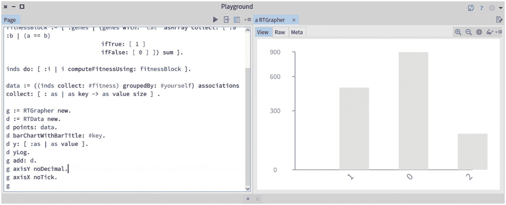
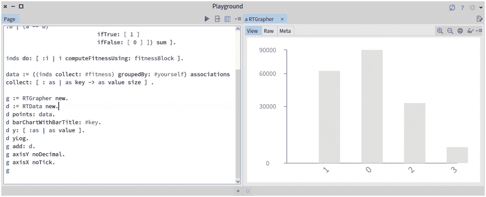
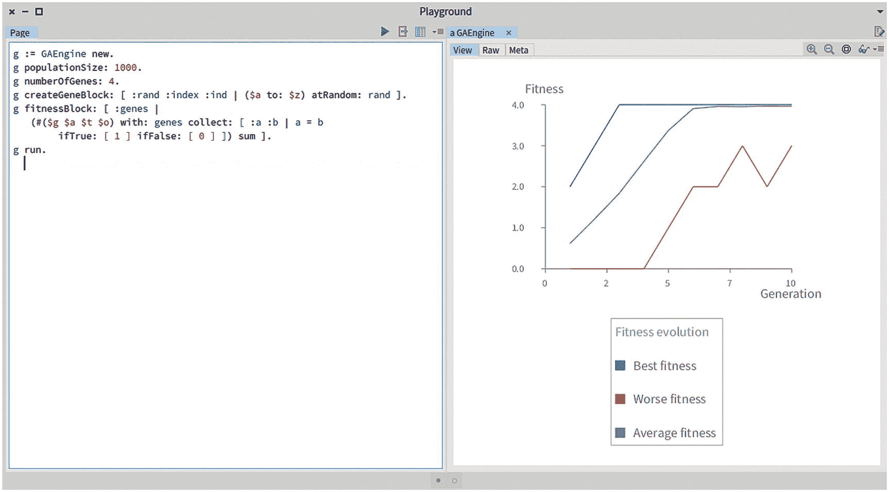

# 八、遗传算法

这本书的第一部分是关于神经网络，一个关于大脑如何运作的计算隐喻。这一章是本书第二部分的第一章，重点是进化论。特别是，它将涵盖遗传算法，一种遗传信息如何重组和代代相传的计算隐喻。这种算法专注于进化如何自然发生的支柱。

这一章是独立的:因此，了解前面的章节并不是享受本章和这一部分后面章节的先决条件。

## 8.1 受自然进化启发的算法

我们，作为人类，是几千年进化的结果。生物进化是指在连续几代中生物种群的遗传特征和属性的一些改变。大多数特征是在繁殖过程中由父母传给后代的基因的表达。

*达尔文自然选择*规定，为了拥有自然进化，必须具备以下成分:

*   遗传:孩子从父母那里获得了许多特性。特别是，如果父母身体健壮，能够活到生育年龄，孩子也应该如此。

*   *变异:*后代可能会引入一些变异。因此，孩子不会是其父母的一模一样的复制品。

*   *选择:*群体中的某些成员必须有机会成为父母并拥有后代，才能传递他们的遗传信息。这种选择通常被称为“适者生存”

计算机科学家对自然进化的发生方式有着浓厚的兴趣。为什么？从非常广泛的角度来看，考虑以下情况:如果人类在地球上是为了解决一个问题，那么这肯定是一个非常复杂的问题。这正是自然进化如此吸引计算机科学家去解决难以置信的复杂问题的原因。按照这种思路，计算机科学家提出了许多算法来模拟进化。例如:

*   *蚁群优化*基于蚂蚁通过信息素交流觅食形成路径的思想。这种算法适用于图形相关的问题。

*   *一种* *蜜蜂算法*是基于蜜蜂的觅食行为。该算法适用于调度和排序问题。

*   *遗传算法*是基于操纵遗传信息的进化模拟。这一章讲的就是这个算法。

遗传算法(GA)是一种模拟种群中 DNA 信息进化的进化算法。遗传算法有三个重要的特性，我们将在书中探讨:

*   遗传算法在解决最优化问题上是有效的。

*   GAs 很容易实现，不需要很强的理论背景。

*   气体可以很容易地与神经网络相结合。在本书的第三部分，当我们关注神经进化的时候，我们将会详细讨论这一点。

## 8.2 遗传算法的示例

遗传算法的总体思想非常简单。想象一下，一个朋友让你解决下面的挑战:“你必须找到我脑海中的三个字母的单词。每次尝试，我都会告诉你正确定位的字母数。”比如假设暗号是猫。首先，我们猜测任何由三个字母组成的随机生成的单词，如 cow、poc 和 gaz。

单词*奶牛*和*猫*有一个字母相同，即秘密单词。因此我们说 *cow* 的分数为 1。单词 *poc* 的得分为`0`，因为它没有与秘密单词匹配的字母。单词 *gaz* 也具有得分`1`，因为字母 *a* 匹配秘密单词的第二个字母。

既然还没有找到解决的办法(即*牛*、 *poc* ，也不是*嘎斯*是密语)，我们就可以通过梳理一些已经有的词语产生新一代的词语。特别是 *gaz* 和 *cow* 可以组合成 *gow* (由 *gaz* 的首字母和 *cow* 的后两个字母组成)和*caz*(*cow*的首字母和 *gaz* 的后两个字母组成)。从这两个新词来看， *caz* 这个词得分为二，非常接近密语。我们说这个第二代单词比前一个更好，因为它更接近解决方案。

可以形成第三代，其中单词 *caz* 可以产生单词 *cat* ，其中 *z* 随机突变为 *t* 。这个小例子说明了遗传算法的总体思想:对一组随机形成的个体中的每个个体进行评估，以计算得分值。接近解决问题的高分数个体被重组以形成新的个体。在详细介绍算法之前，我们先澄清一下本章将要用到的词汇。

## 8.3 相关词汇

我们必须引入几个术语来描述我们将在本章中使用的概念。我们将使用这些适当的概念重新表述给出的例子。

我们称*个体*为包含遗传信息的元素。这样的遗传信息被描述为一系列的*基因*。一个*基因*代表一个信息单元，它可以代表任何东西，从字面上看。在前面的例子中，基因只是一个字母。个人是一个三个字母的单词。

人口是固定数量的个体。种群的规模是不变的，但是它的组成个体在每一代都会被替换。

*适应度函数*表示一个人有多“强壮”。适应度函数是一个简单的函数，它将个体作为参数，并产生一个数值。遗传算法的整体思想是构建和搜索最大化适应度函数的个体。

## 8.4 建模个人

本章包含了 Pharo 中遗传算法的完整实现。所有呈现的代码都被认为是名为`GeneticAlgorithm`的包的一部分。

我们将首先模拟个体。因此，我们将建模一个名为`GAIndividual`的类。我们将创建自定义类`GAObject`的`GAIndividual`子类。我们将`GAObject`定义为`Object`的子类，它有一个`random`变量。

几乎所有涉及遗传算法的元素都需要生成随机数。因此，在我们的实现中，在根层次结构中定义变量是很方便的:

```py
Object subclass: #GAObject
    instanceVariableNames: 'random'
    classVariableNames: ''
    package: 'GeneticAlgorithm-Core'

```

通常，我们将 getter 定义如下:

```py
GAObject>>random
    "Return the random number generator associated to the object"
    ^ random

```

和设置器如下:

```py
GAObject>>random: aRandomNumberGenerator
    "Set the random number generator associated to the object. The
        argument must be an instance of Random."
    random := aRandomNumberGenerator

```

`random:`方法需要一个`Random`类的实例作为参数。我们还定义了一个实用方法来生成一个在`0.0`和`1.0`之间的数字:

```py
GAObject>>randomNumber
    "Return a number between 0.0 and 1.0"
    ^ random next

```

我们可以定义一个子类使用的小工具方法来确保设置一个随机数生成器:

```py
GAObject>>checkForRandomNumber
    self
        assert: [ random notNil ]
        description: 'Need to provide a random number generator'

```

我们准备使用`GAIndividual`类对个体建模:

```py
GAObject subclass: #GAIndividual
    instanceVariableNames: 'genes fitness'
    classVariableNames: ''
    package: 'GeneticAlgorithm-Core'

```

一个个体简单地由它的基因和它的适应值组成。`fitness`变量充当缓存值。计算个体的适应度是遗传算法的基本部分:

```py
GAIndividual>>computeFitnessUsing: fitnessBlock
    "Compute the fitness of myself if not already computed"
    self assert: [ genes notNil ] description: 'Need to have some genes first'.

    "Simply exit if already computed"
    fitness ifNotNil: [ ^ self ].

    "Compute the fitness score"
    fitness := fitnessBlock value: genes

```

我们将使用一个单参数块来计算它的适应性，这个块将个体的基因作为参数。当被评估时，该块返回一个数值，该数值是所提供基因的适合度。

`computeFitnessUsing:`方法用那个值设置`fitness`变量。我们很快会看到一些例子。

一旦计算了适应值，遗传算法的其他部分，包括选择算法，将必须访问它。通过访问器方法可以访问适应度，如下所示:

```py
GAIndividual>>fitness
    "Return the fitness value of the individual"
    ^ fitness

```

来自个体的基因必须是可获得的。特别地，适应度函数需要个体的基因来计算个体适应度。我们定义了一个访问个体基因的方法:

```py
GAIndividual>>genes
    "Return the individual's genes"
    ^ genes

```

当进行交叉遗传操作时，必须在个体中设置新的计算基因。因此，我们需要一种专门的方法来实现这一点:

```py
GAIndividual>>genes: someGenes
    "Set the genes of the individual. Used by the genetic operations."
    genes := someGenes

```

基因的数量可以使用专门的方法获得。这对遗传操作很有用:

```py
GAIndividual>>numberOfGenes
    "Return the number of genes the individual has"
    ^ self genes size

```

`GAIndividual`类的一个基本能力是生成遗传信息。为此，我们将基因工厂定义为 Pharo block 闭包，它接受三个参数——随机数生成器、基因索引和个体。我们为此定义了`set:genesUsing:`方法:

```py
GAIndividual>>set: numberOfGenes genesUsing: geneBlockFactory
    "Public method - Generate the genes of the individual"

    self checkForRandomNumber.
    genes := (1 to: numberOfGenes)
    collect: [ :index | geneBlockFactory cull: random cull: index cull: self ]

```

`set:genesUsing:`的第一个参数是整数。第二个参数是一个需要三个参数的块:

*   *随机数生成器:*这对于让基因工厂随机选择值很有用。

*   *要创建的基因的索引:*当不是所有的基因都必须相同时，这通常是有用的。在这种情况下，基因工厂模块可以基于基因索引选择一些值。

*   *个体本身:*在计算一个基因的时候可能会发生个体不得不被访问的情况。

使用`cull:`评估`set:genesUsing:`方法。因此，如果块中缺少参数，它们将被忽略。例如，我们有以下执行:

```py
[ :x :y | x + y ] cull: 10 cull: 20 cull: 30\. "=> 20"
[ :x :y :z | x + y + z] cull: 10 cull: 20 cull: 30\. "=> 60"
[ 42 ] cull: 10 cull: 20 cull: 30\. "=> 42"

```

我们现在可以为一组个体创建一个有用的工厂方法，作为一个类方法:

```py
GAIndividual class>>create: numberOfIndividuals
    individualsAndInitialize: numberOfGenes genesWith: geneBlockFactory
    using: randomNumberGeneration
    "Factory method to easily create a population of Individuals.
        numberOfIndividuals : number of individuals to return
        numberOfGenes : number of genes each individual should have
        geneBlockFactory : a one-argument block to generate a gene.
           It takes a random generator as an argument
        randomNumberGeneration : a random generator"
    | someIndividuals ind |
    someIndividuals := OrderedCollection new.
    numberOfIndividuals timesRepeat: [
        ind := self new.
        ind random: randomNumberGeneration.
        ind set: numberOfGenes genesUsing: geneBlockFactory.
        someIndividuals add: ind ].
    ^ someIndividuals

```

这种方法旨在创建个体。因此，它就像一个个体工厂。使用工厂方法可以省略随机数生成器:

```py
GAIndividual class>>create: numberOfIndividuals
    individualsAndInitialize: numberOfGenes genesWith: geneBlockFactory
    "Factory method to easily create a number of Individuals.
        numberOfIndividuals : the number of individuals to return
        numberOfGenes : number of genes each individual should have
        geneBlockFactory : is a one-argument block to generate a gene.
            It takes a random generator as an argument"
    ^ self create: numberOfIndividuals individualsAndInitialize

:
        numberOfGenes genesWith: geneBlockFactory using: (Random new seed: 42)

```

这个工厂方法返回一组初始化的个体。我们现在可以测试`GAIndividual`类了。为此，我们创建了`GAIndividualTest`测试，它是`TestCase`的子类:

```py
TestCase subclass: #GAIndividualTest
    instanceVariableNames: ''
    classVariableNames: ''
    package: 'GeneticAlgorithm-Tests'

```

作为一个简单的测试，我们可以创建 100 个个体，每个个体有 10 个基因:

```py
GAIndividualTest>>testCreationWithCharacters
    | r individuals f ind |
    r := Random seed: 42.
    f := [ :random | ($a to: $z) atRandom: random ].
    individuals := GAIndividual
        create: 100
        individualsAndInitialize: 10
        genesWith: f
        using: r.

    self assert: individuals size equals: 100.
    self assert: (individuals collect: #numberOfGenes) asSet asArray
        equals: #(10).

    ind := individuals anyOne.
    self assert: (ind genes allSatisfy: [ :c | ($a to: $z) includes: c ]).

```

在我们第一次给出的遗传算法的例子中，算法要猜单词 *cat* 。我们现在可以用一些个体来猜测这个单词。

考虑以下脚本:

```py
inds := GAIndividual
            create: 1000
            individualsAndInitialize: 3
            genesWith: [ :r | ($a to: $z) atRandom: r ].
fitnessBlock := [ :genes |
    (genes with: 'cat' asArray collect: [ :a :b | (a == b)
        ifTrue: [ 1 ]
        ifFalse: [ 0 ] ]) sum ].
inds do: [ :i | i computeFitnessUsing: fitnessBlock ].

```

该脚本首先创建一些个体，每个个体有三个字母作为基因。请注意，创建基因的代码块将一个随机数生成器作为参数。即使使用随机数，对表达式求值也会产生完全相同的个体。然后计算每个个体的适应度。适应性值返回一个分数，该分数描述了个体与解决方案的接近程度。

在执行这个简短的脚本后，每个个体都有一个适合度值。总的来说，适应值的范围是从`0`到`3`。一个适应度为`3`的个体匹配解，这意味着它的基因等于`#($c $a $t)`。

作为评估每个人表现的一种简单而直观的方法，我们可以绘制一个个人适应度直方图(见图 [8-1](#Fig1) ):



图 8-1

可视化 1000 个人的体能分布

```py
...
data := ((inds collect: #fitness) groupedBy: #yourself) associations
            collect: [ : as | as key -> as value size ].

g := RTGrapher new.
d := RTData new.
d points: data.
d barChartWithBarTitle: #key.
d y: [ :as | as value ].
d yLog.
g add: d.
g axisY noDecimal.
g axisX noTick.
g

```

使用垂直对数标度，图形显示从 1000 个初始个体中，880 个个体具有适应度`0`，113 个个体具有适应度`1`，只有 7 个个体具有适应度`2`。没有一个有`3`的适应度。

如果我们后退一点，我们会发现由三个字母组成的单词 *cat* 。这意味着我们可以将搜索的空间公式化为一个三维空间，其中每个维度的范围从 1 到 26。单词*猫*是那个空间中的一个点。

在之前的脚本中，我们只有 1000 个单词，因此我们没有找到秘密单词并不奇怪。让我们这次用 10 万个人再试一次。完整的脚本如下(见图 [8-2](#Fig2) ):



图 8-2

可视化 100，000 个个体的健康分布

```py
inds := GAIndividual
            create: 100000
            individualsAndInitialize: 3
            genesWith: [ :r | ($a to: $z) atRandom: r ].

fitnessBlock := [ :genes | (genes with: 'cat' asArray collect: [ :a :b
| (a == b)
              ifTrue: [ 1 ]
              ifFalse: [ 0 ] ]) sum ].

inds do: [ :i | i computeFitnessUsing: fitnessBlock ].

data := ((inds collect: #fitness) groupedBy: #yourself) associations
    collect: [ : as | as key -> as value size ].

g := RTGrapher new.
d := RTData new.
d points: data.
d barChartWithBarTitle: #key.
d y: [ :as | as value ].
d yLog.
g add: d.
g axisY noDecimal.
g axisX noTick.
g

```

将鼠标光标移动到第 3 栏上方，会显示已经创建了四个带有秘密单词的个人。我们将会看到，通过使用遗传算法，发现秘密单词所需的个体数量明显减少。

## 8.5 交叉遗传操作

遗传算法使用遗传操作来产生新的个体。生物学认可两种操作:*交叉、*将两个个体结合成一个新个体，以及*突变、*产生一个带有零星基因变异的新个体。

我们将提供这两个操作符的实现，但是让我们的实现对新的遗传操作开放是很重要的。一些特定的操作可能对显著加速向解决方案的收敛至关重要。在这一章中，我们将重点讨论变异和交叉。当我们在第 [14](14.html) 章和第 [15](15.html) 章讲述神经进化时，我们将需要不同的突变和交叉操作。

我们可以将`GAOperation`类定义为所有操作的根类。

```py
GAObject subclass: #GAOperation
    instanceVariableNames: ''
    classVariableNames: ''
    package: 'GeneticAlgorithm-Core'

```

我们可以定义交叉的层次结构如下:

```py
GAOperation subclass: #GAAbstractCrossoverOperation
    instanceVariableNames: ''
    classVariableNames: ''
    package: 'GeneticAlgorithm-Core'

```

我们现在可以用下面的方法实现交叉操作:

```py
GAAbstractCrossoverOperation>>crossover: partnerA with: partnerB
    "Return a new child, which is the result of mixing myself with the argument"
    ^ self crossover: partnerA with: partnerB midpoint: (self pickCutPointFor: partnerA)

```

`crossover:with:`方法接受两个人作为参数。一个新的个体产生了，双亲的遗传信息混合在一起。考虑这种方法:

```py
GAAbstractCrossoverOperation>>crossover: partnerA with: partnerB
    midpoint: midpoint
    "Return a new child, which is the result of mixing myself with the argument"

    | child crossOverGenes |
    child := GAIndividual new.
    child random: random.
    crossOverGenes := (partnerA genes first: midpoint),
        (partnerB genes allButFirst: midpoint).
    child genes: crossOverGenes.
    ^ child

```

`crossover:with:midpoint:`方法接受一个切割点作为第三个参数。`first:midpoint`调用返回第一个`midpoint`元素，`allButFirst:midpoint`调用返回第一个`midpoint`元素之后的元素。比如`'abcdefghi' first: 3`返回`'abc'`，`'abcdefghi'allButFirst: 3`返回`'defghi'`。

我们定义了一个抽象方法，它将在子类中实现:

```py
GAAbstractCrossoverOperation>>pickCutPointFor: anIndividual
    "Need to be overridden in subclasses"
    self subclassResponsibility

```

必须在每个子类中覆盖`pickCutPointFor:`方法。我们将`GACrossoverOperation`类定义如下:

```py
GAAbstractCrossoverOperation subclass: #GACrossoverOperation
    instanceVariableNames: ''
    classVariableNames: ''
    package: 'GeneticAlgorithm-Core'

```

`GACrossoverOperation`类覆盖了`pickCutPointFor:`方法:

```py
GACrossoverOperation>>pickCutPointFor: partnerA
    "Simply returns a random number between 1 and the number of genes of the individual provided as an argument"
    ^ random nextInt: partnerA numberOfGenes

```

我们现在可以测试我们的交叉操作:

```py
TestCase subclass: #GACrossoverOperationTest
    instanceVariableNames: 'i1 i2 op'
    classVariableNames: ''
    package: 'GeneticAlgorithm-Tests'

```

测试定义了三个变量— `i1`、`i2`和`op`。这些变量定义了测试夹具，它们在`setUp`方法中被初始化:

```py
GACrossoverOperationTest>>setUp
    super setUp.
    i1 := GAIndividual new genes: 'abcd'.
    i2 := GAIndividual new genes: 'defg'.
    op := GACrossoverOperation new.

```

我们现在可以测试不同的组合。在第一个场景中，中点是`2`，这意味着生成的基因将具有`i1`的前两个字母和`i2`的后两个字母:

```py
GACrossoverOperationTest>>testCrossover1
    | i3 |
    i3 := op crossover: i1 with: i2 midpoint: 2.
    self assert: i3 genes equals: 'abfg'

```

在第二种情况下，中点是`1`:

```py
GACrossoverOperationTest>>testCrossover2
    | i3 |
    i3 := op crossover: i1 with: i2 midpoint: 1.
    self assert: i3 genes equals: 'aefg'

```

在第三个场景中，中点是`0`，这意味着生成的个人拥有`i2`的所有字母:

```py
GACrossoverOperationTest>>testCrossover3
    | i3 |
    i3 := op crossover: i1 with: i2 midpoint: 0.
    self assert: i3 genes equals: 'defg'

```

我们还可以使用下面的测试来测试`crossover:with:`方法:

```py
GACrossoverOperationTest>>testCrossover4
    | i3 |
    op random: (Random seed: 42).
    i3 := op crossover: i1 with: i2.
    self assert: i3 genes equals: 'aefg'

```

我们现在已经提供了交叉操作的完整实现。交叉操作的效果是使种群向搜索空间中的特定点收敛。在遗传算法中， *exploitation* 通常指的是将群体引向好的解决方案，并有希望达到全局最优的能力。

## 8.6 突变遗传操作

遗传算法的适当配置是在*开发*和*探索*这两个重要概念之间取得平衡。利用是应用交叉的结果。该算法通过重组个体来利用个体中包含的遗传信息。

另一方面，探索与突变联系在一起。变异是在搜索空间中探索新的区域，具有避免收敛的效果。

可以定义许多突变操作。因此，我们将使我们的代码库对新的变异操作开放。使用 Pharo 这样的面向对象编程语言来实现这一点的自然方法是将这些操作表示为类的层次结构。考虑下面的抽象类:

```py
GAOperation subclass: #GAAbstractMutationOperation
    instanceVariableNames: 'mutationRate'
    classVariableNames: ''
    package: 'GeneticAlgorithm-Core'

```

我们将定义的所有变异操作至少有一个公共变量，即变异率。因此，我们将该比率定义为一个实例变量。通常，该变量的值是一个小正数，接近于`0.0`并且显著小于`1.0`。我们默认设置它:

```py
GAAbstractMutationOperation>>initialize
    super initialize.
    self mutationRate: 0.01

```

`0.01`值表示每个个体 1%的基因会被修改。突变率是一个较低的值，能够探索一些特定的领域。比率值很低，但是任何特定的准则都与要解决的问题紧密相关。因此，必须尝试不同的值来找到最合适的速率。

可以使用以下方法访问`mutationRate`变量:

```py
GAAbstractMutationOperation>>mutationRate
    "Return the used mutation rate. Typically, a small positive number, close to 0.0 and significantly less than 1.0"
    ^ mutationRate

```

`mutationRate`变量可通过以下方式设置:

```py
GAAbstractMutationOperation>>mutationRate: aFloat
    "Set the mutation rate. Typically, a small positive number, close to 0.0 and significantly less than 1.0"
    mutationRate := aFloat

```

`mutation`操作类的关键方法是`mutate:`，它将一个个体作为参数，*产生一个新的个体*，这是参数变异的结果:

```py
GAAbstractMutationOperation>>mutate: individual
    "Return a new individual (different object than the argument),
        result of a mutation from the individual provided as an argument."
    | newIndividual |
    newIndividual := GAIndividual new.
    newIndividual random: random.
    newIndividual genes: individual genes copy.
    self doMutate: newIndividual.
    ^ newIndividual

```

`mutate:`方法以一个个体作为自变量，产生一个新的个体，这个新的个体是自变量变异的结果。该方法只是复制参数并调用`doMutate:`方法。`doMutate:`方法很抽象:

```py
GAAbstractMutationOperation>>doMutate: individual
    "To be overridden"
    self subclassResponsibility

```

大多数突变操作需要一种方法来创建一个单独的基因。我们添加空方法，如下所示:

```py
GAAbstractMutationOperation>>geneFactoryBlock: oneArgBlock
    "Do nothing. May be overridden if necessary"

```

该方法必须在子类中被覆盖。注意这个方法是由`GAEngine`调用的，我们将在本章后面看到。我们现在可以定义标准的变异操作。考虑这个类:

```py
GAAbstractMutationOperation subclass: #GAMutationOperation
    instanceVariableNames: 'geneFactoryBlock'
    classVariableNames: ''
    package: 'GeneticAlgorithm-Core'

```

变异操作符需要一种定义新基因的方法。我们将使用用`GAIndividual`类表达的相同需求。`geneFactoryBlock`变量指的是创建基因的一个参数块。该块接收一个随机数作为参数。`geneFactoryBlock:`方法将块设置为操作:

```py
GAMutationOperation>>geneFactoryBlock: oneArgBlock
    "The block receives a random number as an argument"
    geneFactoryBlock := oneArgBlock

```

可以使用以下方法访问该块:

```py
GAMutationOperation>>geneFactoryBlock
    "Return the three-arg block used to create a gene, following the
        pattern
    [ :rand :index :ind | ... ]
    rand is the random number generator,
    index is index of the gene,
    ind is the individual being filled"

    ^ geneFactoryBlock

```

正如我们之前看到的，`geneFactoryBlock`变量指的是一个三参数块，第一个参数是随机数，第二个是基因的索引，第三个是个体。

为了在使用变异操作时获得帮助，我们定义了一个实用方法，以便在没有设置`geneFactoryBlock`的情况下引发错误。这种方法对于捕捉常见错误非常有用:

```py
GAMutationOperation>>checkForGeneFactory
    self
        assert: [ geneFactoryBlock notNil ]
        description: 'Need to provide a block to create gene'

```

`GAMutationOperation`的核心方法是`doMutate:`。我们将其定义如下:

```py
GAMutationOperation>>doMutate: individual
    "Mutate genes of the argument"
    self checkForRandomNumber.
    self checkForGeneFactory.
    1 to: individual genes size do: [ :index |
        self randomNumber <= mutationRate
            ifTrue: [ individual genes at: index put: (geneFactoryBlock
                cull: random cull: index cull: individual) ] ]

```

`GAMutationOperation`级可以适当测试。考虑这个类:

```py
TestCase subclass: #GAMutationOperationTest
    instanceVariableNames: 'i op'
    classVariableNames: ''
    package: 'GeneticAlgorithm-Tests'

```

`setUp`方法定义如下:

```py
GAMutationOperationTest>>setUp
    super setUp.
    i := GAIndividual new genes: 'abcd' asArray.
    op := GAMutationOperation new.

```

我们可以用以下方法测试这种变异:

```py
GAMutationOperationTest>>testMutation
    | i2 |
    op random: (Random seed: 7).
    op geneFactoryBlock: [ :r | ($a to: $z) atRandom: r ].
    op mutationRate: 0.5.

    i2 := op mutate: i.
    self assert: i2 genes equals: 'xfcd' asArray.

    i2 := op mutate: i2.
    self assert: i2 genes equals: 'tfcd' asArray

.

    i2 := op mutate: i2.
    self assert: i2 genes equals: 'tfjd' asArray.

```

可以使用以下方法测试错误案例:

```py
GAMutationOperationTest>>testRandomAndGeneFactoryMustBeSet
    self should: [ op mutate: i ] raise: AssertionFailure.

    op random: Random new.
    self should: [ op mutate: i ] raise: AssertionFailure.

    op geneFactoryBlock: [ :r | 42 ].
    self shouldnt: [ op mutate: i ] raise: AssertionFailure.

```

变异运算符现在已经实现。我们的下一步涉及选择机制。

## 8.7 父母选择

能够选择一个个体并将其提升为父代是至关重要的。一些个体理应进入繁殖阶段，而选择算法是它的核心。

因为存在几种选择机制，所以我们将定义选择机制的层次结构。`GASelection`类是一个相对较大且复杂的类。它与`GAEngine`类紧密相关，我们将在本章后面介绍。

`GASelection`类可定义如下:

```py
Object subclass: #GASelection
    instanceVariableNames: 'population fittest initialPopulation
        fitnessBlock populationSize compareFitness engine'
    classVariableNames: ''
    package: 'GeneticAlgorithm-Core'

```

`GASelection`引用了一组`GAIndividual`实例。`GASelection`的目的是根据一个策略挑选最合适的个体，由`GASelection`的子类实现。选择也知道`initialPopulation`，这是推导出大小为`populationSize`的新`population`所必需的。`fitnessBlock`告诉选择如何计算每个个体的适应度。`compareFitness`变量引用一个双参数块，该块指示两个适合度值中的哪一个是最好的。在某些情况下，高适合度值表示个体良好；在其他情况下，高适合度值可能表示个人不好。`engine`变量引用遗传算法引擎。

首先，我们为`GASelection`提供一个简单的构造函数，如下所示:

```py
GASelection>>initialize
    super initialize.
    population := OrderedCollection new.

```

我们提供了一些访问器和一些赋值器方法。考虑一下`engine`方法:

```py
GASelection>>engine
    "Return the GAEngine to which the selection is associated"
    ^ engine

```

`engine`的变异函数可能如下:

```py
GASelection>>engine: theEngine
    "Set the GAEngine to which I have to be associated with"
    engine := theEngine.
    self checkIfEngineSet

```

我们提供一个简单的保护，定义如下:

```py
GASelection>>checkIfEngineSet
    self assert: [ engine notNil ] description: 'Should set the engine'

```

可以通过以下方式访问该群体:

```py
GASelection>>population
    "Return the new population"
    ^ population

```

可以使用`fitnessBlock:`访问健身块:

```py
GASelection>>fitnessBlock: aOneArgBlock
    "The argument is evaluated on the genes of each individual.
    The block argument has to compute the fitness."
    fitnessBlock := aOneArgBlock

```

可使用`fitnessBlock`访问健身块，如下所示:

```py
GASelection>>fitnessBlock
    "Return the one-arg block used to compute fitness of each
        individual"
    ^ fitnessBlock

```

使用`fittest`方法可获得最合适的元素:

```py
GASelection>>fittest
    "Return the fittest individual from the new population"
    ^ fittest

```

可以使用专用方法来设置初始群体:

```py
GASelection>>initialPopulation: aPopulationAsIndividuals
    "Set the initial population. This is used to create the new
        population"
    initialPopulation := aPopulationAsIndividuals.
    self checkIfInitialPopulationSet

```

我们提供了一个新的实用方法来尽早捕捉错误:

```py
GASelection>>checkIfInitialPopulationSet
    self assert: [ initialPopulation notNil ]
        description: 'Should set the initial population'.
    self assert: [ initialPopulation isCollection ]
        description: 'Has to be a collection'.
    self assert: [ initialPopulation notEmpty ]
        description: 'Cannot be empty'

```

如果初始群体设置不正确，`checkIfInitialPopulationSet`方法会引发一个错误。比较适应值的方式可以设置如下:

```py
GASelection>>compareFitness: aTwoArgBlock
    "Take as an argument a two-argument block that compares the
        fitness of two individuals"
    compareFitness := aTwoArgBlock

```

可以使用以下公式读取群体大小:

```py
GASelection>>populationSize
    "Return the population size"
    ^ initialPopulation size

```

使用以下内容设置群体大小:

```py
GASelection>>populationSize: anInteger
    "Set the population size"
    populationSize := anInteger

```

随后，我们定义了一些描述选择逻辑的基本方法。抽象方法`createNewPopulation`必须在子类中被覆盖。它的目的是创造一个新的种群:

```py
GASelection>>createNewPopulation
    "Create a new population"
    self subclassResponsibility

```

`GASelection`类的一个基本方法是能够执行选择。这就是`doSelection`方法的作用:

```py
GASelection>>doSelection
    "Produce a new population using the selection algorithm"
    self checkIfEngineSet.
    self checkIfInitialPopulationSet.
    populationSize := initialPopulation size.
    fittest := initialPopulation first.
    initialPopulation
        do: [ :ind |
            ind computeFitnessUsing: fitnessBlock.
            (self isIndividual: ind betterThan: fittest)
                ifTrue: [ fittest := ind ] ].
    self createNewPopulation.
    initialPopulation := population.

```

该方法首先执行一些健全性检查。这些检查旨在帮助用户正确使用所提供的代码。

我们将定义一些实用方法来简化算法逻辑的表达方式。例如，交叉操作可以通过使用以下方式委托:

```py
GASelection>>crossover: partnerA with: partnerB
    "Return one child, result of the crossover over the two arguments"
    ^ engine crossover: partnerA with: partnerB

```

个人之间的比较可定义如下:

```py
GASelection>>isIndividual: ind betterThan: fittestIndividual
    "Is the first individual better than the second?"
    ^ engine isIndividual: ind betterThan: fittestIndividual

```

变异操作可以通过使用以下命令来调用:

```py
GASelection>>mutate: child
    "Perform a mutation on the argument"
    ^ engine mutate: child

```

为了在特定间隔内产生随机数，我们需要产生随机数:

```py
GASelection>>randomNumber: value
    "Return a number between 1 and value"
    ^ engine randomNumber: value

```

有几种选择策略可用于从群体中选择一个个体作为亲本。一种流行且有效的选择策略被称为*锦标赛* *，*，其操作如下:它从群体中随机挑选若干个体，并识别具有最佳适应性的个体。这种认同就像成对的个体之间的竞争。竞争是在少数人身上进行的。任意地，我们将考虑每场比赛是五个人。获胜的个体从算法中返回。

我们将`GATournamentSelection`类定义如下:

```py
GASelection subclass: #GATournamentSelection
    instanceVariableNames: 'tournamentSize'
    classVariableNames: ''
    package: 'GeneticAlgorithm-Core'

```

在我们的例子中，`tournamentSize`变量表示锦标赛应该有多大。默认情况下，该值设置为`5`:

```py
GATournamentSelection>>initialize
    super initialize.
    tournamentSize := 5

```

我们实现算法如下:

```py
GATournamentSelection>>getGoodIndividual
    "Return the best individual from tournamentSize individual randomly
        chosen from the population"
    | best ind |
    best := nil.
    tournamentSize timesRepeat: [
        ind := initialPopulation at: (self randomNumber:
            initialPopulation size).
        (best isNil or: [ compareFitness value: ind fitness value: best
            fitness ])
            ifTrue: [ best := ind ] ].
    ^ best

```

最后，可以使用以下内容创建新的群体:

```py
GATournamentSelection>>createNewPopulation
    "Return a new population made of newly breed individual"
    | partnerA partnerB child |
    population := (1 to: self populationSize) collect: [ :seed |
      engine random: (Random seed: seed).
      partnerA := self getGoodIndividual.
      partnerB := self getGoodIndividual.
      child := self mutate: (self crossover: partnerA with: partnerB).
      child computeFitnessUsing: engine fitnessBlock.
      child.
    ]

```

`createNewPopulation`方法实现了遗传算法的逻辑:它从群体中挑选两个元素，在它们之间进行交叉，对结果进行变异，并计算添加到新群体中的每个新元素的适合度。

## 8.8 演进监控

能够监控算法的执行是至关重要的。例如，有一个终止条件来指示算法何时必须停止是很重要的。我们将创建一个专门的类来监控算法的进展。考虑一下`GALog`类:

```py
Object subclass: #GALog
    instanceVariableNames: 'generationNumber timeToProduceGeneration
       fittestIndividual worseFitness averageFitness'
    classVariableNames: ''
    package: 'GeneticAlgorithm-Core'

```

`GALog`的一个实例与一代相关联，并包含指示遗传算法进展的相关信息。

从群体中识别最佳个体是非常相关的:

```py
GALog>>fittestIndividual
    "Return the best individual of the generation I represent"
    ^ fittestIndividual

```

最佳个体将由遗传算法引擎设定，我们很快就会看到:

```py
GALog>>fittestIndividual: anIndividual
    "Set the best individual of the generation I represent"
    fittestIndividual := anIndividual

```

`fitness`方法返回群体中最佳个体的适应值:

```py
GALog>>bestFitness
    "Return the best fitness value of a generation I am representing"
    ^ fittestIndividual fitness

```

使用`averageFitness`方法获得群体的平均适应度:

```py
GALog>>averageFitness
    "Return the average fitness value of a generation I am representing
"
    ^ averageFitness

```

平均适合度可通过以下方式设置:

```py
GALog>>averageFitness: aNumber
    "Set the average fitness value of a generation I am representing"
    averageFitness := aNumber

```

类似地，通过使用以下公式获得最低的适应性分数:

```py
GALog>>worseFitness
    "Return the worse fitness value of a generation I am representing"
    ^ worseFitness

```

引擎通过使用以下内容来设置最差的适应性分数:

```py
GALog>>worseFitness: aNumber
    "Set the worst fitness value of a generation I am representing"
    worseFitness := aNumber

```

还必须跟踪世代的数量。`generationNumber`表示日志对象引用的层代号:

```py
GALog>>generationNumber
    "Return the generation number I represent"
    ^ generationNumber

```

类似于最适者的个体，世代号是由引擎设定的，我们很快就会看到:

```py
GALog>>generationNumber: generationNumberAsInteger
    "Set the generation number I am representing"
    generationNumber := generationNumberAsInteger

```

在某些情况下，监控消耗的资源也是明智的。产生新一代所需的时间很重要，需要跟踪:

```py
GALog>>timeToProduceGeneration
    "Time to produce the generation I represent"
    ^ timeToProduceGeneration

```

同样，引擎将设置该值:

```py
GALog>>timeToProduceGeneration: anInteger
    "Set the time to produce the generation I am representing"
    timeToProduceGeneration := anInteger

```

打印结果的简单方法很有用。`Object`类定义了`printOn:`方法，它负责提供对象的文本表示。通过覆盖此方法，我们将使日志对象的文本表示更有意义:

```py
GALog>>printOn: str
    "Printing the log object"
    super printOn: str.
    str nextPut: $<.
    str nextPutAll: fittestIndividual genes asString.
    str nextPut: $>.

```

我们现在已经建立了一个坚实的基础，在此基础上我们可以实现算法。

## 8.9 遗传算法引擎

引擎是一个使用遗传算法的中心类。它提供了配置和运行遗传算法的方法。我们可以将该类定义如下:

```py
GAObject subclass: #GAEngine
    instanceVariableNames: 'fitnessBlock createGeneBlock numberOfGenes
        populationSize logs population terminationBlock compareFitness
        mutationOperator crossoverOperator selection
        beforeCreatingInitialIndividual'
    classVariableNames: ''
    package: 'GeneticAlgorithm-Core'

```

`GAEngine`是一个复杂且相对较长的类。它有许多变量:

*   `fitnessBlock`是一个只有一个参数的块。它以每个个体的基因作为自变量，返回个体的适应度。

*   `createGeneBlock`指基因块工厂。

*   `numberOfGenes`表示每个个体拥有的基因数量。

*   `populationSize`是人口的规模。

*   `logs`是指`GALog`的实例集合。这个变量保存了算法的进化史。

*   `population`指个体人口。

*   `terminationBlock`是指示算法何时必须停止的块。该块表示终止条件，并且不带参数。

*   `compareFitness`是一个双参数块，取两个适应度值。方块表示哪一个适合度比另一个更好。

*   `mutationOperator`是变异算子。

*   `crossoverOperator`是交叉算子。

*   `selection`指选择算法。

*   `beforeCreatingInitialIndividual`包含一个单参数块，在创建初始群体的个体之前对其进行评估。该块将一个随机数生成器作为参数。

一些访问器是用户配置算法所必需的。请注意，本章末尾提供了一个使用该算法的示例。`createGeneBlock:`方法用于说明基因是如何产生的:

```py
GAEngine>>createGeneBlock: threeArgBlock
    "Three arguments must be provided rand, index, and the individual
        being filled"
    createGeneBlock := threeArgBlock.
    mutationOperator geneFactoryBlock: threeArgBlock

```

`fitnessBlock:`方法用于指示如何计算适应性:

```py
GAEngine>>fitnessBlock: aOneArgBlock
    "The argument is evaluated on the genes of each individual.
    The block argument has to compute the fitness."
    fitnessBlock := aOneArgBlock

```

`fitnessBlock`可以使用一种方法获得(选择算法使用它):

```py
GAEngine>>fitnessBlock
    "Return the fitness block used by the engine"
    ^ fitnessBlock

```

我们还使用这个方法提供了一个`beforeCreatingInitialIndividual:`变量的访问器:

```py
GAEngine>>beforeCreatingInitialIndividual: aOneArgBlock
    "Set the behavior to be executed before creating an individual.
    The block takes a random number generator as an argument."
    beforeCreatingInitialIndividual := aOneArgBlock

```

突变率可通过以下方式设置:

```py
GAEngine>>mutationRate: aFloat
    "Set the mutation rate used by the engine. The default value is
0.01"
    mutationOperator mutationRate: aFloat.

```

每个个体的基因数量设置如下:

```py
GAEngine>>numberOfGenes: anInteger
    "Set the number of genes each individual will have"
    numberOfGenes := anInteger

```

可以使用`crossoverOperator:`方法设置交叉操作:

```py
GAEngine>>crossoverOperator: aCrossoverOperator
    "Set the crossover operator used in the algorithm"
    crossoverOperator := aCrossoverOperator.
    crossoverOperator random: random

```

突变操作可以设置如下:

```py
GAEngine>>mutationOperator: aMutationOperator
    mutationOperator := aMutationOperator.
    aMutationOperator random: random

```

使用以下内容配置群体的大小:

```py
GAEngine>>populationSize: anInteger

    "Set the population size"
    populationSize := anInteger

```

可以使用专用方法设置选择运算符，如下所示:

```py
GAEngine>>selection: aSelection
    "Set the selection method to be used to create a new population"
    selection := aSelection.
    aSelection engine: self.

```

锦标赛对象被用作`selection:`的参数。可以使用以下方法访问`selection`变量:

```py
GAEngine>>selection
    "Return the selection operator"
    ^ selection

```

在许多情况下，更好的个体是具有最高适应值的个体:

```py
GAEngine>>maximizeComparator
    "A better individual is the one with the highest fitness value"
    compareFitness := [ :f1 :f2 | f1 > f2 ]

```

然而，更好的个体可能是价值最低的个体:

```py
GAEngine>>minimizeComparator
    "A better individual is the one with the lowest fitness value"
    compareFitness := [ :f1 :f2 | f1 < f2 ]

```

引擎的构造函数如下:

```py
GAEngine>>initialize
    super initialize.
    logs := OrderedCollection new.
    random := Random seed: 42.
    self endForMaxNumberOfGeneration: 10.
    populationSize := 10.
    self maximizeComparator.
    mutationOperator := GAMutationOperation new.
    mutationOperator mutationRate: 0.01.
    mutationOperator random: random.

    crossoverOperator := GACrossoverOperation new.
    crossoverOperator random: random.

    self selection: GATournamentSelection new.

    beforeCreatingInitialIndividual :=
            [ :rand | "do nothing per default" ]

```

如您所见，几个参数都有默认值。`fitnessBlock`从引擎传递到`selection`:

```py
GAEngine>>beforeRun
    "Method executed before creating the initial population"
    self checkIfReadyToRun.
    selection fitnessBlock: fitnessBlock.
    selection populationSize: populationSize

```

如果算法设置不正确，`checkIfReadyToRun`方法会引发异常:

```py
GAEngine>>checkIfReadyToRun
    "Raise an exception if the configuration is not ready to be run"
    self assert: [ fitnessBlock notNil ]
        description: 'Need to set a fitnessBlock'.
    self assert: [ createGeneBlock notNil ]
        description: 'Need to set a createGeneBlock'.
    self assert: [ numberOfGenes notNil ]
        description: 'Need to set how many genes you wish to have,
           using numberOfGenes:'.
    self assert: [ logs isEmpty ]
        description: 'Already been run'.

```

特别是，如果算法有一个`fitnessBlock`、一个`createGeneBlock`和一个`numberOfGenes`，那么它就可以运行。此外，它不应该以前运行过(即`logs`变量必须为空)。

当引擎被要求执行交叉操作时，它只是将其委托给操作对象:

```py
GAEngine>>crossover: partnerA with: partnerB
    "Perform a crossover operation between the two arguments"
    ^ crossoverOperator crossover: partnerA with: partnerB

```

类似地，当引擎被要求对个体进行变异时，它简单地将其委托给相应的操作符:

```py
GAEngine>>mutate: individual
    "Mutate the child provided as an argument"
    ^ mutationOperator mutate: individual

```

初始群体的定义如下:

```py
GAEngine>>initializePopulation
    self checkForRandomNumber.
    population := OrderedCollection new.
    populationSize timesRepeat: [
        | ind |
        beforeCreatingInitialIndividual value: random.
        ind := GAIndividual new.
        population add:
            (ind
                random: random;
                set: numberOfGenes genesUsing: createGeneBlock) ]

```

确定两个人中谁更好是至关重要的。我们使用以下方法:

```py
GAEngine>>isIndividual: anIndividual betterThan: aFittestIndividual
    "Compare an individual against the fittest individual of the population"
    ^ compareFitness value: anIndividual fitness value:
        aFittestIndividual fitness

```

可以使用简单的变量访问器来获取日志:

```py
GAEngine>>logs
    "Return the logs of the run"
    ^ logs

```

这里是算法的中心方法。`GAEngine>>run`方法是算法的入口点:

```py
GAEngine>>run
    "Public method -- Run the genetic algorithm"

    | t log |
    self beforeRun.
        self initializePopulation.
    selection initialPopulation: population.
    selection compareFitness: compareFitness.
    UIManager default
        informUserDuring: [ :bar |
            | gen |
            gen := 0.
            [ self shouldTerminate ] whileFalse: [ gen := gen + 1.
                bar label: gen asString.
                self microPause.
                t := Time now asSeconds.
                self produceNewPopulation.

                log := GALog new.
                log generationNumber: gen.
                log fittestIndividual: selection fittest.
                log worseFitness: ((population collect: #fitness)
                   inject: log bestFitness into: [ :wFit :current | (
                   compareFitness value: wFit value: current) ifTrue: [
                   current ] ifFalse: [ wFit ] ]).
                log averageFitness: (population collect: #fitness)
                   average asFloat.
                log timeToProduceGeneration: Time now asSeconds - t.
                logs add: log ] ]

```

算法运行时，让系统广播自己的进度是必不可少的。因此我们添加了`microPause`方法，`which`使得当前正在运行的线程可以让其他线程做一些工作:

```py
GAEngine>>microPause
    "Useful when you wish to log in the Transcript and see progresses"
     (Delay forMilliseconds: 1) wait.
    World doOneCycleNow.

```

`produceNewPopulation`方法是引擎的核心:

```py
GAEngine>>produceNewPopulation
    "This method
        - produces a new population, set in the variable 'population'
        - select the fittest element of the population"
    selection doSelection.
    population := selection population.

```

我们还采用了一个小的实用方法来产生随机数:

```py
GAEngine>>randomNumber: maxNumber
    "Return a number between 1 and maxNumber"
    ^ random nextInt: maxNumber

```

使用`result`方法访问算法的结果:

```py
GAEngine>>result
    "Return the genes of the fittest individual. This method is
       expected to be executed after #run has completed"
    ^ self logs last fittestIndividual genes

```

## 8.10 终止算法

我们现在进入最后一批方法，完成我们算法的实现。配置遗传算法时的一个重要方面是确定算法执行何时必须停止。

终止算法执行是一个应该仔细考虑的敏感问题。例如，如果我们可以明确地说它已经找到了解决方案，那么终止条件是微不足道的:当我们找到解决方案时就停止。然而，对于许多问题，我们不知道最优解是什么样的。在这种情况下，我们可以要求算法在特定数量的代之后停止，或者如果适应度在几代之后没有变得更好，则停止。为了停止算法应该满足的条件可能取决于许多不同的因素(例如，是否存在精确解并且可以找到精确解)。

`shouldTerminate`方法指示算法是否必须终止。如果没有注册日志，这意味着算法没有运行，在这种情况下，我们评估`terminationBlock`变量:

```py
GAEngine>>shouldTerminate
    logs ifEmpty: [ ^ false ].
    ^ terminationBlock value

```

下面的方法根据特定的策略定义了`terminationBlock`变量。`endForMaxNumberOfGeneration:`方法根据世代数定义终止条件。算法在特定数量的生成后停止:

```py
GAEngine>>endForMaxNumberOfGeneration: nbOfGenerations
    "End the algorithm after a fixed number of generations"
    terminationBlock :=
        [ logs last generationNumber >= nbOfGenerations ]

```

可能发生的情况是，如果适合度高于特定值，则最适合的个体可能被认为是可接受的解决方案。在这种情况下，没有理由追求算法的执行:

```py
GAEngine>>endIfFitnessIsAbove: aFitnessValueThreshold
    "End the algorithm if the best fitness value is above a particular
        threshold"
    terminationBlock :=
         [ logs last fittestIndividual fitness >= aFitnessValueThreshold
             ]

```

另一种策略是，如果对于给定数量的代没有找到更好的解决方案，则停止算法:

```py
GAEngine>>endIfNoImprovementFor: nbOfGenerations
    "End if no improvement occurred within a given number of
        generations"
    ^ self endIfNoImprovementFor: nbOfGenerations withinRangeOf: 0

```

可以制定复杂策略。例如，`endIfNoImprovementFor:withinRangeOf:`根据代的数量和增量值的范围来定义条件:

```py
GAEngine>>endIfNoImprovementFor: nbOfGenerations withinRangeOf: delta
    "End if no improvement occurred (within a delta value) within a
        given number of generations"
    terminationBlock := [
         (logs last generationNumber >= nbOfGenerations) and: [
             | fs |
             fs := (logs last: nbOfGenerations) collect: [ :aLog | aLog
                fittestIndividual fitness ].
             (fs max - fs min) <= delta
              ] ]

```

我们已经实现了这个算法的基本特性，现在可以测试它了。

## 8.11 测试算法

我们将定义一个关注这个算法的单元测试。考虑一下`GAEngineTest`类:

```py
TestCase subclass: #GAEngineTest
    instanceVariableNames: ''
    classVariableNames: ''
    package: 'GeneticAlgorithm-Tests'

```

我们现在可以实现用于搜索秘密单词的介绍性示例:

```py
GAEngineTest>>testExamples01
    | g |
    g := GAEngine new.
    g populationSize: 1000.
    g numberOfGenes: 4.
    g createGeneBlock: [ :rand :index :ind | ($a to: $z) atRandom: rand
].
    g fitnessBlock: [ :genes |
             (#($g $a $t $o) with: genes collect: [ :a :b |
                 a = b ifTrue: [ 1 ] ifFalse: [ 0 ] ]) sum ].
    g run.
    self assert: g logs first fittestIndividual fitness equals: 2.
    self assert: g logs first fittestIndividual genes equals: #($g $l
$t $s).
    self assert: g logs fourth fittestIndividual fitness equals: 4.
    self assert: g logs fourth fittestIndividual genes equals: #($g $a
$t $o).

```

`testExamples01`测试创建了一个引擎，配置了 1000 人。每个人都有四个基因。基因块工厂随机挑选一个字母，适应度块就是匹配字母的个数。在第一代中，最佳个体的适应度为`2`，在第四代中找到答案。

## 8.12 可视化种群进化

可视化算法的执行是一个基本特性。我们扩展了`GAEngine`类来可视化日志对象中保存的历史数据。

`visualize`方法使用 Roassal 绘制三条曲线。在每一代，最好的，平均的和最低的分数被保留。考虑以下方法定义:

```py
GAEngine>>visualize
    "Visualize the evolution of the population"
    | g d |
    g := RTGrapher new.
    d := RTData new.
    d label: 'Best fitness'.
    d interaction popupText: [ :assoc | assoc value bestFitness ].
    d connectColor: Color blue.
    d noDot.
    d points: self logs.
    d y: #bestFitness.
    d x: #generationNumber.
    g add: d.

    d := RTData new.
    d label: 'Worst fitness'.
    d interaction popupText: [ :assoc | assoc value worseFitness ].
    d connectColor: Color red.
    d noDot.
    d points: self logs.
    d y: #worseFitness.
    d x: #generationNumber.
    g add: d.

    d := RTData new.
    d label: 'Average fitness'.
    d interaction popupText: [ :assoc | assoc value averageFitness ].
    d connectColor: Color green.
    d noDot.
    d points: self logs.
    d y: #averageFitness.
    d x: #generationNumber.
    g add: d.
    g legend addText: 'Fitness evolution'.
    g axisY title: 'Fitness'.
    g axisX noDecimal; title: 'Generation'.
    ^ g

```

我们将`GAEngine`类与`GTInspector`框架连接起来以呈现可视化:

```py
GAEngine>>gtInspectorViewIn: composite
    <gtInspectorPresentationOrder: -10>
    composite roassal2
        title: 'View';
        initializeView: [ self visualize ]

```

`gtInspectorViewIn:`方法将 Pharo inspector 配置为在检查引擎时显示可视化效果。考虑以下脚本:

```py
g := GAEngine new.
g populationSize: 1000.
g numberOfGenes: 4.
g createGeneBlock: [ :rand :index :ind | ($a to: $z) atRandom: rand ].
g fitnessBlock: [ :genes |
    (#($g $a $t $o) with: genes collect: [ :a :b | a = b
        ifTrue: [ 1 ] ifFalse: [ 0 ] ]) sum ].
g run.

```



图 8-3

适应度进化的例子

这个脚本执行遗传算法来查找单词`gato`(西班牙语中的*猫*)。它的配置如下:

*   人口由 1，000 人组成。

*   每个人都有四个基因。

*   每个基因都是一个随机的字母，范围从字母`a`到`z`。

*   适应度是一个只有一个参数的程序块，它把个体的基因作为一个参数。它返回与要查找的单词相匹配的字母的编号。

图 [8-3](#Fig3) 说明了适应度得分的历史演变。这样的图被用作解释算法执行情况的手段。

我们也可以很容易地给出日志对象的列表:

```py
GAEngine>>gtInspectorLogsIn: composite
    <gtInspectorPresentationOrder: -5>
    composite list
        title: 'Logs';
        display: [ self logs ]

```

当检查执行结果时，一个`Logs`选项卡伴随着可视化。

如果我们退后一步，我们可以看到我们产生了一个有效的算法。在本章开始时，我们必须随机产生 100，000 个三个字母的单词( *cat* )来找到正确单词的四个实例。使用遗传算法，只需要创建 4000 个个体就可以找到一个四个字母单词的多个实例( *gato* )。这是一个简单的场景，说明了设计良好的重组操作比强力搜索要强大得多。

## 8.13 我们在本章中看到了什么？

那是一个很长的章节。它提供了遗传算法的完整实现。此外，该算法对新的运算是开放的，我们将在下一章中看到。本章涵盖了以下主题:

*   给出了遗传算法的完整实现。

*   它提供了一个非常简单但有代表性的找单词的例子。

下一章将在本章的基础上展示一些更有趣的使用遗传算法解决的问题。