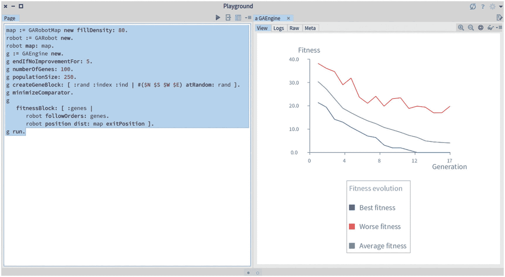
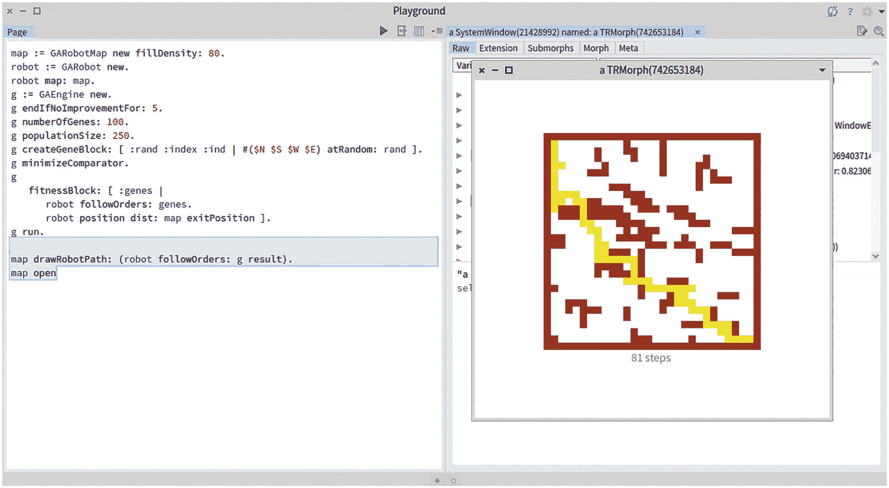
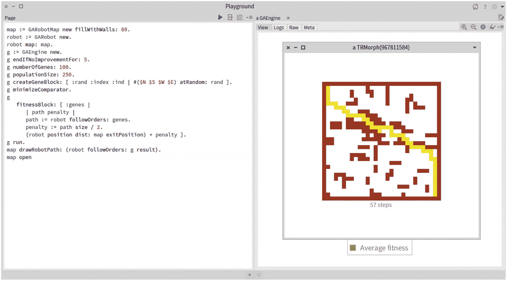

# 十一、走出迷宫

遗传算法通常被认为是解决算法难题的一种方法。本章应用遗传算法来帮助一个小机器人找到出口。它将一个简单的情况(机器人寻找出口)公式化为一个优化问题(最小化机器人和出口之间的距离)。本章构建了一个生活在随机生成的迷宫中的小型机器人。机器人的目标是走出迷宫。

## 11.1 编码机器人的行为

我们将迷宫建模为二维地图，其中迷宫入口和出口是固定的位置。入口位于地图的左上角，出口位于右下角。

我们的机器人将遵循一系列简单的命令，然后可以向北、南、西或东移动一步。路径将是订单的线性序列。

应用我们的遗传算法，一个个体将代表路径，从迷宫入口开始。适应度函数将使得(I)机器人遵循基因中编码的顺序，并且随后(ii)返回机器人离出口的距离。因此，遗传算法应该降低适应度，指示机器人越来越接近出口。

## 11.2 机器人定义

第一步是制作机器人模型。为此，我们定义了一个`GARobot`类，它知道自己的位置和机器人所在的地图:

```py
Object subclass: #GARobot
    instanceVariableNames: 'position map'
    classVariableNames: ''
    package: 'Robot'

```

可以使用以下方法设置机器人的位置:

```py
GARobot>>position: aPoint
    "Set the position of the robot"
    position := aPoint

```

机器人的位置可通过以下方式获得:

```py
GARobot>>position
    "Return the position of the robot"
    ^ position

```

知道位置在我们稍后将实现的适应度函数中是有用的。使用以下方法执行映射的初始化:

```py
GARobot>>map: aMap
    "Set the map where the robot lives in"
    map := aMap

```

地图是`GARobotMap`类的一个实例，我们将在后面看到。地图还会对机器人的初始位置进行编码。

一个机器人有能力遵循一组步骤顺序，这些顺序是由一组字符`$N`、`$S`、`$W`和`$E`组成的。如果没有墙壁阻挡，机器人会相应地移动。我们的机器人不能穿墙。`followOrders:`方法定义如下:

```py
GARobot>>followOrders: orders
    "Make the robot follow the orders.
    Return the path taken by the robot"
    | delta possiblePosition path |
    delta := { $N -> (0 @ -1) . $S -> (0 @ 1) .
          $W -> (-1 @ 0) . $E -> (1 @ 0) } asDictionary.
    path := OrderedCollection new.
    path add: map initialPosition.
    self position: map initialPosition.
    orders
        do: [ :direction |
            possiblePosition := position + (delta at: direction).

            "If we found the exit, then we return and
            make no further progresses"
            possiblePosition == map exitPosition ifTrue: [ ^ path ].

            "If there is no wall, then we effectively do the move"
            (map gridAt: possiblePosition) ~= #wall ifTrue: [
                position := possiblePosition.
                path add: position ] ].
    ^ path

```

以下部分描述了机器人可以生活的地图。

## 11.3 地图定义

`GARobotMap`类由四个变量组成:

*   `size`代表地图的大小。地图是一个正方形的空间，`size`是一个尺寸上的单元数。

*   `content`是包含地图本身的数组的数组。

*   `path`包含机器人遵循某种顺序后所走的路径。

*   `random`一如既往的是一个随机数生成器。

`GARobotMap`类定义如下:

```py
Object subclass: #GARobotMap
    nstanceVariableNames: 'size content path random'
    classVariableNames: ''
    package: 'Robot'

```

该映射用以下内容初始化:

```py
GARobotMap>>initialize
    super initialize.
    random := Random seed: 42.
    self size: 30.

```

地图的默认大小为 30 个单位。可使用`gridAt:put:`方法修改其内容，定义如下:

```py
GARobotMap>>gridAt: aPoint put: value
    "Modify the map content.
    value is a symbol: #empty, #wall, #start, #exit, #robot"
    (self includesPoint: aPoint)
        ifFalse: [ ^ self ]

.
    ^ (content at: aPoint y) at: aPoint x put: value

```

读取位置的内容是通过以下方法实现的:

```py
GARobotMap>>gridAt: aPoint
    "Return the content of a map at a given location.
    Everything outside the map is empty."
    (self includesPoint: aPoint) ifFalse: [ ^ #empty ].
    ^ (content at: aPoint y) at: aPoint x

```

用给定的大小初始化地图。地图上充满了`#empty`符号。`size:`方法实现了这种行为:

```py
GARobotMap>>size: aSize
    "Create a map of a given size and fills it with #empty"
    size := aSize.
    content := Array new: aSize.
    1 to: size do: [ :i |
        content at: i put: (Array new: aSize withAll: #empty) ].
    self fillEntranceAndExitPoints

```

我们可以填充迷宫入口点，然后使用专用方法退出:

```py
GARobotMap>>fillEntranceAndExitPoints
    self gridAt: self initialPosition put: #start.
    self gridAt: self exitPosition put: #exit

```

生成随机数的方法如下:

```py
GARobotMap>>rand: anInteger
    "Return a new random number"
    ^ random nextInt: anInteger

```

另一个实用程序方法检查特定点是否在地图内:

```py
GARobotMap>>includesPoint: aPoint
    "Answer whether a point is within the map"
    ^ (1 @ 1 extent: size @ size) containsPoint: aPoint

```

出口位于地图的右下方:

```py
GARobotMap>>exitPosition
    "The exit position, as a fixed position,
    at the bottom right of the map"
    ^ (size - 1) @ (size - 1)

```

初始位置位于地图的左上角:

```py
GARobotMap>>initialPosition
    "The starting position is at the top left of the map"
    ^ 2 @ 2

```

注意`initialPosition`和`exitPosition`考虑的是地图的围墙，因此`1@1`和`size@size`位置包含一堵墙。这是确保机器人不会在物理地图之外游荡的简单方法。使用`fillWithWalls:`方法将墙添加到地图上。该方法将一个整数作为参数，指示要添加的墙的数量。每个墙块有三个单位长，墙块可以是水平的，也可以是垂直的。`fillWithWalls:`方法如下:

```py
GARobotMap>>fillWithWalls: numberOfWalls
    "Fill the map with a given number of walls"
    | offsets |
    numberOfWalls timesRepeat: [
        | x y |
        x := self rand: size.
        y := self rand: size.

        offsets := (self rand: 2) = 1
            ifTrue: [ { 1 @ 0 . -1 @ 0 } ]
            ifFalse: [ { 0 @ -1 . 0 @ -1 } ].
        self gridAt: x @ y put: #wall.
        self gridAt: (x @ y) + offsets first put: #wall.
        self gridAt: (x @ y) + offsets second put: #wall.
    ].
    self fillEntranceAndExitPoints.

    "Fill the map border"
    1 to: size do: [ :i |
        self gridAt: i @ 1 put: #wall.
        self gridAt: 1 @ i put: #wall.
        self gridAt: size @ i put: #wall.
        self gridAt: i @ size put: #wall ]

```

一旦机器人找到了通往出口的路，就可以很方便地画出机器人走过的路线。以下方法实现了这一点:

```py
GARobotMap>>drawRobotPath: aPath
    "Draw the robot path"
    path := aPath.
    aPath do: [ :pos | self gridAt: pos put: #robot ]

```

我们差不多完成了。最后要实现的是`open`，负责可视化渲染地图。它使用 Roassal 来构建可视场景。考虑一下`open`方法:

```py
GARobotMap>>open
    "Build and open the visual representation of the map"
    | v colors shape |
    colors := { #empty -> Color white . #wall -> Color brown .
        #start -> Color red . #exit -> Color green .
        #robot -> Color yellow } asDictionary.

    v := RTView new.
    shape := RTBox new size: 10; color: [ :c | colors at: c ].
    content do: [ :line |
        v addAll: (shape elementsOn: line) @ RTPopup
    ].
    RTGridLayout new gapSize: 0; lineItemsCount: size; on: v elements.
    v add: (RTLabel elementOn: path size asString, ' steps').
    TRConstraint move: v elements last below: v elements allButLast.
    ^ v open

```

`open`方法构建了一个由小颜色方块组成的可视地图。机器人执行的步数显示在地图下方。这是寻找出口进展如何的一个指标。

## 11.4 示例

我们现在准备进化我们的机器人来寻找出口。考虑以下脚本:

```py
"We build a map with 80 wall blocks"
map := GARobotMap new fillWithWalls: 80.

"We build the robot"
robot := GARobot new.
"Make the robot lives in the map"
robot map: map.

g := GAEngine new.
g endIfNoImprovementFor: 5.
g numberOfGenes: 100.
g populationSize: 250.
"A gene value is a cardinal direction"
g createGeneBlock: [ :rand :index :ind | #($N $S $W $E) atRandom: rand].

"We want to minimize the distance between the robot and the exit"
g minimizeComparator.
g
    fitnessBlock: [ :genes |
        robot followOrders: genes.
        robot position dist: map exitPosition ].
g run.

```



图 11-1

机器人适应度的进化

图 [11-1](#Fig1) 显示了种群随世代的演化。我们可以通过附加以下脚本来查看路径:

```py
...
map drawRobotPath: (robot followOrders: g result).
map open

```



图 11-2

机器人足迹

图 [11-2](#Fig2) 显示了我们的机器人所走的路径。我们看到机器人走了 81 步到达出口。我们的机器人走的这条路绝对不是最短的。机器人做了一些不必要的步骤。

这种情况可以通过增加反映路径长度的惩罚来改善。惩罚是加到机器人和出口之间的距离上的数值。这个代价对于短路径应该是小的，对于长路径应该是高的。我们如何定义这种惩罚？定义罚值的一种方法是使罚值等于路径长度。在这种情况下，惩罚是从`56`到`100`的一个值:`56`是从`initialPosition`到`exitPosition`的最短路径，`100`是一个个体拥有的基因数量。另一方面，机器人到出口之间的距离范围从`0`到`39` : `0`表示机器人已经到达出口，而`39`是表达式`map initialPosition dist: map exitPosition`的结果。距离和罚值有不同的取值范围，因此，我们的罚值总是大于距离。因此，惩罚与算法的相关性比算法更大。如果罚分等于路径长度，那么算法将试图最小化距离路径，而不太关心机器人是否已经到达出口。考虑脚本的新版本:

```py
map := GARobotMap new fillWithWalls: 80.
robot := GARobot new.
robot map: map.
g := GAEngine new.
g endIfNoImprovementFor: 5.
g numberOfGenes: 100.
g populationSize: 250.
g createGeneBlock: [ :rand :index :ind | #($N $S $W $E) atRandom: rand ].
g minimizeComparator.
g
    fitnessBlock: [ :genes |
        | path penalty |
        path := robot followOrders: genes.
        penalty := path size / 2.
        (robot position dist: map exitPosition) + penalty ].
g run.
map drawRobotPath: (robot followOrders: g result).
map open

```



图 11-3

机器人足迹短

在`GARobot`类中定义的`followOrders:`方法返回机器人到达出口之前所走的路径。我们使用这个特性来计算惩罚。

图 [11-3](#Fig3) 给出了新版本脚本的结果，并突出显示了一条更好的路径。只需要走 57 步就能到达出口。没有惩罚，这条路有 81 步长。

我们将路径长度除以任意值`2`。移除分割(`penalty := pathsize.`)会阻止机器人寻找出口。在这种情况下，产生一条短路径的回报比到达出口更有吸引力。值`2`完全是任意的。与距离相比，这是一种特别的方式来减少处罚的重量。一个合适的解决方案应该有一个*多目标适应度*函数。然而，这超出了本章的范围。

## 11.5 我们在本章中看到了什么？

我们已经看到了遗传算法在帮助机器人走出迷宫方面的引人注目的应用。特别是，我们涵盖了:

*   机器人和地图建模

*   将机器人路径建模为订单序列

*   一个简单的方法，通过增加一个小的惩罚来显著改善解决方案

机器人场景可以通过在地图中添加新的项目来轻松改善，例如钥匙、门和怪物。该算法可以用来让机器人找到钥匙，躲过怪物，打开门，并找到出口。