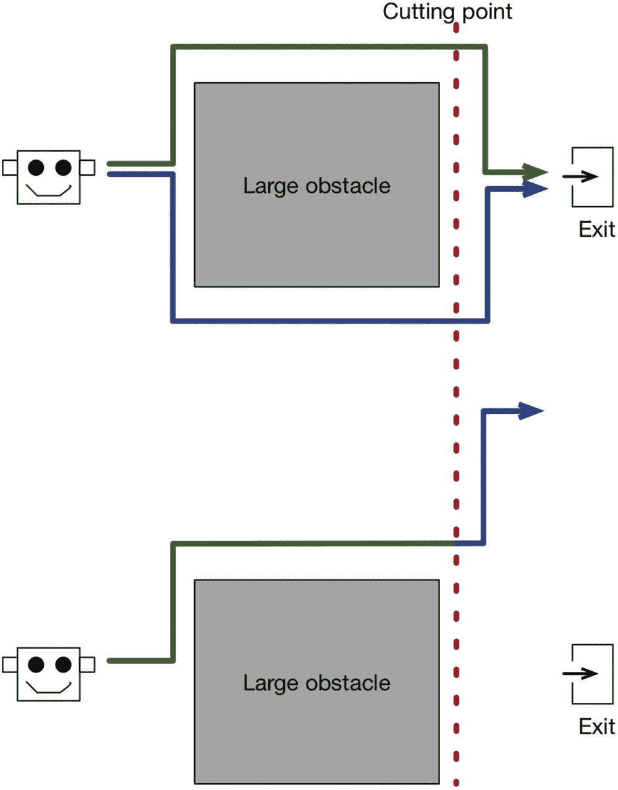
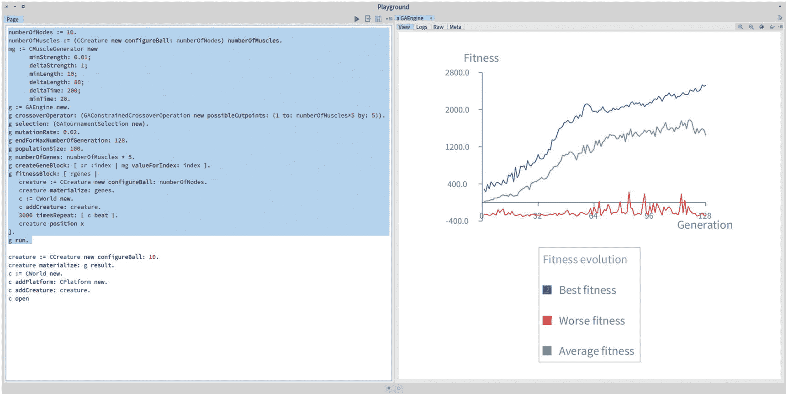
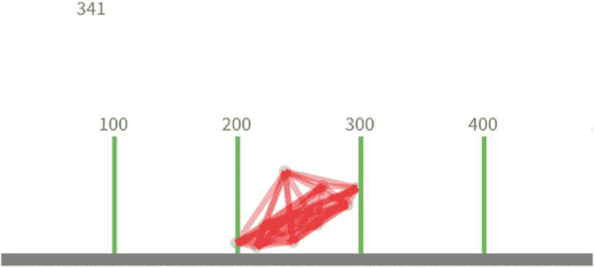
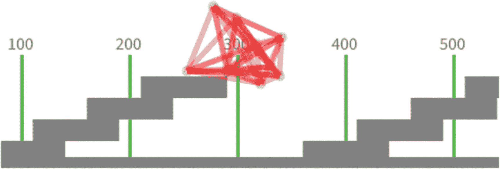

# 十三、进化的动物形态生物

前一章介绍了建模和建造动物形态生物的基础设施。然而，到目前为止，这种生物不能做太多事情:它站在原来的位置，当它没有侧身倒下时，我们很幸运。这一章让生物进化完成一个位移任务，比如向一个特定的方向移动或者通过一些障碍物。

## 13.1 中断流程

在开始运行遗传算法之前，强调 Pharo 编程语言和环境的一个方面是很重要的。

让生物进化是一个非常昂贵的操作。根据你的硬件配置，你可能需要让你的电脑进化这些生物几个小时。因此，本章中的大多数脚本需要很长时间才能完成。您应该熟悉通过按 Cmd 和来中断 Pharo 的方式。MacOSX 上的(句点)键。在 Windows 或 Linux 上，使用 Alt 和。钥匙。

中断 Pharo 会打开一个 Pharo 调试器。发生这种情况时，执行已被中断。然后，您可以执行以下任一操作:

*   评估代码(例如，为了准确地监控计算进度)，这将发生在调试器本身或在操场上

*   点击`Proceed`即可恢复计算

关闭调试器将结束正在进行的计算。保持调试器打开意味着您可以随时通过点击`Proceed`来恢复被中断的执行。

能够中断 Pharo 意味着您可以控制正在执行的内容。我们还建议您定期保存您的图像。Pharo 的顶部菜单提供了用于拯救环境的相关菜单项。

## 13.2 监控执行时间

对这种生物运行遗传算法非常耗时。我们将扩展我们的框架来跟踪流逝的时间。经过的时间将保存在日志条目中，由`GALog`类建模。因此，我们向该类添加了一个新变量，如下所示:

```py
Object subclass: #GALog
    instanceVariableNames: 'generationNumber timeToProduceGeneration
        fittestIndividual worseFitness averageFitness time'
    classVariableNames: ''
    package: 'GeneticAlgorithm-Core'

```

注意,`GALog`类是在前面的章节中定义的。我们修改了它的定义，增加了记录时间的方法。新变量`time`在构造函数中设置:

```py
GALog>>initialize
    super initialize.
    time := DateAndTime now

```

`DateAndTime`类代表一个时间点。当一个日志对象被创建时，我们将创建时间保存在`time`变量中:

```py
GALog>>time
    "Return the time the log was created"
    ^ time

```

我们现在可以利用这一点来确定整个计算时间。我们定义`timeTaken`方法:

```py
GAEngine>>timeTaken
    "Return the time taken to compute all the generations"
    | lastLog |
    lastLog := self logs last.
    ^ lastLog time - self logs first time

```

我们将在本章后面说明`timeTaken`的用法。

## 13.3 竞争公约问题

前几章介绍了两种交叉操作:

*   `GACrossoverOperation`执行简单的交叉，不强制任何特征

*   防止特定基因的重复

正如我们所看到的，这些操作已被证明对解决各种问题是有用的。然而，它们对我们的生物进化没有什么帮助，因为*竞争惯例的问题*。这个问题与使用默认和标准遗传操作有关。为了理解这到底为什么是一个问题，考虑我们在前一章看到的机器人例子。机器人遵循一系列命令，每个命令都是朝着一个方向迈出的一步。我们使用遗传算法来查找到达地图中特定点的订单序列。图 [13-1](#Fig1) 说明了竞争惯例的问题。



图 13-1

竞争惯例问题

我们假设遗传信息编码了一条路径，就像我们在关于走出迷宫的章节中看到的那样。图的上部显示了两条相对较好的路径，用绿色和蓝色表示。这两条路径不同，但都将机器人引向非常靠近出口的位置。我们可以合理地假设，选择算法可以指定这两条路径进行组合，因为它们非常好。一旦选定，这两个路径必须结合使用遗传算法。在我们看来，随机指数被指定为切割点。红色虚线表示可能的切割点。

图的底部显示了重组的一个结果。新路径引导机器人远离出口。这个小例子说明了以下情况:*两个相对优秀的个体组合成一个表现不佳的个体*。这种情况被称为竞争约定问题，它通常被认为是发展非平凡数据结构的严重障碍。

如果我们盲目地应用`GACrossoverOperation`操作来进化我们的生物，我们将立即遇到竞争惯例的问题，本质上是因为结合两种好的肌肉不太可能产生更好的肌肉。没有通用的方法来解决竞争约定的问题。然而，解决这一问题的方法通常是定义特定的遗传操作，将结构视为重组。这正是我们将在本章和书中关于神经进化的部分使用的策略。

## 13.4 受约束的交叉操作

避免竞争约定问题的一个方法是限制交叉发生在任何点。相反，我们将允许交叉只发生在肌肉末端。因此，杂交不能“切割”肌肉的遗传信息。为此，我们现在定义一个新的操作符，称为`GAConstrainedCrossoverOperation`:

```py
GAAbstractCrossoverOperation subclass: #GAConstrainedCrossoverOperation
    instanceVariableNames: 'possibleCutpoints'
    classVariableNames: ''
    package: 'GeneticAlgorithm-Core'

```

这个新的交叉算子用变量`possibleCutpoints`考虑一组可能的切割点。该变量包含一组可能发生交叉的索引。该变量通过使用以下内容进行设置:

```py
GAConstrainedCrossoverOperation>>possibleCutpoints: indexes
    "Set the possible pointcuts considered by the operator"
    possibleCutpoints := indexes

```

我们还添加了一个实用方法，将它挂接到我们的框架中，如下所示:

```py
GAConstrainedCrossoverOperation>>pickCutPointFor: partnerA
    "Return a cutpoint"
    self assert: [ possibleCutpoints notNil ] description:
        'Need to provide the possible cut points, using #
            possibleCutpoints:'.
    ^ possibleCutpoints at: (random nextInt: possibleCutpoints size)

```

这个新的操作符是我们需要对我们的框架进行的唯一增量，并且进化动物形态的生物。

## 向前迈进

我们将考虑向右移动的任务。记住进化生物需要大量的时间。以下脚本在英特尔酷睿 i5 3.7 GHz 处理器上运行大约需要 31 分钟:

```py
numberOfNodes := 10.
numberOfMuscles := (CCreature new configureBall: numberOfNodes)
    numberOfMuscles.
mg := CMuscleGenerator new
        minStrength: 0.01;
        deltaStrength: 1;
        minLength: 10;
        deltaLength: 80;
        deltaTime: 200;
        minTime: 20.
g := GAEngine new.
g crossoverOperator: (GAConstrainedCrossoverOperation new
    possibleCutpoints: (1 to: numberOfMuscles*5 by: 5)).
g selection: (GATournamentSelection new).
g mutationRate: 0.02.
g endForMaxNumberOfGeneration: 128.
g populationSize: 100.
g numberOfGenes: numberOfMuscles * 5.
g createGeneBlock: [ :r :index | mg valueForIndex: index ].
g fitnessBlock: [ :genes |
    creature := CCreature new configureBall: numberOfNodes.
    creature materialize: genes.
    c := CWorld new.
    c addCreature: creature.
    3000 timesRepeat: [ c beat ].
    creature position x
].
g run.

```

该脚本考虑由十个节点组成的生物，如变量`numberOfNodes`所示。作为物理规则的结果，物理引擎将以循环方式定位这些节点。通过评估`(CCreature new configureBall: numberOfNodes) numberOfMuscles`表达式获得肌肉的数量。它只是创建一个虚拟生物，并计算肌肉的数量。一个由十个节点组成的球生物有 45 块肌肉。然后，我们定义一个肌肉发生器，用于构建初始种群和变异生物。

每块肌肉由五个属性定义。交叉操作可能只发生在线性遗传信息中肌肉定义的末端。适应度函数模拟生物在新世界中的行为。我们采用任意数量的节拍，3000 次，来模拟这种行为。这 3000 拍之后，生物的 X 坐标就是适应度函数的结果。因此，一个健康的生物会向右移动。进化经历了 128 代(任意值)。



图 13-2

进化出一个有 45 块肌肉的生物

图 [13-2](#Fig2) 显示了适应度的演变。适应度表明该生物能够移动。

我们可以通过将以下指令附加到前面的脚本来查看使用该脚本的结果:

```py
...
creature := CCreature new configureBall: 10.
creature materialize: g result.
c := CWorld new.
c addCreature: creature.
c open

```



图 13-3

环境中的生物

图 [13-3](#Fig3) 展示了一种生活在其环境中的生物。我们可以在特定的时间点监控生物的进化，因为日志包含了历史信息(见图 [13-4](#Fig4) )。例如，考虑以下脚本:


图 13-4

处于不同进化阶段的生物(黄色= 50 代，蓝色= 100 代，绿色= 120 代，红色= 128 代)

```py
...
c := CWorld new.
creature := CCreature new color: Color red; configureBall: 10.
creature materialize: g logs last fittestIndividual genes.
c addCreature: creature.

creature := CCreature new color: Color yellow darker darker;
    configureBall: 10.
creature materialize: (g logs at: 50) fittestIndividual genes.
c addCreature: creature.

creature := CCreature new color: Color blue darker darker;
    configureBall: 10.
creature materialize: (g logs at: 100) fittestIndividual genes.
c addCreature: creature.

creature := CCreature new color: Color green darker darker;
    configureBall: 10.
creature materialize: (g logs at: 120) fittestIndividual genes.
c addCreature: creature.

c open

```

如果你观察这些竞争的生物，有趣的是看到红色的生物并不总是在第一的位置。绿色生物多次超过红色生物。最终，红色的到达最后一个塔。

## 13.6 序列化肌肉属性

`g result`表达式返回一个大数组，包含该生物所用肌肉的属性。如果您不想一直运行遗传算法，您可以保存计算结果。每次你想看到一个生物移动的时候，都必须运行整个算法，这确实很麻烦！例如，如果您评估`g result`表达式，您将获得以下内容:

```py
creature := CCreature new configureBall: 10.
creature materialize: #(24 34 0.46040109215788594 216 145 75 50
    0.522318108469396 127 33 33 39 0.9105445367193523 70 93 30 88
    0.5458242390378492 55 104 32 78 0.9326984656055917 36 74 20 38
    0.23007194683890417 169 77 25 31 0.6407352956527543 219 147 28 14
    0.5132012814205146 70 67 41 32 0.4101663086936652 116 21 30 53
    0.4132064962215752 140 69 26 16 0.67239310366213 174 81 90 40
    0.9493843137376868 77 82 90 24 0.9472498080773512 72 76 77 15
    0.8207815849644977 51 46 63 21 0.23135899086546108 29 170 33 24
    0.8508932494190025 70 94 34 32 0.85425589900662 192 99 83 84
    0.8219266167338596 153 144 74 57 0.18008196523882541 38 136 76 82
    0.4098378945513805 108 122 73 25 0.13200707016606214 72 102 11 24
    0.525760215705149 60 33 34 53 0.47843877270279395 207 167 53 53
    0.06064744597796698 47 203 90 90 0.3480303188869871 101 204 77 42
    0.05166656036007524 143 155 67 89 0.5535930274164271 146 23 35 39
    0.8390450097196945 136 143 78 87 0.955747404799679 153 71 15 84
    0.9765097738460218 34 26 36 14 0.13894161191253998 78 51 38 41
    0.1316714140594338 114 205 74 74 0.7760572821116342 191 32 67 61
    0.08824125377379416 219 149 18 70 0.1469941007052521 169 175 39 43
    0.2866080141424239 133 71 90 42 0.8735930218098653 90 85 53 21
    0.18471918099313936 39 146 60 44 0.3135163908747567 120 38 57 43
    0.32777994628892276 187 148 34 23 0.3158802803540045 35 102 75 42
    0.1347404502354285 109 125 28 76 0.12238997760805766 64 23 68 70
    0.9608936917180632 179 175 28 24 0.06067319378753807 116 196 ).
c := CWorld new.
c addCreature: creature.
c open

```

这一长串数字构成了生物的“DNA”。遗传算法的目标是进化 DNA，使生物尽可能向右移动。

## 13.7 通过障碍物

到目前为止，我们的生物已经进化到向右移动。建立一个新环境的模型是很容易的，特别是在有一些障碍的情况下。之前使用的脚本可以根据障碍物进行修改(见图 [13-5](#Fig5) )。运行此版本大约需要 48 分钟(慢 60%以上):


图 13-5

在障碍面前进化出一个动物形态的生物

```py
numberOfNodes := 10.
numberOfMuscles := (CCreature new configureBall: numberOfNodes)
    numberOfMuscles.
mg := CMuscleGenerator new
        minStrength: 0.01;
        deltaStrength: 1;
        minLength: 10;
        deltaLength: 80;
        deltaTime: 200;
        minTime: 20.
g := GAEngine new.
g crossoverOperator: (GAConstrainedCrossoverOperation new
    possibleCutpoints: (1 to: numberOfMuscles * 5 by: 5)).
g selection: (GATournamentSelection new).
g mutationRate: 0.02.
g endForMaxNumberOfGeneration: 128.
g populationSize: 100.
g numberOfGenes: numberOfMuscles * 5.
g createGeneBlock: [ :r :index | mg valueForIndex: index ].
g fitnessBlock: [ :genes |
    creature := CCreature new configureBall: numberOfNodes.
    creature materialize: genes.
    creature resetPosition.
    c := CWorld new.
    c addPlatform:
        (CPlatform new height: 20; width: 80; translateTo: 100 @ 90).
    c addPlatform:
        (CPlatform new height: 20; width: 80; translateTo: 400 @ 90).
    c addPlatform:
        (CPlatform new height: 20; width: 80; translateTo: 700 @ 90).
    c addPlatform:
        (CPlatform new height: 20; width: 80; translateTo: 1000 @ 90).
    c addCreature: creature.
    3000 timesRepeat: [ c beat ].
    creature position x
].
g run.

```

可以使用以下脚本呈现结果:

```py
...
c := CWorld new.
creature := CCreature new color: Color red; configureBall: 10.
creature materialize: g logs last fittestIndividual genes.
c addCreature: creature.

creature := CCreature new color: Color yellow darker darker;
    configureBall: 10.
creature materialize: (g logs at: 50) fittestIndividual genes.
c addCreature: creature.

creature := CCreature new color: Color blue darker darker;
    configureBall: 10.
creature materialize: (g logs at: 100) fittestIndividual genes.
c addCreature: creature.

creature := CCreature new color: Color green darker darker;
    configureBall: 10.
creature materialize: (g logs at: 90) fittestIndividual genes.
c addCreature: creature.

c addPlatform:
    (CPlatform new height: 20; width: 80; translateTo: 100 @ 90).
c addPlatform:
    (CPlatform new height: 20; width: 80; translateTo: 400 @ 90).
c addPlatform:
    (CPlatform new height: 20; width: 80; translateTo: 700 @ 90).
c addPlatform:
    (CPlatform new height: 20; width: 80; translateTo: 1000 @ 90).
c open

```


图 13-6

进化的不同阶段

图 [13-6](#Fig6) 展示了进化生物的不同阶段。

## 13.8 爬楼梯

这种生物也可以进化爬楼梯。想想这个脚本，它需要大约六个小时来运行:

```py
numberOfNodes := 10.
numberOfMuscles := (CCreature new configureBall: numberOfNodes)
    numberOfMuscles.
mg := CMuscleGenerator new
        minStrength: 0.01;
        deltaStrength: 1;
        minLength: 10;
        deltaLength: 80;
        deltaTime: 200;
        minTime: 20.
g := GAEngine new.
g crossoverOperator: (GAConstrainedCrossoverOperation new
    possibleCutpoints: (1 to: numberOfMuscles*5 by: 5)).
g selection: (GATournamentSelection new).
g mutationRate: 0.02.
g endForMaxNumberOfGeneration: 128.
g populationSize: 100.
g numberOfGenes: numberOfMuscles * 5.
g createGeneBlock: [ :r :index | mg valueForIndex: index ].
g fitnessBlock: [ :genes |
    creature := CCreature new configureBall: numberOfNodes.
    creature materialize: genes.
    creature resetPosition.
    c := CWorld new.
    c addCreature: creature.
    1 to: 25 by: 3 do: [ :x |
        c addPlatform: (CPlatform new height: 20; width: 80;
            translateTo: x * 100 @ 90).
        c addPlatform: (CPlatform new height: 20; width: 80;
            translateTo: x * 100 + 50 @ 70).
        c addPlatform: (CPlatform new height: 20; width: 80;
            translateTo: x * 100 + 100 @ 50).
        c addPlatform: (CPlatform new height: 20; width: 80;
            translateTo: x * 100 + 150 @ 30).
    ].
    c addCreature: creature.
    3000 timesRepeat: [ c beat ].
    creature position x
].
g run.

```

这个脚本与前面的脚本非常相似。区别在于评估适应度函数的方式。这个剧本在生物前进的道路上增加了被认为是障碍的平台。这个新脚本比前一个慢。这些平台的存在极大地影响了这种生物的进化。该脚本检查节点和平台之间的冲突，这非常耗时。在节点的每次移动中，节点包围盒与每个平台的包围盒相交。我们实现了支持该模拟所需的最低要求。更健壮的实现可能会使用更复杂的技术来确定元素之间的冲突(例如，`quadtree`)。

这个脚本只是使用一些定位良好的平台来形成楼梯。以下脚本显示了结果(参见图 [13-7](#Fig7) ):



图 13-7

爬楼梯

```py
...
creature := CCreature new configureBall: 10.
creature materialize: g result.
c := CWorld new.
"We build couple of stairs"
1 to: 25 by: 3 do: [ :x |
    c addPlatform: (CPlatform new height: 20; width: 80; translateTo:
        * 100 @ 90).
    c addPlatform: (CPlatform new height: 20; width: 80; translateTo:
        x * 100 + 50 @ 70).
    c addPlatform: (CPlatform new height: 20; width: 80; translateTo:
        x * 100 + 100 @ 50).
    c addPlatform: (CPlatform new height: 20; width: 80; translateTo:
        x * 100 + 150 @ 30).
].
c addCreature: creature.
c open

```

动物形态的生物确实可以进化爬楼梯。

## 13.9 我们在本章中看到了什么？

这一章阐述了生物是如何进化来完成一些行走任务的，我们称这些生物为*动物形态的*，因为它们的运动方式是有机的。特别是，这一章包括以下内容:

*   中断长时间运行进程的基本技术。这是本章的中心内容，因为我们处理的进化需要几分钟，能够中断正在运行的执行是很重要的。

*   一个生物在三种不同场景下的进化:没有任何障碍，有一些简单的障碍，有楼梯。

这一章结束了这本书的第二部分。