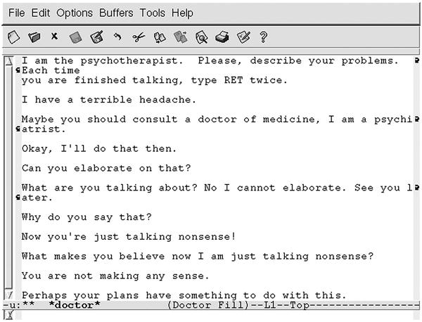
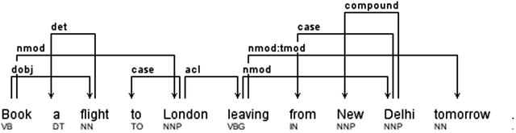
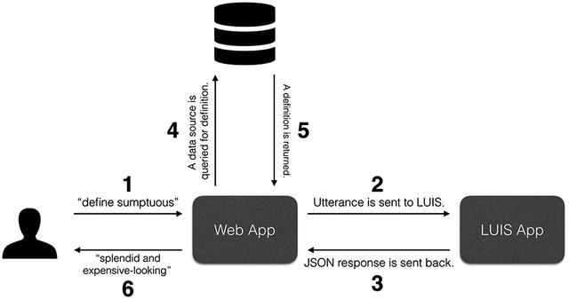
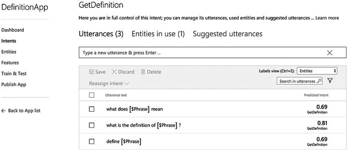
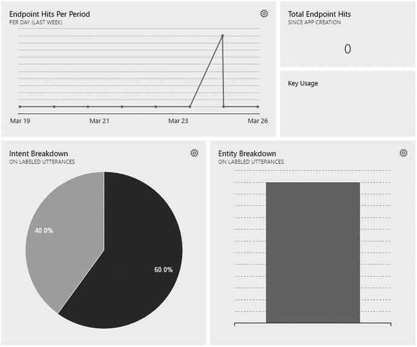
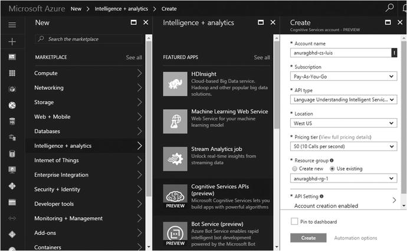
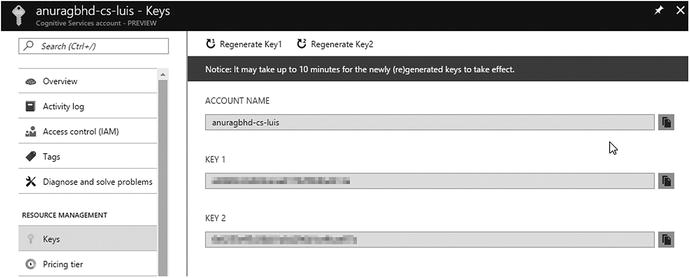
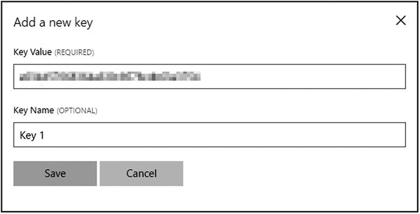
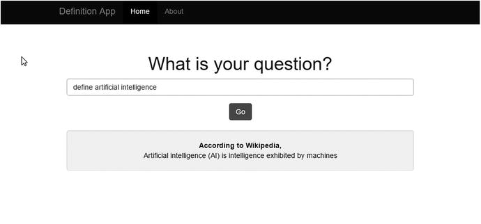

# 四、使用自然语言理解

自然语言理解或 NLU:从第 [1](01.html) 章开始你就已经听到这个术语了。您已经通过示例了解了它的内容和功能。到目前为止，您已经知道这是赋予应用理解用户自然语言句子的类似人类的能力的东西。在本章中，你将详细了解 NLU，并理解与认知服务中的 NLU 组件 LUIS 相关的概念。

Note

虽然你可以认为自然语言是人工语言(如编程语言)的对立面，但它并不总是与人类语言有相同的含义。所有自然语言都是人类语言，但并非所有人类语言都是自然的。自然语言是一种已经被人类使用了很长时间的语言，并且是一代一代自然进化而来的。英语、法语、印地语、拉丁语、阿拉伯语等。是自然语言。

还有一类人类语言被称为构造语言，它们是由一个人或一群人用一套正式的不变的语法人工创造出来的。最受欢迎的构建语言是世界语，根据一些估计，全球大约有 200 万人使用世界语。

人工智能的最高目标一直是以传统机器无法想象的方式为人类服务。为了服务人类，AI 必须能够像人类相互理解一样理解它们。对于一个人来说，从人工智能那里完成一件事应该像向人类同伴寻求帮助一样容易。毫不奇怪，人工智能整体研究的主要部分集中在处理和理解自然语言，即人类的语言。

NLU 是自然语言处理(NLP)更广泛的人工智能领域的几个任务之一。但与大多数其他 NLP 任务不同，NLU 是一个人工智能难题。人工智能难题，也称之为完全人工智能，是人工智能中最困难的问题，它们处理的是让机器像人一样聪明。这些问题不能像其他人工智能问题一样使用一种特别设计的算法来解决，而是可能需要几个复杂算法的组合，这些算法在同一问题的不同部分一起工作以实现相同的目标。NLU 以及计算机视觉和机器翻译是主要的人工智能难题。

理解人类语言和解释句子意思的能力是智能系统不可或缺的素质。因此，NLU 有各种各样的商业、学术和个人应用:理解我们需求的个人机器人，通过倾听我们的症状提供医疗建议的 CUI 应用，以及可以从恐怖组织之间的大量文本和语音通信中提取关键细节、主动预防袭击的内容分析系统。

读完这一章，你会学到以下关于自然语言理解的知识:

*   NLU 是什么
*   简史
*   为什么机器很难理解自然语言
*   Microsoft 语言理解智能服务(LUIS)
*   支持 LUIS 的应用的架构
*   如何从 Azure 为 LUIS 获取订阅密钥
*   如何制作一个基于 LUIS 的 web 应用的演示

## 什么是 NLU？

到现在，你无疑已经在你的大脑中铭刻了这一点，NLU 是机器理解人类语言的能力。更具体地说，它是将自然语言文本转换为计算机可以理解的形式的过程。在第 [1](01.html) 章中，你看到了 NLU 程序如何通过将句子分解成意图和实体来确定句子的意思。并不是所有的 NLU 实现都与意图和实体一起工作，但是你会在主要的开源和专有 NLU 框架中发现它们。

一段给定的文本可以由一个意图和一个或多个实体来表示。利用这些信息，程序可以决定

*   根据意图要执行什么操作
*   如何基于实体执行操作

让我们用第 [1 章](01.html)的例子来说明这一点。再考虑一下这句话:

*   "明天德里的天气会怎么样？"

对我们人类来说，很明显上面这句话是一个人询问某地天气的方式。对于一台不知道语法规则的计算机来说，这个句子也可能是乱码，因为它不知道词类(名词、动词、形容词、介词等)。)因此无法通过将它们放在一起理解其含义。如果计算机知道所有的语法规则，它能正确理解上面的句子吗？毫无疑问。但是，它会如何看待这些问题/请求:

*   "明天德里的天气如何？"
*   “德里天气预报”

一台总是按规则运行的计算机将无法理解这些语法不正确、充满俚语的句子。当然，期望用户总是键入语法正确的句子是不可能的:(a)母语和非母语的人都容易犯语法错误，(b)大多数人没有时间键入完整的单词或句子。

实现准确语言理解的诀窍是不要教计算机所有的规则、俚语、常见错误等。而是用几十万或几百万个句子来训练它，让它通过某种模式识别来自己找出一种语言的正式和非正式规则。机器学习技术，尤其是深度学习，使这成为可能。

商业 NLU 产品通常是经过这种初始培训的云服务。现在它知道了语言的基础，开发者可以训练它识别更具体的用例，比如“获取天气信息”他们可以训练服务，使其知道“天气”、“天气如何”、“天气如何”、“告诉我天气如何”等。所有的意思都一样:获取天气信息。开发人员不必用所有 1000 种询问同一件事情的方式来训练服务。利用其对语言的基本理解，该服务可以在遇到类似但未知的用户查询时做出智能猜测。因此，当用户以上述任何一种(或其他类似的)方式询问天气时，他们的意图是获取天气信息。换句话说，用更专业的话来说，我们说他们这句话的目的是获取天气信息。

以类似的方式，开发人员可以训练服务识别补充意图的句子中的某些关键字。天气信息通常与地点和时间相关联。开发人员可以使用几个城市、州和国家的名称以及不同的日期表达方式来训练服务。城市和日期将成为实体。实体可能是可选的，也可能不是可选的，这取决于意图。在天气的情况下，如果既没有指定城市也没有指定日期，则可以隐含地假设用户想要知道他们当前位置的今天的天气。

图 [4-1](#Fig1) 展示了 NLU 服务对一个句子的分解。


图 4-1。

A natural language sentence with intent and entities highlighted

这种将一个句子分解成意图和实体的方式是开发者的程序能够理解并执行的。

```cs
if (intent == "getWeatherInfo")
{
        result = getWeatherInfo(entities.City, entities.Date); // returns "21 degrees celsius with low chance of rain"
        print "The weather in " + entities.City + " on " + entities.Date + " is going to be " + result;
}

```

图 [4-2](#Fig2) 显示了机票预订示例的意向-实体分解。


图 4-2。

A computer program can make use of the extracted intent and entities data to make an actual booking for a user Note

语言理解的逆过程是语言生成。NLG(自然语言生成)是将计算机可以理解的格式的数据(例如存储在数据库中的数字数据)转换成自然语言文本的过程。

例如，一个城市连续两天的天气数据之间的比较可能会产生以下自动生成的文本:

新德里今天天气中等炎热，比昨天上升了 3 摄氏度。虽然预计不会下雨，但下午可能会有点潮湿。

与 NLU 不同，NLG 不是一个人工智能难题，因为语言生成是一个受控制的过程，合成句子受一套固定的正式语法规则支配。也就是游戏规则的不确定性为零。

## 自然语言理解的历史

NLU 的历史几乎和人工智能领域一样悠久。1964 年，麻省理工学院的博士生 Daniel Bobrow 为他的博士论文编写了一个名为 student 的计算机程序。该程序是用 Lisp 编程语言编写的，旨在解决高中代数问题。学生被认为是自然语言理解的最早尝试之一。问题自然出现了，“你所说的让计算机理解自然语言是什么意思？”我采用了以下理解的操作定义。如果计算机接受作为英语子集成员的输入句子，并根据这些句子中包含的信息正确回答问题，那么它就理解英语子集。这种能力必须延伸到基于包含在几个句子中的隐含信息的推断。希望答案也是英语的，以便于计算机和人之间的交流。—“计算机问题解决系统的自然语言输入”，丹尼尔·博布罗，1964 年

学生可以解决用英语句子表达的代数问题，并用英语给出答案。比如，“两个 96 的数字之和，其中一个比另一个大 16。找到这两个数字。”会得到这样的答案，“其中一个数字是 56。另一个数字是 40。”

也许 NLU 最著名的例子是计算机程序 ELIZA，它是由 Joseph Weizenbaum 于 1965-66 年间在麻省理工学院人工智能实验室创建的。伊莱扎是一个交互式聊天机器人，可以通过编程用英语与用户就任何话题进行交谈。最受欢迎的话题是心理治疗，通过一个名为 DOCTOR 的脚本实现，这是一个心理治疗师模拟器。图 [4-3](#Fig3) 显示了 ELIZA 和一个用户之间的对话。



图 4-3。

ELIZA running the DOCTOR script

伊莱扎使用替换和模式匹配技术给人一种理解的错觉。虽然 Weizenbaum 创造了 ELIZA 来展示人和机器之间的人工交流，但它对许多用户产生了完全相反的影响，他们认为它表现出了对他们问题的人类般的理解。当 Weizenbaum 不在的时候，他的秘书利用这个机会和 ELIZA 秘密交谈。当 Weizenbaum 回来时，他发现他的秘书正在哭着离开办公室。后来，当他告诉她，这只是一个电脑程序，并没有真正理解她的感受，她拒绝相信，她交谈的“朋友”只不过是一个编程机器。

另一个关于自然语言理解和人工智能的非常成功的演示是特里·威诺格拉德的 SHRDLU。Winograd 教授于 1970 年在麻省理工学院创建了这个程序。SHRDLU(发音为 sher-duh-loo)是一个自然语言解析器，它的作用域仅限于块的世界。也就是说，它可以理解交互式英语对话来回答问题并执行与充满几何块图形(如长方体、正方体、圆锥体等)的虚拟世界相关的命令。例如，一个人可以用随意的、像对话一样的英语要求程序将一块积木从一个地方移动到另一个地方，程序将通过使用虚拟机械臂执行所请求的动作来做出响应。图 [4-4](#Fig4) 是 SHRDLU 感知街区世界的图解。


图 4-4。

SHRDLU’s “block world”

Winograd 演示过程中使用的对话摘录如下。注意人类 SHRDLU 听起来是如何模拟理解句法、语义、语法和上下文的。

*   人:拿起一个大红色块。
*   电脑:好的。(是吗)
*   人:抓金字塔。
*   计算机:我不明白你指的是哪个金字塔。
*   人:找一个比你手里的那个高的石块，把它放进盒子里。
*   电脑:我想你说的“它”是指比我拿着的那个高的那块。
*   电脑:好的。(是吗)
*   人:盒子里装的是什么？
*   电脑:蓝色金字塔和蓝色街区。
*   …
*   人物:称最大的块为“超级块”
*   电脑:好的。
*   人物:自从我们开始以来，你有没有拿起超级块？
*   电脑:是的。
*   人:为什么掉了？
*   电脑:我想你说的“它”是指超级块。
*   我无法解释一个不存在的事件。
*   人:红色金字塔的右边有什么东西吗？
*   电脑:是的，四样东西:盒子、红色立方体、蓝色金字塔和名为超级方块的方块。
*   人:谢谢。
*   电脑:不客气！

无论 SHRDLU 看起来多么聪明，它都是一个有很多约束的简单程序。在当时，它是有史以来最先进的人工智能程序之一。它激发了 NLU 领域的进一步研究，最终证明这比以前想象的要复杂得多。此后不久，维诺格拉德教授搬到了斯坦福，在那里他创建了人机交互小组，并为他的学生创办的几家知名公司提供咨询，包括谷歌。

NLU 的商业兴趣始于 20 世纪 80 年代，当时 Gary Hendrix 于 1982 年成立了赛门铁克公司，为数据库查询开发自然语言界面。如果你想知道，赛门铁克是制造当今流行的反病毒和安全软件的同一家公司。赛门铁克是语法、语义和技术三个词的综合体。

在 21 世纪初，IBM 的沃森是首批展示高级语言理解能力的认知超级计算机之一。但直到最近，我们才在 NLU 取得突破，这要归功于深度学习技术，正因为如此，我们有大型科技公司提供云服务，用于在任何软件应用中集成 NLU 功能。微软 LUIS 就是这样一种云服务。也有来自谷歌和脸书的。

## 为什么机器很难理解自然语言

此部分是可选的。如果您迫不及待地想在应用中应用 NLU，请随意跳过。但是我们鼓励你浏览“自然语言的复杂性”这一小节，因为当你的 NLU 训练没有像预期的那样工作时，它可能会给你一些提示。

### 自然语言的复杂性

对自然语言句子的理想分析包括检查其句法(语法)、语义(意义)和语用(语境)。你可能知道句法和语义，但不知道语用学。让我们借助例子来解释一下。

句法是指句子的语法结构，如主语-动词-宾语:“那个男孩在玩球。”使用一种语言的语法规则来分解一个句子的结构，也就是说，识别主语、动词和宾语，并不难构建一个程序。在现实世界中，人们并不总是写出或说出 100%语法正确的句子。我们用真实世界的句子训练 NLU 程序越多，它就越能识别语法错误的结构。

*   语法不正确:我们在餐厅尝试过的最好的食物是意大利面和馄饨。
*   正确语法:我们在餐厅尝试过的最好的食物是意大利面和饺子。

语义是指句子中单词和短语的意义，以及它们之间的关系。语言是交流思想或表达情感的工具。把句法看作是使用语言与他人交谈的通用规则:正确的用词顺序，以便他人能清楚地理解你的意思。现在把语义想象成你的话语的意思，你想要传达的真实想法。即使你的语序不是 100%符合普遍接受的标准，对方也能理解你的意思，但是如果对方不能清楚地理解你的意思，你就没有传达你的信息。

例如，苹果是一种圆形的红色可食用的东西，而芒果是一种椭圆形的、黄色的、有甜味的可食用的东西。如果你想传达你正在吃苹果的信息，同样的事情可以用十种不同的方式来做，所有的方式都可以是语法正确的。但是选择错误的词语来传达你的信息会完全改变你的信息的含义。吃芒果和吃苹果不一样，对你不一样，对别人不一样，对世界上任何人都不一样。

*   我喜欢苹果。
*   我喜欢吃苹果。
*   句子 A 和 B 意思相同。
*   我喜欢苹果。
*   我喜欢芒果。
*   句子 A 和 B 有不同的意思。

我们人类知道，许多单词可能表示同一个意思:好，不错，很棒，很棒，等等。我们称它们为同义词。同样，我们还有反义词、同音异义词、上音异义词等。语义学涵盖了所有这些，因为它们直接影响句子的意思。一个理想的 NLU 程序可以完美地理解一个句子的语义。然而，这在人工智能中不是一个要解决的小问题。

语用学指的是语境赋予意义的方式。语境可能基于说话者、听者或周围的世界。对于另一个人来说，间接传达一个信息是很常见的，这样其真正的意思只能推断而不能直接解释。想象你和一个朋友在一个繁忙的火车站，进行下面的对话。

*   你:嘿，看，有人把钱包掉在地上了。
*   朋友:那边那个人好像在找什么东西。

从这段对话中，人们不难看出你朋友指的那个人可能就是掉了钱包的人，尽管你的朋友从来没有明确说过。在这样的对话中，一个句子的意思——在这种情况下是你朋友的意思——是通过上下文信息隐含的。作为一个独立的句子，你朋友说的意思不大。但是有了上下文，它就有了全新的含义。理想的 NLU 程序不仅要理解独立句子的意思，还要考虑它们周围的上下文，以便更准确地解释意思。

复杂性不仅限于句法、语义和语用。您的理想 NLU 计划需要担心的其他事情的非详尽列表是

*   有多重含义的单词(“你是对的”与“向右转”)
*   需要理解世界的句子(“拿起第二块”——第二块给什么？)
*   含糊的句子(“我开会迟到了”——多晚？)
*   可以有多种解释的句子(“我看见一个人在山上拿着望远镜。”-我用望远镜看到的是山上的一个人，还是我看到的是山上的一个拿着望远镜的人？)

然后在书面语和口语上有相当大的差异。人们在写电子邮件、散文、文章、故事等时，倾向于正式和语法正确。然而，当彼此交谈时，他们往往是非正式的，较少受规则的约束。"我将在后天完成这项工作."与“我以后会一直这样做的。”此外，还有方言(一种语言的本地化变体)和俚语(非正式词汇)的问题。仅英语就有几十种方言，主要的有英国英语、美国英语和澳大利亚英语。

我们希望您现在能更好地理解设计理想 NLU 项目的挑战。

### 统计模型作为解决方案是不够的

自然语言理解的最早尝试，尤其是 SHRDLU，在理解上相当准确。它们是用句法和语义的语言学规则建造的。这些并不是给予他们深刻理解的唯一东西。这些早期系统专注于有限的小世界，因此可以理解特定领域的命令。伊莱扎只擅长心理治疗。SHRDLU 的整个世界充满了几何块。基于替代和模式匹配的简单逻辑足以给他们理解用户的能力。然而，这种简单的逻辑无法扩展到设计更通用的 NLU 系统。

20 世纪 90 年代见证了自然语言处理的一场革命。研究人员能够使用统计学作为理解自然语言的更好方法。在统计革命之前，像决策树这样的技术通常用于机器学习。这种系统导致复杂的 if-then 规则，难以维护和排除故障。21 世纪之交，出现了复杂的统计模型，可以分析大量的文本内容，并产生相当准确的结果。

这产生了统计机器学习技术，可以用来更一般地理解自然语言。这种统计模型所需要的强大计算能力现在已经可以实现，这在一定程度上要归功于摩尔定律。最初，训练文本数据(语料库)是手工创建的。后来，欧盟国家政府程序的公开记录被用作训练 NLU 系统的语料库。

在第 [1](01.html) 章中，你学习了机器学习的两种主要方法:监督和非监督。监督学习是机器通过人类手工制作的标签(或注释)来学习理解文本、语音或图像。通过无监督学习，机器可以通过大量的训练数据进行自我学习。到目前为止，与非监督学习相比，监督学习产生更准确的结果。尽管在人工智能领域取得了所有的进步，但纯粹的统计机器学习即使在监督下也有改进的空间。

统计模型试图通过依存分析或词向量来解决 NLP 问题。在依存句法分析中，词类(名词、动词、形容词、介词等。)在句子中被识别，并且它们之间的语法关系被建立。这和端到端理解一句话的意思是不一样的。图 [4-5](#Fig5) 显示了句子的依存句法分析。



图 4-5。

Dependency parsing of a sentence generated using Stanford Parser

解决这个问题的另一种方法是单词向量，其中生成句子中单词的加权向量。斯坦福大学计算机科学助理教授珀西·梁(Percy Liang)认为，“尽管词向量在语义的某些方面是正确的，但它们仍然呈现出一幅不完整的画面。”

Note

如果你正在考虑深度学习模型在语言理解中的效率，让我们提醒你，大多数深度学习技术本质上是统计的。递归神经网络(RNN)是一种流行的深度学习模型，在机器翻译应用中特别有效。rnn 可以用来建立 NLU 模型，但需要巨大的计算能力和难以置信的大量训练数据来产生相当准确的结果，这些资源通常只有大公司才能获得。查看 word2vec 算法的 Google Tensorflow 实现和脸书的 fastText(基于浅层神经网络)，两者都是通过生成单词向量来工作的。

### 充满希望的未来

我们已经看到了 20 世纪 80 年代早期 NLU 系统和 20 世纪 90 年代和 21 世纪初的统计模型中的权衡。研究正在努力实现一种平衡:早期系统的准确性(深度)和当前统计系统的一般性(广度)。

Pat.ai 是一个正在进行的工作，它声称是那个平衡的 NLU 解决方案。认知科学家、Pat Inc .创始人约翰·鲍尔在他的论文《NLU 的科学》中写道，虽然今天大多数 NLU 解决方案依赖于词序和频率的统计分析，但 Pat.ai 结合了 Patom 理论(模仿人脑功能)以及角色和参考语法(基于从不同语言的分析中开发的语言模型)。他声称，大脑理论和语言学(而不是统计学)的这种结合是一种强有力的混合物，使他们能够解释句子真正的端到端意义。他将 Pat.ai 与现有的 NLU 解决方案区别开来，称其为意义匹配器。鲍尔认为，虽然现有的 NLU 解决方案可能无法理解诸如“打电话给贝丝，不要约翰”这样的信件，但人工智能不会理解。

白皮书中已经声称，Pat.ai 可以解决 Winograd Schema Challenge，这是一个由 Hector Levesque(多伦多大学)提出的机器智能选择题测试，并以 Terry Winograd 命名(他是我们敬爱的 SHRDLU 的创造者，记得吗？).例如，Pat.ai 可以说出模糊句子“市议会议员拒绝向示威者发放许可证，因为他们害怕暴力”中的“他们”是指。

在写这本书的时候，Pat.ai 还处于预览阶段，只有在私人名单上注册才能进入。

## 语言理解智能服务(LUIS)

LUIS 是微软的自然语言理解云服务，也是认知服务套件的一部分。它使用了 intent-entities 模式，并提供了其他几个构建块来创建丰富的 NLU 应用。通过一个简单的网站，您可以创建一个 LUIS 应用，并教它理解用户将如何与您的应用交互的所有用例。LUIS 应用并不是您希望提供给用户的实际软件应用。相反，它只是作为云服务访问的软件应用的语言理解部分。您的软件应用可能是网站、聊天机器人、移动应用或桌面应用，照常开发，可能使用 LUIS 应用公开的在线 API。

在写这本书的时候，LUIS 支持 9 种语言文化的 NLU:英语、中文、法语、西班牙语、意大利语、德语、日语、巴西葡萄牙语和韩语。不能在同一个 LUIS 应用中使用多个区域性。创建 LUIS 应用时选择的区域性以后不能更改。LUIS 分解不同文化间话语的方式有些不同。汉语和朝鲜语的话语被分解成字符式的标记，而任何其他文化中的话语被分解成单词式的标记。

LUIS 不仅可以用于基于文本的对话，还可以用于涉及语音识别的用例。LUIS 在认知服务套件中无缝集成了微软的语音 API。因此，在语音 API 的帮助下，你可以让用户对你的应用说话，让 LUIS 来理解，而不是要求你的用户输入他们的信息。在内部，语音在传递给 LUIS 之前被转换成文本，但是与 Speech API 的集成使得这一点非常无缝。演讲包含在第 [7](07.html) 章中。

正如我们前面说过的，每个 LUIS 应用都提供了一个 HTTP API 端点，作为允许您的软件应用实现 NLU 的一种方式。这个 API 接受一个话语并返回它的意图-实体分解。LUIS 提供了另一个 API 来以编程方式管理 LUIS 应用。这个 RESTful API 可用于以编程方式列出、添加、编辑和删除意图和实体，标记和训练话语，发布应用，等等。这在您想要创建自定义 LUIS 培训界面或不想直接访问您的 LUIS 帐户的情况下非常有用。

### 基于 LUIS 的软件应用的体系结构

LUIS 应用很少被创建为全理解的 AI。相反，LUIS 应用的设计围绕着你的软件试图解决的问题。例如，如果您的应用帮助订餐，那么您的 LUIS 应用必须经过训练，只理解与订餐相关的语句，而不是机票预订。每一个 LUIS 应用都有一个预先构建的意图，没有一个可以用来处理不相关的话语。

让我们以 DefinitionApp 为例，这个应用的唯一目的是提供单词或短语的定义。即使这样一个简单的应用也需要 NLU 的能力来正确理解用户提出查询的一千种方式。

*   “___ 的定义是什么？”
*   "定义 __ "
*   “告诉我什么是 __”
*   “哥们，能不能帮我理解一下 ___”的定义？”

这个清单还在继续。上述所有话语在结构上不同，但在意义上相似，这是用户想要了解某事的定义的意图。那个东西，空白，破折号，是关键；姑且称之为“短语”

以下是为 DefinitionApp 创建 LUIS 应用的最低步骤:

1.  在 LUIS 中创建一个新的应用，可能与您的软件应用同名。
2.  在 LUIS 应用中添加一个名为`GetDefinition`的新意图。
3.  添加一个名为`Phrase`的新实体。
4.  在`GetDefinition`意图下，添加尽可能多的可以被解释为询问某事定义的不同表达方式。
5.  在每个话语中，突出显示`Phrase`实体。在“定义奢华”的情况下，单词奢华将被标记为`Phrase`实体。
6.  单击训练按钮开始训练。

一旦您的 LUIS 应用被训练为将相关话语分解为意图和实体，您就可以将其发布为 HTTP 端点(API ),该端点将接受来自您的软件的话语字符串，并将意图-实体分解作为 JSON 数据发送回来，如下所示:

```cs
{
  "query": "define sumptuous",
  "topScoringIntent": {
    "intent": "GetDefinition",
    "score": 0.9820167
  },
  "intents": [
    {
      "intent": "GetDefinition",
      "score": 0.9820167
    },
    {
      "intent": "None",
      "score": 0.03545451
    },
    {
      "intent": "Hello",
      "score": 0.00300396071
    }
  ],
  "entities": [
    {
      "entity": "sumptuous",
      "type": "Phrase",
      "startIndex": 7,
      "endIndex": 15,
      "score": 0.851388454
    }
  ]
}

```

这个 JSON 基本上是不言自明的。我们想在这里强调的一点是，我们训练得越多，信心得分就越高。记住这一点。无论如何我们都要重复几次。

图 [4-6](#Fig6) 是 LUIS 的网页界面截图。图 [4-7](#Fig7) 是一个基于 LUIS 的软件应用的架构图。



图 4-7。

A sequential architecture diagram that illustrates the interaction between a user and a LUIS-enabled web application that returns a definition of a word or phrase



图 4-6。

A LUIS application called DefinitionApp that fetches the definition of a word or phrase. The GetDefinition intent currently has three labelled utterances, but you can add as many as you want. For accurate results, utterances labelled under an intent should be similar or have the same meaning. $Phrase is an entity that represents the word or phrase for which a definition must be fetched.

您的 web 应用的工作流程可通过以下步骤来描述:

1.  用户向 web 应用发送消息“定义奢华”。
2.  web 应用将消息作为话语传递给其对应的 LUIS 应用。
3.  LUIS 执行其 NLU 分析，并返回其对意向和实体的预测。结果作为 JSON 返回。
4.  web 应用检查返回的 JSON 中的最高得分意图。如果是`GetDefinition`，则在 JSON 中查找值`Phrase`实体。在上面的例子中，这个值是“华丽的”利用这些信息，应用现在知道该做什么。它必须找到数据源来检索“奢华”的定义。数据源可以是专门为应用创建的数据库或在线 API(如字典或维基百科)。
5.  数据源向 web 应用发回目标单词/短语的简要定义。
6.  web app 将获得的定义呈现给用户，从而完成其效用。

### 在幕后

到目前为止，你已经毫无疑问地推断出 LUIS 使用了监督学习，因为它要求你在它能够确定之前看到的和未看到的话语的意图和实体之前，用意图和实体来标记话语。LUIS 在内部使用逻辑回归分类器(LRC)来确定意图，使用条件随机场(CRF)来确定实体。作为开发人员，您不需要知道这些。但是一个关于内部的想法可能会给你一种技术的利弊的洞察力。LRC 和 CRF 是统计模型:LUIS 应用用标记的话语训练得越多，这些模型就变得越优化。更好的优化模型导致更好的预测，这反过来又导致意图和实体的置信度得分的提高。

逻辑回归(LR)是一种建模技术，用于使用先前已知的数据进行预测，例如基于过去七天的天气数据预测明天的天气，或者基于前几年记录的婴儿死亡和当前条件预测某个地区的婴儿死亡率。LR 也可以用作分类器，根据以前已知的分类数据来预测给定数据的类别。这正是 LRC 对话语所做的:它们根据我们标记的话语来预测意图。

CRF 是一种序列建模类型，其中在考虑相邻单词之后对单词进行分类或标记。因此，在训练 CRF 模型时，句子中的单词序列很重要。您在前面的“自然语言的复杂性”一节中已经看到，一个单词的含义可能会根据上下文而变化。CRF 通过考虑邻近单词，有助于理解上下文。条件随机场通常用于词性标注和命名实体识别，这是自然语言处理中的两个重要任务。

在词性标注中，句子被分解成语法单位。举个例子，

*   “迈克正在附近的体育场踢足球”变成了
*   "迈克[名词]正在[形容词]体育场[名词]附近的[冠词][介词]踢足球[名词]"

在 NEM，实体是基于先前标记的实体从句子中提取的。举个例子，

*   “微软是比尔·盖茨在 1975 年共同创立的”变成了
*   “微软[公司]是比尔·盖茨[人]在 1975 年[时代]共同创立的。”

### 广泛的训练是关键

可能需要大量的培训才能让 LUIS 达到你对应用的理解水平，这取决于使用案例。我们在前面的 JSON 输出中看到，对于一个话语，可能会以不同的置信度返回多个竞争意图。尽管只针对一种意图训练了准确的话语，但情况仍然如此。LUIS 基于统计模型，这些模型是概率性的。

如果您的应用必须处理多个类似的用例，那么 LUIS 很可能会因为缺乏对每个类似用例的足够培训而感到困惑。考虑以下两种被贴上两种不同意图标签的话语:

*   BookFlight:“帮我订一张今天出发的从[$Origin]到[$Destination]的机票。”
*   BookReturnFlight:“帮我预订一张从[$Origin]到[$Destination]的返程票。”

这些话语在结构和意义上只有细微的差别。在训练不足的情况下，LUIS 可能针对第二个话语返回 BookFlight 意图，反之亦然。作为一个解决方案，你要么用一个意图处理两种话语(理想的解决方案)，要么提供足够的训练数据来消除 LUIS 的歧义。

LUIS 不可能 100%的时间都是正确的，尽管通过足够的训练，它的精确度可以提高。LUIS 使用一种叫做“主动学习”的方法来随着时间的推移提高自己。它跟踪所有它不能以高置信度预测其意图的话语。你可以在意向页面的“建议话语”部分找到这样的话语。使用此选项适当标记话语，并向 LUIS 确认是对还是错。

LUIS 应用中的 overview/dashboard 页面显示了与一段时间内的培训和使用情况相关的一些关键统计数据和图表。这些信息有助于根据用户的使用方式(他们发送最多的意图是什么)和你的训练有多统一(每个意图中有多少百分比的标记话语)来调整应用。图 [4-8](#Fig8) 显示了定义 App 的仪表板。对于一个实时的生产应用，统计数据会更加密集。



图 4-8。

Stats for the LUIS application DefinitionApp

在第 6 章中，你将学习 LUIS 应用的构建模块，比如意图、实体、短语列表等。您将学习通过在 Bot 框架应用中使用 LUIS 来开发智能对话界面。但是在你开始在你的应用中使用 LUIS 之前，你需要一个 Azure 订阅密钥。

## 为 LUIS 获取 Azure 订阅

让我们在 Azure Portal 中为 LUIS 创建一个新的认知服务帐户，获取订阅密钥，并将其应用到 luis.ai 上的 LUIS 帐户。

### 获取 Azure 门户上的订阅密钥

1.  打开 Azure 门户。是 [`https://portal.azure.com`](https://portal.azure.com) 以防你忘记。
2.  从左侧菜单中，选择新➤智能+分析➤认知服务 API。
3.  Fill in the form as shown in Figure [4-9](#Fig9). The API type should be “Language Understanding Intelligent Service (LUIS).” Choose the Subscription and Pricing tier as per your requirements. You may want to select the Free pricing tier (F0) at this initial stage. You can always upgrade to a paid tier later.

    

    图 4-9。

    Creating a new LUIS Cognitive Services account on Azure Portal  
4.  单击“创建”按钮提交表单。创建您的 CS 帐户可能需要几分钟时间。您可以在右上角的通知菜单中跟踪进度。
5.  Once your account is created, from the left side menu, go to All resources ➤ <your-LUIS-account> ➤ Keys. You should see a screen similar to the screenshot in Figure [4-10](#Fig10). Take a note of Key 1 and Key 2 values.

    

    图 4-10。

    LUIS subscription keys  

### 在 LUIS 中应用订阅密钥

1.  打开 LUIS 网站。那就是 [`https://luis.ai`](https://luis.ai) 。
2.  使用您在 Azure Portal 上使用的同一 Microsoft 帐户(电子邮件密码)登录。如果这是您第一次登录，可能会要求您接受许可条款并授予 LUIS 访问您的 Microsoft 帐户的权限。
3.  进入并完成可选的入门教程后，请访问“我的密钥”页面。
4.  您将在“我的密钥”标题下看到您的编程 API 密钥。这不是您的订阅密钥。这个键与我们前面谈到的 LUIS 的编程 API 一起使用，它允许您以编程方式管理 LUIS 应用。
5.  Under the section Endpoint Keys, click the “Add a new key” button. In the resulting dialog form, enter Key 1’s value as in your Azure Portal. Name this key “Key 1.” Refer Figure [4-11](#Fig11).

    

    图 4-11。

    Adding a subscription key to your LUIS account at luis.ai  
6.  重复步骤 5 以添加键 2。
7.  至此，您已经为创建新的 LUIS 应用做好了准备。你想要多少就有多少。如果您的 LUIS Azure 帐户使用免费(F0)定价层，您的软件应用每秒最多可访问 LUIS 5 次，一个月最多可访问 10，000 次。

沿着端点键 1 有一个外部键部分。在这个部分中，您可以为 Bing 拼写检查 API 添加一个订阅密钥，它也是认知服务套件的一部分，让 LUIS 执行自动拼写检查。

## 演示:定义应用

我们以一个截图(图 [4-12](#Fig12) )和代码(列表 [4-1](#Par172) )来结束这一章，为你极其简单的定义 App。在第六章[中，你将学习使用 LUIS 和 Bot 框架构建更高级的对话式智能应用。](06.html)



图 4-12。

Screenshot of the Definition App

定义应用是一个单页 web 应用，使用以下内容创建:

*   Bootstrap （UI， CSS）
*   jQuery (AJAX 调用您的 LUIS 应用)
*   维基百科(定义数据存储)
*   清单 [4-1](#Par172) 中的代码。

```cs
HTML
----
<div class="definition-app">
        <h1>What is your question?</h1>
        <form>
          <div class="form-group">
                <input type="text" class="form-control" id="utterance" placeholder='Eg., "define artificial intelligence"'>
          </div>
          <button type="submit" class="btn btn-primary">Go</button>
        </form>
        <br>
        <div id="definition" class="well">Definition will appear here.</div>
</div>
JAVASCRIPT
----------
$(document).ready(function() {
        // Do this when the form is submitted;
        // that is, the "Go" button is clicked
        $('form').submit(function(e) {
                e.preventDefault(); // stop the default form submission behavior
                var utterance = $('#utterance').val(); // text entered by user in the textbox
                // Send the utterance to LUIS
                $.get("https://westus.api.cognitive.microsoft.com/luis/v2.0/apps/<app-id>?subscription-key=<key>&timezoneOffset=0.0&verbose=true&q=" + utterance, function(responseLuis) {
                        if (responseLuis.intents.length > 0) { // at least 1 intent was detected
                                if (responseLuis.topScoringIntent.intent === "GetDefinition"){ // the top scoring intent is "GetDefinition"
                                        if (responseLuis.entities.length > 0) { // at least 1 entity was detected
                                                var phrase = responseLuis.entities[0].entity; // ideally, we should check if entity type is "Phrase"
                                                // Get the definition from Wikipedia

                                                var wikipediaData = {
                                                        "format": "json",
                                                        "action":"query",
                                                        "prop": "extracts",
                                                        "exintro": "",
                                                        "explaintext": "",
                                                        "titles": phrase
                                                };
                                                $.get("https://en.wikipedia.org/w/api.php", wikipediaData, function(responseWikipedia) {
                                                        var pages = responseWikipedia.query.pages;
                                                        var summaryFirstLine = pages[Object.keys(pages)[0]].extract.split(". ")[0];
                                                        $('#definition').html("<b>According to Wikipedia,</b><br>" + summaryFirstLine);
                                                });
                                        }
                                        else { // no entity was detected
                                                $('#definition').text("Sorry, I could not detect the phrase.");
                                        }
                                }
                                else if (responseLuis.topScoringIntent.intent === "None") { // the top scoring intent is "None"
                                        $('#definition').text("Did you ask the right question?");
                                }
                        }
                        else { // no intent was detected
                                $('#definition').text("Sorry, I did not understand.");
                        }
                });
        });
});

Listing 4-1.The Definition App

```

### 笔记

*   在使用上述代码之前，您需要创建自己的 LUIS 应用。
*   出于安全原因，web 浏览器受同源策略的约束。这意味着你的浏览器将阻止对两个外部 API 的调用:LUIS 和 Wikipedia。为了解决这个问题，我们建议您使用安装了扩展“Allow-Control-Allow-Origin”的 Google Chrome 浏览器。在线搜索更多关于同源政策的详细信息。
*   定义的范围仅限于维基百科上的内容。如果维基百科没有一个页面的标题是你的`Phrase`实体的值，应用将无法显示定义。因此，该应用不支持所有词典单词的定义。
*   作为练习，给这个应用添加字典支持。提示:在网上搜索“字典 api ”,你会看到许多免费使用的 API。

## 概述

在这一章中，你详细了解了自然语言理解(NLU)，它的背景，应用和现状。你看到了为什么机器很难理解自然语言。最后，你对微软的 NLP 框架有了深入的了解，LUIS。

概括地说，您了解了

*   自然语言理解
*   NLU 的历史
*   自然语言的复杂性使得机器无法正确理解它们
*   微软 LUIS
*   支持 LUIS 的软件应用的鸟瞰图
*   此类应用中的各种组件如何通信
*   从 Azure 门户获取 LUIS 的订阅密钥
*   一个支持 LUIS 的网络应用