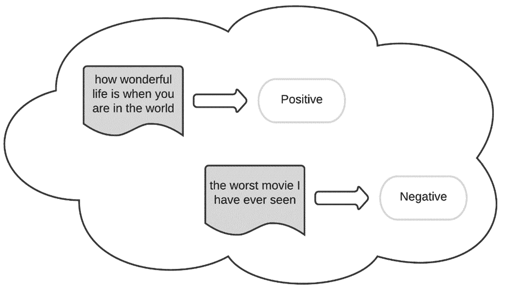
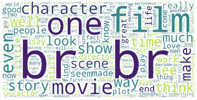
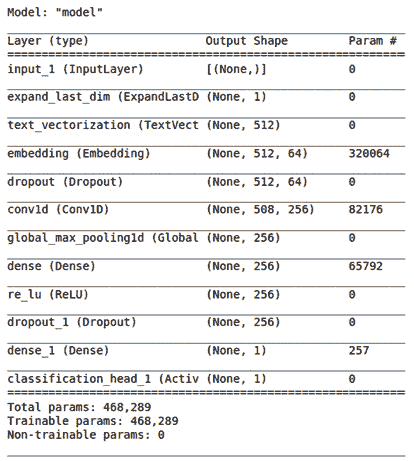
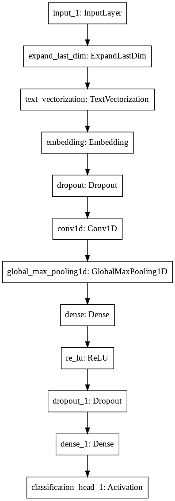

# 七、使用 AutoKeras 的情感分析

我们先来定义一下题目中不常见的术语。**情感分析**是一个在文本分类中广泛使用的术语，它基本上是关于使用**自然语言处理** ( **NLP** )结合**机器学习** ( **ML** )来解释和分类文本中的情感。

为了了解这一点，让我们想象一下判断一部电影的评论是正面还是负面的任务。你可以通过阅读自己做到这一点，对吗？然而，如果我们的老板给我们发来一份明天的 1000 条影评的清单，事情就变得复杂了。这就是情感分析成为一个有趣选项的原因。

在本章中，我们将使用文本分类器从文本数据中提取情感。文本分类的大部分概念已经在 [*第 4 章*](B16953_04_Final_PG_ePub.xhtml#_idTextAnchor063) 、*使用 AutoKeras 的图像分类和回归*中解释过了，所以在这一章中，我们将通过实现一个情感预测器来实际应用它们。然而，在我们这样做之前，我们将看看我们需要开始工作的技术要求。

具体来说，本章将涵盖以下主题:

*   创建情感分析器
*   创建分类器
*   评估模型
*   可视化模型
*   分析具体句子中的情感

# 技术要求

本书中的所有代码示例都以 Jupyter 笔记本的形式提供，可以从[https://github . com/packt publishing/Automated-Machine-Learning-with-AutoKeras](https://github.com/PacktPublishing/Automated-Machine-Learning-with-AutoKeras)下载。

由于可以执行代码单元，每个笔记本都可以自行安装；您只需要添加您需要的代码片段。因此，在每个笔记本的开头，都有一个安装 AutoKeras 及其依赖项的环境设置代码单元。

因此，要运行本章的代码示例，您只需要一台装有 Ubuntu Linux 的计算机作为您的操作系统，并安装 Jupyter Notebook，代码如下:

```py
$ apt-get install python3-pip jupyter-notebook
```

或者，您也可以使用 Google Colaboratory 运行这些笔记本，在这种情况下，您只需要一个网络浏览器。详见 [*第二章*](B16953_02_Final_PG_ePub.xhtml#_idTextAnchor029) 、*AutoKeras*入门 *AutoKeras 与谷歌合作*章节。此外，在该章的*安装 AutoKeras* 部分，您将找到其他安装选项。

现在，让我们通过看一些实际的例子来把我们所学的付诸实践。

# 创建情感分析器

我们将要创建的模型将是来自 IMDb 情感数据集中的情感二元分类器(1 =正面/0 =负面)。这是一个用于二元情感分类的数据集，包含一组 25，000 条用于训练的情感标签电影评论和 25，000 条用于测试的情感标签电影评论:



图 7.1–对两个样本进行情感分析的示例

类似于路透社的例子从 [*第四章*](B16953_04_Final_PG_ePub.xhtml#_idTextAnchor063)*使用 AutoKeras* 的图像分类和回归，每个评论被编码为一个单词索引(整数)的列表。为了方便起见，单词按照它们在数据集中的总频率进行索引。例如，整数 *3* 编码数据中第三个最频繁出现的单词。

包含完整源代码的笔记本可以在[https://github . com/packt publishing/Automated-Machine-Learning-with-auto keras/blob/main/chapter 07/chapter 7 _ IMDB _ sensation _ analysis . ipynb](https://github.com/PacktPublishing/Automated-Machine-Learning-with-AutoKeras/blob/main/Chapter07/Chapter7_IMDB_sentiment_analysis.ipynb)找到。

现在，让我们来详细了解一下笔记本的相关单元格:

*   **安装 AutoKeras** :正如我们在其他例子中提到的，笔记本顶部的这个代码片段负责使用 pip 包管理器安装 AutoKeras 及其依赖项:

    ```py
    !pip3 install autokeras
    ```

*   **导入必要的包**:下面几行加载 TensorFlow、内置的 Keras Reuters 数据集、NumPy 和 AutoKeras，作为这个项目所需的依赖项:

    ```py
    import tensorflow as tf
    import numpy as np
    import autokeras as ak
    ```

*   `imdb_sentiment_raw` function. Have a look at the code in the notebook for more details:

    ```py
    (x_train, y_train), (x_test, y_test) = imdb_sentiment_raw()
    print(x_train.shape)  # (25000,)
    print(y_train.shape)  # (25000, 1)
    ```

    以下是输出:

    ```py
    (25000,)
    (25000, 1)
    ```

*   **Showing some samples**: Next, we can print some words from the first sample to get an idea of what it contains:

    ```py
    print(x_train[0][:50])
    ```

    以下是输出:

    ```py
    <START> vs from it as must exporters ability whole
    ```

为了更清楚的看到这个，我们来渲染一个用词最频繁的词云。单词云(也称为标签云)是一种基于文本的数据可视化技术，其中单词根据它们在文本中出现的频率以不同的大小显示:



图 7.2-包含数据集中最常用单词的单词云

现在，是时候创建分类器模型了。

# 创建情感预测器

现在，我们将使用 AutoKeras `TextClassifier`找到最佳分类模型。只是对于这个例子，我们将`max_trials`(可以尝试的不同 Keras 车型的最大数量)设置为`2`；我们不需要设置 epochs 参数；相反，我们必须定义一个`2`时期的`EarlyStopping`回调，这样，如果验证损失在两个连续时期内没有改善，训练过程就会停止:

```py
clf = ak.TextClassifier(max_trials=2)
cbs = [tf.keras.callbacks.EarlyStopping(patience=2)]
```

让我们运行训练过程，并为训练数据集搜索最佳分类器:

```py
clf.fit(x_train, y_train, callbacks=cbs)
```

以下是输出:


图 7.3-文本分类器训练的笔记本输出

先前的输出显示训练数据集的准确性正在提高。

如我们所见，我们在验证集中损失了`0.28`。对于几分钟的训练来说，这已经不错了。我们将搜索限制在两种架构上(`max_trials = 2`)。对于其余的例子，增加这个数字会给我们一个更精确的模型，虽然这也需要更长的时间来完成。

# 评估模型

现在，是用测试数据集评估最佳模型的时候了:

```py
clf.evaluate(x_test, y_test)
```

以下是输出:

```py
782/782 [==============================] - 41s 52ms/step - loss: 0.3118 - accuracy: 0.8724

[0.31183066964149475, 0.8723599910736084]
```

正如我们所见，`0.8724`对于我们所投入的时间来说，是一个非常好的最终预测精度。

# 可视化模型

现在，我们可以查看一下最佳生成模型的架构概要:

```py
model = clf.export_model()
model.summary()
```

以下是输出:



图 7.4-最佳模型架构总结

正如我们可以看到的，AutoKeras，正如我们在 [*第 4 章*](B16953_04_Final_PG_ePub.xhtml#_idTextAnchor063)*中的分类示例中所做的，使用 AutoKeras* 进行图像分类和回归，选择了卷积模型(Conv1D)来完成这项任务。正如我们在那一章开始时解释的，当输入句子的顺序对预测不重要时，这种体系结构工作得非常好；不同的电影评论之间没有相关性。

这是一个直观的表示:



图 7.5–最佳模型架构可视化图表

正如您已经知道的，生成模型和选择最佳模型是由 AutoKeras 自动完成的，但是让我们更详细地解释这些模块。

每个块代表一个层，每个块的输出连接到下一个块的输入，除了第一个块的输入是文本，最后一个块的输出是预测数字。Conv1D 之前的模块都是数据预处理模块，它们负责向量化文本生成嵌入以馈入 Conv1D 模块，并通过 max pooling 层降低过滤器的维度。请注意，AutoKeras 还添加了几个下降块来减少过度拟合。

# 分析具体句子中的情感

现在，让我们看看测试集中的一些预测样本:

```py
import tensorflow as tf
tf.get_logger().setLevel('ERROR')
def get_sentiment(val):
    return "Positive" if val == 1 else "Negative"
for i in range(10):
    print(x_test[i])
    print("label: %s, prediction: %s" % (get_sentiment(y_test[i][0]), get_sentiment(clf.predict(x_test[i:i+1])[0][0])))
```

以下是上述代码的输出:


图 7.6-基于测试数据集前 10 句话的一些预测

如您所见，模型预测匹配测试数据集中前 10 个样本的每个标签。

# 总结

在这一章中，我们学习了情感分析在现实世界中的重要性，以及如何从文本数据中提取情感，如何用几行代码实现情感预测器。

在下一章中，我们将涉及一个非常有趣的话题:我们将使用 AutoKeras 通过使用文本分类器根据新闻主题的内容对其进行分类。