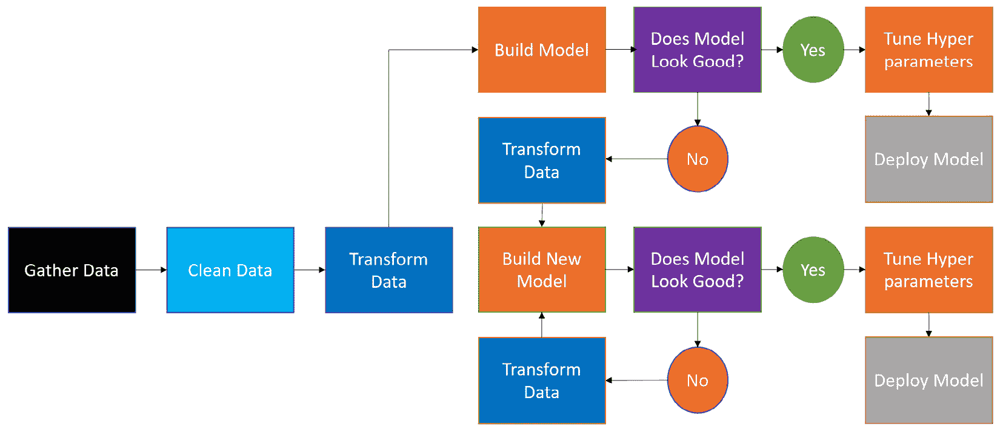
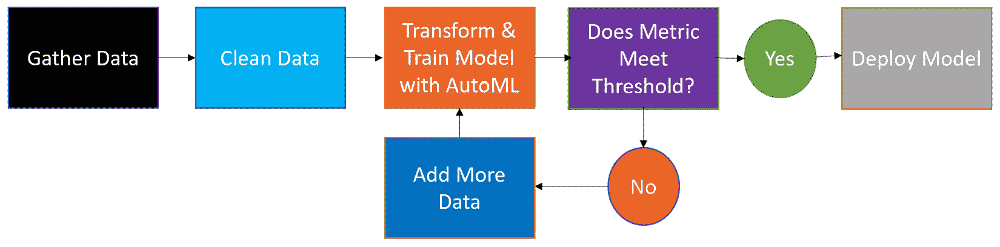

# 一、AutoML 简介

AI 无处不在。从在你最喜欢的网站上推荐产品，到优化财富 500 强公司的供应链，再到预测各种规模商店的需求，人工智能已经成为一股主导力量。然而，随着人工智能在工作场所越来越普遍，一个令人担忧的趋势出现了:大多数人工智能项目都失败了。

失败是由各种技术和非技术原因造成的。有时候，是因为 AI 模型表现不佳。其他时候是因为数据问题。机器学习算法需要可靠、准确、及时的数据，有时你的数据达不到那些标准。当数据不是问题，而你的模型表现良好时，失败通常会发生，因为最终用户只是不信任人工智能来指导他们的决策。

然而，对于每一个令人担忧的趋势，都有一个有希望的解决方案。微软和许多其他公司已经开发了**自动化机器学习** ( **AutoML** )来增加你的人工智能项目的成功。在这本书里，你将学习如何在微软的 Azure 云平台上使用 AutoML。如果你是一名数据科学家，这本书将教你如何提高生产率。如果你不是数据科学家，这本书将使你能够建立机器学习模型，并利用人工智能的力量。

在这一章中，我们将从理解什么是人工智能和机器学习开始，并解释为什么公司在看到他们在人工智能上的投资回报方面有如此大的困难。然后，我们将更深入地探讨数据科学家如何工作，以及从项目成功的角度来看，为什么工作流天生缓慢且容易出错。最后，我们通过介绍 AutoML 作为在机器学习项目中释放生产力的关键来结束这一章。

在本章中，我们将讨论以下主题:

*   解释数据科学的投资回报率问题
*   人工智能项目失败缓慢的原因分析
*   用 AutoML 解决投资回报率问题

# 解释数据科学的投资回报问题

**数据科学家**从 2016 年到 2019 年一直被《福布斯》杂志评为美国*最好的工作*，然而美国最好的工作并没有给雇佣他们的公司带来最好的结果。根据 VentureBeat 的数据，87%的数据科学项目无法投入生产。这意味着数据科学家完成的大部分工作不会以任何有意义的方式影响他们的雇主。

就其本身而言，这不是问题。如果数据科学家廉价而丰富，公司将会看到他们的投资回报。然而，事实根本不是这样。根据 2020 年 LinkedIn 薪酬统计，在美国所有职业级别，数据科学家的总薪酬约为 111，000 美元。他们也很容易找到工作。

总部位于美国的高管招聘公司 Burtch Works 报告称，截至 2018 年，数据科学家在他们的工作岗位上平均只呆了 2.6 年，当年所有数据科学家中有 17.6%的人换了工作。数据科学家很贵，也很难留住。

同样，如果数据科学家工作迅速，即使他们 87%的项目未能产生影响，投资回报**(**ROI**)仍然是可能的。快速失败意味着许多项目仍然可以投入生产，部门是成功的。失败缓慢意味着部门不能交付。**

 **不幸的是，大多数数据科学部门失败得很慢。要理解为什么，你必须先了解什么是机器学习，它与传统软件开发有何不同，以及所有机器学习项目共有的五个步骤。

## 定义机器学习、数据科学和人工智能

**机器学习**是训练统计模型使用数据进行预测的过程。它是人工智能中的一个范畴。**人工智能**被定义为执行认知任务的计算机程序，例如通常由人类执行的决策。**数据科学**是一个职业领域，它结合了计算机科学、机器学习和其他统计技术来解决商业问题。

数据科学家使用各种机器学习算法来解决商业问题。**机器学习算法**最好被认为是一组定义好的数学计算，用于对数据进行预测。你在日常生活中可能会遇到的机器学习的常见应用包括预测你的信用卡何时被用来进行欺诈交易，确定申请贷款时应该给你多少钱，以及计算出在网上购物时向你推荐哪些商品。所有这些决定，无论大小，都是通过机器学习机械地决定的。

算法有很多种，但你知道所有的算法并不重要。随机森林、XGBoost、LightGBM、深度学习、CART 决策树、多线性回归、朴素贝叶斯、逻辑回归和 k 近邻都是机器学习算法的例子。这些算法非常强大，因为它们通过学习数据中的模式来工作，这些模式对于任何人来说都过于复杂或微妙，以至于无法独自检测。

重要的是你要知道监督学习和非监督学习的区别。**监督学习**使用历史的、有标签的数据来进行未来预测。

假设你是一名餐厅经理，你想通过开展广告活动来预测下个月你将赚多少钱。为了通过机器学习实现这一点，您可能需要收集前几年的所有销售数据，包括之前活动的结果。因为你有过去的结果，并使用它们来做预测，这是一个监督学习的例子。

**无监督学习**简单地将类似数据的点组合在一起。当你有很多关于你的客户的信息，并且想把他们分成不同的类别，这样你就可以更有针对性地向他们做广告，这是很有用的。然而，Azure AutoML 严格用于监督学习任务。因此，在创建新的 AutoML 模型时，您总是需要在数据中提供过去的结果。

## 机器学习与传统软件

传统软件开发和机器学习开发差别巨大。程序员习惯于创建基于明确定义的规则接受输入并交付输出的软件。另一方面，数据科学家在编写程序之前首先收集想要的输出。然后，他们使用这些输出数据和输入数据创建一个程序，学习如何从输入预测输出。

例如，您可能希望构建一个算法来预测某一天某一城市会发生多少起车祸。首先，您将从收集历史数据开始，例如车祸数量(期望的输出)和您认为对预测该数量有用的任何数据(输入数据)。天气数据、星期几、交通流量以及与城市事件相关的数据都可以用作输入。

一旦你收集了数据，你的下一步是创建一个统计程序，发现输入和输出数据之间的隐藏模式；这叫做**模特训练**。在你训练完你的模型后，你的下一步是建立一个**推理程序**，它使用新的输入数据来预测那天会发生多少起车祸使用你训练好的模型。

另一个主要区别是，使用机器学习，你永远不知道在尝试之前你需要什么数据来创建你的解决方案，而且你永远不知道你会得到什么，直到你建立一个解决方案。由于数据科学家永远不知道他们需要什么数据来解决任何给定的问题，他们需要向业务专家寻求建议，并使用他们的直觉来确定要收集的正确数据。

这些差异很重要，因为成功的机器学习项目看起来与成功的传统软件项目非常不同；混淆两者导致项目失败。拥有 IT 背景但缺乏数据科学背景的经理经常试图遵循不适合机器学习项目的方法和时间表。

坦率地说，在你不知道你将需要什么数据或什么算法将起作用的情况下，给一个过程分配硬性的时间表是不现实的，许多数据科学项目失败仅仅是因为他们没有得到足够的时间或支持。然而，成功是有秘诀的。

## 机器学习成功的五个步骤

现在我们知道了什么是机器学习，以及它与传统软件开发的不同之处，下一步就是学习一个典型的机器学习项目是如何构建的。有许多方法可以划分流程，但大致有五个部分，如下图所示:

图 1.1–任何机器学习项目的五个步骤

让我们依次看看这些步骤。

### 理解业务问题

*步骤 1* ，理解业务问题，意味着与最终用户谈论他们试图解决什么问题，并将其转化为机器学习问题。

例如，职业篮球世界中的一个问题可能是，*我们真的不擅长挑选欧洲篮球运动员。我们希望能够更好地为我们的团队*选择合适的球员。你需要弄清楚一个*的好玩家*意味着什么。在这个过程中，你可能会发现大多数从欧洲带来的球员只打了几场比赛就被送回家了，这让球队浪费了数百万美元。

有了这些信息，你就需要翻译问题，让它可以通过机器学习来解决。想清楚。*我们将使用球员的历史比赛统计数据和人口统计信息来预测他们在 NBA 的职业生涯的寿命*将成为一个很好的机器学习项目。将商业问题转化为人工智能问题总是意味着使用数据来尝试预测一个数字(NBA 比赛的数量)或一个类别(球员是否会在几场比赛后回家)。

### 收集和清理数据

*步骤 2* ，收集和清理数据，包括以下步骤:

1.  识别和访问数据源
2.  检索您想要的所有数据
3.  将所有数据连接在一起
4.  删除数据中的错误
5.  应用业务逻辑创建一个即使外行也能理解的干净数据集

这比听起来要难。数据通常很脏，很难找到。

在我们的篮球案例中，这个将意味着从网络上搜集公开可用的数据，以获得每个球员在游戏中的统计数据和人口统计信息。错误几乎是肯定的，所以你必须在逻辑上工作，以消除或修复无意义的数字。例如，没有人身高是 190 英寸，但是厘米和英寸经常被混淆。

检验你是否已经恰当地清理了一个数据集并使之清晰的最好方法是把它交给一个外行，问一些简单的问题。*“玩家 Y 有多高？球员 X 在职业生涯中参加了多少场 NBA 比赛？”*。如果他们能回答，你就成功了。

### 为机器学习转换数据

一旦你有了一个容易理解的数据集，下一步就是为机器学习转换数据，这被称为 T2 特征工程。特征工程是为机器学习算法改变数据的过程。一些特征是算法工作所必需的，而其他特征使算法更容易找到模式。常见的特征工程技术包括一次性编码分类变量、缩放数值、移除异常值和填充空值。

复杂的是不同的算法需要不同类型的特征工程。与大多数算法不同，XGBoost 不要求您填写空值。决策树受离群值的影响不大，但是离群值会脱离回归模型。回到我们的篮球问题，您可能需要替换空值，调整数值，使每一列只包含从 0 到 1 的数字范围，并对分类变量进行一次性编码。

重要提示

one-hot encodingcategorial variables 简单地说就是将一个包含许多类别的列转换成许多包含 1 或 0 的列。例如，如果有一个值为*美国*、*加拿大*或*墨西哥*的列，那么对该列进行一键编码将创建三列，每个国家一列。含有美国产品的行在*美国*列中有一个 *1* ，在*加拿大*和*墨西哥*列中有一个 *0* 。

### 训练机器学习模型

现在你已经有了你的数据，并且你已经有了正确的格式，是时候训练一个机器学习模型了。虽然这一步有很多魅力和宣传，但训练机器学习模型是一个既快又慢的过程。以现在的技术，大多数机器学习模型只需要几行代码就可以训练出来。

**相比之下，超参数调整**可能需要很长时间。每个机器学习算法都有你可以控制的设置，称为**超参数**。超参数调优就是多次重新训练机器学习算法，直到找到正确的参数集。

一些算法(如随机森林)并没有从超参数调整中获得太多好处。其他的，比如 XGBoost 或者 LightGBM，经常会有很大的提高。根据数据的大小、使用的算法以及可用的计算量，超参数调整可能需要几天到几周的时间才能完成。

注意，要成为一名成功的数据科学家，你需要了解多少关于单个算法的知识？这也是该领域进入门槛如此之高的原因之一。不要被吓倒，但请记住这一点，因为我们介绍 AutoML。

### 向最终用户交付结果

现在你已经训练了你的模型并调整了它的参数，你可以自信地预测 NBA 球队应该选择哪些欧洲球员。也许你已经达到了 80%的准确率，也许是 90%，但是你的预测一定会对业务有帮助。不管你的结果如何，你仍然需要让最终用户接受你的模型，信任你的模型，并使用它。与传统软件不同，这可能需要巨大的努力。

首先，最终用户会想知道为什么模型会给出预测，如果你用了错误的算法，这是不可能的。**黑盒模型**使用固有的不可知的算法。然后，即使你能给出业务解释，用户也可能对 80%的准确率感到不舒服。*“那是什么意思？”*，他们会问。

视觉化是缓解他们恐惧的关键。对于您的篮球模型，您决定简单地显示他们应该选择的球员的商业照片，以及一些简单的图表，显示我们的模型准确预测了多少名球员将成为 NBA 球星，以及我们的模型未能预测到多少名欧洲 NBA 球星。

## 把所有这些放在一起

你现在知道什么是机器学习，它与传统软件开发有何不同，以及任何机器学习项目固有的五个步骤。不幸的是，许多业内人士并不了解这些事情。大多数企业都不熟悉数据科学。许多企业认为，数据科学比它更类似于软件开发，这干扰了机器学习项目流程。

终端用户对数据科学家的问题感到困惑，因为他们没有意识到数据科学家正在试图将他们的业务问题转化为机器学习问题。令人困惑的是，为什么数据科学家要求访问这么多数据，因为他们没有意识到，数据科学家在尝试之前不知道他们将需要什么数据。管理层很困惑，为什么他们的数据科学家花这么少的时间建立模型，而花这么多时间清理和转换数据。

因此，机器学习过程的*步骤 1* 和*步骤 2* 通常比预期的要长。业务用户无法以一种有用的方式向数据科学家传达他们的业务问题，授予数据科学家访问数据的权限很慢，并且数据科学家很难理解他们收到的数据。*第 5 步*也很复杂，因为最终用户希望模型像典型的软件程序一样可以完美解释，而赢得他们的信任需要时间。

鉴于误解会减慢其他步骤，数据科学过程的其余部分必须很快让公司看到投资回报。毕竟，转换数据和训练模型是数据科学工作的核心。这正是他们被训练去做的，而且应该很快。正如我们将在下一节看到的，这种情况很少发生。

# 分析人工智能项目失败缓慢的原因

数据科学家通常来自研究背景，并且有条不紊地从事构建机器学习模型的工作。获得一个业务问题并确定人工智能解决方案后，流程如下:

1.  收集数据。
2.  清理数据。
3.  转换数据。
4.  建立一个机器学习模型。
5.  确定模型是否可接受。
6.  调整超参数。
7.  部署模型。

如果模型在*步骤 5* 中可接受，数据科学家将继续进行*步骤 6* 。如果模型不可接受，他们将返回到*步骤 3* ，尝试不同的模型和转换。这个过程可以在*图 1.2* 中看到:

图 1.2–构建机器学习解决方案的传统方法

虽然这一过程遵循*图 1.1* 中概述的五个步骤，但它漫长而繁琐。还有一些与转换数据、构建模型、调整超参数和部署模型相关的特定缺点。现在，我们将进一步了解这个流程中固有的缺点，这些缺点导致数据科学项目缓慢而不是快速地失败，极大地影响了 ROI 问题:

*   **Data has to be transformed differently by algorithms**. Data transformation can be a tedious process. Learning how to fill in null values, one-hot encode categorical variables, remove outliers, and scale datasets appropriately isn't easy and takes years of experience to master. It also takes a lot of code, and it's easy for novice programmers to make mistakes, especially when learning a new programming language.

    此外，不同的算法需要不同的数据转换。一些算法可以处理空值，而其他算法则不能。一些算法可以处理高度不平衡的数据集，在这些数据集中，你只有一个类别的几个样本来预测，而其他算法会崩溃。

    如果您删除了异常值，一种算法可能会执行得很好，而另一种算法则完全不受影响。每当你选择尝试一个新的模型，很有可能你需要花时间为你的算法重新设计你的数据。

*   **Some algorithms require hyperparameter tuning to perform well**. Unlike Random Forest, models built with algorithms such as XGBoost and LightGBM only perform well if you tune their hyperparameters, but they can perform really well.

    因此，您有两个选择:坚持使用性能良好的模型，不进行调优；或者花几天到几周的时间调优一个潜力很大但不能保证成功的模型。此外，使用传统方法，您需要大量特定于算法的知识才能成为一名成功的数据科学家。

*   **Hyperparameter tuning takes a lot of compute hours**. Days to weeks to train a single machine learning model may seem like an exaggeration, but in practice, it's common. At most companies, GPUs and CPUs are a limited resource, and datasets can be quite large. Certain companies have lines to get access to computing power, and data scientists require a lot of it.

    当超参数调整时，通常会进行一种叫做**网格搜索**的操作，在这种操作中，每个可能的参数组合都会在一个特定的数值空间内进行训练。例如，假设算法 *X* 有参数 *A* 、 *B* 和 *C* ，你想尝试设置 *A* 到 *1* 、 *2* 和 *3* 、 *B* 到 *0* 和 *1* 以及*C*调整这个模型需要建立 3 x 2 x 3 = 15 个机器学习模型来找到理想的组合。**

    现在，15 个模型可能需要几分钟或几天的时间来训练，这取决于您使用的数据大小、您希望采用的算法以及您的计算能力。但是，15 个模型是很少的。许多现代机器学习算法要求你在很大范围内调整五到六个参数，产生数百到数千个模型，以寻找最佳性能。

*   **Deploying models is hard and it isn't taught in school**. Even after you transform data correctly and find the perfect model with the best set of hyperparameters, you still need to deploy it to be used by the business. When new data comes in, it needs to get scored by the model and delivered somewhere. Monitoring is necessary as machine learning models do malfunction occasionally and must be retrained. Yet, data scientists are rarely trained in model deployment. It's considered more of an IT function.

    由于缺乏训练，许多公司使用 hacky 基础设施和一系列拼凑的技术来部署机器学习。数据库查询可以由触发器上的第三方软件触发。数据可以使用一种计算机语言进行转换，存储在文件共享中的文件中，并由另一个过程拾取，该过程用另一种语言对模型进行评分，并将其保存回文件共享。脆弱的临时解决方案是常态，对于大多数数据科学家来说，这都是在职训练。

*   **Data scientists focus on accuracy instead of explainability**. Fundamentally, data scientists are trained to build the most accurate AI they can. Kaggle competitions are all about accuracy and new algorithms are judged based on how well they perform compared to solutions of the past.

    另一方面，商人通常更关心预测背后的原因。忘记包括可解释性破坏了最终用户对机器学习的信任，结果，许多模型最终没有被使用。

总而言之，建立机器学习模型需要很多时间，当 87%的人工智能项目未能投入生产时，这是大量时间的浪费。收集数据和清理数据本身就是耗费大量时间的过程。

转换每个模型的数据、调优超参数、计算和实现部署解决方案可能需要更长的时间。在这种情况下，很容易专注于寻找可能的最佳模型，而忽略了项目中最重要的部分:赢得最终用户的信任，并确保您的解决方案得到使用。幸运的是，有一个解决这些问题的方法。

# 用 AutoML 解决投资回报率问题

鉴于人工智能项目的高失败率，企业对机器学习如何工作缺乏了解，以及每个项目需要很长时间，微软和其他公司已经努力开发出允许更快开发和更高成功率的解决方案。一个这样的解决方案是 AutoML。

通过自动化数据科学家的大量工作，并利用云计算的力量，Azure 上的 AutoML 允许数据科学家更快地工作，甚至允许非专业人士构建人工智能解决方案。

具体来说，Azure 上的 AutoML 为您转换数据、构建模型和调优超参数。只需点击几个按钮就可以部署,可解释性是解决方案固有的特性。与*图 1.2* 中的传统机器学习过程相比，*图 1.3* 中的 AutoML 过程要简单得多:

图 1.3–构建机器学习解决方案的 AutoML 方法

遵循 AutoML 方法可以让您更快地失败，并让您处于需要决定是添加更多数据还是放弃项目的状态。AutoML 只运行一次，就给你一个明确的答案，而不是浪费时间调优没有机会工作的模型。让我们来看看关于 AutoML 优势的更详细的描述。

### Azure 上 AutoML 的优势

让我们来看看 AutoML 的一些优势:

*   **AutoML 自动转换数据**:一旦您以易于理解的格式获得了一个干净、无错误的数据集，您就可以简单地将该数据加载到 AutoML 中。除了在极端情况下，您不需要填充空值、一次性编码分类值、缩放数据、移除异常值或担心平衡数据集。这都是通过 AutoML 的智能特征工程完成的。甚至还有数据护栏，可以自动检测数据集中可能导致模型构建不佳的任何问题。
*   **AutoML 用最好的算法训练模型**:将数据加载到 AutoML 后，它会开始用最新的算法训练模型。根据你的设置和计算规模，AutoML 将使用 Azure 云并行训练这些模型。在运行结束时，AutoML 甚至会结合最高性能模型的结果构建复杂的集合模型。
*   **AutoML tunes hyperparameters for you**: As you use AutoML on Azure, you will notice that it will often create models using the same algorithms over and over again.

    你可能会注意到，在运行的早期，它尝试了广泛的算法，但在运行结束时，它只专注于一两个算法。这是因为它正在测试不同的超参数。虽然它可能无法在任何给定的运行中找到绝对最佳的超参数集，但它可能会提供一个高性能、良好调整的模型。

*   **AutoML 拥有超快的开发**:在 Azure 上使用 AutoML 构建的模型只需点击几下就可以部署到 REST API 端点。附带的脚本详细描述了您需要传递给端点的数据模式。一旦创建了 REST API，您就可以将它部署到任何地方，以便轻松地对数据进行评分并将结果存储在您选择的数据库中。
*   **AutoML has in-built explainability**: Recently, Microsoft has focused on responsible AI. A key element of responsible AI is being able to explain how your machine learning model is making decisions.

    AutoML 生成的模型带有一个仪表板，显示模型使用的不同特征的重要性。这适用于您使用 AutoML 训练的所有模型，除非您打开使用黑盒深度学习算法的选项。甚至个别数据点也可以解释，极大地帮助你的模型赢得业务终端用户的信任和接受。

*   **AutoML enables data scientists to iterate faster**: Through intelligent feature engineering, parallel model training, and automatic hyperparameter tuning, AutoML lets data scientists fail faster and succeed faster. If you cannot get decent performance with AutoML, you know that you need to add more data.

    相反，如果您确实使用 AutoML 实现了很好的性能，您可以选择按原样部署模型，或者使用 AutoML 作为基线来与您手工编码的模型进行比较。在这个时间点上，预计最好的数据科学家将能够手动构建在某些情况下优于 AutoML 的模型。

*   **AutoML enables non-data scientists to do data science**: Traditional machine learning has a high barrier to entry. You have to be an expert at statistics, computer programming, and data engineering to succeed in data science, and those are just the hard skills.

    另一方面，任何知道如何塑造数据的人都可以执行 AutoML。凭借一点 SQL 和数据库知识，你可以利用人工智能的力量，建立和部署机器学习模型，快速实现商业价值。

*   **AutoML 是未来的浪潮**:正如人工智能已经从一个时髦词演变为一种实践，机器学习解决方案的创建方式也需要从研究项目演变为运转良好的机器。AutoML 是这台运转良好的机器的一个关键部分，Azure 上的 AutoML 有许多功能，可以让你更快地失败和成功。从数据转换到部署到最终用户接受，AutoML 使机器学习比以往任何时候都更容易和更容易。
*   **AutoML 广泛可用**:微软的 AutoML 不仅可以在 Azure 上使用，还可以在 Power BI、ML.NET、SQL Server、Synapse 和 HDInsight 内部使用。随着它的进一步成熟，预计它将被整合到越来越多的 Azure 和非 Azure 微软服务中。

# 总结

人工智能和机器学习可能已经抓住了世界的想象力，但人工智能的空想承诺和人工智能项目的现实之间存在巨大差距。尤其是机器学习项目，往往会失败，而且速度很慢。传统的管理者对待数据科学项目就像对待软件工程项目一样，而数据科学家的工作方式是手工的、耗时的。幸运的是，AutoML 已经成为加速项目的一种方式，微软已经根据您的需求创建了 AutoML 产品。

你现在已经为第二章 *的 [*做好了准备，开始使用 Azure 机器学习服务*，它将向你介绍微软 Azure 机器学习工作区。您将创建一个 Azure 机器学习工作空间和启动 AutoML 项目所需的所有必要组件。到本章结束时，你将会对 Azure Machine Learning Studio 的所有不同组件以及它们如何交互有一个牢固的掌握。](B16595_02_ePub.xhtml#_idTextAnchor023)***