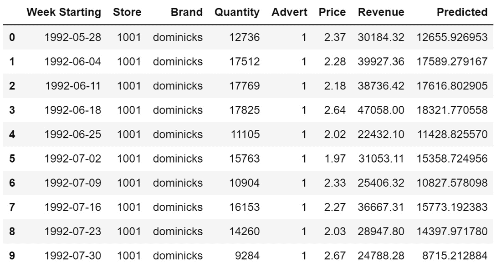

# 七、使用多模型解决方案加速器

现在，您已经体验了使用 AutoML 构建回归、分类和预测模型，是时候学习如何在实际业务场景中部署和利用这些模型了。然而，在你解决这个问题之前，我们将首先向你介绍一个新的、非常强大的解决方案，那就是**多模型解决方案加速器** ( **MMSA** )。

MMSA 可以让你一次构建数百到数千个**机器学习** ( **ML** )模型，并轻松扩展到数十万个模型。这是 ML 最前沿的先进技术。您不仅可以构建成千上万的模型，还可以使用 MMSA 轻松地将它们部署到生产中。

在本章中，您将从安装加速器开始，并了解它适用的各种用例。然后，您将逐个笔记本地运行加速器笔记本的三个部分:准备数据、训练模型和预测新数据。

在每一节中，您都将使用加速器中的样本数据以及用 Python 代码生成的样本数据。这将为您提供将 MMSA 用于文件和表格数据集的示例。最后，您将回顾使用加速器最大化性能的技巧和诀窍，并了解诸如**分层预测**等概念。

本章结束时，你将掌握如何使用 AutoML 的 MMSA。您将能够将自己的数据带入 MMSA，将其整理成正确的形状，并训练数以千计的模型。这种解决方案非常适合您希望为大量产品或商店训练相似模型的情况，例如，为产品和商店的每个组合建立一个单独的预测模型。全美国的大公司都使用它，到本章结束时，你也将能够使用它。

在本章中，我们将讨论以下主题:

*   安装多模型解决方案加速器
*   为许多模型准备数据
*   同时训练多个模型
*   为许多模型获得新数据
*   改善您的许多模型结果

# 技术要求

在这一章中，你将登录到你的 **Azure 机器学习工作室** ( **AMLS** )，在计算实例上打开一个 Jupyter 笔记本，并从 GitHub 上的位置安装 MMSA。然后，您将按顺序运行 MMSA 的所有三个部分，准备数据、远程训练模型以及预测数据。因此，您需要一个 Azure 帐户、一个用于编写 Python 代码的计算实例和一个用于远程训练的计算集群。要求的完整列表如下:

*   上网。
*   网络浏览器，最好是谷歌 Chrome 或微软 Edge Chromium。
*   一个 Microsoft Azure 帐户。
*   您应该已经创建了一个 AMLS 工作区。
*   您应该已经在第 2 章 、【Azure 机器学习服务入门中创建了一个计算实例。
*   您应该已经在第 2 章 、【Azure 机器学习服务入门中创建了计算集群。
*   您应该了解如何从 AMLS 计算实例导航到 Jupyter 环境，如 [*第 4 章*](B16595_04_ePub.xhtml#_idTextAnchor056) 、*构建自动回归解决方案中所示。*

本章的代码可以在这里找到:[https://github . com/packt publishing/Automated-Machine-Learning-with-Microsoft-Azure/tree/master/chapter 07](https://github.com/PacktPublishing/Automated-Machine-Learning-with-Microsoft-Azure/tree/master/Chapter07)。

# 安装多模型解决方案加速器

MMSA 是微软在 2019 年建造的，旨在满足越来越多的客户的需求，这些客户希望同时训练成千上万个类似的 ML 模型。这对于产品需求预测尤其重要，在这种情况下，您试图对许多不同地点的许多不同产品进行预测。

加速器的推动力是**模型精度**。虽然您可以训练单个模型来预测所有产品线和所有商店的产品需求，但您会发现，为产品和商店的每个组合训练单个模型往往会产生更好的性能。这是因为许多因素都依赖于你的算法和数据。当你处理分布在全球的成千上万不同产品时，一些算法很难找到有意义的模式。

此外，相同的列可能与您试图预测的目标列具有不同甚至相反的关系。想象一下天气和产品销售。当外面下雪时，很有可能某些产品，如冬天的帽子、手套或靴子，会经历一个销售高峰。其他产品，如冰淇淋，很可能会经历销售下滑。虽然一些算法可以处理产品线之间的这些对立关系，但许多算法不能，使用 MMSA 为每个产品建立单独的模型通常会产生更好的指标。

除了预测 MMSA 的产品需求之外，其他常见使用案例还包括工厂车间数千台设备和机器的预测性维护、数百家商店的劳动力优化模型、美国各州的文本分析使用案例和法律文档搜索模型，以及许多其他类似场景。尽管如此，预测仍然是最常见的用例。尤其是连锁店，发现 MMSA 很有吸引力。

从技术上讲，决定是否使用 MMSA 的关键因素是数据中是否存在一个或多个列，您可以使用这些列将数据拆分为多个文件。商店、产品和地区等列是主要的拆分目标。如果数据中不存在这样的列，就没有理由使用 MMSA。

同样，如果您希望数据中的模式在产品、组和区域等列之间相对稳定，则应该像处理任何其他问题一样，使用 AutoML 来训练单个 ML 模型。

在本节中，您将在 Jupyter 环境中安装 MMSA。首先，您将创建一个仅用于安装的新 Jupyter 笔记本。然后，您将在 Jupyter 环境中安装 MMSA。这将创建一系列文件和文件夹。最后，您将能够确认 MMSA 已成功安装，并确定您将在本章剩余部分使用的笔记本电脑。

## 在您的 Jupyter 环境中创建新笔记本

执行以下步骤，在您的计算实例上创建一个新的 Jupyter 笔记本:

1.  首先，导航到[http://ml.azure.com](http://ml.azure.com)，打开您的 AML studio 实例。
2.  点击 **Compute** ，启动一个计算实例，打开一个 Jupyter 环境。
3.  创建一个新的 Jupyter 笔记本，命名为`Accelerator_Installation`。如果您需要复习，请复习第四章[](B16595_04_ePub.xhtml#_idTextAnchor056)*，*构建 AutoML 回归解决方案*。*

 *创建好笔记本后，现在就可以从 GitHub 安装加速器了。

## 从 GitHub 安装 MMSA

MMSA 是一个公开的可用的解决方案，由微软开发，托管在 GitHub 仓库中。使用以下代码在 Jupyter 环境中安装 MMSA:

1.  使用以下代码将 MMSA repo 克隆到您的 Jupyter 笔记本文件系统中:

    ```py
    !git clone https://github.com/microsoft/solution-accelerator-many-models
    ```

2.  All of the files have now been loaded into a new folder named `solution-accelerator-many-models`. Click the Jupyter graphic at the top of your screen to navigate to your file directory, as shown in *Figure 7.1*:

    图 7.1–导航到您的文件目录

3.  点击`solution-accelerator-many-models`文件夹打开 n 。
4.  打开文件夹后，你会发现许多文件和文件夹。您将在*中使用的第一个文件是`01_Data_Preparation.ipynb`。如果您希望为 MMSA 设置一个新的计算集群，您应该首先运行`00_Setup_AML_Workspace.ipynb`。记下这些。*
5.  继续，打开`Automated_ML`文件夹。该文件夹包含两个子文件夹，名为`02_AutoML_Training_Pipeline`和`03_AutoML_Forecasting_Pipeline`。
6.  打开每个 AutoML 管道。每个文件夹都包含一个与文件夹同名的 Jupyter 笔记本。记下这些。

在本章的剩余部分，这将是你将与之互动的仅有的三个 Jupyter 笔记本，`01_Data_Preparation.ipynb`、`02_AutoML_Training_Pipeline`和`03_AutoML_Forecasting_Pipeline`。在每种情况下，首先您将按原样运行笔记本，使用默认的样本数据集运行。然后，您将制作另一个笔记本，并使用类似的代码来训练不同的数据集。这将教您如何在 MMSA 中使用文件和表格数据集，以及如何处理您自己的数据。您将从准备数据开始。

# 为多个模型准备数据

虽然同时训练数千个 ML 模型听起来很复杂，但 MMSA 让它变得简单。笔记本中包含的示例使用了您在第 6 章 、*构建 AutoML 预测解决方案*中使用的`OJ Sales`数据。您只需打开并运行`01_Data_Preparation.ipynb`就可以准备好数据。通过一步一步仔细阅读说明，并慢慢阅读笔记本，你将能够理解每一部分的内容。

一旦您能够理解每个部分正在做什么，并且您已经加载了`OJ Sales`数据，您将能够将新的数据集加载到您的 Jupyter 笔记本中。通过这种方式，在本节结束时，您将能够将自己的数据加载到 Azure 中，针对 MMSA 进行修改，并掌握使用这一强大解决方案的能力。

## 准备样本 OJ 数据集

为了了解第一台笔记本的工作原理，请按顺序遵循以下说明:

1.  打开`01_Data_Preparation.ipynb`。
2.  运行笔记本`section` `1.0`中的所有单元格。这些单元格在您的文件目录中创建一个名为`oj_sales_data`的文件夹，并在那里下载`OJ Sales`数据。运行`section` `1.0`后，查看你新文件夹中的文件；`oj_sales_data`将位于与`01_Data_Preparation.ipynb`相同的目录级别。
3.  运行笔记本`section` `2.0`中的单个单元格。该单元根据日期将数据分为训练数据和推断数据。它在`oj_sales_data`文件夹中创建两个文件夹，一个名为`upload_train_data`，另一个名为`upload_inference_data`。运行单元后，查看每个文件夹。您应该会看到文件名为`Store1000_dominicks.csv`的文件。单击其中一个文件以查看数据的外观。
4.  运行笔记本`section` `3.0`中的所有单元格。这些单元将数据从计算实例上的文件目录复制到数据存储上的文件目录。这将复制文件结构，最终在数据存储中得到`oj_sales_data`文件夹以及`upload_train_data`和`upload_inference data`子文件夹。如果你愿意，请打开你的 Azure 存储帐户并尝试找到这些文件夹。请记住，它们将位于以`azureml-blobstore`开头的容器中。
5.  运行笔记本`section` `4.0`中的单个单元格。这个单元创建了两个文件数据集，一个名为`oj_data_small_train`，另一个名为`oj_data_small_inference`。这些是您将分别在`02_AutoML_Training_Pipeline`和`03_AutoML_Forecasting_Pipeline`中使用的数据集。
6.  Run all of the cells in `section` `5.0` of the notebook to view your data.

    重要说明

    如果您按原样运行笔记本，您将使用 10 个文件训练少量的模型。您可以在笔记本的`section` `1.0`中设置`dataset_maxfiles`到`11793`来训练更多的模型。在这种情况下，您的数据集将被称为`oj_data_inference`和`oj_data_train`。

现在，您已经为加速器准备好了`OJ Sales`数据。为了将您自己的数据放入加速器，您需要遵循一些重要的注意事项。最重要的是，`OJ Sales`数据是根据商店和橙汁品牌预先拆分出来的。你需要在一个新的 Jupyter 笔记本中使用你自己的数据来模拟这个结构。

## 准备一个熊猫数据框

把你自己的 T2 数据带到 MMSA 还不清楚。`OJ Sales`毕竟是一个由 11793 个文件组成的文件数据集。您更有可能使用由单个文件组成的数据或来自数据库中的单个表的数据。此外，您最有可能通过 pandas(最常见的 Python 包)来阅读它。要了解如何在 MMSA 中使用 pandas 数据框，请执行以下步骤:

1.  从*微软 Azure* GitHub 库下载`ManyModelsSampleData.csv`文件。
2.  导航到您的 Jupyter 环境。
3.  打开`solution-accelerator-many-models`文件夹。
4.  点击`ManyModelsSampleData.csv`文件到您的 Jupyter 环境。
5.  创建一个新的 Jupyter 笔记本并打开它。重命名为`01_Data_PreparationMy-Data.ipynb`。
6.  To load in all of the libraries, you will require the following code:

    ```py
    import pandas as pd
    import numpy as np
    import os
    import datetime as dt
    from azureml.core import Workspace, Dataset, Datastore
    from scripts.helper import split_data
    ```

    你应该从第四章*[*【构建 AutoML 回归解决方案*中认出`pandas``numpy``Workspace``Dataset`和`Datastore`。您还在第 6 章](B16595_04_ePub.xhtml#_idTextAnchor056)* 、*中使用了`os`来构建一个自动预测解决方案。*

    这个脚本的新特性是`split_data`，它是一个`datetime`，允许您将字符串对象转换成适当的 Python datetime 对象。这是一个要求，因为`split_data`需要日期时间对象才能正常工作。

7.  Read the `ManyModelsSampleData.csv` file into a pandas dataframe with the following code:

    ```py
    ManyModelsSample =\
    pd.read_csv('ManyModelsSampleData.csv', header = 0)
    ```

    将标题设置为`0`将使用 CSV 文件的第一行作为列名。

8.  用下面的代码创建一个名为`MMSA_Sample_Folder`的文件夹:

    ```py
    target_path = 'MMSA_Sample_Folder' 
    os.makedirs(target_path, exist_ok=True)
    ```

9.  View your dataset:

    ```py
    ManyModelsSample
    ```

    您会发现这个数据集有三列:`Date`、`Store`和`Sales`。这是你能得到的最简单的预测数据集。有四个商店，每个商店都有一个从 2020 年 1 月 1 日到 2021 年 3 月 31 日的时间序列。你想预测未来的销售。

10.  Convert your `Date` column into a `datetime` object with the following code:

    ```py
    ManyModelsSample['Date'] =\
    ManyModelsSample['Date'].apply(lambda x:\
    dt.datetime.strptime(x, '%m/%d/%Y'))
    ```

    这段代码获取您的`Date`列，并使用`datetime`包对其应用一个函数，将其从字符串转换为`datetime`对象。

11.  Split your pandas dataframe into four separate CSV files, one for each store, and place each of them in the MMSA sample folder with the following code:

    ```py
    for x, y in ManyModelsSample.groupby('Store'):
        y.to_csv('MMSA_Sample_Folder/{}.csv'.format(x),\
     header=True, index_label=False)
    ```

    理解`x`是你的`ManyModelsSample`数据框架中的一个单独的商店，而`y`是一个熊猫数据框架，只有那个商店的值。这段代码遍历所有四个存储，一个接一个地创建一个 CSV 文件，文件头在`MMSA_Sample_Folder`中。每个文件将是商店的名称。在这种情况下，商店以它们所在的城市命名:纽约州、华盛顿州、DC、三藩市和西雅图。

    重要提示

    用于拆分数据的时间列必须绝对是 datetime 对象，而不是字符串。将时间列保留为字符串会导致以后的预测失败。

12.  Set variables for your time column as well as the cutoff for when you are training and scoring data:

    ```py
    timestamp_column = 'Date'
    split_date = '2021-03-01'
    ```

    MMSA 文档将得分数据称为推断数据。请记住，您指定的日期及其之后的每个日期将用于评分，而之前的所有日期将用于训练。您的`split_date`函数必须是这里使用的格式。

13.  Split the data into training and inference files with the following code:

    ```py
    train_path, inference_path = split_data(target_path, \
    timestamp_column, split_date)
    ```

    这段代码使用了您的`split_data`助手函数。在`MMSA_Sample_Folder`中，将创建两个新文件夹，分别保存四套训练和得分文件。

14.  Connect your Jupyter notebook to your AMLS workspace:

    ```py
    ws = Workspace.from_config()
    ```

    如果系统提示您登录，请按照说明进行操作。

15.  Set your datastore to the default datastore that comes with your AMLS workspace:

    ```py
    datastore = ws.get_default_datastore()
    ```

    这段代码与您在第四章 、*构建 AutoML 回归解决方案*中使用的代码略有不同。在 AzureML SDK 中，经常会有一些功能具有相同的用途。

16.  Upload your training data to your default datastore with the following code:

    ```py
    ds_train_path = target_path + '_train'
    datastore.upload(src_dir=train_path, \
    target_path=ds_train_path, overwrite=True)
    ```

    这段代码会将您的训练文件写到默认数据存储中名为`MMSA_Sample_Folder_train`的文件夹中。

17.  Upload your scoring data to your default datastore with the following code:

    ```py
    ds_inference_path = target_path + '_inference'
    datastore.upload(src_dir=inference_path, \
    target_path=ds_inference_path, overwrite=True)
    ```

    这个代码将把你的训练文件写到默认数据存储中的一个名为`MMSA_Sample_Folder_inference`的文件夹中。

18.  Create file datasets for your training and scoring data with the following code:

    ```py
    ds_train = \
    Dataset.File.from_files(path=\
    datastore.path(ds_train_path), validate=False)
    ds_inference = Dataset.File.from_files(path=\
    datastore.path(ds_inference_path), validate=False)
    ```

    MMSA 需要文件数据集才能工作。因此，您需要将默认数据存储上的文件夹注册为文件数据集。这将注册整个文件夹及其所有内容。

19.  Create variables for the names for when you register the datasets:

    ```py
    dataset_name = 'MMSA_Sample'
    train_dataset_name = dataset_name + '_train'
    inference_dataset_name = dataset_name + '_inference'
    ```

    使用这段代码将确保您用名称`MMSA_Sample_train`和`MMSA_Sample_inference`注册数据集。

20.  Register your file datasets with the following code:

    ```py
    ds_train.register(ws, train_dataset_name, create_new_version=True)
    ds_inference.register(ws, inference_dataset_name, create_new_version=True)
    ```

    现在，您的 AML studio 中应该有两个额外的数据集。点击左侧面板上的**数据集**进行检查。

确保你保存了你的笔记本，因为将来当你想用 MMSA 处理你自己的数据时，这些代码会非常有用。现在，您已经准备好了`OJ Sales`数据和简单样本数据，并将它们保存为单独的训练和评分文件数据集。这是使用加速器的第一步。现在你已经准备好了数据，是时候训练很多模型了。

# 同时训练多个模型

像为许多模型准备数据一样，训练许多模型只是导航到正确的笔记本并运行单元的问题。不需要定制代码，只需要更改一些设置。

像准备数据一样，您将首先一步一步地运行笔记本，仔细了解它是如何工作的。一旦您有了这样的理解，您就可以创建一个新的笔记本，其中的代码将使用您从示例数据中创建的数据集。这将使你受益匪浅，因为你将确切地理解你需要改变代码的哪些部分来促进你自己的项目。

## 训练样本 OJ 数据集

要使用 OJ 数据训练多个模型并理解底层流程，请逐步遵循以下说明:

1.  从`solution-accelerator-many-models`文件夹中，点击`Automated_ML`文件夹。
2.  从`Automated_ML`文件夹中，点击`02_AutoML_Training_Pipeline`文件夹。
3.  打开`02_AutoML_Training_Pipeline.ipynb`。
4.  Run all of the cells in `section` `1.0`. This sets your datastore and your workspace and also assigns a name to your many models experiment. Notice that this code also outputs a nice table listing your AMLS workspace details along with the name of your datastore. You can add this table to all of your code if you wish or you can use the templates in this book for a more direct, spartan approach to coding.

    小费

    如果你在加载任何 Azure 库时遇到问题，请通过运行 Update`AzureML SDK.ipynb`notebook found here:https://github . com/packt publishing/Automated-Machine-Learning-with-Microsoft-Azure/blob/master/Update-Azure ml-SDK . ipynb 来更新 Azure MLSDK。

5.  Run the single cell in `section` `2.0`. This retrieves your training dataset, `oj_data_small_train`. Notice that the dataset gets set twice here, first as a typical dataset, and then as **named input**. Named input is simply an Azure artifact that certain ML pipelines use to work with datasets. Underlying the MMSA is a **parallel run ML pipeline**. This ML pipeline lets you run different types of jobs in parallel.

    重要提示

    MMSA 经常使用 **AzureML 贡献者包**。这些是正在开发中的软件包。根据您的 AzureML SDK 版本，您可能需要取消单元格的注释并安装本节中的包。你需要安装的任何包都在代码中。

6.  Run all of the cells in `section` `3.0`. These cells create a compute cluster to train all of your models, set your AutoML forecasting settings, and set your many models `Store` and `Brand`. If your Azure subscription isn't able to use the `STANDARD_D16S_V3` `STANDARD_DS3_V2`.

    重要说明

    您的并行运行设置的*节点数*应该设置为您的计算集群中的节点数。每个节点的*进程数*不应该超过每个节点上的内核数。例如，如果您使用的是`Standard_DS3_v2` VM，那么每个节点的进程数不应该超过`4`。

7.  运行`section` `4.0`中的两个单元格。这些细胞训练你所有的模型。
8.  运行`section` `6.0`中的单元格，以获得您的 AutoML 运行列表以及它们所注册的标签。这就是你如何跟踪你注册的所有不同模型的方法。MMSA 自动为您的分区列生成标记。
9.  通过取消对第一个单元的注释并运行它，发布您的多模型训练管道。不要运行第二个单元，因为这将安排您的管道自动按节奏运行。尽管该功能在生产环境中很有用，但它确实会增加成本。

在 15 到 30 分钟内，你应该完成所有 10 名模特的训练和注册。与正常的 AutoML 运行不同，MMSA 会自动为您训练的每个分组(在本例中为橙汁品牌和商店)注册最佳模型。这个特性扩展得非常好，一些微软客户正在使用它来持续训练和再训练成千上万的模型。

您可以通过单击蓝色链接在门户中检查运行情况，这将带您进入下图所示的管道可视化:


图 7.2–MMSA 在运行

接下来，你将创建一个新的笔记本，并用你作为熊猫数据框架加载的样本数据训练许多模型。您将大大简化第二本笔记中的代码，以获得相同的解决方案。这将有助于你将来轻松地将 MMSA 应用到你自己的问题中。

## 使用 MMSA 训练样本数据集

就像你修改第一个笔记本一样，你需要修改第二个笔记本使用你自己的代码。所有的步骤都是一样的，但是代码会更简单，更容易阅读。从以下步骤开始:

1.  打开`solution-accelerator-many-models`文件夹。
2.  打开`Automated_ML`文件夹。
3.  打开`02_AutoML_Training_Pipeline`文件夹。
4.  创建一个新的 Jupyter 笔记本并打开它。重命名为`02_AutoML_Training_Pipeline-My-Data.ipynb`。
5.  Load in all of the familiar libraries you will need with the following code:

    ```py
    from azureml.core import Workspace, Datastore, Dataset
    from azureml.core import Experiment
    from azureml.core.compute import ComputeTarget
    import pandas as pd
    import os
    ```

    你应该从*许多模型的准备数据*部分熟悉这些包的大部分。`ComputeTarget`用于为远程训练设置计算集群，在 [*第 4 章*](B16595_04_ePub.xhtml#_idTextAnchor056) 、*构建 AutoML 回归解决方案*中有所介绍。

6.  Load in the new libraries you will need to train your MMSA solution with the following code:

    ```py
    from azureml.contrib.automl.pipeline.steps import AutoMLPipelineBuilder
    from azureml.pipeline.core import Pipeline
    from scripts.helper import get_training_output
    import logging
    ```

    `AzureMLPipelineBuilder`让你建立你的许多模型训练跑，是一个贡献者包。如果您还没有使用最初的 MMSA 训练笔记本中注释掉的代码，请确保使用 pip 将其安装在这里。`Pipeline`让您构建 ML 管道，这是运行 MMSA 所必需的。

    最后，`get_training_output`是另一个帮助功能，可以让您检索关于您训练的模型的信息，`logging`可以收集关于您的训练运行的更详细的日志。

7.  Connect your Jupyter notebook to your AMLS workspace:

    ```py
    ws = Workspace.from_config()
    ```

    如果系统提示您登录，请按照说明进行操作。

8.  Set your datastore to the default datastore that comes with your AMLS workspace:

    ```py
    dstore = ws.get_default_datastore()
    ```

    小心，因为数据存储变量名不同于其他 Jupyter 笔记本。

9.  设置您的实验，并使用以下代码为其命名:

    ```py
    experiment = Experiment(ws, 'manymodels-training-pipeline-pandas-data')
    ```

10.  Specify your training dataset with the following code:

    ```py
    filedst_10_models = Dataset.get_by_name(ws, name = 'MMSA_Sample_train')
    filedst_10_models_input =\
    filedst_10_models.as_named_input('MMSA_Sample_train')
    ```

    给命名输入取什么名字并不重要。重要的是底层数据集。无论如何，MMSA 都会找到正确的数据集。

11.  Set your compute cluster, which will be used for remote training, with the following code:

    ```py
    compute = "compute-cluster"
    ```

    如果您为多个模型训练创建了不同的计算集群，请使用该集群。

12.  Set your partition column names:

    ```py
    partition_column_names = ['Store']  
    ```

    对于您的业务问题，您可以根据需要拥有任意多的分区列。`OJ Sales`有两个。样本数据有一个。

13.  Adjust your AutoML settings as needed. Specifically, set `label_column_name` to `Sales`. This is the column you are trying to predict. Change the name of `debug_log` to separate it from the training run with `OJ Sales`. Set `time_column_name` to `Date`. Set `grain_column_names` to `Store`.

    关于 MMSA 的一个令人困惑的事情是，你也应该总是将你的分区列传递给`grain_column_names`。有关这些设置的更多信息，请参考 [*第 6 章*](B16595_06_ePub.xhtml#_idTextAnchor081) ，*构建自动预测解决方案*:

    ```py
    automl_settings = {
        "task" : 'forecasting',
        "primary_metric" : \
        'normalized_root_mean_squared_error',
        "iteration_timeout_minutes" : 10, 
        "iterations" : 15,
        "experiment_timeout_hours" : 1,
        "label_column_name" : 'Sales',
        "n_cross_validations" : 3,
        "verbosity" : logging.INFO, 
        "debug_log": 'automl_pandas_debug.txt',
        "time_column_name": 'Date',
        "max_horizon" : 31,
        "track_child_runs": False,
        "partition_column_names": partition_column_names,
        "grain_column_names": ['Store'],
        "pipeline_fetch_max_batch_size": 15
    }
    ```

    重要提示

    MMSA 也可以用于汽车问题的回归和分类。在这种情况下，请确保传入特定于每种问题类型的相关设置。

14.  传递你的 MMSA 配置。确保使用以下代码调整`node_count`和`process_count_per_node`以分别匹配计算集群上的节点数量和单个虚拟机上的核心数量:

    ```py
    train_steps =\
    AutoMLPipelineBuilder.get_many_models_train_steps(
    experiment=experiment,
                       automl_settings=automl_settings,
                       train_data=filedst_10_models_input,
                       compute_target=compute,
                       partition_column_names=\
                       partition_column_names,
                       node_count=4,
                       process_count_per_node=4,
                       run_invocation_timeout=3700,
                       output_datastore=dstore)
    ```

15.  提交您的 MMSA 训练跑，代码如下:

    ```py
    pipeline = Pipeline(workspace=ws, steps=train_steps)
    run = experiment.submit(pipeline)
    ```

16.  使用以下代码获取有关您的 MMSA 训练跑步的更多详细信息:

    ```py
    run.wait_for_completion(show_output=True) 
    ```

17.  Publish your MMSA pipeline with the following code:

    ```py
    published_pipeline = pipeline.publish(name = \
    'MMSA_pandas', description = 'MMSA Solution using a pandas dataframe', \
    version = '1', continue_on_step_failure = False)
    ```

    这段代码将发布您的管道，这样您就可以在以后空闲时安排它。将`continue_on_step_failure`设置为`False`将防止该代码发布出错的管道。

18.  如果您愿意，您可以从最初的 MMSA 训练笔记本中复制代码，以计划您的 MMSA 管道按步就班地运行。您还可以复制代码来查看整体运行的结果；这对于调试错误非常有用。

现在，您已经使用`OJ Sales`数据和作为 pandas 数据帧读入的样本文件成功训练了许多模型。不用从头开始修改 MMSA 代码，你手头还有一个简化的笔记本，你可以很容易地用它来构建你自己的解决方案和 MMSA。接下来，您将学习如何使用加速器训练的模型对新数据进行评分。这将完成您对使用 AutoML 的 MMSA 的介绍。

# 为许多模型评分的新数据

用 MMSA 获得新的数据是一项相当简单的任务。训练完模型后，只需导航到正确的笔记本，更改变量以匹配您的训练笔记本，然后单击 run 按钮。由于与训练笔记本相比，需要修改的设置非常少，因此使用您自己的代码会更加容易。

在这一部分，像其他部分一样，首先您将使用`OJ Sales`运行现成的评分笔记本。然后，您将创建一个新的笔记本来记录样本数据。

## 用 MMSA 对 OJ 销售数据评分

要使用您训练的多个模型对数据`OJ Sales`进行评分，请遵循以下步骤:

1.  从`solution-accelerator-many-models`文件夹中，打开`Automated_ML`文件夹。
2.  从`Automated_ML`文件夹中，打开`03_AutoML_Forecasting_Pipeline`文件夹。
3.  打开`03_AutoML_Forecasting_Pipeline.ipynb`。
4.  Run all of the cells in `section` `1.0`. These cells set up your AMLS workspace, compute cluster, datastore, and experiment. Like the training notebook before it, the forecasting notebook is also an ML pipeline. Information regarding your ML pipeline runs, like your training runs, is saved in experiment artifacts.

    小费

    你跑去训练很多模型的*训练实验*和你现在跑的*推理实验*不一样。确保它们有不同的名称。

5.  运行`section`中的单个单元格`2.0`。此单元格调用您用数据准备笔记本创建的推理数据集；这是您将使用训练好的模型评分的数据。
6.  在`section` `3.0`中，设置你之前跑的训练`02_AutoML_Training_Pipeline.ipynb`笔记本或者在 AMLS 的**实验**区。您的管道运行 ID 是训练您所有模型的实验的 ID:

    ```py
    training_pipeline_run_id ="your pipeline run id"
    training_experiment_name = "your training experiment name" 
    ```

7.  运行`section`中的第二个单元格`3.0`。此单元格为您的多模型评分管道配置设置。最重要的是，它会传入您的分区列、您试图预测的目标列以及您的时间列，这些列决定了您预测的节奏。
8.  运行`section` `4.0`中的两个单元格，获得新数据。这是一次 ML 管道运行，您的计算集群将需要一些时间来启动。然而，一旦它旋转起来并且 ML 管道开始，对你的数据进行评分将会非常快。
9.  Run the single cell in `section` `5.0` to view your results, as shown in the following screenshot:

    图 7.3-MMSA 结果

10.  如果您希望像一样发布您的 ML 管道供以后使用，那么运行`section` `6.0`中的第一个单元格。避免运行第二个单元，因为这将为您的管道创建一个自动化的时间表，随着时间的推移，这将变得非常昂贵。

你现在已经从头到尾完成了 MMSA `OJ Sales`笔记本。你已经准备好数据，并把它做成正确的格式，把它分成许多文件。然后，您并行训练 10 个模型，并使用这些模型对数据进行评分。

是时候做同样的事情了，用一个简化的笔记本给你的样本数据集打分，看看结果。请记住，输出不应该特别好，因为销售数字是随机生成的。然而，这将为您提供一个模板，用于使用您自己的数据生成结果。

## 使用多个模型对您的样本数据集评分

为了对样本数据集中的数据进行评分，请遵守以下说明:

1.  打开`solution-accelerator-many-models`文件夹。
2.  打开`Automated_ML`文件夹。
3.  打开`03_AutoML_Forecasting_Pipeline`文件夹。
4.  创建一个新的 Jupyter 笔记本并打开它。重命名为`03_AutoML_Forecasting_Pipeline-My-Data.ipynb`。
5.  Load in all of the libraries you have already used in this chapter with the following code:

    ```py
    from azureml.core import Workspace, Datastore, Dataset
    from azureml.core import Experiment
    import pandas as pd
    import os
    from azureml.core.compute import ComputeTarget
    from azureml.contrib.automl.pipeline.steps import AutoMLPipelineBuilder
    from azureml.pipeline.core import Pipeline
    ```

    如果您需要复习这些内容，请参考*同时训练多个模型*部分。

6.  Load in the libraries that are new to this section with the following code:

    ```py
    import shutil
    import sys 
    from scripts.helper import get_forecasting_output
    ```

    这里有另一个帮助函数，`get_forecasting_output`。这让您可以轻松检索由 MMSA 生成的预测，没有任何麻烦。`sys`和`shutil`都被`get_forecasting_output`使用。虽然`shutil`让您可以像`os`一样操作文件和文件夹，但是`sys`让您可以与 Python 运行时环境进行交互。

7.  Connect your Jupyter notebook to your AMLS workspace:

    ```py
    ws = Workspace.from_config()
    ```

    如果系统提示您登录，请按照说明进行操作。

8.  Set your datastore to the default datastore that comes with your AMLS workspace:

    ```py
    dstore = ws.get_default_datastore()
    ```

    这使用与训练笔记本相同的数据存储变量名。

9.  设置您的实验，并借助以下代码为其命名:

    ```py
    experiment = Experiment(ws, 'manymodels-forecasting-pipeline-pandas-data')
    ```

10.  Specify your training dataset with the following code:

    ```py
    filedst_10_models = Dataset.get_by_name(ws, name = 'MMSA_Sample_inference')
    filedst_10_models_input =\
    filedst_10_models.as_named_input('MMSA_Sample_inference')
    ```

    给命名输入取什么名字并不重要。重要的是底层数据集。无论如何，MMSA 都会找到正确的数据集。

11.  使用以下代码设置将用于远程训练的计算集群:

    ```py
    compute = "compute-cluster"
    ```

12.  从用于训练模型的 ML 管道中检索您的实验名称和运行 ID。您可以在 AML studio 的**实验** :

    ```py
    training_experiment_name = "manymodels-training-pipeline-pandas-data"
    training_pipeline_run_id ="your-run-ID"
    ```

    下找到运行 ID
13.  设置您的分区列名:

    ```py
    partition_column_names = ['Store']
    ```

14.  传递你的 MMSA 配置。借助以下代码，确保将`time_column_name`设置为`Date`，`target_column_name`设置为`Sales`，`node_count`设置为计算集群上的最大节点数，`process_count_per_node`设置为单个虚拟机上的核心数:

    ```py
    inference_steps =\
    AutoMLPipelineBuilder.get_many_models_batch_inference_steps(\
                        experiment=experiment,
                        inference_data=\
                        filedst_10_models_input,
                        compute_target=compute,
                        node_count=4,
                        process_count_per_node=4,
                        run_invocation_timeout=300,
                        train_experiment_name=\
                        training_experiment_name,
                        train_run_id=\
                        training_pipeline_run_id,
                        partition_column_names=\
                        partition_column_names,
                        time_column_name="Date",
                        target_column_name="Sales")
    ```

15.  使用以下代码提交您的 MMSA 评分运行:

    ```py
    pipeline = Pipeline(workspace=ws, steps=train_steps)
    run = experiment.submit(pipeline)
    ```

16.  Get additional details about your MMSA scoring run with the following code:

    ```py
    run.wait_for_completion(show_output=True) 
    ```

    这应该只需要几分钟的时间。

17.  Once your ML pipeline has finished, publish your ML pipeline with the following code:

    ```py
    published_pipeline = pipeline.publish(name = 'automl_score_many_models_pandas',
                       description = \
                      'MMSA Solution using x data',
                       version = '1',
                       continue_on_step_failure = False)
    ```

    发布您的评分管道将让您在未来非常容易地再次运行它。您将在第九章 、*实现批量评分解决方案*中了解更多关于 ML 管道的信息。

18.  View the first 10 rows of your results with the following code:

    ```py
    forecasting_results_name = "forecasting_results"
    forecasting_output_name =\
    "many_models_inference_output"
    forecast_file = get_forecasting_output(run,\
    forecasting_results_name, forecasting_output_name)
    df = pd.read_csv(forecast_file, delimiter=" ",\
    header=None)
    df.columns = ["Date", "Store", "Sales", "Predicted" ]
    df.head(10)
    ```

    为了让这个代码工作，您需要手动输入数据集的列名。最后一列将始终是由您的解决方案生成的预测。您的结果应该类似于下面的截图。因为数据是随机的，所以不太好:


图 7.4–样本数据的许多模型结果

成功！您已经达到了创建一个完整的 MMSA 解决方案的最终目标，将样本数据作为 pandas 数据框架读入。现在，您已经处于将解决方案与自己的数据结合使用的最佳位置。

第一次仅使用`OJ Sales`数据运行 MMSA 时，似乎真的很简单，没有什么困难。尽管很容易，但你会发现，与你在 [*第 6 章*](B16595_06_ePub.xhtml#_idTextAnchor081) 、*构建预测解决方案*中训练的单一模型相比，它会产生更好的结果。只需按照正确的顺序运行几个笔记本，您就能够创建一个高性能的模型。

经验告诉您如何调整 MMSA 来处理您自己的数据，这也非常简单。然而，当你第一次尝试将自己的数据应用于它时，你可能会觉得有点棘手。将数据转换成正确的格式可能会令人沮丧。为了让您的体验更加顺畅，本章的最后部分介绍了改进解决方案的技巧和诀窍。

# 改善您的众多模型结果

既然你已经修改了所有三个笔记本来运行你自己的代码，你应该对你使用 MMSA 的能力很有信心。尽管如此，还是很容易被卡住。许多模型是一个复杂的框架，数据中的小错误会导致错误。

此外，当您处理数千个您希望训练的文件时，有时很难知道您的数据会是什么样子。为了确保在 MMSA 中使用自己的数据时不会陷入僵局，以下是一些好的建议:

*   在使用加速器之前，总是先尝试使用整个数据集创建一个模型。检查模型的性能。仅当单个模型的性能低于您的预期时，或者在获得最佳精度对您的项目至关重要的情况下，才使用 MMSA。有时，复杂性和性能之间的权衡不值得。
*   在使用加速器之前，花大量时间确保您的数据被正确分割。分区列的每种组合都需要有自己的文件。仔细考虑要将哪些列用作分区。或者，尝试几种不同的组合，看看哪种组合的性能最好。
*   当使用日期列拆分预测数据时，绝对要确保它是日期时间格式，而不是字符串格式。数据科学家经常会犯在字符串列上拆分的错误。有时当这种情况发生时，前两个笔记本将按原样运行，您将能够训练模型。但是，当您使用第三个笔记本来预测数据时，您会得到一个错误，必须从头开始。
*   在数据准备笔记本中，不要硬编码`split_date`。相反，应该根据当前的日期时间、您希望获得的训练数据量以及您希望预测的小时数、天数、周数或月数使其可变。这样，当您去重新训练 MMSA 解决方案时，您将获得相应时间段的预测。请记住，这仅与预测问题相关。
*   对于所有问题，在将数据传递到解决方案之前，请仔细研究数据。虽然 AutoML 将处理空值和许多其他错误，但它对其他问题处理得较少，例如预测问题的时间列中的大间隙。在将数据传递到 MMSA 之前，尽可能清理数据。
*   虽然 MMSA 笔记本是使用预测示例创建的，但很容易将笔记本用于回归和分类问题。由于这些问题本质上没有预测复杂，因此为这些问题导入您自己的代码相对容易。你不必担心日期。
*   Become familiar with the log files. When you navigate them, make sure you first click on the pipeline step that failed. Then, click `logs` and expand it. Then, look for a folder called `user`. Within the `user` folder, you need to search for the `error` folder. The `error` folder contains numerous folders that are a series of numbers separated by periods such as `10.0.0.5`.

    这些文件夹保存了用于调试目的的最重要的文件。每个文件以`process`开始，以`.txt`结束。打开这些文件，用它们来查找代码中的错误。

*   使用 MMSA 训练模型时，不要害怕使用非常大的计算集群。尽管较大的虚拟机每小时的使用成本更高，但它们的训练速度也比便宜的虚拟机快得多。
*   请记住，当您使用 MMSA 训练模型时，运行它的计算集群将在相对较长的时间内达到最大容量，具体取决于您训练的模型数量。因此，确保用于训练许多模型的计算集群不负责同时运行其他作业是有意义的。
*   MMSA 解决的关键问题是，当您有多个高维分类列时，由于数学原因，许多传统的 ML 算法表现不佳。随着你的业务扩张，你的产品扩张，你的位置扩张，你的劳动力扩张，MMSA 变得越来越适合你的业务。
*   按照时间表经常重新训练你的模型。很难监控成千上万的 ML 模型来确定哪些需要重新训练。相反，每周或每月对他们进行一次再训练，以确保高水平的表现。

尽管您已经收到了许多帮助您使用 MMSA 构建解决方案的提示和技巧，但最好的建议就是尽可能多的练习。尽可能多地探索解决方案，发现尽可能多的注意事项。

最重要的是，请记住，当您传入干净的数据时，MMSA 和 AutoML 的性能最佳。这一节是本章的结尾。现在，您已经具备了在自动化 ML 领域实现真正改变游戏规则的解决方案的专业技能、知识和实践。

# 总结

像 MMSA 这样的高级解决方案处于 ML 和 AI 的前沿。这是一项真正的尖端技术，现在它是你腰带上的另一个工具。

你不仅在所有三个笔记本上运行了`OJ Sales`数据，而且你还转换了代码以接受其他数据集并理解它是如何工作的。准备数据、训练模型和使用 MMSA 预测未来都是你已经做过的事情，而且还可以再做一次。您可能已经有了可以应用它的用例，或者您可能需要再等几年，直到您的公司准备好了，但是您已经准备好了。

[*第八章*](B16595_08_ePub.xhtml#_idTextAnchor112) ，*选择实时 vs 批量评分*，继续你在 ML 世界最前沿的旅程。一旦你在 AutoML 中建立了一个模型，下一步就是部署它，有两个选择:批处理和实时评分。您将了解何时使用批量评分，何时使用实时评分，以及两者之间的主要区别。掌握这些概念是将您的 AutoML 模型成功应用到真实业务场景的关键。*