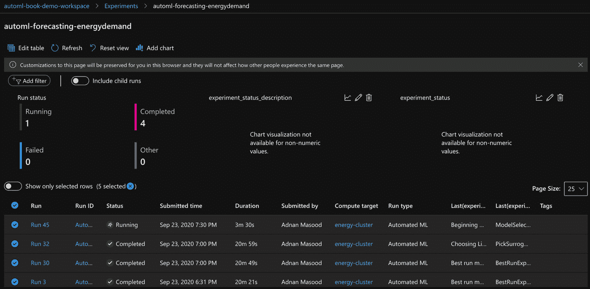

# 五、微软 Azure 自动化机器学习

“到目前为止，人工智能最大的危险是，人们过早地断定他们理解它。”

埃利泽·尤德科夫斯基

Microsoft Azure 平台及其相关工具集是多样化的，是更大的企业生态系统的一部分，是一股不可忽视的力量。它使企业能够专注于他们最擅长的领域，通过改善沟通、资源管理和促进可操作的高级分析来加速增长。在上一章中，我们向您介绍了 Azure 机器学习平台及其服务。您学习了如何开始使用 Azure 机器学习，并且使用 Microsoft Azure 平台及其服务的强大功能对端到端机器学习生命周期进行了粗略的了解。这完全是冰山一角。

在本章中，我们将从查看微软 Azure 中的**自动机器学习** ( **AutoML** )开始。您将使用 Azure 的 AutoML 功能构建一个分类模型并执行时间序列预测。本章将使你具备构建和部署 AutoML 解决方案所需的技能。

在本章中，我们将讨论以下主题:

*   Microsoft Azure 中的 AutoML
*   使用 Azure AutoML 和 JupyterLab 进行时间序列预测

我们开始吧！

# 微软 Azure 中的 AutoML

AutoML 在 Azure 平台中被视为一等公民。功能工程、网络架构搜索和超参数调整背后的基本思想与我们在 [*第 2 章*](B16890_02_Final_VK_ePub.xhtml#_idTextAnchor049) 、*自动化机器学习、算法和技术*和 [*第 3 章*](B16890_03_Final_VK_ePub.xhtml#_idTextAnchor058) 、*使用开源工具和库的自动化机器学习*中讨论的相同。然而，用于民主化这些技能的抽象层使它们对非机器学习专家更有吸引力。

Azure 平台中 AutoML 的关键原理如下图所示。用户输入，如数据集目标指标和约束(运行作业多长时间，计算的分配预算是多少，等等)驱动 AutoML“引擎”，它完成迭代以找到最佳模型，并根据**训练成功**的分数对其进行排名:

图 5.1–Azure AutoML 工作流–AutoML 如何工作

在这一节中，我们将提供 AutoML 方法的逐步演练。在 [*第四章*](B16890_04_Final_VK_ePub.xhtml#_idTextAnchor076) 、*Azure 机器学习入门*中，你看到了 Azure 机器学习的主页面。在那里，我们创建了一个分类模型，并使用笔记本进行了测试:

图 5.2–Azure 机器学习门户

现在，让我们探索一下基于 AutoML 的模型开发在训练和调整模型时是如何工作的:

1.  From the Azure portal, click on **Automated ML** | **Start now**. You will be taken to the following screen, where you can create a new Automated ML run:

    图 5.3–Azure 机器学习–创建自动化的 ML 运行

2.  The first step of creating an automated ML run is selecting a dataset to work with. Here, you can either create your own dataset or – better yet – select an existing one from the repository of public datasets that Azure provides:

    图 5.4–自动数据集选择页面

3.  A dataset can be created from open datasets. In this case, we will use our tried and tested MNIST dataset to create the AutoML run, as shown in the following screenshot:

    MNIST 数据集

    yann le Cun(NYU Courant 研究所)和 Corinna Cortes(纽约谷歌实验室)拥有 MNIST 数据集的版权，该数据集是原始 NIST 数据集的衍生作品。MNIST 数据集已根据知识共享署名-类似共享 3.0 许可条款提供。

图 5.5–从打开的数据集创建数据集页面

一旦您选择了数据集，它将作为您跑步的一部分出现在中，您也可以预览它。除了指定数据集的版本之外，您还可以指定是否要使用整个数据集，或者是否应该将其注册为表格数据源或文件类型数据源:

图 5.6-来自 Azure 机器学习数据集储存库的数据集

选择**创建**后，当数据集成为您跑步的一部分时，您将看到以下屏幕:

图 5.7-来自 Azure 机器学习数据集储存库的数据集

如果单击数据集的名称，MNIST 数据集也可以被视为数据预览的一部分，如下图所示:

图 5.8-来自 Azure 机器学习数据集储存库的数据集预览

让我们面对它——MNIST 像素数据集的预览并不令人兴奋，但如果您有一些更具代表性的数据(医疗保健、零售或金融数据等)，预览将帮助我们了解摄取过程进展顺利，我们不会冒定界符惨败的风险。

同样，数据统计如下图截图所示。如果你喜欢熊猫，就把它当成`describe()`的特色吧。由于其基于图像的性质，这与不太相关，但当涉及到我们将在本章后面使用的一些其他数据集时，它会非常方便:

图 5.9–Azure AutoML 中的数据统计预览

1.  Now that we have selected the dataset, we can configure the run by providing the experiment's name, target column (the labeled feature to train on and classify), and the compute cluster, as shown in the following screenshot:

    图 5.10–配置 AutoML 运行

2.  The third and final step is to select the task type – classification, regression, or time series forecasting. In this case, we are classifying digits based on their associated labels. You will learn how to use the other task types in future examples:

    图 5.11–选择 AutoML 运行的任务类型

3.  It is important to consider the additional configurations. Here, you can select a primary metric, its explainability, any allowed algorithms (by default, all of them are allowed), the exit criteria, and any validation split information, as shown in the following screenshot:

    图 5.12–AutoML 运行的任务类型的附加配置

    附加配置因任务类型而异。下面的屏幕截图显示了回归配置元素:

    

    图 5.13–AutoML 运行的任务类型的附加配置

    **特征化**-即选择并转换要素-是在处理数据集时需要记住的一个重要因素。当你点击**查看特征设置**链接时，Azure 机器学习为你提供以下屏幕。在这里，您可以选择要素的类型，指定特定的数据类型，并指定您希望用什么来估算要素:

    

    图 5.14–AutoML 运行的特征

    **自动特征化**——即将不同的数据类型转化为数值向量——是任何数据科学工作流程的典型部分。下图显示了打开特征时自动应用于数据集的技术(请参见前面屏幕截图顶部的蓝色开关)。下图显示了自动特征化过程中采取的一些关键步骤。你可以在[https://docs . Microsoft . com/en-us/azure/machine-learning/how-to-configure-auto-features](https://docs.microsoft.com/en-us/azure/machine-learning/how-to-configure-auto-features)找到更多关于枚举特征化技术的信息:

    

    图 5.15–AutoML 运行的特征化方法

    **缩放** 和**规格化**(有时也称为**规格化**和**标准化**)是两种重要的特征化方式，处理将数据转换为值的公共范围。自动特征化算法中使用的缩放和标准化技术如下图所示。你可以在[https://docs . Microsoft . com/en-us/azure/machine-learning/how-to-configure-auto-features](https://docs.microsoft.com/en-us/azure/machine-learning/how-to-configure-auto-features)找到更多关于各种枚举缩放和特性化技术的信息:

    

    图 5.16–Azure AutoML–扩展和特性化

    没有提到护栏，特色化这个话题就不完整。数据护栏是 AutoML 引擎的一部分，它有助于识别和解决数据集的问题，如缺失的特征值、处理高基数特征(大量唯一值)、类不平衡(少数类和离群值)等。下图概述了这些你应该熟悉的护栏。你可以在 Azure 文档中阅读关于这些护栏的更多细节([https://docs . Microsoft . com/en-us/Azure/machine-learning/how-to-configure-auto-features](https://docs.microsoft.com/en-us/azure/machine-learning/how-to-configure-auto-features)):

    

    图 5.17–AutoML 运行的数据护栏

4.  Now, when you click the **Finish** button, as shown in *Figure 5.10*, after setting up the given parameters for the task type and any additional configuration items, you will see the following screen, which validates the run:

    图 5.18-AutoML 运行的数据护栏

    要记住的重要一点是，你需要有良好的计算资源来运行一个实验；否则就会失败。比如这个实验，我已经把训练时间设定为 0.25 小时；也就是 15 分钟。对于给定的计算，没有足够的时间，这意味着运行注定会失败，如下面的屏幕截图所示:

    

    图 5.19–AutoML 实验运行设置

    下面的屏幕截图显示，由于我们没有分配正确的计算资源来运行 AutoML 实验，所以它失败了:

    

    图 5.20–AutoML 实验运行失败消息

    以下错误消息详细解释了用户错误，以及潜在的解决方案，如添加计算资源、应用实验超时以及更改数据集采样:

    

    图 5.21–AutoML 实验运行失败消息

    将时间限制增加到 5 小时会有所帮助，您将在下面的步骤中看到这一点。Azure AutoML 现在有足够的时间和资源来执行多个实验。这个教会了你，在时间和/或资源上打折扣不是一个好的汽车策略。

5.  The following screen in the AutoML child run shows individual iterations. It clearly demonstrates how different data preprocessing methods, such as `StandardScalerWrapper`, `RobustScaler`, and `MaxAbsScaler`/`MinMaxScaler`, and forecasting algorithms, such as `RandomForest`, `LightGB`, `ElasticNet`, `DecisionTree`, and `LassoLars`, were used. Runs `54` and `53` in the following screenshot show how ensemble algorithms and their weights can be viewed by clicking on their associated tags:

    图 5.22–AutoML 实验运行细节

6.  点击**模型**选项卡，查看哪个模型提供了什么样的精确度，以及它与关联的运行，如下面的截图所示:

图 5.23–AutoML 实验运行详情

运行指标也是获取相关运行的更详细信息的一个好方法。例如，您可以看到算法的名称、相关的准确度、AUC 分数、精确度、F1 分数等:

图 5.24–AutoML 实验运行细节

为保护数据质量而采取的数据护栏措施可以通过点击相应的选项卡来查看，如下图所示。本页显示了使用了哪些护栏技术来确保用于训练模型的输入数据是高质量的:

图 5.25–AutoML 实验数据护栏

从主运行摘要页面，您可以查看最佳模型及其摘要结果。在这种情况下，基于软投票的`VotingEnsemble()`方法是明显的赢家。这是 Azure AutoML 目前支持的两种集成方法之一。另一个是`StackEnsemble`，它从以前运行的迭代中创建集合。集成方法是用于组合多个模型以获得最佳结果的技术；投票、堆叠、打包和提升是可用于集合方法的一些类别:

图 5.26–AutoML 实验总结页面

假设您已经跟踪了这些实验，并且自己尝试了这些步骤，那么很明显每个运行都有几个子运行——也就是说，每个模型都有单独的迭代。因此，当我们查看**运行**摘要页面的**指标**选项卡时，我们不仅可以看到不同的指标，还可以看到精确召回图:

图 5.27–AutoML 实验精确度指标和 PR 曲线

现在，让我们看看对模型的解释。机器学习模型的可解释性是非常重要的，特别是对于 AutoML。这是因为作为一名主题专家，你想知道哪些特性对结果起了关键作用。在下面的屏幕截图中，您可以看到前 *k* 个特性重要性的表格解释，以及它们如何用于预测 0-9 之间的数字:

图 5.28–AutoML 实验特征说明

前面的屏幕截图显示了哪个特征在预测数字时扮演了什么角色。特征 377 在预测数字 7 时是显著的，特征 379 和 434 在预测数字 9 时是显著的，等等。这个 MNIST 数据集可能看起来与你无关，但让我们假设你正在查看一个人力资源招聘数据集，性别、种族或年龄成为一个重要特征。这将引起警觉，因为这将违反你的性别偏见、种族主义或年龄相关歧视的公司政策。这也可能违反法律，你可能会因为在机器中有一个偏执狂而在合规性和声誉损害方面陷入严重的麻烦。更不用说，基于与员工完成工作的能力无关的属性进行歧视是不道德的(老实说是荒谬的)。

这种可解释性还提供了特征的汇总重要性，在这里您可以可视化单个 k 特征对于全局和局部特征的重要性。如下面的屏幕截图所示，群体图以非常精细的方式可视化了相同的数据。它显示了 MNIST 数据集中的元素数量与其对应的要素之间的一对一映射，类似于前面屏幕截图中的表格表示:

图 5.29-Azure 机器学习前 k 大功能摘要重要性图表

有了对分类的自动化 ML 的概述，让我们继续并将相同的技术应用于时间序列预测。

# 利用 AutoML 进行时间序列预测

预测能源需求在能源供应商喜欢提前预测消费者的预期需求的行业中是一个真正的问题。在本例中，我们将使用纽约市的能源需求数据集，该数据集可在公共领域获得。我们将使用历史时间序列数据，并应用 AutoML 进行预测；也就是预测未来 48 小时的能源需求。

机器学习笔记本是 Azure 模型库的一部分，可以在 GitHub 的[https://github.com/Azure/MachineLearningNotebooks/](https://github.com/Azure/MachineLearningNotebooks/)访问。让我们开始吧:

1.  Clone the aforementioned GitHub repository on your local disk and navigate to the `forecasting-energy-demand` folder:

    图 5.30–Azure 机器学习笔记本 GitHub 存储库

2.  Click on the `forecasting-energy-demand` folder to the Azure notebook repository, as shown in the following screenshot:

    图 5.31–上传 Azure 机器学习笔记本工作区中的文件夹

3.  Once the folder has been uploaded (see the files in left-hand pane of the following screenshot), double-click on the, `ipynb` (notebook) file and open it. You will see the following screen:

    图 5.32–在 AutoML 笔记本工作区中上传文件

4.  Now, open this in JupyterLab by clicking on the respective dropdown, as shown in the following screenshot. It is important to remember that even though you are running the files in JupyterLab, an automated ML experiment is being run in the Azure Machine Learning workspace, and you can always track and view every experiment there. This shows the power of seamless integration with third-party tools:

    图 5.33–在 AutoML 笔记本工作区中上传文件并在 JupyterLab 中打开它们

    现在，该文件运行在一个非常熟悉的环境中，内核是 Python 3.6——Azure 机器学习运行时。这种与笔记本的无缝集成是 Azure 机器学习的强大功能:

    

    图 5.34–在 AutoML 笔记本工作区中上传文件并在 JupyterLab 中打开它们

    由于我们正在处理时间序列数据，因此有必要指出，Azure AutoML 提供了各种原生时间序列以及深度学习模型来支持与时间序列相关的分析工作负载。下面的屏幕截图显示了这些算法的列表:

    

    图 5.35–Azure AutoML 时序功能

    Azure automated ML 附带了各种回归、分类和时间序列预测算法和评分机制，并且您可以随时添加自定义指标。以下屏幕截图显示了 Azure AutoML 分类、回归和时间序列预测算法和度量的列表:

    

    图 5.36–Azure AutoML 分类、回归和时间序列预测算法

    以下是用于测量上述方法准确性的指标列表:

    

    图 5.37–用于分类、回归和时序预测的 Azure AutoML 度量

5.  Skimming over the boilerplate setup code, we can set up the experiment by setting the target column to demand and the time column's name to be the timestamp. Once we've done this, the data is downloaded and made part of the pandas DataFrame, as shown in the following screenshot:

    图 5.38–笔记本电脑中纽约市电源的 Azure AutoML 数据加载

6.  Now, let's split up the data into training and testing sets:

    图 5.39–笔记本电脑中纽约市电源的数据分割

7.  One of the key parameters you will have to set as part of this exercise is the forecast horizon; that is, how far in the future you would like to predict for. The automated ML algorithm is smart enough to know what unit to use (hour, days, or months) based on the time series frequency of your dataset. Based on our business problem, we will set the forecast horizon to `48` (hours) and submit the job, as shown in the following screenshot:

    图 5.40–为预测作业创建 AutoML 配置

8.  Now that we have created the configuration, let's submit the experiment, as shown in the following screenshot:

    图 5.41–将 AutoML 实验提交给远程服务器执行

9.  To demonstrate the integration of Jupyterlab with the Azure Machine Learning service, click on the **Experiments** tab in the ML service portal, as shown in the following screenshot. Here, you can see that the experiment has been submitted and is now prepared to run with the associated config for the AutoML parameters:

    图 5.42–远程服务器上 AutoML 实验的实验窗格视图

    当您等待作业完成时，也可以将 AutoML 配置元素作为笔记本的一部分来观察:

    

    图 5.43–提交作业后运行 wait_for_completion()方法的笔记本

10.  This inherent integration between the notebook and the corresponding experiment can also be seen in the following screenshot. Here, we can see how the **Experiment** notebook is reflected in the experiment console:

    图 5.44–Azure 机器学习的实验窗格中显示的笔记本实验

    该算法的名称和错误的详细资料概述了每次运行，并显示了错误率的持续下降。MNIST 分类的标准化 RMSE 和准确性指标如下图所示:

    

    图 5.45–Azure 机器学习的实验窗格中显示的笔记本实验

    数据护栏类型也值得注意。在下面的截图中，您可以看到它们与我们在分类练习中使用的护栏不同。在这种情况下，根据频率检测和缺失特征值插补来验证数据。AutoML 引擎足够智能，可以了解不同类型的实验和数据集需要应用什么类型的护栏:

    

    图 5.46-Azure 机器学习中实验窗格的护栏

11.  Now that the experiment is complete, we can retrieve the best model in the notebook, as shown in the following screenshot (or in the machine learning service console, if you are visually inclined):

    图 5.47–笔记本中的模型检索

12.  You might recall deep feature search or automated feature engineering being introduced in the previous chapters. You can access and retrieve the engineered features from the notebook with the help of the following steps by calling the `get_engineered_feature_names()` method on the model:

    图 5.48–通过 get_engineered_feature_names 检索工程特征

    查看这些特性的特性化摘要，包括工程特性和有机特性，可以为您提供构建这些特性的基本原理，如下面的屏幕截图所示:

    

    图 5.49–通过 get _ featurization _ summary()查看工程特性概要

13.  使用评分方法，我们可以创建测试分数并在图表上绘制预测点，如下面的截图所示:

图 5.50–构建测试数据分数的散点图

预测数据测试分数为蓝色，而实际分数为绿色:

注意

这个图像对你来说可能是黑白的。当实际操作这个例子时，你会更好地理解颜色参考。

图 5.51–测试数据得分和相关曲线图

`X_trans`捕获特征，包括数据集中的自动特征工程变更，如下面截图中的所示:

图 5.52–X _ trans 显示了能源预测的时间序列特征

尽管 MNIST 数据集的可解释性不太直观，但在探索能源需求数据集方面，您可以可视化不同的模型，并查看哪些功能对预测的使用量影响最大。很明显，温度与全球用电量的重要性正相关。温度越高，空调的使用量就越大，因此耗电量也就越大。模型还认为一天中的时间和一周中的日期很重要，如下图所示:

图 5.53-全球重要性可解释图

在下面的屏幕截图中，不同的解释模型(工程特征与原始特征)将结果与 y 的不同预测值对应起来。模型解释视图有助于我们了解哪些特征会直接影响模型:

图 5.54-全球重要性可解释图

这就结束了我们在 Azure 中使用 AutoML 对时间序列预测的演示。

# 总结

在这一章中，你学习了如何将 Azure 中的 AutoML 应用于一个分类问题和一个时间序列预测问题。你能够在 Azure 机器学习环境中用 Azure 笔记本电脑并通过 JupyterLab 建立一个模型。然后，您理解了整个工作空间与实验和运行的关系。在这些自动化运行过程中，您还可以看到可视化效果；这就是特性重要性、特性的全局和局部影响以及基于原始和工程特性的解释提供直观理解的地方。除了您与工具的密切关系之外，平台与您的企业路线图保持一致也很重要。Azure 是一个整体上很棒的平台，有一套全面的工具，我们希望你喜欢探索它的自动化 ML 功能。

# 延伸阅读

有关本章涵盖的主题的更多信息，请查看以下链接:

*   Azure AutoML:

    [https://docs . Microsoft . com/en-us/azure/machine-learning/concept-automated-ml](https://docs.microsoft.com/en-us/azure/machine-learning/concept-automated-ml)

*   Practical AutoML on Azure:

    [https://github.com/PracticalAutomatedMachineLearning/Azure](https://github.com/PracticalAutomatedMachineLearning/Azure)