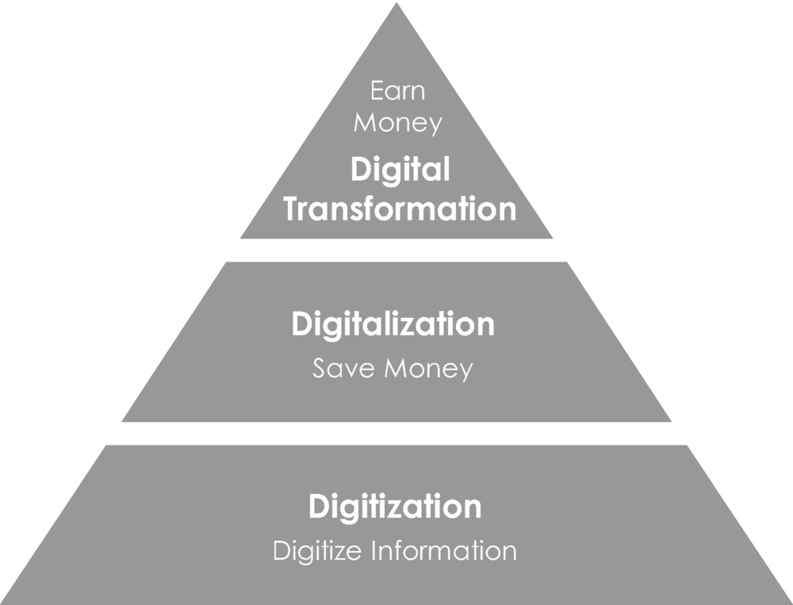
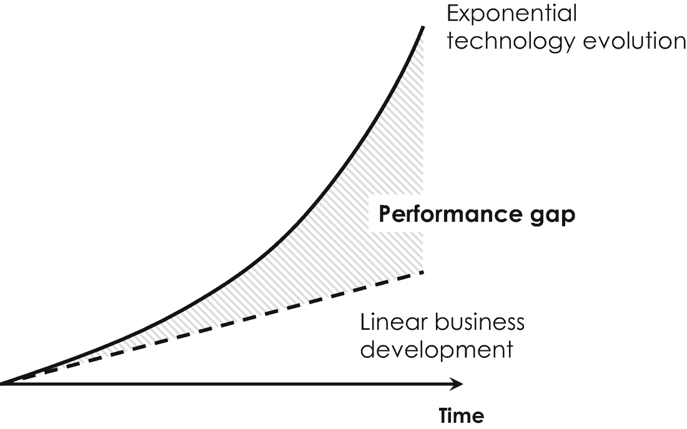
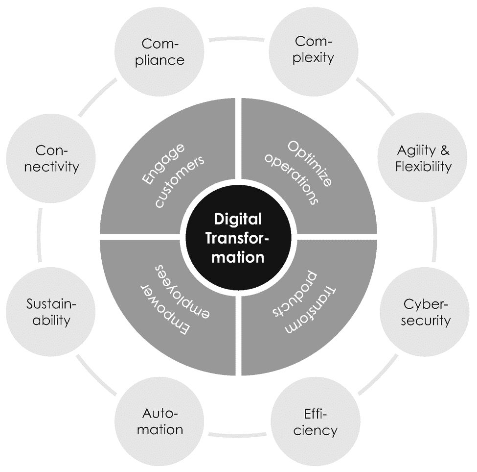
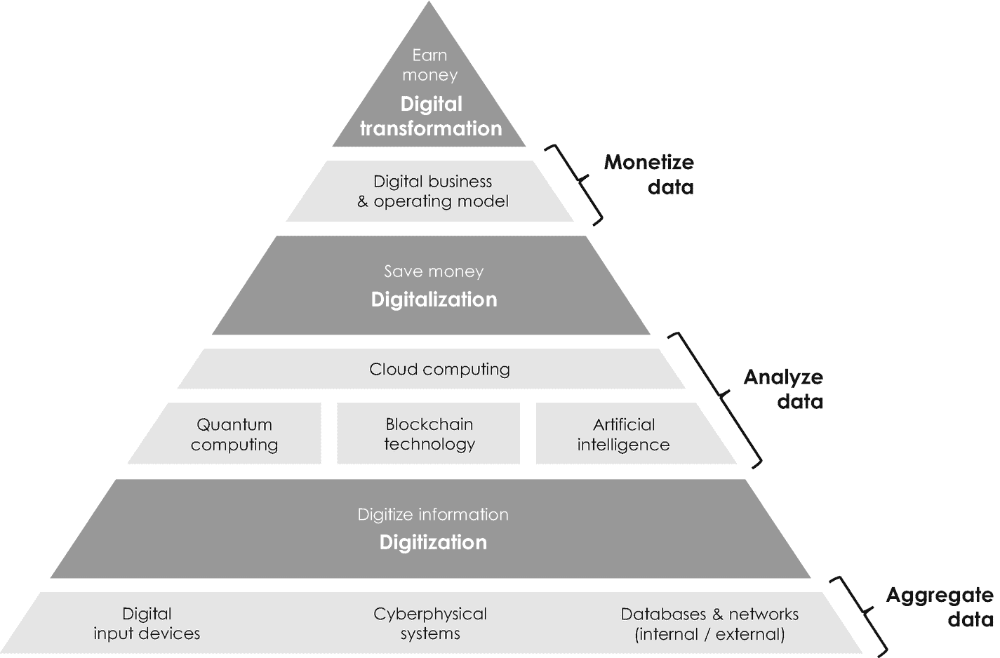
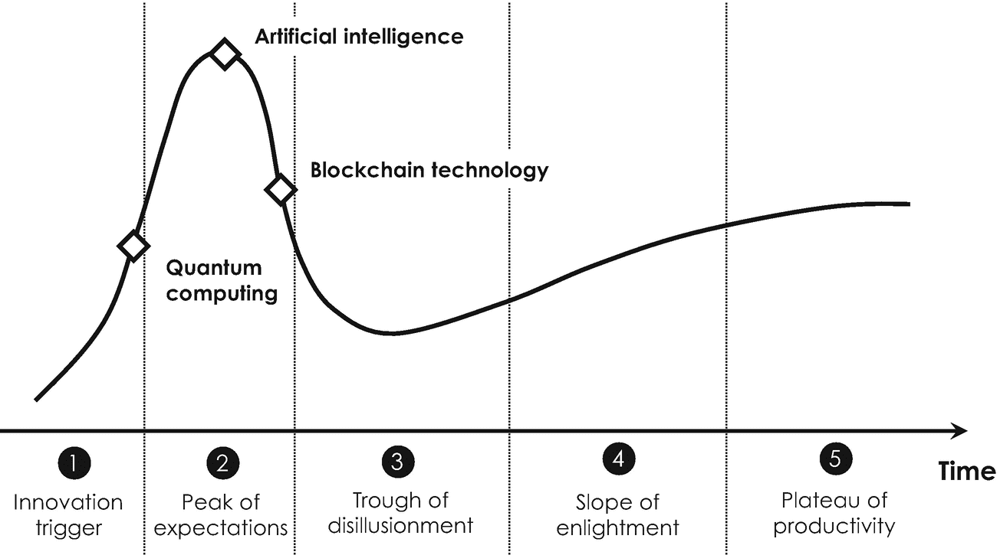
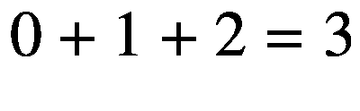
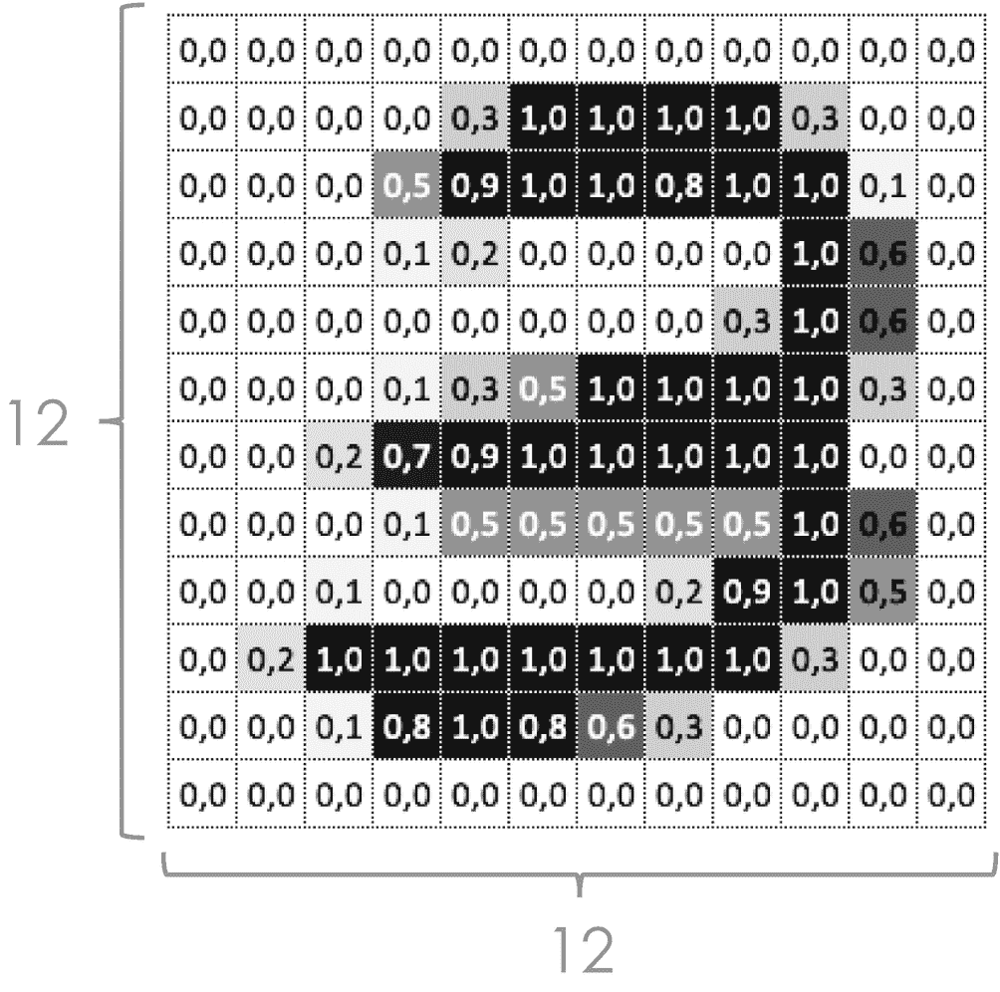

# 一、数字化和数字化转型

数字化是一种技术趋势，正在重塑当今我们工业和社会的所有部门。它被认为是创新和颠覆的主要和不可阻挡的驱动力，对私人和公共组织提出了同样的挑战。随着所有经济和社会部门受到影响，数字经济非常活跃，竞争日益激烈。它使新的创业企业——由数十亿美元的风险资本支持——能够利用数字技术创造新的价值主张。他们高度可扩展、数据驱动和以软件为中心的运营模式越来越多地与现有公司发生冲突，并对其业务构成生存威胁。例如，想想苹果的 iOS 和谷歌的 Android 智能手机。两家公司都建立在一致的数字平台上，吸引了不断扩大的第三方应用开发者生态系统，最终导致诺基亚从手机行业的主导地位跌落到无关紧要的地位。这个故事有可能在整个经济中的任何地方重复:亚马逊、微软和谷歌的云计算服务正在挑战传统的软件和硬件提供商，亚马逊和阿里巴巴的在线市场正在取代传统的零售商并挑战按需沃尔玛等公司，网飞和 Hulu 的视频交付服务即将颠覆传统的付费电视提供商。另一个非常受欢迎的例子是在线预订平台 Airbnb 和 Booking.com，它们利用数字技术来简化预订，并提供个性化和量身定制的旅行体验，同时扰乱了包括万豪、希尔顿和凯悦在内的传统连锁酒店的业务。为了获得数字技术的好处，无论是在公共部门还是私营部门运营，成熟的组织都被迫将数字技术纳入自己的生态系统，通过通常称为数字化转型的组织变革流程来推进其产品和服务组合。与亚马逊、谷歌、微软和其他公司相比，这一技术适应过程对那些不是“天生数字化”的公司来说尤其具有挑战性，因为这些公司需要经历深远的业务转型，这可能会颠覆现有的工作设计和内部业务流程，并需要新的思维和协作方式。

然而，公共部门和私营部门的许多组织确实很难理解数字技术对其业务和服务模式的影响。大多数企业领导人和员工错误地认为，数字化文件和使用 Skype 或微软团队而不是手机将自动导致他们组织的数字化转型。但数字转型——我们将在本书中了解到——不仅仅是将数字技术整合到现有的组织结构中。数字化转型是关于创造敏捷、开放、不断学习和创新的商业文化，释放数字技术的潜力——如量子计算、区块链技术和人工智能——以提高生产率和竞争力，并为客户和员工创造可持续的价值。通过数字化其“核心”，即其最重要的 IT 基础设施、系统和流程，组织可以消除传统瓶颈，实现前所未有的可扩展性和增长——数字化只是一个使能因素，本身并不是一个时髦的目标。

根据麦肯锡公司(McKinsey & Company)最近的一项关于数字化转型的调查，超过 80%的分析公司表示，他们在过去五年中已经做出了这样的转型努力。但是只有 16%的人证实他们成功地改善了业绩，并使他们的业务在长期内不容易受到干扰和破产的影响。另一方面，其他商业分析师评估了数字化转型对工作和就业的影响，并发现目前美国近 40%的工作岗位属于可能萎缩的职业[[2](#Par204)]——类似的数字实际上在其他国家也可以找到。在全球范围内，这一比例意味着到 2030 年将有超过 7500 万到 3 . 75 亿工人需要转换职业和技能以避免失业[[3](#Par205)]——这是一个真正令人担忧的规模。这些数字令人印象深刻地表明，从中长期来看，数字技术将重塑和破坏组织，包括数以千计的工作岗位。这就是为什么我们作为思想领袖、顾问、投资者或员工必须为数字化做好准备，并通过研究数字技术的基本原理和应用来提升我们的技能、资格和知识。我们不需要同时成为量子物理学家、区块链程序员或数据科学家。但是，对数字技术堆栈有一个总体的了解，并理解其操作原理和功能，将使我们能够跟踪媒体的这些趋势，理解创新的产品和服务，评估应用和潜在的使用案例，并最终在我们自己的专业环境中推动数字化转型。数字化基本上构成了我们所有人积极塑造未来数字世界的使命。

在本章中，我们将了解数字化和数字化转型的基本概念，并更好地理解其破坏力的本质和来源。提出的概念是理解量子计算、区块链技术和人工智能这三种最重要的技术的先决条件，这三种技术能够实现和促进组织的数字化转型。但在我们深入研究这些概念之前，将数字转型与过去塑造了我们的行业和社会的其他历史转型联系起来是有益的。

## 1.1 历史业务转型

科学和技术一直在塑造商业和社会。研究这种相互依存关系的历史学家提出了这样的观点，人类经历了四次大的技术采用浪潮，每一次都伴随着社会的剧烈变化和工业生产率的提高。第一次大浪潮与蒸汽机有关，蒸汽机是由英国军事工程师托马斯·萨弗里上尉在 1698 年发明的，它将沸水的蒸汽转化为机械能。蒸汽机最初是为了从采矿业被淹的矿井中取水而开发的，很快它也为其他工业领域的技术创新播下了种子。例如，在英国纺织业，蒸汽机被用来为机械化织机提供动力，与简单的纺车相比，蒸汽机的生产率提高了八倍。但是蒸汽机的应用不仅仅局限于采矿业和纺织业。大约 100 年后，随着蒸汽船和蒸汽动力机车的出现，它也彻底改变了运输业。这两项创新都带来了进一步的巨大变化，因为从那时起，人类和货物可以在更短的时间内进行长距离运输。1760 年至 1840 年 [1](#Fn1) 这段时期被称为*工业革命*或工业 1.0。在制造业和运输业中采用蒸汽和水力发电对老牌公司产生了深远的影响，也促进了新业务的开发，因为人类的创造力不再局限于纯粹的肌肉力量。但工业革命也确实通过创造新的工作和职业对社会产生了重大影响，例如制造业中的机械维修和质量工程师，以及用自动化流程取代手工劳动。结果，第一波技术采用提高了生活水平，让欧洲作为一个整体减少了对农业的依赖，更多地以(消费品)的大规模生产为中心——有利也有弊。

在 19 世纪，三位物理学家安德烈·玛丽·安培、迈克尔·法拉第和詹姆斯·克拉克·麦克斯韦的开创性工作成为下一波技术采用的基础，这是指电的发现，被称为*技术革命*或工业 2.0。电力被证明是一种非常方便的方式来传输大量的能量，也就是说，身体做功的能力，以最小的损耗跨越很远的距离来为灯泡、重型工业机器和其他电气设备供电。它还启发了汽车先驱亨利·福特将电力与大规模生产的理念相结合，并在 1913 年从他的高地公园福特工厂开始，将移动底盘装配线引入汽车行业。 [2](#Fn2) 传统上，汽车是在固定的工位上组装的，不同的工人来到车上运送并组装所需的部件。在装配线上，车辆将在自动传送带上通过一系列连续的工作站，固定的工人执行高度专业化、重复性和标准化的装配任务。在美国工程师弗雷德里克·泰勒(Frederick Taylor)的帮助下，亨利·福特(Henry Ford)成功地将他的传奇 T 型车(被亲切地称为“Tin Lizzie”)的装配时间缩短了十分之一，这一改进极大地降低了制造成本。关于标准化，亨利·福特曾经指出，“任何顾客都可以把车漆成他想要的任何颜色，只要是黑色的。”电动装配线很快提高了几乎所有行业的生产率，同时显著降低了制造成本和工人的体力负担。不用说，1840 年至 1970 年间，电力和装配线的引入对社会产生了重大影响，因为它们在制造领域创造了大量新的工作和职业，同时淘汰了其他工作和职业。

与本书中介绍的数字技术特别相关的是第三次技术采用浪潮，即所谓的*信息革命*或工业 3.0。从 20 世纪 70 年代开始，公司开始通过记忆可编程控制器，即个人电脑的前身，来实现工业制造的自动化。通过使用这样的计算机控制，他们能够在没有任何人工帮助的情况下部分自动化他们的生产过程。这项技术的技术基础可以追溯到 1947 年，当时三位美国物理学家以及后来的诺贝尔奖获得者约翰·巴丁、威廉姆·肖克利和沃尔特·布拉顿在美国新泽西著名的贝尔实验室发现了晶体管。这个微小的电开关，我们将在下文中进一步详细研究，很快成为个人电脑和几乎所有采用微芯片通过处理数字信息来控制制造过程的电子设备的基本构件。IBM 的第一个基于晶体管技术的商业产品是 IBM 608 系统，这是一个橱柜大小的会计计算器，总共有 3000 多个晶体管。相比之下，我们今天使用的计算机和电子设备功能更强大，用途更广泛，在一个微芯片上可以有几十亿个晶体管。

我们目前正在为第四波技术采用做准备，即所谓的*网络革命*或工业 4.0。[3](#Fn3)2017 年以后的这个时期一般指信息通信技术在工业上的应用。工业 4.0 通过将计算机控制的生产系统与现代通信技术相结合，形成一个由连接的传感器和计算设备组成的网络，推动了计算机控制的生产系统，从而实现了所谓的*数字孪生*。这种生产线的虚拟计算机表示允许生产的实时优化和统计过程控制，允许产品在生产线上自主导航，同时旨在自动找到最佳生产资源。这种网络也被称为*物联网* (IoT)，其特征是电子传感器和设备的互联系统，能够自动感知、数据处理、分析和执行。工业物联网完全改变了人和机器之间的互动方式。想象一下智能协作机器人，它们采用先进的传感技术与工人安全协作，支持他们执行复杂的装配任务或处理重型产品。除了这种自动化，工业物联网还允许实施经济高效的预测性维护流程、自我优化生产线、自动化库存管理和其他非常适合自动化过程控制的工业流程。 [4](#Fn4) 物联网也有望促进*智能工厂* [ [8](#Par210) ]的实施，在智能工厂中，生产系统几乎是自主运行的，决策过程通过数据分析和其他数字支持技术实现自动化。工业物联网可以通过利用内部计算资源或按需使用外部资源来实施，如西门子 MindSphere、AWS 物联网和谷歌物联网。

Internet Of Things

物联网是一个由相互连接的对象组成的网络，构建了一个感知、自主和可操作的系统。从不同对象获得的数据被聚集在存储平台上，以使其可用于数据分析服务和功能，这些服务和功能组合不同来源的原始数据，分析它们的共同意义，并将其转化为具体的行动。

在这种背景下，美国著名经济学家、哈佛商学院教授迈克尔·波特(Michael Porter)早在 2014 年就已经推测，“智能互联产品的扩展功能及其产生的数据将迎来一个新的竞争时代” [9](#Par211) 。正如经济学家所描述的那样，数据是新的石油，对那些不采用这些数字技术的成熟组织来说，存在的威胁实际上是非常真实的。

## 1.2 创新和颠覆理论

细心的读者可能已经注意到，在我们之前的讨论中，引发了四次技术采用浪潮的技术，如蒸汽机、电力和晶体管，有三个共同的方面。他们全部

1.  本质上是无处不在的，并不局限于某个特定的工业部门。相反，它们逐渐扩展开来，播种其他技术创新，引发各种溢出效应。

2.  在技术、生产率、成本和速度等方面对现状进行重大改进。

3.  是对其他(现有)技术的补充，比如用于织布机的蒸汽机或用于装配线的晶体管。

这就是为什么研究科学进步和技术变革之间联系的经济学家也将这种技术称为通用技术，因为它们具有通用的性质和跨多个部门的多用途应用[[12](#Par214)。通用技术通常是无竞争和持久的，并通过打开新的机会和催化互补创新的新浪潮来扮演*使能技术*的角色，而不是提供完整和最终的解决方案【[13](#Par215)】——晶体管本身实际上是相当无用的。互联网是通用技术的一个很好的例子，因为它引入了生产、分发、访问和重用数字信息的新方法，实现了在线市场和社交网络平台等创新。

通用技术在现有组织中的应用需要在组织内部进行重大的组织变革，因为随着时间的推移，他们通常专注于以非常高效的方式做一件特定的事情。为了这个目的，他们制定了常规，建立了官僚机构，职业道路，激励系统，以及嵌入的规范系统。此外，他们实施流程并建立遗留系统，这些遗留系统相互加强并助长惰性，这使得适应新技术变得越来越困难，而新技术常常促使组织以不同的方式做事。这就是为什么通用技术对于已经建立的非常成功的组织来说是一个特别的威胁。通过引用这种普遍的行为模式，两位美国经济学家瑞贝卡·亨德森和金·克拉克也将这种创新称为*架构创新*，以强调它们的适应需要组织在不同的内部使用的技术组件和系统之间改变架构[ [14](#Par216) ]。这对组织来说可能非常具有挑战性，但最终往往会有所收获。1995 年，哈佛大学的 Clayton Christensen 和 Joseph Bower 提出了*颠覆理论*，其中也包含了建筑惰性的概念——对技术适应的抵制。这两位美国经济学家当时正在研究硬盘驱动器行业，并问自己为什么某些公司通过采用新技术获得并保持了竞争优势，而其他公司却没有这样做并破产了。在他们的概念中，他们区分了两个主要类别:

1.  *持续技术*改善或增强客户已经重视的现有技术或产品的属性。他们(I)把好产品做得更好，(ii)通常瞄准市场高端最赚钱的客户，以及(iii)提高利润率。换句话说，可持续的技术使得更好的产品可以以更高的利润卖给公司最好的客户。一个例子是平板电视，它仅仅取代了基于真空管技术的电视。

2.  *颠覆性技术*具有完全不同的或新的属性，偏离了客户之前的价值，有时在文献中被称为通用技术的“孩子”。它们本身分为两个子类别，即低端和新市场干扰:
    1.  *低端*中断通常针对的是过度服务的客户，他们的产品价格合理且容易获得，只是“足够好”,但没有表现出超出市场平均水平的优异性能。想一想折扣百货公司，他们想出了一种更便宜的方式来做和传统百货公司一样的事情。

    2.  *新市场*中断与非消费客户和目标客户竞争，这些客户以前无法获得产品或服务。与个人电脑相比，智能手机可以被理解为新市场的破坏，因为它们提供了与个人电脑类似的功能，如互联网和电子邮件，同时对于因拥有成本高得多而无法使用个人电脑的(大众市场)客户来说也是负担得起的。苹果公司的传奇创始人史蒂夫·乔布斯在 2007 年发布第一款 iPhone 时用了一句名言“今天，苹果公司将彻底改造手机。”...].这是有史以来第一次将互联网放在你的口袋里。”新市场破坏的一个重要关键特征是，在社会适应它们之前，它们首先被广泛采用。

后来，当 Clayton Christensen 意识到颠覆性并非源于技术本身，而是源于其对商业战略和模式的影响时，他用持续和颠覆性创新取代了持续和颠覆性技术这两个术语。在这种情况下，重要的是要注意，几乎从来没有一种创新是内在持续的或破坏性的。当部署到市场上，并将其与市场上已经采用的其他技术进行比较时，这种属性就被赋予了。例如，u 盘背后的技术——闪存驱动器对硬盘驱动器来说是破坏性的，但对用于构建个人电脑工作存储器的 DRAM 技术 [7](#Fn7) 来说却是持续的。

从那时起，颠覆就是一种塑造市场及其竞争格局的力量。随着低端和新市场的颠覆性创新变得成熟和强大，它们对现有组织构成了直接风险，因为现有组织没有利用新兴技术来改善其产品和服务。在这种情况下需要注意的重要一点是，在对市场中的现有参与者构成威胁之前，颠覆通常是一个机会。突出这一方面的最著名的例子之一是美国商人乔治·伊斯曼于 1880 年创立的传奇的伊士曼·柯达公司。乔治·伊斯曼之前发明了一种用于冲洗胶卷的干版配方并获得专利，这是一种非常适合大规模生产的工业流程。然后，他在 1888 年推出了一款廉价的(手持式)胶片相机，就是为了使用这项技术而设计的。他打出“你按下按钮，剩下的我们来做”的口号，在接下来的几年里，通过专注于廉价相机和高效的摄影胶片冲洗流程，他开发出了一个非常成功的商业模式。柯达很快成为该行业的市场领导者，并控制了美国大约 90%的胶卷和 85%的相机销售。但是——你可能已经猜到了——这个照片帝国随着 20 世纪 90 年代进入低端市场的数码相机的颠覆而衰落。颇具讽刺意味的是，正是柯达工程师史蒂文·萨森发明了数码摄影，并于 1975 年制造了世界上第一台数码相机。但是柯达的管理层对这种早期原型非常怀疑，因为它的性能很低，并且没有看到它的颠覆性潜力可能会重新定义他们的业务，并消除几十年来积累的竞争优势——颠覆性技术在成为威胁之前是一个机会。相反，柯达的管理层认为，一旦数码摄影的暂时趋势被淘汰，消费者将再次关注打印。这就是为什么他们开始使用他们巨大的营销机器来保护他们的生意。与其主要的日本竞争对手富士胶片(Fujifilm)形成对比，富士胶片将数字技术很好地整合到其业务中，数字摄影的破坏性力量助长了柯达(建筑)的惰性，并没有催化任何变化或数字转型。等到他们意识到自己彻底的判断失误，推出自己的第一台数码相机时，已经太晚了，柯达的低迷已经不可避免。这家有着 120 年历史的公司不得不在 2012 年申请破产保护，出售了他们的专利，并在 2013 年重新成为一家小得多的公司。2018 年，它的销售额约为 13.3 亿美元，是 37 年前传奇价值的十分之一。这个例子和许多其他例子证明，业务中断是一个时间问题，而不是它是否会发生。这就是为什么思想领袖应该通过主动寻找和努力自我破坏来预测变化，而不是在变化发生时应对变化。

柯达伊士曼公司只是克莱顿·克里斯滕森所说的创新者困境的一个例子。这一术语指的是市场领先组织在探索新的破坏性创新的同时利用现有核心业务的挑战，这种创新可以确保未来的市场领导地位，并避免由于市场中新的破坏性参与者而导致的经济失败。在柯达的例子中，这种困境表现在决定是否投资数码摄影上。在边际思维的指导下，柯达的管理层将他们现有的摄影胶片业务的边际成本与数码摄影的边际成本进行了比较，并得出了一个误导性的结论，即追求他们现有的胶片业务更有利可图。换句话说，*边缘思维*使他们偏向于关注过去的成功，而不是引导他们创造未来需要的数字能力。柯达最终未能识别出数码摄影是一项颠覆性技术还是这个市场的“下一个大事件”,最终支付了不投资的总成本 [8](#Fn8) 而不是投资数码摄影的低得多的边际成本 [9](#Fn9) 。经济失败往往是这种边缘思维的后果。与成熟的核心业务相比，对未来创新(包括本书介绍的三种数字技术)的投资几乎总是伴随着低边际利润和高边际成本。但由于它们往往对一个组织未来的成功至关重要，因此从总成本和不投资的战略后果的角度评估对未来创新的投资是很重要的——事情的边际是次要的。美国汽车先驱和商人亨利·福特用一句名言很好地描述了这种洞察力:“如果你需要一台机器而不买它，你最终会发现你已经付了钱却没有它。”有了这些见解、例子和术语，我们现在可以从展现颠覆性力量和推动数字化转型的通用技术的角度来讨论本书中介绍的三种数字技术。

## 1.3 数字生态系统

由于数字化和数字化转型与商业和社会的巨大相关性，它们在文献中被深入研究。管理咨询公司以及像谷歌、微软和亚马逊这样的数字时代公司经常在他们的博客上发表有见地的文章和报告。 [10](#Fn10) 例如，两位通信科学家 Scott Brennen 和 Daniel Kreiss 通过数字通信和媒体对当代社会生活的影响来定义数字化[ [18](#Par220) ]。《牛津英语词典》提供了一个更实用的定义，该词典将“数字化”一词的首次使用追溯到 20 世纪 50 年代中期计算机的出现，并将其定义为“一个组织、行业、国家等对数字或计算机技术的采用或使用的增加”此外，这本英语词典区分了数字化和数字化，后者被定义为“数字化的动作或过程；模拟数据的转换(尤其是在以后使用图像、视频和文本)转换成数字形式最直观的定义之一实际上可以在 Gartner 的 IT 词汇表中找到，该词汇表为这些术语[11](#Fn11)[[19](#Par221)]提供了以下定义:

*   *数字化*是从模拟形式转变为数字形式的过程[...].换句话说，数字化采用模拟流程，将其转换为数字形式，而流程本身没有任何不同的变化。”

*   "*数字化*是指使用数字技术来改变商业模式，并提供新的收入和价值创造机会；这是转向数字业务的过程。”

*   "*数字化转型*可以指从 IT 现代化(例如云计算)、数字化优化到新的数字化商业模式的发明。该术语在公共部门组织中广泛使用，指的是适度的计划，如将服务上线或遗产现代化。

换句话说，数字化和数字化转型是由数字化通用技术推动的企业变革过程。这些定义表明，这三个术语有着内在的联系，并连续出现。这就是为什么学者们有时会使用图 [1-1](#Fig1) 中示例性描绘的金字塔结构来可视化它们之间的关系。这个简单的图形说明了数字化、数字化和数字化转换是相互建立的，数字化是它们的基础。数字化只是将来自传感器和其他输入的信息转换成数字格式，以便进行进一步的数据处理。中间级别的数字化使用这些数字信息得出结论或发现有洞察力的隐藏模式，从而通过优化和自动化业务流程来节省资金。这个金字塔的最高层是数字化转型。它允许公司节省资金，但也通过创造新的市场和提供新的商业机会赚取额外的钱。数字技术推动了数字化转型。这就是为什么它有时被称为*技术驱动的数字转型*的原因，以强调它依赖于将不同的数字技术集成和跨学科卷积到组织的所有核心领域中——这是一个重要的方面，我们将在下面详细讨论。

图 1-1

数字化、数字化和数字化转型之间的关系

Digital Transformation

数字化转型是一个战略规划和深远变革过程的旅程，旨在实施以软件和数据为中心的组织。它是通过数字化和数字化实现的，并通过利用数字支持技术来培养，如量子计算、区块链技术和人工智能。

*数字技术*通常有助于数字信息的(1)处理、(2)通信和(3)存储。在过去几十年中，根据经验观察到的三个指数定律，描述了这些核心方面中的每一个的及时演变:

1.  *摩尔定律*描述了处理能力的指数进化，并指出计算机芯片中的处理单元数量每 18 个月翻一番 [22](#Par224) 。

2.  *黄油定律*与网络的通信速度有关，每 9 个月就会翻倍 [23](#Par225) 。

3.  克雷德定律(Kryder's law)指出，存储容量每 13 个月翻一番[ [24](#Par226) ]。

考虑到像汽车这样的成熟产品需要超过 24 个月的开发时间，这些确实是指数级和惊人的时间尺度。虽然数字技术的三个核心维度揭示了指数级的及时演变，但我们的大脑通常不习惯这样的指数级发展。这也是为什么大多数领导者低估了数字技术对组织的影响，因为他们经常揭示过去几年的线性发展。为清晰起见，图 [1-2](#Fig2) 描绘了指数级技术和线性业务发展之间的差距。它通常与未开发的商业机会有关，并且经常由利用数字技术的创新型创业公司来填补。这种性能差距会随着时间的推移而扩大，并直观地反映出对技术支持的数字化转型的需求。

图 1-2

线性业务发展(虚线)与指数技术发展(实线)。由此产生的缺口(阴影区域)通常由创新型创业公司填补

但是，数字化转型不仅仅是将数字技术集成到现有的 IT 基础设施中，以实现前面提到的无纸化流程。例如，首席信息官社区“企业家项目”指出，“数字化转型是将数字技术整合到业务的所有领域，从根本上改变您的运营方式和向客户交付价值的方式。这也是一种文化变革，要求组织不断挑战现状，进行试验，并坦然接受失败。数字化转型有助于组织在日益全球化和互联的世界中继续提高生产力和竞争力，这个世界的特点是经济、环境和社会发生了巨大变化。柯达和其他公司的例子清楚地表明，抵制某些技术的组织面临着被破坏的风险。

专家们提出了各种因素，这些因素可能预示着一个行业对颠覆的脆弱性。中断的最重要迹象是

*   顾客满意度在下降。

*   客户群正在老化。

*   给顾客带来不便。

*   客户忠诚度低[[27](#Par229)]。

*   产品和服务的高成本促使人们使用技术来节约成本，而不是增加客户生活的价值。

*   风险资本家的兴趣越来越大，作为局外人，他们看到了该领域隐藏的机会。

如果我们将这些迹象与当前行业(如汽车或医疗保健行业)的状况进行比较，你可能会很快注意到，几乎所有公司都面临着类似的挑战和威胁，就像 28 年前的柯达一样。如今，公司面临着一个日益复杂的世界，其特点是数字技术扩散到他们的*生态系统中。* [12](#Fn12) 但是，正如我们将在下一节中看到的，复杂性并不是推动当今私人和公共组织数字化转型的唯一力量。

### 主要驱动力

数字颠覆是一股非常强大的力量，从那时起就一直在改变着企业的格局。今天的组织不仅仅被驱使将数字技术集成到他们的核心流程中。他们也经常发现自己在与本行业之外的创新竞争者竞争，比如汽车制造商和移动服务提供商。随着车辆变得越来越互联，老牌汽车制造商的商业模式受到了为点播娱乐和信息娱乐服务提供市场的数字商业模式的威胁。这两种功能都越来越多地嵌入到车辆的生态系统中，并以运输中的自动驾驶汽车的驾驶员和乘客为目标——可以说，车辆变成了“轮子上的智能手机”。移动服务提供商优步、Lyft、滴滴出行和 Waymo 以及谷歌汽车服务提供的(开源)汽车操作系统只是指向高度互联和面向服务的驾驶体验的几家公司。这就是为什么软件平台提供商尤其有望在未来的汽车行业占据越来越重要的位置，并有可能连接和“协调”传统的不同参与者。汽车行业的这种转变预计也将影响相关的商业部门，例如包括保险公司、车辆维修和保养提供商、(充电)基础设施提供商、执法机构以及依赖汽车税的其他政府机构。三位经济学家罗伯特·博克(Robert Bock)、马尔科·伊恩西蒂(Marco Iansiti)和卡里姆·拉哈尼(Karim Lakhani)最近在哈佛商学院(Harvard Business School)进行的一项研究表明，采用数字技术创新商业模式的“数字领导者”的运营利润率和利润比“数字落后者”高出不止一个数量级[ [30](#Par233) ]。换句话说，在早期进行正确的技术投资会转化为日后更高的盈利能力和收入增长。那么，这种转变的主要驱动力是什么，我们需要了解什么才能充分利用数字技术的潜力呢？最重要的如图 [1-3](#Fig3) 所示，并在下文中依次解释。

图 1-3

外部驱动力(浅灰色)和数字化转型的四大支柱(深灰色)

#### 主要驱动力:复杂性

复杂性可能是最强的驱动力之一，并且有各种各样的催化剂。其驱动因素包括:(1)个性化，旨在为客户提供个性化定制产品体验的营销圣杯，(2)全球化及其由众多供应商和合作伙伴组成的日益复杂的供应链，以及(3)数字化和决策中必须考虑的日益增长的数据量。关于个性化以及产品和服务的日益多样化，网飞的首席沟通官乔里斯·埃弗斯(Joris Evers)很好地描述了这一点，并在 2013 年告诉*纽约时报*:“网飞有 3300 万个不同的版本” [32](#Par235) ，这意味着每个用户的客户体验越来越个性化，并根据个人需求量身定制。

#### 主要驱动力:敏捷性和灵活性

在日益全球化的世界中，内部业务流程的敏捷性、灵活性和速度是在高度动态和快速变化的业务环境中取得成功所必需的。例如，敏捷的产品开发过程对于缩短开发时间和满足客户的期望至关重要，客户期待着频繁的更新和将他们的反馈快速集成到现有的产品和服务中。

#### 主要驱动力:网络安全

网络安全重视保护与组织竞争优势相关的数据，如知识产权和客户数据，防止被盗或损坏。它在数字时代越来越重要，在这个时代，数据不再局限于封闭的数据库和遗留系统，而是可以畅通无阻地在网络中流动。单靠高网络安全标准不太可能赚很多钱，但糟糕的网络安全会让组织付出大量时间、金钱和麻烦。这方面最突出的例子之一是 2017 年春天渗透到全球 150 个国家众多组织的“WannaCry”计划。该程序通过电子邮件分发，锁定计算机，并要求用户支付一定金额来解锁他们的设备-这次网络攻击造成的经济损失估计在全球范围内约为 40 亿美元。网络攻击是个人、企业和政府面临的快速增长的风险，会造成财务和声誉损害。这就是为什么 it 安全市场每年增长 10%不足为奇。但不幸的是，这种增长跟不上威胁数量的增长，威胁数量每年大约翻一番，这是指数级技术增长和线性业务反应之间不匹配的又一个例子。

#### 主要驱动力:效率

从那时起，效率就是塑造组织的一种趋势。它通常描述避免浪费资源的能力，包括材料、能量、努力、金钱和时间。效率原则是一个经济原则，它表明如果一个企业以尽可能低的成本生产其产品和服务，它就是最有效率的。由于数字技术确实可以通过简化内部流程来节省资金，因此效率几乎是组织数字化转型的自然驱动力。

#### 主要驱动力:自动化

自动化是指通过自动化生产过程来提高生产率。这包括由智能的环境感知机器人实现的工业制造自动化，也包括物流和库存管理系统等行政管理流程的自动化。管理过程自动化的一个例子是在满足某些合同条件时执行的自动支付，例如在公司的仓库中收到货物。

#### 主要驱动力:可持续性

可持续性是指有限(自然)资源的最佳利用。这种驱动力从避免浪费到最大限度地减少对环境有害的排放，依赖于优化材料和能源消耗过程。一个例子是可移动性，它可以减少电池电动汽车生产和运行过程中对环境有害的排放。

#### 主要驱动力:连通性

从客户的角度来看，客户方的连接指的是由以前完全不同的参与者开发的完全连接的产品和服务。想想分别嵌入汽车导航和娱乐系统的谷歌地图和苹果 CarPlay。从公司的角度来看，连通性也可能指将越来越多的数字设备添加和互连到制造基础设施，以实施预测性维护或工业物联网，以实现生产流程自动化。因此，连通性可以指组织内部和外部的技术趋势。

#### 主要驱动力:合规

对于处于高度管制的生态系统中的组织，安全和质量相关信息的透明管理是合规性和不当行为相关风险的重要组成部分。由于法律法规和内部最佳实践迫使组织改进卓越运营、组织、清晰性、透明度和责任，对记录某些业务流程(如车辆安全气囊的生产)的要求渗透到组织中。例如，数字技术有助于创造信息透明度，增强整个价值链的可追溯性，并完整和永久地记录业务流程。

生态系统日益增加的连通性和复杂性与另一个术语有着内在的联系，这个术语在今天的媒体中继续引起极大的关注。这里指的是术语大数据。*大数据*指的是对太大或太复杂而无法通过传统信息处理技术处理的数据集进行系统收集和分析。该术语首次出现在 1997 年由美国宇航局的两位研究人员迈克尔·考克斯和大卫·埃尔斯沃思撰写的一篇论文中，他们写道:“数据集通常非常大，占用了主存储器、本地磁盘甚至远程磁盘的容量。我们称之为大数据问题” [33](#Par236) 。随着 2004 年脸书和 2005 年 YouTube 的首次亮相和迅速崛起，智能手机和其他移动设备全天候消费和创造数据的时代开始了。此后，通过万维网的每月数据流量不断增加，并在 2010 年达到每月 200 亿千兆字节。四年后，根据 GSMA 的报告[ [34](#Par237) ]，移动连接的数量达到了 72.2 亿，首次超过了地球上的人口数量。2018 年，全球各地的人们每分钟在 YouTube 上上传超过 400 小时的视频。此外，同年，他们在全球范围内每分钟发送约 1.56 亿封电子邮件和发布超过 452，000 条推文，这相当于每天增加超过 1 zettabyte 或 1021byte 的数据[13](#Fn13)-这是一个真正令人惊叹的大数据示例。

大数据分析通常需要使用统计方法来提取具有相关业务影响和经济价值的信息。大数据通常有三个特征，即数量、速度和多样性。 *Volume* 简单来说就是指数据量，而 *velocity* 则是指数据产生的速度。*种类*描述了不同数据格式的可用性，比如文本、音频、视频和其他类型的数据。 [14](#Fn14)

从战略角度来看，如果严格避免数据泄露和滥用，大数据可以成为一种持久的竞争优势。赢得和保持客户的信任是以数据为中心和数字技术驱动的公司的核心。《纽约时报》2012 年发表的一篇名为《公司如何了解你的秘密》的文章描述了这意味着什么。这位记者讲述了一位父亲的故事，他去当地的杂货店抱怨他十几岁的女儿奇怪地收到了婴儿用品优惠券。店长道了歉，几天后又打电话来再次道歉，才得知女儿其实怀孕了。你可以想象商店最终无可挽回地失去了女儿这个顾客。

Big Data

大数据是指组织每天收集的大量不同的数据集，可以从中挖掘有价值的见解和信息，从而提供附加值。它是从以下几个方面描述的:( 1)体积或大小,( 2)创建和收集数据的速度,( 3)覆盖的数据点的种类或范围。

### 1.3.2 数字化转型战略

这些驱动力对喜欢采用数字技术的企业有着重要的影响，因为它们必须超越现有的业务和运营模式，找到创新和有效的方式来整合它们。到目前为止，数字化转型代表了一种端到端的业务转型，它从根本上改变了组织的运营方式以及向客户交付价值的方式。在此过程中，组织需要建立运营变革管理作为管理数字化转型的核心能力，这是我们将在第 [5](5.html) 章“您的数字化行动计划”中更详细探讨的一个方面。国际数据公司(International Data Corporation)的杰西卡·戈弗特(Jessica Goepfert)在这种背景下观察到:“这种(数字)转型因行业而异。例如，在银行和零售业[...]投资都是为了管理和重振客户体验。而在制造业，企业正在将自己重塑为本质上的高科技公司，使用他们的产品作为一个平台来实现和提供数字服务" [36](#Par239) 。

那么，面对前面概述的数字驱动力和技术趋势，组织应该如何应对呢？在我们仔细研究亚马逊、谷歌和其他公司的数字化转型战略之前，有必要介绍一个在文献中经常出现的经典辩论。这场辩论为解决之前讨论的克莱顿·克里斯滕森的创新者困境铺平了道路，并且是关于开发和探索之间的相互平衡。*开发*是指专注于现有的收入流，优化既定领域的卓越运营，而*探索*是指寻找和尝试新的增长机会。著名的加拿大学者、商业和管理作家亨利·明茨伯格从战略的角度描述了这种决定性的平衡，并指出商业机会和战略通常来自两个不同的来源:(1)预期的和计划的，以及(2)未预料到的机会，通常出现在试图实施原始计划或战略时。第一种选择被称为*深思熟虑的战略*，最适合通过分析未满足的客户需求并相应地设计未来的产品和服务来开发现有的收入流。第二个选项叫做*紧急战略*，是关于探索新机遇和解决意料之外的问题。战略几乎总是深思熟虑的机会和意料之外的机会的组合，因为它是从大量的日常决策中合并出来的，以追求某些机会并在实践中优先开发某些产品和服务。这也是为什么英特尔创始人、前 CEO 安德鲁·格罗夫曾经说过，“如果你想知道一个公司的战略是什么，不要听他们说什么，要看他们做什么。”

对这两个战略方向中任何一个方向的过度关注都会带来风险。如果公司过于关注利用现有的(和历史上成功的)商业活动，他们就会忽略探索新领域的需要，这些领域可能会在未来为他们提供新的商业机会，并提高他们的长期生存能力。这种风险通常被称为*成功陷阱* [ [40](#Par243) 。在这种背景下，一个非常受欢迎的例子是瑞典电信公司诺基亚，它长期以来一直是手机销售的市场领导者，但未能及时迁移到触摸屏技术，从而为现代智能手机铺平了道路。

另一方面，如果公司主要专注于探索新的商业活动，他们就会受到所谓的*永久搜索陷阱*的威胁，这是指公司未能对早期创新进行规模化和货币化。在这方面，一个经常被引用的例子是施乐科技公司，它是美国一家大型办公设备生产商。早在 1984 年苹果公司的麦金塔电脑问世之前，位于硅谷和斯坦福大学创新中心附近的施乐 PARC 实验室的工程师们就提出了电脑鼠标和图形用户界面等开创性发明。然而，施乐当时并没有平衡这两种技术的潜力，也没有在现有产品中开发它们。相反，他们公开地向其他商业领袖展示它们，包括苹果公司的传奇创始人史蒂夫·乔布斯，他曾经在参观施乐 PARC 实验室的产品时提到:“你坐在一座金矿上。你为什么不用这项技术做点什么？你可以改变这个世界！”

在利用数字技术方面特别成功的组织都具有平衡两个战略方向的能力。他们通过调整产品和服务以适应当今客户的需求来利用现有的收入来源，同时通过探索和试验新的商业机会来适应环境的变化。这也是为什么经济学家在这种情况下也谈论“双元组织”[42](#Par245)。正如我们在下面的例子中所看到的，双元性和谨慎平衡开发和探索的能力是每一次数字化转型的核心。

微软公司一直在制定一项非常成功的战略，以平衡开发和探索，不断调整其产品和服务，以适应不断变化的商业环境，这是全球领先的数字化和数字技术倡导者和所有者之一。在 2016 年微软全球合作伙伴大会的主题演讲中，微软首席执行官塞特亚·纳德拉用以下四个基本支柱描述了数字化转型，如图 [1-3](#Fig3) [ [43](#Par246) 的内圈所示:

1.  *运营优化*包括内部业务流程的数字化，通常从将公司的 IT 基础设施转变为基于平台的架构开始——我们将在第 [5](5.html) 章“您的数字化行动计划”中进一步讨论这一措施任何优化的基础都是对现状的透明，这是各种数字技术的主要目标。

2.  *转变产品和服务*是指通过整合新技术来提升现有产品或服务组合，从而创造新的商机和收入流。

3.  *赋予员工权利*对于成功的数字化转型至关重要。员工需要能够在任何地点、任何时间、任何设备上尽可能地工作，这样他们才能更有效率，提高工作效率和生产力。此外，他们需要获得自主工作的能力，并根据个人的优势和劣势、兴趣、工作经历和资质选择项目。

4.  成功数字化转型的另一个先决条件是*与客户*互动，要求他们提供反馈并分析他们的回应，以更好地了解他们的需求并相应地个性化产品。客户的期望决定了未来的产品和服务，这也是他们广泛定义任何数字业务转型的战略方向和目标的原因。

微软的四大支柱清楚地表明，数字化转型不是公司 IT 基础设施的一系列更新，也不是基于公司数据迁移到数字平台的简单业务流程数字化。数字化转型是关于(1)通过开放和交流的文化创造创新的思维模式，(2)将积极进取和多样化的人聚集在一起，以及(3)提供高效和同样有用的 IT 工具，以最佳方式支持人员和业务流程。这是在日益全球化和相互联系的世界中保持增长和竞争力的秘诀。在 2016 年发布的一份有影响力的白皮书中，世界经济论坛写道，数字化转型:

机器人和人工智能系统不仅将用于取代人类的任务，还将用于增强他们的技能。这也将为企业带来挑战，企业需要重新培训员工，以便他们能够利用新技术有效地工作。[...要实现技术进步的全部潜力，不仅仅是提高生产率，还要减少自动化带来的失业，再培训将是至关重要的。

也许比任何其他组织，亚马逊体现了一个组织可以利用数字技术来改变其业务的方式，这就是为什么我们将更密切地关注这个例子，一个非常成功的双手并用的公司。1994 年，美国计算机科学家杰弗里·贝佐斯利用他高超的讲故事技巧，向各种风险投资家展示了他关于在线市场的商业理念。他的故事引人入胜，同样简单。他设想通过投资于客户利益，如最低价格、丰富的产品选择和快速交货，建立世界上最大的商店。在那之前，风险资本家的宠儿总是利润。杰弗里·贝佐斯成功地打破了这一传统，用令人信服的愿景和伟大的增长前景取代了利润。他从投资者那里筹集了 21 亿美元的资金，并于 1994 年创办了亚马逊图书在线市场——图书似乎是他开创电子商务利基市场的最佳选择，因为它们是定制产品，财务价值和风险较低。为了超越竞争对手并强化商店的核心价值，他很快向第三方商家开放了名为销售平台的亚马逊市场，并开始销售电子产品、软件、视频游戏和一系列其他(消费)商品。随着客户、供应商和第三方商家的数量稳步增长——亚马逊市场现在占亚马逊销售额的 40%以上——该公司开始看起来像任何其他传统公司一样，并遇到了日益增加的复杂性成本和其他严重限制进一步增长和价值的因素。亚马逊已经发展成为一个孤岛式的架构，拥有众多的组织分支，专注于不同的零售领域、客户和产品细分。每个部门都实施了自己的软件解决方案，以满足其被分配的特定职能的需求，并在自己孤立的业务环境中进行自我优化。因此，其 IT 基础架构高度分散，许多不匹配的软件应用运行在不兼容的 IT 系统上，并访问各种充满不一致和非标准化数据的分散数据库。

此时，Jeffrey Bezos 意识到，管理这一日益复杂的基础设施的唯一方法是将他的公司数字化转型为一个现代软件和数据驱动的组织，充分利用数字技术的优势。为此，他试图打破长期以来形成的组织和技术孤岛。他没有通过将复杂性分成更小的功能单元来管理复杂性，每个功能单元专注于单独的和高度专业化的任务，而是根据著名的*镜像假设*设想了一个具有集成功能团队的敏捷组织。这一观察可以追溯到美国计算机科学家梅尔文·康威，他在 1967 年很好地指出，公司被迫设计反映其组织结构中普遍存在的通信模式的系统。换句话说，高度集成和复杂的软件应用无法由高度分散的功能单元开发，这解释了为什么杰弗里·贝佐斯(Jeffrey Bezos)为他的公司引入了由敏捷协作模型支持的新组织结构。这一组织变革对于该公司核心基础设施的数字化也至关重要，其基础是共享软件平台的实施，该平台包含中央数据管道以及可通过清晰的用户界面快速部署的标准化软件模块。 [16](#Fn16) 这些软件和数据分析工具用于分析客户，了解他们的偏好，并创建个性化的报价和产品推荐，从而推动销售并保持持续增长。这个中央数据和软件平台由亚马逊网络服务公司(Amazon Web Services)提供和维护，该公司是一个快速发展的部门，同时向公众开放，占亚马逊 2018 年 2300 亿美元总年收入的 11%以上。成立 12 年后，亚马逊最大的部分仍然是其在线零售市场，占总年收入的 52%以上——这是由数字化转型书写并由数字技术推动的又一个持久的成功故事。

### 1.3.3 数字关键技术

前面的例子已经表明，数字化、数字化和数字化转型建立在不同的支持技术之上。数字化从用于数据创建、聚合和收集的三大类设备和系统中获取数据。第一组超越了数字输入设备，如计算机键盘或图像扫描仪，它有助于将模拟信息直接转换成数字信息。*信息物理系统*包括传感器，是信息的第二来源。它们用于实时监控工业生产线中的物理对象和过程，包括测量能耗的智能仪表、帮助工人的可穿戴设备或检测机器中是否存在工件的光传感器。第三组是组织内部和外部的*数据库*和*网络*，例如私有内部网和公共互联网。数字输入设备、网络物理系统以及数据库和网络是最重要的信息来源，也是典型数据聚合基础设施的基础，如图 [1-4](#Fig4) 中的扩展金字塔所示。

图 1-4

数字化、数字化和数字化转型之间的关系(深灰色)及其聚合、分析和货币化数据的促成因素(浅灰色)。所有数字技术的基础是将模拟数据转换成数字数据的数据聚合系统

从这些来源获得的数据通常存储在数据聚合平台或*数据湖*中，这使其可用于数据处理。 [17](#Fn17) 这就是本书介绍的三种对焦技术发挥作用的地方。也就是说，量子计算、区块链技术和人工智能让我们能够处理、分析并最终货币化数据。它们是公共和私营部门实现数字化和数字化转型的最重要的使能技术，也是让数据发挥效用的先决条件。包括量子计算、区块链技术和人工智能在内的数字技术可以通过三种方式创造价值:它们(1)通过自动化等方式降低成本；(2)通过例如推动销售和效率来增加收入；以及(3)创建新的业务线。组织既可以通过构建自己的内部资源和能力来使用这些支持技术，也可以通过订阅*云计算*服务来使用这些技术，我们将在第 [5](5.html) 章“您的数字行动计划”中对此进行更详细的讨论。云计算是一种 IT 基础设施，可以通过互联网按需访问不同的计算服务。云计算为传统的数据存储和处理提供资源，也为更先进的数字技术提供资源，如量子计算、区块链技术和人工智能。最受欢迎的云计算供应商是 AWS、微软 Azure、谷歌云和 IBM Cloud。

量子计算有时被描述为计算的下一个前沿，因为它允许解决非常复杂和计算密集型的商业问题。另一方面，区块链技术是通过加密和可信数据库管理信息的概念性突破，这些数据库使数据可供加入分布式区块链网络的每个人使用。人工智能可能是三者中最受欢迎的支持技术。它允许从大数据中推断模式，以简化、优化和自动化业务流程，包括制造和管理流程。围绕这些技术的大肆宣传大多来自媒体上关于理论上可能实现的东西与现实中可以实现的东西的大量文章和报道。美国科学家和未来学家罗伊·阿马拉(Roy Amara)曾指出:“我们(人们)往往高估一项新技术在短期内的效果，而低估其长期效果，”这一观察结果后来被称为*阿马拉定律*。

全球研究和咨询公司 Gartner 根据新兴技术受到的公众关注分析了技术采用的不同阶段。其结果是 Gartner 的*炒作周期* [ [47](#Par250) ]，定性描述了技术采用的五个阶段，如图 [1-5](#Fig5) 所示:

1.  *技术触发*:炒作周期的开始。它始于公众对一种技术的介绍，这种技术引起了公众和媒体越来越大的兴趣。

2.  *过高期望的顶峰*:与新兴技术相关的期望和希望超出了其能力的现实。在引入互联网的情况下，这种炒作表现为 2001 年突然破裂的“网络”泡沫。

3.  *幻灭低谷*:泡沫破裂的结果，它用幻灭取代了最初对技术潜在价值的兴奋。

4.  *启蒙的斜率*:随着早期采用者克服最初的障碍并找到新兴技术的有价值的应用，兴趣增加，这反过来吸引了越来越多的追随者。

5.  生产力的平稳期:宣传周期的最后阶段，当越来越多的组织意识到一项技术的现实好处并决定在自己的业务中采用它们时，这一阶段就形成了。从图表上看，这种采用率的急剧上升就像一根曲棍球棒。

图 1-5

Gartner 炒作周期的五个阶段，以及量子计算、人工智能和区块链技术的现状。转载自[ [48](#Par251)

:

Gartner 经常更新其品牌宣传周期，2018 年的最新版本将于[ [48](#Par251) ]推出。这种炒作周期表明，量子计算目前即将进入第二阶段，区块链技术即将进入第三阶段。人工智能目前处于第二阶段的顶峰，这解释了它在今天的媒体中的受欢迎程度和巨大关注。一些人批评 Gartner 炒作周期缺乏证据，并且与实践中的技术吸收不匹配。然而，它确实提供了一个关于媒体如何看待技术以及相关文章和新闻应该如何解读的有用方向。

Gartner 的炒作周期从媒体关注和公众期望的角度描述了技术的采用，而 *S 曲线*则从行业层面描述了销售和收入随时间的发展。这种常见的工业模式揭示了三个主要阶段，如图 [1-6](#Fig6) 所示。第一阶段由早期采用者主导，他们探索和试验一项新技术，以找出其潜在的用例以及最适合客户需求的实用的*主导设计*(或“行业标准”)——在这个所谓的*紧急阶段*，与之相关的销售和收入很低。随着主导设计的出现，越来越多的公司顺应技术趋势，因此在这个*增长阶段*销售额和收入大幅增加。随着越来越多的公司采用新技术，市场竞争变得更加激烈，迫使一家或另一家公司离开。这种调整是成熟阶段的开始，增长率下降，销售和收入饱和。这个阶段随着另一种扰乱市场的技术的出现而结束，标志着旧技术 S 曲线的结束和新技术 S 曲线的开始。在量子计算、区块链技术和人工智能领域也会观察到同样的模式。例如，后者预计到 2025 年将达到 1260 亿美元的规模。

图 1-6

随着时间的推移，与新技术相关的销售或收入的典型演变类似于 S 曲线(黑线),并经历三个不同的阶段。虚线描述了在每个阶段与技术相关的公司数量

### 1.3.4 谷歌、亚马逊公司的创新模式

为了更好、更全面地理解数字化转型，简要了解一下谷歌、IBM 和亚马逊为持续实现数字化转型而实施的创新模式是有益的。让我们首先强调一下谷歌创新模式的几个方面。谷歌的业务一直由数据、网络和软件驱动。从将世界上最好的搜索算法商业化开始，谷歌很快转向开发和增强其广告技术。此外，它将 Android 变成了世界上最受欢迎的软件平台，最近还成功推出了其新颖的云计算业务。如果没有其独特的创新模式，所有这一切都是不可能的，据报道，这种模式依赖于以下九项创新原则[ [50](#Par253) ]:

1.  创新来自任何地方，公司内外，自下而上，自上而下，在你最意想不到的地方。

2.  把注意力放在用户或客户身上，钱的事以后再操心。

3.  在改进事情时，目标是做得好十倍，强迫自己跳出框框思考——10%的改进只会带来增量变化。

4.  押注于独特的、能带来重大创新的技术见解。

5.  经常并尽早发布和迭代你的产品，不要等到它们完美的时候。让用户根据他们的反馈帮助你不断改进你的产品和服务。

6.  给员工 20%的工作时间来从事他们自己热爱的项目，“他们会用他们的创造性思维取悦你，”谷歌的首席社交传道者戈皮·卡拉伊尔曾经说过。

7.  默认流程对所有用户开放，最终培养整个用户群的集体能量。

8.  好好失败，从失败中吸取教训，因为这是商业不可或缺的一部分，也是创新和长期成功的途径。

9.  有一个重要的使命或愿景，能引起人们的共鸣。

从这组非常普遍的原则中，我们可以推断出谷歌的创新文化非常开放，以技术为导向，完全以客户为中心——这也是我们从微软对数字化转型的定义中了解到的三个方面。然而，谷歌的关键成功因素之一是它注入科学人才并将新思想和技术融入其创新生态系统的独特方式。为此，谷歌每年邀请数十名顶尖研究人员在公司休假。最近发表的一个例子是美籍华人计算机科学家和企业家吴恩达，他在 2011 年休假期间来到谷歌。在他第一次访问期间，他启动了“谷歌大脑项目”，并在其中为谷歌云的人工智能服务奠定了基础。据报道，谷歌在这个业务部门开发了一千多种不同的工具，应用包括在线搜索、广告、地图、电子邮件、翻译和驾驶。人工智能，我们将在第 [4](4.html) 章“人工智能”中更详细地讨论，是谷歌今天非常成功和盈利的云计算服务的核心，年收入超过 80 亿美元，约占谷歌 Alphabet 2019 年总收入的 19%。事实上，谷歌被迫在早期调查人工智能和大数据分析，以跟上其搜索引擎的索引和标签网站，搜索引擎一直在以惊人的指数速度增长，每秒超过 40 万次搜索，即今天每天 35 亿次查询。

在许多方面，谷歌的镜像就是 IBM。虽然谷歌相当年轻，但 IBM 建立在非常悠久的历史之上，其产品组合每十年都在变化。国际商业机器公司由美国商人托马斯·沃森和查尔斯·弗林特于 1911 年创建，以销售制表设备起家，后来进入计算机硬件业务，专注于设计大规模 IT 系统。这些系统包括为企业和大公司设计的所谓的大型计算机。另一方面，谷歌开始向消费者出售成品，谷歌搜索是其多功能和稳步增长的产品组合的核心产品。直到最近，两家公司都进入了云计算业务，提供按需 IT 服务和不同的数字支持技术，包括量子计算、区块链技术和人工智能。IBM 的持久性和持久创新的秘密在于其中央研究部门，该部门在技术变得具有商业可行性和明确的应用之前就广泛地探索这些技术。IBM 前首席执行官萨缪尔·帕米沙诺曾经指出，“创新发生在发明和洞察力的交汇处。这是关于发明的应用——融合新的发展和解决问题的新方法。”由于每个人，尤其是技术行业的人，最终都会被打乱[ [52](#Par255) ]，IBM 实施了一个非常成功的创新模式，该模式建立在两个支柱上:(1)内部创新平台，员工可以在这里发表自己的想法；(2)开放的合作平台，将外部业务合作伙伴的想法和反馈整合起来，并将客户引入 IBM 的生态系统，以促进新产品和服务的开发[ [53](#Par256) ， [54](#Par257) 。因此，IBM 肯定会同意，创新和新想法的主要来源是员工、商业伙伴和直接客户——创新实际上来自任何地方。

与谷歌和 IBM 相反，亚马逊建立了一个非常以客户为中心的创新流程，该流程基于讲故事，而不是引人注目的 PowerPoint 幻灯片。每项创新都始于客户和一份六页备忘录的创建，这份备忘录在内部被称为“PR FAQ”文档，在实现新产品或服务之前需要内部批准。这份颇具叙事性和启发性的文件包含三个部分:(1)新闻稿，(2)常见问题部分，以及(3)视觉效果，旨在回答以下五个关于建议创新(产品或服务)的核心问题:

*   客户是谁？

*   客户的问题或机会是什么？

*   最重要的客户利益是否明确？

*   你怎么知道顾客需要什么或者想要什么？

*   客户体验是什么样的？

新闻稿是一个谈话的开始，以实现清晰和客户关注，通常超过一至两页，并对提议开发的产品或服务进行简单、清晰和以客户为中心的描述。以下四到五个 FAQ 页面回答了内部和外部利益相关者(包括客户)对产品或服务的所有首要问题，这对于在团队中建立信任和可操作性至关重要。本节还包括财务评估以及与推出或不推出提议的产品或服务相关的财务和战略风险评估。在 PR FAQ 文档的第三部分中，无法用文字描述的创新的所有方面都通过草图可视化。例如，这个视觉部分可以描述整个顾客旅程，或者关于产品或服务的处理和使用的重要方面。通过这种方式，视觉部分传达了整体概念，并使读者更容易理解拟议的创新。公共关系常见问题文档在组织中循环不同的时间，反复修改，直到它准备好由亚马逊的管理团队最终批准。公共关系常见问题文档的叙述和视觉特征促进了思路的清晰，并迫使开发团队站在客户的角度。通过这种方式，假设的客户反应和问题在产品发布前很久就被预测到了，这使得亚马逊能够简化其产品开发，明确其使命，并在随后成功地根据客户的需求在市场上定位产品或服务。这种非常强烈的以客户为中心贯穿于整个产品开发过程，可以被视为“从客户开始并反过来工作的创新”，而大多数组织首先创造一种新产品或服务，然后寻找潜在客户。杰弗里·贝佐斯(Jeffrey Bezos)曾经描述过这个过程，他说:“大多数公司编写软件，让它全部工作，然后他们把它扔到墙那边的营销部门，说‘这是我们建立的，去写新闻稿吧。’这个过程实际上是逆向的。”出于这个目的，亚马逊开始系统地分析自然流经其网络的信息——阿里巴巴首席战略官兼学术顾问曾鸣将这一过程称为*数据化* [ [56](#Par259) 。因此，亚马逊的服务随着数量的增加而提高，例如客户数量和售出的商品数量，T5】18而传统企业会遇到复杂性成本，正如前面所述，这种成本有时可能会导致成功企业的垮台。

这是对最受欢迎的数字技术倡导者和所有者的创新模式的简要介绍，揭示了每个组织都必须找到适合自己的创新方式——不幸的是，没有放之四海而皆准的方法。然而，这三种创新模式有一些共同点:它们都以客户为中心，培养开放和沟通的创新文化，利用数字技术和敏捷协作模式来整合客户反馈，并迭代地改进产品和服务。

为了更好地理解量子计算、区块链技术和人工智能如何利用数据来获得可以货币化的进一步见解，在下一节中简要了解一下经典数据处理是有益的。

## 1.4 经典数据处理

我们在之前的讨论中已经了解到，数字化转型建立在采用移动和固定计算设备来处理信息的数字技术之上。此外，我们意识到任何数字技术的核心都是数字化，这有助于将数字、文本、录音带和视频转换成数字格式。创建这种格式的方法称为数字代码，我们将在下面更详细地探讨它。

### 1.4.1 数码

数字代码的基本参考点可以追溯到 1679 年，当时德国数学家戈特弗里德·威廉·莱布尼茨开发了现代的*二进制数字系统* [ [57](#Par260) 。这个系统允许我们用一系列“0”和“1”来编码(或表达)任何十进制数例如，十进制数 1 对应于二进制数 0001，十进制数 2 对应于二进制数 0010，3 对应于 0011，依此类推。因此，等式

(1.1)

在二进制系统中对应于

(1.2)

在十进制中，你从小学开始最熟悉的。当你比较那两个方程时，你会发现二进制数系统中的第一个方程只揭示了两个不同的数字符号(“0”和“1”)，而十进制版本则需要使用四个不同的数字符号(“0”、“1”、“2”和“3”)。这个简单的比较表明，二进制系统中的计算没有十进制系统复杂，也更容易执行。从计算的角度来看，这种复杂性的降低是一个主要优势，也是数字技术以二进制而不是十进制编码信息的主要原因。

但在我们讨论现代计算机和数字设备如何处理这些数字之前，先介绍一些更深入的术语是方便的。第一项是第*位*。一位是二进制数的一个数字。这种信息的量化是由“信息论之父”美国数学家克劳德·香农于 1948 年在贝尔实验室首次提出的[ [58](#Par261) ]。例如，二进制数 0001 总共由 2 位组成，这就是为什么这种二进制数系统也被称为 4 位编码方案。因为每个比特可以具有值“0”或“1”，所以 4 比特编码方案总共可以编码 2 个 4 个 = 2 个⋅ 2 个⋅ 2 个⋅ 2 = 16 个不同的符号。16 个符号显然不足以编码我们拉丁字母表中所有可能的十进制数字和字母。这就是为什么另一种更通用的编码方案在 1968 年被开发出来，它被称为“美国信息交换标准码”或 *ASCII* 。该 ASCII 码采用 8 位(也称为 1- *字节*)二进制编码方案，能够编码总共 2 8 = 256 个符号，这对于十进制数 0、1、...，9 以及拉丁字母 *A* ， *B* ，...， *Z* 。ASCII 码是当今数字设备中最常用的编码方案。在其现代版本中，ASCII 码将下列数字、字母和符号转换为 8 位二进制数:

![$$ {\displaystyle \begin{array}{l}\kern3.599998em !{}^{"}\#\$\%{\&amp;}^{'}\left(\right)\ast +,\hbox{-} ./0123456789:;&lt;=&gt;?\\ {}@\mathrm{ABCDEFGHIJKLMNOPQRSTUVWXYZ}\left[\backslash \right]\hat{\mkern6mu} \_\\ {}{\kern3.599998em }^{`}\mathrm{abcdefghijklmnopqrstuvwxyz}\left\{\mid \right\}\sim \end{array}} $$](img/505424_1_En_1_Chapter_TeX_Equ3.png)

(1.3)

类似的编码方案已经被开发并优化用于其他信息源，例如图像、音频和视频数据。例如，一幅图像通常由不同的*像素*组成的网格编码，即具有特定位置和颜色的小图片元素，它们都可以转换为二进制数。图 [1-7](#Fig7) 显示了手写数字 3 的灰度图像，以示意性地说明这种编码方案。该图像有 12 行和 12 列，因此总共有 12×12 = 144 个像素。无需深入细节，我们可以将一个像素的颜色和位置与一个 4 位二进制数相关联，并将它们连接成一个序列。因此，基于以下编码方案，第二行和第三列中的黑色像素可以与二进制数 100000100011 相关联:

(1.4)

图 1-7

手写数字 3 的数字图像。每个方框对应一个像素；整个图像总共由 12 × 12 = 144 个像素组成

彩色图像的编码方案根据相同的原理工作。为此，首先将每个像素的颜色分解成基本颜色红色、黄色和蓝色的部分。类似于灰度图像的编码方案，这些部分然后被转换成二进制数字。由此产生的编码方案是一种频繁使用的图像编码，出于显而易见的原因，通常称为 *RGB 颜色编码*。但是计算机实际上是如何处理这种代表数字信息的二进制数的呢？电脑和其他数字设备到底是如何工作的？

### 操作原则

经典数据处理的想法可以追溯到著名的英国数学家和计算机科学家艾伦·图灵，他在 1936 年发表了具有里程碑意义的论文，标题是“可计算数字及其在 Entscheidungsproblem 中的应用”。在这篇论文中，他描述了计算机器的理论概念，这是迄今为止包括个人电脑和智能手机在内的数字设备的架构蓝图。

他所谓的*图灵机*所谓的概念使用二进制数(或其他“符号”)来编码、读取、操作和保存信息。更确切地说，它由以下四个关键部分组成:

*   可任意扩展的*磁带*，对应现代个人电脑的临时工作内存(也叫“缓冲区”或“缓存”)。需要保存信息以便临时处理。

*   一个可以在磁带上读写符号的*磁头*。这个组件相当于个人电脑中工作存储器的读出装置(或“读取头”)。

*   一个所谓的*状态寄存器*,存储图灵机的当前状态，如果你愿意的话，它就是你个人电脑中的“英特尔芯片”。出于显而易见的原因，这个组件也被称为“中央处理器”或 CPU。

*   控制前面描述的三个组件的指令或命令的有限*表，例如命令“读取符号”、“擦除符号”、“写入符号”、“移动读取头”等等。不同命令的组合来执行特定的计算任务，例如将两个数字相加，称为*程序*或*算法*。在现代个人计算机中，这些程序是由控制 CPU 和计算机所有其他组件的基本操作系统执行的。*

图灵机通过重复执行一系列命令来操纵信息，这些命令代表像加或减两个(二进制)数这样的逻辑运算。这些逻辑运算背后的概念是由英国数学家乔治·布尔在 1847 年提出的。乔治·布尔用*逻辑门*来描述每个逻辑操作。逻辑门将两个被称为*输入*的二进制数组合成一个被称为*输出* [ [60](#Par263) ]的二进制数。输入表示运行操作所需的数据，而输出对应于从操作接收的结果。最直观的逻辑门是与门，只有当两个输入值(通常标记为 *A* 和 *B* )都为“1”时，与门才会输出二进制数“1”。否则，与门输出位“0”逻辑门的更多例子示例性地汇编在表 [1-1](#Tab1) 中。

表 1-1

根据二进制输入值 A 和 B 选择逻辑门，即“与”、“或”和“或非”门的真值表

<colgroup><col class="tcol1 align-left"> <col class="tcol2 align-left"> <col class="tcol3 align-left"> <col class="tcol4 align-left"> <col class="tcol5 align-left"></colgroup> 
| 

投入

 | 

输出

 |
| --- | --- |
| 

*答*

 | 

*B*

 | 

*A* 和 *B*

 | 

*A* 或 *B*

 | 

*甲*也不是*乙*

 |
| --- | --- | --- | --- | --- |
| Zero | Zero | Zero | Zero | one |
| Zero | one | Zero | one | Zero |
| one | Zero | Zero | one | Zero |
| one | one | one | one | Zero |

当你要求你的电脑进行某项操作时，比如打开一个网站，你显然没有告诉它使用哪组逻辑门。您宁愿使用鼠标和键盘在图形用户界面或 GUI 上输入 URL。这个接口基本上是一个高级软件，它将你的键盘和鼠标命令分解成一系列不同的计算步骤，并促进这些输入自动转换成“低级”程序代码。这个所谓的*机器码*在 CPU 本身上运行，并有助于自动选择一组适当的经典逻辑门，这些逻辑门在物理上在 CPU 微芯片上实现。这种级联大大简化了个人电脑的使用。

Turing Machine and Logic Gates

图灵机是理想化计算机的理论概念，描述了现代个人计算机和其他能够处理数字信息的数字设备的主要构件。它的硬件由硬盘驱动器和执行特定命令的中央处理器组成。每个命令都可以被描述为一系列逻辑操作，这些操作可以由逻辑门实现，逻辑门是控制包括个人电脑在内的数字设备的*软件*的组成部分。

“更高级”操作系统的实现，如微软视窗或苹果的 OSX，为个人电脑和数字设备在商业和社会中的广泛采用提供了基础。

### 1.4.3 计算机和其他数字设备

在上一节中，我们学习了二进制代码和理论概念，如图灵机，这是当今构建个人计算机和其他信息处理设备的最重要的先决条件。但是数字信息是如何在这类设备中流动的，经典逻辑门是如何在微芯片中物理实现的？逻辑门的物理实现背后的中心思想相当古老，可以追溯到 1886 年。是美国数学家和哲学家查理·皮尔斯首先认识到逻辑门可以通过*电开关电路* [ [61](#Par264) 来实现。这些电路由电开关组成——你家电灯开关的微型版本——反复开关电流。如果通过特定开关的电流是接通的，我们就把它的状态与二进制数“1”和“0”联系起来。

计算机的 CPU 通常包括数百万个开关，这些开关电互连以形成不同的逻辑门。不同的开关电路本身彼此电连接，以便于不同的计算操作，例如两个二进制数的加法或减法。在不涉及任何细节的情况下，一个简单的 *1 位加法器*，例如，一个可以将两个二进制数相加，每个二进制数一位的电路，可以通过以特定方式连接两个 AND、一个 or 和一个 NOT 门来实现。

#### 1 st 电脑一代:机械开关

早期，开关电路是机械实现的，而不是电气实现的。第一台自动机械计算器是英国学者查尔斯·巴贝奇于 1822 年制造的“差分机”。他的机器通过转动手柄来提供动力，能够对十进制数字进行某些运算。世界上第一台基于二进制数字系统的可编程计算机是德国计算机科学家康拉德·楚泽于 1938 年制造的 *Z* 1。Z1 能够读取和处理穿孔赛璐珞胶片携带的二进制输入:胶片上的一个洞代表二进制位“1”，没有洞则代表“0”。然而，由于机械工程的有限精度导致各种计算误差，Z1 从未通过开发阶段。

#### 2 和计算机代:机电继电器

早期机械计算机的错误率是通过使用机电继电器来克服的，机电继电器是一种简单的电子开关，已经在早期的电报中使用，根据著名的 T2 莫尔斯电码来远距离传输文本信息。第一台基于这种继电器的全功能计算机是康拉德·楚泽于 1941 年完成的 *Z* 3。Z3 配备了几千个电磁继电器，能够对两个十进制数进行加减乘除运算。一次乘法大约需要 3 秒。

#### 第三代计算机:真空管

1905 年，德国物理学家阿尔伯特·爱因斯坦发现了光电效应，并因此获得了 1922 年的诺贝尔奖。此后，开关电路由真空管组成，这是一种非常复杂和脆弱的玻璃管，事实证明这种材料很难制造，而且运行效率很低。第一台基于真空管的计算机是约翰·埃克特和约翰·莫奇利在 1946 年建造的“电子数字积分和计算机”(ENIAC)。它由 18000 多个真空管组成，大小约为 140 米 2 ，一次十进制乘法需要 2.8 毫秒。

#### 第四代计算机:晶体管

尽管 ENIAC 已经比康拉德·楚泽的 Z3 快了约 1000 倍，但在此之前，技术进步是相当进化的。随着电子三端器件*晶体管*的发明，这种情况完全改变，引发了第四代计算机的发展。晶体管革新了数据处理，因此被认为是现代计算机设计和数字技术的基本参考点。晶体管是由美国物理学家以及后来的诺贝尔奖获得者约翰·巴丁、威廉姆·肖克利和沃尔特·布拉顿于 1947 年在加利福尼亚州著名的贝尔实验室发明的，贝尔实验室是传说中的硅谷的“创意工厂”。

晶体管是一种电气开关。与你家里的电灯开关不同，晶体管不是通过按下任何按钮来机械激活的。相反，通过向三个端子中的一个施加电压，即所谓的*门*触点，它被电激活。施加栅极电压激活开关，并允许电流在另外两个端子触点之间流动，即所谓的*源极*和*漏极*。反复开关晶体管——各自的频率称为*时钟频率*——因此，我们可以通过电子开关电路构建经典逻辑门。

事实上，晶体管促进了高度集成电路的制造和将整个 CPU 集成到一个微芯片上，这大大减小了计算机的尺寸和价格。因此，计算机成为大公司甚至家庭私人用户可以买到的商品。第一个例子是英特尔公司于 1973 年发布的传奇 8 位微处理器 8080(“80-80”)，具有 16 位存储空间和大约 3 MHz 的时钟频率，相当于每秒 300 万次运算。最先进的个人微处理器的时钟频率要高出 1000 多倍。接下来就是历史了，个人电脑很快就进入了我们的家庭。

Transistor

晶体管是一种电子三端器件，可用作电气开关。该器件允许通过向基极接触施加或不施加电压来接通或切断从发射极流到集电极接触的电流。晶体管是微芯片的基本组成部分，用于处理当前最先进的计算机和我们日常使用的所有其他数字设备中的电子信号。

这种非常高的性能以及将越来越多的晶体管集成到一个微芯片上只能通过使晶体管的尺寸越来越小来实现，这种技术趋势被称为小型化。虽然早期的晶体管只有几毫米大小，但现代晶体管只有不到 0.00000002 米或 20 纳米，比人类头发的直径小约 1 万倍。 [20](#Fn20) 美国商人戈登·摩尔在绘制微芯片中晶体管数量随时间变化的曲线图时，发现了本书前面介绍过的晶体管密度与时间之间著名的指数定律[ [22](#Par224) ]。

#### 第五代计算机:多核

通过使用一个以上的并行微处理器，即所谓的*多核*来处理数据，实现了性能的进一步提升。这个*并行计算*架构不是为任何私人用途而设计的，而是为大型企业和 IT 公司运营的高性能超级计算机而设计的。一个例子是由美国半导体公司 AMD 制造的被称为 64 位微处理器的“AMD Epyc Rome”。这款处理器于 2019 年推出，揭示了 395 亿个晶体管(或每平方毫米 1088 个晶体管！)，并且以高达 3.4 GHz 的时钟速率运行，相当于每秒超过 30 亿次操作。当我们讨论人工智能和大数据分析时，这种微处理器经常用于处理大量数据，我们将在第 [4](4.html) 章“人工智能”中看到。

对第五代计算机的描述结束了我们关于经典数据处理的旅程和本书的第一章。我们偶尔会回到本书中所选的术语和概念，因为它们为所有数字技术提供了概念基础。

## 1.5 关键点

*   数字化是通过使用二进制数，即一系列 0 和 1 对信息进行编码。二进制代码构成了计算机、智能手机和其他数字设备处理经典信息的基础。

*   经典的信息处理依赖于电子开关电路，这些电路由晶体管构成，内置于微芯片中。

*   数字化以数字化为基础，旨在通过使用和分析数据来优化内部流程和制造更好的产品和服务，从而节省资金。

*   数字化转型建立在数字化的基础上，并允许通过利用数字支持技术来赚钱，如量子计算、区块链技术和人工智能。它还涉及(1)运营的优化，(2)产品和服务的转型，(3)赋予员工权力，以及(4)与客户的互动。

*   数字技术促进了数字信息的(1)处理，(2)通信，和(3)存储。在过去的几年里，这三个维度中的每一个都经历了指数级的技术进步，摩尔定律、巴特定律和克莱德定律分别对此进行了经验描述。

*   数字化转型的主要驱动力是不断增加的复杂性、敏捷性和灵活性、网络安全、效率、自动化、可持续性、连通性和合规性。

*   物联网是指通过自主执行适当的动作来交换和分析数据以自动化流程的连接对象的网络。这种方法对于优化生产和自动化制造尤为重要。

*   大数据分析旨在从大量数字数据中获取有价值的见解。大数据的特征在于其(1)容量或大小，(2)创建速度，以及(3)数据的种类或范围，如文本、音频和视频文件。如今，许多组织都采用它来增强产品和服务以及相关的流程和收入流。

*   颠覆一直在塑造行业和社会——它导致现有公司倒闭，新的创业企业出现。根据颠覆性战略理论，创业公司通常会填补技术进步速度和客户可以利用或吸收的性能之间自然形成的差距。颠覆性战略理论区分了以下内容:
    1.  持续创新通常通过改进现有产品和服务来瞄准市场高利润端的客户。

    2.  颠覆性创新本身分为两类:
        1.  低端颠覆性创新指的是“足够好”的产品和服务，这些产品和服务通常针对市场低盈利端的过度服务客户。它们通常从现有产品和服务中获得市场份额，因此是新市场进入者创建新增长业务的宝贵工具(和竞争战略)。

        2.  新市场颠覆性创新指的是为现有市场提供较低性能，但为以前没有使用该产品或服务的客户提供较高性能的产品和服务。新市场的颠覆性创新通常通过提高可负担性和可获得性来扩大采用范围。

*   那些通过持续创新成功利用现有业务，同时通过利用颠覆性创新探索新收入流的公司，最不容易受到数字化破坏和失败的影响。这就是为什么组织的数字化转型在今天比以往任何时候都更加重要。

## 1.6 进一步阅读

如果你想更深入地钻研本章的选定主题，这里有一些建议供你进一步阅读:

*   人工智能时代的竞争:当算法和网络运行世界时的战略和领导。哈佛商业评论出版社(2020)。

*   数字化转型剧本:为数字化时代重新思考你的业务。哥伦比亚商学院出版(2016)。

*   茨韦塔纳·西贝:数字化转型。在一个物种大灭绝的时代生存繁衍。RosettaBooks (2019)。

*   Galloway，S.: The Four:亚马逊、苹果、脸书和谷歌的隐藏 DNA。作品集(2018)。

*   贝佐斯:发明与漫步。哈佛商业评论出版社(2021)。

*   黑斯廷斯和梅耶:没有规则规则。WH·艾伦(2020)。

*   克里斯滕森:创新者的困境:当新技术导致大公司失败。哈佛商业评论出版社(2016)。

*   O'Reilly III，C. A .和 Tushman，M. L .:领导和破坏:如何解决创新者的困境。斯坦福商业图书(2016)。

*   Geroski，p .:新市场的演变。牛津大学出版社(2003 年)。

## 1.7 在线课程

由于公众对数字化转型和数字技术越来越感兴趣，各种商学院和在线学习平台开始提供各种各样的付费在线证书课程，你可以在阅读本书后考虑参加这些课程。根据我的经验，最好的在线学习平台是 Coursera、Udemy 和 edX，特别是人工智能课程的 deeplearning.ai、Udacity 和 fast.ai。下面列举了一些例子供你参考:

*   ***在线课程:数字化与数字化转型***
    *   数字化转型。Coursera 与弗吉尼亚大学和波士顿咨询集团合作。[T2`www.coursera.org/learn/bcg-uva-darden-digital-transformation/`](https://www.coursera.org/learn/bcg-uva-darden-digital-transformation/)

    *   颠覆时代的创新计划。INSEAD 高管教育。[T2`www.insead.edu/executive-education/open-online-programmes/innovation-age-disruption/`](https://www.insead.edu/executive-education/open-online-programmes/innovation-age-disruption/)

    *   两种速度的信息技术:公司如何在数字浪潮中冲浪，波士顿咨询集团的观点。Coursera 与波士顿咨询集团合作。[T2`www.coursera.org/learn/2-speed-it/`](https://www.coursera.org/learn/2-speed-it/)

    *   数字化转型:从人工智能和物联网到云、区块链和网络安全。麻省理工专业教育。[T2`www.professional.mit.edu/programs/digital-plus-programs/course-offerings/digital-transformation-ai-and-io`](https://www.professional.mit.edu/programs/digital-plus-programs/course-offerings/digital-transformation-ai-and-io)

    *   数字化转型:成功的平台战略。麻省理工管理。[T2`www.sg.emeritus.org/management-certificate-programs/digital-transformation-platform-strategies-success/`](https://www.sg.emeritus.org/management-certificate-programs/digital-transformation-platform-strategies-success/)

    *   数字化变革战略。剑桥大学贾奇商学院(高管教育)。[T2`www.emeritus.org/management-certificate-programs/digital-disruption/`](http://www.emeritus.org/management-certificate-programs/digital-disruption/)

*   ***在线课程:量子计算***
    *   量子计算基础。MIT xPRO。[T2`https://learn-xpro.mit.edu/quantum-computing/`](https://learn-xpro.mit.edu/quantum-computing/)

    *   量子计算导论。Coursera 与圣彼得堡国立大学合作。[T2`www.coursera.org/learn/quantum-computing-algorithms/`](https://www.coursera.org/learn/quantum-computing-algorithms/)

    *   量子世界。edX 上的哈佛大学。[T2`https://online-learning.harvard.edu/course/quantum-world/`](https://online-learning.harvard.edu/course/quantum-world/)

    *   量子机器学习。多伦多大学。edx。[T2`www.edx.org/course/quantum-machine-learning/`](https://www.edx.org/course/quantum-machine-learning/)

*   ***线上课程:区块链技术***
    *   牛津区块链战略项目。赛义德商学院。[T2`www.onlineprogrammes.sbs.ox.ac.uk/presentations/lp/oxford-blockchain-strategy-programme/`](https://www.onlineprogrammes.sbs.ox.ac.uk/presentations/lp/oxford-blockchain-strategy-programme/)

    *   区块链 A-Z:了解如何建立你的第一个区块链。乌德米。[T4`www.udemy.com/course/build-your-blockchain-az/`](https://www.udemy.com/course/build-your-blockchain-az/)

    *   利用区块链和加密货币的力量。加州大学伯克利分校。edx。[T2`www.edx.org/professional-certificate/uc-berkeleyx-blockchain-fundamentals/`](https://www.edx.org/professional-certificate/uc-berkeleyx-blockchain-fundamentals/)

    *   专业化区块链革命。INSEAD。Coursera。[T2`www.coursera.org/specializations/blockchain-revolution-enterprise/`](https://www.coursera.org/specializations/blockchain-revolution-enterprise/)

*   ***在线课程:人工智能与机器学习***
    *   机器学习。Coursera 与斯坦福大学合作。[T2`www.coursera.org/learn/machine-learning/`](https://www.coursera.org/learn/machine-learning/)

    *   牛津人工智能项目。赛义德商学院。[T2`www.sbs.ox.ac.uk/programmes/oxford-artificial-intelligence-programme/`](https://www.sbs.ox.ac.uk/programmes/oxford-artificial-intelligence-programme/)

    *   机器学习 A-Z:数据科学中的动手 Python & R。乌德米。[T4`www.udemy.com/course/machinelearning/`](https://www.udemy.com/course/machinelearning/)

    *   深度学习 A-Z:动手人工神经网络。乌德米。[T4`www.udemy.com/course/deeplearning/`](https://www.udemy.com/course/deeplearning/)

    *   人工智能 A-Z:学习如何构建人工智能。乌德米。[T4`www.udemy.com/course/artificial-intelligence-az/`](https://www.udemy.com/course/artificial-intelligence-az/)

## 1.8 参考文献

1.  [`www.mckinsey.com/business-functions/organization/our-insights/unlocking-success-in-digital-transformations/`见](https://www.mckinsey.com/business-functions/organization/our-insights/unlocking-success-in-digital-transformations/)

2.  Lund，S. *等*:美国工作的未来:人和地方，今天和明天。麦肯锡全球研究院(2019)。[T4`https://mckinsey.com/featured-insights/future-of-work/the-future-of-work-in-america-people-and-places-today-and-tomorrow/`](https://mckinsey.com/featured-insights/future-of-work/the-future-of-work-in-america-people-and-places-today-and-tomorrow/)

3.  曼尼卡，J. *等*:失去的工作，获得的工作:工作的未来对工作、技能和工资意味着什么。麦肯锡全球研究所(2017)。[`www.mckinsey.com/featured-insights/future-of-work/jobs-lost-jobs-gained-what-the-future-of-work-will-mean-for-jobs-skills-an`](https://www.mckinsey.com/featured-insights/future-of-work/jobs-lost-jobs-gained-what-the-future-of-work-will-mean-for-jobs-skills-and-wages)d-工资

4.  技术陷阱:自动化时代的资本、劳动力和权力。普林斯顿大学出版社(2019 年)。

5.  t .萨弗里:矿工的朋友；或者，用火来提水的发动机(1827)。

6.  [`www.weforum.org/agenda/2016/01/the-fourth-industrial-revolution-what-it-means-and-how-to-respond/`见](https://www.weforum.org/agenda/2016/01/the-fourth-industrial-revolution-what-it-means-and-how-to-respond/)

7.  Hunke，N. *et al.* :赢得物联网:关键在于业务流程。波士顿咨询公司亨德森研究所(2017 年)。 [`www.bcg.com/de-de/publications/2017/hardware-software-energy-environment-winning-in-iot-all-about-winning-processes.aspx`](https://www.bcg.com/de-de/publications/2017/hardware-software-energy-environment-winning-in-iot-all-about-winning-processes.aspx/) /

8.  库珀博士*等*:未来的工厂。波士顿咨询集团(2016)。[T4`www.bcg.com/publications/2016/leaning-manufacturing-operations-factory-of-future/`](https://www.bcg.com/publications/2016/leaning-manufacturing-operations-factory-of-future/)

9.  波特，M. E .和赫佩尔曼，J. E:《智能互联产品如何改变竞争》。《哈佛商业评论》(2014)。[T2`https://hbr.org/2014/11/how-smart-connected-products-are-transforming-competition/`](https://hbr.org/2014/11/how-smart-connected-products-are-transforming-competition/)

10.  帕金斯:世界上最有价值的资源不再是石油，而是数据。《经济学人》(2017)。[T2`www.economist.com/leaders/2017/05/06/the-worlds-most-valuable-resource-is-no-longer-oil-but-data/`](https://www.economist.com/leaders/2017/05/06/the-worlds-most-valuable-resource-is-no-longer-oil-but-data/)

11.  Meister，j .:公司如何在工作场所掌握颠覆。麦格劳希尔商业博客(2016)。[T2`https://mcgrawhillprofessionalbusinessblog.com/2016/10/31/how-companies-are-mastering-disruption-in-the-workplace/`](https://mcgrawhillprofessionalbusinessblog.com/2016/10/31/how-companies-are-mastering-disruption-in-the-workplace/)

12.  通用技术:“增长的引擎？”。计量经济学杂志，计量经济学年鉴 **65** (1)，83–108(1995)。[T4`https://doi.org/10.3386/w4148`](https://doi.org/10.3386/w4148)

13.  遵从协议:为互联网时代塑造三维公共政策框架。卡多佐艺术与娱乐法律杂志 **31** (3)，689–768(2012)。[T4`https://doi.org/10.2139/ssrn.2031186`](https://doi.org/10.2139/ssrn.2031186)

14.  亨德森和克拉克:建筑创新:现有产品技术的重新配置和现有公司的失败。行政科学季刊 **35** (1)，9–30(1990)。[T4`https://doi.org/10.2307/2393549`](https://doi.org/10.2307/2393549)

15.  鲍尔，J. L .和克里斯腾森，C. M:《颠覆性技术:赶上潮流》。哈佛商业评论 **73** (1)，43–53(1995)。[T4`https://doi.org/10.1016/0024-6301(95)91075-1`](https://doi.org/10.1016/0024-6301(95)91075-1)

16.  寻求生存:颠覆性技术的教训。Praeger 出版社(2012 年)。

17.  克里斯滕森:创新者的困境:当新技术导致大公司失败。哈佛商业评论出版社(2016)。

18.  布伦南，J. S .和克里斯:数字化。《传播理论与哲学国际百科全书》(2016)。[T2`https://doi.org/10.1002/9781118766804.wbiect111`](https://doi.org/10.1002/9781118766804.wbiect111)

19.  [`www.gartner.com/en/information-technology/glossary/`见](https://www.gartner.com/en/information-technology/glossary/)

20.  [`www.culturedigitally.org/2014/09/digitalization-and-digitization/`见](https://www.culturedigitally.org/2014/09/digitalization-and-digitization/)

21.  [`www.i-scoop.eu/digital-transformation/digitization-digitalization-digital-transformation-disruption/`见](https://www.i-scoop.eu/digital-transformation/digitization-digitalization-digital-transformation-disruption/)

22.  摩尔:把更多的元件塞进集成电路。电子学 **38** (8)，114–117(1965)。[T4`https://doi.org/10.1109/N-SSC.2006.4785860`](https://doi.org/10.1109/N-SSC.2006.4785860)

23.  [`www.forbes.com/forbes/1997/1006/6007066a.html/`见](https://www.forbes.com/forbes/1997/1006/6007066a.html/)

24.  沃尔特:克莱德定律。《科学美国人》 **293** (2)，32–33(2005)。[T4`https://doi.org/10.1038/scientificamerican0805-32`](https://doi.org/10.1038/scientificamerican0805-32)

25.  [`www.enterprisersproject.com/what-is-digital-transformation`见](https://www.enterprisersproject.com/what-is-digital-transformation)

26.  Sussman，j .和 Kim，C.: 6 种衰退迹象:高等教育能从医疗保健中学到什么(2015)。[T2`www.universitybusiness.com/6-signs-of-disruption-what-higher-education-can-learn-from-healthcare`](https://www.universitybusiness.com/6-signs-of-disruption-what-higher-education-can-learn-from-healthcare)

27.  Shah，m .:你的业务颠覆时机成熟的迹象(2017)。[T2`www.superunion.com/insights/signs-that-your-business-is-ripe-for-disruption/`](https://www.superunion.com/insights/signs-that-your-business-is-ripe-for-disruption/)

28.  伊恩西提和拉哈尼:管理我们的枢纽经济。《哈佛商业评论》(2017)。[T2`https://hbr.org/2017/09/managing-our-hub-economy/`](https://hbr.org/2017/09/managing-our-hub-economy/)

29.  迈斯纳，F. *等*:汽车将成为一台轮子上的电脑。罗兰·贝格(2020 年)。[T4`www.rolandberger.com/fr/Publications/The-car-will-become-a-computer-on-wheels.html/`](https://www.rolandberger.com/fr/Publications/The-car-will-become-a-computer-on-wheels.html/)

30.  博克，R. *等人*:数字商业鸿沟右侧的公司有什么共同点。《哈佛商业评论》(2017)。[T4`https://hbr.org/2017/01/what-the-companies-on-the-right-side-of-the-digital-business-divide-have-in-common`](https://hbr.org/2017/01/what-the-companies-on-the-right-side-of-the-digital-business-divide-have-in-common)

31.  威尔和沃纳:你的公司准备好迎接数字化的未来了吗？麻省理工学院斯隆管理评论(2017)。[T2`https://sloanreview.mit.edu/article/is-your-company-ready-for-a-digital-future/`](https://sloanreview.mit.edu/article/is-your-company-ready-for-a-digital-future/)

32.  卡尔博士:给观众他们想要的。《纽约时报》(2013 年)。[T2`www.nytimes.com/2013/02/25/business/media/for-house-of-cards-using-big-data-to-guarantee-its-popularity.html/`](https://www.nytimes.com/2013/02/25/business/media/for-house-of-cards-using-big-data-to-guarantee-its-popularity.html/)

33.  Cox，m .和 Ellsworth，d .:用于核外可视化的应用控制的按需分页。VIS’97:第八届可视化会议论文集，235–244(1997)。[T2`https://doi.org/10.5555/266989.267068`](https://doi.org/10.5555/266989.267068)

34.  [`www.gsma.com/newsroom/blog/understanding-7-billion-counting-connections-and-people/`见](https://www.gsma.com/newsroom/blog/understanding-7-billion-counting-connections-and-people/)

35.  公司如何了解你的秘密。《纽约时报》(2012 年)。[T2`www.nytimes.com/2012/02/19/magazine/shopping-habits.html/`](https://www.nytimes.com/2012/02/19/magazine/shopping-habits.html/)

36.  [`www.idc.com/getdoc.jsp?containerId=prUS44215218/`见](http://www.idc.com/getdoc.jsp%253FcontainerId%253DprUS44215218/)

37.  Sinha，s .:《探索-开发困境:新创企业成长管理背景下的回顾》。Vikalpa:决策者杂志(2015 年)。[https://doi . org/10 . 1177/0256090915599709](https://doi.org/10.1177/0256090915599709)

38.  O'Reilly III，C. A .和 Tushman，M. L .:领导和破坏:如何解决创新者的困境。斯坦福商业图书(2016)。

39.  Govindarajan，v .和 Srinivas，s .:创新思维在行动:3M 公司。《哈佛商业评论》(2013 年)。[T2`https://hbr.org/2013/08/the-innovation-mindset-in-acti-3/`](https://hbr.org/2013/08/the-innovation-mindset-in-acti-3/)

40.  不要让你的公司被成功困住。《哈佛商业评论》(2015)。[T2`https://hbr.org/2015/11/dont-let-your-company-get-trapped-by-success/`](https://hbr.org/2015/11/dont-let-your-company-get-trapped-by-success/)

41.  皮萨诺:你需要一个创新战略。《哈佛商业评论》(2015)。[T2`https://hbr.org/2015/06/you-need-an-innovation-strategy/`](https://hbr.org/2015/06/you-need-an-innovation-strategy/)

42.  O'Reilly III，c .和 Tushman，M. L .:双手并用的组织。哈佛商业评论(2004)。[T2`www.hbr.org/2004/04/the-ambidextrous-organization/`](https://www.hbr.org/2004/04/the-ambidextrous-organization/)

43.  [`https://news.microsoft.com/speeches/satya-nadella-worldwide-partner-conference-2016/`见](https://news.microsoft.com/speeches/satya-nadella-worldwide-partner-conference-2016/)

44.  产业的数字化转型:社会影响。世界经济论坛(2016)。[T2`https://reports.weforum.org/digital-transformation/wp-content/blogs.dir/94/mp/files/pages/files/dti-societal-implications-white-paper.pd`](https://reports.weforum.org/digital-transformation/wp-content/blogs.dir/94/mp/files/pages/files/dti-societal-implications-white-paper.pdf/)

45.  委员会是如何发明的？数据化 **14** (5)，28–31(1968)。[T4`www.melconway.com/Home/Committees_Paper.html/`](https://www.melconway.com/Home/Committees_Paper.html/)

46.  j . Dixon:Pentaho、Hadoop 和数据湖(2010 年)。[T2`https://jamesdixon.wordpress.com/2010/10/14/pentaho-hadoop-and-data-lakes/`](https://jamesdixon.wordpress.com/2010/10/14/pentaho-hadoop-and-data-lakes/)

47.  理解 Gartner 的炒作周期。高德纳。美国斯坦福德(2018)。[T2`www.gartner.com/en/documents/3887767/`](https://www.gartner.com/en/documents/3887767/)

48.  帕内塔，K.: 5 个趋势出现在 Gartner 的新兴技术炒作周期中。高德纳。美国斯坦福德(2019)。[T2`www.gartner.com/smarterwithgartner/5-trends-appear-on-the-gartner-hype-cycle-for-emerging-technologies-2019/`](https://www.gartner.com/smarterwithgartner/5-trends-appear-on-the-gartner-hype-cycle-for-emerging-technologies-2019/)

49.  Bughin，J. *等*:人工智能——下一个数字前沿？麦肯锡全球研究所(2017)。

50.  [`www.fastcompany.com/3021956/googles-nine-principles-of-innovation/`见](https://www.fastcompany.com/3021956/googles-nine-principles-of-innovation/)

51.  贡萨尔维斯:谷歌有超过 1000 个人工智能项目正在进行中。星期(2016 年)。[T2`https://theweek.com/speedreads/654463/google-more-than-1000-artificial-intelligence-projects-works/`](https://theweek.com/speedreads/654463/google-more-than-1000-artificial-intelligence-projects-works/)

52.  Anthony，S. D. *等* : 2018 年企业寿命预测:创造性破坏正在加速。Innosight (2018)。[T4`www.innosight.com/insight/creative-destruction/`](https://www.innosight.com/insight/creative-destruction/)

53.  Zugaj，I .:重塑与 IBM 的内部合作。IBM 公司(2016)。[T2`www.ibm.com/blogs/southeast-europe/reinventing-internal-collaboration-with-ibm/`](https://www.ibm.com/blogs/southeast-europe/reinventing-internal-collaboration-with-ibm/)

54.  Ma，F.: IBM 启动协作创新计划，利用开放技术为大湾区加速行业平台的创建。IBM 公司(2019)。[T2`www.ibm.com/news/hk/en/2019/07/09/20190709en.html/`](https://www.ibm.com/news/hk/en/2019/07/09/20190709en.html/)

55.  Bashaw:《杰夫·贝索斯如何将叙事转化为亚马逊的竞争优势》(2019)。[T2`https://slab.com/blog/jeff-bezos-writing-management-strategy/`](https://slab.com/blog/jeff-bezos-writing-management-strategy/)

56.  曾:聪明的商业:阿里巴巴的成功揭示了战略的未来。哈佛商业评论出版社。波士顿(2018)。

57.  莱布尼茨，G. W .解释二进制算术。数学着作七(1703)。 [`https://hal.archives-ouvertes.fr/ads-00104781/document`](https://hal.archives-ouvertes.fr/ads-00104781/document)

58.  香农:传播的数学理论。贝尔系统技术杂志 **27** (3)，379–423(1948)。[https://doi . org/10 . 1002/j . 1538-7305 . 1948 . TB 01338 . x](https://doi.org/10.1002/j.1538-7305.1948.tb01338.x)

59.  图灵:论可计算的数，以及对 Entscheidungsproblem 的应用。伦敦数学学会会议录 **42** (1)，230–265(1936)。[T4`https://doi.org/10.1112/plms/s2-42.1.230`](https://doi.org/10.1112/plms/s2-42.1.230)

60.  逻辑的数学分析。巴克莱的麦克米伦和剑桥的麦克米伦(1847)。[T2`https://archive.org/details/mathematicalanal00bool/`](https://archive.org/details/mathematicalanal00bool/)

61.  数学的新元素。美国数学学会公报 **84** (5)，913–918(1978)。

62.  巴贝奇，c .:关于应用机器计算天文和数学表格的说明。泰勒(1824 年)。

63.  概念工厂:贝尔实验室和美国创新的伟大时代。企鹅图书公司(2013)。

<aside aria-label="Footnotes" class="FootnoteSection" epub:type="footnotes">Footnotes [1](#Fn1_source)

请注意，这些年只是一个粗略的时间指示。与每一项新技术一样，过渡是连续的，无法准确说明。

  [2](#Fn2_source)

亨利·福特实际上是从芝加哥的一个屠宰场获得了大规模生产的想法，在那里，一系列的猪挂在传送带上，每个屠夫只执行屠宰动物的一个特定部分。

  [3](#Fn3_source)

“工业 4.0”或“第四次工业革命”这一术语实际上是在 2016 年的世界经济论坛上首次提出的[ [6](#Par208) ]。

  [4](#Fn4_source)

有关更多使用案例的详细分析，请参见 BCG 题为“赢得物联网”的研究[ [7](#Par209) 。

  [5](#Fn5_source)

在基本层面上，战略通常指的是公司想要实现的目标以及如何实现。

  [6](#Fn6_source)

这些市场通常对现有企业来说利润较低，但对新进入者来说很有吸引力。因此，它们是创造新的增长机会的理想选择，因为随着时间的推移，新进入者通常会试图向“上游”移动，以在利润更高的细分市场中与现有参与者争夺市场份额。

  [7](#Fn7_source)

DRAMs 或“动态随机存取存储器”用电荷对数字信息进行编码。与闪存不同，如果电源关闭，DRAMs 会很快丢失数据。这也是为什么 DRAMs 有时被称为“易失性存储器”，而闪存是“非易失性的”

  [8](#Fn8_source)

在经济学中，*总成本*等于总成本以及固定成本和可变成本之和，它们分别独立于和依赖于所生产的商品数量。

  [9](#Fn9_source)

*边际成本*等于产量增加一个单位时总成本的变化。经典金融学和经济学建议用边际成本和收益来评估替代投资，这不适合评估战略性未来投资。

  [10](#Fn10_source)

参见例如[`www.blog.google/`](http://www.blog.google/)[`https://blogs.microsoft.com/`](https://blogs.microsoft.com/)[`https://aws.amazon.com/de/blogs/`](https://aws.amazon.com/de/blogs/)。

  [11](#Fn11_source)

这些术语的进一步定义可以在例如[ [20](#Par222) 、 [21](#Par223) 中找到。

  [12](#Fn12_source)

生态系统是指组织和个人交换商品、服务和信息，为客户和市场中的其他参与者创造一定价值的商业网络。

  [13](#Fn13_source)

例如， [`www.domo.com/learn/data-never-sleeps-7/`](http://www.domo.com/learn/data-never-sleeps-7/) 上有一个关于全球每天产生的数据量的很好的说明。

  [14](#Fn14_source)

有时会添加第四个“V”来进一步描述大数据的特征，即*准确性*，它描述了给定数据集的准确性、适用性和可信度。

  [15](#Fn15_source)

例如 [`https://sell.amazon.com/sell.html/`见](https://sell.amazon.com/sell.html/)。

  [16](#Fn16_source)

这种接口在技术上被称为*应用编程接口*，提供软件模块、功能和服务，可以在整个组织中访问和使用。

  [17](#Fn17_source)

数据湖一词最早是由美国商业智能软件公司 Pentaho 的创始人兼前首席技术官詹姆斯·迪克森(James Dixon)在 2010 年提出的，他对数据湖的定义如下:“如果你把数据集市想象成一个瓶装水的商店——经过清洗、包装和构造，以便于饮用——数据湖就是一个处于更自然状态的大型水体。数据湖的内容从一个源头流入湖中，湖的各种用户可以来检查、潜水或采集样本。

  [18](#Fn18_source)

这种规模效应是由于亚马逊向以软件和数据为中心的组织转型，利用人工智能和机器学习算法以及其他数字技术。这些技术因大数据而蓬勃发展，并随着它们可以学习的数据量的增加而变得更好。

  [19](#Fn19_source)

事实证明，这种非常简单的编码方案不是非常有效，这就是为什么在实践中其他编码方案用于灰度图像。然而，它们的编码原理与这个简单的例子类似。

  [20](#Fn20_source)

晶体管的尺寸通常根据其栅电极的宽度来测量，因为这定义了场效应晶体管的有源区的尺寸。

 </aside>