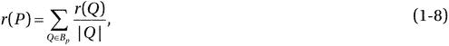

# 一、机器学习

Nature is a self-made machine, more perfectly automated than any automated machine. To create something in the image of nature is to create a machine, and it was by learning the inner working of nature that man became a builder of machines. —Eric Hoffer, Reflections on the Human Condition

机器学习(ML)是人工智能的一个分支，它系统地应用算法来综合数据和信息之间的底层关系。例如，可以在自动语音识别系统(如 iPhone 的 Siri)上训练 ML 系统，以将语音数据序列中的声学信息转换为以字符串形式表达的语义结构。

ML 已经在网络搜索、广告投放、信用评分、股票市场预测、基因序列分析、行为分析、智能优惠券、药物开发、天气预报、大数据分析和许多其他应用中得到广泛应用。ML 将在一系列以用户为中心的创新中扮演决定性的角色。

ML 的迅速采用归功于它能够以解决大数据分析、行为模式识别和信息进化中的问题的方式来表征大数据阵列中的潜在关系。此外，可以训练 ML 系统对过程的变化条件进行分类，以便对操作行为的变化进行建模。随着知识体系在新思想和新技术的影响下不断发展，ML 系统可以识别对现有模型的破坏，并重新设计和重新训练自己以适应新知识并与之共同发展。

ML 的计算特性是概括训练经验(或例子)并输出估计目标函数的假设。ML 的一般化属性允许系统通过准确预测未来数据来在看不见的数据实例上表现良好。与其他优化问题不同，ML 没有一个明确定义的可以优化的函数。相反，训练错误是检验学习错误的催化剂。泛化过程需要输入离散或连续特征向量并输出一个类的分类器。

ML 的目标是预测计算机未知的未来事件或场景。1959 年，Arthur Samuel 将 ML 描述为“在没有明确编程的情况下赋予计算机学习能力的研究领域”(Samuel 1959)。他的结论是，让计算机通过编程从经验中学习，最终将消除对这种细致编程工作的需求。根据 Tom M. Mitchell 对最大似然的定义:“如果一个计算机程序在 T 类任务中的性能(由 P 测量)随着经验 E 的增加而提高，那么就可以说该计算机程序从经验 E 中学习了一些任务 T 和性能测量 P。”Alan Turing 的开创性论文(Turing 1950)提出了一个证明机器智能的基准标准，即机器必须是智能的，并且能够以与人类相同的方式做出响应。

学习过程在根据历史经验概括问题方面起着至关重要的作用。经验以训练数据集的形式存在，这有助于在新的和未知的任务中获得准确的结果。训练数据集包含一个现有的问题领域，学习者使用它来建立关于该领域的一般模型。这使得该模型能够在新情况下生成非常准确的预测。

## 关键术语

为了便于读者理解 ML 的概念，本节定义并讨论了一些与 ML 相关的关键多学科概念术语。

*   分类器。一种方法，该方法接收作为观察或特征的未标记实例的新输入，并识别其所属的类别或类。许多常用的分类器采用统计推断(概率度量)来对给定实例的最佳标签进行分类。
*   混淆矩阵(又名误差矩阵)。使用矩阵中的数据可视化分类算法性能的矩阵。它以假阳性、真阳性、假阴性和真阴性信息的形式将预测分类与实际分类进行比较。两类分类器系统的混淆矩阵(Kohavi 和 Provost，1998)如下:
*   准确性(又名错误率)。模型对数据集做出正确(或不正确)预测的比率。准确度通常通过使用在学习过程中任何时候都不使用的独立测试集来估计。通常使用更复杂的精度估计技术，例如交叉验证和自举，尤其是对于包含少量实例的数据集。

其中，β的值从 0 到无穷大(∞)，用于控制分配给 P 和 r 的权重。

*   成本。对预测(或评估)既定结果的模型的性能(或准确性)的测量；换句话说，它量化了预测值和实际值(或类别标签)之间的偏差。优化函数试图最小化成本函数。
*   交叉验证。一种验证技术，用于评估模型对独立数据集的概化能力。它定义了一个数据集，用于在过度拟合的训练阶段测试已训练的模型。交叉验证也可用于评估各种预测函数的性能。在 k 折叠交叉验证中，训练数据集被任意划分成 k 个大小相等的互斥子样本(或折叠)。该模型被训练 k 次(或折叠)，其中每次迭代使用 k 个子样本中的一个进行测试(交叉验证)，剩余的 k-1 个子样本用于训练该模型。交叉验证的 k 个结果被平均，以作为单一估计来估计准确度。
*   数据挖掘。大型数据集中的知识发现(q.v .)或模式检测过程。数据挖掘中涉及的方法有助于提取准确的数据，并将其转换为已知的结构以供进一步评估。
*   数据集。符合无排序要求的模式的数据集合。在典型的数据集中，每一列代表一个要素，每一行代表数据集的一个成员。
*   维度。定义属性的一组属性。维度的主要功能是筛选、分类和分组。
*   归纳算法。一种使用定型数据集生成模型的算法，该模型可以在定型数据集之外进行归纳。
*   实例。以特征向量为特征的对象，根据这些特征向量，模型被训练用于泛化或用于预测。
*   知识发现。从结构化或非结构化来源中提取知识作为进一步探索的基础的过程。这种知识被共同表示为模式，并且可以被压缩为一个或多个模型的形式，可以对这些模型进行查询以进行统计预测、评估和进一步的知识发现。
*   模型。为描述或预测而汇总数据集的结构。每个型号都可以根据应用的具体要求进行调整。大数据中的应用程序拥有大型数据集，其中包含许多预测因素和要素，这些因素和要素过于复杂，无法通过简单的参数模型提取有用的信息。学习过程综合来自给定数据集的模型的参数和结构。模型通常可分为参数模型(由一组有限的参数描述，因此未来预测独立于新数据集)和非参数模型(由一组无限的参数描述，因此数据分布不能用一组有限的参数来表示)。非参数模型简单灵活，假设较少，但需要更大的数据集才能得出准确的结论。
*   在线分析处理(OLAP)。一种解决多维分析查询的方法。这种查询索引到具有两个或更多属性(或维度)的数据中。OLAP 包含一大类商业智能数据，通常与多维 OLAP (MOLAP)同义。OLAP 引擎有助于从多个角度交互式地探索多维数据，从而可以快速执行复杂的分析和即席查询。OLAP 通常使用中间数据结构来存储多维数据的预计算结果，从而实现快速计算。关系 OLAP (ROLAP)使用基本数据和维度表的关系数据库。
*   模式。数据集属性和特性的高级规范。
*   监督学习。提取独立属性和指定的从属属性(标签)之间的关联的学习技术。监督学习通过使用输入数据和输出值，使用训练数据集来开发预测模型。然后，模型可以预测新数据集的输出值。使用监督学习开发的模型的性能取决于训练数据集的大小和方差，以便为新数据集实现更好的泛化和更强的预测能力。大多数归纳算法都属于监督学习的范畴。
*   无监督学习。将没有预先指定的从属属性的实例分组的学习技术。这种技术通常包括通过拒绝纯粹的非结构化噪声来学习数据中的结构化模式。聚类和降维算法通常是无监督的。
*   特征向量。解释变量的 n 维数值向量，表示便于处理和统计分析的某个对象的实例。特征向量通常被加权以构建预测函数，该预测函数用于评估预测的质量或适合度。特征向量的维度可以通过各种维度缩减技术来缩减，例如主成分分析(PCA)、多线性子空间缩减、等映射和潜在语义分析(LSA)。与这些向量相关的向量空间通常被称为特征空间。

## 开发学习机器

机器学习有助于开发程序，通过经验和训练来提高程序在给定任务中的性能。许多大数据应用利用 ML 以最高效率运行。数据流的巨大数量、多样性和速度使得开发人类实时分析数据的自然能力变得不切实际。社交网络的激增和基于互联网的应用的广泛使用不仅导致了更大的数据量，还增加了数据的复杂性。为了保持数据分辨率并避免数据丢失，需要实时分析这些数据流。

我们今天拥有的大数据流的异构性和巨大的计算能力为我们提供了大量的机会来培养学习方法，从而可以为给定的业务问题确定最佳实践。现代计算机器的复杂性可以处理大量的数据、更大的复杂性和万亿字节的存储。此外，在这些机器上运行的智能程序流可以处理和组合许多这样的复杂数据流，以开发预测模型，并从噪音数据中提取内在模式。当你需要预测或预报一个目标值时，监督学习是合适的选择。下一步是根据目标值在聚类(在离散目标值的情况下)和回归(在数值目标值的情况下)之间做出决定。

您通过识别对决策过程至关重要的所有度量标准来开始 ML 的开发。最大似然综合模型优化度量的过程。因为度量对于为给定的决策过程开发解决方案是必不可少的，所以在概念阶段必须仔细选择它们。

判断 ML 是否是解决给定问题的合适方法也很重要。就其本质而言，ML 不能提供完美的准确性。对于要求在有限时间内获得高度精确结果的解决方案，ML 可能不是首选方法。一般来说，以下条件有利于 ML 的应用:(a)不需要非常高的精度；(b)大量数据包含有待综合的未发现的模式或信息；(c)由于缺乏知识或历史信息作为开发适当算法的基础，问题本身没有得到很好的理解；(d)问题需要适应不断变化的环境条件。

开发 ML 算法的过程可以分解为以下步骤:

Collect the data. Select the subset of all available data attributes that might be useful in solving the problem. Selecting all the available data may be unnecessary or counterproductive. Depending upon the problem, data can either be retrieved through a data-stream API (such as a CPU performance counters) or synthesized by combining multiple data streams. In some cases, the input data streams, whether raw or synthetic, may be statistically preprocessed to improve usage or reduce bandwidth.   Preprocess the Data. Present the data in a manner that is understood by the consumer of the data. Preprocessing consists of the following three steps: Formatting. The data needs to be presented in a useable format. Using an industry-standard format enable plugging the solution with multiple vendors that in turn can mix and match algorithms and data sources such as XML, HTML, and SOAP.   Cleaning. The data needs to be cleaned by removing, substituting, or fixing corrupt or missing data. In some cases, data needs to be normalized, discretized, averaged, smoothened, or differentiated for efficient usage. In other cases, data may need to be transmitted as integers, double precisions, or strings.   Sampling. Data need to be sampled at regular or adaptive intervals in a manner such that redundancy is minimized without the loss of information for transmission via communication channels.     Transform the data. Transform the data specific to the algorithm and the knowledge of the problem. Transformation can be in the form of feature scaling, decomposition, or aggregation. Features can be decomposed to extract the useful components embedded in the data or aggregated to combine multiple instances into a single feature.   Train the algorithm. Select the training and testing datasets from the transformed data. An algorithm is trained on the training dataset and evaluated against the test set. The transformed training dataset is fed to the algorithm for extraction of knowledge or information. This trained knowledge or information is stored as a model to be used for cross-validation and actual usage. Unsupervised learning, having no target value, does not require the training step.   Test the algorithm. Evaluate the algorithm to test its effectiveness and performance. This step enables quick determination whether any learnable structures can be identified in the data. A trained model exposed to test dataset is measured against predictions made on that test dataset which are indicative of the performance of the model. If the performance of the model needs improvement, repeat the previous steps by changing the data streams, sampling rates, transformations, linearizing models, outliers’ removal methodology, and biasing schemes.   Apply reinforcement learning. Most control theoretic applications require a good feedback mechanism for stable operations. In many cases, the feedback data are sparse, delayed, or unspecific. In such cases, supervised learning may not be practical and may be substituted with reinforcement learning (RL). In contrast to supervised learning, RL employs dynamic performance rebalancing to learn from the consequences of interactions with the environment, without explicit training.   Execute. Apply the validated model to perform an actual task of prediction. If new data are encountered, the model is retrained by applying the previous steps. The process of training may coexist with the real task of predicting future behavior.  

## 机器学习算法

基于在最大似然学习阶段呈现的输入数据和预期输出之间的潜在映射，最大似然算法可以分为以下六类:

*   Supervised learning is a learning mechanism that infers the underlying relationship between the observed data (also called input data) and a target variable (a dependent variable or label) that is subject to prediction (Figure [1-1](#Fig1)). The learning task uses the labeled training data (training examples) to synthesize the model function that attempts to generalize the underlying relationship between the feature vectors (input) and the supervisory signals (output). The feature vectors influence the direction and magnitude of change in order to improve the overall performance of the function model. The training data comprise observed input (feature) vectors and a desired output value (also called the supervisory signal or class label). A well-trained function model based on a supervised learning algorithm can accurately predict the class labels for hidden phenomena embedded in unfamiliar or unobserved data instances. The goal of learning algorithms is to minimize the error for a given set of inputs (the training set). However, for a poor-quality training set that is influenced by the accuracy and versatility of the labeled examples, the model may encounter the problem of overfitting, which typically represents poor generalization and erroneous classification.

    

    图 1-1。

    High-level flow of supervised learning

*   Reinforcement learning (RL) methodology involves exploration of an adaptive sequence of actions or behaviors by an intelligent agent (RL-agent) in a given environment with a motivation to maximize the cumulative reward (Figure [1-2](#Fig2)). The intelligent agent’s action triggers an observable change in the state of the environment. The learning technique synthesizes an adaptation model by training itself for a given set of experimental actions and observed responses to the state of the environment. In general, this methodology can be viewed as a control-theoretic trial-and-error learning paradigm with rewards and punishments associated with a sequence of actions. The RL-agent changes its policy based on the collective experience and consequent rewards. RL seeks past actions it explored that resulted in rewards. To build an exhaustive database or model of all the possible action-reward projections, many unproven actions need to be tried. These untested actions may have to be attempted multiple times before ascertaining their strength. Therefore, you have to strike a balance between exploration of new possible actions and likelihood of failure resulting from those actions. Critical elements of RL include the following:
    *   该策略是 RL 代理的关键组成部分，它将控制动作映射到感知的环境状态。
    *   批评家代表一个估计的价值函数，它批评根据现有政策采取的行动。或者，批评家评估当前状态的表现，以响应根据当前政策采取的行动。批判代理人通过持续不断的修正来塑造政策。
    *   奖励函数估计对于尝试的控制动作的感知环境状态的瞬时合意性。
    *   模型是规划工具，通过考虑未来可能的情况来帮助预测未来的行动过程。

    

    图 1-2。

    High-level flow of reinforcement learning
*   直推式学习(又名直推式推理)试图通过使用与新案例相关的训练数据集上的附加观察来预测特定测试案例上的专有模型函数(Vapnik 1998)。通过将新的个体观察值(训练数据)拟合到空间中的单个点来建立局部模型，这与全局模型相反，在全局模型中，新数据必须拟合到现有模型中，而无需假定与该数据点在空间中的位置相关的任何特定信息。虽然新数据可能在一定程度上适合全球模型(存在一些误差)，从而创建一个代表整个问题的全球模型，但空间是一个挑战，并不是在所有情况下都是必要的。一般来说，如果您在给定问题空间的模型开发过程中遇到不连续，您可以在不连续的边界处合成多个模型。在这种情况下，新观察到的数据通过满足模型有效的边界条件的模型进行处理。
*   归纳推理基于数据与整个假设空间的关系来估计模型函数，并使用该模型来预测训练集之外的示例的输出值。这些函数可以使用许多表示方案中的一种来定义，包括线性加权多项式、逻辑规则和概率描述，如贝叶斯网络。许多统计学习方法从假设空间的初始解开始，然后迭代地进化它们以减少误差。许多流行的算法都属于这一类，包括支持向量机(Vapnik 1998)、神经网络(NN)模型(Carpenter 和 Grossberg 1991)和神经模糊算法(Jang 1993)。在某些情况下，可以应用懒惰学习模型，在该模型中，基于应用于现有模型的新数据，概括过程可以是有效地开发更丰富的假设空间的持续任务。

*   无监督学习算法旨在发现未标记数据集中的隐藏结构，其中期望的输出是未知的。这种机制在数据压缩、离群点检测、分类、人类学习等领域有许多用途。学习的一般方法包括通过概率数据模型进行训练。无监督学习的两个流行的例子是聚类和降维。通常，无监督学习数据集由输入 x 1 ，x 2 ，x 3 组成...x n ，但它既不包含目标输出(如在监督学习中)，也不包含来自其环境的奖励。在这种情况下，ML 的目标是假设输入数据的表示，以便进行有效的决策、预测、信息过滤和聚类。例如，无监督训练可以帮助开发基于阶段的模型，在该模型中，通过无监督学习过程合成的每个阶段都代表该过程的机会调整的唯一条件。此外，每个阶段可以充当一个状态，并且可以被预测为主动的资源分配或分布。以概率分布模型为中心的无监督学习算法通常使用最大似然估计(MLE)、最大后验概率(MAP)或贝叶斯方法。不基于概率分布模型的其他算法可以采用统计测量、量化误差、方差保持、熵间隙等。
*   半监督学习使用少量已标记数据集和大量未标记数据集的组合来生成模型函数或分类器。因为获取的数据的标记过程需要密集的熟练的人力劳动投入，所以这是昂贵且不可行的。相比之下，未标记的数据相对便宜且容易获得。半监督 ML 方法在非监督学习(未标记的训练数据)和监督学习(标记的训练数据)的指导方针之间操作，并且可以在学习准确性方面产生相当大的改进。半监督学习最近获得了更大的关注，这是由于大量未标记数据对于 web 数据、消息数据、股票数据、零售数据、生物数据、图像等等的各种应用的可用性。这种学习方法可以提供具有实践和理论意义的价值，特别是在与人类学习相关的领域，如语音、视觉和手写，这些领域涉及少量的直接指导和大量的未标记的经验。

### 流行的机器学习算法

本节依次描述了 2006 年 12 月 IEEE 数据挖掘国际会议(ICDM)确定的十大最有影响力的数据挖掘算法:C4.5、k-means、SVMs、Apriori、估计最大化(EM)、PageRank、AdaBoost、k-最近邻(k-NN)、朴素贝叶斯和分类与回归树(CARTs) (Wu et al. 2008)。

### C4.5

C4.5 分类器是数据挖掘中最常用的算法类别之一。C4.5 分类器输入病例集合，其中每个病例是预分类到现有类别之一的样本。每种情况都由其 n 维向量来描述，表示样本的属性或特征。C4.5 分类器的输出可以准确地预测以前看不到的案例的类别。C4.5 分类算法通过基于树结构合成模型来生成表示为决策树的分类器。树结构中的每个节点表征一个特征，相应的分支代表连接特征的可能值，而叶子代表终止一系列节点和分支的类。一个实例的类别可以通过跟踪节点和分支到终止叶子的路径来确定。

给定一组实例，C4.5 使用分治法来生长初始树，如下所示:

*   如果列表 S 中的所有样本都属于同一个类，或者如果列表 S 很小，那么为决策树创建一个叶节点，并用最频繁的类来标记它。
*   否则，算法选择一个基于属性的测试，将 S 分成多个子分支(分区)(S1，S2，…)，每个子分支代表测试的结果。测试放在树的根部，从根部到叶子的每一条路径都成为一个规则脚本，在叶子上标记一个类。这个过程递归地应用于每个子分支。
*   当前分支的每个分区代表一个子节点，分隔 S 的测试代表树的分支。

这个过程一直持续到每个叶子只包含一个类的实例，或者进一步的划分是不可能的。C4.5 使用选择具有最高标准化信息增益的属性的测试，从而能够消除可能属于两个或更多类别的案例分类的歧义。

### k 均值

k-means 算法是一种简单的迭代聚类算法(Lloyd 1957)，它将 N 个数据点划分为 K 个不相交的子集 S j ，以便最小化平方和标准。因为平方和是欧几里德距离的平方，所以直观上这是“最近”的平均值，

在哪里

x n =代表第 n 个数据点的向量

μj= Sj中数据点的几何形心

该算法由简单的两步重新估计过程组成:

Assignment: Data points are assigned to the cluster whose centroid is closest to that point.   Update: Each cluster centroid is recalculated to the center (mean) of all data points assigned to it.  

这两个步骤交替进行，直到满足停止标准，使得数据点的分配没有进一步的变化。每次迭代需要 N × K 次比较，代表一次迭代的时间复杂度。

### 支持向量机

支持向量机是一种监督学习方法，用于分析数据和识别模式。支持向量机主要用于分类、回归分析和新颖性检测。给定两类学习任务中的一组训练数据，SVM 训练算法构建一个模型或分类函数，将新的观察值分配给超平面任一侧的两类之一，使其成为非概率二元线性分类器(图 [1-3](#Fig3) )。SVM 模型将观察值映射为空间中的点，从而将它们分类到一个单独的分区中，该分区由到任何类别的最近观察数据点的最大距离(功能余量)来划分。然后，根据新观测值落在分区的哪一侧，预测它们属于哪一类。支持向量是最接近划分类别的超平面的数据点。支持向量机的更多细节在[第 4 章](04.html)中给出。

图 1-3。

The SVM algorithm finds the hyperplane that maximizes the largest minimum distance between the support vectors

### 推测的

Apriori 是一种数据挖掘方法，它通过使用事务数据库中的候选生成(Agrawal 和 Srikant 1994)和突出数据库中的关联规则(一般趋势)来发现频繁项集。它假设一个频繁出现的模式的任何子集一定是频繁的。Apriori 执行广度优先搜索，通过累计满足最小支持要求的每个项目的计数来扫描频繁 1-项目集(即大小为 1 的项目集)。频繁 1-项集的集合用于寻找频繁 2-项集的集合，等等。这个过程反复进行，直到再也找不到频繁的 k 项集。识别所有频繁项目集的 Apriori 方法可以总结为以下三个步骤:

Generate candidates for frequent k + 1-itemsets (of size k + 1) from the frequent k-itemsets (of size k).   Scan the database to identify candidates for frequent k + 1-itemsets, and calculate the support of each of those candidates.   Add those itemsets that satisfy the minimum support requirement to frequent itemsets of size k + 1.  

部分由于算法的简单性，它被广泛用于数据挖掘应用。已经提出了各种改进，特别是频繁模式增长(FP-growth)扩展，它消除了候选生成。Han 等人(Han，Pei 和 Yin 2000)提出了一种频繁模式树(FP-tree)结构，它存储和压缩解释频繁模式的基本信息，并使用 FP-growth 通过模式片段生长来挖掘频繁模式的综合集合。这种 Apriori 技术增强构建了一个包含所有基本信息的大型数据库，并将其压缩成高度精简的数据结构。在随后的步骤中，它组装一个条件模式库，该条件模式库表示一组相对于每个项目同现的计数模式。从频繁标题表开始，它通过跟踪每个频繁项目来遍历 FP-树，并存储这些项目的前缀路径以产生条件模式库。最后，它为条件模式库的每个频繁项构建一个条件 FP 树。树中的每个节点代表一个项目及其计数。共享相同标签但位于不同子树上的节点通过节点链接指针连接在一起。树结构中节点的位置表示项目出现频率的顺序，使得更靠近根的节点可以被事务数据库中的更多事务共享。

### 估计最大化

估计最大化(EM)算法有助于在数据不完整的概率模型中进行参数估计。EM 是一种迭代方案，在存在隐藏或潜在变量的情况下，估计统计模型中参数的 MLE 或 MAP。EM 算法在执行期望(E)的步骤和执行最大化(M)的步骤之间迭代地交替，期望(E)使用参数的当前估计来创建估计丢失(未观察)数据的可能完成的概率分布的函数，最大化(M)使用在 E 步骤期间执行的当前完成来重新估计参数。在随后的 E 步骤中，这些参数估计被迭代地用于估计隐藏变量的分布。一般来说，EM 包括运行具有以下属性的迭代算法:(a)观察数据，X；(b)潜在(或缺失)数据 Z；(c)未知参数θ；以及(d)似然函数 L(θ；X，Z) = P(X，Z|θ)。EM 算法使用两步法迭代计算边际似然的 MLE:

Maximization (M): Find the parameter that maximizes this quantity:   Estimation (E): Calculate the expected value of the log likelihood function, with respect to the conditional distribution of Z, given X under the current estimate of the parameters θ(t), such that  

### 网页等级

PageRank 是一种链接分析搜索算法，它对万维网上超链接文档的元素进行排序，以衡量它们相对于其他链接的重要性。由拉里·佩奇和谢尔盖·宾开发的 PageRank 产生了独立于搜索查询的静态排名。PageRank 模拟了社交网络中声望的概念。一个网页的超链接算作一个支持票。此外，PageRank 解释从源页面到目标页面的超链接，使得具有较高等级的页面提高链接页面(源或目标)的等级。因此，来自高排名页面的反向链接比来自普通页面的反向链接更重要。从数学上来说，PageRank 可以简单地计算为

在哪里

r(P) =页面的等级 P

B p =链接到页面 P 的所有页面的集合

|Q| =来自页面 Q 的链接数量

r(Q) =页面的等级 Q

### 自适应增强

AdaBoost 是一种集成方法，用于将强分类器构建为简单、弱分类器(或经验法则)的线性组合(Freund 和 Schapire 1997)。与任何集成方法一样，AdaBoost 使用多个学习器来解决一个问题，具有更好的泛化能力和更准确的预测。强分类器可以被评估为弱分类器的线性组合，使得

在哪里

H(x) =强分类器

h t (x) =弱分类器(特征)

Adaboost 算法可以总结如下:

输入:

数据集 I={(x 1 ，y 1 )，(x 2 ，y 2 )，(x 3 ，y 3 )，...、(x m ，y m )}，

基本学习算法 L

学习回合数 T

流程:

 //初始化权重分配

FOR (t = 1 到 T) DO //运行 t = T 次迭代的循环

h t = L(I，D t ) //用 D t 从 I 训练一个弱学习者 h t

 //计算 h t 的误差

 //计算 h t 的重量

 //更新分配、

// Z t 是归一化因子

结束

输出:

 //强分类器

AdaBoost 算法是自适应的，因为它使用多次迭代来产生与真实分类器很好相关的强学习器。如上所示，它通过添加与真实分类器稍微相关的弱学习器来迭代。作为自适应过程的一部分，加权向量自我调整以改善前几轮的误分类。得到的分类器比弱学习器的分类器具有更高的准确度。AdaBoost 速度快、实现简单、灵活，可以与任何分类器结合使用。

### k-最近邻

k-最近邻(k-NN)分类方法识别训练集中最接近测试对象的一组 k 个对象，并基于该邻域中最主要的类来分配标签。这种方法的三个基本要素是

*   一组现有的标签对象
*   估计物体间距离的距离度量
*   最近邻的数量(k)

为了对未标记的对象进行分类，计算该对象与已标记对象之间的距离，并识别其 k-最近邻。这些最近邻居的类别标签用作对无标签对象进行分类的参考。k-NN 算法计算训练集(x，y)  I 和测试对象之间的相似性距离，以确定其最近邻列表，I z 。x 代表培训对象，y 代表对应的培训类别。和分别代表测试对象及其类别。该算法可以总结如下:

输入:

训练对象(x，y)  I 和测试对象

流程:

计算 z 和每个物体(x，y)  I 之间的距离

选择，距离 z 最近的 k 个训练对象的集合。

输出(多数类):

f(。)= 1 if 参数(。)为真，否则为 0，v 为类标签。

应该仔细选择 k 的值。较小的值可能会导致噪声行为，而较大的值可能会包含太多来自其他类的点。

### 朴素贝叶斯

朴素贝叶斯是一种简单的概率分类器，它应用贝叶斯定理和强(朴素)独立性假设，使得一个类的单个特征的存在与另一个特征的存在无关。

假设输入特征 x 1 ，x 2 ，...给定类别标签 Y，x n 有条件地彼此独立，使得

对于两类分类(i = 0，1)，我们将 P(i|x)定义为测量向量 x={x 1 ，x 2 的概率...x 3 }属于第一类。此外，我们定义了一个分类分数

 

其中 P(i|x)与 f(x|i)P(i)成正比，f(x|i)是 I 类对象的 x 的条件分布。

朴素贝叶斯模型因其简单性和稳健性而令人惊讶地有效且极具吸引力。因为该算法不需要对大数据集应用复杂的迭代参数估计方案，所以它非常有用并且相对容易构建和使用。它是文本分类和垃圾邮件过滤相关领域中的一种流行算法。

### 分类和回归树

分类和回归树(CART)是一种非参数决策树，它使用二进制递归划分方案，从包含完整学习样本的根节点开始，重复分割两个子节点(Breiman 等人，1984)。树的生长过程包括在每个节点的所有可能的分裂中进行分裂，这样得到的子节点是“最纯粹的”一旦 CART 生成了“最大树”，它就检查通过修剪掉最大树的分支而获得的较小的树，以确定哪个对训练数据上的树的整体性能贡献最小。CART 机制旨在产生嵌套修剪树的序列。通过评估修剪序列中每棵树的预测性能来识别大小合适的树，或“诚实的”树。

## 数据挖掘研究中的挑战性问题

数据挖掘和知识发现已经成为与数据库系统、ML、智能信息系统、专家系统、控制理论和许多其他领域相关的跨学科研究领域。数据挖掘是一个重要而活跃的研究领域，但它不是没有理论和实践挑战的领域，因为处理非常大的数据库本质上可能是嘈杂的、不完整的、冗余的和动态的。杨和吴(2006)的一项研究回顾了数据挖掘研究中最具挑战性的问题，如以下各节所概述。

### 高维数据和高速数据流的向上扩展

设计能够处理通过高速数据流提取的非常高维的特征的分类器是具有挑战性的。为了确保决定性的优势，这种情况下的数据挖掘应该是一个连续的在线过程。但是，技术挑战阻止我们在存在环境漂移和概念漂移的情况下计算大量流数据的模型。今天，我们试图通过增量挖掘和离线模型更新来解决这个问题，以保持当前数据流的准确建模。正在通过开发内存数据库、高密度存储器和大存储容量来解决信息技术挑战，所有这些都由高性能计算基础设施支持。

### 挖掘序列数据和时间序列数据

有序和时序数据的有效分类、聚类和预测今天仍然是一个公开的挑战。时间序列数据经常被噪声污染，这对短期和长期预测有不利影响。虽然可以使用信号处理技术或平滑方法过滤噪声，但过滤后的数据可能会出现滞后。在闭环环境中，这可能会降低预测的准确性，因为我们最终可能会对流程本身进行过度补偿或供应不足。在某些情况下，滞后可以通过差分预测器来校正，但这可能需要对模型本身进行大量调整。靠近数据 I/O 模块放置的噪声消除滤波器可以进行调谐，以便在数据被挖掘之前识别和清除噪声数据。

### 从复杂数据中挖掘复杂知识

复杂数据可以以多种形式存在，并且可能需要特殊的技术来提取对现实世界决策有用的信息。例如，信息可能以图形形式存在，这就需要在大量数据中发现图形和结构化模式的方法。另一个复杂性可能以非独立同分布(非 iid)数据对象的形式存在，这些数据对象不能作为独立的单个对象来挖掘。它们可能与其他应该被识别的数据对象共享关系结构。

针对非结构化数据的最新数据挖掘方法缺乏整合领域信息和知识接口的能力，从而无法将数据挖掘的结果与现实世界场景相关联。

### 分布式数据挖掘和多代理数据挖掘

在分布式数据感知环境中，发现分布式模式并关联通过不同探测器传输的数据是一项挑战。目标是最小化数据交换量并减少所需的通信带宽。博弈论方法可以用来应对这一挑战。

### 数据挖掘过程相关的问题

自主数据挖掘和清理操作可以显著提高数据挖掘的效率。尽管我们可以快速地处理模型和发现模式，但主要的成本是由预处理操作(如数据集成和数据清理)引起的。通过自动化降低这些成本比试图进一步降低模型构建和模式发现的成本能带来更大的回报。

### 安全性、隐私和数据完整性

在用户数据被挖掘时，确保用户的隐私至关重要。保证收集的输入数据和合成的个体模式的知识完整性同样重要。

### 处理非静态、不平衡和成本敏感的数据

数据是动态的，在不同的领域不断变化。数据采样和模型构建的历史试验可能是次优的。当您基于新的训练数据重新训练当前模型时，由于不同的选择偏差，您可能会经历学习漂移。为了准确预测，需要动态地校正这种偏差。

## 摘要

本章通过关键术语、最大似然法的类型以及 10 大数据挖掘和最大似然法算法讨论了最大似然法的本质。由于万维网上数据的爆炸式增长，ML 已经广泛应用于网络搜索、广告投放、信用评分、股票市场预测、基因序列分析、行为分析、智能优惠券、药物开发、天气预报、大数据分析以及许多类似的应用。每天都在探索 ML 的新用途。大数据分析和图表分析已经成为基于云的业务发展的重要组成部分。数据分析的新领域和 ML 的应用也加速了专用硬件和加速器的发展，以提高算法性能、大数据存储和数据检索性能。

## 参考

Agrawal，Rakesh 和 Ramakrishnan Srikant。"在大型数据库中挖掘关联规则的快速算法."1994 年 9 月 12 日至 15 日在智利圣地亚哥召开的第 20 届超大型数据库国际会议(VLDB '94)会议录，Jorge B. Bocca、Matthias Jarke 和 Carlo Zaniolo 编辑。旧金山:摩根考夫曼(1994):487–499。

布雷曼、利奥、杰罗姆·h·弗里德曼、理查德·a·奥尔森和查尔斯·j·斯通。分类和回归树。贝尔蒙特，加州:沃兹沃斯，1984 年。

卡彭特、盖尔·a 和斯蒂芬·格罗斯伯格。自组织神经网络的模式识别。麻省:剑桥，麻省:麻省理工学院出版社，1991。

弗罗因德、约夫和罗伯特·e·沙皮雷。"在线学习的决策理论概括及其在 Boosting 中的应用."《计算机与系统科学杂志》第 55 卷，第 1 期(1997 年):119–139 页。

韩，贾维尔，简佩，尹。"挖掘无候选生成的频繁模式."在 SIGMOD/PODS '00: ACM 数据管理国际会议和数据库系统原理研讨会上，美国德克萨斯州达拉斯，2000 年 5 月 15-18 日，由陈卫东、杰弗里·诺顿、菲利普·a·伯恩斯坦编辑。纽约:美国计算机学会(2000 年):第 1 至 12 页。

ANFIS:基于自适应网络的模糊推理系统。IEEE 系统、人和控制论汇刊 23，第 3 期(1993):665–685。

科哈维，罗恩和福斯特教务长。“术语表。”机器学习 30，第 2–3 期(1998):271–274。

“PCM 中的最小二乘量化”，量子化特刊，IEEE 信息论汇刊，IT-28，第 2 期(1982):129–137。

使用跳棋游戏的机器学习研究〉，《IBM 研究与发展期刊》44:1.2(1959):210–229。

艾伦·m·图灵，《计算机器与智能》心智(1950):433–460。

统计学习理论。纽约:威利出版社，1998 年。

吴新东、Vipin Kumar、Ross Quinlan、Joydeep Ghosh、杨强、Hiroshi Motoda、Geoffrey J. McLachlan、Angus Ng、刘冰、Philip S. Yu、、Michael Steinbach、David J. Hand 和 Dan Steinberg。“数据挖掘中的 10 大算法。”知识与信息系统 14(2008):1–37。

杨，强，吴新东。"数据挖掘研究中的 10 个挑战性问题."国际信息技术与决策杂志 5，第 4 期(2006):597–604。