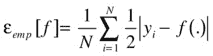
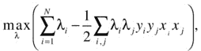
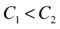
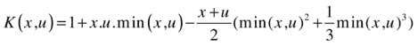
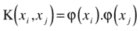

# 三、支持向量机分类

Science is the systematic classification of experience. —George Henry Lewes

本章详细介绍了支持向量机(SVM)技术，这是一种稀疏核决策机，在建立学习模型时可以避免计算后验概率。SVM 提供了一个机器学习问题的原则性方法，因为它在统计学习理论的数学基础。SVM 根据训练输入的子集来构造它的解决方案。SVM 已广泛用于分类、回归、新奇检测任务和特征约简。本章仅关注监督分类任务的 SVM，提供了输入空间线性可分或线性不可分以及数据不平衡时的 SVM 公式，并附有示例。这一章也提出最初的 SVM 公式的最近的改进和扩展。本章最后是一个案例研究。

## 从几何角度看 SVM

在分类任务中，判别机器学习技术旨在基于独立同分布(iid)训练数据集找到能够正确预测新获取实例的标签的判别函数。与需要计算条件概率分布的生成式机器学习方法不同，判别分类函数采用数据点 x，并将其分配给作为分类任务一部分的不同类别之一。判别方法不如生成方法有效，生成方法主要在预测涉及异常值检测时使用，判别方法需要更少的计算资源和更少的训练数据，特别是对于多维特征空间和只需要后验概率时。从几何的角度来看，学习一个分类器相当于找到一个多维曲面的方程，该方程可以最好地分离特征空间中的不同类。

SVM 是一种判别技术，因为它以分析方式解决凸优化问题，所以它总是返回相同的最佳超平面参数-与遗传算法(GAs)或感知机相反，这两种算法都广泛用于机器学习中的分类。对于感知器，解决方案高度依赖于初始化和终止标准。

对于将数据从输入空间转换到特征空间的特定核，训练返回给定训练集的唯一定义的 SVM 模型参数，而感知器和 GA 分类器模型在每次初始化训练时是不同的。GAs 和感知器的目标只是在训练过程中最小化误差，这将转化为满足这一要求的几个超平面。如果在训练阶段可以学习许多超平面，则只保留最优的一个，因为训练实际上是在群体样本上执行的，即使测试数据可能不表现出与训练集相同的分布。当用不代表整个数据群体的数据训练时，超平面容易泛化能力差。

图 [3-1](#Fig1) 说明了 SVM、感知器和遗传算法分类器在二维两类数据上获得的不同超平面。根据图例，由圆圈包围的点表示支持向量，而对应于不同分类器的超平面以不同颜色显示。

图 3-1。

Two-dimensional, two-class plot for SVM, perceptron, and GA hyperplanes Note SVM vs. ANN

一般来说，SVM 是从一个稳健的实现理论发展而来的，而人工神经网络(ANN)是从应用到理论的探索性发展。

SVM 与人工神经网络的区别在于，它没有经典的多局部极小值——维数和过拟合的双重诅咒。当机器学习模型努力在所有训练数据上实现零误差时发生的过拟合，更可能发生在其训练度量取决于误差平方和的变量的机器学习方法中。通过最小化结构风险而不是经验风险，就像人工神经网络一样，SVM 避免了过度拟合。

SVM 不像人工神经网络那样通过限制特征集来控制模型的复杂性；相反，它通过选择支持向量的数量来自动确定模型的复杂性。

## SVM 主要房产

SVM 深深植根于统计学、最优化和机器学习的原理，由 Boser、Guyon 和 Vapnik (1992 年)在第五届计算机械协会计算学习理论研讨会上正式介绍。Bartlett (1998)正式揭示了硬边缘 SVM 推广的统计界限。SVM 依赖于假设空间的复杂性和经验误差(衡量模型与训练数据拟合程度的指标)。Vapnik-Chervonenkis (VC)理论证明了风险上界的 VC 存在。VC 是对假设空间复杂性的度量。假设 H 的 VC 维与可被 H 粉碎的点的最大数量有关。如果 H 正确地将所有的正实例与负实例分开，则 H 粉碎 N 个点。换句话说，VC 容量等于模型可以分成 2 个 N 个不同标签的训练点数 N。这种能力与可用的训练数据量有关。VC 维 h 影响泛化误差，因为它由其中 w 是分离超平面的权重向量和包含所有训练点的最小球 R 的半径来限定，根据:。一个机器学习模型的整体误差由ε = ε  emp  + ε g 组成，其中ε emp 为训练误差，ε g 为泛化误差。模型 f 的经验风险是。

风险的下限是，其中是对于具有 VC 维 h 的函数类中的任何函数，其界限为真的概率，与数据分布无关。

Note

有 2 个 N 个不同的学习问题可以被定义，因为 N 个点可以以 2 个 N 个的方式被标记为正或负。例如，对于三个点，有 24 个不同的标签和 8 个不同的分类边界可以学习。因此，R 2 中的 VC 维是 3。

SVM 巧妙地将 20 世纪 60 年代的研究中已经提出的多个特征组合在一起，形成了所谓的最大间隔分类器。SVM 从大边缘超平面借用概念(杜达 1973；封面 1995；瓦普尼克和勒纳 1963 年；Vapnik 和 Chervonenkis 1964)；在特征空间中作为内积的核(Aizermann，Braverman 和 rozo noer 1964)；内核使用(艾泽曼、布雷弗曼和罗佐诺埃 1964；瓦赫巴 1990；Poggio 1990)和稀疏性(Cover 1995)。曼加萨里安(1965)也提出了一个类似于 SVM 所采用的最优化方法。松弛的概念最初是由 Smith (1968)提出的，并由 Bennett 和 Mangasarian (1992)进一步完善。科尔特斯(1995)将软裕度 SVM 纳入 SVM 公式，通过采用松弛度的概念来说明分离边界处的噪声数据，软裕度代表了硬裕度 SVM 的一种修改。(对于对深入研究 SVM 基础感兴趣的读者，请参见 1998、1999 年对 SVM 理论的详尽论述。)

SVM 以其鲁棒性、良好的泛化能力和唯一的全局最优解而闻名，可能是监督学习中最流行的机器学习方法，但它们的原理非常简单。Meyer，Leisch 和 Hornik (2003)在 21 个数据集上将 SVM 与 16 个分类器进行了比较，表明 SVM 是机器学习中最强大的分类器之一。自 1992 年问世以来，支持向量机已被广泛应用于各种领域，如天气预测、电力估计、股票预测、缺陷分类、说话人识别、笔迹识别、图像和音频处理、视频分析以及医疗诊断等。

使 SVM 成为一个有吸引力的机器学习框架的原因可以通过以下属性来总结:

*   SVM 是一种稀疏技术。像非参数方法一样，SVM 要求所有的训练数据都是可用的，也就是说，在训练阶段，当学习 SVM 模型的参数时，所有的训练数据都存储在内存中。然而，一旦模型参数被识别，SVM 仅依赖于这些训练实例的子集，称为支持向量，用于未来预测。支持向量定义了超平面的边界。使用拉格朗日松弛法，在涉及由误差项和约束正则化的目标函数的优化步骤之后，找到支持向量。[1](#Fn1)SVM 分类任务的复杂度取决于支持向量的个数，而不是输入空间的维数。最终从原始数据集中保留的支持向量的数量依赖于数据，并且基于数据复杂度而变化，数据复杂度由数据维度和类可分性捕获。支持向量数量的上限是训练数据集大小的一半，但是在实践中很少是这种情况。本章中数学描述的 SVM 模型被写成支持向量的加权和，这使得 SVM 框架在减少测试和存储要求的计算时间方面具有与参数技术相同的优势。
*   SVM 是一种核心技术。SVM 使用内核技巧将数据映射到一个更高维的空间，然后将机器学习任务作为一个凸优化问题来解决，在这个问题中，通过分析而不是启发式地找到最优解，就像其他机器学习技术一样。通常，现实生活中的数据在原始输入空间中不是线性可分的。换句话说，具有不同标签的实例以阻止线性超平面正确分离该分类任务中涉及的不同类别的方式共享输入空间。试图学习输入空间中的非线性分离边界增加了优化阶段的计算要求，因为分离表面将至少是二阶的。相反，SVM 使用预定义的核函数将数据映射到一个新的但更高维的空间，在这里，线性分隔符将能够区分不同的类别。因此，SVM 优化阶段将需要仅学习映射空间中的线性判别面。当然，核函数的选择和设置对于 SVM 最优是至关重要的。
*   SVM 是最大边距分隔符。除了最小化误差或成本函数之外，基于训练数据集(类似于其他判别机器学习技术)，SVM 对优化问题施加了额外的约束:超平面需要被定位成使得它与不同类的距离最大。这一项迫使优化步骤找到最终将更好地泛化的超平面，因为它位于离类相等且最大的距离处。这是很重要的，因为训练是在总体样本上进行的，而预测是在尚未看到的实例上进行的，这些实例的分布可能与训练子集的分布略有不同。

SVM 使用结构风险最小化(SRM)并满足对偶和凸性要求。SRM (Vapnik 1964)是一个归纳原则，它从有限的训练数据集中选择一个模型进行学习。作为容量控制的一个指标，SRM 提出了一个 VC 维度之间的权衡，即空间复杂性假设和经验误差。SRM 的公式是一个凸优化，在成本函数中有 n 个变量要最大化，有 m 个约束，可在多项式时间内求解。SRM 使用一组按照复杂程度递增的顺序排列的模型。图 [3-2](#Fig2) 显示了整体模型误差如何随着机器学习模型的复杂度指数而变化。对于不复杂的模型，误差很大，因为简单的模型不能捕捉所有复杂的数据，这导致拟合不足的情况。随着复杂性指数的增加，在误差再次开始增加之前，对于指数为 h*的最佳模型，误差达到其最小值。对于高模型指数，该结构开始使其学习模型适应训练数据，这导致过拟合，过拟合减少了训练误差值并增加了模型 VC，然而，代价是测试误差恶化。

图 3-2。

Relationship between error trends and model index

## 硬利润 SVM

SVM 技术是一种分类器，它找到一个超平面或一个函数,以最大的余量正确地分离两个类。图 [3-3](#Fig3) 显示了对应于硬边界 SVM(也称为线性 SVM)的分离超平面。

图 3-3。

Hard-maximum-margin separating hyperplane

数学上讲，给定一组点 x i 属于两个线性可分类ω 1 ，ω 2 ，任一实例到超平面的距离等于。SVM 的目标是找到 w，b，使得 g(x)的值对于属于ω 1 类的最近数据点等于 1，对于ω 2 类的最近数据点等于-1。

这可以被视为有一个余量

鉴于和。

这导致最小化目标函数的优化问题

受制于约束

当优化问题——无论是最小化还是最大化——在被优化的变量中具有约束时，成本或误差函数通过向其添加约束并乘以拉格朗日乘数而增大。

换句话说，SVM 的拉格朗日函数是通过用约束的加权和来扩充目标函数而形成的，

其中 w 和 b 被称为原始变量，λ i 是拉格朗日乘数。

因此，在给定约束条件的情况下，这些乘数将解决方案的搜索空间限制为可行值集。在存在不等式约束的情况下，卡鲁什-库恩-塔克(KKT)条件推广了拉格朗日乘子。

KKT 的条件是

Primal constraints  

Dual constraints  

Complementarity slackness  

Gradient of the Lagrangian (zero, with respect to primal variables)  

基于 KKT 条件，

Note

这些条件出现在库恩和塔克(1951)的一项研究中，也见于卡鲁什(1939)未发表的硕士论文中。

由于大多数线性规划问题成对出现，具有 n 个变量和 m 个约束的原始问题可以重写为具有 m 个变量和 n 个约束的 Wolfe 对偶形式，而相同的解适用于原始和对偶公式。对偶定理通过陈述一种形式中变量的数量等于互补形式中约束的数量来形式化这一点。互补松弛是原始公式和对偶公式之间的关系:当加入不等式时，松弛变量将它们转换成等式。

SVM 最优化的对偶问题是寻找

使遭受

Note

这最后一个约束对于最优解是必不可少的。在最优性条件下，对偶变量必须是非负的，因为对偶变量要乘以一个正数。因为负拉格朗日乘子会降低函数值，所以最优解不能有负拉格朗日乘子。活动约束或绑定约束有一个相应的非零乘数，而非绑定约束为零，不影响问题的解决。因此，SVM 超平面参数由有效的约束条件定义，这些约束条件对应于非零拉格朗日乘数，即支持向量。

出于几个原因，解决上述问题的双重性是有用的。第一，即使 primal 不是凸的，对偶问题总会有唯一的最优解。第二，目标函数值是原始公式的最优函数值的下界。最后，对偶变量的数量可能明显少于原始变量的数量；因此，可以更快更有效地解决对偶形式的优化问题。

## 软利润 SVM

当数据不完全可分时，如图 [3-4](#Fig4) 中用 X 标记的点，松弛变量ξ i 被引入到 SVM 目标函数中，以允许错误分类中的误差。在这种情况下，SVM 没有寻找硬边界，这将对所有数据进行完美分类。相反，SVM 现在是一个软利润分类器；也就是说，SVM 对大部分数据进行了正确分类，同时允许模型对分离边界附近的一些点进行错误分类。

图 3-4。

A few misclassifications, as part of soft-margin SVM

现在原始形式的问题是目标函数的最小化

受制于这两个约束:

正则项或盒约束 C 是一个根据优化目标而变化的参数。随着 C 的增加，获得了更紧的余量，并且更加强调最小化错误分类的数量。随着 C 的降低，更多的违规被允许，因为最大化两个等级之间的差额成为了 SVM 的目标。图 [3-5](#Fig5) 显示了正则化参数对边缘宽度和错误分类的影响。对于来说，C 2 的训练点数比 C 1 的少，但后者的余量更大。

图 3-5。

The box constraint effect on SVM performance

在对偶形式中，软裕度 SVM 公式为

使遭受

软边对偶问题等价于硬边对偶问题，只是对偶变量的上界是正则化参数 c。

## 内核 SVM

当问题在输入空间中不可线性分离时，软边界 SVM 无法找到一个鲁棒的分离超平面来最小化误分类数据点的数量并很好地推广。为此，可以使用内核将数据转换到更高维度的空间，称为内核空间，其中数据将是线性可分的。因此，在核空间中，可以获得线性超平面来分离分类任务中涉及的不同类别，而不是求解输入空间中的高阶分离超曲面。这是一种有吸引力的方法，因为与学习非线性表面相比，进入核空间的开销是微不足道的。

核应该是埃尔米特矩阵和半正定矩阵，并且需要满足 Mercer 定理，该定理转化为将所有数据点对上的核或 Gram 矩阵评估为半正定矩阵，形成

其中ϕ(x)属于希尔伯特空间。

换句话说，

一些流行的内核函数包括

*   线性内核:
*   多项式函数:
*   双曲正切(sigmoid): 
*   高斯径向基函数(RBF): 
*   拉普拉斯径向基函数:
*   随机区组方差分析(ANOVA RB)核:
*   1D 线性样条核:

内核选择在很大程度上取决于数据细节。例如，最简单的线性核在大型稀疏数据向量中非常有用。然而，它排在多项式核之后，这避免了将 Hessian 置零。多项式核广泛用于图像处理，而 ANOVA RB 核通常用于回归任务。高斯和拉普拉斯径向基函数是通用的核函数，通常在缺乏先验知识的情况下使用。以对角线结束的核矩阵指示特征空间是冗余的，并且在特征缩减之后应该尝试另一个核。

注意，对于线性不可分离数据集，当使用核将特征向量从输入空间变换到核空间时，对于大数据，核矩阵计算需要大量存储器和计算资源。

图 [3-6](#Fig6) 显示了二维异或(XOR)数据，即输入空间(左上)和特征空间中的线性不可分分布。在后者中，当应用内核时，为四个输入创建 16 个点(对于不同的集合)。高斯 RBF 核平滑参数σ 2 的选择影响核空间中的数据分布。因为参数值的选择对于将数据从线性不可分空间转换到线性可分空间至关重要，所以执行网格搜索以找到最合适的值。

图 3-6。

Two-dimensional XOR data, from input space to kernel space

内核 SVM 的原始公式是

服从和

其中ϕ(x i 是这样的。

同样，SVM 解应满足 KKT 条件，如下所示:

                 

如前所述，这个问题的对偶公式求解起来更有效，并且在 SVM 的大多数实现中使用:

使遭受

Note

对于大小为 N 的数据集，核矩阵具有 N 个 2 个条目。因此，随着 N 的增加，计算核矩阵变得低效甚至不可行，使得求解 SVM 变得不切实际。然而，一些算法通过将优化问题分解成许多更小的问题来缓解这个问题。

## 多阶层 SVM

将 SVM 二元分类法扩展到多类的早期工作是 Weston 和 Watkins (1999)和 Platt (2000)的工作。研究人员设计了各种策略来解决多分类问题，包括一对其余，成对分类和多分类公式，在这里依次讨论。

*   一对其余(也称为一对所有[OAA])可能是最早的 SVM 多类实现，也是最常用的多类支持向量机之一。它构造了 c 个二元 SVM 分类器，其中 c 是类的数量。每个分类器将一个类别与所有其他类别区分开，这将情况简化为两个类别的问题。有 c 个决策函数:。OAA 方法的初始公式将一个数据点分配给某个类别，当且仅当该类别已经接受该数据点，而所有其他类别没有接受该数据点，当不止一个类别接受该数据点或者当所有类别拒绝该数据点时，在特征空间中留下未决定的区域。Vapnik (1998)建议将数据点分配给具有最高值的类，而不考虑符号。最终标签输出被给予已经展示了最高输出值的类:
*   由 Knerr，Personnaz 和 Dreyfus (1990)提出，并首先由 Friedman (1996)和 Kressel (1999)在 SVM 采用，成对分类(也称为一对一[OAO])构建 c(c–1)/2 二元支持向量机，每个支持向量机仅用于区分两个 c 类，并需要评估(c–1)个 SVM 分类器。对于来自第 k 个和第 j 个类的训练数据，()的约束是，对于 对于 
*   多分类目标函数可能具有最紧凑的形式，因为它在单个步骤中优化了问题。决策函数与 OAA 技术的决策函数相同。多分类目标函数构造 c 两类规则，c 决策函数求解以下约束: 。

对于合理的数据集大小，不同的多分类技术的精度是相当的。对于任何特定的问题，最佳方法的选择部分取决于所需的精度，部分取决于开发和训练时间目标。例如，从计算成本的角度来看，OAA 和 OAO 是非常不同的。例如，假设有 c 个不同类别的 N 个实例，T(N 1 表示学习一个二元分类器的时间。使用 N 个 1 的例子，OAA 将在 cN 3 中学习，而 OAO 将需要 4(c–1)N3/c2。

虽然 SVM 参数模型允许在构建判别函数时进行调整，但对于多类问题，这些参数并不总是适合整个数据集。为此，有时最好将数据划分为具有相似特征的子组，并分别导出分类器参数。这一过程产生了多级 SVM (MSVM)或分级 SVM，可以产生更高的泛化精度，并减少过度拟合的可能性，如 Stockman (2010)所示。图 [3-7](#Fig7) 给出了单个 SVM 和 MSVM 的图示。

图 3-7。

Single multiclass SVM and MSVM flows

使用多阶段方法，可以分别为每个阶段优化不同的内核和调优参数。第一阶段的 SVM 可以被训练来区分单个类和其余的类。在下一阶段，SVM 可以调优一个不同的内核来进一步区分剩余的类。因此，将会有一个二进制分类器，在每一阶段实现一个决策函数。

就整体模型误差而言，分级 SVM 作为多类 SVM 的替代具有优点。SVM 精度接近贝叶斯最优规则作为合适的核选择和平滑元参数值。同样，根据定义，对于具有 M c i 个类和输入向量 x的多类问题，因为类应该覆盖所有的搜索空间。当所考虑的类别不是等概率的时，最大值必须大于 1/M；否则，总和将小于 1。比方说，正确分类的概率是

其中 R i 是特征空间中决策有利于 c i 的区域。因为区域 R i 的定义，

；

因此，多分类错误的概率为

随着类别数量 M 的增加，多分类平面公式的 P e 增加。对于层次分类，多分类任务在每个阶段都被简化为一个二进制任务，使用。因此，与平面多分类任务相比，分级任务的累积误差有望渐近收敛到更低的值。

## 具有不平衡数据集的 SVM

在许多实际应用和非合成数据集中，数据是不平衡的；也就是说，重要类(通常称为少数类)比另一类(通常称为多数类)的样本少得多。每当少数类的风险损失高于多数类的风险损失时，类不平衡就给分类算法带来了重大挑战。当少数数据点比多数数据点更重要，并且主要目标是正确地分类那些少数数据点时，面向优化整体准确性的标准机器学习是不理想的；这将导致超平面有利于多数类，从而泛化能力很差。

当处理不平衡数据集时，总体精度是分类器良好性的有偏度量。相反，混淆矩阵以及它所包含的关于真阳性(TP)和假阳性(FP)的信息是分类器性能的更好指示。混淆矩阵在无监督学习中被称为匹配矩阵，在机器学习以外的领域中被称为误差矩阵或关联矩阵，它提供了实际与预测的分类精度的可视化表示。

Accuracy Metrics

混淆矩阵如下:

<colgroup><col> <col> <col></colgroup> 
| 预测/实际类别 | 正类 | 负类 |
| --- | --- | --- |
| 正类 | 东帝汶的网络域名代号 | 冰点 |
| 负类 | 【数学】函数 | 长吨 |

准确度是由分类算法正确分类的数据点的数量:

正类是对设计者最重要的类，通常是少数类。

真阳性(TP)(在某些字段中也称为召回)是从阳性类别中正确分类的数据点的数量。

假阳性(FP)是预测为阳性类别但实际上属于阴性类别的数据点的数量。

真阴性(TN)是从阴性类别中正确分类的数据点的数量。

假阴性(FN)是预测为阴性类别但实际上属于阳性类别的数据点的数量。

敏感度(也称为真阳性率[TPR]或召回率[RR])是分类算法在阳性类别中对数据点进行分类的程度的度量:

特异性(也称为真阴性率[TNR])是分类算法将数据点分类到阴性类别的程度的度量:

接收器操作特征(ROC)曲线为在不平衡数据集上操作的分类器提供了另一种有用的图形表示。ROC 最初是在第二次世界大战期间由雷达和电气工程师开发的，用于通信目的和目标预测，现在也用于诊断决策。Fawcett (2006)全面介绍了 ROC 分析，强调了常见的误解。

最初的 SVM 公式没有考虑监督学习阶段的班级不平衡。但是，后续研究提出了对不平衡数据集分类的 SVM 公式的修改。

先前关于 SVM 的工作通过预处理数据或者提出对 SVM 公式的算法修改来解决阶级不平衡。Kubat (1997)建议通过随机欠采样多数类而不是过采样少数类来平衡数据集。然而，这导致大多数类的信息丢失。Veropoulos、Campbell 和 Cristianini (1999)为正类和负类引入了不同的损失函数，以惩罚少数数据点的错误分类。Tax and Ruin (1999)通过使用支持向量数据描述(SVDD)解决了阶级不平衡问题，支持向量数据描述旨在找到一个包含少数阶级的领域，并尽可能优化地将其与离群值分离。冯和威廉姆斯(1999)提出了广义比例 SVM (GS-SVM)，这是 SVM 的另一种变体，它在训练了 SVM 之后引入了超平面的平移。平移距离被添加到 SVM 公式中；平移距离通过将数据点投影到训练超平面的法向向量上并找到整个数据集的分布比例来计算(Das 2012)。Chang 和 Lin (2011)提出了加权分散度(WSD ),该方法基于数据点的位置，通过使用数据点的分散性及其权重，将全局信息嵌入到 GS 中。

已经在数据和算法两个层面上做出了许多努力来学习不平衡数据。在学习分类器之前，通过对少数类进行过采样来对数据进行预处理，以通过对较大类进行复制或欠采样来平衡类分布，这通过从该类中随机消除样本来平衡数据(Kotsiantis、Kanellopoulos 和 Pintelas，2006)。Tang 等人(2009)推荐了粒度 SVM 重复欠采样(GSVM-RU)算法，该算法不是使用多数类的随机欠采样来获得平衡数据集，而是使用 SVM 本身，其思想是形成多个多数信息颗粒，从中提取局部多数支持向量，然后与少数类聚合。Ou、Hung 和 Oyang (2006 年)以及 Napierał、Stefanowski 和维尔克(2010 年)提出了另一种从不平衡数据学习分类器的重采样方法。这些作者得出结论，只有当数据受到噪声或边界样本的严重影响时，他们提出的重采样方法才会优于已知的过采样方法。合成少数民族过采样技术(SMOTE)算法(Chawla 等人(2002 年))通过在给定少数民族数据点及其最近的少数民族邻居之间引入人工少数民族样本，对少数民族类进行过采样。已经开发了 SMOTE 算法的扩展，包括在距离空间中工作的扩展(Koknar-Tezel 和 Latecki，2010 年)。还使用了用于不平衡数据学习的成本敏感方法。这些方法定义了用于错误分类任何数据样本的成本矩阵，并将该矩阵拟合到分类算法中(he 和 Garcia，2009)。

Tax 和 Duin (2004)提出了单阶级 SVM，它倾向于只向少数阶级学习。一类 SVM 旨在估计概率密度函数，它为少数类中的元素提供正值，为其他所有元素提供负值。

通过向少数类的支持向量引入乘法因子 z，Imam、Ting 和 Kamruzzaman (2006)假定，在不提供任何附加参数和不调用多个 SVM 训练的情况下，学习的 SVM 的偏差将自动减小。

Akbani、Kwek 和 Japkowicz (2004)提出了一种算法，该算法基于 SMOTE 算法和正负类的不同误差成本的组合。Wang 和 Japkowicz (2010 年)还汇总了不同的惩罚因子，并使用分类器的集成来改善单个分类器的错误，并处理偏斜的学习的问题。在尝试使用 SVM 标准公式来改进不平衡数据集的分类时，Ajeeb、Nayal 和 Awad (2013)提出了一种新的少数 SVM (MinSVM ),它在 SVM 目标函数中添加了一个约束，可以分隔更接近多数类的边界。因此，少数数据点更受青睐，被错误分类的概率更小。

## 提高 SVM 计算要求

尽管原始 SVM 公式具有鲁棒性和最优性，但是支持向量机在计算上没有很好的伸缩性。由于在大数据集上训练收敛缓慢，SVM 在线测试时间可能是次优的；支持向量机将分类器超平面模型写成支持向量的总和，支持向量的数量无法提前估计，并且总数可能多达数据集的一半。因此，SVM 无法有效处理较大的数据集，尤其是在非线性分类的情况下。大型数据集在训练期间强加了繁重的计算时间和存储要求，有时使 SVM 甚至比人工神经网络更慢，而人工神经网络本身以收敛慢而闻名。由于这个原因，当在线预测需要在计算和电源能力有限的平台(如移动设备)上的实时性能时，支持向量集基数可能是一个问题。

已经进行了许多尝试来加速 SVM。一项与 SVM 及其变体相关的调查揭示了加速策略之间的二分法。第一类技术应用于 SVM 算法的训练阶段，在搜索最佳分离器的过程中会产生更大的计算成本。这些算法的目的是减少数据集的基数，加快优化求解的速度。第二类技术旨在加速测试周期。随着节能移动设备的激增，以及从云到这些终端的计算无处不在，缩短 SVM 测试周期在计算资源有限且需要实时预测的应用中非常有用。例如，移动设备上的在线预测将大大受益于减少执行预测所需的计算。

为了降低 SVM 优化问题的计算复杂性，普拉特(1998)开发了序列最小优化(SMO)方法，该方法将优化问题分成两个二次规划(QP)问题。这种分解减轻了算法对大存储器的需求，并且使得在大数据集上训练 SVM 变得可行。因此，该算法根据数据集大小交替线性和二次增长。SMO 只加速训练阶段，而不控制支持向量的数量或测试时间。为了实现额外的加速，的许多并行实现(曾等 2008；彭、马、洪 2009；卡坦扎罗等人，2008 年；阿尔哈姆等人，2010 年；Cao 等人 2006)是在各种并行编程平台上开发的，包括图形处理单元(GPU) (Catanzaro 等人 2008)、Hadoop MapReduce (Alham 等人 2010)、消息传递接口(MPI) (Cao 等人 2006)。

Fine (2002 年)使用 Cholesky 因子分解(Gill 和 Murray，1974 年)通过使用一个低秩矩阵来近似核矩阵，该矩阵需要随着训练集大小线性缩放的更新。该矩阵然后被馈送到 QP 求解器，以获得 SVM 分类问题的近似解。这种方法被称为 QP 的 Cholesky 产品，它显示出显著的训练时间减少，与 SMO 提供的最优解近似。然而，如果训练集包含冗余特征，或者如果支持向量被大值缩放，则该方法不能收敛(Fine 和 Scheinberg 2002)。

Lee (2001a)没有分解优化问题，而是将约束优化重新表述为一个无约束的光滑问题，可以使用牛顿-阿米霍算法在二次时间内解决。这种重新配方提高了标准 SVM 配方(Vapnik 1999)在几个数据库(Lee 2001)中的测试准确度。此外，Lee (2001)认为，这种重构允许随机选择向量的子集，并强制创建更多的支持向量，而不会大大影响模型的预测精度。

孔和王(2010)通过计算特征空间中的自身和相互中心距离，并基于这些点的比率和中心距离消除统计上不重要的点，来识别边缘向量。训练集被强制平衡，并将结果与使用约简 SVM (RSVM)在来自加州大学欧文分校机器学习知识库(Frank and Asuncion 2010)的三个数据集上发现的结果进行比较。作者发现，该模型比 RSVM 具有更好的泛化性能，但由于计算比率和中心距离的开销，它需要稍多的训练时间。

张(2008)使用 k-最近邻(k-NN)算法识别边界向量。利用这种方法，计算每个向量和所有其他向量之间的距离，并且保留在其 k-NN 中具有相反类别的向量的向量。对于线性不可分问题，k-NN 应用于核空间，其中数据集是线性可分的。预提取的边界向量用于训练 SVM。因为这个子集比原始数据集小得多，所以训练会更快，并且支持向量集也会更小。

Downs、Gates 和 Masters (2002)试图通过从由 SMO 解算器产生的支持向量集中消除线性依赖于其他支持向量的向量来减少预测阶段中使用的支持向量的数量。因此，最终的支持向量集由核空间中的所有线性独立的支持向量形成，该核空间通过使用行缩减梯队形式获得。尽管这种方法产生了多项式核和具有大 sigma 值的 RBF 的缩减，但是缩减的支持向量的数量不能提前预测，并且依赖于核和问题。

Nguyen (2006)使用不属于原始训练集的构造的支持向量，通过迭代替换属于同一类的两个最近的支持向量来减少支持向量集。在训练集上训练 SVM 并获得支持向量集之后，应用该算法。该算法在美国邮政署​数据库(Le Cun 1990)上进行测试，并实现了支持向量集基数的显著降低，而预测精度几乎没有降低。

Rizk，Mitri 和 Awad (2013)提出了一种基于局部混合的 SVM (LMSVM)，它利用了核技巧提供的增强的可分性，同时引入了一次性计算成本。LMSVM 基于标签异质性的混合度量，在修剪不想要的聚类之前，对核空间中的数据应用核 k 均值聚类。Rizk，Mitri 和 Awad (2014)扩展了这一概念，提出了膝切 SVM (KCSVM)和膝切序数优化启发的 SVM (KCOOSVM)，采用有序核值和均匀子采样的软技巧来降低 SVM 的计算复杂性，同时保持对其泛化能力的可接受影响。

## 手写识别的 SVM 案例研究

自动手写识别(HWR)在一些离线和在线传感任务中正变得流行。考虑到对节能计算的日益关注，开发鲁棒且计算高效的算法仍然是一个具有挑战性的问题。离线感测通过光学扫描单词，然后将这些图像转换成计算机软件环境中可用的字母代码来实现。在线识别自动将图形输入板或基于笔的计算机屏幕上的书写转换成字母代码。HWR 系统也可以被分类为依赖于书写者或独立于书写者，由于所提供的数据中的较小变化，依赖系统具有较高的识别率。

由于孤立字母 HWR 是在线 HWR 的一个重要步骤，我们在此提供一个案例研究，开发一个有效的独立于书写者的孤立字母 HWR 系统，使用笔轨迹建模进行特征提取，使用 MSVM 进行分类(Hajj 和 Awad 2012)。除了强调应用程序的重要性之外，本案例研究还说明了如何从序列数据中创建静态要素，以及如何将多类任务转换为等级任务。通常，隐马尔可夫模型(HMM)更好地用于建模和识别序列数据，但是通过适当的特征生成方案，SVM 模型可以用于为中等手写词汇表建模可变序列长度。

提出的 HWR 工作流由预处理组成；特征提取；和分等级的三阶段分类阶段。

### 预处理

UJIpenchars 数据库可以被转换成适合于特征提取的点序列，其方式类似于在许多 HWR 系统中通常发现的预处理步骤。预处理包括校正倾斜；标准化字母的尺寸；并且相对于质心移动坐标。

为了校正倾斜，由一系列收集的点组成的输入首先被写成具有极坐标的一系列向量的形式，然后仅考虑与垂直线成等于或小于 50 度的角度的向量。通过平均有效向量的角度来计算倾斜。接下来，将字母旋转倾斜角度，并对数据进行归一化，以使所有字母具有相同的尺寸。最后，坐标相对于质心的移动，将字母拟合到质心坐标为(0，0)的单位维度的正方形中。

图 [3-8](#Fig8) 显示了预处理阶段之前(左)和之后(右)的两个字母。

图 3-8。

Examples of letters before (left) and after (right) preprocessing

### 特征抽出

为了获得字母的不同表示，应该计算一组固定长度的特征向量。由坐标对[x(t)，y(t)]的笔画组成的预处理数据可以使用笔轨迹技术(Jaeger 2008)进行建模，并且在平均以下函数后获得特征集:

*   书写方向:由定义

*   其中，δx、δy 和δs 定义为

*   曲率:由点定义的角度的正弦和余弦定义(x(t - 2)，y(t-2))；(x(t)，y(t))；和(x(t + 2)，y(t + 2))。曲率可以从书写方向计算，使用以下等式:

*   轨迹的方面:根据以下等式计算

*   卷曲度:描述点与由序列中的前一点和后一点形成的直线的偏差，公式如下

*   其中 L(t)表示从点(x(t - 1)，y(t - 1))到点(x(t + 1)，y(t + 1))的轨迹长度。

除了前面的函数之外，还计算以下全局特征:

*   线性度:用序列中每个点到连接序列中第一个和最后一个点的直线的平均距离来衡量:

*   序列的斜率:用连接序列中第一个和最后一个点的直线与一条水平线所形成的角的余弦和正弦来度量。
*   ascender 和 descender:描述序列中在基线(书写字母的水平直线)以下(下行)或以上(上行)的点的数量，每个点根据其到基线的距离进行加权。
*   坐标方差(对于两个维度):测量围绕质心的点的扩展。
*   方差比:表示字母的宽度与高度的比例。
*   累积距离:连接序列中连续点的线段长度之和。
*   到中心的平均距离，序列中每一点到字母质心的平均距离。

### 分级、三级 SVM

在预处理和特征提取阶段之后，三阶段分类器识别 52 个类别中的一个(26 个小写字母和 26 个大写字母)。

*   使用二进制 SVM 分类器，第一阶段将实例分为两类:大写字母或小写字母。
*   Using OAA SVM, the second stage classifies the instance as one of the manually determined clusters shown in Table [3-1](#Tab1).

    表 3-1。

    Lower- and Uppercase Clusters

    <colgroup><col> <col></colgroup> 
    | 小写集群 | 大写簇 |
    | --- | --- |
    | 分类 1: a c e o 分类 2: b d l t 分类 3: f h k 分类 4: g z j 分类 5: p q 分类 6: i r s 分类 7: u v w x 分类 8: m n | 集群 9: A B P R 集群 10: C D G O Q 集群 11: E F I L 集群 12: J K T 集群 13: M N H 集群 14: S Y Z X 集群 15: U V W |

*   Using OAA SVM, with a simple majority vote, the third stage identifies the letter as one of the 52 classes (or subclusters). Figure [3-9](#Fig9) displays the hierarchy of the three-stage system.

    

    图 3-9。

    Hierarchical, three-stage SVM

### 实验结果

使用 MATLAB R2011a SVM 工具箱实现的实验结果显示(使用四重交叉验证)，平均准确率为 91.7%，误差率为 8.3%，相比之下，使用 3NN 的误差率为 10.85%(Prat 等人，2009 年)。分类器的三个阶段分别达到了 99.3%、95.7%和 96.5%的准确率。用于这三个阶段的核是 RBF，其参数使用网格搜索算法来调整。我们提出的预处理有助于将识别器的总体精度提高大约 1.5%到 2%。

图 [3-10](#Fig10) 展示了一个混淆直方图，展示了预测分类标签的出现，以及它们的真实标签。例如，在第一列中，六个字母 a 中的五个被正确识别，一个被误认为是 c。通常，在该混淆矩阵中没有观察到特定的趋势，并且可以假设错误在所有类别中随机分布。

图 3-10。

Confusion plot for classified label versus true label

因为扁平的 SVM 结构看起来在计算上更便宜，所以使用 OAO 和 OAA·SVM 技术，与提出的三级 SVM 进行比较。表 [3-2](#Tab2) 显示了与平面 SVM 技术以及 3NN 算法相比，使用所提出的架构获得的识别率。获得的准确度从使用 OAA 的 65%到使用 OAO 的 82%不等，而分级 SVM 结构达到了 91.7%。这是由于这样的事实，利用三阶段 SVM，SVM 的元参数(即松弛和超平面参数之间的正则化参数)和核细节可以在训练的每个阶段被更好地独立修改，并且比平面 SVM 模型更好地适合于整个数据集的结果数据子集。

表 3-2。

Recognition Rate Comparison

<colgroup><col> <col></colgroup> 
| 体系结构 | 识别率(%) |
| --- | --- |
| 平坦的 SVM OAA | Sixty-five |
| 平坦的 SVM 岛 | Eighty-two |
| 3NN (Prat 等人，2009 年) | Eighty-nine point one five |
| 三级 SVM | Ninety-one point eight |

### 复杂性分析

表 [3-3](#Tab3) 和 [3-4](#Tab4) 分别提供了三阶段 SVM 的预处理和特征提取阶段所需的操作，其中一个字母由一系列长度为 N 的笔画表示，M 是有效向量的数量，K 是数据大小。

表 3-4。

Required Operations for the Feature Extraction Stage

<colgroup><col> <col></colgroup> 
| 特征 | 操作总数 |
| --- | --- |
| 书写方向 | 7N |
| 弯曲 | 6N |
| 方面 | 2N |
| 卷曲 | 14N |
| 线性 | 6N + 1 |
| 倾斜 | seven |
| 上升和下降 | 6N |
| 变化 | 8N + 4 |
| 差异比率 | one |
| 累积距离 | 5N - 5 |
| 平均距离 | 4N |

表 3-3。

Required Operations for the Preprocessing Stage

<colgroup><col> <col></colgroup> 
| 步骤 | 操作总数 |
| --- | --- |
| 表示向量序列中的字母 | 8N |
| 计算倾斜 | M + 1 |
| 旋转字母 | 普通 |
| 标准化维度 | 2N |
| 向质心移动 | 4N + 2 |

表 [3-5](#Tab5) 比较了使用三阶段 SVM 和 3NN 算法的分类过程所需的操作。在训练过程中计算 SVM 最优超平面系数和支持向量。给定由多维(11)向量 x 和表示决策边界(超平面)的 w 向量表示的输入模式，分类阶段的决策函数被简化为符号函数。

表 3-5。

Comparison of Three-Stage SVM and 3NN Classifiers

<colgroup><col> <col> <col></colgroup> 
| 分类者 | 判定函数 | 操作总数 |
| --- | --- | --- |
| 三级 SVM |  | 每个分类器 12 次操作；总共 168 个操作(需要最多分类器的类) |
| 3NN (Prat 等人，2009 年) |  | 每个距离测量 150 次操作；总共，3 50 * K = 150 * K |

与分级 SVM 相比，使用 3NN 分类器的在线分类任务成本更高。事实上，每个分类任务都需要计算到数据集中所有点的欧几里德距离，这在存在大型数据集的情况下会产生昂贵的成本。此外，由于缺乏分类模型，k-NN 技术是非参数方法，并且每次识别实例时都需要访问所有数据。相比之下，使用 SVM，在训练阶段离线学习分离类边界，并且在运行时不存在 SVM 训练的计算成本。在线测试过程中只涉及预处理、特征提取和与超平面参数的简单乘法运算。然而，与复杂的 SVM 分类步骤相反，3NN 的优点是不需要训练。

## 参考

艾泽曼、m、e .布雷弗曼和 l .罗佐诺埃。"模式识别学习中势函数方法的理论基础."自动化和远程控制 25(1964):821–837。

ajeeb n . a . Nayal 和 M. Awad。"线性可分和不平衡数据集的少数 SVM . "在 IJCNN 2013 年:2013 年神经网络国际联合会议论文集，1–5。新泽西州皮斯卡塔韦:电气和电子工程师协会，2013 年。

阿克巴尼、雷汉、斯蒂芬·奎克和娜塔莉·贾普科维茨。"将支持向量机应用于不平衡数据集."《机器学习:ECML 2004:第 15 届欧洲机器学习会议》，意大利比萨，2004 年 9 月，由 Jean-Fran ois Boulicaut、Floriana Esposito、Fosca Giannotti 和 Dino Pedreschi 编辑，39–50。柏林:施普林格，2004 年。

北卡罗莱纳州阿尔哈姆、李茂贞、刘洋的 s .哈穆德和 m .蓬拉杰。"一种用于图像标注的分布式 SVM . "在 2010:第七届模糊系统与知识发现国际会议论文集，李茂贞，梁启连，王力坡，宋，2983–2987。新泽西州皮斯卡塔韦:电气和电子工程师协会，2010 年。

再生核理论。美国数学会汇刊 68，第 3 期(1950):337–404。

Bartlett，p .和 J. Shawe-Taylor，“支持向量机和其他模式分类器的泛化性能”，核方法进展:支持向量学习，1999 年。

宾虚助理检察官和杰森.韦斯顿。"支持向量机用户指南."生命科学的数据挖掘技术，奥利维耶罗·卡鲁戈和弗兰克·艾森哈伯编辑，223-239 页。纽约:斯普林格，2010 年。

贝内特克里斯汀 p 和 O. L .曼加里安。"两个线性不可分集合的鲁棒线性规划判别."最优化方法和软件 1，第 1 期:(1992):23–34。

放大图片作者:Boser，Bernard E .，Isabelle M. Guyon，Vladimir N. Vapnik ."一种最佳间隔分类器的训练算法."柯尔特' 92:计算学习理论第五届年度研讨会会议录，大卫·豪斯勒编辑，144–152 页。纽约:美国计算机学会，1992 年。

曹，L. J .，S. S .科尔提，王重金，张俊卿，u .佩里亚坦比，傅秀菊，和 H. P .李。"支持向量机训练的并行序列最小优化."IEE 神经网络汇刊 17，第 4 期(2006):1039–1049。

卡坦扎罗、布莱恩·克里斯托弗、纳拉亚南·孙达拉姆和库尔特·库特泽。"图形处理器上的快速支持向量机训练和分类."在 ICML '08:第 25 届机器学习国际会议的会议录，由威廉·科恩，安德鲁麦卡勒姆，和萨姆罗伊斯编辑，104-111。纽约:美国计算机学会，2008 年。

张志忠和林志仁。“LIBSVM:支持向量机库”，刘欢和达纳·瑙编辑的“大规模机器学习”，特刊，ACM 智能系统和技术汇刊 2，第 3 期(2011)。

舒拉、尼泰什·v、凯文·w·鲍耶、劳伦斯·o·霍尔和 w·菲利普·凯格尔迈尔。" SMOTE:合成少数过采样技术."人工智能研究杂志 16(2002):321–357。

线性不等式系统的几何和统计性质及其在模式识别中的应用。IEEE 电子计算机汇刊 14(1995):326–334。

达斯巴南。“用于处理数据中类别不平衡问题的 SMOTEBoost 算法的实现”，2012 年。 [`www.mathworks.com/matlabcentral/fileexchange/37311-smoteboost`](http://www.mathworks.com/matlabcentral/fileexchange/37311-smoteboost) 。

唐斯、汤姆、凯文·盖茨和安妮特·马斯特斯。"支持向量解的精确简化."机器学习研究杂志 2(2002):293–297。

杜达，理查德 o 和彼得 e .哈特。模式分类和场景分析。纽约:威利，1973 年。

福塞特，汤姆。" ROC 分析的介绍. "模式识别字母 27(2006):861–874。

冯，建峰和威廉姆斯。"对称和尺度支持向量机的推广误差."IEEE 神经网络汇刊 12，第 5 期(1999):1255–1260。

好吧，夏伊，还有卡蒂亚·申伯格。"使用低秩核表示的有效 SVM 训练."机器学习研究杂志 2(2002):243–264。

求解整数规划问题的拉格朗日松弛法。管理科学 50，第 12 期(2004):1861–1871。

弗兰克和亚松森。加州大学欧文分校机器学习知识库。欧文:加州大学，2010 年。 [`www.ics.uci.edu/`mlearn/MLRepository.html`](http://www.ics.uci.edu/%60mlearn/MLRepository.html) 。

多照片分类的另一种方法。斯坦福大学技术报告，1996 年。

朝觐，n .和 m .阿瓦德。"基于多级支持向量机的孤立笔迹识别."《第六届 IEEE 智能系统国际会议论文集》，Vladimir Jotsov 编辑，Krassimir Atanassov，152–157。新泽西州皮斯卡塔韦:电气和电子工程师协会，2012 年。

何，黑波，爱德华多·加西亚。“从不平衡数据中学习。”IEEE 知识与数据工程汇刊 21，第 9 期(2009):1263–1284。

吉尔、菲利普·e 和沃尔特·默里。"无约束和线性约束最优化的牛顿型方法."数学规划 7(1974):311–350。

伊玛目、塔萨杜克、明凯·廷和约阿德尔·卡姆鲁扎曼。" z-SVM:改进不平衡数据分类的 SVM . "人工智能进展；第 19 届澳大利亚人工智能联合会议记录，澳大利亚霍巴特，2006 年 12 月 4-8 日，由 Abdul Sattar 和 Byeong-Ho Kang 编辑，264-273，2006。柏林:施普林格，2006 年。

南耶格、s .科曼、j .瑞切特、a .怀贝尔，“在线手写识别:NPen++识别器”，《国际文档分析与识别杂志》，第 3 卷，第 3 期，第 169-180 页，2008 年 3 月。

金、阿龙、周欣和池。"基于加权离散度的支持向量机."《人工智能和计算智能:第三届国际会议论文集，中国，太原，2011 年 9 月 24-25 日，第三部分》,邓合普，苗多谦，，王福利编辑，620-629。柏林:施普林格，2011 年。

威廉·卡鲁什。"带不等式约束的多元函数的极小值."1939 年芝加哥大学硕士论文。

科内尔、s、l .佩索纳兹和 g .德雷福斯。"单层学习再探:建立和训练神经网络的逐步过程."神经计算:算法、体系结构和应用:北约神经计算高级研讨会，Les Arcs，法国萨瓦，1989 年，Franç oise Fogelman Soulié和 Jeanny Hérault 编辑，41–50。柏林:施普林格，1990 年。

Koknar-Tezel，s .和 L. J. Latecki。"改进距离空间中不平衡数据集的 SVM 分类."《2009 年 ICDM:第九届 IEEE 数据挖掘国际会议论文集》,由、Hillol Kargupta、Sanjay、Philip S. Yu 和 Xindong Wu 编辑，259–267。新泽西州皮斯卡塔韦:电气和电子工程师协会，2010 年。

孔、博和。"基于边缘向量的约简支持向量机."CiSE 2010 计算智能和软件工程国际会议，“1–4。新泽西州皮斯卡塔韦:电气和电子工程师协会，2010 年。

Kotsiantis、Sotiris、Dimitris Kanellopoulos 和 Panayiotis Pintelas。"处理不平衡数据集:综述."GESTS 计算机科学与工程国际汇刊 30，第 1 期(2006):25–36。

成对分类和支持向量机。《核心方法的进步:支持向量学习》,由伯恩哈德·斯科尔科普夫、克里斯托弗·j·c·伯格斯和亚历山大·j·斯莫拉编辑，第 255–268 页。麻省剑桥:麻省理工学院出版社，1999 年。

库恩 H. W .和 A. W .塔克。“非线性规划。”《第二届柏克莱数理统计与机率研讨会论文集》，杰吉·内曼编辑，481–492 页。伯克利:加州大学出版社，1951 年。

le Cun y、B. Boser、J. S. Denker、D. Henderson、R. E. Howard、W. Hubbard 和 L. D. Jackel。"用反向传播网络进行手写数字识别."神经信息处理系统的进展，D. S. Touretzky 编辑，396–404。加利福尼亚州圣马特奥:摩根·考夫曼，1990 年。

李宇杰和 O. L .曼加里安。" SSVM:一种用于分类的光滑支持向量机."计算优化与应用 20(2001a):5–22。

Lee，Yuh-Jye 和 Olvi L. Mangasarian。" RSVM:简化的支持向量机."在由 Robert Grossman 和 Vipin Kumar 编辑的第一届 SIAM 数据挖掘国际会议记录中，第 5–7 页。费城:工业和应用数学协会，2001b。

刘，辛，。"一般规模的支持向量机."国际机器学习委员会 2011:第三届机器学习和计算国际会议论文集。新泽西州皮斯卡塔韦:电气和电子工程师协会，2011 年。

线性规划模式的线性与非线性分离。运筹学 13，第 3 号(1965):444–452。

迈耶、大卫、弗里德里克·莱施和库尔特·霍尼克。"测试中的支持向量机."神经计算 55，第 1–2 期(2003):169–186。

纳皮埃拉、克里斯蒂娜、耶日·斯特凡诺夫斯基和西曼·维尔克。"在有噪声和边界样本的情况下从不平衡数据中学习."《粗糙集与计算的当前趋势:第七届 RSCTC 国际会议论文集》,波兰华沙，2010 年 6 月，由 Marcin Szczuka、Marzena Kryszkiewicz、Ramanna、Richard Jensen 和 Qinghua Hu 编辑，158–167。柏林:施普林格，2010 年。

阮德勇和陶宝浩。"简化支持向量解的自底向上方法."神经网络汇刊。第 17 卷，第 3 期(2006 年):792 至 796 页。

欧，俞延，洪浩庚，杨延仁，“非平衡数据集上多变量分析的监督学习研究”2006 年国际神经网络联合会议论文集，2201–2205。新泽西州皮斯卡塔韦:电气和电子工程师协会，2006 年。

彭，彭，马千里，还有洪雷鸣。"求解 SVM 的并行 SMO 算法研究."2009 年国际机器学习和控制论会议录，1271-1274。新泽西州皮斯卡塔韦:电气和电子工程师协会，2009 年。

序贯最小优化:训练支持向量机的快速算法。技术报告 MSR-TR-98-14，1998。

普拉特，约翰 c，内洛克里斯蒂亚尼，和约翰肖-泰勒。"用于多类分类的大间隔 Dag . "神经信息处理系统进展 12(NIPS’99)，S. A .索拉、T. K .岳翎和 K.-R .米勒编辑，547–553。麻省剑桥:麻省理工学院出版社，2000 年。

波吉奥，托马索和费德里科·吉罗西。"近似和学习网络."IEEE 78 会议录，第 9 号(1990):1481–1497。

普拉特、费德里科、安德烈斯·马尔萨尔、塞尔吉奥·马丁、拉斐尔·拉莫斯·加里霍和玛丽亚·何塞·卡斯特罗。"一个基于模板的联机手写字符识别系统."信息科学与工程学报 25(2009):779–791。

rizk y n . Mitri 和 M. Awad。"一种基于局部混合 SVM 的高效监督二分类方法."在 IJCNN 2013:神经网络国际联合会议论文集，1–8。新泽西州皮斯卡塔韦:电气和电子工程师协会，2013 年。

rizk y n . Mitri 和 M. Awad。"一个计算高效的支持向量机的有序核技巧."2014 年 ij CNN:2014 年神经网络国际联合会议论文集，3930–3937。新泽西州皮斯卡塔韦:电气和电子工程师协会，2014 年。

schlkopf，b .，John C. Platt，John C. Shawe-Taylor，Alex J. Smola 和 Robert C. Williamson。"估计高维分布的支持度."神经计算 13，第 7 期(2001):1443–1471。

用线性规划设计模式分类器。IEEE 计算机汇刊，C-17。第 4 号(1968 年):第 367 至 372 页。

斯托克曼和 m .阿瓦德。"多阶段 SVM 作为临床决策工具预测术后病人状态."IKE ' 10:2010 信息与知识工程国际会议论文集。佐治亚州雅典:CSREA，2010 年。

苏肯斯 J. A. K .苏肯斯和 j .范德瓦尔斯。"最小二乘支持向量机分类器."神经处理通讯 9，第 3 期(1999):293–300。

唐、于春、、尼泰什·舒拉和斯文·克拉舍。"高度不平衡分类的支持向量机建模."乳胶类文件杂志 1，第 11 期(2002)。www3.nd.edu/∼dial/papers/SMCB09.pdf.

唐、于春、、N. V .舒拉和斯文·克拉舍。"高度不平衡分类的支持向量机建模."系统、人和控制论 B: IEEE 控制论汇刊 39，第 1 期(2009):281–288。

税收，大卫 M. J .和罗伯特 P. W .破产。"支持向量域描述."模式识别字母 20(1999):1191–1199。

税务，大卫 M. J .和罗伯特 P. W .杜恩。"支持向量数据描述."机器学习 54(2004):45–66。

统计学习理论的本质。纽约:斯普林格出版社，1995 年。

统计学习理论。纽约:威利出版社，1998 年。

统计学习理论的本质，第二版。纽约:斯普林格出版社，1999 年。

Vapnik，v .和 A. Chervonenkis。"关于一类感知器的注记."自动化和远程控制 25 (1964)。

瓦普尼克 v .和 a .勒纳。"用广义肖像法进行模式识别."自动化和远程控制 24(1963):774–780。

Veropoulos，k .，C. Campbell 和 N. Cristianini。"控制支持向量机的灵敏度."在 IJCAI '99:第 16 届国际人工智能联合会议的会议录，由 Thomas Dean 编辑，55–60。旧金山:摩根·考夫曼，1999 年。

哇巴格蕾丝。观测数据的样条模型。CBMS-国家科学基金会应用数学区域会议系列。费城:工业和应用数学学会，1990 年。

王，本杰明 x，和娜塔莉 Japkowicz。"推进不平衡数据集的支持向量机."知识与信息系统 25，第 1 期(2010):1–20。

j .韦斯顿和 c .沃特金斯。多类模式识别的支持向量机。ESANN 1999:第七届欧洲人工神经网络研讨会会议录，比利时布鲁日，1999 年 4 月 21-23 日，第 219-224 页。1999. [`https://www.elen.ucl.ac.be/Proceedings/esann/esannpdf/es1999-461.pdf`](https://www.elen.ucl.ac.be/Proceedings/esann/esannpdf/es1999-461.pdf) 。

曾，红，徐华荣，颜。"使用并行序列最小优化快速训练支持向量机."在 2008:第三届智能系统与知识工程国际会议论文集，李少子，，李，阮主编，997-1001。新泽西州皮斯卡塔韦:电气和电子工程师协会，2008 年。

张，李，，，周，焦立成。"基于 K 近邻法的支持向量机支持向量预提取."2008 年 ICIA:2008 年信息与自动化国际会议论文集，1353-1358。新泽西州皮斯卡塔韦:电气和电子工程师协会，2008 年。

张，。"使用类中心向量建立支持向量机."信号处理的神经网络 1999 年 IEEE 信号处理学会研讨会会议录，胡宇恒，，伊莉莎白·威尔森和 Scott Douglas 编辑，3–11。新泽西州皮斯卡塔韦:电气和电子工程师协会，1999 年。

庄、凌、戴。"不平衡文本学习中基于核的一类分类器的参数优化."计算机杂志 1，第 7 期(2006):32–40。

Footnotes [1](#Fn1_source)

拉格朗日松弛法建立于 20 世纪 70 年代，为分支定界算法提供了边界，并被广泛用于调度和路由。拉格朗日松弛通过拉格朗日乘子强调优化目标函数中的约束，将许多困难的整数规划问题转化为更简单的问题。(关于拉格朗日松弛的更深入的讨论，参见 Fisher 2004。)