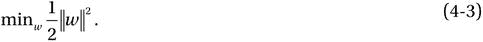
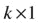
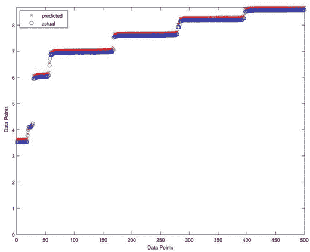

# 四、支持向量回归

The key to artificial intelligence has always been the representation. —Jeff Hawkins

基于统计学习或 Vapnik-Chervonenkis (VC)理论，支持向量机非常适合对尚未看到的数据进行归纳。第 3 章中介绍的 SVM 概念可以推广应用于回归问题。与分类一样，支持向量回归(SVR)的特点是使用核、稀疏解和 VC 控制支持向量的差值和数量。虽然没有 SVM 那么流行，但支持向量回归已被证明是实值函数估计的有效工具。作为一种监督学习方法，SVR 使用对称损失函数进行训练，该函数同等地惩罚高和低错误估计。使用 Vapnik 的不敏感方法，围绕估计函数对称地形成最小半径的柔性管，使得小于特定阈值的误差绝对值在估计值以上和以下都被忽略。以这种方式，管外的点被罚，但是管内的点，无论是在函数之上还是之下，都不会被罚。SVR 的主要优点之一是其计算复杂度不依赖于输入空间的维数。此外，它具有良好的泛化能力，预测精度高。

本章旨在提供 SVR 和贝叶斯回归的概述。它还提出了一个案例研究的修改 SVR 适用的情况下，这是非常必要的，以消除或严格限制低估的功能。

## SVR 概述

回归问题是分类问题的一般化，其中模型返回连续值输出，而不是来自有限集的输出。换句话说，回归模型估计连续值的多元函数。

支持向量机通过将其公式化为凸优化问题来解决二元分类问题(Vapnik 1998)。优化问题需要找到分隔超平面的最大间隔，同时正确地分类尽可能多的训练点。支持向量机用支持向量来表示这个最优超平面。SVM 的稀疏解和良好的泛化能力使其适用于回归问题。SVM 推广到 SVR 是通过在函数周围引入一个对ε不敏感的区域，称为ε管来实现的。该管道将优化问题转化为寻找最接近连续值函数的管道，同时平衡模型复杂性和预测误差。更具体地，SVR 被公式化为一个优化问题，首先定义一个要最小化的凸ε不敏感损失函数，并找到包含大多数训练实例的最平坦的管。因此，从损失函数和管的几何特性构造了多目标函数。然后，使用适当的数值优化算法来求解具有唯一解的凸优化。超平面用支持向量表示，支持向量是位于管边界之外的训练样本。如在 SVM，SVR 中的支持向量是影响管道形状的最有影响力的实例，并且训练和测试数据被假设为独立同分布(iid ),从监督学习上下文中的相同固定但未知的概率分布函数中提取。

## SVR:概念、数学模型和图形表示

使用图 [4-1](#Fig1) 中的一维示例，SVR 问题公式通常最好从几何角度推导。被逼近的连续值函数可以写成等式 4-1。对于多维数据，将 x 增加 1，并将 b 包括在 w 向量中，以简化数学符号，并在等式 4-2 中获得多元回归。

图 4-1。

One-dimensional linear SVR

SVR 将该函数近似问题公式化为优化问题，该优化问题试图找到以表面为中心的最窄的管，同时最小化预测误差，即预测输出和期望输出之间的距离。前一个条件产生等式 4-3 中的目标函数，其中||w||是被逼近表面的法向量的大小:

为了直观地了解权重的大小如何被解释为平坦度的度量，请考虑以下示例:

这里，M 是用于逼近函数的多项式的阶。随着向量 w 的大小增加，更多的 w i 为非零，从而产生更高阶的解，如图 [4-2](#Fig2) 所示。水平线是 0 阶多项式解，与所需输出有很大偏差，因此误差较大。线性函数(一阶多项式)对一部分数据产生了更好的近似，但仍不足以拟合训练数据。6 阶解决方案在函数平坦度和预测误差之间取得了最佳平衡。最高阶的解决方案没有误差，但是复杂度很高，并且很可能会使解决方案过度适应尚未看到的数据。w 的大小充当正则项，并提供对解的平坦性的优化问题控制。

图 4-2。

Solutions with various orders

约束条件是最小化给定输入的函数预测值和实际输出之间的误差。SVR 采用对ε不敏感的损失函数，惩罚与期望输出相差大于ε的预测。ε的值决定了管的宽度；较小的值表示较低的误差容限，还会影响支持向量的数量，从而影响解的稀疏性。直观地说，后者可以被形象化为图 [4-1](#Fig1) 。如果ε减小，管的边界向内移动。因此，边界周围的数据点越多，表示支持向量越多。类似地，增加ε将导致边界周围的点更少。

由于对噪声输入不太敏感，ε不敏感区域使模型更加稳健。可以采用几种损失函数，包括线性、二次和 Huber ε，分别如方程 4-4、4-5 和 4-6 所示。如图 [4-3](#Fig3) 所示，Huber 损失函数比线性和二次函数更平滑，但它会惩罚所有与期望输出的偏差，误差越大惩罚越大。损失函数的选择受到关于影响数据样本的噪声分布的先验信息(Huber 1964)、所寻求的模型稀疏度和训练计算复杂度的影响。这里给出的损失函数是对称的和凸的。虽然可以采用非对称损失函数来限制低估或高估，但是损失函数应该是凸的，以确保优化问题具有可以在有限数量的步骤中找到的唯一解。在本章中，推导将基于方程 4-4 的线性损失函数。

图 4-3。

Loss function types: (a) linear, (b) quadratic, and (c) Huber

Asymmetrical Loss Functions

一些研究人员提出修改损失函数，使它们不对称。Shim、Yong 和 Hwang (2011)在支持向量分位数回归(SVQR)中使用了一种不对称的ε不敏感损失函数，试图减少支持向量的数量。作者根据分位数改变了不敏感性，并实现了一个更稀疏的模型。Schabe (1991)提出了一个双边二次损失函数和一个拟二次 s 损失函数用于 Bayes 参数估计，Norstrom (1996)用一个不对称损失函数代替了二次损失函数，得到了一类在 Bayes 风险分析原点附近趋近于无穷大的函数。Nath 和 Bhattacharyya (2007 年)提出了一个最大间隔分类器，该分类器对每个类别的错误分类进行了不同的限制，从而允许不同的容差水平。Lee，Hsieh 和 Wang (2005)将典型的支持向量回归方法转化为无约束问题，从而只求解线性方程组而不是凸二次方程组。潘和潘(2006)比较了经济公差设计的三种*不同损失函数:田口的二次损失函数、倒正态损失函数和修正的倒正态损失函数。

采用类似于 SVM 所采用的软裕度方法，可以添加松弛变量ξ，ξ*来防止异常值。这些变量决定了在图 [4-1](#Fig1) 所示的管外可以容忍多少个点。

基于方程 4-3 和 4-4，得到方程 4-7 中的优化问题；c 是一个正则化参数——因此，对于这个多目标优化问题，它是一个可调参数，为最小化平坦度或误差提供了更大的权重。例如，C 越大，误差越小。这个有约束的二次优化问题可以通过寻找拉格朗日函数来解决(见方程 4-8)。拉格朗日乘数，或对偶变量，是λ，λ*，α，α*并且是非负实数。

使遭受

根据卡鲁什-库恩-塔克(KKT)条件，方程 4-8 的最小值是通过对变量取偏导数并使它们等于零得到的。拉格朗日乘子的偏导数返回约束条件，约束条件必须小于或等于零，如方程 4-9 所示。最终的 KKT 条件表明拉格朗日乘数和约束的乘积等于零(见方程 4-10)。等于零的拉格朗日乘数对应于管内的数据，而支持向量具有非零值的拉格朗日乘数。解决方案仅根据支持向量来编写，因此，解决方案稀疏性。方程 4-12 表示函数的近似值。通过替换方程 4-8 中的方程 4-9，优化问题的对偶形式可以写成方程 4-13 所示。

使遭受

在本节开始时，用标量 b 增加了权向量 w，并推导了 SVR 的数学公式，忽略了 b 的显式计算(见方程 4-2)。然而，b 可以从 KKT 条件中计算出来，如下所示。

属于管边界外部的训练数据将具有非零的α i 或α*I；它们不能都为零，因为那将意味着实例(x i ，y i )属于下限和上限，这是不可能的。因此，等式将满足相应的约束，如等式 4-14 所示。再者，因为点不在管外，，导致了时方程 4-15 的结果。等式 4-16 计算 b。对进行相同的分析，得到等式 4-17 和 4-18。

不使用 KKT 条件，在解决优化问题时，也可以使用内点方法计算 b，通过沿着可行区域的中心路径导航，内点方法可以在对数时间内收敛到最优解。通过同时求解原始和对偶优化问题来确定中心路径。

## 核 SVR 和不同损失函数:数学模型和图形表示

前一节处理了特征空间中的数据，假设 f(x)是线性的。对于非线性函数，可以使用满足 Mercer 条件的核将数据映射到更高维度的空间，称为核空间，以实现更高的精度(见图 [4-4](#Fig4) )，如之前讨论的分类。因此，用 k(x i ，x j )代替方程 4-1–4-18 中 x 的所有实例，得到方程 4-19 所示的原始公式，其中φ(.)是从特征到核空间的转换。等式 4-20 根据变换后的输入描述了新的权重向量。对偶问题在方程 4-21 中表示，函数逼近 f(x)在方程 4-22 中，其中 k(.,.)，内核，如方程 4-23 所示。

图 4-4。

Nonlinear regression

使遭受

## 贝叶斯线性回归

与 SVR 不同，Bayesian 线性回归是一种生成方法，而不是判别方法，它基于 Bayesian 推理建立线性回归模型。在指定模型之后，该方法计算参数和模型预测的后验分布。该统计分析允许该方法在训练期间确定模型复杂性，这导致模型不太可能过度拟合。

为简单起见，假设使用从一组大小为 X 的预测变量和大小为 Y 的观测值中学习的模型参数 w 来预测单个输出。假设观测值 Y 具有方程 4-24 中的分布，其中σ 2 是观测值中不确定性的方差:

一旦指定了模型，就可以估计模型参数的后验分布。首先假设模型参数的先验分布(见方程 4-25)。给定模型方差和观测值，模型参数的后验分布(即高斯分布)如方程 4-26 所示，平均值在方程 4-27 中计算，标准偏差比例因子在方程 4-28 中计算。平均值就是预测变量乘以观察值的 Moore-Penrose 伪逆。给定一些观察值，计算模型方差的后验概率，并获得具有 n-k 个自由度和比例因子 s 2 (见方程 4-30)的反卡方分布(见方程 4-29)。比例因子是模型的预测输出和观测值之间的误差。

在给定观察值的情况下，模型参数的边际后验分布是一个多元学生 t 分布，如等式 4-31 所示，并在等式 4-32 中计算，具有自由度、w E 平均值和 s 2 比例因子，因为具有正态分布，而具有反卡方分布。

给定模型参数概率分布和一组预测变量 X p ，可以确定边际后验预测分布 Y p ，这是一个多元学生的 t-分布(见方程 4-33)。平均值在方程 4-34 中计算，方差在方程 4-35 中计算。预测分布方差取决于观测数据和模型参数的不确定性。

贝叶斯回归的概念如图 [4-5](#Fig5) 所示，其中训练期间可用的样本输入数据将由高斯分布生成。如果这些实例很好地代表了它们的总体，则回归模型有望很好地推广。

图 4-5。

One-dimensional regression example illustrating the Gaussian conditional probability distributions of the output on the input and model parameters Discriminant vs. Generative Models

基于类别标签 p(C k 的先验概率分布和似然概率分布，生成方法对数据和类别标签 p(x，C k 的联合概率分布进行建模。联合分布计算后验概率分布，该分布将用于将数据点映射到类别标签。

判别式方法直接计算后验概率分布，而不计算联合概率分布 p(x，C k )。判别式方法产生从数据点到类别标签的映射，而无需计算概率分布。因此，这种方法在一个步骤中执行推理和决策阶段。

<colgroup><col> <col> <col></colgroup> 
|   | 优势 | 不足之处 |
| --- | --- | --- |
| 生殖的 | 对异常值具有鲁棒性可轻松更新决策模型通过应用概率规则，允许组合针对不同类型数据训练的分类器可通过基于后验分布测量分类置信度来提高预测准确性，并且在置信度较低时不进行预测 | 计算要求高需要大量训练数据受到维数灾难的困扰 |
| 判别式 | 计算要求较低易于实施 | 对噪音数据和异常值敏感需要针对决策模型的任何变化进行再培训 |

## 用于功率预测的非对称支持向量回归机:案例研究

理由:在许多近似情况下，根据误差是高于还是低于目标值，预测失误的后果是不均衡的(Stockman 等人，2012a，2012b)。例如，在功率预测中，不正确的低估计可能比过高估计更令人担忧。预测不足会导致数据中心冷却不足、不间断电源(UPS)不足、处理器资源不可用、芯片组件不必要的断电等等。在森林火灾行为预测的情况下，由于缺乏足够的人员和设备供应，较低的威胁估计可能导致更大的财产损失以及生命损失。

在这些情况下，最大限度地减少边界一侧的错误估计是至关重要的，即使冒着降低整个估计的准确性的风险。有必要限制损失函数，以使最小数量的低估或高估发生。这导致训练的不对称损失函数，其中当错误估计在边界的错误一侧时，应用更大的惩罚。

方法:Stockman、Awad 和 Khanna (2012a)提出了非对称下界支持向量回归机。该方法修改了 SVR 损失函数和相应的误差函数，使得ε管仅在函数之上，如图 [4-6](#Fig6) 所示。惩罚参数 C 被分成 C+和 C-，从而可以对上部和下部误预测应用不同的惩罚。

图 4-6。

(a) SVR and (b) ALB-SVR (Source: Intel, 2012)

ALB-SVR 使用 Huber 不敏感损失函数(Popov 和 Sautin 2008)。这个函数类似于ε不敏感损失函数；然而，对于在ε界限之外但低于某个阈值 > ε的小误差，它二次增加，然后线性超过。这使得它对于异常值是健壮的。Huber 不敏感损失函数由下式表示:

ALB-SVR 将 Huber 不敏感损失函数修改如下:

因此，解决方案是:

以及由此产生的优化问题:

通过替换新的损失函数，ALB-SVR 的经验风险变成

ALB-SVR 的最大额外经验风险可计算如下

验证:ALB-SVR 在 David 等人(2010 年)和 Stockman 等人(2010 年)使用的数据集上进行了测试，该数据集由内存活动计数器的五个属性的 17，765 个样本组成，实际对应的功耗以瓦特为单位，由内存功率提升板直接测量。内存功耗模型属性包括活动、读取、写入，CKE =高，CKE =低。ALB-SVR 是用 LIBSVM 的一个修改版本(Chang 和 Lin 2011)实现的。模拟结果(见图[4-7](#Fig7)–[4-9](#Fig9))采用了径向基函数(RBF)核的三重交叉验证的十次运行的平均值，结合了网格搜索和启发式实验，以找到最佳元参数ε、g、C + 和 C–。

图 4-9。

Power estimates for RAPL data with Huber insensitive ALB-SVR (Source: Intel, 2012)

图 4-8。

Power estimates for running average power limit (RAPL) data with Huber insensitive SVR (Source: Intel, 2012)

图 4-7。

Comparative results of SVR versus ALB-SVR (Source: Intel, 2012)

在 SVR 中，支持向量是位于ε管外部的那些点。ε的值越小，位于管外的点越多，因此支持向量的数量越多。在 ALB-SVR 中--管被切成两半，下界被去掉。因此，对于相同的 g 和参数，更多的点位于管外，并且有更多的支持向量。这意味着支持向量的数量对于 ALB-SVR 比对于 SVR 更大。支持向量数量的增加表明使用 ALB-SVR 对估计函数的复杂性有一些负面影响。虽然百分比相对误差数据集较高(5.06%)，但这是可以接受的，因为主要目的是减少低估的数量，这一点已经实现。

## 参考

张志忠和林志仁。“LIBSVM:支持向量机库”，载于 C. Ling 编辑的“大规模机器学习”，特刊，ACM 智能系统和技术汇刊 2，第 3 期(2011)。`www.csie.ntu.edu.tw/∼cjlin/papers/libsvm.pdf`。

大卫，霍华德，尤金·戈尔巴乔夫，乌尔夫·哈内布特，拉胡尔·康纳和克里斯蒂安·勒。" RAPL:记忆能力评估和上限."《2010 年 ACM/IEEE 低功耗电子与设计国际研讨会(ISLPED)论文集》, 2010 年 8 月 18-20 日，德克萨斯州奥斯汀，189-194 页。新泽西州皮斯卡塔韦:电气和电子工程师协会，2010 年。

位置参数的稳健估计。数理统计年鉴 35，第 1 号(1964):73–101。

李、叶毓杰、谢文峰和钱黄明。"ε-SSVR:用于ε不敏感回归的光滑支持向量机."IEEE 知识与数据工程汇刊 17，第 5 期(2005):678–685。

Nath、J. Saketha 和 Chiranjib Bhattacharyya。"具有指定假阳性和假阴性错误率的最大间隔分类器."《第七届 SIAM 数据挖掘国际会议论文集》, 2007 年 4 月 26-28 日，明尼苏达州明尼阿波利斯，第 35-46 页。2007. [`http://dblp.uni-trier.de/rec/bibtex/conf/sdm/NathB07`](http://dblp.uni-trier.de/rec/bibtex/conf/sdm/NathB07) 。

扬·格哈德·诺尔斯特伦。"风险分析中预防性损失函数的使用."IEEE 可靠性汇刊 45，第 3 期(1996):400–403。

潘杰南和潘建彪。"经济公差设计中各种损失函数的比较研究."《2006 年 IEEE 创新与技术管理国际会议论文集》，2006 年 6 月 21-23 日，中国新加坡，783-787。新泽西州皮斯卡塔韦:电气和电子工程师协会，2006 年。

波波夫助理检察官和萨乌丁。“支持向量回归中的损失函数分析”，第九届国际电子仪器工程实际问题会议，2008 年 9 月 23-25 日，俄罗斯新西伯利亚，198。新泽西州皮斯卡塔韦:电气和电子工程师协会，2008 年。

不对称损失下的贝氏估计。IEEE 可靠性汇刊 40，第 1 期(1991):63–67。

沈先生，朱勇和张夏焕。"使用不对称ε-不敏感损失函数的支持向量分位数回归."《统计应用与方法通讯》18，第 2 期(2011):165–170。

斯托克曼，梅丽莎，玛丽埃特·阿瓦德和拉胡尔·康纳。"用于功率预测的非对称下界支持向量回归机."英特尔技术期刊 16，第 2 期(2012a)。

斯托克曼，梅丽莎，玛丽埃特·阿瓦德，拉胡尔·康纳，克里斯蒂安·勒，霍华德·大卫，尤金·戈尔巴乔夫和乌尔夫·哈内布特。"一种使用机器学习估计记忆能力的新方法."在 2010 年 12 月 16-18 日在埃及开罗召开的 2010 年节能计算国际会议(ICEAC)的会议记录中，第 1-3 页。新泽西州皮斯卡塔韦:电气和电子工程师协会，2010 年。

斯托克曼、梅丽莎、兰达·s·埃尔·拉姆利、马里耶特·阿瓦德和拉比赫·贾布尔。"贝鲁特短期负荷预测的非对称二次支持向量回归损失函数."2012 年 IEEE 系统、人和控制论国际会议(SMC ), 2012 年 10 月 14-17 日，韩国首尔，651-656。新泽西州皮斯卡塔韦:电气和电子工程师协会，2012 年 b。

统计学习理论。纽约:威利出版社，1998 年。