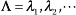
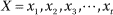
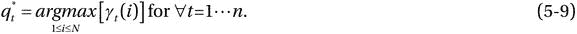

# 五、隐马尔可夫模型

The best thing about the future is that it comes one day at a time. —Abraham Lincoln

实时过程产生的观测值可以是离散的、连续的、静止的、时变的或有噪声的。基本的挑战是将观测值描述为参数随机过程，其参数应该使用明确定义的方法进行估计。这允许我们构建一个潜在过程的理论模型，使我们能够预测过程输出以及区分观察本身的统计属性。隐马尔可夫模型(HMM)就是这样一种统计模型。HMM 通过分析观察符号序列的模式来解释(不可观察的)过程。HMM 由双随机过程组成，其中潜在的(或隐藏的)随机过程可以通过分析另一组随机过程的观察符号序列来间接推断。HMM 包括(隐藏的)状态，这些状态表示被建模的过程的不可观察的或潜在的属性。基于 HMM 的方法被广泛用于分析特征或观察结果，例如使用和活动概况以及过程的不同状态之间的转换，以预测最可能的状态序列。HMM 可以被表示为离散事件的随机模型和马尔可夫链的变体，马尔可夫链是链接的状态或事件的链，其中下一个状态仅取决于系统的当前状态。HMM 的状态是隐藏的(或者只能从观察到的符号中推断出来)。对于给定的模型和观察序列，HMM 用于分析与模型选择、状态序列确定和模型训练相关的问题的解决方案(有关更多详细信息，请参见“HMM 的三个基本问题”一节)。

*   HMMs 的基础理论是在鲍姆及其同事的开拓性工作的基础上发展起来的(鲍姆和佩特里 1966；鲍姆和伊贡 1967；鲍姆和塞尔 1968；鲍姆等人 1970 年；鲍姆 1972)。该领域的早期工作归功于 Stratonovich (1960)，他基于条件马尔可夫过程理论提出了一个最优非线性滤波模型。Rabiner (1989)最近对 HMM 的应用作出了贡献，提出了一种表示语音的统计方法。作者建立了一个基于离散或连续密度参数分布的 HMM 系统的成功实现。
*   本章描述了 HMM 技术及其在入侵检测、工作负载优化和故障预测等管理解决方案中的实际应用。

## 离散马尔可夫过程

系统在任何时候都可以被描述为处于状态 S 1 ，S 2 ，S n (见图 [5-1](#Fig1) )。当系统以一定的概率 p ij 以规则的时间间隔经历从状态 S i 到 S j 的变化时，这可以通过简单的随机过程来描述，其中未来状态的分布仅取决于当前状态，而不取决于系统如何到达当前状态。具有元素 p ij 的矩阵 P 称为马尔可夫链的转移概率矩阵。换句话说，我们可以将离散马尔可夫过程描述为一种以规则间隔发展的现象，这样，对于给定的当前状态，过去和未来在统计上是独立的。传统上，只有当前状态影响未来状态的时间演化现象被称为动态系统。未来状态对当前状态的排他性依赖允许我们使用随机变量而不是确定性对象来模拟解决方案。随机变量定义了一组可能的结果(样本空间ω)和一个概率分布，该概率分布将每个结果与一个概率相关联。

图 5-1。

Markov chain with five states (S1–S5) with selected state transitions P(i, j)

离散马尔可夫过程的一个简单例子——马尔可夫链——是一维随机行走。在这种情况下，个体可能以一定的概率向前或向后移动。形式上，您可以定义独立的随机变量，其中每个变量是+1(向前移动)或-1(向后移动)，每个值有 50%的概率。从统计学上来说，你可以用独立同分布(iid)的随机变量 S 将随机游走定义为递增的随机变量序列 Q t ,这样

其中期望 E(Q n ) = 0，方差。如果是整数序列，那么

这个等式告诉我们，随机游走在 t + 1 时刻位于 S j 的概率只取决于它的当前值，而不取决于它是如何到达那里的。形式上，离散马尔可夫过程有三种定义，在下面的章节中描述。

### 定义 1

ω上的马氏链是随机过程{q0，q1，...，qt}，每个，使得

你构造ω×ω转移矩阵 P，其第(I，j)项表示，具有以下性质:

具有这些性质的矩阵 P 称为随机矩阵。

### 定义 2

矩阵 P n 的第(ij)个条目 P n (i，j)给出了从状态 I 开始的马尔可夫链在 n 步后将处于状态 j 的概率。

### 定义 3

设 u (0) 为代表起始分布的概率向量。然后，链在 n 步之后处于状态 j 的概率是向量中的第 j 个条目:

u(n)= u(0)P(n)

如果您想在假设链从某个状态 I 开始的情况下检查链的行为，您只需选择 u 作为概率向量，其中第 I 项等于 1，所有其他项等于 0。在以下章节中定义的随机过程也可以被表征为可观察的马尔可夫模型，因为每个状态可以被表示为物理事件。

## 隐马尔可夫模型简介

前面几节讨论了以马尔可夫模型为特征的随机过程，其中状态对应于可观察的物理现象。这种模型可能限制太多，在状态不能直接对应物理事件的现实问题中没有实际用途。为了提高其灵活性，您可以将模型扩展为这样一种模型，其中观察到的输出是状态的概率函数。根据唯一的概率分布，每个状态可以产生许多输出，并且每个不同的输出可以潜在地在任何状态下产生。得到的模型是称为 HMM 的双嵌入随机模型。HMM 中的基本随机过程产生一个状态序列，该状态序列不能直接观察到，只能通过产生观察序列的另一组随机过程来近似。

图 [5-2](#Fig2) 展示了离散马尔可夫过程到双随机 HMM 的扩展。新的 HMM 允许从每个状态发出具有有限概率分布的观察符号。这使得该模型比简单的马尔可夫链更具表现力和灵活性。此外，如图 [5-3](#Fig3) 所示，你可以通过一系列观察到的符号来模拟物理过程，这在大多数实际情况下是正确的。与传统马尔可夫链的关键区别在于，在分析观察到的状态序列时，你不能准确地说出是哪个状态序列产生了这些观察结果；然而，你可以计算某个状态序列产生它们的可能性。这表明状态序列是隐藏的，只能通过观察到的状态或符号序列来观察。

图 5-3。

Hidden Markov model: trellis representation

图 5-2。

Hidden Markov model with four hidden states and three observed states

### 隐马尔可夫模型的要点

HMM 的完整规范(Rabiner 1989)需要以下元素的正式定义:

*   模型中隐藏状态的数量:(N)。单个状态表示为；在时间 t 的状态被表示为 q t 。
*   状态转移概率分布:，表示从状态 I 到状态 j 的状态转移，其中，。这个性质类似于马尔可夫链的定义 5-1。
*   状态 j 的观测符号概率分布:()，其中。
*   初始状态分布:()，其中。

一旦通过 N、M、P、B、P 的适当值为物理过程定义了 HMM 参数，就可以分析观察序列(输出)，其中每个 x t 都是在时间 t 来自观察矩阵 O 的符号之一

形式上，HMM 可以通过指定模型参数 N 和 M、观察符号 O 以及三个概率矩阵 P、B 和 P 来定义。为了简单起见，可以使用紧凑形式，

以指示模型的完整参数集。这里描述的 HMM 做了两个假设:

*   马尔可夫假设:当前状态只依赖于前一状态；这代表了模型的记忆。
*   独立性假设:t 时刻的输出观测 o t 仅依赖于当前状态；它独立于先前的观察和状态。

### 隐马尔可夫模型的三个基本问题

前面的部分描述了 HMM 的模型。本节确定了将模型应用于现实世界问题时需要解决的基本问题。

这些基本问题分为三类:

*   问题 1。评估:给定观察序列和 HMM 模型，我们如何计算 X 的概率？这个问题的解决方案允许我们选择与观察序列最匹配的竞争模型。
*   问题二。解码:给定观察序列和 HMM 模型，我们如何找到最能解释观察结果的状态序列？这个问题的解决方案试图揭示随机模型的隐藏部分。
*   问题三。学习:我们如何调整模型参数来最大化？这个问题的解决方案试图优化模型参数以最好地描述观察序列。此外，该解决方案允许我们根据观察到的训练数据序列来调整模型参数。

考虑故障预测的问题，它评估未来故障的风险。在一个典型的系统中，组件有底层的依赖关系，允许错误从一个组件传播到另一个组件。此外，存在不可测量的健康状态，但是这些健康状态会在可靠的组件中引起错误。这些健康状态经历了正常表现状态、次表现状态、需要注意状态以及最终的失败状态。因此，准确识别运行状态以避免系统反应性停机至关重要。在这个场景中，健康状态对应于隐藏状态，观察对应于一系列错误条件。这使得系统管理员可以在系统完全故障之前安排预防性维护。因为故障是隐藏的(因此无法测量)并产生与错误相对应的符号，所以您可以将故障预测问题建模为 HMM。为了简单起见，您可以假设可以通过使用系统计数器识别可以测量的独特错误模式来预测故障。

虽然可以使用正常状态和故障状态对完整的系统进行建模，但是这种模型不提供组件级粒度来跟踪故障通过相关组件的进展。出于这个原因，系统架构师将故障分类到多个域中，以将故障的预测归因于特定的组件，从而避免系统级的灾难性关闭。

通过使用问题 3 的解决方案来执行第一个任务，其中通过训练过程来构建每个故障域()的单独模型。该过程将 HMM 参数分配给描述性模型，该描述性模型能够实现错误模式和系统到故障状态的相应转换之间的最佳匹配。在计算机系统中，这种训练可以由系统事件日志信息来支持，系统事件日志信息包含错误信息以及故障描述。

为了理解模型状态的物理意义，您需要确定问题 2 的解决方案。在这种情况下，错误计数器的统计属性转化为模型的每个健康状态中出现的观察序列。状态的定义和数量取决于应用程序的目标和特征。这个过程允许我们对模型进行微调，以提高其表示表征系统健康状况的各种状态的能力。正常状态和故障状态是 HMM 的两种结束状态；根据需要添加中间状态，以帮助预测错误行为的进展。添加中间状态提供了预测和关键场景的建模，这有助于在预期实际故障时结合修复机制。

一旦设计并优化了 HMMs)集，就可以使用问题 1 的解决方案来识别组件的健康状态。

### 隐马尔可夫模型三个基本问题的解决方案

下面的部分给出了 HMM 的三个基本问题的解决方案。这些问题的解决方案对于构建概率框架至关重要。

#### 问题 1 的解决方案

问题 1 的解决方案包括在给定模型λ的情况下评估观察序列的概率；也就是。考虑一个状态序列，其中 q 1 和 q t 分别是初始和最终状态。状态序列 Q 和模型λ的观测值 X 序列的概率可以表示为

根据马尔可夫链的性质，可以将状态序列的概率表示为

所有可能状态序列的总和如下:

不幸的是，直接计算不太实用，因为它需要 2nN n 次乘法。在每一个，可以到达 N 个可能的状态，这是一个很大的数字。例如，在 n = 100(观察序列的数量)和 N = 5(状态)时，可以有种可能的计算。幸运的是，一种叫做向前算法的有效方法可以达到同样的效果。

##### 正向算法

考虑前向变量α t (i ),其表示直到时间 t 的部分观察序列的概率，使得基础马尔可夫过程在时间 t 处于状态 S i ,给定 HMM 模型λ:

可以通过以下步骤递归计算α t (i ):

Initialize the forward probability as a joint probability of state S i and initial observation x 1. Let  for 1 £ i £N.   Compute α n (j) for all states j and t = n, using the induction procedure, substituting :    Using the results from the preceding step, compute   

评估前向概率所涉及的计算总数是 N 2 n，而不是直接计算所需的 2nN n 。对于 n = 100 和 N = 5，总计算次数是 2500，在数量上小 1069倍。

##### 向后算法

对于正向算法，您还可以定义一个反向变量β t (i ),它表示从时间 t + 1 到结束的部分观察序列的概率(而不是像正向算法中那样直到 t .),其中对于给定的模型λ，马尔可夫过程在时间 t 处于状态 S i 。从数学上来说，您可以将反向变量表示为

可以通过以下步骤递归计算α t (i ):

Define β n (i) = 1 for 1 ≤i £N.   Compute   

##### 缩放比例

在建模长 hmm 序列时的一个实际障碍是条件概率的数值缩放。条件概率的有效计算有助于估计给定模型的最可能的状态序列。对于一个足够大的序列，观察到一个长序列的概率非常小，以至于出现数值不稳定性。在大多数情况下，由此产生的计算超过了几乎任何机器的精度范围(包括双精度)。缓解这种情况的最常见方法是使用有效的缩放机制来重新缩放条件概率。

例如，让我们重温一下前向变量方程，

在前向变量α t (i)的情况下，你通过乘以 p ij 和 b j (x t 得到新值α t+1 (i)。这些概率往往很小，可能会下溢。对数可能没什么帮助，因为你处理的是乘积之和。此外，对数需要计算每次加法的对数和指数。基本缩放程序将α t (i)乘以缩放系数，目的是将缩放后的α t (i)保持在机器的动态精度范围内。在计算结束时，比例系数被抵消。缩放系数不需要在每个 t 步都应用，而是可以在任何需要的时候使用。

#### 问题 2 的解决方案

与问题 1 的解决方案不同，确定最佳状态序列是一个复杂的问题，因为可能有许多标准。复杂性部分源于最优性度量的定义，其中可能有几个独特的标准。一种解决方案是识别最有可能在时间 t 单独出现的状态 q t 。这种解决方案试图最大化正确的单独状态的预期数量。为了实现问题 2 的解决方案，给定观察序列 X 和模型λ，将变量γ t (i)定义为在时间 t 处于状态 S i 的概率，使得

使用条件概率的定义，您可以将此等式表示为

你可以用向前向后变量改写方程 5-7，如下所示

其中，α t (i)定义时间 t 时部分观察值和状态 S i 的概率，β  t  (i)定义时间 t 时观察值和状态 S i 的剩余概率。使用γ  t  (i)，您可以通过计算在时间 t 时处于状态 S i 的最高概率来求解每个时间 t 时最可能的状态

虽然这个等式通过在每个时间间隔选择最可能的状态来最大化正确状态的预期数量，但是状态序列本身可能是无效的。例如，在序列 q t = S i 和 q t+1 = S j 中的各个最可能状态的情况下，转移概率 p ij 可能是 0，因此是无效的。这种解决方案识别在任何时间 t 最可能的状态，而不考虑状态序列出现的概率。

解决这个问题的一个方法是最大化一个以上状态的序列的出现。这允许自动评估状态的有效出现，同时评估最可能的序列。一种广泛使用的方案是找到最终导致最大化的最可能的状态序列。这种基于动态编程的技术被称为维特比算法。为了找到单个最佳状态序列，您定义了一个变量δ  t  (i ),该变量表示沿着一个状态序列(路径)的最高概率，该状态序列(路径)说明了第一个 t 观察值，并以状态 S i 结束，如下所示:

可以通过归纳法计算δ t+1 (j)，为

从中可以清楚地看出，要检索状态序列，您需要跟踪在每个时间 t 使δ i (i)最大化的状态。这是通过构造数组ψ t+1 (j)来完成的，该数组定义了在时间 t 从状态 S j 到状态 S 的转换使概率δ t+1 (j)最大化的状态。数学上，这可以表示为

寻找最佳状态序列的完整过程包括以下步骤:

##### 初始化

##### 递归

##### 结束

##### 状态序列回溯

维特比算法类似于前向过程，除了它使用对先前状态的最大化而不是求和。

#### 问题 3 的解决方案

问题 3 的解决方案涉及调整模型参数(P，B，π)的方法，以最大化给定模型的观测序列的概率。在实践中，没有最大化观测序列概率的公知方法。但是，您可以选择λ = (P，B，P ),这样 P(X|λ)就可以局部最大化，使用迭代方法，例如 Baum-Welch 算法。

为了指定 HMM 参数的重新估计，对于给定的模型λ和观察序列 X，将变量γ t (i，j)定义为在时间 t 处于状态 S i 和在时间 t + 1 处于 S j 的概率，使得

使用向前-向后算法的定义，你可以将等式 5-10 改写为

如等式 5-8 所定义的，给定观察序列和模型，γ t (i)是在时间 t 处于状态 S i 的概率。使用这个等式，通过对 j 求和，可以将γ t (i)与γ t (i，j)联系起来

通过对时间 t 上的γ t (i)求和，可以量化状态 S i 被访问的次数，或者从状态 S i 进行转换的预期次数。类似地，γ t (i，j)对时间 t 的求和揭示了从状态 S i 到状态 S j 的预期转换次数。给定γ t (i)，γ t (i，j)，以及当前模型λ，可以建立方法重新估计 HMM 模型的参数()。该方法可细分如下:

At time t = 1 the expected frequency at state S i is given by    The probability of transiting from state S  i  to state S j , which is the desired value of , is given by  The numerator is the reestimated value of the expected number of transitions from state S  i  to state S j ; the denominator is the expected number of transitions from S  i  to any state.   The probability of observing symbol k, given that the model is in state S j , is given by  The numerator of the reestimated  is the expected number of times the model is in state S  j  with observation symbol k; the denominator is the expected number of times the model is in state S j .  

通过这种方法，您使用当前模型λ(P，B，π)来重新估计新模型，如前三步所述。重新估算过程是一种迭代方法，包括以下步骤:

Initialize l(P,B,p) with a best guess or random value, or use the existing model.   Compute α t (i),β t (i),γ t (i),γ t (i, j).   Reestimate the model .   If , repeat step 2.  

这个重新估计过程的最终结果被称为 HMM 参数的最大似然估计(MLE)。向前-向后算法仅产生局部最大值。

## 连续观察 HMM

前面几节考虑了一个场景，其中观察值是有限字母表中的离散符号，从而能够使用系统中每个状态的离散概率密度。然而，对于许多实际的实现，观测值是连续的向量。虽然可以通过码本等量化连续矢量，但量化可能会导致质量下降。因此，具有连续观测值的 HMM 是有利的，其概率密度函数(PDF)被评估为其他分布函数的凸组合，即混合分布，具有相关的混合权重。组件的数量被限制为有限的。对于一个给定的观察池，混合分布被用来对子群体的特性进行统计推断，而不需要标识该观察所属子群体的标签。分量 M(子群体)的数量取决于对观察池进行分组的观察聚类的数量(通过无监督算法学习，如 k-means)。通常，每个混合成分代表一个 M 维分类分布，其中 M 个可能结果中的每一个都用每个结果的概率来指定。每个混合分量遵循相似的分布(正态分布、对数正态分布等)，并代表将任意时刻的连续观测值集合分类为唯一符号的唯一资格(类似于离散观测值)。使用 EM 算法训练的混合成分能够自组织以适应数据集。连续观察模型根据状态到簇发射概率分布，在 HMM 状态转换的每个时间步产生隐藏簇(或混合符号)序列。簇(或混合符号)可以被认为是嵌入在隐藏状态中的隐藏符号。例如，隐藏状态可以表示特定的工作负载，符号可以表示基于资源利用的工作负载的特定属性。

您从概率密度函数(PDF)的表示开始，它允许以一致的方式重新估计其参数。可用于重新估算过程的最常见的 PDF 形式由多元正态分布或混合高斯分布给出:

在哪里

X =观测向量()

M =混合物密度的数量

c jm =第 j 个状态下第 m 个混合物的重量

 =任何椭圆对称密度函数(如高斯函数)

μ jm =第 j 个状态下第 m 个混合的平均向量

U jm =第 m 个混合和第 j 个状态的协方差矩阵

在统计学中，混合模型是一种概率模型，其中基础数据属于混合分布。在混合分布中，密度函数是其他 pdf 的凸组合(即，所有系数或权重总和为 1 的线性组合)。可以看出(Liporace 2006Hwang 1986)认为，混合物密度系数(cJM，μJM，UJM)的重新估计可表示为

其中(XT-μJK)T表示向量转置，ε t (j，k)，第 k 个混合占 X t 时处于状态 j 的概率:

p ij 的重新估算公式类似于为离散观测密度定义的公式。c jk 的重新估算公式是使用第 k 个混合物组分的系统处于状态 j 的预期次数与系统处于状态 j 的预期次数之比

为了降低计算复杂性，另一种方法是半连续 HMM (SCHMM)，它是连续观察 HMM (CHMM)的一种特殊形式。SCHMM 使用与一组通用混合密度相关的状态混合密度。所有状态共享相同的混合物，并且只有混合物密度分量权重 c jk 保持特定于状态的状态。

### 多元高斯混合模型

在 CHMM 中，b j (X)是一个连续的 PDF，它通常是 L 维观测值的多元高斯分布的混合。高斯混合模型(GMM)密度被定义为高斯密度的加权和。在处理自然现象时，高斯分布的选择是自然的并且非常普遍。对于高斯混合，方程 5-13 中的可以用高斯分布代替，以获得发射密度的数学形式，

每个高斯混合由其参数集定义，参数集包括混合分布 c jk ，平均向量μ jk ，以及协方差矩阵 U jk 。注意，具有高斯 pdf 的有限混合作为条件密度的 CHMM 等价于具有简单高斯 pdf 作为条件密度的。使用高斯混合 PDF，您可以将具有混合密度的状态转换为多个单一密度状态的网络。图 [5-4](#Fig4) 描述了一个场景，其中状态 S2，对应于一个双组分混合 PDF，已经被扩展为两个状态 S2 a 和 S2 b ，具有单组分 PDF 和调整的转移概率。

图 5-4。

Two-component Gaussian mixture model for state S2 expanded into single-component Gaussian model with two new states (S2a, S2b)

### 示例:工作负载阶段识别

最近的计算机体系结构研究表明，程序执行表现出可以在最大尺度上表征的阶段行为(Perelman et al. 2002)。在大多数情况下，工作负载行为既不是同质的，也不是完全随机的；它结构良好，有一类阶段。当您在阶段之间转换时，您可以通过重复使用循环阶段的配置信息来启动重新配置。

数据中心和云计算的趋势对服务器系统中的电源优化和电源控制提出了有趣的挑战。一个系统可以表示为一组组件，它们的协作交互产生有用的工作。这些组件在本质上可以是异构的，并且它们的功耗和功率控制机制可以不同。具有几个中央处理单元(CPU)、存储器和输入/输出(I/O)组件的服务器系统可以使用嵌入式控制器或特殊硬件来协调电源控制动作。控制操作的准确性和敏捷性在主动性能调优中至关重要。观察工作负载的变化如何影响不同服务器组件的功耗，可以为分析和构建服务质量(QoS)预期与功耗之间的关系模型提供关键数据。因此，您需要一个能够提取工作负载特性并根据操作阶段主动调整系统的自治系统。下面几节介绍了一种这样的方法，它使用服务器平台中的性能数据对系统的运行时行为进行建模。我们描述了一个经过训练的模型，该模型使用 CHMM 来分析工作负载的行为属性，识别当前并以合理的准确度预测工作负载特征的未来阶段。

预测系统被设计用于识别工作负荷模式和早期检测阶段的特征。知识库(模型)推荐适当的操作。这些系统是自我修正的，并且需要持续的训练来适应先前已知的以及一段时间内的进化行为。相位检测模型可以帮助预测性能状态，并通过调整其参数来主动适应系统约束。

### 监测和观察

监控和测量来自系统活动的事件是表征系统阶段和预测未来的基础。现代处理器具有内置的性能监控计数器，可测量处理器和内存事件的实时访问模式，并有助于为各种动态决策设计分析智能。可以对诸如内存访问模式、指令执行速率和流水线停顿等趋势进行统计研究，以发现模式、隐藏相关性和时间相关行为。测量的事件(资源利用、温度、能耗、性能)可被视为观测到的排放的多个维度。基于最大化观察序列概率的动态模型，提取的相位可以被视为可预测的系统特性。一旦您确定了当前的工作负载操作阶段和最有可能的未来阶段，您就可以调整系统并为其提供足够的资源，从而避免被动的资源分配。基于 CHMM 的相位表征过程使用内置的性能计数器和传感器。此外，综合计数器用于抽象工作负载的时变行为。

### 工作量和阶段

工作负载是具有特定目标(查询、搜索、分析等)的应用程序，它们经历不同的执行阶段，同时在多种约束条件下运行。这些限制与功耗、发热和 QoS 要求有关。由于功率和性能参数调整的各种自由度，最佳系统操作涉及复杂的选择。该过程包括建模方法、实现选择和动态调整。工作负载中的阶段检测是一个重要的组成部分，它捕获动态可适应系统的时变行为。这种能力有助于在需求变化之前重新配置硬件和软件，并能够在循环阶段重用经过训练的模型。阶段识别还有助于预测工作负载执行期间的未来阶段，从而防止对工作负载行为变化的被动响应。在这种情况下，阶段是一个执行阶段，其中工作负载表现出相似的功率、温度和性能特征。

CHMM 辅助方法识别阶段的边界，在存在系统传感器和性能计数器的情况下，该边界由高斯密度混合函数的潜在分量表示。状态变量可以用作反馈到过程控制回路的过程控制参数。例如，您可以反馈工作负载阶段(或行为属性)来主动控制热行为，因为温度的物理动态可以表示为各种系统组件利用率的函数。一般来说，HMM 特别有用，因为它可以利用事件序列中的潜在模式并执行状态空间分析。您可以使用高斯观察作为在时变工作负载行为中正确识别阶段边界的指标。这些阶段边界可以进一步用于提取与物理现象的各种状态的关系，例如服务器需求预测和热变化预测。例如，图 [5-5](#Fig5) 显示了 CPU 利用率与工作负载阶段的测试，该测试以统计方式定期评估。这个函数可以通过使用多个变量来扩展。

图 5-5。

CPU utilization versus phase model. The workload is composed of eight phases with phase-specific power, thermal, and performance characteristics. The red line (bottom graph) identifies the phase number that corresponds to the running average power limit (RAPL) (blue line) for each instance of workload. For example, average utilization of 65–70 percent results in phase 1

与总工作负载分析相比，CHMM 辅助分析更准确、信息量更大。一般来说，有效地调整系统硬件和软件有助于构建高效的系统，在给定的性能限制下最大限度地降低功耗和散热。系统的各种属性可以受益于相位识别:

*   对于给定的性能约束，您可以调整系统组件(CPU、内存、I/O)以实现最低功耗。在识别新的阶段时，以最小化性能下降的方式分配(或解除分配)功率。
*   对预期性能变化的主动补偿有助于避免被动状态变化，从而避免被动延迟，提高性能。
*   可用功率以最大化整体性能的方式分配给系统组件。一种策略可能涉及根据每个组件在性能增益中的份额进行单独分配(或取消分配)。
*   活动向量用于执行热平衡计算，从而防止热点。活动数据还可用于以无争用和节能的方式协同调度任务。
*   您可以分析与以下方面相关的任务特征:(1)任务优先级，(2)能源和散热特征，以及(2)与任务优先级成比例的延迟目标相关的优化方法。

工作负载阶段可用于自适应架构，通过预测性状态反馈指导性能和功耗优化。因为 HMM 使用观察值并将观察值与面向目标的状态(例如平均温度或利用率)相关联，所以它很可能是系统设计中的一个考虑因素。观察点可以通过使用一组合理的系统范围的性能计数器和传感器来表征。预测控制目标(如服务器温度)的隐藏状态通过使用特征提取技术提取工作负载阶段来测量。此外，国家与这些观察共享概率关系。这些概率关系(也称为配置文件)随着工作负载在其生命周期中的不断使用而强化和发展。如果您认为一个正常的工作负载行为是一个观察序列的模式，那么 HMM 应该适合于将这样的模式映射到几个状态之一。此外，必须建立一个适应性战略，其基础是嵌入许多政策，这些政策以背景和环境投入为依据。这些策略控制着各种行为属性，增强了灵活性，以便在环境高度多变的情况下最大限度地提高效率和性能。基于 HMM 的方法将系统观察(使用、活动概况)关联起来，以预测最可能的系统状态。HMM 训练使用初始数据和连续的重新估计，创建由组件模型、转移概率和观察符号概率组成的简档。CHMM 通过对多个组件的同类行为进行聚类来帮助估计工作负载阶段。通过最大化观察序列的概率，可以用 k 混合的 d 维高斯(观察向量)模型来解释工作负载阶段。

### 相位检测的混合模型

基于 HMM 的方法的首要目标是通过在存在时变行为的情况下建立各种阶段执行边界来预测过程的状态。与研究聚集行为的传统方法不同，基于 HMM 的方法可以使用高斯混合模型(GMM)提取代表性阶段和工作负载分类。例如，HMM 可以通过针对工作负载和以固有行为模式为特征的相应阶段训练自己来建模。这些阶段可以被认为是隐藏在隐藏状态中的潜在符号(因为它们不能被直接观察到)，在这种情况下，这是一个工作负载。在经过训练的模型中，这些潜在的相模式可以通过多组观察到的现象来识别，这些观察到的现象通过单独的混合物成分概率密度的组合以及隐藏状态的存在(使用状态转移矩阵来评估)来建模。观察值以综合计数器和传感器的形式存在，用于测量系统以及系统组件的性能和功率特性。以下各节将依次描述有助于工作负载阶段检测的各种功能块。

#### 传感器块

在自主系统仪器中，端点(传感器/控制器)遍布整个平台(见图 [5-6](#Fig6) )，这些端点的特性可能因平台而异。在典型的服务器管理架构中，传感器模块混合了性能计数器以及温度、气流和功率传感器。这些传感器通过各种接口访问，如 PCI Express、SMBus、PECI 总线和 CPU 型号特定寄存器(MSR)。传感器的输出经过统计处理并用作反馈。根据用户要求，仪器的相对重要性可能有所不同。在某些情况下，由于成本限制，通过将传感器数据与一组不同的变量相关联，仪器代替物理传感器被合成。在其他情况下，物理传感器的仪器精度可能随工作区域而变化，超出工作区域，仪器精度可能会非常不准确。在这种情况下，灵敏度在传感器的整个工作范围内并不恒定，从而导致非线性。非线性取决于传感器输出在整个传感器范围内与理想行为的偏差。可能有必要在线性工作范围内校准传感器，然后将校准的参数和函数用于非线性工作区域的其余部分。由于传感器属性在长时间内老化，传感器数据也可以观察到长期漂移。对于数字传感器，也可能存在数字化误差，因为测量数据是实际数据的近似值。此外，采样频率的限制会导致测量数据的动态误差。应用程序测量或控制平台某个方面的能力在很大程度上取决于它的宿主位置及其与测量端点的连接性。

图 5-6。

Instrumentation telemetry in a typical Intel Xeon server platform

系统中的功率、热量和性能变化会导致次优行为，可能需要纠正以符合平台策略。必须提前很好地预测这种行为，以便可以在机会窗口内采取纠正措施。这种情况可以通过使用一组传感器来预测，这些传感器可以一起作为部件高斯模型来模拟整体特征密度。在平台中，这些传感器可用作活动计数器；温度、功率和性能监控器；诸如此类。传感器数据的类别如下:

*   CPU 性能计数器:这些是特殊用途的硬件计数器，内置于现代微处理器中，用于存储 CPU 上下文中硬件相关活动的计数。这些计数器的输出用于预测 CPU 利用率方面的常见工作负载行为(缓存、流水线、空闲时间、停止、热量)。
*   内存性能计数器:内存性能计数器确定内存访问模式、带宽利用率、动态随机访问存储器(DRAM)功耗以及 DRAM 命令活动(读、写)的比例，这对于描述工作负载的内存密集型行为非常有用。可以通过观察预充电、活动和空闲状态下的读/写周期和时间的比例来表征工作负载模式。
*   I/O 性能计数器:I/O 能力的三个主要指标是(1)直接内存访问(DMA)，(2)不可缓存的访问，以及(3)中断活动。其中，每个周期的中断次数是 I/O 功率的主要指标。由于 I/O 芯片中存在各种性能增强(如写组合), DMA 指示器的性能次优。I/O 中断通常由 I/O 设备触发，以指示大型数据传输的完成。因此，可以将 I/O 电源与适当的设备相关联。因为该信息不能通过 CPU 计数器获得，所以操作系统使用性能监视器使其可用。
*   热量数据:除了上述性能计数器之外，您还可以考虑使用热量数据，这些数据在所有现代组件(CPU、内存等)中都可用，并且可以通过 PECI 总线访问。
*   工作负载性能反馈:控制理论行动基于滞后现象启动防御响应，以减少资源需求变化的影响。如果这种响应干扰了有用工作的性能要求，则需要对其进行纠正。过度响应会降低系统速度，并对控制措施的有效性产生负面影响。状态反馈传达在给定时间性能需求(或服务水平目标)的最佳实现。必须通过预测与正在执行的工作的行为及其动态需求相关的适应度函数的属性来估计该反馈。连续状态反馈训练系统特定的控制动作，并通过将这些动作与将来可以重复的唯一状态阶段指纹相关联来保存这些动作的配方。

#### 模型简化模块

模型缩减块(MRB)负责通过保留关键的不相关和非线性数据集来降低数据集的维度。这使我们能够保留最重要的数据集，即那些足以识别表现出时变行为的工作负载操作阶段的数据集。MRB 模型的输入是与微体系结构性能计数器、工作负载性能计数器和模拟传感器(测量功率、温度等)相关的时间序列数据。可以使用图 [5-6](#Fig6) 中所示的多种接口(PCI Express、SMBus、PECI Bus 等)中的一种来收集这些数据。

您可以使用主成分分析(PCA)在不损失信息的情况下降低数据的维度(参见[第 2 章](02.html))。产生的输出变量是不相关的主成分。例如，PCA 将 N 个输入转换成 M 个主成分，几乎没有信息重叠。此外，每个主成分的方差按降序排列，使得 x 1 包含的信息最多，x M 包含的信息最少。每个主成分定义了观察的维度。

#### 发射块

排放区块(EB)负责收集不相关的排放作为时间序列数据。从传感器收集的原始数据是有噪声的，必须进行过滤以提取可量化的信息。降噪程序确定了一个简单的动态系统，它是数据的良好表示。在训练周期中，降噪方案由符合δt 建模窗口输入数据的代表性分布组成。流向接收模块(见图 [5-7](#Fig7) )的传感器数据延迟了可配置的时间周期δt。δt 周期内的数据行为由基本方程控制，该方程被训练为拒绝(或重建)数据点。

图 5-7。

Phase detection model, using GMM

传感器模块的输出被处理到 EB 中，EB 处理轮询的传感器数据序列以生成连续的观察序列。此外，MRB 通过合成重要的传感器输入并提供独立的特征来缩减传感器输入的数量。您可以使用一组离散的加权高斯 pdf，每个 pdf 都有自己的均值和协方差矩阵，以便使用连续发射更好地模拟相位检测特性。高斯混合形成参数模型，其参数使用等式 5-14 和 5-15 从训练数据迭代估计。在工作负荷阶段检测中，k 个混合物的 d 维高斯(独立发射)被建模为高斯密度的加权和(见等式 5-16)。

#### 训练块

动态系统具有时间特性，其时变特性在运行期间会发生变化。这些系统产生一个时间序列的观察，可以分析动态特性。训练块(TB)通过为具有不同特征(如系统功率)的工作负载提供度量向量和相应的预测变量，来帮助构建预测模型。TB 执行无监督分类，并通过将数据划分成同类簇来构建数据结构，使得相似的对象被分组在同一类中。在最简单的情况下，您可以使用 k-means 聚类算法，该算法将 d 维排放划分为 k 个聚类，这样每个排放都属于具有最近平均值的聚类。对于给定的一组排放物，k 均值聚类算法通过找到所有 k 个聚类的最小观察距离，将排放物分成 k 组:

每个 G 元素充当 k 个单密度状态的单分量高斯密度函数，每个状态代表一个独特的工作负载阶段；μ i 代表第 I 类的均值。

#### 参数估计块

您可以使用 GMM 来表示工作负载阶段预测系统中的功能分布，在该系统中，单个组件密度对一组潜在类别进行建模。参数估计块(PEB)负责估计模型λ k 的参数，该模型拟合该模型的数据。一开始，模型的输入数据是来自 TB 的输出传感器数据，TB 将观察值分类(标记)为一个聚类数？分类器使用最小失真或最近邻方法对输入向量进行分类，从混合中选择最佳高斯分量。一旦针对每个模型的训练数据被缓冲了时间间隔δt，它们就被用于估计该模型的高斯混合参数。在没有先验模型的情况下，PEB 初始化混合数并估计模型参数(c k ，μ k ，U k )。您可以使用估计最大化(EM)方法，最大化聚类标记数据的可能性(参见[第 1 章](01.html))。EM 算法背后的基本思想是引入一个变量(高斯混合分量),该变量将简化似然性的最大化。EM 算法是一种两步方法:

E-Step: Estimate the probability distribution of each Gaussian mixture component for a given emission (X) and model (λ).   M-Step: Estimate the joint probability distribution of the data and the latent variable (Gaussian mixture component). This step modifies the model parameters of the Gaussian mixture component to maximize the likelihood of the emission and the Gaussian component itself.  

从初始模型λ开始，EM 算法估计新的模型，使得。然后，新模型成为下一次迭代的起始模型，并且重复该过程，直到达到收敛阈值。对于 d 维发射向量序列的给定序列，第 k 个混合分量的后验概率由下式给出

用于重新估算模型参数的公式为

该模块有助于将观察序列分类为第 k 个高斯分量。您可以将单状态 GCHMM 扩展为单密度、多状态 GCHMM。

#### 相位预测模型

可以表示为应用程序阶段的工作负载模式表现出某些重复的行为。您需要识别和预测重复阶段的方法，以主动应用可行的动态管理响应。使用相位预测模块(PPB)，您可以通过可配置的周期δt 提前估计观察序列(见图 [5-8](#Fig8) )。

图 5-8。

Prediction of an observation vector for twelve phases, using an exponential smoothing function

当工作负载在阶段边界运行时，PPB 分析特别有意义，并且必须为预期阶段优化控制操作。要构建一个简单的预测模型，您需要使用观测向量指数平滑模型来估计未来的 d 维观测向量。指数平滑通常可以表示为

其中，

其中 y t 表示在 t–1 时刻平滑函数的预测输出，x t (我们的标准符号)表示来自各种传感器的原始排放。代表 t 时刻的预测误差。指数平滑考虑了所有过去的数据，但旧样本的比例贡献会以几何方式减少。这允许我们调整两个不同模型的α值。在图 [5-7](#Fig7) 中，这由“预测 T + t”块说明。图 [5-9](#Fig9) 展示了预测过程，其中控制过程消耗估计的相位特征并与控制动作相关联。如果该阶段出现在未来，则重复相同的动作。

图 5-9。

Phase prediction block; control processes use the prediction model and sensor observations to tune the process variables proactively

#### 状态预测块

在工作负载表征的上下文中，状态表示反馈功能的有趣属性，当预测时，该属性会主动触发纠正响应以避免反应性动作。反应性响应滞后于控制行动，在此期间，该职能部门执行内务管理并确定行为变化的原因。为了防止性能下降，您需要确定一个关键的过程变量，如果预测到该变量，就可以生成一个主动的响应。阶段代表随时间变化的工作负载的独特行为特征，需要对其进行预测以避免被动调优。

#### 系统适应

前面几节研究了一种在具有时变属性的动态系统中检测工作负载阶段的系统方法。现在，问题仍然是为什么我们需要检测系统相位。

通常，工作负载会受到任意性能和环境压力的影响，这可以通过使用自适应系统来补偿。适应可能必须服务于相互敌对的功能，并向不同的方向发展。这导致需要在解决方案之间进行折衷，以最大化整体解决方案的适用性。自适应功能将优化功率，以提供应用感知的所需性能。期望的性能不一定是最高的性能。在实际系统中，不可能同时将目标策略的所有方面改进到相同的程度。因此，系统开发了各种反馈控制方案，在硬件、软件或软件辅助的硬件场景中运行。控制目标包括

*   以连续模式监控资源状况
*   通过对反馈控制行为建模来确定应该如何以及何时执行适应
*   识别给定工作负载行为的实时约束和资源需求
*   识别给定自主元件的可用执行路径的选择
*   根据当前的资源使用情况和工作行为，调配服务器未来的资源需求
*   发现组件功率和性能调整的固有相位依赖性

QoS 简档通过以动态方式指示输出质量水平来管理适当的资源预留水平。一般来说，QoS 最大化过程始于初始资源分配，它会根据不断变化的应用需求和满意度进行修改。在我们这里描述的场景中，值得注意的是，智能控制动作需要理解工作负载行为；因为工作负载行为的特征在于一个离散的阶段，所以您可以使用该信息作为对任何控制循环动作的反馈。系统内的各种过程控制应用程序可以通过建立将阶段活动与控制动作相关联的定制学习功能来优化它们的工作功能。由此产生的决策引导每个控制回路模型根据历史趋势，针对可量化的阶段行为，动态地训练自身。

## 参考

马尔可夫过程概率函数统计估计中的等式和相关最大化技术。不等式 3(1972):1–8。

鲍姆、伦纳德. e .和 J. A .伊根。"一个不等式及其在马尔可夫过程概率函数的统计估计和生态学模型中的应用."美国数学学会通报 73，第 3 号(1967):360–363。 [`http://projecteuclid.org/euclid.bams/1183528841`](http://projecteuclid.org/euclid.bams/1183528841) 。

鲍姆、伦纳德·e 和泰德·佩特里。"有限状态马氏链概率函数的统计推断."数理统计年鉴(1966):1554–1563。 [`http://projecteuclid.org/euclid.aoms/1177699147`](http://projecteuclid.org/euclid.aoms/1177699147) 。

鲍姆，伦纳德 e 和乔治塞尔。"流形上函数的增长变换."太平洋数学杂志 27，第 2 期(1968):211–227。 [`http://projecteuclid.org/euclid.pjm/1102983899`](http://projecteuclid.org/euclid.pjm/1102983899) 。

马尔可夫过程概率函数统计估计中的等式和相关最大化技术。不等式 3(1972):1–8。

Juang，Bing-Hwang，Stephen E. Levinson 和 M. Mohan Sondhi。“马尔可夫链的多元混合观测值的最大似然估计(Corresp。)."IEEE 信息论汇刊 32，第 2 期(1986):307–309。

马尔可夫源的多元观测的最大似然估计。IEEE 信息论汇刊 28，第 5 期(1982):729–734。

舍伍德、蒂莫西、埃雷兹·佩雷尔曼、格雷格·哈默利和布拉德·考尔德。"自动描述大规模程序行为的特征."ACM SIGARCH 计算机体系结构新闻 30，第 5 期(2002):45–57。

劳伦斯·拉宾纳。"一个关于隐马尔可夫模型和语音识别应用的教程."IEEE 77 会议录，第 2 号(1989):257–286。

条件马尔可夫过程。概率论及其应用 5，第 2 期(1960):156–178。