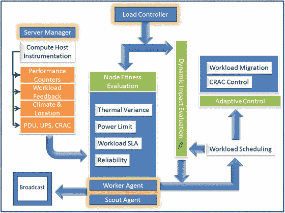

# 6.生物启发计算:群体智能

Brains exist because the distribution of resources necessary for survival and the hazards that threaten survival vary in space and time. —John M. Allman, Evolving Brains

自然系统使用简单的规则解决多方面的问题，并表现出有组织的、复杂的和智能的行为。自然过程控制系统是自适应的、进化的、分布式的(分散的)、反应式的，并且知道它们的环境。生物启发计算(或生物启发计算)是一个研究领域，它从自然界通过自我管理、自我组织和自我学习来适应环境变化的复杂性中获得灵感。生物启发的计算方法产生了信息学工具，这些工具基于自然系统中自适应分布式体系结构的深刻概念。模拟这些自然过程的试探法可以表示为约束优化的理论方法。这种试探法以适应度函数的形式定义了一种表示。该函数描述问题，评估其解决方案的质量，并使用其操作符(如交叉、变异和拼接)来生成一组新的解决方案。

阿什比(1952)的书《大脑的设计》讨论了塑造适应性行为概念的机制，如在活的有机体中所展示的，以及大脑的适应性行为。作者将适应定义为一种在生理限度内促进稳定并维持基本变量的行为形式。此外，稳定性被表示为具有变化动态的多个场的组合函数。因此，稳定性被认为与各种场之间的协调功能有关。随着系统和反馈变得越来越复杂，稳定的实现变得越来越困难，不稳定的可能性也越来越大。

从生物学上来说，生物体生存的一个重要因素是其在可行范围内维持其基本变量的能力。否则，有机体面临解体或丧失身份(解散、死亡)的可能性，或两者兼而有之。适应提供了一个有机稳定性标准，有助于在可行的限度内维持必要的变量；自适应系统是一个稳定的系统(Harvey et al. 2005，稳定区域是状态空间的一部分，其中所有基本变量都在生理极限内。

在自然界中，大脑表现出高效信息工具的特性，它收集数据(传感器功能)，推断并存储数据中的有用模式(知识库、记忆)，使用这些数据规划和预测未来的行动(决策)，执行这些行动(控制功能)，并从这些行动的结果中学习(学习)。大脑就像一台信息处理机器，通过过滤干扰因素，对环境干扰做出快速而充分的反应。

Jacob、Lanyon-Hogg、Nadgir 和 Yassin (2004)将自主计算概念化为类似于自主神经系统(ANS)，后者构成了周围神经系统的一个基本元素。自主计算类似于 ANS，因为后者是由许多自治组件的层次结构组成的，这些自治组件使监视和控制功能能够在潜意识水平上向各种器官传输消息。在 ANS 监控“操作环境”的同时，它也通过在潜意识层面实施最佳变化来维持所需的平衡。一般来说，ANS 负责控制与消化、排汗、心率、呼吸、唾液分泌、瞳孔扩张和其他类似功能相关的各种动作。ANS 通过经由感觉通道主动监测、整合和分析输入刺激，并经由运动通道分配电化学脉冲以产生对各种环境条件的控制响应，来促进这种控制系统。

大脑和 ANS 启发我们抽象出信息学工具的设计原则，如人工神经网络(ann)和自主计算。但是，大自然用许多更自然发生和高效的计算现象激励我们，当有效建模时，可以改进计算机在解决复杂优化问题中的使用。这些现象以社会互动、进化、自然选择、生物降解、群体行为、免疫系统、跨膜分子互动等形式存在。基于软件或现场可编程门阵列(FPGA)的代理可以将这些自然形式的计算和集体智能建模为进化算法、群体智能(SI)、人工免疫系统、人工生命、膜计算、DNA 计算、量子计算等等。源自自然过程的抽象使分布式计算范式正式化，其中独立实体通过与其他实体交互、使用明确定义的协议以及微调它们的控制动作来改进它们的反应行为。

## 应用程序

生物启发计算系统通过利用自然过程中遇到的设计原则和计算技术来应对复杂的问题。这些系统对自然界中存在的分布式过程有着深刻的理解，并使用理论生物学的概念来产生健壮、可扩展和灵活的信息学工具。

### 进化硬件

进化硬件(EHW)是一个新的领域，在这个领域中，使用进化算法来综合表现出期望行为的实际电路。在它们的基本配置中，这种算法——例如遗传算法(GAs)——影响一群现有电路来合成一组新的候选电路，以满足设计规格。使用确定是否满足所有设计要求的适应度函数来评估电路的质量。当设计规范仅规定所需行为时，或者当硬件需要动态和自主地适应变化的操作条件时，这种技术是有用的。在这两种情况下，设计规范缺乏足够的信息来保证使用常规方法。可以使用仿真工具(如 SPICE)、物理设备(如 FPGA)或可配置逻辑来合成演化电路。

在进化设计方法中，不需要有问题领域的先验知识。在许多情况下，获取此类信息可能太复杂或太昂贵。随着电路越来越复杂，理解电路各种元件之间的动态变得越来越困难。EHW 设想进化设计技术，根据环境变化或扰动，促进适应其架构的在线硬件的开发。

这种技术的一个例子是高速缓存服务质量(CQoS)逻辑(Iyer 2004)，它在选定的内核之间执行高速缓存的动态分区，以提高系统的性能。自动化方法在 GA 中使用中央处理单元(CPU)性能计数器反馈来进化最优的高速缓存分配方案。GA 染色体以适合于遗传算子和适应度函数的形式包含了解决手头问题的所有构件。每个 CPU 核心节点由一个 n 位二进制数表示，称为基因。这些 n 位基因定义了表示，其中每个位及其位置对应于总末级缓存(LLC)的一个单独的缓存片槽。基于遗传算法的进化算法将高速缓存动态划分为私有和共享区域，无需预先了解工作负载概况，并允许在内核之间共享。进化方法在划分高速缓存中的优势在于，它是实用的，并且以小的评估(训练)时间开销为代价，显著地降低了高速缓存的整体未命中率。这种方法确保了最佳的高速缓存分区，以增加每个周期的指令数(IPC)并降低高速缓存未命中率，从而最终提高整体性能。假设每个片段托管相同大小的缓存分区。图 [6-1](#Fig1) 描述了一个 80 位字符串(每个内核 20 位)的染色体结构，代表每个内核与 1MB 缓存槽的关联。

图 6-1。

The chromosome structure of the cache clustering, based on workload behavior, using four cores and 20 cache slots sized 1MB. For example, for core 1 cache slots, 0, 1, and 4 are private, and cache slot 5 is shared with core 2\. The complete string describes the cache association of each core with a cache slot

缓存集群适应度函数是一个加权函数，能够衡量解决方案的质量或性能，在本例中，这是一个缓存分区方案，可以提高 CPU 内核之间的工作负载性能。该功能在进化优化过程中被 GA 系统最大化。适应度函数必须包括并正确表示影响系统性能的所有或至少最重要的因素。您可能需要代表独立于工作负荷和依赖于工作负荷的特征的函数。等式 6-1 中的工作负载无关函数执行高速缓存的全局公平分配，而不偏向工作负载的特征行为。此函数试图最大化所有工作负载的平均性能(F avg ),其中 n 是工作负载的数量，而(ϕ k )是每个工作负载的未命中率(见等式 6-2)。基于单个工作负载对吞吐量的影响，可以对每个工作负载 k 的贡献进行加权(λ k )。

依赖于工作负荷的函数(见等式 6-3)偏向于工作负荷的特征行为，并试图根据该特征提高性能。此函数中,(ϕ k )是每个工作负载的未命中率与内核总未命中率的比值，而(ψ k )是分配给每个内核的高速缓存大小与总高速缓存大小的比值，它允许我们确定某些特征，这些特征可能有助于提升给定环境的服务级别目标。如等式 6-3 所示，可以产生一定的偏差来为每个内核 k 的高速缓存大小(S k )分配压力，该压力与该内核的 LLC 未命中率成比例(参见等式 6-4)。

最后，整体适应度(见等式 6-5)可以定义为每个个体适应度的加权比例，如等式 6-1 和 6-3 所示:

### 生物启发网络

近年来，由于基于云的网络(CBN)、网络化嵌入式系统、无线传感器网络(WSNs)、物联网(IOT)、软件定义网络(SDN)等方面的进步，通信和网络技术获得了很大的发展。此外，企业级网络解决方案正在开发之中，旨在利用现有互联网基础设施，通过容量规划、流量工程、吞吐量管理和多租户应用叠加，提供高弹性、高可用性和高可靠性。随着网络的扩展，最佳路由的搜索空间急剧增加。路由表的数量和流量开销会淹没网络带宽。理想情况下，我们希望拥有高效的自组织网络，具有较低的寻路延迟(或开销)和较高的成功传输概率。

然而，重大的挑战阻止我们实现新的网络范例的实际实施。除了对可伸缩性、可用性和可生存性的需求之外，这些挑战还来自资源限制、缺乏集中式体系结构以及网络的动态特性。然而，在自然过程中也发现了类似的现象，这些过程通过生物系统中的适应成功地得到了处理。生物交流范式是进化的；对失败有弹性；适应环境条件；和协作，基于一套简单的规则。生物启发网络通过理解产生复杂模式的组件的相互作用来自我组织。这些交互通过交互组件之间的信息传递以及组件与环境的交互来促进行为响应。

Gianni、Ducatelle 和 Gambardella (2005)基于蚁群中的自组织行为，提出了斯蒂格利茨驱动的最短路径发现的花形网络设计。类似的路由算法也存在于分组交换网络，如 AntNet (Di Caro 和 Dorigo 1998)，以及电路交换网络，如人工蜂群(ABC)(schooderwoerd 等人 1997)。AntHocNet 算法在“Hello”消息中插入有限的路由信息，以便有关现有路径的信息可以通过节点到节点的信息交换在整个网络中传播。这个过程相当于集体蚂蚁学习行为，蚂蚁成群结队地聚集在一起，收集和维护更新的信息。人工蚂蚁通过充当更新和遵循信息素表(路径)的自主代理，来引发 stigmergic 通信过程。与路由蚂蚁类似，信息素表探索可用于路由数据包的高概率路径。此外，蚂蚁将有限的资源用于优化全局行为，以经济高效的方式识别食物来源。这种行为激发了资源高效的网络技术。

鉴于其动态性和基础设施的缺乏，网络也容易出现故障和延迟。因此，网络应该具有实时自组织和自愈的能力。动态网络(尤其是移动 ad hoc 网络)可以利用流行病模型的生物等效性来描述和适应信息传播。Papadopouli 和 Schulzrinne (2000)描述了一个简单的随机流行病模型，该模型估计了数据扩散到所有移动设备之前的延迟。Carreras 等人(2006)提出了一种流行病传播机制，用于在分簇网络中进行有效的信息传播，以及在延迟容忍网络中进行机会路由。作者使用特征向量中心性(EVC)作为网络中节点传播流行病(信息)能力的客观适合度。使用 EVC 构建的结果拓扑定义了流行病传播速度极快的区域。感染前沿(信息)向高度联系的社区(EVC)传播，因为那里传播最快。

资源受限的传感器，例如无线传感器，在能量、带宽、存储和处理能力方面是有限的。大量这样的传感器产生了传感器管理问题。在网络层，该解决方案需要建立一个节能路由，将非冗余数据从源传输到接收器，以最大限度地延长电池和传感器的寿命。这是在适应由一些节点的故障和新节点的加电导致的变化的连接性的同时完成的。Khanna、Liu 和 Chen (2009)证明了基于遗传算法的方法优化了传感器网络，从而最大化了能量使用以及电池保护和路由优化。每个传感器都被编码了一个基因，这个基因可以识别它以及它可能包含的任何其他特定信息。该信息可能与传感器目标、下一跳、簇域等相关。GA 自适应过程根据增加、删除或修改传感器目标来进化最佳聚类边界。该过程还发现从簇头到接收器的最佳路由。

### 数据中心优化

现代分布式数据中心系统的规模和复杂性每天都在扩大。在过去几年中，必须实时处理的信息量呈几何级数增长，这要求峰值处理能力也相应提高。尽管较新的平台提供了卓越的性能功耗比，但处理峰值负载仍然需要企业信息技术(IT)和数据中心设施中每立方米更高的功率传输和散热能力，总拥有成本的 63%用于供电、冷却和电力传输基础设施。与传统的不受功耗限制、专注于提供最高吞吐量或最低响应时间的观点相反，这些现实使得在满足响应目标的同时，相对于所执行的计算工作而言，最大限度地降低能耗变得更加迫切。特别是，当一些机器不需要完全使用时，动态节能会直接转化为成本节约，并为其他更受功耗限制的服务器创造更大的余量。

优化数据中心电源的一种方法是通过管理作业准入、分配和持续平衡来自主调节或重新分配机架级服务器单元的负载。Barbagallo 等人(2010 年)提出了动态工作负载分配的自组织架构，使用了建立在 SelfLet 架构之上的分散方法。SelfLet 架构(Devescovi 等人，2007 年)是一个受生物启发的系统，具有根据环境变化动态改变和适应其内部行为的能力。SelfLet 使用自主推理来促进自我管理能力。SelfLet 本身代表了一个使用一段自给自足的代码构建的服务框架，这段代码与一组其他 SelfLet 个体进行交互，并通过高级功能进行合作。每个 SelfLet 或者提供或者消费服务，并且通过通信框架进行交互。作者使用了基于动物群体集体决策原则的自组织算法。这些群体的自我组织以侦察、评估、商议和决策功能为特征。数据中心的自组织可以用类似的实体来概括，如下所示:

*   集群:驻留在同一服务器上的虚拟机(VM)的集合。
*   Scout:探索多个物理服务器，并将它们与原始服务器进行比较。scout 的特征在于它的当前位置、生命周期以及与它检查的每个服务器类相关的存储信息。
*   服务器管理器:与侦察器通信，并做出与虚拟机移动相关的决策。

根据从多个侦察站收集的数据，决定是允许还是禁止迁移。如同在生物系统中一样，是否迁移的决定不是确定性的，而是遵循一种概率分布。这避免了可能导致不稳定和振荡行为的反应性迁移。此外，像生物系统一样，单个服务器可以传播抑制剂标记，以防止在关键操作过程中迁移。

Li 和 Parashar (2003)开发了 AutoMate architecture 来研究生物启发的概念模型和实现设计，用于开发和执行自管理(即配置、修复、优化和保护)网格应用程序，同时处理复杂性、动态性和异构性的挑战。自动化架构建立在三个操作原则之上:

*   将策略与驱动这些策略的算法、通信协议等相关机制分离开来
*   将基于上下文、约束和方面的组合技术应用于应用程序，以合成对计算资源、性能保证和 QoS 的动态需求
*   开发主动和被动组件管理，以优化动态环境中的资源利用率和应用性能

## 生物启发计算算法

生物启发计算方法是模仿自然过程中解决优化问题的方法的元启发式方法。这些试探法提供了一个强大的分散式计算引擎，该引擎可以在嘈杂的生态系统中运行，并提供所需的行为，同时在时间、能量和功率限制内运行。这种计算方法已经用于优化、知识发现和大数据分析的几乎所有领域，包括计算机网络、图像处理、无线传感器网络、安全、控制系统、生物医学系统和机器人。以下部分简要概述了生物启发优化算法，这些算法是传统确定性方法的高效计算替代方法，传统确定性方法的扩展性不好，并且需要大量的计算工作。设计生物启发算法包括识别问题的合适表示，开发适应度函数来评估解决方案的质量，以及定义算子来产生一组新的解决方案。大体上，生物启发算法可以分为三大类:进化算法、基于群体的算法和生态算法。这些类别又进一步细分为子类，基于它们从蚂蚁、萤火虫、细菌、蜜蜂、鸟类等自然发生过程的具体案例中获得的灵感。

## 群体智能

群体智能(SI)是一种基于分散的自组织系统的集体行为的人工智能。这个术语是由 Beni 和 Wang (1989)在细胞机器人系统中提出的。SI 通常包括一组简单的代理，称为 boids，它们使用非常基本的规则在本地与其他代理以及环境进行交互。没有集中的控制基础设施来管理单个代理的行为或交互。相反，参与代理之间的局部和随机交互导致了智能的全局行为，这种行为不属于单个代理。换句话说，同伴水平的集体互动导致了一种复杂的全球现象。SI 的自然例子包括蚁群、鸟群、动物群、细菌生长和鱼群。SI 激发的系统包括正反馈、负反馈、波动放大和多主体之间的多重交互。

自主计算和 SI 密切相关。例如，通过调整系统参数，自配置方面可以自动实现，而不是手动实现。在自然界中，局部过程指标可以改变、加强或达到一个阈值，反映实际的动态群体情况。显然，可以通过多个本地代理之间的交互来优化系统性能。此外，通过这种并行多智能体交互可以保证系统的健壮性。最后，通过仔细的参数和规则设计，可以实现安全性和负载平衡。必须确定由传统方法促进的纯反应行为和由人工智能方法促进的纯认知行为之间的适当权衡。斯蒂格利茨是许多社会动物社会中存在的一种机制，它在自组织系统中使用分散的方法来解决复杂的问题。这个系统奖励积极的反馈，惩罚消极的反馈。因此，该系统实现了一个复杂的、智能的基础设施，不需要规划、控制或代理之间的复杂交互。社会方面支持基本代理之间的有效协作，这些代理缺乏记忆、智能，甚至彼此不了解。

### 蚁群优化算法

在自然界中，蚂蚁随机游荡，直到找到一条通向食物的路径。这种行为激发了一种被称为蚁群优化(ACO)算法的 SI 变体。在 ACO 场景中(Dorigo、Di Caro 和 Gambardella 1999 年),蚂蚁通过沉积信息素，通过环境介质的变化与其他蚂蚁交流关于食物来源的状态信息。状态信息在局部范围内交换，上下文只传递给信息素沉积位置的蚂蚁。找到食物后，这些蚂蚁返回蚁群，同时分泌信息素让其他蚂蚁跟随。当发现食物踪迹时，其他蚂蚁放弃它们的随机食物搜索并跟随信息素踪迹，从而加强了原始路径。

然而，随着时间的推移，信息素的踪迹往往会蒸发，失去其吸引力。如果蚁群和食物源之间的往返时间很长，信息素蒸发的速度会快于它被补充的速度。相比之下，短的信息素痕迹具有更大的信息素密度，并且可以比其蒸发更快地得到加强。信息素蒸发过程类似于避免收敛到局部最优；该过程避免加强非最优解，同时有助于解空间的无约束探索。通常，边上信息素数量的变化允许选择特定的边。一个稳定的系统是一个由强边组成的网络，能够适应活跃的变化和环境的改变。由于交互环境中的动态变化，某些优势通过正反馈得到加强，而其他优势则因为负反馈而被削弱。边中的微小变化可以导致备用路径，该路径保持有效，直到其他边表现出更强的特性。例如，如果信息素对单一食物来源的追踪得到加强，就距离或数量而言，发现可能最适合该群体的替代来源将需要更长的时间。ACO 试图找到一条通向解决方案的路径，这条路径很可能被其他智能体所遵循，从而建立正反馈，最终导致通向解决方案的单一路径。

ACO 方法在一个主要方面不同于进化算法。在进化算法中，例如 GA，关于问题的所有知识都包含在当前种群中，而在 ACO 算法中，过去性能的记忆以信息素轨迹的形式保持 Dorigo、Di Caro 和 Gambardella (1999)将蚂蚁描述为扮演环境信号的角色，而信息素更新规则则扮演自动机学习规则的角色。在 ACO 中，环境信号/蚂蚁是随机偏向的，通过它们的概率转移规则，将学习过程引向搜索空间中最感兴趣的区域。也就是说，整个环境在良好的国家-行动对的学习中具有关键的、积极的作用。基本的 ACO 规则可以通过以下过程定义(Engelbrecht 2006 王等 2007):

Create nr global ants; each ant visits each food source exactly once.   Evaluate the fitness of each food source; a distant food source has a lesser probability of being chosen.   Update the ants’ pheromone and the age of weak regions.   Move local ants to better regions, based on the pheromone intensity, to improve their fitness; otherwise, choose new random search directions.   Update the ants’ pheromone to all the regions they traversed.   After each iteration, evaporate the ants’ pheromone.  

根据时间 t 时信息素的强度，蚂蚁被吸引到该区域。随着信息素蒸发，该区域对蚂蚁的吸引力变小，最终被放弃。蚂蚁 k 在时间 t 从区域 I 转移到区域 j 的概率是

在哪里

τ i，j (t) =信息素踪迹区域，由时间 t 时的边 I 和 j 表示

d i，j (t) =源(I)和目的地(j)位置之间的距离

源 I 处蚂蚁 k 的可行邻域

α =信息素踪迹的相对显著性

β =源和目的地之间距离的相对重要性

正参数α和β定义了信息素和启发式信息之间的关系。因此，蚂蚁 k 选择踪迹的概率是距离和在时间 t 已经存在于该踪迹上的信息素密度的函数。强度和距离对成本函数的重要性分别由α和β确定。因此，区域越好，对后继蚂蚁的吸引力就越大。该区域中的信息素浓度被更新为恒定蒸发(p)和被吸引到该区域的蚂蚁的新沉积(δτk)的函数，使得

在哪里

p =蒸发常数，其值可以设置在 0 和 1 之间，代表信息素蒸发的速率

L k，I，j =蚂蚁 k 的行程长度，行程越短，信息素密度越高

δτk，I，j =蚂蚁 k 在区域(I，j)中存放的信息素数量。

局部蚂蚁选择区域的概率与其信息素轨迹成正比。信息素受蒸发率、蚂蚁年龄和适应度增长的影响。因此，这种基于信息素的选择机制能够促进候选解的更新，适用于处理不断变化的优化环境。

ACO 技术可以用于与学习变量之间的函数关系、数据模式的变化和数据分类相对应的知识发现。蚂蚁的社会行为提出了构建基础设施的概念，这种基础设施培养了自组织的概念，使用自然交互和本地信息来解决复杂的计算问题。

Dorigo、Di Caro 和 Gambardella (1999)描述了旅行推销员问题(TSP)的一种解决方案，其中 m 个人工蚂蚁同时构建 TSP 的旅行。最初，k 只蚂蚁被放置在随机选择的城市。在每一步，第 k 只蚂蚁应用一个概率行为选择规则来决定下一步去哪个城市。蚂蚁选择从城市 I 行进到城市 j 的概率()在等式 6-6 中给出，其中定义了当蚂蚁在城市 j 中时 k 个城市的潜在邻域。如果α = 0，最接近的城市更有可能被选择；如果β = 0，那么只使用信息素放大，没有任何启发式偏差。每个蚂蚁 k 保留一个记忆区域，在那里它生成旅程，计算旅程的长度，并沿着路径折回以将信息素存放到旅程的弧线上。在所有蚂蚁完成它们的旅程后，信息素轨迹被更新。这是通过在所有弧线上以常数因子减少信息素(蒸发)来实现的，然后将信息素连续添加到蚂蚁在其旅程中穿过的弧线上。信息素的蒸发和更新在等式 6-7 中实现。作为短路径的一部分并且被许多蚂蚁访问的弧线接收到更多的信息素，因此在算法的未来迭代中更有可能被蚂蚁选择。

### 粒子群优化

粒子群优化(PSO)是一种随机计算技术，它迭代地优化问题的候选解，直到它达到目标适应度(或质量)(Kennedy 和 Eberhart 1995)。这种技术的生物灵感来自鸟类群集和鱼群的社会行为。由于其简单性和计算效率，粒子群算法已经成功地应用于许多工程研究和优化应用。粒子群优化算法中的粒子表示一个群体中的个体成员，当在一个大的搜索空间中受到速度和加速度的影响时，该个体成员搜索最优行为。群中的每个粒子探索解空间的坐标，并记录与在该过程中实现的最佳解(适应度)相关的以下四个向量:

*   粒子的当前坐标
*   粒子的速度，相对于大小和方向
*   与粒子在该点(pbest)达到的局部最佳解相关联的坐标(位置)
*   与到该点(gbest)为止获得的粒子邻域的最佳解决方案相关联的坐标(位置)

粒子群算法可以搜索一个大的解空间，同时对被优化的问题不做任何假设。PSO 通过在解空间中相对于其当前位置以一定速度移动粒子并由适应度函数引导来寻找最优解:粒子的移动通过改变其速度(加速)来控制，由它的当前最佳位置(pbest)和直到该点在其邻域中找到的最佳位置(gbest)来引导。随着找到更好的位置，gbest 解被迭代更新。所有粒子的联合(集体)探索将群体推向最佳解。在寻找全局最优解的过程中，群体中的粒子重新组合，聚集在次优解周围。一旦一个粒子接近全局最优，其他粒子就会被吸引，找到最优解的概率很高。在每次迭代 k 中，粒子 I 根据以下等式更新其位置和速度:

在哪里

 =第 k 次迭代的粒子 I 位置

 =第 k 次迭代的粒子 I 速度

c 1 ，c 2 =加权系数

r 1 ，r2= 0 到 1 之间的随机数

对于迭代 k，PSO 算法由以下步骤组成:

Initialize the swarm by allocating a random position  to each particle i of the swarm bounded by the problem space.   Evaluate the fitness of each particle i, relative to its current position .   Compare the particle i fitness with its ; if the current fitness is greater than the pbest, set the pbest value () to the current fitness value.   Select the particle j with the best fitness (); mark this fitness .   Evaluate the new position  of particle (i), using Equations 6–10.   Evaluate the new velocity  of particle (i), using Equations 6–11.  

重复该过程，直到满足停止标准，或者找到最佳解决方案。与 GA 等进化算法不同，粒子通过使用当前的全局最优值来提高 PSO 算法的适应性，而无需进化算子。

由于其分布式特性和在噪声条件下运行的能力，PSO 可以被证明是云计算中关于功耗、发热和 QoS 需求的工作负载平衡的有用技术。工作负载必须以这样的方式分配，即最大限度地降低功耗，消除热点，并实现性能目标。工作负载在系统(或计算机器集群)中的动态放置会触发计算、内存、网络、输入/输出(I/O)和存储资源可用性的动态变化。由于在动态变化的资源池中分配负载有很大的自由度，因此最佳系统操作会导致复杂的工作负载分配选择。PSO 解决方案不断搜索动态移位的最优值，以识别新的或即将到来的负载的放置目标。

Yassa 等人(2013)提出了分布式环境下工作负载调度的 DVFS 多目标离散粒子群优化算法(DVFS-MODPSO)。DVFS-莫德粒子群算法实现了几个冲突目标的多目标优化——最小化执行时间、执行成本和能量消耗——并产生了一组非支配解，为选择满足 QoS 目标的调度提供了灵活性。DVFS-莫德 PSO 定义了一个三元组 <t>i ，P j ，V k >，它表征了粒子的位置，并代表了对工作负载调度问题的合理解决方案。每个三元组将任务 T i 分配给具有电压缩放 V k 的处理器 P j 。结果表明，DVFS-MODPSO 生成了一组针对执行时间、执行成本和功耗的帕累托最优解。</t>

使用传统方法解决全局优化问题涉及精确的函数描述和梯度评估，这可能是昂贵的、耗时的、难以实现的或不可能的。使问题复杂化的是，许多复杂的优化问题表现出噪声行为，使得诸如隐式滤波和进化梯度搜索的方法几乎无效。相比之下，粒子群算法以稳定和有效的方式运行，即使在存在噪声的情况下。在许多情况下，噪声可能是有益的，因为它有助于避免局部最小解，并更快地收敛到全局最优解。由于其简单性，PSO 算法也被提议作为基于梯度的技术的替代，用于检测多目标优化问题的 Pareto 最优解。

### 人工蜂群算法

人工蜂群算法是一种基于蜂群的元启发式算法，由 Karaboga、Dervis 和 Basturk (2007)提出，其灵感来自蜜蜂的觅食行为。该模型由三组蜜蜂组成，有助于寻找最佳食物来源。被雇佣的蜜蜂依附在一个特定的食物源上，并通过摇摆舞蹈分享关于其盈利能力的信息，以招募新的蜜蜂。旁观者蜜蜂是一种失业的蜜蜂，它通过观察在地板上摇摆的舞蹈来评估食物来源的质量，并朝着最有利可图的食物来源部署自己。一只侦察蜂随机寻找新的食物来源，并通过摇摆舞展示与食物质量相关的信息。食物来源已经耗尽的雇佣蜂将自己转变成侦察蜂并寻找新的食物来源。ABC 算法的主要组成部分如下:

*   食物来源:食物来源代表优化问题的候选解决方案。为了选择最佳的食物来源，被雇佣的蜜蜂评估食物来源的整体质量，如通过它与蜂巢的接近程度、食物(花蜜)的数量和质量以及提取食物的难度来测量。
*   受雇的蜜蜂:受雇的蜜蜂受雇于特定的食物源，它们利用这些食物源采集花蜜。蜜蜂收集与食物来源的距离、方向和质量相关的信息，并与其他等待在舞池中的蜜蜂分享。一只被雇佣的蜜蜂试图通过使用多次试验重新评估它记忆的坐标的邻域中的坐标来改进它的解决方案(食物源)。
*   失业蜂:侦察蜂和旁观蜂都属于这一类。他们评估潜在食物来源的利润，要么通过随机侦察，要么通过受雇蜜蜂共享的信息。这种评估有助于通过选择最有利可图的食物来源将失业的蜜蜂转化为就业的蜜蜂。
*   质量(适合度):食物来源的质量——以其与蜂巢的接近程度、花蜜的数量和质量以及提取花蜜的相对难度为特征——可以用一个单一的量来概括:适合度。
*   知识交流:知识交流是 ABC 算法的关键要素。知识在被称为舞蹈区的集结地内共享；在这里，蜜蜂通过摇摆舞交换与食物来源的适合度和坐标(角度，距离)相关的信息。

ABC 算法可用作数据中心的负载平衡技术。负载平衡试图优化资源利用响应时间、吞吐量和热点。可以通过重新分配现有任务或将新任务分配给现有计算节点来实现负载平衡。这些计算节点充当托管工作负载的潜在候选节点，当有效加载时，可以提高数据中心的效率。每个计算节点通告其与利用率、操作阶段、在该阶段花费的时间、高速缓存行为、温度和功耗相关的主要特征(或指纹)。适应度函数定义了计算节点在未来托管新工作的能力。例如，与具有类似特征但存在于完全平衡的群集中的其他节点相比，能够补偿其邻域中预测的热变化的候选节点将具有更高的适合度。每台服务器都由管理微控制器组成，这些管理微控制器充当空闲、工作、旁观者或侦察蜂。侦察蜂以随机的方式被指定，而雇佣蜂和旁观者蜂遵循受适应度结果影响的群体行为。当被雇佣的蜜蜂(管理节点)记录在现有节点上承载负载的好处时，旁观者蜜蜂(在工作队列中等待)在努力被雇佣时，分析通过侦察和被雇佣的蜜蜂传递的集体信息。一旦选择了计算目标，旁观者 bee 将尝试在该目标上托管排队的工作。使用 ABC 的负载平衡技术部署了以下代理:

*   Scout bee:充当随机代理，约占数据中心总计算节点的 2%。这些代理使用与标记为 scout bee 的计算节点相对应的管理代理来执行 scout 功能。侦察代理收集与热点、平均功耗和计算资源可用性相关的特定于邻居的信息。
*   Employed bee:充当代理，帮助加载和收集在标记为 employed bee 的计算节点上执行的负载的操作统计信息。这些统计数据包括使用情况、内存带宽、缓存的噪声行为和 I/O 争用。
*   旁观者 bee:充当队列中等待的潜在工作负载的代理。每个代理都会确定承载此工作负载的最佳目标。

在本例中，将蜜蜂吸引到特定节点或邻域的两个主要因素是热变化和计算资源的可用性。随着热量差异或计算资源的减少，该节点变得不那么有吸引力，并最终被放弃。当一个节点仍然有吸引力时，一个被雇佣的蜜蜂会反复访问该位置，并鼓励旁观者在它的邻居中主持工作。侦察蜂识别具有高适应性的额外目标或邻域，这些目标或邻域可以被失业蜂利用。

ABC 算法的主要步骤概括如下:

Random food sources are allocated to each employed bee. Repeat: Each employed bee visits the food source, according to the information stored in the bee’s memory. The bee evaluates the quantity and quality of the food (nectar) and performs the waggle dance in the hive.   Each onlooker bee observes the waggle dance of the employed bees, and some of them select the food source, based on the information communicated through the dance.   Once the food source is abandoned, new sources are identified by the scout bees.   The new food source is identified by the scout bees and attracts the swarm, depending on the quality of the nectar.   Requirements are met.     Repeat.  

## 细菌觅食优化算法

细菌觅食优化(BF0)算法(Passino 2002)模拟了细菌群体中有组织行为的微生物现象。模拟大肠杆菌社会觅食行为的 BFO 算法可用于解决现实世界的数值优化问题。BFO 主要由三个过程组成:趋化性、繁殖和消除——扩散。

趋化性被定义为细胞对化学刺激的反应。这种方法被许多单细胞和多细胞生物用来寻找食物。细菌趋化性代表了刺激细菌运动行为的信号转导系统。繁殖是自然选择的特征，自然选择倾向于最适应的细菌，比不适应的细菌有更高的存活可能性。自然选择允许每一代中被选中的群体将遗传物质传递给下一代。消除——扩散促进随机选择的细菌群体部分的低概率消除和扩散。这促进了细菌种群的多样性，并防止全局最优解陷入局部最小值。

E.大肠杆菌在其一生中交替进行两种运动模式，即游泳和翻滚。游泳动作允许细菌在增加营养梯度的当前方向上移动；当营养梯度不再有吸引力时，翻滚作用允许改变方向。细菌运动的交替模式使得细菌能够定位最佳营养源的位置。在一定次数的完整游泳后，根据健康标准，细菌种群经历繁殖和消除。每个细菌位置都有相关的成本，并代表一种可能的解决方案。BFO 模拟跟踪当前和以前位置的成本，以估计梯度改善或恶化的质量。在每一代中，细菌的健康状况会影响其被保留下来进行繁殖(复制)或被消灭的可能性。

如果θ i 代表第 I 个细菌的位置，则该细菌的连续运动为

在哪里

θ i (j，k，l) =第 I 个细菌在第 j 个趋化、第 k 个繁殖和第 l 个消除-扩散步骤中的位置

I(j)=翻滚过程中任意方向的步长

ϕ i (j) =翻滚后的随机运动方向

对于第 I 个细菌的给定位置，θ i (j，k，l)，J i (j，k，l)表示该细菌在该位置的适应度。如果第 I 个细菌在位置θ i (j+1，k，l)处的适应度比在θ i (j，k，l)处的好，使得 J i (j+1，k，l)比 J i (j，k，l)好，那么 vI(j+1)= vI(j)，以及ϕ i 【T17 如果反过来是正确的，那么 v i (j+1)在随机方向上采取不同的步骤。

穆尼奥斯、洛佩兹和凯塞多(2007)提出了一种 BFO 算法，用于在每个采样时间内搜索最佳致动器，以在温度网格平台上获得均匀的温度。这个想法是通过分配或释放额外的资源来补偿冷点。类似的技术可以应用于计算服务器集群中的负载平衡，就像在数据中心中一样。服务器负载平衡技术采用细菌搜索来定位不均匀热行为(高温变化)的区域。可以通过对温度网格中的热变化进行建模来评估新识别的位置的适合性，该热变化是由于增加或减少单位负荷量而产生的。

## 人工免疫系统

人工免疫系统(AIS)是基于脊椎动物免疫系统原理的生物启发优化算法(Dasgupta 1999)。该算法模拟了人类免疫系统的几个特征:它是高度分布式的，它是并行的，并且它使用自适应学习和记忆来解决与模式识别和分类相关的问题。AIS 算法通过模式检测器学习对相关模式进行分类，该模式检测器将以前看到的模式与现有模式相关联。该算法制定了不同的响应机制来处理每种模式的影响。

人体中的适应性免疫系统使用许多在不同位置执行不同功能的试剂，主要采用阴性选择和克隆选择机制。阴性选择机制利用免疫系统检测未知抗原的能力，而不对自身产生反应。克隆选择机制促进了具有识别抗原能力的细胞的增殖。因此，自我反应细胞被消除，成熟细胞被允许增殖。学习机制包括通过特定群体中那些有助于识别抗原的淋巴细胞的克隆过程来支持。新细胞是其亲本的拷贝(克隆)，但克隆会发生高突变率(体细胞超突变)。这种突变过程模拟了重新分配识别新抗原和以前识别的抗原所需的资源的机制。强化学习机制重新平衡不同淋巴细胞的群体，以促进病原体的最佳检测和调节。

免疫系统的特性具有以下属性(Castro、Nunes 和 Von Zuben 1999):

*   排他性:免疫系统是每个个体独有的，有其自身的弱点和能力。
*   识别外来者:对个体身体外来的有毒元素或分子进行识别、分类和标记，以备将来检测。
*   异常检测:免疫系统学会将未识别的外来元素归类为病原体，并尝试采取补救措施。
*   分布式检测:细胞分布于全身，不受集中控制。
*   不完善的检测(噪声容限):病原体首先被归类为未识别的外来元素，其绝对识别并不是必不可少的。
*   强化学习和记忆:免疫系统不断学习病原体的结构，以形成越来越有效的反应。

与 GA 类似，AIS 架构包括以下四个步骤(Aickelin、Dasgupta 和 Gu，2014 年):

Encoding: Encoding is binary, numeric, or nominal representation of antigens or antibodies. An antigen represents the solution to a problem domain that needs to be tested for an intrusion. Antibodies represent previously identified patterns that can be used later.   Similarity measure: A similarity measure quantifies the affinity between an antigen and its candidate antibodies. The matching algorithm measures the extent of agreement, disagreement, or correlation between a candidate antibody and its target antigen. Candidates with strong agreement or disagreement may be selected for further processing (cloning or mutation).   Selection: The selection process follows an iterative procedure, in which the concentration of antibodies is regulated by cloning or removal at each step, depending on the antibody–antigen affinity measure. Upon adding a new antibody, the iterative process changes the concentration of that antibody, continuing until the AIS achieves stability. AIS iteration can be represented by the following equation (Farmer, Packard, and Perelson 1986):  where n = number of antigens x  i  = concentration of antibody i y  j  = concentration of antigen j m  ji  = affinity function representing the correlation between antibody i and antigen j k 1 = rate of antibody production k 2 = death rate Equation 6-13 represents the iterative change in the antibody concentration, contingent on the net outcome of cloning due to antigen recognition and death in the absence of correlation.   Mutation: Antigen–antibody interaction, coupled with somatichypermutation, forms the basis of an AIS. Mutation introduces diversity in the population and facilitates effective response to antigens.  

AIS 使用自适应的抗体群体，通过为给定的问题域合成不同的子集解决方案来促进智能行为。AIS 已经应用于网络安全和异常检测等领域。

## 数据中心的分布式管理

数据中心是复杂的环境，需要应对与供电、能耗、热量管理、安全性、存储性能、服务保证和动态资源分配相关的关键挑战。这些挑战与提供有效的协调以提高数据中心的稳定性和效率有关。大型数据中心不断变化的需求和多样化的工作负载特征使得维持工作负载性能、冷却效率和能源目标的任务变得复杂(将在以下章节中讨论)。在这种大型系统集群中，多个目标通过避免执行器重叠和耗尽约束、定时粒度、方法类型和控制序列的复杂组合来竞争实现服务级别目标。然而，组合解空间可能非常大，并且可能不会在有限时间内收敛到全局最优。因此，集中式数据中心管理系统可能无法在有限的时间内很好地扩展，因此可能无法提供最佳的管理解决方案。

SI 已经成为一个很有前途的领域，可以用来构建分布式管理方法，从而在没有集中控制的情况下实现可扩展的解决方案。以下各节介绍了一个控制系统，该系统通过以下基本控制元素来确定工作负载放置的合适目标:

*   受控流程:受控流程实施反馈控制循环，针对给定的策略，约束计算集群(如服务器机架)的温度和功率。最佳流程在策略限制内运行，并提供足够的能量以最高的性能效率和最低的冷却来运行工作负载。
*   适应度函数:适应度函数基于现有知识库的预期需求和资源可用性，估计工作负载的最有利位置。
*   知识库:知识库充当由传感器代理进行的调查数据组成的有限数据库。这些知识有助于确定最可能的工作负载放置。随着系统动态的变化，新数据会根据自定义的数据保留策略替换旧数据。知识数据库增加了可能提高解决方案的适用性的数据的保留，并减少了不太可能改进现有解决方案的数据。
*   控制参数:控制参数定义最佳决策边界，该边界导致在所选计算节点上放置工作负载。
*   群体代理:群体代理通过在一个分散的自组织系统中执行特定的角色来参与系统优化过程。这些代理相互协调，并与环境协调，最终导致智能全球行为的出现。

### 工作负载特征

因为工作负载经历执行阶段，所以阶段边界是预测工作负载行为的基本属性，以便在服务器集群之间进行调度或迁移。此外，阶段识别允许重复使用循环阶段的过去配置来提高性能。这些配置强制执行一项策略，用于调度新工作负载、迁移现有工作负载以及消除计算节点或计算节点集群之间的热负载不平衡。

### 热优化

考虑到数据中心的高度动态环境，热点是由于时间事件(例如一组服务器上的工作负载增加)或空间事件(例如计算机房空调[CRAC]单元在向数据中心的特定区域提供必需的冷却方面效率低下)而产生的。图 [6-2](#Fig2) 描绘了具有热点和冷点的数据中心的热快照。热点可能会引发过冷，降低数据中心运行的电源使用效率(PUE)。传统的冷却控制解决方案使用反应式方案运行，这取决于机架或刀片的瞬时温度。这些方案有一个根本的缺点，因为校正动作是在部件的热或性能阈值被超过很久之后才完成的。在具有大量节点的数据中心中，使用被动方法实时执行最佳工作负载平衡而不导致滞后几乎是不可能的。在可配置硬件和软件的集群中存在动态变化的情况下，启动及时响应以减少集群之间的温度差异(热点)的能力是至关重要的。

图 6-2。

Thermal snapshot of a datacenter

### 负载平衡

负载平衡是一种在计算节点群集中分配工作负载的方法，其方式允许实现给定的策略。负载平衡优化了资源使用，最大化了吞吐量，最小化了响应时间。负载平衡是通过计算节点之间的主动负载迁移实现的，它还使用工作负载权衡和功率分配来管理热点缓解方案。热点可能是由于不均匀的负载分布导致计算利用率不平衡。热点导致冷却效率低下和更高的数据中心运营成本。在基于群体的优化方案中，热变化可以等同于寻找营养源。高热变化区域充当负载迁移的源(或目标),吸引来自群集代理的更多监视。

### 算法模型

该算法模型由服务器管理器、侦察代理、工作代理、自由代理和负载控制器组成。服务器管理器管理每个服务器节点，并提供用于解释传感器数据和综合有用指标的编程接口。服务器管理器在多个时间粒度级别上施加控制，这最终会导致针对这些元素中的每一个元素的异构采样需求。例如，服务器管理器记录性能数据，并通过使用内置传感器来处理它们以合成工作负载阶段分布。在分层方案中，服务器管理器管理计算资源的集群，并识别能够托管候选工作负载的计算资源。从外部来看，每个集群代表一组本地管理的计算单元，而不会暴露其本地层次结构。

侦察代理是随机生成的代理工具，用于评估其周围环境和对等集群，以识别热点和冷点的可能来源。由于系统利用的动态性质，新的资源被识别，而过去的资源被慢慢遗忘。球探代理采用适合性标准来确定该地区是否适合主持工作任务。

工作者代理是浮动实体，使用反馈函数来量化计算区域的重要性，并将其自身连接到它们选择来搜寻的节点。在每个调度时刻，反馈功能基于最近的调度决策和之前的结果，通过提高或降低节点的可信度来测量历史影响。如果计算区域继续成功托管工作负载，它将提高其可信度；然而，如果计算区域失去了对主机的投标或主机不频繁，则可信度下降。工作代理在数量上是有限的，并且只有当一个被释放时才能被重用，这是由于它的低影响分数或者它迁移到更新的区域。反馈功能是

在哪里

 =集群(或节点)k 在实例 n 的影响分数

 =实例 n 时集群(或节点)k 的增量信用提升

ρ =冲击衰减系数

如功能 6-14 中所述，每当计算集群或节点成功托管工作负载时，它都会通过接收增量信用来提高其影响分数。同时，反馈功能以冲击衰减系数ρ定义的速率降低其分数的百分比。衰减系数允许调整适应率。在任何时候，只允许有限数量的工作代理运行。当工作代理的适应值低于某个阈值时，它会转换为自由代理。一旦发生这种情况，工作代理可以根据来自侦察代理和工作代理的反馈，将自己连接到一个新的集群。

侦察代理识别新的和有希望的探索区域，而工人代理帮助描述靠近他们当前操作区域的理想邻域。这些代理始终评估集群的健康状况，这是一种衡量集群承载新工作负载能力的方法。该适应性分数允许各个代理参与投标过程，以在其所代表的区域中托管工作负载。适应性评估评估以下特征:

*   与其他区域相比，附着区域中热不平衡的严重程度
*   成功执行工作负载所需的资源的可用性
*   计算节点之间共享的可用资源的争用程度(例如，共享缓存)

图 [6-3](#Fig3) 描绘了有助于优化工作负载分布的计算节点的架构接口。Worker 和 scout 代理使用服务器管理器提供的工具 API 收集特定于节点的性能和环境数据。代理通过测量节点的影响分数(见等式 6-14)、评估其资源需求、预测共享资源争用以及预测可能导致热失衡的温度行为，来探索使用节点来托管工作负载的可行性。一旦该节点被确定为潜在的主机，它的影响分数就被更新以用于将来的分析。资源充足的寒冷地区是勘探的首选地区。工人代理分析每个区域与工作负载的兼容性；在与其他工作负载共享资源方面，由于缺乏独占资源或噪音行为的历史证据，可能会出现不兼容性。工作代理对它所连接的主机进行排序，并决定是否参与在该节点上托管工作负载的竞标过程。如果参与并中标，代理更新反馈函数；如果它没有赢得投标，代理将放弃其影响分数β的一个百分比。一旦影响分数下降到某个阈值以下，工作代理就转换为自由代理。基于从侦察代理和工作者代理接收的评估分数，自由代理通过将其自身连接到新的集群(或节点)来将其角色转换回工作者代理。

图 6-3。

Compute node: architectural interfaces for interpreting sensor data for evaluating feedback function and fitness function

## 参考

艾克林、乌韦、迪潘卡尔·达斯古普塔和顾峰。“人工免疫系统。”在搜索方法论中，187–211。纽约:斯普林格，2014。

阿什比，w .罗斯。“为大脑而设计”纽约:威利，1952 年。 [`https://archive.org/details/designforbrainor00ashb`](https://archive.org/details/designforbrainor00ashb) 。

巴尔巴加洛、多纳托、伊丽莎白·迪·尼托、丹尼尔·j·杜布瓦和拉斐尔·米兰多拉。"一种用于自组织数据中心能量优化的生物启发算法."《自组织建筑:第一届国际研讨会》, SOAR 2009，英国剑桥，2009 年 9 月 14 日，由丹尼·韦恩斯、萨姆·马利克、罗格里奥·德·莱默斯和杰斯珀·安德森编辑，127–151 页。柏林:施普林格，2010 年。

贝尼、杰拉多和王静。"细胞机器人系统中的群体智能."机器人与生物系统:迈向新仿生学？，由 Paolo Dario，Giulio Sandini 和 Patrick Aebischer 编辑，703–712。柏林:施普林格，1993 年。

Carreras、D. Miorandi、G. S. Canright 和 K. Engo-Monsen。"了解流行病在高度分割的移动网络中的传播."第一届 IEEE 网络、信息和计算系统的生物模型会议论文集，1–8。新泽西州皮斯卡塔韦:电气和电子工程师协会，2006 年。达斯古普塔，迪潘卡尔。人工免疫系统及其应用。柏林:施普林格，1999 年。

德卡斯特罗、莱安德罗·努内斯和费尔南多·何塞·冯·祖本。"人工免疫系统:第一部分-基本理论和应用."技术报告，坎皮纳斯州立大学，1999 年。

Devescovi，Davide，Elisabetta Di Nitto，Daniel Dubois 和 Raffaela Mirandola。" SelfLet 方法中自治系统的自组织算法."第一届自主计算和通信系统国际会议论文集。布鲁塞尔:计算机科学、社会信息学和电信工程研究所，2007 年。

迪卡罗，吉安尼和马可·多里戈。" AntNet:用于通信网络的分布式斯蒂格控制."人工智能研究杂志 9(1998):317–365。 [`www.cs.cmu.edu/afs/cs/project/jair/pub/volume9/dicaro98a.pdf`](http://www.cs.cmu.edu/afs/cs/project/jair/pub/volume9/dicaro98a.pdf) 。

迪·卡罗、詹尼、弗雷德里克·杜凯特和卢卡·玛丽亚·甘巴尔代拉。"一种自适应的自然启发的移动自组织网络路由算法."《欧洲电信汇刊》第 16 期，第 5 号(2005):443–455。

多里戈、马可、吉安尼·迪·卡罗和卢卡·甘巴尔代拉。"离散最优化的蚂蚁算法."《人工生命》5，第 2 期(1999):137–172 页。

计算群体智能的基础。英国奇切斯特:威利出版社，2006 年。

法默、j·多因、诺曼·h·帕卡德和艾伦·s·佩雷尔森。"免疫系统、适应和机器学习."物理 D:非线性现象 22，第 1 期(1986):187–204。

哈维、因曼、伊齐基尔·迪·保罗、瑞秋·伍德、马特·奎因、埃利奥·图奇、埃利奥·图奇。"进化机器人学:研究认知的新科学工具."《人工生命》11 卷，第 1-2 期(2005 年):79-98 页。

艾耶，拉维。" CQoS:在 CMP 平台的共享缓存中实现 QoS 的框架."《第 18 届超级计算国际年会论文集》, 257–266 页。纽约:美国计算机学会，2004 年。

卡拉博加、德尔维斯和巴赫里耶·巴斯图尔克。"求解约束优化问题的人工蜂群优化算法."《第 12 届国际模糊系统协会模糊逻辑和软计算基础世界大会论文集》, IFSA 2007，墨西哥坎昆，2007 年 6 月 18-21 日，Patricia Melin、Oscar Castillo、Luis T. Aguilar、Janusz、Kacprzyk 和 Witold Pedrycz 编辑，789-798。柏林:施普林格，2007 年。

j .肯尼迪和 r .埃伯哈特。“粒子群优化。”1995 年 IEEE 国际神经网络会议论文集，1942-1948。新泽西州皮斯卡塔韦:电气和电子工程师协会，1995 年。

卡纳、拉胡尔、刘华平和陈晓华。"利用遗传算法降低传感器网络入侵检测的复杂度."2009 年 IEEE 国际通信会议论文集，1–5。新泽西州皮斯卡塔韦:电气和电子工程师协会，2009 年。

Jacob、Bart、Richard Lanyon-Hogg、Devaprasad K. Nadgir 和 Amr F. Yassin。" IBM 自主计算工具包实用指南."纽约阿蒙克:IBM，2004 年。www.redbooks.ibm.com/redbooks/pdfs/sg246635.pdf.

李、甄、摩尼什帕拉夏。"支持自主网格应用:动态组合、协调和交互."《非常规规划范例:2004 年 UPP 国际研讨会会议录》，法国圣米歇尔山，2004 年 9 月；由 Jean-Pierre ban tre、Pascal Fradet、Jean-Louis Giavitto 和 Olivier Michel 编辑的修订和精选论文，270-285 页。柏林:施普林格，2005 年。

穆尼奥斯、马里奥 a、赫苏斯 a 洛佩兹和爱德华多凯塞多。"多区域温度实验平台动态资源分配的细菌群觅食优化."使用软计算技术分析和设计智能系统，427–435。柏林:施普林格，2007 年。

帕帕多普洛、玛丽亚和亨宁·舒尔茨林内。"移动自组网络中的七度分离."2000 年 IEEE 全球电信会议论文集，1707-1711。新泽西州皮斯卡塔韦:电气和电子工程师协会，2000 年。

分布式优化和控制的细菌觅食的仿生学。IEEE 控制系统 22，第 3 期(2002):52–67。

Schoonderwoerd，Ruud，Owen E. Holland，Janet L. Bruten 和 Leon JM Rothkrantz。"电信网络中基于蚂蚁的负载平衡."适应行为 5，第 2 期(1997):169–207。

王、、小、塞普·奥瓦斯卡。"一种基于蚁群和免疫原理的混合优化算法."国际计算机科学与应用杂志 4，第 3 期(2007):30–44。

Yassa，Sonia，Rachid Chelouah，Hubert Kadima 和 Bertrand Granado。"云计算环境下节能工作流调度的多目标方法."科学世界杂志 2013 (2013): 350934。 [`www.hindawi.com/journals/tswj/2013/350934/`](http://www.hindawi.com/journals/tswj/2013/350934/) 。