# 七、深度神经网络

I think the brain is essentially a computer and consciousness is like a computer program. It will cease to run when the computer is turned off. Theoretically, it could be re-created on a neural network, but that would be very difficult, as it would require all one’s memories. —Stephen Hawking, Time magazine

人工神经网络(ann)是在 20 世纪 40 年代作为人类皮层中基本计算单元的简化模型提出的，此后一直是一个活跃的研究领域。在人工神经网络的许多发展中，深度神经网络(DNNs) (Hinton、Osindero 和 Teh 2006)是浅层人工神经网络结构的一个有前途的扩展。迄今为止，基于 DNN 的分层学习以及其他贝叶斯推理和演绎推理技术的最佳演示是 IBM 超级计算机 Watson 在游戏节目 Jeopardy 的传奇锦标赛中的表现！，2011 年。

本章从一些关于人工神经网络的基本介绍性信息开始，然后概述了 DNN 结构和学习方案。

## 介绍人工神经网络

人工神经网络已经成功地用于许多现实生活中的应用，特别是在监督学习模式。然而，人工神经网络一直受到许多明显的挑战和缺点的困扰。监督学习中的许多挑战之一是维数灾难(Arnold 等人，2011 年)，当特征和训练点的数量变得非常大时，就会出现维数灾难。因此，大数据使人工神经网络学习更加困难，因为要处理的数据量太大，因此需要内存和计算。分类中的另一个挑战是数据非线性，它表征了不同类的特征重叠，使得分类任务更加困难。主要由于这些原因和选择适当网络架构的启发式方法，人工神经网络在 20 世纪 90 年代和 21 世纪初落后于广泛采用的支持向量机(SVMs)，后者在许多方面被证明优于人工神经网络。

Note

SVM 提供了一个机器学习问题的原则性方法，因为它在统计学习理论的数学基础。SVM 将解决方案构造为支持向量的加权和，这些支持向量只是训练输入的子集。像 ANN 一样，SVM 基于训练数据集最小化特定的错误成本函数，并依赖经验风险模型。此外，SVM 使用结构风险最小化，并在优化问题上施加额外的约束，迫使优化步骤找到最终将更好地一般化的模型，因为它位于类之间的相等和最大距离处。

随着硬件和计算能力的进步，DNNs 已经被提议作为 ANN 浅层架构的扩展。一些批评者认为深度学习只是另一个“神经网络的流行语”(Collobert 2011)。尽管 DNNs 从生物大脑中借用了神经元的概念，但它们并不试图像皮质算法(CAs)或其他受生物启发的机器学习方法那样对其建模。DNN 概念源于福岛(1980)提出的新认知模型。DNN 体系结构被广泛定义为机器学习算法联盟，旨在以分层方式进行学习，并涉及知识表示的多个抽象级别，旨在实现强大的人工智能(AI)模型。这些体系结构在信息通过较高层传播时积累知识，使得较高层的学习由较低层发生的统计学习定义并建立在其上。

考虑到深度学习的广泛定义，我们可以将反向传播算法(自 1974 年以来可用)与递归神经网络和卷积神经网络(20 世纪 80 年代引入)的组合视为深度架构的前身。然而，只是随着 Hinton，Osindero 和 Teh(2006)对深度学习培训的贡献的出现，对深度架构的研究才获得了动力。下面的部分给出了人工神经网络的简要概述，以及更详细地介绍深度信念网络(DBNs)和受限玻尔兹曼机器(RBMs)。

### 早期人工神经网络结构

人工神经网络的第一次尝试可以追溯到 20 世纪 40 年代末，当时心理学家 Donald Hebb (Hebb 1949)基于神经元的可塑性特征引入了今天所知的 Hebbian 学习:当位于突触两侧的神经元被同步和循环刺激时，突触的强度以与放电神经元的相应输出成比例的方式增加(Brown 等人，1990)，因此

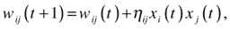

其中 t 代表训练时期，w ij 是第 I 个和第 j 个神经元之间连接的权重，x i 是第 I 个神经元的输出，η ij 是特定于相关突触的学习速率。

Hebbian 规则是一种无监督学习方案，它局部更新网络的权重；也就是说，每个突触的训练只取决于与之相连的神经元的权重。由于其简单的实现，Hebbian 规则被认为是第一个人工神经网络学习规则，由此衍生出多种变体。这个算法的第一次实现是在 1954 年，在麻省理工学院，使用计算机器(Farley 和 Clark，1954)。

20 世纪 50 年代还引入了感知器，这是一种用于模式识别的双层神经网络模型，使用加法和减法运算(Rosenblatt 1958)。该模型由四部分组成，如图 [7-1](#Fig1) 所示。视网膜或输入区域通过感觉单元接收刺激。这些连接被称为局部连接，因为它们的原点往往集中在某个点或某个区域。虽然投影区域中的单元与关联区域中的单元相同，但是投影区域通过局部连接接收输入，而关联区域的输入通过随机连接从投影区域出现；好像输入是从分散的区域产生的。A 单位接收一组可能是兴奋性或抑制性的传递脉冲。如果刺激超过了某个阈值，这些单元就会通过发射做出反应。关联区域和响应单元之间的随机连接是双向的。前馈连接将突触从关联区域传输到响应，而反馈连接将兴奋性突触传输到关联区域中产生连接的源点。抑制性突触补充了关联区中不向相关反应传递的源点。

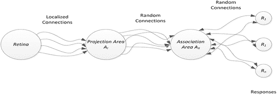

图 7-1。

A Rosenblatt perceptron structure

### 经典人工神经网络

人工神经网络的基本结构是如图 [7-2](#Fig2) 所示的人工神经元，其形状和功能与生物神经元相似(Haykin 1994)。

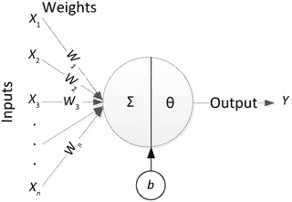

图 7-2。

An artificial neuron Note

在人体的神经系统中，神经元产生、传递和接收称为动作电位的电信号。典型的生物神经元有以下三个基本组成部分:

*   细胞体可以具有多种尺寸和形状
*   树突:从细胞体伸出的许多树状结构，构成神经元的接受部分(即输入部位)
*   轴突:一种细长的结构，具有相对较少的分支，将电信号传递到相连的区域

输入(X)通过模拟树突结构的加权连接连接到神经元，而求和、偏置(b)和激活函数(θ)扮演细胞体的角色，输出的传播类似于生物神经元中的轴突。

在数学上，神经元相当于以下函数:

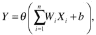

这可以使用矩阵形式方便地建模，

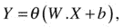

其中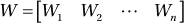，和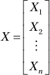。

激活函数形成神经元的输出或状态。可以使用多种激活功能，其中最常见的如下:

*   硬限制: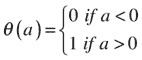
*   饱和线性函数: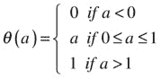
*   Log-sigmoid 函数: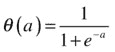
*   双曲正切 sigmoid 函数: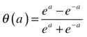

根据学习的需要，该偏差将激活功能向右或向左移动，并且在某些情况下可以省略。

神经网络是神经元级联层的简单组合，每个层都有自己的权重矩阵、偏置向量和输出向量。一层神经元是一列并行工作的神经元，如图 [7-3](#Fig3) 所示。该列的每个元素是单个神经元，该层的输出是向量输出，由神经元的单个输出形成。如果输入向量由 N 个输入和一层 M 个神经元组成，W ij 表示第 j 个输入到该层第 I 个神经元的连接的权重；Y i 和 b i 分别是第 j 个神经元的输出和与之相关的偏置。

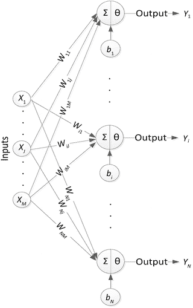

图 7-3。

A layer of neurons

可以使用矩阵符号方便地表示神经元层，如下所示:

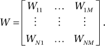

该矩阵的每个元素中的行索引代表相应连接的目的神经元，而列索引指的是连接的输入源。

用 Y 表示层的输出，你可以写

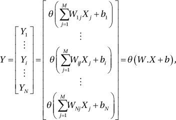

其中= 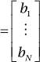。

为了帮助识别对应于特定矩阵的层，使用上标索引。因此，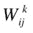表示第 k–1 层的第 j 个神经元和第 k 层的第 I 个神经元之间的连接的权重，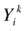是第 k 层的第 I 个神经元的输出。网络输出是最后一层(也叫输出层)的输出，其他层叫隐层。图 [7-4](#Fig4) 显示了一个具有两个隐藏层的网络。出于泛化的目的，你用 N k 指定第 k 层中隐藏神经元的数量。

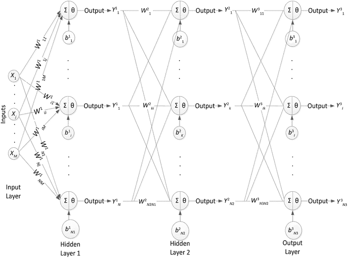

图 7-4。

A three-layer ANN

该网络实现的功能是

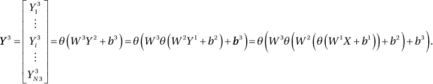

Note

为了简单起见，所有层都采用了相同的激活函数θ。然而，可以在网络的不同层中使用多个激活功能。此外，在整个网络中，每层神经元的数量可能不是恒定的。

实现最佳性能的最佳层数和神经元数是一个尚未明确回答的问题，因为该数目取决于应用。隐藏神经元层将输入空间划分为多个区域，这些区域的边界由与每个神经元相关联的超平面来定义。

隐藏神经元的数量越少，创建的子区域就越少，网络就越倾向于聚集点并将它们映射到相同的输出。每个神经元的输出是超平面的非线性变换。在分类的情况下，由来自前一层的加权输入形成的分离曲线与同一层中的其他神经元一起，有助于定义最终的分类边界。对于大量的神经元，由于过度训练，过度拟合的风险增加，并且广义性能降低。必须用足够的数据点训练网络，以确保在每个隐藏层获得的分区正确地分离数据。

### 人工神经网络训练和反向传播算法

为了使人工神经网络能够识别属于不同类别的模式，对现有数据集的训练寻求迭代地获得实现网络最高性能的一组权重和偏差(Jain，Mao 和 Mohiuddin 1996)。

在具有 M 个输入、N 个输出神经元和 L 个隐藏层的网络中，给定一组标记数据，即一组 P 对(X，T)，其中 X 是 M 维向量，T 是 N 维向量，学习问题简化为寻找最佳权重，从而优化成本函数。网络的输出应该匹配目标 TI并且最小化均方误差，

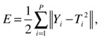

其中 Y i 是通过网络传播输入 X i 获得的输出。

人工神经网络也可以使用熵作为成本函数。训练需要至少几个时期来根据权重更新规则更新权重。应当注意，反向传播算法被广泛采用。它由以下步骤组成:

Initialization: This step initializes the weights of the network in a random, weak manner; that is, it assigns random values close to 0 to the connections’ weights.   Feedforward: The input X i is fed into the network and propagated to the output layer. The resultant error is computed.   Feedback: The weights and biases are updated with: 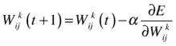 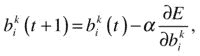 where α is a positive, tunable learning rate. The choice of α affects whether the backpropagation algorithm converges and how fast it converges. A large learning rate may cause the algorithm to oscillate, whereas a small learning rate may lead to a very slow convergence.  

因为权重的更新需要计算误差的梯度(成本函数)，所以它必须是可微分的。不满足此条件会阻止使用反向传播算法。

使用链式法则可以简化反向传播算法中梯度的计算，链式法则要求以下步骤:

For each output unit 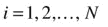 (in output layer L of Figure [7-4](#Fig4)), the backpropagated error is computed, using 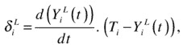 where, T  i  is the desired output; and, for the sigmoidal function, 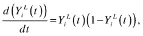 resulting in the following expression: 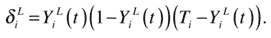   For each hidden unit 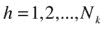 (in a hidden layer k with N  k  hidden units), and moving from layer L–1, backward to the first layer, the backpropagated error can be computed as shown: 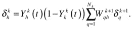   The weights and biases are updated according to the following gradient descent:  

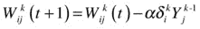

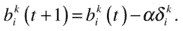

通过这种梯度下降方法，网络误差最终被减小。例如，考虑到一维训练点属于类 1 (+1)并且被错误地分类为类 2(–1)，超平面应该从类 1 移开。因为，如果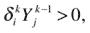，超平面将向左移动(T0 减少)，如果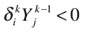，超平面将向右移动(T2 增加)。

## DBN 概述

DBNs 是自引入快速贪婪训练算法(Hinton、Osindero 和 Teh 2006)以来在文献中广泛出现的深度架构，是分层分组的随机神经元网络，没有层内神经元连接。网络的前两层包含无向连接的神经元，它们形成了一个联想记忆，类似于生物神经元，而剩余的隐藏层形成了一个有向无环图，如图 [7-5](#Fig5) 所示。

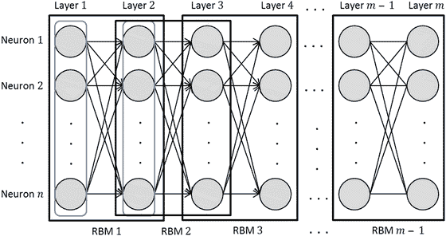

图 7-5。

DBN architecture

虽然 DBN 可以被视为具有更多隐藏层的 ANN，但是使用反向传播来训练 DBN 并不能产生良好的机器学习模型，因为解释远离现象使得在深度模型中进行推理更加困难。训练网络时，简化的假设是各层是独立的。解释掉(也叫伯克森悖论或选择偏差)，使这个假设无效；隐藏节点变得反相关。例如，如果一个输出节点可以被两个同样罕见且独立的事件激活，同时发生的可能性甚至更小(因为两个独立事件同时发生的概率是两个概率的乘积)，那么一个事件的发生否定(“解释掉”)另一个事件的发生，从而在两个事件之间获得负相关。由于训练深度架构的困难，DBNs 失去了流行性，直到 Hinton 和 Salakhutdinov (2006)提出了一种贪婪的训练算法来有效地训练它们。该算法将 dbn 分解为顺序堆叠的 RBM，这是一个两层网络，被约束为仅包含层间神经元连接，即不属于同一层的神经元之间的连接。

如图 [7-6](#Fig6) 所示，第一层神经元之间不允许连接，第二层也是一样；连接只需要将第 1 层的神经元连接到第 2 层的神经元。在 DBN 中，前两层被允许具有双向连接，而其余层仅具有定向连接。因此，随着对深层架构的训练变得可行且快速，人们对其重新产生了兴趣，包括在调整权重之前独立训练 RBM 单元，使用上下算法来避免欠拟合(Hinton、Osindero 和 Teh 2006)。

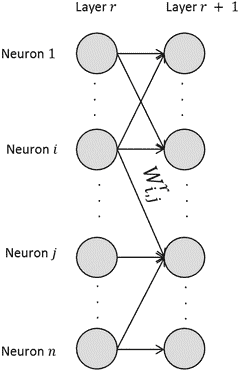

图 7-6。

Weight labeling

以下是这里采用的 DBN 命名法列表:

<colgroup><col></colgroup> 
| DNN 材料表 |
| --- |
| 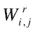:连接 r 层神经元 I 和 j 层神经元 j 的边的权重；当网络中只有两层时，r 被抑制 |
| 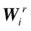:离开层 r 中神经元 I 的所有连接的权重向量 |
| W r :连接层 r 到层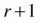的权重向量 |
| μ:学习率 |
| k:在对比发散中执行的吉布斯采样步骤的数量 |
| n:隐含层神经元的总数 |
| m:输入层神经元的总数 |
| 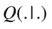:条件概率分布 |
| h r :层 r 的二进制配置 |
| p(h r ):当前权重值下 h r 的先验概率 |
| v 0 :输入层数据点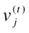:采样步骤 t 时输入层神经元 j 的二进制配置 |
| H i :采样步骤 t 时隐层神经元 I 的二进制配置变量 |
| 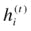:采样步骤 t 时隐层神经元 I 的二进制配置值 |
| b j :输入层中神经元 j 的偏置项 |
| c i :隐含层中神经元 I 的偏置项 |

## 受限玻尔兹曼机器

玻尔兹曼机器(BMs)是由以层间和层内方式连接的神经元组成的双层神经网络架构。由 Smolensky (1986)首先以 Harmonium 的名字引入的受限玻尔兹曼机器(RBM)被约束形成二部图。二分图是两层图，其中两层的节点形成两个不相交的神经元集合。这是通过限制层内连接来实现的，使得不允许同一层中的节点之间的连接。这种限制是 BMs 与 RBM 的区别，也使 RBM 更容易训练。不同层的神经元之间具有无向连接的 RBM 形成了自动联想记忆，类似于人脑中的神经元。自动联想记忆的特点是反馈连接，允许神经元之间双向交换信息(Hawkins 2007)。

成果管理制可以在有人监督和无人监督的情况下进行培训。使用 Hinton 的对比散度(CD)算法(Hinton 2002)更新权重向量。CD 是一种近似对数似然梯度的算法，比马尔可夫链蒙特卡罗(MCMC)算法需要更少的采样步骤(Hinton 2002)。CD 执行 k 步吉布斯采样和梯度下降，以找到最大化目标函数的权重向量(Hinton 2010)，该权重向量是概率的乘积。随着 k 的增加，学习模型的性能提高，但是代价是更长的训练时间。该参数的典型值为 k = 1 (Hinton 2010)。训练算法的工作流程如表 [7-1](#Tab1) 所示。

表 7-1。

RBM Training Algorithm Workflow, Using CD (Fischer and Igel, 2012)

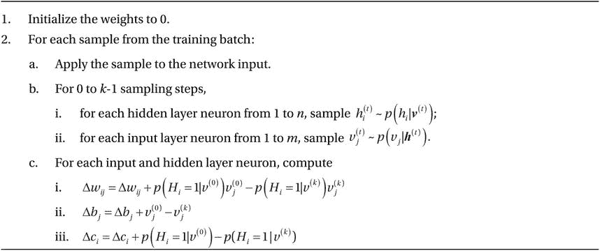

基于吉布斯分布，用于描述联合概率分布的能量函数或损失函数在等式 7-1 中表示，其中 w ij ，b j ，c i 是实值权重，h i 和 v j 可以取集合中的值(Aleksandrovsky et al. 1996):

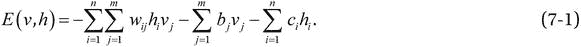

因此，使用等式 7-2 计算联合概率分布:

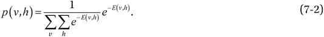

## DNN 训练算法

反向传播是用来训练人工神经网络的最流行的算法之一(Werbos 1974)。等式 7-3 显示了用于反向传播的权重更新规则的简单公式:

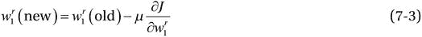

然而，随着网络深度的增加，反向传播的性能下降也增加，使得它不适合训练一般的深度架构。这是由于消失梯度问题(Horchreiter 1991Horchreiter 等人，2001 年；辛顿 2007；Bengio 2009)，这是一个训练问题，其中在网络中传播回来的误差随着它从一层移动到另一层而缩小，在深层架构中变得可以忽略不计，并且使得早期层中的权重几乎不可能更新。因此，从 DNN 中训练并获得有意义的结果太慢了。

由于反向传播的缺点，人们进行了许多尝试来开发一种用于深层网络的快速训练算法。Schmidhuber 的算法(Schmidhuber 1992 年)通过在每一层上使用无监督的预训练，然后通过反向传播微调结果权重，来训练多层递归神经网络。

2006 年，当 Hinton 和 Salakhutdinov (2006)为 DBNs 提出了一种贪婪的逐层训练算法时，对 DNNs 的兴趣重新燃起，该算法试图依次学习更简单的模型，然后对整个模型的结果进行微调。该算法利用互补先验消除解释消失效应，包括两个主要步骤:

A greedy layer-wise training to learn the weights by Tying the weights of the unlearned layers.   Applying CD to learn the weights of the current layer.     An up-down algorithm for fine-tuning the weights  

这种训练方案不是一次学习跨越许多隐藏层的数百万个连接的权重，而是一次找到单个层的最优解，这使它成为一种贪婪的算法。这是通过绑定后续层的所有权重并仅学习当前层的权重来实现的。捆绑权重也有助于消除解释远离现象，这种现象在采用其他训练算法时会导致训练不良的深度网络。如图 [7-7](#Fig7) 所示，学习层 1 和层 2 之间的权重 W 0 。下面所有层之间的权重被绑定到 W 0 。一旦 CD 学习收敛，层 2 和层 3 之间的权重 W 1 通过将所有后续层的权重绑定到 W 1 并将前一阶段学习的层 1 和层 2 之间的权重固定为 W 0 来学习。类似地，当 CD 收敛到 W 1 的最优值时，第三 RBM 块的权重从第二 RBM 块解绑，并且 CD 用于学习最终的一组权重 W 2。

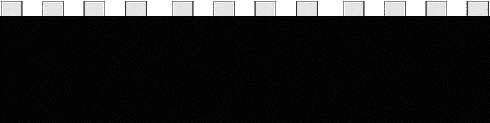

图 7-7。

Sequential training

重复这个捆绑、学习和解开权重的过程，直到处理完所有层。捆绑权重的 dbn 类似于 RBM。因此，如前所述，每个 RBM 都是使用 CD 学习来学习的。但是，只有在前两层形成无向图，其余隐藏层形成有向无环图的情况下，才能应用这种算法。

使用方程 7-4 计算定向模型的能量，该能量由方程 7-5 限定。捆绑重量产生等式 7-5 中的等式，并使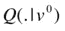和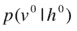恒定。方程 7-5 的导数被简化并等于方程 7-6。因此，捆绑权重导致了更简单的目标函数来最大化。递归地应用这个规则允许训练一个 DBN (Hinton，Osindero 和 Teh 2006)。

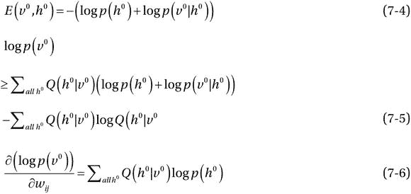

一旦学习了每一层的权重，使用具有 CD 权重更新规则的唤醒-睡眠算法的变体来微调学习的参数。up-down 算法用于对获得的解决方案进行反拟合，以避免欠拟合，这是在无监督和贪婪的方式下进行训练时的一个重要问题。up-down 算法使较低级别的层受到较高级别的层的影响，较低级别的层的权重是在训练早期学习的，而较高级别的层的权重是在训练接近结束时学习的。在自下而上的过程中，通过计算正相位概率、对状态进行采样、使用 CD 权重更新规则以及对有限次数的迭代运行 Gibbs 采样，来调整有向连接上的生成权重。自上而下的传递将使用自上而下的连接随机激活每个较低层。这是通过计算负相位概率、采样状态和计算网络预测来完成的。对生成和推理参数以及顶层权重的适当调整是以唤醒-睡眠算法的对比形式来执行的，因为它解决了算法的睡眠阶段中的问题。该算法的工作流程如表 [7-2](#Tab2) 所示。

表 7-2。

Up–Down Algorithm Workflow (Hinton and Salakhutdinov 2006)

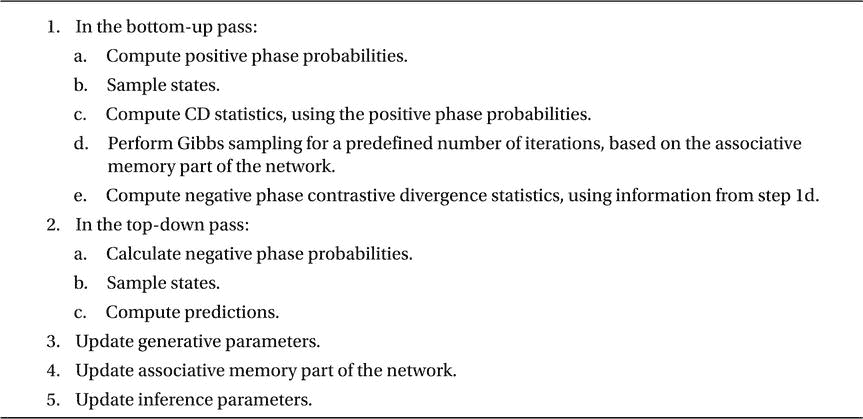

尽管在应用于 DNNs 时有其局限性，但由于图形处理单元(GPU)计算能力的激增，对反向传播算法的兴趣重新燃起。Ciresan 等人(2010 年)研究了反向传播算法在深度网络上的性能。据观察，即使有消失梯度问题，给定足够的时期，反向传播可以获得与其他更复杂的训练算法相当的结果。

值得注意的是，具有深度架构的监督学习已经被报道在许多分类任务上表现良好。然而，当网络以无人监督的方式进行预训练时，它几乎总是比没有预训练阶段而省略预训练的情况表现得更好(Erhan 等人，2010 年)。已经提出了几种理论来解释这种现象，例如，预训练阶段起到了正则化作用(Bengio 2009Erhan 等人，2009 年)和一个用于监督优化问题的 aid (Bengio 等人，2007 年)。

## DNN 相关研究

自从 Hinton 的快速、贪婪的训练算法引入以来，DBN 在各种机器学习应用中的使用蓬勃发展。此外，为加快 DBN 进程和解决其弱点，已经做了许多尝试。以下部分提供了 DBN 的最新和相关应用的简要调查，旨在加速训练的研究演示，以及几个 DBN 变体和 DNN 架构的讨论。

### DNN 应用

DNN 已被应用于许多机器学习应用，包括特征提取、特征约简和分类问题等。

特征提取包括将原始输入数据转换成代表输入的特征向量；原始数据可以是音频、图像或文本。例如，DBN 已被应用于音乐音频的离散傅立叶变换(DFT)表示(Hamel 和 Eck 2010)，并被发现优于 mel 频率倒谱系数(MFCCs)，这是一种广泛使用的音乐音频特征提取方法。

一旦从原始数据中提取特征，可能必须减少高维数据表示，以减轻分类任务的存储器和计算要求，以及实现数据的更好可视化，并减少存储数据以供将来使用所需的存储器。辛顿和萨拉赫丁诺夫(辛顿和萨拉赫丁诺夫 2006；Salakhutdinov 和 Hinton 2007)使用一堆 RBM 来预训练网络，然后使用自动编码器网络来学习低维特征。

在一些不断增长的数据库上进行的测试表明，使用 DBN 提取表达性和低维特征对于快速检索文档和图像是可能的。Ranzato 和 Szummer (2008)能够产生文档的紧凑表示，以加速搜索引擎，同时胜过浅层机器学习算法。应用于大型数据库的图像检索，DBN 产生了可与最先进的算法相媲美的结果，包括潜在的狄利克雷分配和概率潜在语义分析(赫斯特和林哈特 2008)。

将学习的模型从一个领域转移到另一个领域一直是机器学习算法的一个问题。然而，DNN 能够提取与领域无关的特征(Bengio 和 Delalleau 2011)，使得迁移学习在许多应用中成为可能(Collobert 和 Weston 2008Glorot、Bordes 和 Bengio 2011 本吉奥 2012；Ciresan、Meier 和 Schmidhuber 2012 年；Mesnil 等人，2012 年)。dnn 也被用于课程学习，其中数据是按照特定的顺序学习的(Bengio 等人，2009 年)。

DBN 已被应用于许多领域的分类任务，如视觉、语音、医疗疾病和自然语言处理(NLP)。从图像中识别物体已经得到广泛解决，DBN 的性能超过了最先进的算法(Desjardins 和 Bengio 2008Uetz 和 Behnke 2009Ciresan 等人，2010 年；Ciresan、Meier 和 Schmidhuber 2012 年)。例如，Ciresan 等人(2010 年)在美国国家标准与技术研究院(MNIST)的混合数据库上取得了 0.35%的错误率。奈尔和辛顿(2009)在三维物体识别方面优于浅层架构，包括 SVM，在纽约大学物体识别基准(NORB)数据集上实现了 6.5%的错误率，而 SVM 为 11.6%。考虑到语音识别任务，深度架构改善了声学建模(Mohamed et al . 2011Hinton et al. 2012)、语音转文本转录(Seide、Li 和 Yu 2011)和大词汇量语音识别(Dahl et al . 2012Jaitly 等人，2012 年；Sainath 等人，2011 年)。在电话识别任务中，在 TIMIT 数据库上实现了 23%的错误率，优于使用其他机器学习算法的 24.4%至 36%的报告错误率(Mohamed，Yu，和 Deng 2010)。

DBN 在癫痫预测中使用脑电图(EEG)信号产生了与其他机器学习算法相当的分类结果，但达到这些结果的时间明显更快-快 1.7 至 103.7 倍(Wulsin 等人，2011 年)。McAfee (2008)采用 DBN 进行文档分类，并展示了在此类数据库上取得成功的前景。

从人类情感的高级描述中生成合成图像——特别是面部表情——是 DBN 成功应用的另一个领域，产生了各种逼真的面部表情(Susskind et al. 2008)。

一般来说，NLP 也已经通过深度架构进行了研究，以改善最先进的结果。这些应用包括机器音译(Deselaers 等人，2009 年)、情感分析(周、陈和王，2010 年；Glorot、Bordes 和 Bengio 2011)，以及语言建模(Collobert 和 Weston 2008Weston et al . 2012)——包括词性标注、相似词识别和组块。这些问题的复杂性需要更深入的机器学习算法(Bengio 和 Delalleau 2011)才能产生有意义的结果。例如，机器音译对机器学习算法提出了挑战，因为单词没有统一的映射，这导致了字典中不存在的多对多映射。此外，大量的源-目标语言对字符符号和不同的声音结构导致发音缺失，这只是音译的几个属性，使得机器很难做好。

### 加速 dnn 训练的并行实现

随着层和网络规模的增加，依次逐层训练 DBN 变得更加耗时。堆叠这些层以形成网络，称为深度堆叠网络，并在 CPU 集群上训练网络，而不是在一台超级计算机上(邓、哈钦森和于，2012 年)，利用贪婪训练算法中固有的并行性来实现显著的训练时间节省。

但是，这种方法并不能加快每层的训练时间。这可以通过使用 GPU 对各个 RBM 层的训练算法进行并行化来实现(蔡等人，2012)。

然而，使用通常用于训练 RBM 的大而稀疏的数据为并行化该算法带来了挑战。修改基于矩阵的运算的计算并优化稀疏矩阵的矩阵-矩阵乘法代码，使 GPU 实现比 CPU 实现快得多。

与通过软件加速训练相反，已经尝试使用现场可编程门阵列(FPGAs)通过硬件加速训练。Ly 和 Chow (2010)将 RBM 映射到 FPGAs，并实现了优化软件代码的显著加速。Lo (2010)扩展了这项工作，以研究该方法的可扩展性。

### 类似 DBN 的深层网络

DBN 的一种变体，称为模块化 DBN (M-DBN)，分别训练网络的不同部分，同时随着训练的进行调整学习率(Pape et al. 2011)，而不是对整个网络使用一个训练集。这使得 M-DBN 能够避免忘记在训练早期学习的特征，这是 DBN 的一个弱点，可能会妨碍其在在线学习应用中的性能，在在线学习应用中，数据分布随时间动态变化。

稀疏 DBN 通过在目标函数中添加对偏离 RBM 公式中隐藏单元的预期激活的惩罚来学习稀疏特征，这与辛顿的 DBN 学习非稀疏数据表示不同(Lee，Ekanadham 和 ng，2007)。

卷积 DBN 通过在图像中的位置之间共享权重，将平移不变性集成到图像表示中，允许在使用卷积放大图像时进行推断(Lee 等人，2009)。因此，卷积 DBN 可以更好地缩放到真实世界大小的图像，而不会因为这些图像的高维数而遭受计算困难。

dbn 不是唯一可用的深层架构。和积网络(SPN)是一种深层架构，表示为具有有向和加权边的图。SPN 是非循环的(不包含循环)，变量在图的叶子上，其内部节点由和与积运算组成(Poon 和 Domingo 2011)。SPN 使用反向传播和期望最大化(EM)算法进行训练。这些简单的操作产生了一个比 DBN 更精确、训练更快、更易驾驭的网络。

深度玻尔兹曼机器(DBMs)类似于 DBNs，但具有比 DBNs 更通用的深度架构。它们由相互堆叠的 BMs 组成(Salakhutdinov 和 Hinton 2009)。虽然比 DBNs 更复杂且训练更慢，但由于 BM 网络中所有神经元之间的对称连接，双向边使 DBMs 比 DBNs 更好地传播输入不确定性，使其生成模型更健壮。更复杂的体系结构需要有效的训练算法来使训练可行。通过使用近似推理算法，对 DBN 贪婪训练算法进行了修改，以实现更有效的 DBM 训练算法。然而，这使得 DBM 的训练速度比 DBN 慢了大约三倍(Salakhutdinov 和 Larochelle，2010 年)。

## 参考

亚历山大洛夫斯基、鲍里斯、詹姆斯·惠特森、格雷琴·安德斯、加里·林奇和理查德·格兰杰。"基于听觉皮层回路分析的新型语音处理机制."《第四届国际口语会议论文集》,由 h .蒂莫西·邦内尔和威廉·伊德萨迪编辑，558-561 页。新泽西州皮斯卡塔韦:电气和电子工程师协会，1996 年。

阿诺德、卢多维奇、塞巴斯蒂安·雷贝奇、西尔万·谢瓦利埃和埃莱娜·保加姆·莫伊西。《深度学习入门》《第 19 届欧洲人工神经网络、计算智能和机器学习研讨会论文集》,比利时布鲁日，2011 年 4 月 27-29 日，Michel Verleysen 编辑，477-488。比利时鲁汶:Ciaco，2011 年。

本吉奥，约舒厄。“学习人工智能的深度架构。”《机器学习的基础和趋势》2，第 1 期(2009):1–127 页。

本吉奥，约舒厄。"无监督和转移学习的深度学习表示法."在 ICML 2011 年:国际机器学习会议记录无监督和迁移学习研讨会，由 Isabelle Guyon，Gideon Dror，Vincent Lemaire，格拉汉姆·泰勒和 Daniel Silver 编辑，17–36。2012. [`http://jmlr.csail.mit.edu/proceedings/papers/v27/bengio12a/bengio12a.pdf`](http://jmlr.csail.mit.edu/proceedings/papers/v27/bengio12a/bengio12a.pdf) 。

本吉奥，约舒厄和奥利维耶·德拉鲁。"论深层建筑的表现力."《算法学习理论》, Jyrki Kivinen、Csaba Szepesvári、Esko Ukkonen 和 Thomas Zeugmann 编辑，18–36 页。柏林:施普林格，2011 年。

本吉奥、约舒厄、帕斯卡尔·兰布林、丹·波博维奇和雨果·拉罗歇尔。"深度网络的贪婪分层训练."在 NIPS '06:神经信息处理系统进展会议录 19，由 Bernhard Schlkopf，John Platt 和 Thomas Hofmann 编辑，153-160。麻省剑桥:麻省理工学院出版社，2007 年。

本吉奥、约舒阿、杰罗姆·罗拉杜尔、罗南·科洛伯特和杰森·韦斯顿。“课程学习。”《2009 年 ICML:第 26 届机器学习国际年会论文集》,莱昂·博图和迈克尔·利特曼编辑，41–48 页。纽约:美国计算机学会，2009 年。

布朗、托马斯·h、爱德华·w·凯里斯和克劳德·l·基南。"希伯来突触:生物物理机制和算法."神经科学年度评论 13，第 1 号(1990):475–511。

蔡、、、徐、、、、林晓拉。"用于协同过滤的 GPU 加速的受限玻尔兹曼机."《并行处理的算法和架构:第 12 届国际 ICA3PP 会议论文集》,日本福冈，2012 年 9 月，杨翔、Ivan Stojmenovic、Bernady O. Apduhan、王国军、中野浩二和 Albert Zomaya 编辑，303–316。柏林:施普林格，2012 年。

Ciresan、Dan Claudiu、Ueli Meier、Luca Maria Gambardella 和 Jürgen Schmidhuber。"用于手写数字识别的深、大、简单的神经网络."神经计算 22，第 12 期(2010):3207–3220。

Ciresan、Dan Claudiu、Ueli Meier 和 Jürgen Schmidhuber。"用深度神经网络进行拉丁和汉字的迁移学习."2012 年国际神经网络联合会议论文集，1–6。新泽西州皮斯卡塔韦:电气和电子工程师协会，2012 年。

罗伯特·科洛波特。"深度学习用于有效的区别分析."录制于 2011 年 4 月。AISTATS 视频，21:16。发布于 2011 年 5 月 6 日。 [`http://videolectures.net/aistats2011_collobert_deep/`](http://videolectures.net/aistats2011_collobert_deep/) 。

科洛波特、罗南和杰森·韦斯顿。"自然语言处理的统一架构:具有多任务学习的深度神经网络."2008 年 ICML:第 25 届机器学习国际会议论文集，Andrew McCallum 和 Sam Roweis 编辑，160–167 页。纽约:美国计算机学会，2008 年。

达尔、乔治·e、董郁、邓梨和亚历克斯·阿塞罗。"用于大词汇量语音识别的上下文相关预训练深度神经网络."IEEE 音频、语音和语言处理汇刊 20，第 1 期(2012):30–42。

邓、李、布莱恩·哈钦森和董郁。"深层堆叠网络的并行训练."Interspeech 2012:国际言语交流协会第 13 届年会会议录。2012. [`www.isca-speech.org/archive/interspeech_2012`](http://www.isca-speech.org/archive/interspeech_2012) 。

德斯莱尔斯、托马斯、萨莎·哈桑、奥利弗·本德和赫尔曼·内伊。“机器音译的深度学习方法。”统计机器翻译第四届研讨会论文集，e233–241。宾夕法尼亚州斯特劳斯堡:计算语言学协会，2009 年。

德贾尔丁，纪尧姆，约舒阿·本吉奥。"视觉卷积 RBM 的经验评估."蒙特利尔大学技术报告，2008 年。

埃尔汉、杜米特鲁、约舒阿·本吉奥、亚伦·库维尔、皮埃尔-安托万·曼扎戈尔、帕斯卡尔·文森特和萨米·本吉奥。“为什么无监督的预训练有助于深度学习？”机器学习研究杂志 11(2010):625–660。

Erhan、Dumitru、Pierre-Antoine Manzagol、Yoshua Bengio、Samy Bengio 和 Pascal Vincent。"训练深层架构的难度和无监督预训练的效果."《第 12 届人工智能和统计国际会议论文集》,大卫·范·戴克和马克斯·韦林编辑，第 153-160 页。2009. [`http://machinelearning.wustl.edu/mlpapers/paper_files/AISTATS09_ErhanMBBV.pdf`](http://machinelearning.wustl.edu/mlpapers/paper_files/AISTATS09_ErhanMBBV.pdf) 。

法利 B. G .和 w .克拉克。"用数字计算机模拟自组织系统."信息理论专业组 IEEE 汇刊 4，第 4 期(1954):76–84。

菲舍尔、阿斯嘉和克里斯蒂安·伊格尔。"受限玻尔兹曼机器导论."《模式识别、图像分析、计算机视觉和应用进展:第 17 届伊比利亚美洲大会会议录》, CIARP 2012，阿根廷布宜诺斯艾利斯，2012 年 9 月 3-6 日，编辑:Luis Alvarez、Marta E. Mejail、Luis E. Gomez 和 Julio E. Jacobo，14-36。柏林:施普林格，2012 年。

福岛，国彦。"新认知:不受位置变化影响的模式识别机制的自组织神经网络模型."生物控制论 36(1980):193–202。

格洛特，泽维尔，安托万·博德斯，约舒阿·本吉奥。"大规模情感分类的领域适应:一种深度学习方法."在 ICML 2011 年:第 28 届机器学习国际会议论文集，513–520。2011. [`www.icml-2011.org/papers/342_icmlpaper.pdf`](http://www.icml-2011.org/papers/342_icmlpaper.pdf) 。

哈默尔、菲利普和道格拉斯·埃克。"用深度信念网络从音乐音频中学习特征."ISMIR 2010:第 11 届国际音乐信息检索学会会议记录(ISMIR 2010)，2010 年 8 月 9-13 日，荷兰乌得勒支，J. Stephen Downie 和 Rembo C. Veltkamp 编辑，339-344。国际音乐信息检索学会，2010。 [`http://ismir2010.ismir.net/proceedings/ISMIR2010_complete_proceedings.pdf`](http://ismir2010.ismir.net/proceedings/ISMIR2010_complete_proceedings.pdf) 。

霍金斯、杰夫和桑德拉·布莱克斯利。论智力。纽约:麦克米兰出版社，2007 年。

海金，西蒙。神经网络。新泽西州上马鞍河:普伦蒂斯霍尔，1994 年。

赫布唐纳德。行为的组织。纽约:威利，1949 年。

通过最小化对比差异来训练专家的产品。神经计算 14，第 8 期(2002):1771–1800。

要识别形状，首先要学会生成图像。大脑研究进展 165(2007):535–547。

杰弗里·辛顿.."训练受限玻尔兹曼机器的实用指南."势头 9，第 1 号(2010 年)。

辛顿、杰佛里·e .、邓梨、董宇、乔治·e·达尔、阿卜杜勒·拉赫曼·穆罕默德、纳夫迪普·贾伊特利、老安德鲁等人，《用于语音识别声学建模的深度神经网络:四个研究小组的共同观点》IEEE 信号处理杂志 29，第 6 期(2012):82–97。

辛顿、杰弗里·e、西蒙·奥辛德罗和叶惠德。"深度信念网的快速学习算法."神经计算 18，第 7 期(2006):1527–1554。

放大图片作者:Geoffrey E ."用神经网络降低数据的维数."科学 313，第 5786 号(2006):504–507。

高纯度 Sepp。”动态神经网络研究。“慕尼黑技术大学硕士论文，1991 年。

霍克雷特、塞普、约舒阿·本吉奥、保罗·弗拉斯科尼、于尔根·施密德胡贝尔。"循环网络中的梯度流:学习长期依赖的困难."《动态递归神经网络的现场指南》, John F. Kolen 和 Stefan C. Kremer 编辑，237–244 页。新泽西州皮斯卡塔韦:电气和电子工程师协会，2001 年。

赫斯特、伊娃和雷纳·林哈特。"大规模数据库图像检索的深度网络."第 16 届 ACM 多媒体国际会议论文集，643–646。纽约:美国计算机学会，2008 年。

Jain，Anil K .，Mao Jianchang 和 K. M. Mohiuddin。"人工神经网络:教程."计算机 29，第 3 号(1996):31–44。

Jaitly、Navdeep、Patrick Nguyen、Andrew W. Senior 和 Vincent Vanhoucke。"预训练深度神经网络在大词汇量语音识别中的应用."Interspeech 2012:国际言语交流协会第 13 届年会会议录。2012. [`www.isca-speech.org/archive/interspeech_2012/`](http://www.isca-speech.org/archive/interspeech_2012/) 。

李，洪拉克，柴坦尼亚·埃卡纳达姆和安德鲁·杨。"可视区域 V2 的稀疏深度信念网模型."2007 年 NIPS 会议录:神经信息处理系统的进展。2008. [`http://papers.nips.cc/paper/3313-sparse-deep-belief-net-model-for-visual-area-v2.pdf`](http://papers.nips.cc/paper/3313-sparse-deep-belief-net-model-for-visual-area-v2.pdf) 。

李、洪拉克、罗杰·格罗斯、拉杰什·兰加纳特和安德鲁·吴。"用于分级表示的可扩展无监督学习的卷积深度信念网络."《ICML 09:第 26 届机器学习国际年会会议录》，莱昂·博图和迈克尔·利特曼编辑，609–616 页。纽约:美国计算机学会，2009 年。

瞧，查尔斯。"大型受限玻尔兹曼机的 FPGA 实现."第 18 届 IEEE 现场可编程定制计算机器年度国际研讨会(FCCM)论文集，2010 年 5 月 2-4 日，北卡罗来纳州夏洛特，201-208。新泽西州皮斯卡塔韦:电气和电子工程师协会，2010 年。

李，丹尼尔 l。和保罗周。"用于受限玻尔兹曼机器的高性能可重构硬件体系结构."IEEE 神经网络汇刊 21，第 1 期(2010):1780–1792。

麦卡菲，劳伦斯。“使用深度信念网络进行文档分类”，2008 年。

Mesnil、Grégoire、Yann Dauphin、Xavier Glorot、Salah Rifai、Yoshua Bengio、Ian J. Goodfellow、Erick Lavoie 等人，《无监督和迁移学习的挑战:深度学习方法》在 ICML 2011 年:机器学习无监督和迁移学习研讨会国际会议记录，由 Isabelle Guyon，Gideon Dror，Vincent Lemaire，格拉汉姆·泰勒和 Daniel Silver 编辑，97–110。2012. [`http://jmlr.csail.mit.edu/proceedings/papers/v27/mesnil12a/mesnil12a.pdf`](http://jmlr.csail.mit.edu/proceedings/papers/v27/mesnil12a/mesnil12a.pdf) 。

Mohamed，Abdel-rahman，Tara N. Sainath，George Dahl，Bhuvana Ramabhadran，Geoffrey E. Hinton 和 Michael A. Picheny。"深度信念网络使用区别特征进行电话识别."2011 年 IEEE 声学、语音和信号处理国际会议论文集，5060–5063。新泽西州皮斯卡塔韦:电气和电子工程师协会，2011 年。

穆罕默德，阿卜杜勒拉赫曼，董郁，和邓梨。"用于语音识别的深度信念网络的全序列训练研究."Interspeech 2010:国际言语交流协会第 11 届年会会议录，由 Takao Kobayashi，Keikichi Hirose 和 Satoshi Nakamura 编辑，2846–2849。2010. [`www.isca-speech.org/archive/interspeech_2010/i10_2846.html`](http://www.isca-speech.org/archive/interspeech_2010/i10_2846.html) 。

奈尔、维诺德和杰弗里·e·辛顿。"深度信念网络的三维物体识别."在 NIPS '09:神经信息处理系统进展会议录 22，编辑 Yoshua Bengio，Dale Schuurmans，John Lafferty，克里斯·威廉姆斯和 Aron Culotta，1339-1347。2009. [`http://machinelearning.wustl.edu/mlpapers/paper_files/NIPS2009_0807.pdf`](http://machinelearning.wustl.edu/mlpapers/paper_files/NIPS2009_0807.pdf) 。

Pape、Leo、Faustino Gomez、Mark Ring 和 Jürgen Schmidhuber。"不会忘记的模块化深度信念网络."2011 年国际神经网络联合会议论文集，1191–1198。新泽西州皮斯卡塔韦:电气和电子工程师协会，2011 年。

潘和丰还有佩德罗.多明戈斯。"和积网络:一种新的深层架构."2011 年 IEEE 国际计算机视觉研讨会论文集，689–690。新泽西州皮斯卡塔韦:电气和电子工程师协会，2011 年。

兰扎托、马克·奥雷里奥和马丁·苏默。"具有深度网络的紧凑文档表示的半监督学习."2008 年 ICML:第 25 届机器学习国际会议论文集，Andrew McCallum 和 Sam Roweis 编辑，792–799。纽约:美国计算机学会，2008 年。

罗森布拉特，弗兰克。"感知器:大脑中信息存储和组织的概率模型."《心理评论》65，第 6 期(1958):386–408。

Sainath，Tara N .，Brian Kingsbury，Bhuvana Ramabhadran，Petr Fousek，Petr Novak 和 Abdel-rahman Mohamed。"使深度信念网络对大词汇量连续语音识别有效."《2011 年 IEEE 自动语音识别和理解研讨会论文集》,托马斯·海恩和余凯编辑，第 30-35 页。新泽西州皮斯卡塔韦:电气和电子工程师协会，2011 年。

萨拉赫丁诺夫，鲁斯兰和杰弗里辛顿。"通过保持类邻域结构学习非线性嵌入."《第 11 届人工智能与统计国际会议论文集》，Marina Meila 和沈晓彤编辑，412–419 页。2007. [`http://jmlr.csail.mit.edu/proceedings/papers/v2/salakhutdinov07a/salakhutdinov07a.pdf`](http://jmlr.csail.mit.edu/proceedings/papers/v2/salakhutdinov07a/salakhutdinov07a.pdf) 。

萨拉赫丁诺夫，鲁斯兰和杰弗里辛顿。"深层玻尔兹曼机器"《第 12 届人工智能和统计国际会议论文集》,大卫·范·戴克和马克斯·韦林编辑，448–455 页。2009. [`www.jmlr.org/proceedings/papers/v5/salakhutdinov09a/salakhutdinov09a.pdf`](http://www.jmlr.org/proceedings/papers/v5/salakhutdinov09a/salakhutdinov09a.pdf) 。

萨拉赫丁诺夫，鲁斯兰和雨果·拉罗歇尔。“深度玻尔兹曼机器的高效学习。”《第 13 届人工智能和统计国际年会论文集》，Yee Whye Teh 和 Mike Titterington 编辑，693–700 页。2010. [`www.dmi.usherb.ca/∼larocheh/publications/aistats_2010_dbm_recnet.pdf`](http://www.dmi.usherb.ca/%E2%88%BClarocheh/publications/aistats_2010_dbm_recnet.pdf) 。

尤尔根·施密德胡伯。"利用历史压缩原理学习复杂的扩展序列."神经计算 4(1992):234–242。

塞德、弗兰克、李刚和董郁。"使用上下文相关深度神经网络的会话语音转录."Interspeech 2011:国际言语交流协会第 11 届年会会议录，由 Piero Cosi、Renato De Mori、Giuseppe Di Fabbrizio 和 Roberto Pieraccini 编辑，437–440。2011. [`www.isca-speech.org/archive/interspeech_2011`](http://www.isca-speech.org/archive/interspeech_2011) 。

保罗·斯摩棱斯基。"动力系统中的信息处理:和谐理论的基础."并行分布式处理:认知微观结构的探索。第 1 卷，由大卫·e·鲁梅尔哈特、詹姆斯·l·麦克莱兰和 PDP 研究小组编辑，194–281。麻省剑桥:麻省理工学院出版社，1986 年。

Susskind，Joshua M .，Geoffrey E. Hinton，Javier R. Movellan 和 Adam K. Anderson。"用深度信念网络生成面部表情."《情感计算:专注于情感表达、合成和识别》, Jimmy Or 编辑，421–440 页。维也纳:I-Tech，2008。

埃茨、拉斐尔和斯文·本克。"用于图形处理器加速的物体识别的局部连接分层神经网络."NIPS 2009 年大规模机器学习并行性和大规模数据集研讨会论文集。2009.

沃博斯，保罗。"超越回归:行为科学中预测和分析的新工具."哈佛大学博士论文，1974 年。

韦斯顿、杰森、弗雷德里克·拉特勒、侯赛因·莫巴伊和罗南·科洛波特。"通过半监督嵌入的深度学习."《神经网络:交易的诀窍》,第二版，由格雷戈瓦·蒙塔冯、热纳维耶芙·奥尔和克劳斯-罗伯特·米勒编辑，639–655 页。柏林:施普林格，2012 年。

Wulsin，D. F .，J. R. Gupta，R. Mani，J. A. Blanco 和 B. Litt。"用半监督深度信念网模拟脑电图波形:快速分类和异常测量."神经工程学报 8 卷 3 期(2011): 036015。

周，舒森，，陈，。"用于半监督情感分类的主动深度网络."《第 23 届计算语言学国际会议论文集:海报》，朱黄仁和丹茹拉夫斯基编辑，1515-1523。宾夕法尼亚州斯特劳斯堡:计算语言学协会，2010 年。