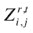

# 8.皮层算法

If you just have a single problem to solve, then fine, go ahead and use a neural network. But if you want to do science and understand how to choose architectures, or how to go to a new problem, you have to understand what different architectures can and cannot do.

—马文·明斯基 [1](#Fn1)

自 20 世纪 80 年代中期以来，由于神经科学的重大发现和计算技术的进步，受人脑结构和功能特性启发的计算模型取得了令人印象深刻的进展。在这些模型中，皮层算法(CAs)是一种受生物学启发的方法，模仿人类视觉皮层，以不变的形式存储模式序列，并自动联想回忆这些模式。本章详细介绍了 CA 的结构和数学公式，然后介绍了一个使用基于熵的权重更新识别孤立阿拉伯语语音的 CA 泛化精度的案例研究。

## 皮层算法入门

最初由 Edelman 和 Mountcastle (1978 年)开发，并受到视觉人类皮层的启发，CAs 被定位为优于早期人工神经网络(ann)，后者不使用数据中的时间和空间关系来建立机器学习模型。

CA 模型由一个多层网络组成，以皮质柱为基本结构。该网络以两阶段的方式训练:第一学习阶段是无监督的，并训练列从出现的模式中识别独立特征；第二阶段依靠监督反馈学习来创建不变表示。

### 皮层算法结构

人脑是由大量神经元组成的六层结构，这些神经元通过前馈和反馈连接紧密相连。新大脑皮层的一个重要属性是其结构和功能的一致性:网络中的所有单元看起来都相似，它们执行相同的基本操作。像这种大脑结构一样，CA 结构也有不同厚度的小柱(Edelman 和 Mountcastle 1978)。微柱是共享相同感受野的一组神经元:属于微柱的神经元与相同的感觉输入区域相关联。与经典人工神经网络中的神经元相比，微柱是皮层网络中的基本结构。小型列的关联称为超列或层(在下文中，术语列和小型列可以互换使用)。CA 网络中的连接有两个方向:水平方向，同一层中的列之间；垂直方向，连续层的列之间。虽然不连续层之间的连接存在于人类皮层中，但为了简单起见，这些连接在 CA 中被省略。

图 [8-1](#Fig1) 显示了一个皮层网络的示意图。图中没有明确显示横向抑制连接，因为它们的功能不是物理的；也就是说，这些连接不代表神经元之间传播的数据，而是作为列之间的通信手段。

图 8-1。

Schematic of cortical network connectivity

图 [8-2](#Fig2) 给出了此后采用的符号，其中表示在训练时期 t 期间，层 r 的第 I 列的第 j 个神经元和前一层(r-1)的第 k 列之间的连接的权重。粗体变量代表矢量实体，下划线变量代表矩阵，斜体变量代表标量实体。

图 8-2。

Nomenclature conventions for the weight 

在学习过程中，通过给连接分配零权重来禁用连接。如果网络是完全连接的，则该列中的每个神经元 j 都连接到前一层中的所有列。所有连接都是弹性的；也就是说，如果一个连接在前馈过程中被禁用，它可以在反馈学习过程中被恢复，反之亦然。

表示由 M 个节点组成的列在训练时期 t 期间的状态的权重矩阵由下式定义

进入由 L 个 r 个列组成的层 r 中的列 I 的神经元 j 的连接的权重向量由下式给出

其中是层(r-1)中的列数，L r 代表层 r 中的列数，上标’代表转置运算符。

扩大产量

时期 t 的层 r 的输出向量 Zr，t由下式给出

其中是同一训练时期的层中的列 I 的输出。

将神经元的输出视为非线性激活函数 f(的结果。)，响应于进入神经元的连接的加权和，列的输出被定义为构成该列的神经元的输出的和。

是在训练时期 t 第 r 层中第 I 列的第 j 个神经元的输出，由下式给出

是构成第 r 层的第 I 列的第 j 个神经元的输出，并且被定义为

其中 T 是根据经验选择的容差参数，并且对于所有时期和列都是恒定的。假设所有权重都被标准化，并限制在–1 和 1 之间。

非线性激活函数类似于动作电位通过神经系统中轴突的传播。

### 皮层算法的训练

列内的连通性通过突触权重的值来建模。最初，皮质骨柱之间没有特定的连接。假设网络在训练之前完全连接。此外，所有突触权重都被初始化为非常接近 0 的随机值，以避免对任何特定模式的偏好。

由 Edelman 和 Mountcastle (1978 年)提出并由 Hashmi (2010 年)进一步发展的训练过程，根据其主要阶段在以下章节中描述:无监督前馈、有监督反馈和权重更新。

#### 无监督前馈

前馈学习训练列通过随机触发和重复曝光来识别特征。当一个模式出现时，输入通过网络传播。每列都有很小的触发概率，这意味着特定层中的大多数列都保持不活动状态。当特定列的随机触发与特定输入模式一致时，这种激活被强制执行。换句话说，当强制激活时，根据加强权重更新规则，列触发会加强其权重。同时，列触发通过削弱权重来禁止同一层中的相邻列触发，如禁止更新规则中所示。

权重更新规则如下:

*   抑制:

*   加强:

其中ω()由下式给出

其中ρ是调谐参数，ε是根据经验选择的对于所有时期和列都恒定的启动阈值。

通过重复暴露，网络学会提取输入数据的某些特征，而列学会为特定模式触发。网络中的各层以越来越复杂的方式提取输入的各个方面。因此，较低层检测简单的特征，而较高层学习概念和更复杂的数据抽象。

#### 监督反馈

前馈学习训练列来识别数据的特征，使得分层网络开始识别模式。当网络暴露于与前一个模式完全不同的模式变化时，应该为该模式触发的顶层列不会触发，并且只有层次结构中的一些列会触发，这导致错误分类。通过 CA 反馈机制，发生在顶层的错误产生一个反馈信号，该信号迫使为原始模式触发的列触发，同时禁止为变化触发的列。经过多次曝光，顶层应达到所需的点火方案(也称为稳定激活)。更具体地说，顶层中的指定列学习为特定模式触发。一旦列开始对图案变化给出稳定的激活，反馈信号就传播回先前的层。然后对每一层进行训练，直到达到收敛标准(表示为实际输出的函数中的误差项)和期望的输出(点火方案)。只有当相关层中的误差收敛到低于某个预定容限阈值的值时，反馈信号才被发送到前面的层。兴奋和抑制信号遵循与前馈学习相同的更新规则。

当用于网络的反馈学习时，CA 可以概括为以下步骤:

Following the feedforward unsupervised batch learning (i.e., after the training data are entirely propagated through the network), a desired output scheme per layer is formed by averaging the column outputs. If  is the output of the ith column in the rth layer of the network for a certain training instance denoted by k and given N instances in total; the desired output for this particular column  is given by:  

Starting with the last layer, compare the measured output of each column as a response to each instance k,  with the desired value of . If the desired output of a column is a firing state, whereas the actual is different, the column is strengthened (see Equation 8-8; the column is inhibited (see Equation 8-7) if the opposite occurs (i.e., if the actual output is firing, whereas a nonfiring state is desired).   Repeat step 2 until the error threshold is met.   Follow the same procedure for the previous layers, one layer at a time.  

## 重量更新

在 CA 中，良好的准确性是以计算昂贵和冗长的训练为代价的。该成本主要是由于在学习网络的权重时，在每个神经元的权重更新过程中调用的指数函数的计算。

对于特定节点，等式 8-8 可以写成:

这里，α、β和δ是取决于训练时期以及所考虑的列的变量；因此，合适的命名法应该是的形式。为了简单起见，可以省略这些变量的下标和上标，将ω()称为ω。

如等式 8-11 所示，指数权重更新规则的参数——α、β、δ、ω和 T——取决于所考虑的列的状态。因此，可以推断，加强规则是一族指数函数，每一列的参数都不同。列的更新需要计算每个节点的指数函数，因此训练时间很长。

图 [8-3](#Fig3) 显示了θ相对于随机节点的神经元权重值的曲线图。

图 8-3。

Plot of  versus 

强化规则中涉及的计算成本也来自于指数函数的计算。例如，MATLAB 软件使用二项式定理(见等式 8-12)来计算指数的近似值，该近似值的计算阶数最高为 5 到 10 (Mohler 2011):

表 [8-1](#Tab1) 总结了计算指数函数所需的运算次数。

表 8-1。

Required Operations for Exponential Function

<colgroup><col> <col> <col></colgroup> 
| 表示 | 操作 | 操作总数 |
| --- | --- | --- |
| 我！ | 2 * 3 *……*一 | I-两次乘法 |
| x i | x*x*x*… | 一.乘法 |
|  |  | 2i-一次操作 |
| e x |  |  |

### CA 培训的工作流程如图 [8-4](#Fig4) 所示。

图 8-4。

Training of a cortical network

### 实验结果

从加州大学欧文分校机器学习知识库(Bache 和 Lichman 2013)获得的各种模式识别数据库的实验结果显示了 CA 的优异性能，如以下数据集所述:

*   字母识别数据集:该数据集由 20，000 幅黑白图像组成，被归类为英语字母表的 26 个大写字母之一(Slate 1991)。每个实例由一组 16 个整数类型的特征表示，归一化为 0-15 的范围，表示图像的各个方面，如水平和垂直位置，以及宽度和长度。该数据集报告的最佳准确度为 97.58%(Bagirov 和 Ugon，2011 年)。
*   图像分割数据集:该数据集是每个大小为 3 `×` 3 的图像的集合，由描述图像特征的 19 个属性表示，例如平均强度、饱和度和色调(Vision Group 1990)。数据集分为由 210 个实例组成的训练集和由 2100 个实例组成的测试集；每个图像属于 7 类中的一类。Dash 等人(2003 年)达到了 98.6%的准确率。
*   ISOLET(孤立字母语音识别)数据集:本实验中的任务是将孤立的口语英语字母的集合分类为 26 类(A-Z)中的一类。该数据集由 150 个说话者发出的 2，800 个实例组成，每个实例由一组 617 个特征表示，包括光谱系数、轮廓特征、超声特征、前超声特征和后超声特征(Cole 和 Fanty 1994)。据报道，该数据库的准确率为 96.73%(Dietterich 1994)。
*   PENDIGITS(基于笔的手写数字识别)数据集:该实验由基于笔的手写数字识别组成。该数据库收集了来自 44 个书写者的 10，992 个样本，每个样本是一系列(x，y)坐标，代表书写过程中笔的轨迹。该序列已经被重新采样以获得等于 16(八对(x，y)坐标)的固定长度属性向量，并被归一化以消除由不同笔迹产生的伪像的影响。10，992 个样本分为 7，494 个实例和 3，498 个实例的训练集进行测试。该数据集的准确性达到 98.6%(Alpaydin 和 Alimoglu 1998)。
*   多特征数据集:该数据集由 649 个特征组成，共有 2000 种手写数字模式(‘0’-‘9’)，提取自荷兰公用事业地图集(Duin 2013)。这些数字用六个特征集表示:字符形状的 76 个傅立叶系数；216 个剖面相关性；64 Karhunen-Lo `è` ve 系数；240 像素平均值，在 2 个`×` 3 个窗口中；47 个泽尔尼克时刻；和六个形态特征。达到的最高准确度是 98%(珀金斯和蒂勒，2003 年)。
*   鲍鱼数据集:该数据集的任务是根据总共八个物理测量值(如身高、体重、直径和长度)对 4177 只鲍鱼的年龄进行分类。该数据集的特征是高度不平衡的类分布，并且已经实现了 79.0%的准确度(Tan 和 Dowe 2003)。

表 [8-2](#Tab2) 基于四重交叉验证，使用输出层的均方误差(MSE)和构造良好的交叉熵(ce)成本函数，汇编了识别率、训练时间和收敛所需的迭代总数。

表 8-2。

Experimental Results

<colgroup><col> <col> <col> <col></colgroup> 
| 资料组 | 措施 | 实验 1 | 实验二 |
| --- | --- | --- | --- |
| 字母识别 | %准确度 | Ninety-eight point three | Ninety-eight point eight |
| 训练时间(分钟) | Two hundred and twenty-three | Two hundred and thirty-five |
| 时代数 | Two hundred and thirty-seven | Two hundred and twenty-five |
| 操作次数 | 8.9 * 10 12 | 1.1 * 10 13 |
| 图象分割法 | %准确度 | Ninety-nine point three | Ninety-nine point seven |
| 训练时间(分钟) | Forty-five | fifty-two |
| 时代数 | Seventy-seven | sixty-nine |
| 操作次数 | 22 * 10 12 | 2.5 * 10 12 |
| 伊索莱特 | %准确度 | Ninety-eight point one | Ninety-eight point seven |
| 训练时间(分钟) | Fifty-four | Sixty-seven |
| 时代数 | One hundred and forty-seven | One hundred and thirty-one |
| 操作次数 | 2.6 * 10 12 | 3.2 * 10 12 |
| PENDIGITS | %准确度 | Ninety-nine point eight | One hundred |
| 训练时间(分钟) | One hundred and thirty-five | One hundred and fifty-four |
| 时代数 | Ninety-four | Eighty-two |
| 操作次数 | 6.5 * 10 12 | 7.4 * 10 12 |
| 多重特征 | %准确度 | Ninety-eight point seven | Ninety-nine point one |
| 训练时间(分钟) | Thirty-five | forty-two |
| 时代数 | Sixty-six | Fifty-three |
| 操作次数 | 1.4 * 10 12 | 2.0 * 10 12 |
| 鲍鱼 | %准确度 | Ninety-one point eight | Ninety-two point two |
| 训练时间(分钟) | fifty-six | sixty-eight |
| 时代数 | Seventy | Sixty-two |

进行了两个实验:

*   实验 1:具有指数权重更新规则和 MSE 作为成本函数的 CA
*   实验 2:使用指数权重规则的 CA 和作为成本函数的 CE

平均而言，CE 成本函数导致更好的分类精度。然而，这是以增加计算复杂度和训练时间为代价实现的。

Note

尽管 CAs 具有优越的假设性能，但由于其更长、更昂贵的训练和计算要求，CAs 仍然没有 ann 应用广泛。这使得它们对于在线学习、能量感知计算节点和对训练持续时间有严格限制的大型数据集没有吸引力。

## 应用于阿拉伯语口语数字的修正皮层算法:案例研究

因为 CA 还没有被广泛地实现用于自动语音识别(特别是对于阿拉伯语)，所以下面的部分示出了如何用被添加到 CA 成本函数和权重更新规则中的加权熵概念来修改反馈期间最初采用的 CA 加强和禁止规则。

### 基于熵的权重更新规则

在 CA 的反馈学习阶段，将每层的输出与期望的点火状态进行比较，并且更新权重，直到误差项减小到最小阈值。使用最小二乘准则，较大的误差值比较小的误差值更能影响学习过程。对于一类问题，以均方误差作为权值更新标准的梯度下降算法会陷入局部极小值，从而无法找到最优解。相反，采用梯度下降算法的结构良好的 CE 标准保证了在学习期间收敛到最优解(Wittner 和 Denker 1988)。

形式为的良构误差函数的三个属性如下:

*   对于所有的，的导数，定义为，必须是负数。
*   必须存在一个ϵ ，这样对于所有的。
*   函数 h 必须是可微且有界的。

CE 作为一个成本函数标准可以写成

其中是层 r 的第 I 列在时期 t 的期望输出

如果对反馈学习采用相同的过程，并且假设当熵度量低于预定阈值时，每层的训练收敛发生，则权重更新规则变成: 

*   加强:

*   抑制:

使用所提出的梯度下降加权规则的一个优点是，如果一个输出收敛到错误的极值，则 CE 成本函数发散；因此，梯度下降反应迅速。相比之下，MSE 成本函数接近常数，最小平方上的梯度下降将在平台上徘徊，即使误差可能不小。

### 实验验证

使用六个隐藏层的 CA，从第一隐藏层的 20 个节点的 2000 列开始，并且在连续层之间将列的数量减半，基于五重交叉验证，使用加权熵权更新规则，执行四个实验:

*   实验 1:使用 MSE 成本函数和原始权重更新规则训练 CA
*   实验 2:使用 MSE 成本函数和所提出的权重更新规则来训练 CA
*   实验 3:使用 CE 成本函数和原始权重更新规则来训练 CA
*   实验 4:使用 CE 函数和所提出的权重更新规则来训练 CA

使用 MATLAB R2011a 软件在 2GHz 的英特尔 i7 上执行模拟，并在 Windows 7 家庭高级版操作系统上使用 6GB RAM，使用修改的中枢神经系统(CNS)库。CNS 库由麻省理工学院的穆奇、克诺布利奇和波吉奥(2010)开发，是一个用于模拟皮质组织网络的框架。

该数据库是从 UCI 机器学习知识库中获得的，由 13 个梅尔频率倒谱系数(MFCC)帧的集合组成，代表 8800 个阿拉伯口语数字——由 88 个不同的说话者发出的 10 个类别(0-9)之一，在使用移动汉明窗口过滤口语数字后获得。在这个数据库上验证了几种技术；基于三重交叉验证，使用多类 SVM 分类器，获得的最佳结果显示了 97.03%的识别率(纪和孙 2011)。

Tree Representation for Arabic Phonemes

作为 22 个国家的第一语言，阿拉伯语在世界上使用最多的语言中排名第五(Mosa 和 Ali 2009)。虽然处理语音识别的应用程序已经显著增加(例如，iPhone 4S Siri 界面)，但阿拉伯语的实现是有限的，主要是因为其形态的复杂性。对于阿拉伯语自动语音识别，音素的识别构成了连续语音分析中的重要步骤。大多数研究通过提取孤立的音素或小语音片段进行(埃尔-奥贝德，阿尔-纳西里，和马利 2006；Awais 2003 格瓦特、采诺夫和姆拉德诺夫 2010；阿尔马尼、阿尔卡哈尔和阿尔哈姆迪 2009 年)，用于分析较长的语音信号(阿布沙里亚等人 2010 年)和广播新闻(阿尔马尼、阿尔卡哈尔和阿尔哈姆迪 2009 年)，使用多种技术，如人工神经网络(埃萨、托尔巴和埃尔穆吉 2008 年)、模糊隐马尔可夫模型(谢努达、扎基和戈内德 2006 年)、模糊逻辑、并行自组织映射(塞加尔、贡达尔和杜利 2004 年)和隐马尔可夫模型(萨托利 Bourouba 等人，2010 年；Biadsy、Moreno 和 Jansche 2012)。

在中东和北非使用的阿拉伯语有不同的方言。然而，文学阿拉伯语(也称为现代标准阿拉伯语)是所有阿拉伯语国家在文件和正式讲话中使用的官方形式。阿拉伯语口语和书面语的区别之一是后者有音调符号(用来表示字母发音的符号)。阿拉伯语的复杂性是其不寻常的形态学的结果:单词是使用词根和模式方案形成的，其中词根由 3 个辅音组成，导致一个词根有几种可能性。从语音上讲，阿拉伯语有 28 个辅音段和 6 个元音(Newman 1984)。音素可以根据说话时嘴唇和舌头的发音来分组，如阿拉伯语音素的分类所示。

Note

MFCCs 可以独立于源(说话者)对语音的声学内容进行建模。MFCCs 的计算方法是将频谱的对数映射到 Mel 标度，并使用离散余弦变换将获得的信号转换回时域(Klatau，2005)。

为了一致性，对数据的第一次实验使用了所提供的 13 个 MFCC，然后添加了 MFCC 的一阶和二阶导数，即具有大小为 39 的特征向量的系数。表 [8-3](#Tab3) 和 [8-4](#Tab4) 显示了所有实验获得的结果与获得的平均识别率、训练时间和收敛所需的周期数的比较。

表 8-4。

Results for the Arabic Spoken Digit Dataset, Using 39 MFCCs

<colgroup><col> <col> <col> <col> <col></colgroup> 
|   | 实验 1 | 实验二 | 实验三 | 实验 4 |
| --- | --- | --- | --- | --- |
| 识别率(%) | Ninety-eight point two | Ninety-nine point one | Ninety-eight point six | Ninety-nine point seven |
| 训练时间(分钟) | One hundred and twenty-five | One hundred and forty-two | One hundred and thirty-seven | One hundred and fifty-six |
| 收敛前的历元数 | Three hundred and thirty-five | Two hundred and ninety-eight | Three hundred and twenty-two | Two hundred and eighty |

表 8-3。

Results for the Spoken Arabic Digit Dataset, Using 13 MFCCs

<colgroup><col> <col> <col> <col> <col></colgroup> 
|   | 实验 1 | 实验二 | 实验三 | 实验 4 |
| --- | --- | --- | --- | --- |
| 识别率(%) | Ninety-seven point four | Ninety-eight point four | Ninety-seven point nine | Ninety-nine |
| 训练时间(分钟) | Ninety | One hundred and ten | One hundred | One hundred and fifteen |
| 收敛前的历元数 | Two hundred and forty | Two hundred and thirty-two | Two hundred and thirty-five | Two hundred and twenty |

表 [8-3](#Tab3) 和 [8-4](#Tab4) 证明了使用熵成本函数和提出的权重更新规则的皮层网络的训练比原始训练参数表现得更好。这种改进是以所需的训练时间略有减少为代价实现的。然而，尽管训练时间很长，与原始的权重更新规则相比，所提出的权重更新规则需要更少的训练时期来收敛。这是因为使用所提出的规则增加的加强量与成本函数的梯度成比例，这意味着需要更少的训练时期来达到收敛。与原始权重更新规则相比，所提出的权重更新规则涉及计算熵梯度，这在计算上更加昂贵。

图 [8-5](#Fig5) 中的混淆矩阵是使用两种成本函数为图像分割数据集获得的，表明尽管使用经典距离度量在类别 1、7 和 8 之间的混淆中观察到显著趋势，但提议的基于熵的更新规则能够部分纠正这一趋势。

图 8-5。

Confusion matrices for the Image Segmentation dataset: left, exponential rule; right, linear rule

图 [8-6](#Fig6) 比较了 CE 成本函数与使用熵成本函数为建议的和常规的权重更新规则训练皮层网络时获得的训练历元。注意，与常规更新相比，所提出的权重更新收敛到更小的 MSE 值，这与先前获得的识别率一致。

图 8-6。

Entropy cost function comparison for regular and proposed weight update rules

## 参考

Abushariah、Mohammad A. M.、Raja N. Ainon、Roziati Zainuddin、Moustafa Elshafei 和 Othman O. Khalifa。"基于隐马尔可夫模型的非特定人阿拉伯语语音识别系统，使用 Sphinx 工具."《2010 年计算机与通信工程国际会议论文集》,马来西亚吉隆坡，2010 年 5 月 11-12 日，第 1-6 页。新泽西州皮斯卡塔韦:电气和电子工程师协会，2010 年。

使用模糊规则库系统辨识阿拉伯语音素。《第七届国际多主题会议论文集》,巴基斯坦伊斯兰堡，2003 年 12 月 8-9 日，第 367-370 页。新泽西州皮斯卡塔韦:电气和电子工程师协会，2003 年。

Bache，k .和 M. Lichman。"加州大学欧文分校，机器学习知识库."欧文:加州大学，2013 年。[http://archive . ics . UCI . edu/ml/index . html](http://archive.ics.uci.edu/ml/index.html)。

巴吉罗夫，A. M .，j .尤根和 d .韦伯。"一种有效的分段线性分类器增量构造算法."信息系统杂志 36，第 4 期(2011):782–790。

Biadsy、Fadi、Pedro J. Moreno 和 Martin Jansche。"谷歌的跨方言阿拉伯语语音搜索."2012 年 IEEE 声学、语音和信号处理国际会议论文集，日本京都，2012 年 3 月 25-30 日，4441-4444。新泽西州皮斯卡塔韦:电气和电子工程研究所，2012 年。

布鲁巴、杰米利、贝达和斯纳尼。"用于孤立阿拉伯语语音识别的新型混合系统(监督分类器/HMM). "《第二届信息与通信技术会议论文集》,叙利亚大马士革，2006 年 4 月 24-28 日，1264-1269 页。新泽西州皮斯卡塔韦:电气和电子工程研究所，2006 年。

科尔、罗恩和马克·凡蒂。"等值线数据集."加州大学欧文分校机器学习知识库。欧文:加州大学，1994 年。[https://archive . ics . UCI . edu/ml/datasets/ISOLET](https://archive.ics.uci.edu/ml/datasets/ISOLET)。

达什、马诺兰詹、刘欢、彼得·舒尔曼和吉安·李坦。"快速层次聚类及其验证."数据与知识工程 44，第 1 期(2003):109–138。

迪特里希，托马斯 g，和 Ghulum 巴基里。"通过纠错输出码解决多类学习问题."人工智能研究杂志 2，第 1 期(1995):263–286。

多特征数据集。加州大学欧文分校机器学习知识库。欧文:加州大学，2013 年。 [http:// archive。ics。uci。edu/ ml/数据集/多重+特征](http://archive.ics.uci.edu/ml/datasets/Multiple+Features)。

埃德尔曼，杰拉尔德 m，弗农 b .芒特卡斯尔。大脑皮层组织和高级大脑功能的群体选择理论。麻省剑桥:麻省理工学院出版社，1978 年。

艾萨 e . m . a . s .托尔巴和 s .埃尔穆吉。"阿拉伯语语音识别的组合分类器结构的比较."《2008 年计算机工程和系统国际会议论文集》,埃及开罗，2008 年 11 月 25-27 日，149-153 页。新泽西州皮斯卡塔韦:电气和电子工程研究所，2008 年。

格瓦特、沃特、格奥尔基·采诺夫和瓦莱里·姆拉德诺夫。"用于语音识别的神经网络."《自动控制学报》第 20 卷第 1 期(2010):1–7。

纪、游、孙士良。"多任务多类支持向量机."《第 11 届国际数据挖掘研讨会论文集》，不列颠哥伦比亚省温哥华，2011 年 12 月 11 日，第 512–518 页。新泽西州皮斯卡塔韦:电气和电子工程研究所，2011 年。

克劳露，阿尔德巴洛。" MFCC "，2012 年，www . CIC . un . br/√lamar/te 073/classes/MFCC . pdf。

哈希米，阿提夫 g，和米科。李帕蒂。“发现皮层算法”。《模糊计算国际会议和神经计算国际会议论文集》,西班牙巴伦西亚，2010 年 10 月 24-26 日，196-204。

穆罕默德·阿勒-马尼、穆罕默德·阿尔卡纳尔和曼苏尔·哈姆迪"自动语音分割使用阿拉伯语语音数据库."第 10 届 WSEAS 自动化和信息国际会议论文集，捷克共和国布拉格，3 月 23-25 日，76-79。威斯康辛州史蒂文斯角:世界科学与工程学会，2009 年。

莫勒克里夫。“指数函数。”章 8 在 MATLAB 实验中。MathWorks，2011 年。[www . mathworks . com/moler/exm/chapters/indexal . pdf](http://www.mathworks.com/moler/exm/chapters/exponential.pdf)。

Mosa、Ghassaq S .和 Abduladhem Abdulkareem Ali。"基于分层神经模糊 Petri 网和 LPC 特征提取的阿拉伯音素识别."信号处理:国际期刊 3，第 5 期(2009):161–171。

穆奇、吉姆、乌尔夫·克诺布利奇和托马索·波吉奥。" CNS:一个基于 GPU 的框架，用于模拟皮质组织的网络."技术报告，麻省理工学院，2010 年。

纽曼丹尼尔。"阿拉伯语的语音。"美国东方学会期刊 46(1984):1–6。

奥贝德、马纳尔·埃尔、阿米尔·纳西里和伊曼·阿布·马利。"使用神经网络的阿拉伯音素识别."《第五届 WSEAS 信号处理国际会议论文集》,土耳其伊斯坦布尔，2006 年 5 月 27-29 日，99-104。威斯康星史蒂文斯点:世界科学和工程学会，2006 年。

珀金斯、西蒙和詹姆斯·蒂勒。"使用嫁接的在线特征选择."《第二十届机器学习国际会议论文集》, 2003 年 8 月 21-24 日，DC，华盛顿，592-599。门洛帕克，加州:人工智能促进协会，2003 年。

沙托利、哈桑、穆斯塔法·哈蒂和努雷丁·陈弗。"介绍使用 CMU 斯芬克斯系统的阿拉伯语语音识别."《信息和通信技术国际研讨会会议录》，摩洛哥非斯，2007 年 4 月 3 日至 5 日，Mohammad Essaaidi、Mohammed El Mohajir、Badreddine El Mohajir 和 Paolo Rosso 编辑，139-142 页。新泽西州皮斯卡塔韦:电气和电子工程师协会，2007 年。

塞加尔，M. S. B .，伊克巴尔·贡德尔和劳伦斯·杜利。"面向普适环境的混合神经网络语音识别系统."《第八届国际多主题会议论文集》，巴基斯坦拉合尔，2004 年 12 月 24-26 日，第 309-314 页。新泽西州皮斯卡塔韦:电气和电子工程师协会，2004 年。

Shenouda、Sinout D、Fayez W. Zaki 和 A. M. R. Goneid。"用于阿拉伯语连接式语音识别的混合模糊 HMM 系统."《第 23 届全国无线电科学会议论文集》,埃及莫努菲亚，3 月 14-16 日，1-8。新泽西州皮斯卡塔韦:电气和电子工程师协会，2006 年。

字母识别数据集。加州大学欧文分校机器学习知识库。欧文:加州大学，1991 年。 [http:// archive。ics。uci。edu/ ml/数据集/字母+识别](http://archive.ics.uci.edu/ml/datasets/Letter+Recognition)。

谭，彼得 j，大卫 l .道。"具有多向连接和动态属性的决策图的 MML 推理."人工智能 2003:人工智能进展；第 16 届澳大利亚人工智能会议记录，澳大利亚珀斯，2003 年 12 月 3-5 日，由 Tamás Domonkos Gedeon 和 Lance Chun Che Fung 编辑，269-281。柏林:施普林格，2003 年。

alpaydin e .和 Fevzi Alimoglu。"基于笔的手写数字数据集识别."加州大学欧文分校机器学习知识库。欧文:加州大学，1998 年。 [https:// archive。ics。uci。edu/ml/datasets/Pen-Based+recognition n+of+手写+数字](https://archive.ics.uci.edu/ml/datasets/Pen-Based+Recognition+of+Handwritten+Digits)。

远景集团。"图像分割数据集."加州大学欧文分校机器学习知识库。欧文:加州大学，1990 年。 [https:// archive。ics。uci。edu/ ml/数据集/图像+分割在](https://archive.ics.uci.edu/ml/datasets/Image+Segmentation)上。

维特纳，本 s，和约翰 s 登克。"分层网络分类任务的教学策略."神经信息处理系统:丹佛，CO，1987，Dana Z. Anderson 编辑，850–859。柏林:施普林格，1988 年。

Footnotes [1](#Fn1_source)

马文·明斯基，“现场的科学家:对马文·明斯基的采访”，在 HAL 的遗产:2001 年的计算机作为梦想和现实，由 David G. Stork(麻省理工学院出版社，1998)，第 18 页。