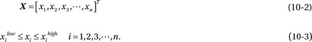
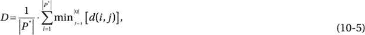
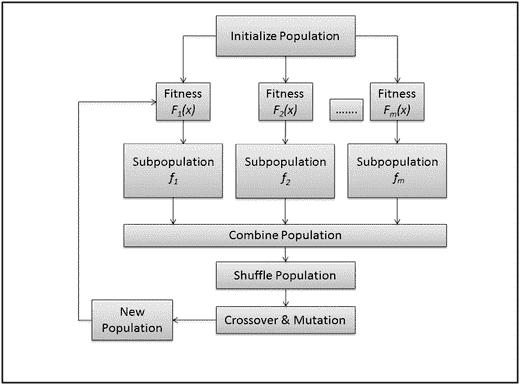
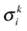
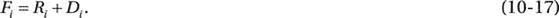
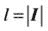

# 十、多目标优化

All men seek one goal: success or happiness. The only way to achieve true success is to express yourself completely in service to society. First, have a definite, clear, practical ideal—a goal, an objective. Second, have the necessary means to achieve your ends: wisdom, money, materials, and methods. Third, adjust all your means to that end. —Aristotle

多目标优化是为了实现多个目标，服从一组约束，这些目标有可能相互冲突。多目标优化也可以解释为一个多准则决策过程，其中多个目标函数必须同时优化。在许多情况下，最佳决策可能需要在相互冲突的目标之间进行权衡。传统的优化方案使用权重向量来指定每个目标的相对重要性，然后将目标组合成标量成本函数。这种策略通过将多目标问题转化为单目标问题来降低解决多目标问题的复杂性。多目标优化的求解技术包括模型复杂性和准确性之间的权衡。多目标优化的例子可以在经济(制定货币政策)、金融(风险-回报分析)、工程(过程控制、设计权衡分析)和许多其他必须获得冲突目标的应用中找到。

多目标优化的先决条件之一是确定一个解是否优于另一个解。然而，没有简单的方法可以得出这样的结论。相反，多目标优化方法通常采用一组帕累托最优解(也称为非支配解)，这是在各种目标之间进行不同权衡的备选方案。在由 Pareto 最优集合定义的解决方案中，如果不降低集合中至少一个其他目标的性能，就无法改进一个目标。由决策者选择最符合首选政策或指导方针的帕累托最优解。帕累托图说明了不同目标之间权衡的属性。解决方案可以用曲线或三维曲面的形式表示，在多目标空间中权衡不同的区域。

这一章讨论机器学习方法，使用进化的方法来解决基于 Pareto 的多目标优化问题。目标是在每一代中找到一组到 Pareto 前沿距离最小的非支配解。连续的解决方案是进化过程的一部分，在进化过程中，一组选定的单个解决方案会为下一代产生另一组解决方案。假设具有较高适应度的解在下一代(下一次运行)中将产生更适合的解，则具有较高适应度的解更有可能被选入配对池，而具有较弱适应度的解更有可能被丢弃。这种解决方案具有几个属性，使得它们适合于涉及(1)大而复杂的搜索空间和(2)相互冲突的目标的问题。

## 形式定义

多目标优化问题处理有限数量的目标函数。在具有 n 个同等重要的目标的优化问题中，所有目标都需要最小化(或最大化)以满足性能标准。从数学上来说，这个问题可以表示为一个目标向量 f i (x)，这些目标必须以某种方式进行权衡，

其中 X(见等式 10-2)是一组 n 个决策向量(决策空间),表示为满足约束和优化向量函数而选择的值的参数，

这些目标的相对重要性无法确定，直到它们之间的权衡被清楚地理解。因为 F(x)是一个向量，竞争的目标函数将阻止它获得唯一的解。您可以将决策空间 X 中的每个解决方案 X 与目标空间 Y 中的一个点相关联，这样

在多目标优化中，集合 X 和 Y 分别被称为决策变量空间和目标函数空间。图 [10-1](#Fig1) 说明了搜索空间到目标空间的映射。搜索空间的每次迭代产生一组定义目标空间的目标向量，其中几个最优目标向量可以代表目标之间的不同折衷。

图 10-1。

Multiobjective optimization problem: mapping the search space to the objective space

### 帕累托最优

帕累托最优是建立在多目标优化基础上的概念，其通过多个目标的组合之间的折衷来促进多目标向量的优化。权衡是以一个或多个其他目标为代价来提高一个目标的性能。如图 [10-1](#Fig1) 所示，目标空间中的每一点都代表一组唯一的模型变量，这样帕累托最优将多个帕累托最优解分类。这个术语是为了纪念意大利经济学家维尔弗雷多·帕累托(1848-1923)，他证明了收入遵循幂律概率分布。

对于理想情况，多目标问题的最优解通常表示为 Pareto 集合。相应的结果或目标向量由帕累托前沿表示。实际上，理想的解决方案是不存在的，并且解决多目标优化通常不会产生最优的唯一解决方案。相反，我们使用帕累托最优解，其中一个目标不能在不降低至少一个其他目标的情况下得到改善。因此，当使用进化技术时，最优 Pareto 集(X*，Y*)的知识有助于找到最佳折衷解决方案。

### 优势关系

如果满足以下条件，一个解 x 1 优于另一个解:

For all objectives, solution x 1 is better than or equal to x 2, such that    For at least one objective, solution x 1 is strictly better than x 2, such that   

如果这些条件中的任何一个被违反，那么 x 1 不(帕累托)支配解 x 2 。优势关系是非对称的。例如，如果解 x 1 不支配解这并不意味着 x 2 支配因此，两个解都可以是非支配的。然而，支配关系也是传递的。例如，如果和那么这个属性允许我们识别哪些解不被解集 x 的任何成员支配(xˇ)。整个可行搜索空间的这些非支配集(xˇ)被称为全局 Pareto 最优集。

生成帕累托集合在计算上可能是昂贵的。因此，您需要选择一种计算效率高的方法来确定多目标优化算法的 Pareto 最优集。虽然你可以使用许多不同的方法来解决一个多目标优化问题，但是在进化多目标优化领域已经做了很多工作来逼近 Pareto 集。

### 工作指标

为了评估一个解决方案的性能，有必要开发一个度量方案来量化非主导的 Pareto 前沿的质量。多目标优化算法的一般性能标准可以总结如下:其中，

Convergence (γ): Estimates the proximity of the candidate nondominated (Pareto) solutions to the best-known prediction or known set of Pareto optimal solutions. For each solution obtained using an algorithm, you can use the minimum Euclidian distance (Deb, Pratap, and Agarwal 2002) to the Pareto optimal front. The average distance can be used as the convergence measure. A smaller γ value indicates a better convergence.   Diversity (Δ): Provides a decision maker with efficient choices. Because you are interested in the solution that covers the entire Pareto-optimal region, you need to evaluate the degree of spread between the solutions obtained.   Displacement (D): In the case of algorithmic approximations or the presence of a discontinuous Pareto-optimal front, only a portion of true optimal front may be reflected. Displacement is used to overcome this limitation. Displacement measures the relative proximity of the candidate solution set to a known set of Pareto-optimal solutions. Mathematically, displacement can be expressed as    where,

P* =来自真实帕累托最优前沿的均匀间隔解

Q =最终解决方案

d(I，j)= P *的第 I 个解和 Q 的第 j 个解之间的欧氏距离

较低的置换值代表较好的收敛和覆盖。

每个算法可以选择一个或多个性能标准来测试解决方案的质量。在许多情况下，性能标准可能取决于帕累托最优集合的可用性(或不可用性)。本章的其余部分着眼于各种基于进化学习方法的多目标优化解决方案。

## 机器学习:进化算法

生成 Pareto 集在计算上可能是昂贵的，因为多目标优化问题不再有单一的最优解，而是一整套潜在的解。经典优化方法(Marler 和 Arora 2004)包括加权求和法、扰动法、Tchybeshev 法、目标规划法和最小-最大值法。虽然这些方法可用于多标准优化，但每次模拟运行只能获得一个解决方案；模拟需要执行多次，期望其中一个解决方案可能导致帕累托最优解。进化算法(EAs)非常适合解决多目标优化问题，因为它们模仿自然过程，本质上是多目标的；在一次模拟运行中，可以获得许多帕累托最优解。此外，EAs 对帕累托前沿的形状或连续性不太敏感。这些算法已经成功地应用于广泛的组合问题，其中来自多个来源的信息被集合在一起以实现最优解。这种算法在涉及设计和优化的应用中特别有用，在这些应用中存在大量的变量，并且程序算法或者不存在或者极其复杂。一般来说，进化方法是基于群体的元启发式优化算法，模仿自然进化的原则。这些方法使用解的初始群体，并在每一代中更新以收敛到单个最优解。虽然进化算法不能保证一个真正的最优解，但是它们试图找到一个好的近似，代表一个接近帕累托最优的解。

进化算法通常分为四大类:(1)遗传算法(GAs)，(2)遗传编程(GP)，(3)进化编程(EP)，和(4)进化策略(es)。尽管这些算法采用了不同的方法，但它们都是从自然选择原理中获得灵感的。进化算法的基本过程包括选择、变异和交叉。EA 的第一阶段需要应用一个适应度因子来评估目标空间中的群体(代表解决方案的质量)。接下来，使用随机选择或基于可能性的选择标准，通过选择上一步的群体来创建交配池。一旦交配池被组织起来，它就会发生重组和突变，从而产生一个新的群体。重组过程以可配置的概率执行 n 点交叉，允许一个亲本的片段与另一个亲本的片段组合，以创建全新的子群体。交配选择是进化过程中的一个关键步骤，因为它试图选择有希望的解决方案，假设未来的交配池作为高质量选择的结果往往是优越的。变异算子根据给定的变异率，通过对相关向量进行小的改变来修改个体。鉴于交配和突变过程的概率性质，某些群体可能不会经历任何变异，而只是复制到下一代。

类似于自然进化，个体代表可能的解决方案，一组个体(或可能的解决方案)称为群体。每一个人都被编码，使用一个特定问题的编码方案，可以解码和评估的适应度函数。交配过程通过重组和突变来改变现有种群，从而进化出新的种群。每一次循环迭代被称为一代，它代表了进化过程中的一条时间线。

多目标进化算法领域的早期工作归功于 David Schaffer，他实现了向量求值遗传算法(VEGA) (Schaffer 1985)。Goldberg(1989)提出根据帕累托优势计算个体适应度。多目标进化算法的许多变种已经被提出(本章认为其中一些更受欢迎)。

### 遗传算法

遗传算法遵循自然选择的原则(见图 [10-2](#Fig2) )，其中每个解都被表示为一个二进制(或实数)编码的字符串(染色体)和一个相关的适应度。连续的解决方案是进化过程的一部分，在进化过程中，一组选定的单个解决方案会为下一代产生另一组解决方案。具有高适应度的个体更有可能被选入交配池，假设他们在下一代中会产生更适合的解决方案。具有较弱适应度的解决方案自然被丢弃。通常，您可以使用轮盘赌选择来模拟自然选择，在自然选择中，淘汰功能适应度更高的解决方案虽然可能，但可能性较小。在这种方法中，每个可能的选择被分配一部分与其适应值成比例的轮盘，随后是随机选择，类似于旋转轮盘赌轮盘。一些较弱的解决方案在选择过程中幸存下来的可能性也很小，因为它们可能包含在交叉过程后证明有用的成分(基因)。数学上，选择潜在解决方案的可能性由下式给出

图 10-2。

Basic flow of a GA

其中 P i 代表第 I 个解被选择用于配对池的可能性，F i 代表第 I 个个体解的操作适合度，N 是群体中解元素的总数。事实证明，遗传算法在解决复杂的大搜索空间问题上是有用的，这些问题由于缺乏领域知识而难以理解。GA 的染色体代表适合于遗传算子和适应度函数的问题解决方案的构建块(等位基因)。使用交叉和变异函数对候选解进行修改，并产生新的候选解，该新的候选解在新的交配池中进行候选资格评估。

### 遗传表演程序

GP 是一种进化技术，它将遗传学习范式扩展为计算机程序的自主合成，当执行时，会产生候选解。与 GAs 不同，在 GAs 中，群体是代表候选解的固定长度编码字符串，在 GP 中，群体是由语法树(也称为解析树)表示的程序。GP 迭代地进化程序群体，通过执行遗传操作交叉和变异将一组程序转换成另一组程序。交叉函数通过在种群中两个父个体(根据适应度标准选择)的随机交叉点交换子树来实现。交叉通过用第二个父代的子树替换第一个父代的交叉点上的子树来创建后代。在子树突变(最常用的突变形式)中，随机选择的突变点的子树被随机生成的树的子树代替。

图 [10-3](#Fig3) 展示了 GP 方法的一般流程和交叉操作，使用两个变量 x 和 y 以及前缀符号来表示数学运算符。亲本 1 [+(*(x，y)，2)]与亲本 2 [*(+(x，1)，/(y，2))]杂交，产生由[+(/(y，2))，2]表示的后代。习惯上用这样的前缀符号来表示 GP 中的表达式。

图 10-3。

Basic flow of GP with crossover operations; after selecting random crossover points on both parents, a portion of parent 1 attaches to a portion of parent 2 to create an offspring

## 多目标优化:一种进化方法

在单目标优化中，要评估解决方案的质量，只需测量目标函数的值。在多目标优化的情况下，可能无法评估相对于最优 Pareto 近似的解决方案的质量，因为您可能不拥有关于目标空间或覆盖范围的相关信息，因此可能无法根据与最优 Pareto 集的接近程度和覆盖范围的多样性来定义解决方案的质量。即使一个解决方案优于另一个解决方案，您可能仍然无法量化相对改进，因为仅相对距离和多样性不足以量化帕累托集合近似。这给我们带来了定义实现多目标进化算法的策略的基本要求。这些要求可以总结如下:

*   适应性:引导解决方案更接近帕累托集合。这需要构建一个满足多个优化标准的标量适应度函数。
*   多样性改进:通过选择一组多样化的非支配解决方案来提高覆盖率。这避免了相对于目标空间和决策空间存在相同解决方案的情况。
*   精英主义:防止非支配解被淘汰。

大多数 ea 在处理适应性、多样性和精英主义的方式上有所不同。这里列出了一些最流行的多目标 EA (MOEA)方法:

*   加权求和法
*   向量评估遗传算法(织女星)(谢弗 1985 年)
*   多目标遗传算法(MOGA)
*   小生境帕累托遗传算法(NPGA)(霍恩，纳夫普利奥蒂斯和戈德堡 1994 年)
*   非支配排序遗传算法(NSGA)
*   实力帕累托 EA (SPEA)(齐兹勒和蒂勒 1999 年)
*   强度帕累托 EA II (SPEA-II)(齐兹勒，劳曼斯和蒂勒 2001 年)
*   帕累托存档进化战略(PAES)(诺尔斯和科恩 1999)
*   基于帕累托包络的选择算法(PESA)
*   基于帕累托包络的选择算法 II (PESA-II) (Corne 等人，2001 年)
*   精英非支配排序遗传算法(NSGA 第二版)

这些方法将在下面的章节中依次介绍。

### 加权求和法

多目标优化的加权和方法通过一致地改变权重来提供多个解点。使用可配置的权重，不同的目标被合并成单个目标，并且复合函数被最小化。数学上，加权和方法可以表示为

对于正权重，最小化 F 可以产生帕累托最优解。尽管这种方法在计算上是有效的，但是它的主要缺点是，对于一个只有很少信息或者没有信息的问题，它不能确定能够最佳地调整目标函数的权重。

### 向量评估遗传算法

VEGA 是一种基于种群的算法，它扩展了简单 GA (SGA)的选择算子，使得每一代产生许多不相交的子种群，作为比例选择方案的结果，并且由不同的目标管理。对于一个有 m 个目标和总群体大小为 N 的问题，大小为 N / m 的 m 个子群体由它们各自的适应度函数产生。如图 [10-4](#Fig4) 所示，将这些子种群混洗在一起，生成一个新的 n 大小的种群，该方案高效且易于实现，因为只修改了 SGA 的选择方法。

图 10-4。

Basic flow of a VEGA

由于比例选择，VEGA 中所有子种群的洗牌和合并操作产生了一种聚集方法。这种方案的缺点是它不能在帕累托最优前沿找到大量的点，因为每个解执行它自己的目标函数。由于目标空间中各轴的平行搜索方向或多目标函数的同时执行，VEGA 易于找到极端解。

### 多目标遗传算法

MOGA 是 SGA 的另一种变体，不同之处在于将适应性分配给解决方案的方式。在这个方案中，秩 R 被分配给每个解，使用以下表达式

其中 n i 是在第 t 代中支配第 I 个解 x i 的解的数量。一旦排序过程完成，通过用户定义的函数在最佳等级(1)和最差等级之间插值来分配个体的适应度。相同等级的个体的适合度被平均，允许以相似的速率采样，同时保持选择压力。某些个体的适应度可能比其他个体降级更多，这取决于分级群体的大小。排名引导搜索仅收敛于全局最优。在许多客观维度上表现良好的解决方案更有可能参与交配过程。

尽管排序过程为非支配解分配了正确的适应度，但它并不总是保证 Pareto 集中的采样一致性。当处理多个目标时，遗传漂变会引发次优行为，即由于不完美的选择过程，大量的解往往会收敛于较少的目标。为了防止过早收敛和使种群多样化，采用小生境方法将种群分布在目标空间的 Pareto 区域。如果两个个体的适合度比某个小生境距离更近，则它们被认为是相同小生境的一部分(即，共享相同的适合度)。小生境形成通过在小生境之间引入降低这种局部最优解的适合度的竞争压力，阻止了适合度函数收敛到单个区域。利基形成导致发现不同地区的健身景观。在自然界中，生态位被认为是有机体在环境中的任务，而物种是具有相同特征的有机体的集合。小生境将 GA 群体分割成不相交的集合，使得每个适应度函数区域中至少有一个成员覆盖一个以上的局部最优。在一种这样的方法中，你定义一个参数小生境半径(σ 半径)。任何两个比这个距离更近的个体都被认为是同一个生态位的一部分，具有相同的适应值。小生境让遗传算法在新的共享适应值上操作，而不是在个体的原始适应值上操作。小生境减少了种间竞争，并有助于在不同小生境周围合成一个稳定的亚群。在多目标优化问题中，小生境通常由搜索空间中每个最优值的位置来表示，适应度作为该小生境的资源。

### 小生境 Pareto 遗传算法

NPGA 是一种基于帕累托优势的锦标赛选择方案，在该方案中，一组随机选择的个人参加比较，以确定两个候选解决方案中的获胜者。对每个候选人进行测试以确定优势。被比较组非支配的候选者被选择用于交配池。如果两个候选对象被比较集支配或非支配，那么它们很可能属于同一个等价类。如图 [10-5](#Fig5) 所示，对于给定的生态位半径(σ 份额)，交配池的选择由生态位类数决定。在等价类中具有最少个体数量(最少小生境计数)的候选人具有最好的适合度。在这个例子中，因为两个候选物都是非支配的，基于较低的生态位类计数，候选物 1 被选入交配池。

图 10-5。

Equivalence class sharing; candidate 1 (niche class count = 3) is a better fit than candidate 2 (niche class count = 4)

MOGA 和 NPGA 也有类似的缺点；两种方法都对生态位半径的选择高度敏感(σ 份额)。

### 非支配排序遗传算法

NSGA 是另一种基于帕累托的非政治主义方法，它与 SGA 的不同之处在于选择算子的使用方式。首先选择所有非优势解，并将其分类为群体中的第一个非优势前沿。为了确定第二个非优势前沿的成员，从评估过程中排除第一个非优势前沿的成员，并继续对剩余群体进行非优势搜索。在缩小的种群中，这种等级消除和非显性搜索的过程一直持续到种群中的所有个体都被归类到非显性等级。非显性水平的范围从 1 到 p。适合度被分配给与种群大小成比例的每个亚种群类别。属于较低非支配水平的解比属于较高水平的解具有更高的适合度。这种机制保持了选择压力，以朝着帕累托最优前沿的方向将个体选择到具有较高适应度的交配池(较低水平的非显性成员)。

在第一步中，等于种群大小的初始虚拟适应度被分配给非优势前沿的第一级中的个体。基于共享相同正面和相同级别的相邻解的数量(对于给定生态位半径σ 共享的生态位类计数)，个体的适应度值减少生态位计数的一个因子，并且为该级别中的每个个体重新计算新的共享适应度值。对于第二非显性水平中的个体，分配小于第一非显性水平的最低共享适应度的虚拟适应度。类似地，作为第三层和所有后续层的成员的个体相对于较低层的最低适合度以递减顺序被分配适合度。这保证了属于较高非显性水平的个体的适合度总是低于较低水平的个体。这个过程一直持续到整个种群中的所有个体都被分配了它们的共享适应度。一旦分配了所有的适应值，就应用与选择、交叉和变异相关的传统 GA 过程。数学上，这个过程可以解释如下:对于虚拟适合度为 f p 和生态位计数为的 k 个个体，作为 p 非显性水平的一部分，每个个体的共享适合度 I 可以计算为

在随后的非显性水平中的个体的虚拟适合度被给出为

其中ε是一个小正数。

NSGA 与这一类别中的其他算法有着相同的缺点:对小生境半径σ 份额高度敏感。

### 强度 Pareto 进化算法

SPEA 通过合并多目标进化算法先前实现的几个特征来实现精英主义和非支配性。精英选择防止好的解决方案的质量从一代到下一代下降。在它的一个变体中，当代最优秀的个体被带到下一代，没有改变。

Zitzler 等人(2001 年)通过参考以下属性定义了 SPEA 的特征:

Creates an external and continuously updating nondominated population set by archiving previously found nondominated solutions. At each generation the nondominated solutions are copied to the external nondominated set. Unlike other EAs, in SPEA the relative dominance of one solution by other solutions within the population is irrelevant.   Applies external nondominated solutions from step 1 to the selection process by evaluating an individual’s fitness, based on the strength of its solutions that dominate the candidate solution.   Preserves population diversity, using the Pareto dominance relationship. This EA does not require a distance parameter (such as niche radius).   Incorporates a clustering procedure to prune the nondominated external set without destroying its characteristics.  

如前所述，该算法通过维护外部非优势群体集合来明确实现精英主义。算法流程由以下步骤组成:

Initialize the population P of size n.   Initialize an empty population  representing an external nondominant solution set archive.   Copy the nondominated solutions of P to .   Remove solutions contained in  that are covered by other members of  (or dominated solutions).   If the number of solutions in  exceeds a given threshold, prune , using clustering.   Compute the fitness of each member of P and the strength of each member of .   Perform binary tournament selection (with replacement) to select individuals for the mating pool from the multiset union of P and (). Tournament selection creates selection pressure by holding a “tournament” among randomly selected individuals from the current population (). The winner of each tournament (the individual with the best fitness) is inducted into the mating pool. The mating pool has higher average fitness, compared with the average population fitness, and helps build selection pressure, which improves the average fitness of successive generations.   Apply problem-specific mutation and crossover operators, as usual.   Go to step 3, and repeat (unless termination criteria are reached).  

#### 解决方案的优势

每个解被分配一个强度 S i 与个体数量成比例，这样 I 支配 j。外部非支配集中的解的适合度由下式给出

其中 N 是 P 中受 I 支配的个体数，N 是 P 的总种群数。

#### 解决方案的适用性

通过对覆盖(或支配)j 的所有外部非支配解的强度求和来计算解的适应度。集合 P 中的解的适应度由下式给出

将适应度加 1 以保持外部非支配解的更好适应度。因为适应度被最小化，较低的适应度导致被选择到交配池的可能性较高。

#### 使聚集

在 SPEA，外部非支配解集的大小是算法成功的关键。由于它参与了选择过程，一个极大的非支配解集可能会减少选择压力，减慢搜索速度。然而，群体中不平衡的分布可能会使解决方案偏向搜索空间的某些区域。因此，需要一个修剪过程来消除外部非支配群体集中的个体，同时保持其多样性。Zitzler、Laumanns 和 Thiele (2001)使用平均链接法(Morse 1980)来修剪外部非支配解集。聚类步骤如下:。

Initialize a cluster C, such that each individual  in the external nondominated solution set is a member of a distinct cluster.   Calculate the distance between all possible pairs of clusters. Let d  m,n  be the distance between two clusters c  m  and  then,  where  is the Euclidian distance between the objective space of two individuals, and  is the population of cluster c k .   Merge two clusters with minimum distance d  m,n  into the larger cluster.   Identify the individual in each cluster set with the minimum average distance to all other individuals in the cluster.   Cycle steps 2–4 until reaching a threshold of maximum number of allowed clusters   .

SPEA 将精英主义引入进化多目标优化。一个突出的优点是，这种算法不依赖于小生境距离(σ 半径)，如 MOGA 或 NSGA。SPEA 的成功很大程度上取决于基于档案成员实力的适合度分配方法。在最坏的情况下，如果档案包含单个成员，那么 P 的每个成员将具有相同的等级。聚类过程也仍然是算法成功的关键因素。尽管这种技术对于保持多样性是必不可少的，但它可能无法保持边界解，从而导致非支配解的不均匀分布。

### 强度帕累托进化算法 2

SPEA-II 是 SPEA 的增强版。在 SPEA-II 中，主群体和精英档案中的每个个体都被分配一个强度值(S i ),表示它占优势的解的数量，

在强度值 S i 的基础上，通过对支配现有个体 I 的个体的强度求和来计算原始适应值 R i ,

其中

与 SPEA 的适应度仅由主导档案成员的累积强度决定不同，在 SPEA-II 中，适应度由档案和群体中主导成员的累积强度决定。因为适应度被最小化，所以较高的适应度值表示候选个体由大量个体支配。

为了区分具有相同原始适应值的个体，SPEA 使用 k-最近邻(k-NN)方法(Silverman 1986)来估计每个个体的额外密度信息。这里，kis 计算为 P 和的组合样本量的平方根。每个个体 I 测量、存储和排序其在客观空间中相对于档案和群体中所有其他个体 j 的距离。排序列表的第 k 个元素(距离)以递增顺序由表示。密度 D i 由下式给出

其中

最后，将 R i (原始适应度)和 D i 相加得到个体 I 的适应度，由下式表示

与 SPEA 不同的是，SPEA 二号在档案中保持了恒定的个人数量。在适应度评估完成后，下一步是将所有非支配个体从档案和群体(P t 中复制到下一代的档案

如果非劣解的数量小于阈值 N，那么来自先前档案库和群体(P t 的排序列表的最佳劣解被移动到新档案库。然而，如果非支配解的数量超过阈值 N，则通过移除相对于彼此具有最小距离的个体来进行截断过程。在平局的情况下，考虑第二小的距离，以此类推。

也不像 SPEA，二进制锦标赛选择(替换)从 P t 的多重群体中为交配池选择个体，而 SPEA-II 只从档案群体中选择个体。

### 帕累托存档进化策略

PAES 是一个简单的多目标进化算法，能够产生不同的帕累托最优解。它是一种类似于(1+1)-进化策略的单亲、独生子女 EA。PAES 使用二进制表示和按位变异算子来完成局部搜索和产生后代。逐位变异算子以固定的概率翻转二进制编码解(染色体)的位(基因)，从而产生新的解。参考档案存储和更新在以前几代中发现的最佳非支配解决方案。最佳解是在参数空间中不太拥挤的区域中占优势或保持不占优势的解。该档案用于对所有结果解决方案的优势进行排名。

首先，创建一个孩子，并计算其目标函数。接下来，将孩子与父母进行比较。如果子代支配父代，则子代被接受为下一代的父代，并且它的副本被添加到存档中。如果父代支配子代，则丢弃子代，并从父代生成新的变异解。

在父和子相对于彼此是非支配性的情况下，将两者与最佳解决方案的档案进行比较，以做出适当的选择。如果档案中的任何成员支配子代，则丢弃子代，并从父代生成新的变异解。如果该子代支配档案中的任何成员，则该子代被接受为下一代的父代，并且档案中所有被支配的解决方案被消除。如果子代不支配参考档案中的任何解决方案，则检查子代与档案中的解决方案的接近度。如果子代驻留在参数空间中不太拥挤的区域中，则它在下一代中被接受为父代。孩子的副本也被添加到存档中。

PAES 算法由以下步骤组成:

Initialize a parent, evaluate its objective function, and add it to the archive.   Mutate the parent, generate a child, and evaluate its objective function.   Compare the parent and child.   If the parent dominates the child, discard the child, and go to step 2.   If the child dominates the parent, accept the child as a parent for the next generation, and add it to the archive.   Compare the child with members in the archive.   If any member of the archive dominates the child, discard the child, and go to step 2.   If the child dominates any member of the archive, accept the child as a parent for the next generation, add it to the archive, and remove all dominated solutions in the archive.   If the child does not dominate any solution in the reference archive, then check the child for proximity to the solutions in the archive; accept the child as a parent in next generation if it resides in a less crowded region in the parameter space. Copy the child to the archive.   Go to step 2, and repeat until a predefined number of generations is reached.  

### 基于 Pareto 包络的选择算法

PESA 是一个多目标的 EA，它使用了 SPEA 和 PAES 的特性。这种差异是由于算法的一部分，其中 PESA 集成了选择和多样性，使用基于超网格的拥挤方案。和 SPEA 一样，PESA 的内部人口较少，外部人口较多。外部群体存档现有的帕累托前沿近似值，而内部群体由竞争纳入外部存档的新候选人组成。与 PAES 相似，为了保持多样性，PESA 使用客观空间的超网格划分来衡量外部档案不同区域的拥挤程度。像 PAES 和 SPEA 一样，PESA 的外部存档的解决方案替换方案(存档最佳非支配解决方案)基于拥挤度；然而，与 PAES(使用亲本变异)和 SPEA(使用基于优势解强度的适应度)不同，PESA 的选择方案也基于拥挤度。

PESA 算法使用两个群体集:P I 代表内部群体，P E 代表外部群体(也称为存档群体)。PESA 的步骤如下:

Initialize the external population (P E) to an empty set.   Initialize the internal population .   Evaluate each individual in the internal population.   Update the external population archive P E .   Copy the nondominated solution (in P  I  and any member of P E ) of P  I  into P E .   Remove the solution of P  E  that is dominated by the newly added nondominated solution of P I .   If the solution of P  I  neither dominates nor is dominated by P E , then add the solution to P E .   If |P E | exceeds a threshold, randomly choose a solution from the most crowded hypergrids to be removed.   Check the termination criteria.   IF a termination criterion has been reached, STOP; return P E .   OTHERWISE,   Delete the internal population .   Repeat (until a new P I is generated).   Select two parents from P E , from the less crowded hypergrid (based on the density information).   Create new offspring, based on crossover and mutation.   Go to to step 3, and repeat.  

PESA 的拥挤方法形成了一个超网格，将客观空间分成多个超盒。外部档案中的每个人都与目标空间中的特定超盒相关联。定义为挤压因子的属性表示居住在同一超盒中的其他个体的总数。挤压因子通过挑选具有较低挤压因子的解决方案，从随机选择的解决方案(来自外部档案)中缩小解决方案的选择范围。挤压因子通过选择未被充分代表的群体的成员来驱使搜索朝向新兴的帕累托前沿。

挤压因子也用于调节外部档案的数量。当存档总数|P E |超过某个阈值时，从具有最大挤压因子的区域中随机选择一个个体来移除。

### 基于 Pareto 包络的选择算法 2

PESA-II 是 PESA 的扩展，它采用基于区域的选择方法，使用超盒而不是超盒中的随机个体来满足选择标准。人口稀少的超盒比拥挤的超盒被选中的可能性更大。一旦细胞被选中，带有该细胞的个体被随机选中参与交配和突变过程。尽管该算法在计算上是高效的，但是它需要关于目标空间的先验信息来调整网格大小。

### 精英保留非支配排序遗传算法

NSGA-II 改善了 NSGA 的非政治性，采用拥挤的比赛选择方案，利用拥挤的距离来促进选择。在 NSGA-II 中，一旦群体被初始化，群体中的个体就经历非支配排序和排名，就像在 NSGA 一样。为了找到第一个非支配前沿，将群体中的每个个体与群体中的每个其他个体进行比较，以找到该个体是否是支配的。第一条战线中的非支配个体被从群体中移除，并被放置在临时(1 级)存储中。为了找到下一个前沿，对剩余的群体重复该过程。这个过程一直持续到所有成员都被分配到一个前线。在最坏的情况下，每条战线只包含一个解决方案。每个战线中的每个个体基于其所属的战线被给予一个适应值(或等级);例如，在第 n 个前沿的个体被给予适合度 n。此外，为每个个体测量拥挤距离。拥挤距离代表了一个个体与其邻居的接近程度，这促使种群向更好的多样性发展。父母被允许进入交配池，使用二元锦标赛选择，基于等级和拥挤距离。在完成非支配排序后，拥挤距离值被分配给每个个体。

如果在锦标赛选择过程中比较了两个解决方案，将根据以下标准选择获胜的解决方案:

*   如果解决方案属于两个不同的等级，则等级较高的解决方案胜出。
*   如果解决方案属于同一等级，则具有较高拥挤距离(或较小拥挤区域)的解决方案胜出。

一旦交配池被填充，交叉和变异算子被应用来产生后代群体。为了实现精英主义，父代和子代种群被合并，来自合并种群的非支配个体被繁殖到下一代。NSGA-II 算法总结如下:

初始化

Initialize a random population P 0 of size N.   Sort and rank the population by creating nondomination fronts.   Assign fitness, according to the ranks of the population.   Create offspring Q 0 of size N, using crossover and mutation operators.  

选择

The start of each generation has a combined population  of size 2N .   Sort and rank the population by creating nondomination fronts (F  1  (t), F  2  (t), F  3  (t),…,F  n  (t)).   Select fronts F  1  (t) to F  n  (t) until the sum of the combined population of selected fronts exceeds N.   Copy the entire populations of selected fronts F  1  (t) to F  n-1  (t) to the mating pool of the next generation.   Sort the population of the last selected front F  n  (t) in decreasing order, by crowding distance.   Select the best individuals from the last front F  n  (t) needed to fill the mating pool slot of N.   The mating pool now comprises the entire population of fronts F  1  to F  n-1  and the partial population (sorted by crowding distance) of front Fn to create a parent population (mating pool) of population N.   Use crossover and mutation operators to create N offspring.   Go to step 5, and repeat.  

拥挤距离引导选择过程朝向均匀展开的帕累托最优前沿。第 I 个解 D[i]的拥挤距离被计算为对应于每个目标 m 的各个距离值的总和。在计算拥挤距离之前，每个目标函数被归一化。以下步骤总结了非支配集 I 中所有解的拥挤距离计算:

 Number of solutions   I = {0}Initialize all solutions to 0 ---------[For all objectives k = 1 to k = m]----------   I = Sort (I,k ) Sort by the kth objective    --------[For i = 2 to i £ (l −1) ]-----------------------     

步骤 5 是递归操作，其中每次连续迭代基于目标适合度来评估排序解的拥挤距离。对于每个目标适应度，调用步骤 5。在这里，我[我]。k 代表集合 I 中第 I 个个体的第 k 个目标函数值，拥挤距离是 m 维超空间中每个个体之间的欧几里德距离。边界中的个体总是被选择，因为它们具有无限的距离分配。为了确保精英主义，当前一代的后代和父母群体被结合起来选择下一代的交配池。群体随后按非支配排序。如图 [10-6](#Fig6) 所示，交配池的新群体通过填充每个前端 F j 的群体(从低到高)直到群体大小超过亲代群体的阈值大小而产生。如果通过包括前面 F j 中的个体，总群体超过 N，则前面 F j 中的个体以拥挤距离的降序被选择，直到达到数量为 N 的群体。这就结束了为下一代建立交配池的过程。在该图中，非支配前沿 F 1 (t) 、 F 2 (t)和 F 3 (t)被完全包括，并且拥挤距离排序前沿 F 4 (t)被部分包括在交配池 P(t + 1)中。

图 10-6。

NSGA-II procedure: the nondominated fronts F1(t), F2(t), and F3(t) are included fully in the mating pool P(t + 1); the crowding distance–sorted front F4(t) is included partially in the mating pool P(t + 1)

## 示例:多目标优化

云计算允许我们托管具有可变资源需求和服务级别目标或性能保证的工作负载。此外，云使我们能够高效地共享资源，从而降低运营成本。这些共享资源主要与计算、内存、输入/输出(I/O)和存储相关。资源的可变性会造成热量失衡、过度或不足供应、性能损失和可靠性问题。如果这些问题得不到控制，它们的累积效应会增加运行数据中心的成本，并降低工作负载性能，因为会出现计划外配置和意外需求。高效数据中心管理的解决方案在于满足多维约束，这些约束在本质上可能是动态的，并且相互冲突。环境压力随时间而变化，并产生资源压力，这可能是全球性的，也可能是区域性的，从而产生动态约束，导致需要实现的修订目标。

如图 [10-7](#Fig7) 所示，本例中的操作约束可分为四个目标函数:

图 10-7。

Multiobjective optimization in a datacenter with four objective functions, related to power, performance, temperature, and usage Reducing thermal stresses (F T ): Thermal stresses occur when one or more devices approach their throttling limit or generate hot or cold spots, relative to other devices (or clusters of systems). Thermal stresses can be relieved by regulating fan speed, input airflow, or resource utilization.   Meeting power targets (F P ): Power targets are set by an external management agent, according to fair usage and availability of maximum power. System power targets can be regulated by resource utilization; fan speed; or hosting workloads that do not exceed power demands and that are nonnoisy, relative to other workloads already running on different cores.   Meeting performance guarantees (F S ): Performance guarantees are the fitness matrices defined by applications to measure service-level objectives (SLOs). For example, query response time is a measure that can quantify the quality of service when hosted on a system or cluster of systems. Performance guarantees are delivered via regulated resource utilization or by hosting workloads that are nonnoisy, relative to other workloads running on different cores.   Meeting resource utilization targets (F U ): Resource utilization targets are enforced to maximize the server usage in a unit volume of rack space, leading to a reduction in idle periods. In some cases, resource utilization is regulated to deliver service assurance or reduce thermal hot spots. Resource utilization enforcement is generally realized by using an appropriate distribution of workloads in different cores in a manner that ultimately leads to the most efficient resource utilization with the least amount of mutual noise (cache, prefetching) or contention.  

多目标优化问题可以表示为这四个目标的函数，

其中 x 代表为满足热量、功率、利用率和性能约束而选择的值的参数。这些参数可以总结如下:

*   风扇速度(x 1
*   中央处理器(CPU)功率限制(x 2
*   内存功率限制(x 3
*   输入气流(x 4
*   工作负载类型 ID (x 5
*   CPU 内核数量(x 6

这些参数 x = (x 1 ，x 2， x 3， x 4， x 5， x 6 )调节资源的操作状态，这导致环境以及系统特定的扰动，作为探索真正的帕累托最优前沿或稳定系统的一部分，这些扰动可能需要被校正。

## 目标函数

单个目标函数衡量解决方案的质量。多目标优化方法在各种目标之间权衡性能。这里，使用 EAs 来寻求功率、热、性能和利用目标之间的适当折衷。方程 10-21–10-24 代表了这些目标的目标函数。每个目标取决于定义搜索空间的参数(决策向量)的值，

其中 T d 和 U d 分别为设备 d 的温度和利用率；和是各自的温度和利用率阈值；p 是整个系统的当前功耗；Q 是系统上运行的工作负载的服务级别协议(SLA)或性能分数。解 x 影响过程输出，由影响目标函数输出的相应函数表示。(请注意，在这种情况下，功率和性能是特定于系统的，而不是特定于设备的。)

解决方案 x 通过操纵决策空间的多个维度和预测所有四个目标之间的最佳折衷而发展。例如，设置更高的风扇速度(x 1 )将改善冷却(F T )但会增加功耗，从而降低 F P 。同样，CPU 功率限制(x 1 )可能会调节功耗，但会降低性能(F S )。因此，EAs 的目标是综合一个接近最优的解决方案，该方案试图满足所有目标的固有且经常冲突的约束。解决方案应该反映在四个目标之间存在权衡的情况下的最优决策。这些决策向量与特定系统上的特定工作负载相匹配，因此目标之间的冲突最少。其他控制调节风扇速度、CPU 和内存功率限制、输入气流以及额外 CPU 内核的分配(或取消分配)。

图 [10-8](#Fig8) 显示了为工作负载托管选择最佳计算节点(从大量节点中)的过程。

图 10-8。

Node selection for workload hosting, using multiobjective evolutionary optimization

每当一个新的工作负载被暂存在其中一个计算节点上进行托管时，它都会进行指纹识别。该过程包括将多维要素的独特属性与预先存在的数据库进行匹配。指纹关联资源利用模式并估计资源需求。群体智能作为一种机制，从数百个可能的主机节点中选择几个候选主机节点进行进一步评估。一些节点被排除，因为它们提供足够的无争用资源的能力的可能性很低。入围后，候选节点代表可以托管传入工作负载的计算资源，尽管资源处理程度不同。通过并行运行 MOEA，对所有入围节点的托管新工作负载的质量进行评估，以生成多个帕累托最优前沿，每个节点一个。选择对应于最佳解决方案的节点来托管工作负载。MOEA 通过测量功率、性能、利用率和温度的综合效率来评估解决方案(见等式 10-20 ),并迭代寻找代表最佳解决方案的折衷方案。每当一个新的工作负载出现在要由计算节点之一服务的暂存队列中时，该过程重复。

## 参考

corning，David W .，Nick R. Jerram，Joshua D. Knowles 和 Martin J. Oates。" PESA-II:进化多目标优化中基于区域的选择."《遗传和进化计算会议论文集》(GECCO-2001)。旧金山:摩根考夫曼出版社，2001 年。

科恩，大卫 w，约书亚 d .诺尔斯和马丁 j .奥茨。"多目标优化的基于 Pareto 包络的选择算法."《从自然中解决平行问题——PPSN VI:第六届国际会议论文集》,编辑:Marc Schoenauer、Kalyanmoy Deb、Günter、Xin Yao、Evelyne Lutton、Juan Julian Merelo 和 Hans-Paul Schwefel，839–848。柏林:斯普林格出版社，2000 年。

Deb、Kalyanmoy、Amrit Pratap、Sameer Agarwal 和 T. Meyarivan。"一种快速的精英多目标遗传算法:NSGA-II . "IEEE 进化计算汇刊 6，第 2 期(2002):182–197。

卡洛斯·丰塞卡和彼得·弗莱明。"多目标最优化的遗传算法:公式讨论和推广."《第五届遗传算法国际会议论文集》，斯蒂芬妮·福里斯特编辑，第 416-423 页。旧金山:摩根·考夫曼，1993 年。

搜索、优化和机器学习中的遗传算法。阅读，马:艾迪生韦斯利，1989 年。

霍恩，j . n .纳夫普利奥蒂斯和 D. E .戈德堡。"多目标优化的小生境 Pareto 遗传算法."第一届 IEEE 进化计算会议论文集，IEEE 计算智能世界大会，82–87。新泽西州皮斯卡塔韦:电气和电子工程师协会，1994 年。

诺尔斯法学博士和 D. W .科恩。"帕累托存档进化策略:帕累托多目标优化的新基线算法."《1999 年进化计算大会论文集》, 98–105。新泽西州皮斯卡塔韦:电气和电子工程师协会，1999 年。

Marler、R. Timothy 和 Jasbir S. Arora。"工程多目标优化方法综述."结构和多学科优化 26，第 6 期(2004):369–395。

减少非支配集的大小:通过聚类进行修剪。计算机和运筹学 7，第 1-2 期(1980):55-66。

尼达玛蒂、斯里尼瓦斯和卡里扬莫伊德布。"遗传算法中使用非支配排序的多目标优化."进化计算 2，第 3 期(1994):221–248。

戴维·谢弗。1985."多目标优化与向量评估遗传算法."《第一届遗传算法国际会议论文集》, John J. Grefenstette 编辑，93–100 页。新泽西州希尔斯代尔:1985 年。

统计和数据分析的密度估计。伦敦:查普曼与霍尔出版社，1986 年。

齐兹勒、e . m .劳曼斯和 l .蒂勒。" SPEA2:改进强度帕累托进化算法."技术报告，瑞士联邦理工学院，2001 年。

齐兹勒，e .和 l .蒂勒。《多目标进化算法:比较案例研究和优势帕累托方法》IEEE 进化计算汇刊 3，第 4 期(1999):257–271。