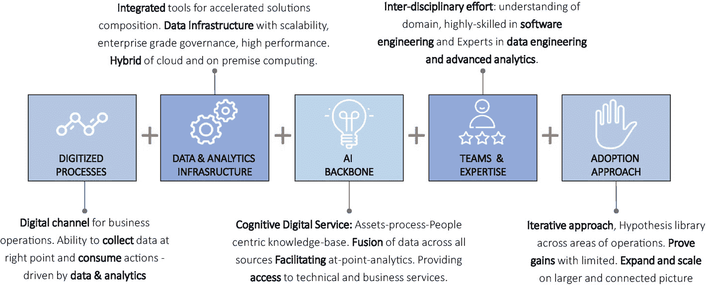

# 三、董事会对 CEO：“你的人工智能战略是什么？”

亲爱的 CEO，人工智能是你最大的威胁，也是你最大的机会，那么你的 AI 战略是什么？

对于许多首席执行官来说，这个问题是一个巨大的挑战。人工智能的话题是如此的多面、炒作和抛物线，以至于很难知道从哪里开始。你有什么选择？

*   你可以收购一家专注于应用人工智能/人工智能解决业务问题的创新技术公司，并获得新产品、服务和人工智能/人工智能人才。

*   你可以投资一些早期人工智能初创公司，了解这个快速发展的技术领域的创新。

*   你可以批准拨款建立内部人工智能能力，并建立一个集中的人工智能 CoE，开始探索如何优化你的内部流程，以及如何将人工智能集成到你的产品、产品和服务中。这个选择将是漫长的，你将需要一个强大的愿景，资金承诺和目的感来吸引和留住最好的人工智能/人工智能人才。

*   您可以使用外部咨询和服务公司来填补您现有业务和 IT 团队中的空白，以启动项目。

这些选项绝不是相互排斥的。相反，你需要对你的人工智能战略采取开放的心态——建设/购买/合作/共同创新可能是选项——但你也需要衡量/学习/实验，然后缩小范围，找出对你的公司有用和无用的东西。

虽然这些选项可能会给你一些关于创建和执行人工智能策略的初步想法，但还有更多。你如何为未知做准备？

现在，回到最初的问题——你的人工智能战略是什么？为了得到答案，首先我们将讨论为什么董事会问这个问题。然后，我们将讨论一个概念框架来简化人工智能，这样你就可以给你的董事会一个深思熟虑的回应。最后，我们讨论你作为首席执行官将如何让你的团队参与到人工智能的话题中，以及在制定你的人工智能战略时的重要考虑。

## CEO:“为什么我的董事会问这个问题？”

为什么董事会现在问你这个？人工智能既不是对当前 IT 系统和方法的渐进调整，也不是购买智能能力和平台并使其成为企业的一部分。人工智能带来了大量的变革能力，贯穿整个企业，影响所有级别的所有角色。这可能会让大多数高管(甚至是经验丰富的 IT 专家)感到非常紧张。

看看十年前发生了什么！DVD 租赁公司、销售 CD 的音乐公司、实体旅游规划和公司、日报、连锁书店都做得很好，并为未来长期盈利做好了准备。互联网发生了，改变了一切。电子商务背景下的便利购物成为一种生活方式，老牌企业失去了相关性。

如今，企业正面临类似的拐点。人工智能正把我们带入未知的领域。人工智能正在帮助机器交谈，驾驶汽车，在危险的条件下进行体力劳动，进行精细的手术，预测我们想买什么，诊断健康状况，管理金融交易，提供安全，等等。AI 无处不在。总的来说，这对我们自己的工作、业务和生活质量都有影响。为了有效地导航这个新领域，企业高管需要理解和考虑一个由五部分组成的人工智能游戏计划。

### 应用 NFL 规则

没有免费的午餐(NFL)规则规定，你不能同时拥有两种方式——你的人工智能不能同时擅长一般智能和狭义智能。不要被你在报纸上看到的东西冲昏头脑(谷歌、亚马逊、苹果、微软、特斯拉等的投资。来开发通用 AI)。你必须专注于识别和解决你的业务和你所在市场的具体问题。这就是你的战略机会。

### 拥抱开放和透明

重要的是要理解并承认你不能自己做所有的事情，因此协作和分享是关键。成千上万的创业公司和其他公司正在试图解决一些非常独特的空白问题。此时此刻，这些解决方案和想法可能不会对你的市场造成破坏；然而，它们可能很快就会成为现实。从战略上来说，你的最佳选择是与初创公司、学术界和各种人工智能实验室一起开发一个包容性的生态系统，并开始利用这一势头开发针对特定市场和客户的专有能力。

### 评估互联世界中的机遇

世界正变得越来越互联——从固定传感器到移动电话到无人机，再到智能可穿戴设备和高度对话式个人助理。这些边缘系统能够看到、听到、理解和做出反应，因此无论您是在实体环境中还是在高度数字化的环境中，都可以创造巨大的机会。自然，当你能够有效地利用这些互联设备，并提出一种独特的商业模式时，最大的人工智能价值创造机会就在那里。

这是一个你应该进入的市场吗？

### 专注于增强智能

我们离创造类似人类的自主智能还很远，所以最好专注于你可以开发增强智能产品的领域，无论是内部还是外部消费。

随着人工智能驱动的自动化开始影响知识工作者的相关技能，批判性地评估您的企业技能规划方法将变得至关重要。不要采取保守的方法来保护工作，你需要评估并做出一些艰难的决定，以使你的人力资本相关(如何在人机集成的场景中共存)，并在各自的业务流程中向价值链的上游移动。

### 关注道德和网络安全

人工智能为解决问题提供了一致和客观的方法。即便如此，它也不能避免偏见。已经有几个人工智能输出显示明显有偏差的结果的例子。因此，你必须密切关注 AI 提出的伦理、法律和社会问题。

## CEO:“我该如何回应？”

先说一下什么是 AI*不是*的一些定义。这是必要的，因为媒体对人工智能的报道并不周到，而且往往是夸张的。

### 人工智能不是机器对人类

在过去的几年里，关于人工智能的猜测越来越多:人类将被机器取代。这是完全错误的描绘 AI 在企业中的图景的方式。正确的愿景是我们如何利用人工智能和增强人类的能力来做我们以前从未想象过的事情。甚至最近媒体对谷歌 DeepMind/AlphaGo 战胜 Lee Sedol 的报道也被戏剧化地描述为机器实现了超级智能，并在他们发明的游戏中击败了人类。更现实的描述可能是“从许多人的经验中学习的机器打败了一个人”。

机器有人类没有的优势:速度、可重复性、一致性、可扩展性和更低的成本。人类拥有机器所没有的优势:推理、经验、适应性和处理各种任务的能力。明智的做法是找到融合人类和机器的正确方法，而不是用机器取代人类。

### 人工智能并不总是关于最好的算法

对许多人来说，人工智能和算法这两个术语有着相同的含义和重要性。最佳算法产生最佳预测。脸书有最好的新闻订阅算法；网飞有最好的电影推荐算法；谷歌有最好的广告投放算法。

无论算法胜过数据还是数据胜过算法，争论仍在继续，但非常清楚的是，算法是人工智能的必要组成部分，但不是唯一的组成部分。

许多领先的人工智能专家现在有一个观点，即大量数据和更简单的数据可以做到这一点，而不是很少或最少的数据和复杂的算法。比起严重依赖花哨的算法，你从收集、清理和理解数据中获得的更多。然而，数据的数量并不重要，重要的是质量。大量的数据是双向的。有时你有足够的数据，即使是效率最低的方法，答案也是清楚的，而且有很多噪音。但其他时候，庞大的数据量需要聪明的算法才能有意义。

图 [3-1](#Fig1) 总结了 AI 在企业中的几个构建模块。前两个模块与数据和基础设施相关；中间的模块是关于算法的；最后两个模块与新技能、人工智能解决方案的采用和反馈回路有关。

图 3-1

企业中人工智能的构建模块

因此，这给我们带来了企业人工智能的工作定义:

AI =训练数据+机器学习+反馈回路

这是首席执行官需要理解的最重要的等式，如果 AI 要成为企业的飞轮。让我们看看这个等式的各个组成部分，考虑一个特定的问题陈述。

假设您想做两件事:1)提高您的服务级别，2)优化您的资源以消除重复性活动。您希望应用您的人工智能解决方案，不仅按严重性级别自动对支持票证进行分类，而且创建一个智能知识库，使您能够进行事件关联、预测票证数量，并自动修复您 100%有把握解决的问题。

#### 培训用数据

训练数据由任何可以帮助解决您正在寻找的问题的数据(结构化、非结构化、半结构化、图像、语音和视频)组成。如果你试图用人工智能改善或自动化的业务流程已经是数字化的，那么完成该流程所需的数据可能已经可用。如果部分数据被标记，这意味着数据具有某些指标，可以用来正确地对结果进行分类，那么你就可以开始训练你的机器学习算法。在我们示例的上下文中，如果我们的数据除了包含有关支持票据的信息之外，还包含一个显示“严重性级别”的指示符，那么我们称该数据集为标签。

#### 机器学习

机器学习只不过是数据的数学表示，帮助您获得可应用于新输入的预测模型。在我们的示例中，这意味着，通过观察大量的支持票证，您可以找出引导您正确确定服务级别的模式。一旦您在培训数据的基础上构建了模型，您就可以向新的支持票证(尚未标记)展示您的模型，以将票证分类到正确的服务级别类别中。当然，这个过程不是一蹴而就的。你必须在各种各样的支持票上训练你的算法。你将不得不继续监控你的算法是如何执行的(多少假阳性和多少假阴性)。你将不得不因为错误的预测而惩罚你的算法，因为它可能导致错误的修正被应用到真实的系统中，带来潜在的灾难性后果。获得的数据质量越高，算法就越精确，预测能力就越强。

为了实现高度的预测，您必须付出持续的努力来获取不同的数据集，包括流程图、系统行为、系统中的用户旅程、可能的根本原因、可以修复任何类型的系统问题的大量脚本、故障排除提示和技巧，以及任何其他有利于您的算法的信息。如果管理得当，维护得当，这个多样化的数据集将成为您企业的智能知识库。

算法相比人类的一个优势就是真实的反映了自身的置信度。众所周知，人类对自己的推理能力和判断过于自信，这取决于人。如果让两个支持工程师自行判断，他们很少会得出相同的结论，除非他们必须遵循标准操作程序，该程序的步骤极其详细。相比之下，算法预测的东西(对或错)总是一致的。

#### 反馈回路

当算法开始对数据进行训练时，它们是从没有经验开始的。他们不知道隐藏在数据深处的模式。他们可以做出预测，但需要有人来验证这些预测。这就是人类经验发挥作用的地方，通过提供反馈、评论，有时甚至推翻机器预测。这是等式中至关重要的第三部分。

到目前为止，我们一直在强调预测技术将如何推动更自动化的决策制定，但同时我们也在说反馈回路很重要，人类经验和学习过程中的参与很重要。这些观点不矛盾吗？可能会出现算法空白的情况。原因可能有很多——它看到的新数据与它在学习过程中接触到的数据完全不同，例如它第一次遇到的某些很少发生或不经常发生的场景在训练数据中不存在。然后，机器客观地评估数据，并得出从机器的角度来看高度准确的预测，但它不知道业务流程和应用中包含的众多业务规则。这就是为什么人类在学习过程中的参与极其重要的主要原因。除非机器的预测得到验证，否则它永远不会达到你可以几乎自动化整个决策过程的信心水平。

## 首席执行官:“我如何调动我的领导团队？”

既然你已经了解了如何将人工智能框架应用到你的业务中，是时候开始与你的高级领导团队合作了。现在是时候制定战略并推动一种混合模型，利用机器的速度和规模来解决定义明确但可重复的任务，而人类则处理更高阶的判断任务。

### 关注结果而不是技术

首先，用对高管来说重要的结果语言，而不是任何新的颠覆性技术带来的技术术语。

让你的领导团队参与进来的一个好方法是问几个问题:

*   我们可以在哪里注入响应能力和预测能力，以更好地提供客户体验、更快地推出新产品或提高我们自己的运营效率？

*   我们今天正在做的哪些活动可以更快、更好、更便宜地以自动化的方式完成？

*   我们想做但由于各种限制(成本、资源或技术)而无法做的新事情有哪些？

*   有哪些事情我们学得太晚，因此不能及时行动？

*   我们应该知道哪些事情会发生——好的还是坏的？

例如，负责客户服务的 SVP 担心“首次正确解决”的下降趋势。您的销售总裁担心“交叉销售/追加销售”的有效性下降，并将此问题与糟糕的客户服务体验联系起来。您负责产品战略的副总裁渴望了解市场脉搏，但无法做到这一点，因为您没有收集和分析相关社交媒体数据、搜索查询数据和品牌资产数据的方法。没有这些数据，你就无法真正理解客户在找什么，在谈论什么。

### 解释人工智能

一旦你确定了对高级管理人员重要的结果，你就可以确定人工智能如何帮助企业实现其业务目标。这就是我们对人工智能的工作定义派上用场的地方。

例如，您的产品战略副总裁和您的 CMO 渴望了解客户脉搏，以便他们能够设计更好的产品，开展有效的活动，并获得更多的市场份额。要实现这一点，你需要人工智能能力来收集和分析社交媒体数据，并进行大规模的情感分析。

现在，单步执行 AI 的工作定义=训练数据+机器学习+反馈回路:

**训练数据**。你需要各种类型的数据:Twitter 上基于#标签和@提及的推文，以及脸书关于你的公司、品牌和产品体验的对话。最重要的是，你需要知道人们对竞争产品的看法，其他与竞争对手战略相关的公开数据，以及任何承诺提供更好的客户体验或使你的产品过时的创新。这些数据大部分是实时的流数据，所以你需要弄清楚如何存储这些数据，在哪里存储，存储多长时间。这些数据也不会是高质量的，并且一开始就没有被标记，所以你必须定义一个过程，通过这个过程你可以清理数据，过滤掉噪音，定义一个你想要使用的情绪量表，并部署一些主题专家来帮助标记。

**机器学习**。现在该谈谈算法了。有了经过筛选的数据集，你就必须定义你想要做什么类型的预测。几种类型的预测与您试图解决的问题相关:

*   *分类*:查看情绪数据，您已经收集了您需要开发的案例，如“积极情绪”或“消极情绪”。分类算法将帮助你扫描大量数据，得出结果的类别。

*   *细分*:如果你的目的是识别那些表达过积极情绪、最有可能对你的提议做出回应的人群，那么聚类算法就会发挥作用。

*   *回归*:如果你的目的是得出一个潜在的数字(可能是收入的增长，或者是你能够按市场/地理位置销售的产品数量)，那么你需要运用回归算法。

*   *预测技术:*如果你想了解隐藏在数据中的各种时间和季节或其他外部影响，并想创建预测(可能是关于活动对销售的影响)，你需要求助于预测算法。

还有更多算法变体在发挥作用，包括深度学习和神经网络。然而，为了简洁起见，我们在这里采用了简单算法的例子。

**反馈回路**。无论你的算法有多优秀，你都必须让预测结果具有可操作性。人们开始使用预测建议的唯一方式是他们理解输出的原因和方式。简而言之，你的算法不能表现得像个黑盒。输出需要是可解释的，人们需要在验证输出时具有灵活性，因此有助于改进和丰富预测能力。

一旦你的高级管理人员明白这不会一直是机器的方式，他们就会更加欣赏人工智能如何在企业中增强人类技能。

### 评估人工智能平台

看到企业 It 领域充斥着许多支持业务应用和 IT 管理应用的供应商产品并不奇怪。企业 IT 架构师和企业标准组织的自然反应是减少 IT 领域的熵。这意味着引入工具和技术，以及另一个漫长的评估、商业谈判、合同和认证过程。管理供应商风险和保护企业免受供应商锁定是每个 IT 领导者的首要任务。人工智能作为一种新的快速发展的技术，也有其合理的技术架构和组件(无论是内部还是云上)。具有挑战性的部分是，即使你的经验丰富的 IT 领导人将努力阐明这项技术的发展方向。

你的 IT 领导者将需要一只援助之手来专注于相关的事情(已经有很多厂商对他们的 AI 平台能力提出了很高的要求)，而不是经历一个永无止境的评估厂商的阶段。您应该向您的 CIO/CTO 同事寻求支持，对市场上可用的工具进行广泛的评估。你还应该要求他们描述初创公司，以了解他们试图实现的目标，很多时候与初创公司的合作方式可以达到目的。这对你来说在商业上不那么费力，对你的团队来说更有动力，因为他们将参与尖端技术和创新想法。

以下三个因素值得额外关注，特别是对于声称提供人工智能解决方案的供应商。

### 单一领域与通用领域

一些供应商已经深入到一个特定的领域(制药临床试验或零售多渠道的超个性化或金融犯罪场景中的欺诈检测)。一些供应商选择专注于技术能力(物联网、图像识别、NLP 和深度学习)，而其他许多供应商选择构建通用平台(您可以摄取任何类型的数据，可以通过使用流行的机器学习技术生成见解，并且可以通过多个消费渠道分发您的见解)。这些厂商不一定专注于任何特定的人工智能子领域，如文本、图像、音频、视频、深度学习等。

很难说哪种方法比另一种好。这完全取决于你要解决的问题的类型。然而，企业的自然选择不是为课程选择马匹(为他们认为合适的多个用例选择多个工具)，而是合理化他们管理的供应商数量，以便稍微偏向通用平台，如果通用平台能够满足不同功能的业务需求(这是一个很大的假设)。

### 黑盒对白盒

算法也有态度。有些很简单，不声不响地完成工作，很容易解释(决策树、线性回归、逻辑回归、朴素贝叶斯等)。).其他算法(尤其是基于神经网络的新一代算法)复杂、多变，并且极难理解。许多算法甚至无法向构建它们的数据科学家解释它们的结果，更不用说向最终用户解释了。它们就像黑盒一样运行，在黑盒中，你无法真正检查算法是如何完成它正在完成的任务的。最近的几个例子——比如谷歌照片将一对黑人夫妇的照片误标为大猩猩，以及亚马逊书商机器人互相竞价，直到一本书的价格超过 2300 万美元——在我们心中产生了信任问题。

我们解释机器学习算法的真正意思是什么？关于我们从算法中获得的预测，我们通常假设算法已经做了功课，使用了所有正确的推理，并且我们基本上要求算法足够透明，以便我们可以看到它用来得出预测的推理过程。

对于您的组织来说，在黑盒子和白盒子之间做出选择是一个重要的决定。任何人选择白盒方法都有显而易见的原因，但也有一些暗示。过多地摆弄算法的内部工作以使其透明会使算法运行缓慢，并会在你的自动化决策过程中产生瓶颈，因为即使是简单的预测相关问题也需要太多的人工参与。

### 单点解决方案与集成平台

商业上可行的人工智能平台需要整合三个关键组件——训练数据、机器学习和反馈回路。只要你具备这三种能力，你就应该是优秀的。一些供应商专注于一些特性，例如连接到任何类型的数据源和系统(包括设备)的能力，然后提供一个完全开放的画布来完成您的 ML。这是通过编程密集型语言(如 R 和 Python)或利用拖放功能(如 Azure ML、Spark ML、AWS ML 等)来实现的。其他供应商通过 Spark、Scala 和 Python 主要关注数据工程方面，然后将 ML 留给您选择的技术来完成。

这是你的选择，你想怎么做。

## CEO 的新管理原则:人工智能管理

总而言之，每位首席执行官都想留下一份遗产。那是什么意思？这一切都是为了领导和激励人们，建立一个为未来做好准备的企业，因此他们不喜欢将关键的业务决策委托给智能算法，也不喜欢智能代码推荐管理技巧，这是很自然的。在我们这个时代一些世界上最成功的公司(谷歌、亚马逊、阿里巴巴和脸书)中，算法正越来越多地扮演决策角色——从董事会到销售和营销到运营再到招聘人才。首席执行官们应该在他们的最佳实践中再增加一条管理原则——授权算法。精英 MBA(人工智能管理)正慢慢成为新常态。

这是一个棘手的情况，因为走得太远，把一切都留给算法来管理，会在公司的普通员工中造成不安，而对算法做得太少不再是一种选择。因此，需要有才能的人类和精英 MBAIs 的正确平衡。另一个重要的问题是明确界定权力和责任——共存和授权的内容、方式和原因。首席执行官需要按照 RACI 矩阵(责任、问责、贡献、信息)的思路建立一个框架，以清楚地阐明谁负责做什么，以及何时有才华的人必须服从算法判断，何时算法必须需要人的验证。

“不安全感”的另一个方面使得人机协作的整个场景更难实现。比如说，对自动化复杂的业务流程以改善供应链功能或效率非常低的特定地理位置运营表现出热情和承诺的领导者，会对深度学习算法决定其业务战略、新市场探索和资本支出规划的前景望而却步。算法成功的影响比失败的风险更让他们害怕。

例如，您的数据科学团队与来自采购和供应链部门的领域专家合作，开发了一种算法，通过各种衡量和模拟，该算法证明您可以节省数亿美元，并将使您的公司对市场动态的响应速度比您现有的面向批量的流程快 10 倍。你为什么不相信这个出色的人工智能解决方案？这就是挑战所在。

当计算机变得无处不在，信息技术成为商业的支柱时，首席执行官任命首席信息官和首席技术官来帮助公司组织他们的技术格局、信息管理架构和业务应用。随着技术的成熟，尤其是当每个企业都变得数字化时，CEO 们任命 CDO(首席数字官)来实施和管理他们公司的数字战略。现在是时候说同样的话了，关于人工智能在公司未来准备中可以发挥的变革性作用。首席执行官们应该认真考虑任命一名 CAIO(首席人工智能官)。

人工智能仍在不断成熟，因此有理由接受这样一个事实，即并非所有高管都完全理解人工智能在企业环境中的好处和意义。但是，想想看，如果你的公司从事产品/服务业务，并处理大量数据(无论是内部还是外部，这都无关紧要)，那么人工智能很有可能被用来将这些数据转化为价值。有数据但缺乏深度 AI 知识的公司，就像你之前任命 CIO/CTO 一样，现在需要任命首席 AI 官。如果你已经有首席数字官或首席数据官，或者如果你有一些具有前瞻性思维的首席信息官，你可以扩大他们的角色，也研究人工智能。

更成熟的组织有一个首席数据官，负责集中的数据科学职能，但更常见的模式似乎是分散的模式，数据科学家分散在组织的不同职能部门中。

在分散的场景中，一家公司中的数据科学家的技能组合不可避免地会有很大差异。一些人将拥有高级机器学习背景，而另一些人将从软件工程师或数据分析师发展到数据科学角色。那些拥有高级机器学习技能的人可能不会对黑盒方法感到满意，在黑盒方法中，算法如何工作并不透明，他们也无法微调参数权重。在考虑只有黑盒的解决方案时，请记住这一点。

AI 本身不是一个产品，也不是一个业务单元；它是一项基础技术，可以帮助现有的业务线，并创造新产品或业务线。因此，要成功地将人工智能引入企业，需要对你当前的业务有大量的了解，并需要与不同的业务单位或职能团队合作。你需要一个能展现企业家特质的领导者。随着人工智能的快速发展，你的团队需要跟上变化。他们处于人工智能的前沿并不重要。重要的是选择一条进化的道路。您的数据科学家、数据工程师和高管团队需要跨职能工作，并具备商业技能来找出如何开发和实施与您的企业和业务目标相关的 AI 解决方案。

首席人工智能官需要对人工智能和你公司的数据基础设施有很好的技术理解，必须有能力跨业务职能和执行领导人协同工作，最重要的是应该有信誉来吸引和留住人工智能人才。

### 首席执行官的使命:让人工智能民主化

首席执行官人工智能战略的另一个最重要的方面是在整个组织中广泛使用人工智能技术，特别是那些在管理和运行业务功能方面有丰富经验，但在使用最新技术领导决策时不知所措的人。称之为“AI 的民主化”。为了实现这一目标，该公司需要做几件事:开发自己的人工智能平台，跨业务职能进行广泛的设计思维会议，重新培养员工的技能，以了解预测技术如何工作，以及它们如何在日益增长的人机世界中共存。

从长远来看，你的员工将获得足够的知识和技能，开始开发自己的人工智能应用，以更快、更好、更便宜地完成工作。例如，您的营销团队将能够将自然语言处理的小部件与其他组件连接在一起，以创建一个从社交媒体数据中收集和分析非结构化数据的应用。或者，您的销售团队将能够分析庞大的客户数据集，以预测哪些潜在客户最有可能转化为客户，或者发现关于客户行为的见解，并改进不同产品和服务的设计，从而提高交叉销售/追加销售的能力。

人工智能的民主化还将允许您的生态系统合作伙伴共同开发平台，带来强大的协作能力和简化的流程编排，跨越组织边界。想想电子表格是如何帮助数据分析民主化的，甚至让夫妻店也能进行无价的“假设”分析。

很明显，“人工智能的民主化”是所有企业都需要做的战略任务，以创造可持续的竞争优势。

## 结论

人工智能是一个长期趋势，将影响我们家庭和工作生活的方方面面。我们正在进入一个巨大的语义网世界，在这个世界里，一切都是相互联系的。纯粹用算法规范说话，我们的位置是属性，我们的情绪是属性，我们的面部表情是属性，我们的声音是属性。云、移动、社交媒体、大数据、人工智能以及现在的区块链的超级融合使公司能够在消费者对消费者和企业对企业领域积极探索、创新和推出颠覆性商业模式和超级智能产品。在这种背景下，董事会向首席执行官询问人工智能战略是恰当的。企业人工智能是关于构建、部署和管理智能参与系统的。它不仅仅是手工作业的自动化。因此，作为首席执行官，你的任务是为你量身定做的。你需要有一个清晰的愿景:

1.  *将人工智能确立为一项业务能力* ty:人工智能太重要了，不能留给少数实验或一次性的人工智能概念证明或 IT 团队来开发技术。重点不是发表一份年度报告，你也可以像许多其他人一样，说你正在探索人工智能。首席执行官们应该问:人工智能的可能艺术是什么？

2.  在公司内部民主化 AI*:渐进主义不会改变公司。采用“点对泡沫”的类比来得出你的公司应该如何处理人工智能用例，不仅要在市场中脱颖而出，还要在公司内部实现人工智能的民主化。*

**   *采用快速学习方法*:采用 10/10/10 方法:10 小时确定用例，10 天构建数据管道，10 周实现人工智能功能。首席执行官们必须鼓励学习和尝试的文化。这需要一种敏捷的方法，在不到 90 天的时间内从概念到能力。

     *   *将人工智能项目作为* *自上而下的计划来驱动和管理*:领导层必须将人工智能视为自上而下驱动的业务需求，而不是自下而上驱动的技术诀窍驱动和实验型项目。

     *   *建立一个* *生态系统来利用*:六大技术的高度融合意味着公司需要一个合作伙伴生态系统来解决所有的关键技术。

     *

 *如果你的董事会没有问你这个问题呢？如果你的董事会不关心公司的人工智能战略来推动新的商业模式或新产品和服务，也许你需要考虑改变董事会的组成！在这个快速变化的商业和市场环境中，没有第二次机会。你绝对需要你的董事会理解并在质疑你的战略、技术投资和员工再培训计划时发挥关键作用，这些都是你公司未来所依赖的。

在下一章中，我们将讨论人工智能的基础知识(人工智能的稍微技术性的方面)和相关的忧虑，尽管它有明显的优势。

## 参考

1.  [T2`https://hbr.org/2017/03/the-trade-off-every-ai-company-will-face`](https://hbr.org/2017/03/the-trade-off-every-ai-company-will-face)

2.  [T2`https://www.mckinsey.com/business-functions/digital-mckinsey/our-insights/digital-blog/what-every-ceo-needs-to-know-to-succeed-with-ai`](https://www.mckinsey.com/business-functions/digital-mckinsey/our-insights/digital-blog/what-every-ceo-needs-to-know-to-succeed-with-ai)

3.  [T2`https://hbr.org/2017/08/a-survey-of-3000-executives-reveals-how-businesses-succeed-with-ai`](https://hbr.org/2017/08/a-survey-of-3000-executives-reveals-how-businesses-succeed-with-ai)

4.  [T2`https://www.cio.com/article/3167964/artificial-intelligence/building-the-predictive-enterprise-what-cios-should-tell-ceos-about-ai.html`](https://www.cio.com/article/3167964/artificial-intelligence/building-the-predictive-enterprise-what-cios-should-tell-ceos-about-ai.html)

5.  [T2`https://www.crowdflower.com/ceo-cio-whats-ai-strategy/`](https://www.crowdflower.com/ceo-cio-whats-ai-strategy/)

6.  [T2`https://hbr.org/2017/01/4-models-for-using-ai-to-make-decisions`](https://hbr.org/2017/01/4-models-for-using-ai-to-make-decisions)

7.  [T2`https://hbr.org/2016/11/hiring-your-first-chief-ai-officer`](https://hbr.org/2016/11/hiring-your-first-chief-ai-officer)*