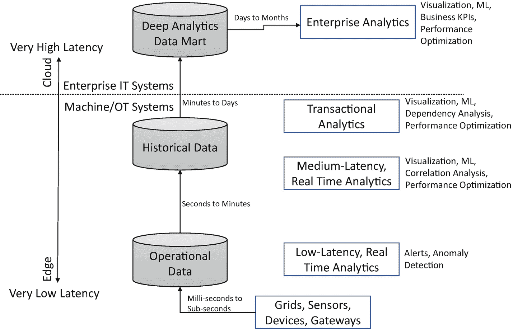
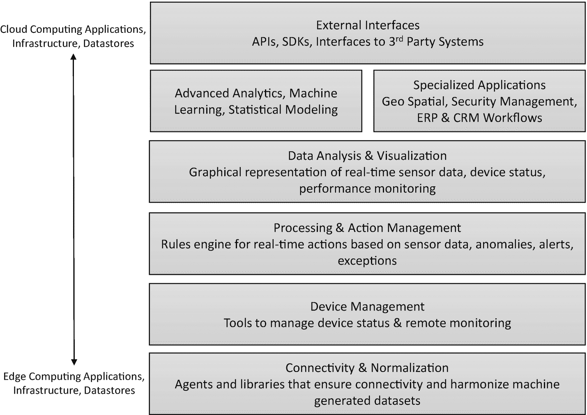
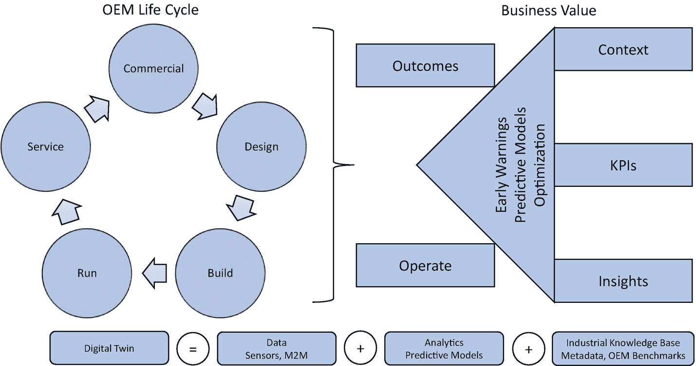
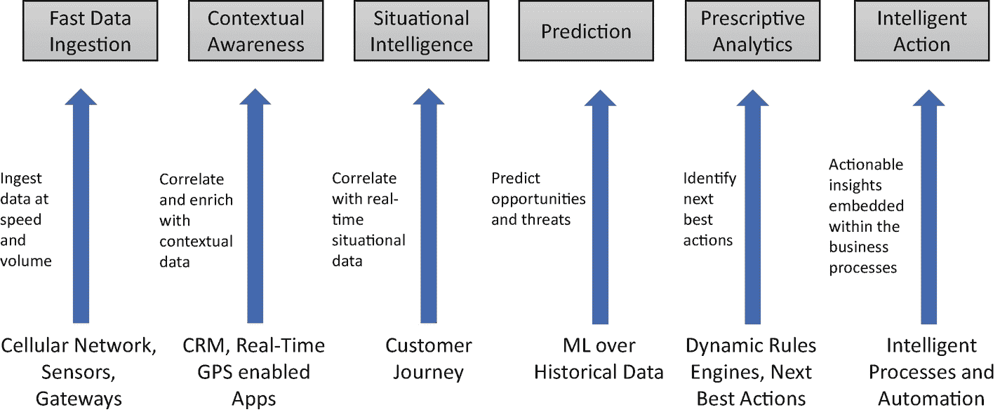
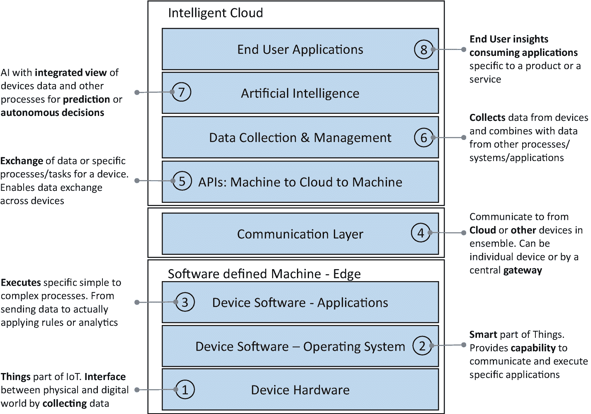

# 七、物联网智能 = 物联网 + 云 + 人工智能

有了物联网(IoT)和人工智能，一个是使能者，一个是颠覆者。这两种技术都在改变着商业和生活。

物联网(IoT)是一个嵌入了传感器和连通性的物理对象网络，以便它们可以与网络中的其他连接设备交换信息。简而言之，物联网就是将惰性物与一切事物连接起来，使其变得“智能”，甚至更智能。听起来确实如此——有互联网的东西！你拿起任何物体，在里面嵌入传感器，附上一个独特的数字追踪器，然后使它能够在没有人类互动的情况下发送和接收信息。你有你自己的东西。

当物体可以感知和交流时，它改变了决策的方式和地点。廉价的传感器、改进的无线连接和云计算的可扩展性都使得经济高效地收集和处理大量数据、分析数据并即时采取行动成为可能。因此，我们周围的一切(动画，非动画)都变得互联和智能。如果将物联网的概念扩展到制造业、供应链管理等工业场景，就得到工业物联网(IIoT)。如果将物联网的概念延伸到我们日常生活中的个人消费场景如可穿戴设备、家电、个人助理、智能恒温器等。，你得到消费者物联网。

据预测，物联网(和 IIoT)将带来下一代大规模智能运营。例如，以一个像工厂一样的高度机械和物理密集的设置为例。它可以转变为一个“智能工厂”，机器(“智能资产”或“智能机器”)能够相互“交谈”，并根据它们收集和交流的数据独立于人类干预“做出决策”。结果呢？缩短生产时间、提高成本效益、减少浪费和一流的质量。

物联网不仅适用于 M2M(机器对机器)通信；它扩展到任何需要人、过程和机器(虚拟和真实世界)之间紧密集成的任务。

光有物联网，我们可以和机器说话，听机器说话，但要理解机器并让它们变得智能，我们将需要人工智能。人工智能为我们提供了从通过物联网收集的大量数据中学习和推断模式的能力。

当我们把 IoT 和 AI 结合起来会发生什么？从机器到工厂到汽车到可穿戴设备到厨房到建筑，等等，一切都是一步一步的转变。

让我们探索几个场景，以欣赏物联网和人工智能相结合的变革力量。

## 让家居和建筑变得智能

智能家居通常由一个中央控制单元(可能是物理的，也可能是云上的)组成，它从分布在家中的各种传感器中读取信息。运动传感器、温度传感器等每秒都会产生信息，并将其发送到中央单元。中央单元根据这些传感器发送给它的信息做出决定。所以，整个家都是互联的，智能的。

*   放置在冰箱里的接近传感器感应到里面的存货，并将数据发送到中央单元。中央单元处理数据，并根据您的消费模式在线下达补货订单。

*   房子里的运动传感器包括面部识别功能，可以识别小偷，并通过向附近的当局发送信息做出相应的反应。

*   温度传感器根据室外的天气来保持室内的温度。

*   功耗传感器会跟踪使用趋势，并根据房间中是否有人来自动打开或关闭设备/灯。

## 让你的车跑起来

想象一下，你的汽车安装了各种传感器，传输关于磨损、发动机性能和你自己驾驶模式的数据，一切都通过物联网网关收集并推送到云端。运行在云上的 AI 不断分析这些数据，并生成预测。当 AI 认为汽车需要维护时，它会联系你的 Alexa，Alexa 会检查你的日历，并与你最喜欢的机械师交谈，以找到最早的合适时间表，然后要求你口头确认。你永远不会忘记你的车急需保养的事实。

## 保持电源接通

说到电力供应，我们受限电的影响比停电更大。停电是指影响大面积区域的完全电力损失，而当需求突然激增迫使您的公用事业公司降低一些区域的线路电压以更好地管理需求和供应时，就会发生限电。限电的意外后果是电压波动，这会严重损坏电器。

现在考虑一下家用恒温器，它可以感知环境和温度模式，并将数据实时传输给公用事业公司。如果是异常炎热的一天，有可能出现限电，云上的人工智能系统可以看到有多少设备正在运行，然后主动将恒温器调高几度，同时在医院等对温度敏感的设施中保持恒温器稳定，从而避免限电情况。

## 确保你活着

苹果手表不仅仅是身份的象征。你的可穿戴设备不仅仅可以读取你的心率，确定你今天走了多少路。想象一下，当你的可穿戴设备检测到你可能心脏病发作时，它会向人工智能系统发送警报。人工智能系统收到警报，然后通过实时触发几个动作进入任务关键模式。它会将您的位置数据发送给最近的救护车，通知最近的医院提前做好准备，提醒您的医生，并推荐到达您或医院的最快和最短的路线。将人工智能加入物联网可能意味着让你活下去的关键时刻。

## 确保你的安全

我们关心我们所爱的人的安全。这是我们竭尽全力保护我们家园的主要原因。我们在周边安装闭路电视摄像头和入侵检测系统，这些系统连接到执法机构的控制室。想象一下，如果来自闭路电视摄像头和入侵检测控制系统的数据不断被推送到云端，那么人工智能系统不仅会实时评估情况，还会应用视觉识别算法，通过检查罪犯数据库来正确识别入侵者，并指导执法人员采取下一步最佳行动。

当然，所有这些例子都存在数据隐私问题。然而，一些人认为好处明显大于风险。

物联网、云和人工智能的影响结合在一起，需要生动的想象力。我们可以将这些技术的变革力量应用到几乎任何事情上。

## 物联网、混合云和人工智能协同工作

前面讨论的例子无疑是引人入胜的。但关键问题是，你如何构建这种集成的应用？什么是技术构建模块？

如果没有一个支持的平台和架构，物联网和人工智能的融合是不可能的。这就是混合云介入的地方。所有公司都展示了一种独特的技术格局，这种格局是为满足各自的业务需求和增长而构建的。混合云是一项颠覆性技术，同时也是一个商机。要理解这种颠覆，需要更深入地理解涉及混合云、物联网和人工智能的融合架构。

我们周围到处都有收集和传输数据的设备。必须快速分析所有这些数据，以便采取下一步最佳行动。当有延迟时，数据就失去了价值。这种零延迟要求需要最接近源头的难以置信的分布式收集和存储能力。这意味着物联网的边缘必须展现出解析和分析流数据的即时能力，以便采取下一步最佳行动，同时将大部分数据推送到云中进行更深入的分析。

另一方面，人工智能需要巨大的计算能力来处理海量数据。速度和性能是人工智能系统的额外考虑因素，因为人工智能做出的决定需要快速反馈到物联网设备，以使预测具有可操作性。

以下列表解释了几个突出 AI 特定要求的示例:

*   自动驾驶应急响应车辆可立即响应拯救生命的搜救行动，如洪水、火灾等。

*   医疗设备可以自动除颤，并向最近的医院发送警报通知。

*   金融犯罪检测系统包括信用卡刷卡。

*   流媒体视频服务的点播推荐。

*   苹果的 Siri 和亚马逊的 Echo 在边缘给出即时响应。

在工业需求和消费者需求方面还有更多例子。在所有这些例子中，有一点是共同的，人工智能需求不仅涉及大量数据，还涉及实时决策(见图 [7-1](#Fig1) )。

图 7-1

物联网的数据价值链和决策延迟

物联网收集的数据可以提高 AI 的预测能力；然而，价值链中有许多任务(从来自设备的原始数据到预测，再到结果)需要很好地协调以交付最终结果。图 [7-2](#Fig2) 显示了组成物联网分析平台的不同组件的概念视图。

图 7-2

物联网分析平台组件

虽然仅仅做物联网本身就具有变革性——至少你将获得对你的操作和机器性能的完全可见性，并且你可以做出决策——但要变得具有预测性，你需要人工智能能力与物联网和云协同工作。

### 避免代价高昂的计划外停机

设备故障导致的计划外停机代价高昂。通过将机器学习算法应用于机器生成的传感器数据，我们可以提前预测设备故障。然后，人工智能系统可以向现场操作员发出警报，并安排维护程序。

### 提高运营效率

在工厂里，装配线操作要求精确和严格的质量控制。以生产过程中的溢出为例。泄漏量每减少 1%，就意味着可以节省数千美元。通过使用物联网和机器学习，公司可以显著减少泄漏。嵌入在机器中的传感器捕获的数据流可以在边缘进行实时分析，从而向人类专家发出警报，以控制溢出。

### 实现新的和改进的产品和服务

物联网与人工智能相结合，可以为改进产品设计奠定基础，在某些情况下，甚至可以将全新的产品和服务概念化。例如，通过分析机器性能数据，我们可以帮助发现模式并获得运营见解-机器如何工作，它是否能够根据设计规格运行，真实世界的使用情况是否与设计期间考虑的使用情况不同，是否有机会推出新的产品系列，等等。

### 加强风险管理

许多将物联网与人工智能相结合的应用正在帮助组织更好地了解风险，并为快速响应做好准备，更好地管理工人安全和网络威胁。

例如，通过在可穿戴设备上使用机器学习，我们可以监控工人的安全并防止事故发生。银行已经开始评估人工智能实时识别 ATM 联网监控摄像头的可疑活动。汽车保险公司已经开始利用联网汽车的远程信息处理数据进行机器学习，以准确定价基于使用情况的保险费，从而更好地管理承保风险。

## 人工智能在工业 4.0 中的作用

围绕工业 4.0 的普遍观念是连接每一项资产，创造数字环境。这不完全是真实的状态。工业 4.0 与其说是革命，不如说是进化。要达到理想的成熟度水平，您需要经历几个阶段。第一阶段从将所有资产连接在一起开始，包括仪器、连接和数据收集。下一阶段是找出如何从所有这些数据中找到意义。最后一个阶段是将自动化引入整个生命周期。制造敏捷性是工业 4.0 成功的关键，人工智能在整个“创造、制造和交付”价值链中发挥着关键作用，以优化和改善每个流程，从而在任何外部环境下实现最佳结果。

工业 4.0 的谈话总是转向几个技术:边缘计算、云计算、人工智能、物联网、平台等。尽管这些技术都有各自的作用，但最关键的部分是其数据和预测能力。

## 数字双胞胎

现代制造公司正在利用物联网平台从他们的机器和其他来源捕获数据，以创建“数字双胞胎”，这是一个实际的物理对象的数字模型(见图 [7-3](#Fig3) )。数字双胞胎使我们能够将机器的实际操作可视化。机器上的传感器将数据传输到其数字对手，模拟运行中的物理机器，然后机器学习算法分析数字传输的数据，以优化产品性能，并为物理系统推荐下一个最佳行动。借助 digital twins，我们有能力预测物理世界场景、优化资产性能、降低维护成本、减少停机时间 SLA，并探索数据货币化和构建新服务产品的机会。

图 7-3

数字双胞胎的概念视图

从本质上讲，数字孪生是物理系统、数字镜像和连接它们的底层数据的融合。

数字双胞胎如何带来变革性的业务成果？

首先，数字双胞胎——或者更确切地说，物联网、云和人工智能的融合技术——提供了优化流程和有效利用机器和资源的可能性。虽然这些解决方案主要旨在降低生产成本，但客户希望最终产品包含增值服务，如仪表板、使用模式、维护警报等。

第二，智能设备获取关于产品在客户所在地的实际使用情况的大量数据。当您在您的客户群中分析这些宝贵的数据时，您将不仅能够推断出单个客户的客户群模式，还能够推断出其他客户如何使用它、他们有多成功、他们面临哪些挑战，以及是否存在推出新产品或增值服务的空白机会。

第三，因为现在你不只是销售一台机器，而是“机器即服务”，你可以改变整个商业模式，在这种模式下，如果你能保证他们的产品和服务的质量，你的客户不会介意保险费。借助 digital twins，您可以测量机器的健康状况和性能。您能够远程管理这些机器的使用，并预测可能的停机。您可以监控机器利用率，并推荐更好的产能规划和生产计划等。所有这些见解意味着您实际上可以在客户的业务成果中发挥更大的作用，如果您能够致力于减少停机时间 SLA，您的客户肯定会愿意向您支付额外费用。

你将如何为你的企业创造一个有利可图的数字孪生战略？

如果你纯粹是一家工业制造公司，你有三个选择:

*   *成为推动者*:开始开发物联网技术并将其嵌入到您的产品和服务中，例如端点网络、边缘计算和云基础设施。这将使您能够向客户交叉销售 digital twin 组件并获得市场份额。然后，您的客户必须借助外部帮助来构建内部能力，以构建与他们相关的数字双胞胎。然而，值得警惕的是，这个市场将被少数全球巨头所主导，这些巨头能够以极低的成本提供整个堆栈。

*   *成为参与者*:除了制造配备传感器和计算能力的世界级产品，您还可以参与设计、创造、集成和向客户提供增值服务。增值服务可以像添加实时仪表板、历史机器性能趋势、基于阈值的警报通知等。这些产品可能不会给你带来明显的优势，因为传统的软件公司专门提供这样的能力；然而，你肯定能够通过在物理机器上提供数字服务来发展客户亲密度。

*   *成为增强者*:这里的目标是提供丰富的最终用户参与，并利用来自客户自身和第三方来源的数据提供新的服务。这就是数字双胞胎、数据货币化和新收入模式发挥作用的地方。增值产品需要针对特定的机器和特定的行业，以提高其他人复制的门槛。

## 你的智能策略是什么？

涉及人工智能和物联网融合的用例发展如此之快，以至于在很短的时间内，几乎所有“哑”设备都必须变得智能。

对于您的智能物联网架构，请记住以下几点:

*   将会有许多 IOT 设备的集合，它们需要在整个组织中进行通信和协同工作。根据产品和服务的不同，这种组合可能是一个人(带可穿戴设备或个人设备)、一所房子、一辆车、一个项目或一家工厂。

*   设备的数量和制造商的数量将激增。因此，没有标准的方法来实现机器对机器的通信。因此，选择正确的云合作伙伴至关重要，这样设备才能以机器到云到机器的迂回方式协同工作。还需要建立设备的“标准化”。

*   为了实现预测和自主决策的全部潜力，需要跨物联网和其他企业数据源的数据以及天气模式等外部数据的集成视图。

同样，在确定物联网、云和人工智能的创新机会时，需要记住以下几点:

*   *客户体验*:通过重新想象客户如何使用产品或服务，以及如何为客户创造、分配、消费和服务最终价值，确定客户体验方面可能的创新。是否有机会通过收集新数据、增加现有流程数据的组合以及创建新流程和合作关系来改善客户体验？

*   *产品和服务*:通过利用物联网、云和人工智能的组合(基础设施、流程、政策和人员的组合)，确定产品为用户提供更多价值的可能机会。想象产品的新功能或增强现有功能，以实现更好的性能。这更多的是关于功能和外形，而不是支持技术。

    在服务方面，确定服务的机会和客户的最终消费，即如何、什么以及何时提供和消费服务。想象一下，如果一个产品被转化为一项服务。

*   *使能技术*:使能技术的创新不一定是特定于某个产品或服务，而是更多地采用技术来提供重新想象的客户体验、产品、服务和业务模式。这就是需要仔细评估物联网、人工智能和云的组合及其对您特定业务的采用的地方。

*   *商业模式*:通过将所有这些整合在一起，确定增强当前商业模式的机会，从而为现有客户(或全新客户群)创造和交付价值。想象一下，通过采用和实现物联网、云和人工智能的技术组合，新的或增强的产品和服务将带来新的客户体验。

图 [7-4](#Fig4) 展示了跨行业的 AI 和物联网融合用例。

图 7-4

物联网分析价值链

这里有几个特定行业的例子。

*   *飞机*:对于航空公司来说，零停机时间意味着更高的收入。今天，飞机发动机制造商正在安装数百万个传感器，主要目标是不仅了解飞机在每次飞行中的表现，而且预测发动机的磨损。结果呢？更高的安全性和更少的停机时间。

*   石油钻塔:用于钻井的机器是资本密集型的，因此石油公司必须不断改善他们的运营成本。当这些机器发生故障时，公司会遭受巨大的损失，但是让昂贵的机器处于备用状态在经济上是不可行的。解决办法？让机器变得智能，以便可以持续监控和分析它们的利用率、性能和状况。预测性维护和基于条件的监控显著降低了运营成本。

*   制造业:制造商正在投资使他们的工厂和车间智能化，这样他们的机械和装配线就可以在未来创造自主工厂。

虽然在一端，物联网、人工智能和云的融合使企业在 B2B 和 B2B2C 领域具有更强的价值主张，但企业需要意识到几个挑战，特别是在管理数据量、速度和多样性的背景下。每一次颠覆都创造了以前不存在的新的机会和市场；然而，你需要评估什么与你的行业相关，并定义你自己的物联网战略，而不是冒险一试。

## 发展物联网战略的最佳实践

### 发展并阐明你自己的价值主张

物联网和人工智能相结合，提供了广泛的变革机会。然而，在屈服于将传感器放入一切事物并期待奇迹发生的诱惑之前，您需要仔细评估用例。物联网作为一种技术还在不断成熟；连接一直存在问题，恶劣的天气条件可能会导致传感器损坏或出现故障。他们也可能由于电力波动而停止响应，因此您的物联网计划的成功取决于您对空白空间、市场上可用的补充技术以及您正在解决的问题的评估程度。

你需要对行业中的大趋势和竞争力量有一个很好的理解。对于物联网在您所在行业的应用，分析师们有什么看法？客户在价值链的哪个环节感到沮丧？如果做出响应，哪些额外数据或事件将显著改善客户体验？利用这些数据点，您需要为您的物联网计划开发自己的 SWOT 分析和业务案例。

### 评估客户需求

对于任何企业来说，获得尽可能多的关于客户需求的细节(明确的或隐含的)是至关重要的。在物联网的情况下，作为一个未知的领域和新奇的事物，你需要超越典型的客户调查类型的方法，并采用广泛的技术，如客户角色和客户旅程，以制定将在市场上被广泛接受的产品和服务的路线图。

### 进行价值链分析和盈利能力分析

下一步是对你的行业进行价值链分析和盈利能力分析。不要狭隘地看待你的业务，你应该放眼整个行业。在某些情况下，这可能会导致多样化，以创建一个全新的业务线，但这是形成竞争优势和差异化的关键。

### 与合作伙伴协作

如果你认为自己有能力独立完成所有的事情，这种想法和行为是愚蠢的。技术在快速发展，客户需求每天都在变化，市场趋势也有重大影响。了解您所在市场的解决方案提供商并监控他们的进展和挑战非常重要。该图将为您提供足够的清晰度，以便您在能够以更低的成本加快上市速度的场景中进行协作和合作。

### 评估技术并进行匹配差距分析

市场上有许多供应商和解决方案。有些很窄，但做得很好，有些很宽，为尝试新事物提供了更大的灵活性。了解所有这些产品并针对您的目标和目的进行合适差距分析非常重要。如果您的组织是联网设备领域的新手，那么您的成功在很大程度上取决于您能够多快启动试点项目并为业务职能建立 ROI。

物联网、人工智能和云是快速发展的技术，因此你的技术架构需要灵活和组件化。在整个架构中，组件今天可能看起来成熟度较低，但是明天它们将达到足够的成熟度，或者一些组件可能完全过时。因此，关注技术趋势是很重要的，包括它们发展的速度，还有哪些补充技术正在发挥作用，以及它们的成本效益如何。

我们列出了您需要关注的几个重要领域，以制定涵盖数据、分析、建议、性能和总体成本效益的强大技术路线图。

例如，在“见解”下，回答如下问题很重要:

*   哪些数据会让你清楚地了解你的产品使用情况和性能跟踪？

*   哪些数据对您的业务职能有价值？

*   哪些数据会丰富客户体验？

*   为了提供这些见解，您还需要收集哪些数据？

分析问题可能包括以下内容:

*   如果将哪些见解嵌入到您的产品/服务/流程中，会使您的公司对客户或市场情况做出更快的反应？

*   “数学”会有多复杂？一定要买优化库或者深度学习库之类的专门的包吗？

*   你将如何管理这些洞察力？

性能问题可能包括:

*   什么是数据处理性能标准？

*   不在边缘进行数据处理的后果是什么(相对于将一切都转移到云)？如果云是答案，你会丢掉几个关键动作吗？

*   你希望你的报价有多实时？

操作要求问题可能包括:

*   您将关注哪些操作条件(温度、湿度、压力、通道和振动)？

*   您将为哪些不同的场景启用安全性和访问控制？其余的您将留给客户具体询问。

当您构建技术路线图时，您需要戴上务实的眼镜。简单地创建一个智能解决方案不会给你带来成功，尤其是如果构建这样一个解决方案的成本超过了商业和实现的容易程度。

### 构建您的物联网路线图

一旦你完成了所有提到的活动，你将拥有开发你的物联网路线图所需的所有组件(见图 [7-5](#Fig5) )。该路线图将帮助您规划时间表、计划、试点、变化和预期结果，并与公司内的利益相关方、合作伙伴和员工进行沟通。

图 7-5

多层智能物联网架构

制定路线图的最佳方式之一是采用亚马逊的飞轮策略。从一个大的愿景开始，不一定是一个大的资本密集型和复杂的赌注。你需要从小处着手，把重点放在易于实验的试点上，以检验你的想法。这可以进一步发展，以创造一种最低限度可行的产品，在市场早期推出，并获得先发优势，或者您可以确定愿意与您以利润共享模式共同创新的客户。

有三种方法可以帮助您向业务利益相关者、员工和客户阐明您的路线图:

*   *未来新闻稿*:从最终目标开始，为你的产品或服务准备一份新闻稿。由于这将是一个面向市场的公告，你将被迫阐明你的产品的独特性，这反过来将有助于你巩固你的愿景。

*   *你的计划常见问题解答*:提出你可能面临的来自市场、投资者、员工、商业利益相关者和合作伙伴的潜在问题。常见问题(FAQ)和相应的答案将帮助您以一种更容易接受的方式将您的产品社会化，而不是一个人们需要自己解决的黑匣子。

*   用户手册:成功的公司相信众包模式，在这种模式下，用户可以使用你的产品创造越来越多的设施。这有助于在更短的时间内大幅增加市场份额。为最终用户开发用户手册、DIY 视频、API 和教程，以构建智能应用。

## 结论

人工智能、物联网和云等新技术的进步对工业制造机构中的大量员工意味着什么？

人工智能、物联网、云以及其他新兴的第四次工业革命技术将会继续存在。它们永远改变了事物的设计、制造和交付方式。这些技术使整个制造生命周期(购买、制造、销售和服务)中的一切都变得智能，增加了管理智能设备、智能代理以及某些情况下完全自主流程的复杂性。

关键问题是，经理、技术员、机器操作员和工厂车间工人的角色会发生巨大变化吗？如果是的话，公司需要找到监控和跟踪活动的方法，在这些活动中，越来越多的人机合作将成为执行项目的规范。

在本章中，我们讨论了通过结合物联网和人工智能的能力来改善我们的生活方式以及改造工业部门的可能性艺术。在下一章中，我们将讨论人工智能如何改善和转变 IT 运营。

## 参考

1.  [T2`https://www.wired.com/insights/2014/11/iot-wont-work-without-artificial-intelligence/`](https://www.wired.com/insights/2014/11/iot-wont-work-without-artificial-intelligence/)

2.  [T2`http://www.information-age.com/innovation-mining-iot-ai-monitoring-technology-123470678/`](http://www.information-age.com/innovation-mining-iot-ai-monitoring-technology-123470678/)

3.  [T2`https://www.fungglobalretailtech.com/research/deep-dive-future-customer-experience-ai-iot-retail/`](https://www.fungglobalretailtech.com/research/deep-dive-future-customer-experience-ai-iot-retail/)

4.  [T2`https://www2.deloitte.com/insights/us/en/focus/signals-for-strategists/intelligent-iot-internet-of-things-artificial-intelligence.html`](https://www2.deloitte.com/insights/us/en/focus/signals-for-strategists/intelligent-iot-internet-of-things-artificial-intelligence.html)

5.  [T2`https://www.strategy-business.com/article/00294?gko=a9303`](https://www.strategy-business.com/article/00294?gko=a9303)