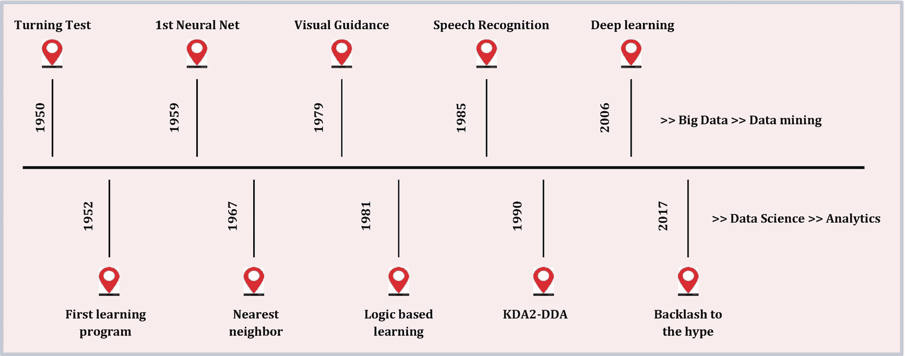
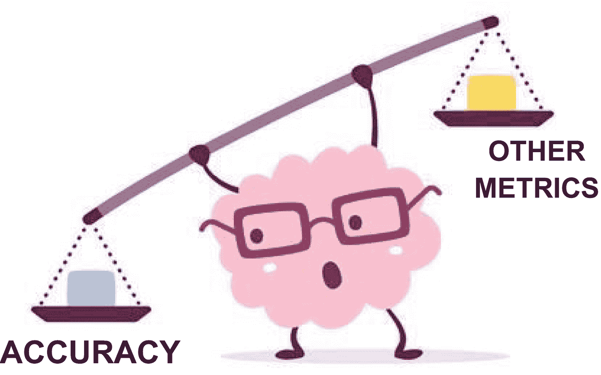

# 1.机器学习的进化

这一章讲的是机器学习的进化。它简要讨论了机器学习作为一个领域如何随着一年的关键事件和研究的时间而增长。本章还介绍了如何学习机器学习算法。我们相信所描述的方法可以进一步应用于可解释的算法。您可以使用这些知识来学习本书后面详细介绍的不同方法。最后，我们讨论了为什么准确性指标本身不足以评估机器学习算法，并为学习可解释性提供了一个案例。

## 定义机器学习

我们正在目睹本世纪一场全球性的技术革命。在计算能力和机器学习应用领域已经有了惊人的进步。二十一世纪见证了人工智能(AI)研究的重大进展。机器学习是最成功和最广泛的技术应用之一，它影响着广泛的行业，每天都影响着数十亿用户。机器学习是人工智能的一个子集，它使用算法和统计模型让计算机在没有人类交互的情况下执行特定任务。机器学习的利用打开了未来技术的大门，人们在日常生活中使用这些技术来自动化任务，如使用 Alexa 进行语音命令或对电视遥控器进行手势控制等等。

接下来，让我们回顾一下人工智能和相关机器学习技术的发展。

## 机器学习的进化

这一节讲的是机器学习的演变。很多人认为机器学习是一个非常新的概念；然而，机器学习的根源可以追溯到 20 世纪 50 年代。图 [1-1](#Fig1) 是一些重要的机器学习发现的时间线。

图 1-1

机器学习随时间演变的时间线

*   1950 年:艾伦·图灵引入了图灵测试来确定计算机是否能表现出和人类一样的智力。这是人工智能或机器学习的第一个例子。

*   1956 年:约翰·麦卡锡在达特茅斯学院的一次会议上创造了术语*人工智能*。同年晚些时候，艾伦·纽厄尔、J. C .肖和希尔伯特·西蒙创造了逻辑理论家，这是第一个运行的人工智能软件程序。

*   1967 年:弗兰克·罗森布拉特(Frank Rosenblatt)建造了 Mark 1 感知器，这是第一个通过试错来“学习”的基于计算机的神经网络。一年后，马文·明斯基和西蒙·派珀特出版了一本名为*感知器*的书，这成为神经网络的里程碑式的工作，也是反对未来神经网络研究项目的一个论点。

*   20 世纪 80 年代:人工智能应用广泛采用神经网络，这些网络使用反向传播算法来训练自己。

*   1997 年:国际象棋世界冠军加里·卡斯帕罗夫在一场比赛中被 IBM 的深蓝击败。

*   2011 年:冠军肯·詹宁斯和布拉德·鲁特在*的《危险边缘》中被 IBM Watson 击败！*

*   **2015:** 百度的 Minwa 超级计算机使用了一种叫做*卷积神经网络* (CNN)的深度神经网络，以高于人类平均水平的准确率对图像进行识别和分类。AlexNet 的诞生是出于改善 ImageNet 挑战赛结果的需要。这是第一个在 ImageNet LSVRC-2012 上实现相当高精度的深度卷积网络之一。

*   **2016:** 由深度神经网络驱动的 DeepMind 的 AlphaGo 在五局比赛中击败了围棋选手的世界冠军。

将机器学习与认知技术结合起来，可以使它在自动化人类执行的任务方面更加有效。

学习的过程从观察开始，例如例子、直接经验或指示，以寻找数据中的模式，并基于我们提供的输入在未来做出更好的决策。目的是让计算机在没有人类帮助的情况下自动学习，并相应地调整行动。

监督学习、非监督学习、半监督学习和强化学习是不同类别的机器学习算法。

*   **监督学习**是机器学习的一个子集，其中机器或算法在良好标记的数据上进行训练，然后根据获得的信息预测输出。监督学习是向模型提供输入数据和正确输出数据的过程。

*   **无监督学习**分析未标记的数据集，无需人工干预或协助。这被广泛用于提取生成特征、识别有意义的趋势和结构、创建分组和探索性分析。最常见的无监督任务是聚类、密度估计、特征学习、降维、发现关联规则和异常检测。

*   **半监督学习**可以定义为监督和非监督方法的混合，因为它对标记和未标记的数据都进行操作。使用半监督学习的一些应用领域包括机器翻译、欺诈检测、标记数据和文本分类。

*   **强化学习**是一种机器学习算法，使软件代理和机器能够自动评估特定上下文或环境中的最优行为，以提高其效率；也就是一种*环境驱动的方法*。这种类型的学习基于奖励或惩罚，其目标是利用从环境活动家那里获得的见解来增加奖励或最小化风险。

## 学习机器学习算法

学习机器学习算法可能是一项非常困难的任务。有很多网站、书籍和论文从数学和文字上描述了该算法的工作原理。如果您做了适当的研究，您可能会找到该算法的伪代码描述。

当你想实现一个方法时，你可以从研究论文中快速学习；然而，算法很少被充分描述以便于复制。原因各不相同，从论文中遗漏的微观决策，到文本中总结的整个程序，到使用的符号显示不一致。

因此，为了正确地学习算法，你应该遵循这里列出的步骤，并在下面的章节中描述。

### 拼凑起来

为了理解算法，将算法分解成几个部分是非常重要的。那么对于每一个组件，都要做二次研究。有时一个算法包含从其他论文或算法中引用的组件。详细理解每个组件有助于将学习与算法的整体工作联系起来。本书接下来的章节将讨论各种算法，并涵盖从任何其他算法直接引用的子组件。这样就保证了算法理解上不留盲点，涵盖了所有流程和步骤。

### 关注具体的算法描述

只关注算法定义有时会被证明是非常有害的。您必须从各种来源获取算法描述，并且只寻找经过验证的来源。例如，当我们研究随机森林时，我们有时只专注于将 bagging 理解为一个概念，以及随机森林的描述如何谈论各种树木一起工作以进行预测。我们还关注其他算法描述，这些算法描述了随机森林与其他算法有何不同，以及如何计算特征重要性。在算法内部，有许多对各种用例有用的信息。例如，算法的使用统计被嵌入在论文中。示例包括用于测试算法的标准实验数据集和算法适用的一般问题类别。

详细的算法描述确保我们深入研究该方法的所有细节，并且不会被一些来源陈述的半生不熟的信息所偏见。

### 设计一个算法描述模板

使用描述模板学习算法变得毫不费力。从一个空白文档开始，列出您可能想要学习的部分的概述。请参考下面的示例，以指导您在模板中包含哪些内容，或者列出您想要回答的有关算法的问题。

*   **介绍**算法。写一篇关于算法概述的简介。

*   为什么需要这个算法？不要在没有任何用例的情况下开始学习算法。首先，决定一个要解决的用例，然后关联各种算法并选择一个。因此，在模板中，提及所选算法解决的用例是非常重要的。

*   算法背后的**数学**是什么？从算法中需要的数学模型和公式开始。这为学习算法打下了坚实的基础。

*   你如何实现数学运算并生成 T2 伪代码？一旦您对模型中涉及的数学有了信心，您应该为各个步骤生成简单的伪代码。大多数算法通过系统地编码不同的数学计算来工作。

*   **有没有**类似的算法**？为什么要用**这个特定的算法**？**大多数时候，一个好的用例证明了你选择特定算法的需要。

*   用这个算法**能解决什么？**想出其他可以使用相同算法解决的用例。这扩展了算法的视野。

*   **什么是****过程策略？**提及你采用的处理该算法的策略。想想任何中间输出。确定最终输出的样子。

*   **使用了哪些缩写**？**提及任何可能需要你做额外调查的缩写。大多数算法都会提到从其他算法借用的模块，并以缩写的形式显示出来。**

***   **二级**资源**有哪些？**列出所有关于该算法的二级资源。** 

 **### 从小处着手，逐步积累

这种方法的优点是不需要成为算法或研究方面的专家。找到关于算法的资源，并在模板中记录相关信息。然后，您可以选择单个简单的模块，并为样本数据运行它们。一旦你熟悉了简单的模块，就可以扩展范围，加入需要更多编码的更具挑战性的模块。完成后，整合更多数据，横向或纵向扩展。通过这种方法，你可以循序渐进地学习，不会错过更好的细节。

## 调查机器学习算法行为

为了理解机器学习算法的行为，我们通常倾向于阅读关于该算法的各种描述和文献。然而，学习或研究机器学习模型行为的一个非常好的方法是使用各种数据集运行一些简单的测试和实验，并观察度量或预测的模式。通常，所有的机器学习模型都是复杂的，因此很难仅通过理论知识来理解它们的行为。最好能看到一个算法在运行。实验有助于您了解算法参数的原因和影响，以及如何调整模型。

让我们看一个简单的五步过程来研究一个机器学习算法。

### 第一步。选择一种算法

选择一个你关心的算法。算法的选择可以基于正在进行的项目或者简单地基于流行度。选择是一件重要的事情，因为对于每个问题，有多种算法和多种方法可用。有些方法是基本的，而有些则复杂得多。因此，重要的是选择一种方法来解释问题的基本层面，而不是直接跳到创新的复杂技术。以现成的算法实现为例。实现算法，并在实验中引入额外的变量，例如 bug 和每个算法实现必须做出的其他微观决策。

### 第二步。识别一个问题

决定一个研究问题，关于这个问题，你想得到一些关于算法的见解。问题越具体，得到答案就越有用。以下是一些例题。

*   随机森林模型中树的深度有什么影响？

*   在支持向量机(SVM)中选择核对二分类问题有什么影响？

*   不同的属性标度对分类问题上的 logistic 回归有什么影响？

*   在随机森林模型中，向训练数据集添加属性对分类准确性有什么影响？

设计一个你需要答案的关于你的算法的问题。考虑列出几个不同的问题，并把重点放在最具体的问题上。

### 第三步。设计实验

从构成你的模型算法实验的问题中挑选出元素。比如我们看下面这个问题:属性标度对分类问题的 logistic 回归有什么影响？

您可以选择以下元素。

*   **属性缩放方法**:归一化、标准化、将属性提升到幂、取对数等方法

*   **逻辑回归**:逻辑回归的不同实现

*   **二元分类问题**:需要多个问题，一些问题的属性都是相同的尺度，而另一些问题的属性是不同的尺度

*   性能:模型性能得分，如分类准确性。

花足够的时间仔细选择最能回答你的问题的元素。

### 第四步。执行实验并报告结果

完成你的实验。如果您正在寻找实验运行之间的结果差异，您可能希望使用统计工具来表明差异是否显著。总结你的实验结果。你可能想使用表格和图表。

我们从研究问题中得到了什么结果？

戴上你怀疑的帽子。你对结果有什么限制？了解局限性和了解实验结果一样重要。

### 第五步。重复

重复这个过程。继续研究您选择的算法。您甚至可能想要用不同的参数或不同的测试数据集重复相同的实验。不要因为一个实验就停止。开始为算法建立知识库和直觉。通过一些简单的工具，一些好的问题，你可以很快开始对算法的行为有一个世界级的理解。

## 机器学习模型精度是什么意思？

在机器学习算法中，准确性衡量模型在捕获训练数据中的模式，然后使用这种学习来预测未知数据方面的成功程度。这显示了该模型对未知数据的概括能力。人们相信，模型的预测越好，基于我们从模型洞察中采取的行动，它们能够产生的商业价值就越高。因此，准确性是基于各种度量的模型成功的度量。例如，对于分类模型，准确性的度量可以是该模型预测数据中所有正类和负类的程度。

有无数的指标可用于评估模型的准确性。这些度量标准大多与模型无关，并且适用于不同的模型，而有些则特定于特定的模型。由于准确性并不总是能很好地反映模型的性能，例如，在不平衡的数据集中，您应该使用不同的度量来评估模型。然而，为了便于讨论，每当我们必须向非技术人员解释我们的模型时，我们都在模型准确性的通用术语下提到所有这些度量。以下是一些关于模型准确性的有用指标，用于检查您的模型性能有多好。

*   混淆矩阵

*   F1 分数

*   增益和提升图表

*   Kolmogorov-Smirnov 图

*   AUC–ROC 曲线

*   原木损失

*   基尼系数

*   和谐/不和谐比率

*   均方根误差

深入研究每个指标超出了本书的范围。我们让您来研究这些指标及其潜在用途。

## 为什么模型精度不够

公司使用机器学习模型来做出商业决策，更准确的模型结果会导致更好的决策。错误的代价通常是巨大的，但是优化模型精度可以降低这些代价。当开发更精确的模型的价值没有导致相应的利润增加时，就有一个收益递减点。然而，通常它是全面有益的。例如，癌症诊断的假阳性会让医院和病人都付出代价。提高模型准确性的好处包括节省时间和金钱以及避免压力。

建立机器学习模型的想法基于反馈原理。您构建一个模型，从度量中获得反馈，进行改进，并继续下去，直到您达到所需的准确性。评估指标解释模型的性能，并区分模型结果。

许多分析师和有抱负的数据科学家并不关心他们的模型有多稳健。一旦他们完成了一个模型的建立，他们就匆忙地将预测值映射到看不见的数据上。这是一种错误的方法。

简单地建立一个预测模型不是你的动机。它是关于创建和选择一个在样本数据中提供高精度的模型。因此，在计算预测值之前查看模型的准确性至关重要。

在我们的行业中，我们考虑不同种类的指标来衡量我们的模型。度量标准的选择最终取决于模型，因此也取决于模型的实现计划。

准确性很好，但是我们需要模型的商业消费的额外信息。

模型可以通过记忆数据集中不重要的特征或模式来实现高精度。如果输入数据集中存在偏差，这也会影响模型。此外，培训环境中的信息可能不是模型部署期间生产环境中信息的真实表示。即使它最初具有足够的代表性，如果我们认为生产环境中的信息不是静态的，它也会很快过时。

因此，我们不能只依赖于一个选定的数据集达到的预测精度。我们需要知道更多。我们需要揭开机器学习模型的神秘面纱，提高透明度和可解释性，使它们更加值得信赖和可靠。

图 1-2

关于准确性如何比其他模型评估指标更重要的图片描述

随着机器学习模型变得越来越先进，它们在不同数据集上能够达到的精确度也在增加；然而，随着精确度的提高，模型变得越来越复杂，模型结果的可解释性也变得难以解释。

然而，当涉及到实际实施时，准确性不足以证明模型所做的决策是正确的。因此，在现实世界的场景中，即使底层模型非常复杂，具有高精度指标，业务团队有时也会发现采用这些模型非常困难，因为精度并不能解释为什么模型会做出特定的决策。

让我们看几个例子来理解一些高度精确的模型是如何在现实场景中失败并因此被丢弃的

*   2019 年，波兰政府增加了一项银行法修正案，赋予客户在不利的信贷决定中要求解释的权利。在欧盟实施一般数据保护法规的后果之一是，GDPR 立法的效果是，在决策过程是自动的情况下，银行必须解释为什么不批准贷款。

*   2018 年 10 月，世界头条报道了一款偏向男性的 AI 招聘工具。财富 500 强公司的模型是在偏向男性候选人的有偏见的数据上训练出来的。它制定了规则，对包含“女性”一词的特定简历进行处罚。

在这些例子中，两个模型都是非常复杂的工具，称为*黑盒分类器*，提供非常高的准确性；然而，这些模型并没有提供简单易懂的解释。

预测算法，也是可解释的，往往不如不容易解释的更先进的方法准确。归结起来就是这个模型对人类的解释有多简单？然而，模型准确性是解释模型预测感兴趣的结果有多好的任何定量度量。举一个所有已知观察值的例子，模型正确预测了多少。

作为这样一个定量领域，预测中可解释性的重要性对于数据科学家来说仍然是一个有分歧的话题。随着越来越多的公司探索高级分析来推动增长，这种紧张关系变得与分析成功相关。作为数据科学从业者，如果我们的客户对我们的方法不熟悉，我们如何向他们灌输信心呢？此外，如果我们限制我们的模型，使它们无法解释，我们如何证明分析的价值？

很容易建立一个案例来强调模型的准确性而不是可解释性。准确性可以很容易地评分，使替代方法很容易相互比较。如果一个预测模型在选定的分数中表现更好，那将对它非常有利。当错误的成本很高时，追求更高性能的动机就更大。*可解释的*决策树或线性/逻辑回归等模型也可能很快变得不可解释。例如，在决策树的最初几级之后，人类就很难理解选择一个变量而不是另一个变量的原因。

如果一个人能够理解为什么一个模型是错误的，那就是可解释性的一个极好的例子。我们渴望解释，很容易根据数据或甚至没有数据的结果做出虚假的论证。

随着出现错误的成本增加，准确性的相对重要性就更大了。例如，IBM 的沃森技术支持医疗诊断。最近，沃森成功诊断了一种肿瘤学家无法诊断的罕见白血病。这是精确的机器学习算法如何支持现有工作流的一个极好的例子。

但是想象一下，沃森是错误的，病人将会参加一个昂贵而耗时的治疗过程，这个过程几乎没有任何益处，而且几乎肯定对病人有害。像所有其他机器学习算法一样，沃森只能学习它被训练的数据；它不能学习与它被训练的数据无关的替代假设。准确性在医疗保健环境中至关重要，但准确性取决于用于训练模型的数据。当沃森做出诊断时，诊断背后的逻辑也必须显而易见。留给黑盒模型，错误的代价是巨大的。在金融服务领域，抵押贷款或保险索赔不能因种族而被拒绝。如果一个模型中包含了种族因素，那么它就违反了禁止歧视行为的规定。

这就把指针从准确性拉回了可解释性。

## 摘要

本章讨论了机器学习的发展和不同类别的机器学习模型。它还描述了学习机器学习模型和探索其行为的最佳实践。您学习了模型准确性的含义，以及我们对为什么准确性不足以评估模型的观点。这一章提出了一个案例，在评估模型时，将可解释性或可解释性作为准确性的支持。因此，下一章深入到可解释性以及它与模型评估的关系。**