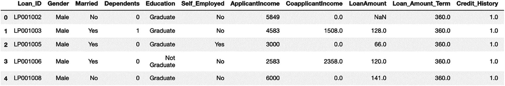
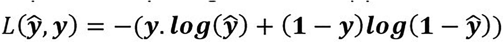
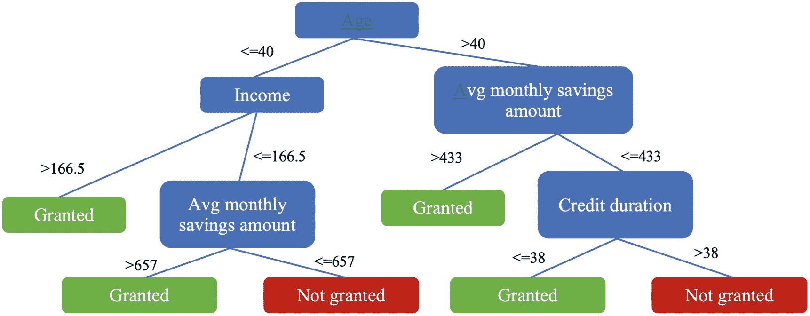
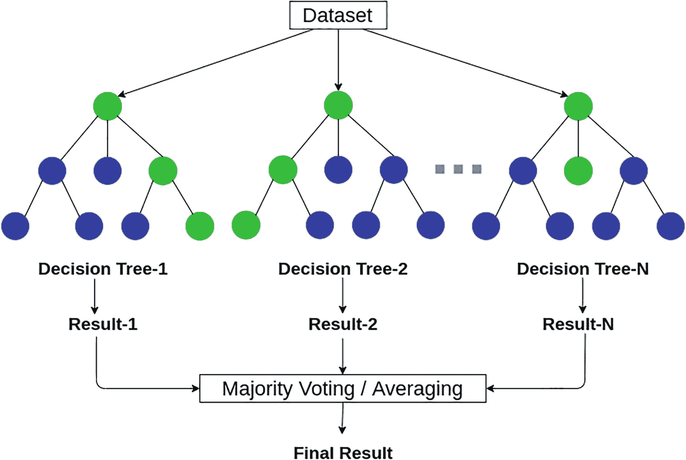
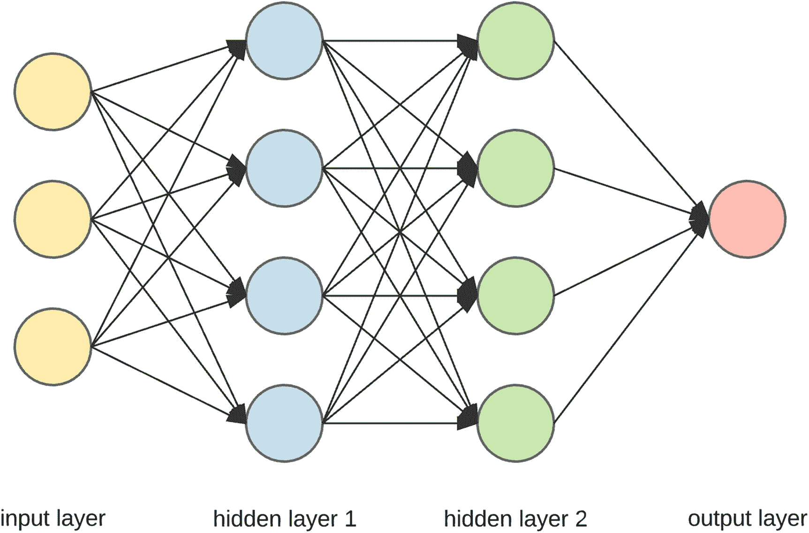
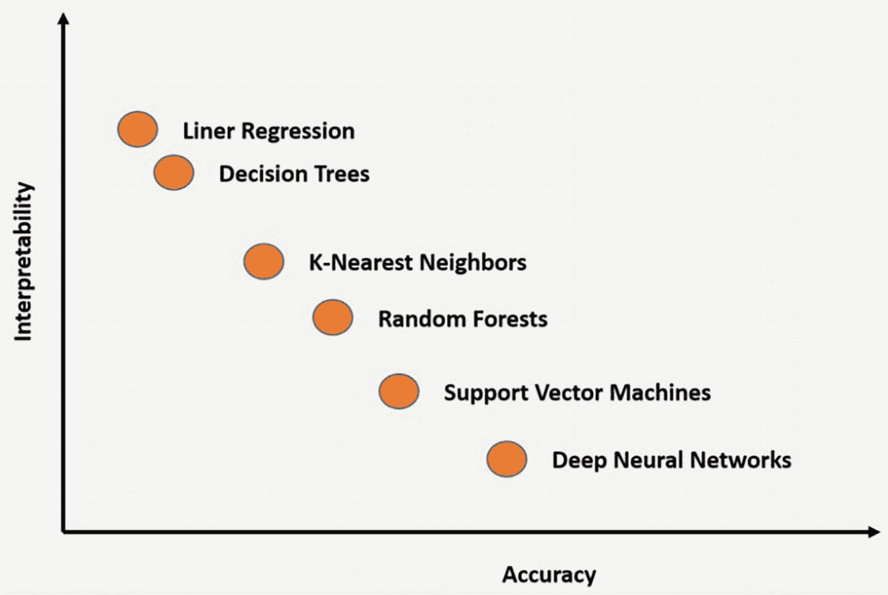
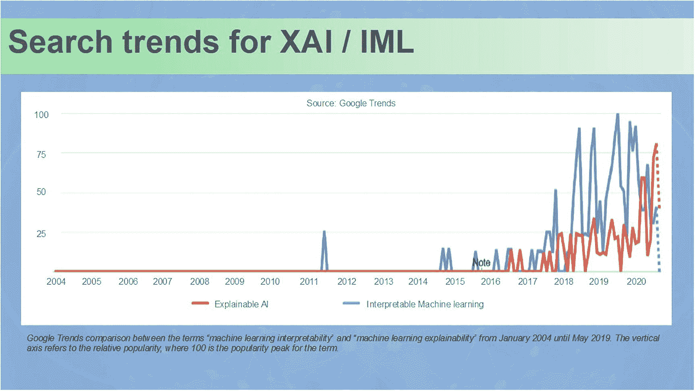
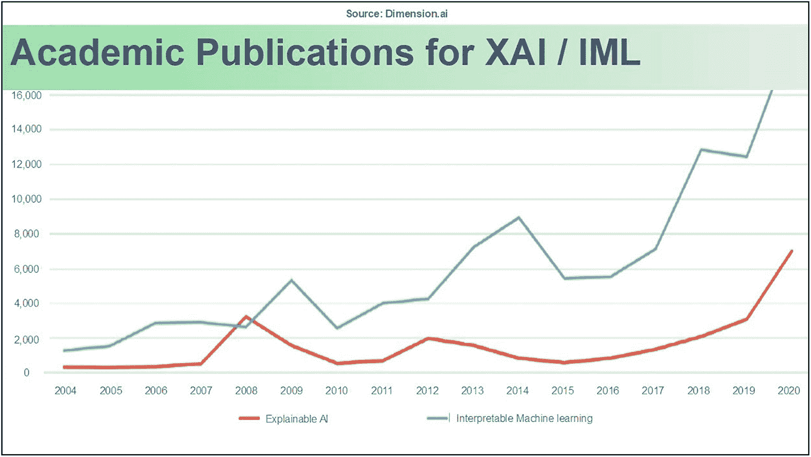

# 二、模型可解释性介绍

本章讨论了可解释性的重要性。我们从一个例子开始，说明解释在现实生活中的重要性。然后，我们尝试将这个例子与我们的模型联系起来，并解释解释是如何成为您的模型学习之旅不可或缺的一部分。我们解释了采用可解释性背后的不同类型的动机，并以可解释性领域当前研究的细节结束了这一章

## 人类渴望解释

人类是渴望解释的动物。自从文明开始以来，我们一直试图寻找事物的*为什么*和*如何*。利用几个世纪以来收集的关于为什么和如何的知识，我们人类已经为特定的任务建立了规则或最佳实践。随着技术的发展，我们已经扩展了规则，并且已经能够创建计算机软件来处理这些规则。下面的故事强调了为什么简单的解释或流程背后的*为什么*和*如何*很重要。

两位医生在同一个房间里照顾他们的病人。大多数病人患有糖尿病。阿琼带着好奇的目光坐在医生面前。他偶尔朝房间的另一边看。一个年龄、体重和身高相似的人和另一个医生坐在房间的对面。Arjun 的医生告诉他，他的糖尿病没有得到控制，他开了几个星期的药。阿琼心灰意冷。这场病对他来说就像一个黑匣子。他试图讨论为什么药物不起作用，但他的医生太忙了，没有时间处理更多的问题。他让服务员送下一个病人进来，并礼貌地示意 Arjun 离开，两周后再来。

Arjun 慢慢走出房间，注意到同一个人和另一个医生坐在一起。阿琼希望自己也遇到同样的问题，于是走近他们，做了自我介绍。这个家伙非常高兴。他的名字叫维卡斯，和阿琼同龄。他也患有糖尿病，但目前已经得到控制，他来到医生面前，对医生的治疗表示感谢。Arjun 听了他的治疗故事后很激动。他困惑地问 Vikas 他是如何控制它的。医生开了什么药？维卡斯把他的药方给阿琼看，阿琼完全惊呆了。每种药都和他的一样。Arjun 很好奇为什么对 Vikas 有效的药物没有改变他自己的症状。他们同意在附近喝点咖啡，然后开始聊天。

Vikas 然后解释了他在治疗开始时也是如何挣扎的，以及他如何感觉糖尿病就像一个黑匣子，直到他读了一本用简单的术语向普通人解释糖尿病的书。从那以后，他的生活改变了。Vikas 告诉 Arjun，糖尿病不仅仅是一种可以用药物治疗的疾病，它还需要生活方式的改变，良好的饮食习惯和健康的锻炼制度。这本书对一切都有简单的解释。特定食物如何影响体内的糖水平，睡眠周期如何影响糖水平，增加糖水平的最重要因素，以及减少压力和管理糖的重要运动。这些问题的答案帮助 Vikas 将他的黑箱疾病转化为一种可以解释的疾病。他知道他波动水平背后的原因，并开始采取相关行动。他突然知道哪些食物会升高他的血糖水平，以及在进食后采取什么行动来降低血糖水平。凭借他新发现的知识和药物，Vikas 很快就能够控制他的糖尿病。他现在喜欢吃自己喜欢的食物，感觉比以前更健康了。

阿尔琼听了维卡斯的话后肃然起敬。他突然看到了一线希望。简单的解释可能会改变他的生活。早些时候，他只知道他的血糖水平是上升还是下降。有了这些解释，他现在可以将这些水平与他吃的食物、他的睡眠时间以及他白天是否活跃联系起来。他突然知道了所有的原因，药物对他来说只是锦上添花。Arjun 感谢 Vikas，他们互相道别。几个星期后，Arjun 控制住了他的糖尿病，并且停止了药物治疗。

人类现在所拥有的关于一切的知识远远超过我们在任何特定时间所能理解的。因此，有时我们盲目地遵循规则，而没有深入理解是什么创造了这些规则。Arjun 很好奇的询问了他的糖尿病问题，但是大多数人不会问，因为他们相信药物和医生。已经制定的规则是经过几个世纪的研究制定的，并不断发展，以确保它们不会偏向特定的群体、肤色、年龄或体型。这些规则是*不偏不倚的*，并被期望为所有人提供相同的解决方案。自从规则发展以来，它们已经成为完成某些任务的最佳实践；因此，我们可以让他们*负责*。你想相信医生为你的疾病开的药，不管它是否有效，我们都让医生负责。

## 机器学习中的解释

让我们看一个银行贷款处理应用程序的例子。处理银行贷款的规则是经过多年研究后制定的。过去，银行经理根据申请人的收入和信用记录来决定谁应该获得贷款。对于被拒绝的申请，银行经理有一个直截了当的答案来解释为什么贷款没有通过。如今，银行公司拥有数百万份贷款申请和数百个变量的机器学习模型。这些模型可以帮助银行经理高精度地决定是否应该给予贷款。但由于现在这是一个非常复杂的算法决策过程，一些问题出现了:为什么贷款被拒绝？或者为什么贷款会被批准？算法做出的决定是否正确？

在本书中，我们试图回答这些问题，并解释帮助公司或个人回答这些问题的方法。

第 [1](01.html) 章解释了机器学习以及它的重要性是如何上升的。现在，让我们通过查看一个简单的贷款批准或拒绝，将理解*为什么*和*如何*的概念应用于机器学习模型。

图 [2-1](#Fig1) 显示了简单的银行贷款模型数据。

图 2-1

银行贷款分类模型的样本数据

这些数据包含贷款状态、贷款金额期限、收入、教育、信用历史和年龄等变量。在构建模型时，我们将拟合一个逻辑回归模型来预测贷款申请是被批准还是被拒绝。我们有一些自变量和一个目标变量(即数据集中的 Loan_Status)。在逻辑回归中，目标 **y** 是二进制的(**批准** p = 1 / **拒绝** p = 0)，根据截断值确定贷款的发放/拒绝概率( **p** )。目标是估计系数 **αi** 。

**Logit(p)**= log**(p/【p-1】)=α0**+**α1。年龄** + **α2。收入** + **α3。年龄** + **α4。信用记录**

为了找到系数 **αi** ，我们用带标签的数据历史来训练分类模型。批准/拒绝的决策是已知的，使用交叉熵作为损失函数来比较预测 **^** ***y*** 与标签 ***y*** (见图 [2-2](#Fig2) )。

图 2-2

逻辑回归方程表示

图 [2-2](#Fig2) 所示的函数表示二值交叉熵损失。对于二元分类，我们有二元交叉熵。交叉熵损失也称为*对数损失*、*对数损失*，或*逻辑损失*。每个预测类别概率与实际类别期望输出 0 或 1 进行比较。计算得分/损失，根据其与实际期望值的差距惩罚概率。惩罚是对数的，对于接近 1 的大差异产生大的分数，对于趋向于 0 的小差异产生小的分数。这个函数是负的，因为当我们训练时，我们需要通过最小化损失函数来最大化概率——减少损失会增加最大可能性，假设样本是从完全独立的分布中抽取的。 **αi** 的值是使α0 最小的值，...α4 使用它的一阶导数和类似梯度下降的优化算法。

在解释估计系数时，我们应该非常谨慎。在 LP 模型或 OLS 回归中，斜率系数现在被解释为 X 变化时“对数优势”的变化率与 X 变化时 Y(因变量)的变化率的比较。logit 系数是“优势比”，即独立变量对事件概率的影响除以非事件概率。例如，如果 exp **a** 3 = 2，那么 X 3 的一个单位变化将使事件发生的可能性增加一倍(67%/33%)。比值比等于 1 意味着事件发生的概率为 50 %,独立变量有小的变化。负系数导致比值比小于 1:如果 exp **a** 2 =.67，那么 X 2 的一个单位变化导致事件发生的可能性更小(40%/60%)。负系数往往比大于正系数的比值比更难解释。系数是广义线性模型可解释性的第一种形式。该示例显示了如何使用系数确定自变量对相关贷款状态变量的影响。这些系数表明哪些变量影响最大，以及影响的方向(正/负)。

线性和逻辑模型是不言自明的模型。通过理解模型背后的数学原理，您可以推断出为什么模型会根据输入数据做出某种决定。

然而，随着时间的推移，数据量一直在迅速膨胀。随着数据量的增加，每天都在研究更新更高级的算法来执行特定的任务。随着时间的推移，决策树的受欢迎程度显著提高。

决策树是一种受监督的机器学习算法，能够执行分类和回归。决策树是为达到特定输出而做出的一系列连续决策。图 [2-3](#Fig3) 显示了决策树是如何工作的。

图 2-3

决策树表示法

该树将客户分为两类。一组是有良好信用记录的客户，另一组包含有不良信用记录的客户。此外，它检查客户的收入，并再次将客户分为两组。最后，它检查客户请求的贷款金额。基于检查这三个特征的结果，该树决定是否应该批准客户的贷款。决策树算法相对容易理解和解释，因为它将数据分为两部分。然而，通常情况下，单一的树不足以产生有效的结果。这就是可以使用随机森林算法的地方。

*随机森林*是一种基于树的机器学习算法，它利用多个决策树来生成决策。顾名思义，是树木的“森林”(见图 [2-4](#Fig4) )！

图 2-4

随机森林表示

但是为什么叫*随机森林*？这是因为这是一个随机创建的决策树的森林。决策树中的每个节点处理随机的特征子集来计算输出。随机森林然后组合各个决策树的输出，以获得最终的输出。图 [2-4](#Fig4) 显示了一个随机森林的简单表示。

最近，神经网络已经取代决策树成为建模大型数据集的首选，因为它们除了在表格数据上表现良好之外，还能够处理各种问题，如图像分类和文本分类。神经网络也非常适合帮助人们解决现实生活中的复杂问题。他们可以像模型一样完成各种任务，学习输入和输出之间的非线性关系；概括和推论；揭示隐藏的关系、模式和预测。图 [2-5](#Fig5) 是一个神经网络的简单表示。

图 2-5

神经网络表示

与基于简单方程的逻辑回归不同，决策树和神经网络等其他高级算法非常复杂，需要多个步骤。即使是数据科学家也很难理解这些模型的内部工作原理，更不用说它们的商业对手了。这些新技术开发的后线性模型被称为*黑盒模型*。

## 什么是黑盒模型？

*黑盒模型*是一个描述模型的术语，该模型具有复杂的工作来计算通常分布在多个步骤上的输出。在黑箱模型中，用户只知道输入和输出，而所有中间步骤和计算都难以理解(见图 [2-6](#Fig6) )。随着时间的推移，黑盒模型作为首选建模技术越来越受欢迎，因为它们能够在各种数据源上生成高精度。

图 2-6

黑盒模型表示

但是采用这些先进的技术带来了一些问题。

*   我们能解读一个深度神经网络吗？

*   有 500 棵树的随机森林怎么样？

*   建立一个复杂而密集的机器学习模型有可能达到我们期望的精度，但这有意义吗？

*   你能打开黑盒模型并解释它是如何得出结果的吗？

近年来，黑盒模型的火花在 Kaggle 等竞争性编码平台上被进一步点燃，黑盒模型开始在多个问题陈述中占据榜首。到 2015 年，*梯度推进*和*神经网络*是数据科学家中最流行的术语，很快，这些黑盒模型进入了跨企业的实际实现世界。在一个理想的世界中，每个模型都是可解释的和透明的，在下文中是有用的。

*   关键决策(如医疗保健)

*   很少做出或非常规决策(如 M&A 工作)

*   利益相关者论证-需要的决策(例如，战略业务选择)

*   交互比结果更重要的情况(例如，根本原因分析)

然而，在现实世界中，这两种模式都有存在的时间和地点。并非所有的决策都是等价的，开发可解释的模型极具挑战性(在某些情况下是不可能的；例如，在图像分类中，对豪华场景或高维空间建模)。即使在更简单的问题中，黑盒模型通常也优于白盒模型，因为黑盒模型能够捕捉高度非线性和特征之间的相互作用。尽管在准确性方面具有高性能的优势，但黑盒模型有一个非常普遍的缺点:缺乏向内部团队或审计公司和监管机构提供预测背后的解释的能力。

图 [2-7](#Fig7) 显示了不同的方法如何被放置在可解释性和准确性之间的双向轴上。我们可以在图像中看到，更复杂的方法，如深度神经网络和支持向量机，精度很高，但落在可解释性轴的较低值上。

图 2-7

以不同方法作为数据点的准确性和可解释性的 2D 图表。该图表显示，随着模型变得越来越精确，他们对此类模型的可解释性或理解性下降了

黑盒模型的第二个缺点是，可能会有许多看不见的问题影响输出，如过度拟合、相关性或垃圾输入、垃圾输出。由于对黑箱模型的操作缺乏了解，这些问题是不可能被发现的。

为了防止业务用户和模型构建者受到黑盒模型的诅咒，可解释性起着重要的作用。

## 什么是可解释性？

可解释性是指我们能够理解对一个选择的解释的程度。另一个是:可解释性是一个人能够持续预测模型结果的程度。机器学习模型的可解释性越高，就越有利于人们理解为什么会做出某些决定或预测。如果一个模型的决策更容易理解，那么它就比另一个模型更容易解释。

大多数机器学习系统都需要向利益相关者解释为什么会做出某些预测的能力。在选择合适的机器学习模型时，我们经常会考虑准确性与可解释性之间的权衡。

准确性与可解释性之间的权衡基于一个重要的假设:可解释性是模型的固有属性。然而，我们相信，通过正确的技术，任何机器学习模型都可以变得更具可解释性，尽管有些模型的复杂性和成本高于其他模型。

当一个模型预测或发现洞见时，它会做出某些决定和选择。模型解释试图理解和解释模型做出的这些决定(即，什么、为什么和如何)。模型解释的关键是透明性、质疑的能力以及人类理解模型决策的容易程度。模型解释的三个最重要的方面解释如下。

*   **是什么原因导致模型做出某些预测？**我们应该有能力查询我们的模型，并找出特征的相互作用，以了解哪些特征在模型的决策规则中可能是重要的。这保证了模型的*公平性*。

*   为什么模型会做出特定的决定？我们还应该验证并证明为什么某些关键特征会在预测过程中推动模型做出决策。这确保了模型的*责任*和可靠性。

*   我们能相信模型预测吗？我们应该评估和验证任何数据点，以及模型如何对其做出决策。对于关键的利益相关者来说，这应该是可演示的并且容易理解的，即模型如预期的那样工作。这保证了模型的*透明度*。

为了根据预测采取行动，或者在部署新模型时，您应该信任模型的预测，并且获得对模型的信任非常重要。

一个至关重要的问题仍然是人类是直接使用机器学习模型还是在其他产品中部署模型。如果用户不信任模型或预测，他们就不会使用它。

在银行贷款模型中，可解释性有助于回答一些问题，例如描述批准贷款与未批准贷款的最重要的特征。

比如说收入是最重要的变量。可解释性的输出应该是这样的，“收入越高，贷款被批准的概率越高。”类似地，如果第二重要的变量是信用历史，那么可解释性以“信用分数在 750 到 800 之间的人获得贷款的可能性更高”的形式提供输出。

在随后的章节中，我们将解释如何通过不同的可解释性方法来实现只知道信用历史是重要的，而不知道信用历史的哪些值是重要的。除此之外，您还可以通过收入、信用记录和其他变量(如年龄)的形式获得对单个应用程序的解释。

在模型之上引入这样的解释有助于银行经理信任模型并简化贷款发放过程。这些解释也有助于银行的战略和营销团队设计更好的贷款结构，更好地为客户服务。在重要的模型之上有这一层解释比只有模型运行的准确性度量要好得多。

这就是现实生活中可解释性的力量。

## 可解释性背后的动机

模型可解释性背后的主要动机是建立对模型的信任。然而，动机也可以扩展到其他各种需求。下面的部分着眼于使用可解释性方法和技术的各种动机。

### 做出更好的决定

我们应该始终确保在建模过程后有人在场，以评估错误预测的影响。在使用机器学习系统执行自动化的场景中，很容易忘记错误预测的影响。数据科学家和业务分析师团队应该了解不正确预测的后果，尤其是当项目对人类生活有重大影响时(例如，司法、健康、交通等)。).在业务收入受到影响的情况下，也应该采取类似的措施。可解释性提供了我们评估模型预测、理解模型为何做出特定决策以及模型的不同特征如何影响其预测所需的关键信息

### 消除偏见

我们可以使用可解释性来驱动动机，以检测、记录和监控我们的开发和生产系统中的偏差。当构建必须做出决策的系统时，我们总是会面临数据中固有的计算或社会偏见，这可能无法避免。尽管如此，记录或减轻偏见总是可能的。然而，我们不应该仅仅试图将伦理直接嵌入算法本身。相反，技术专家应该专注于建立过程和方法，以识别和记录数据、特征、推断结果中的固有偏差，以及随后这种偏差的含义。考虑到所识别的偏差的含义是特定于领域和技术的，我们作为数据科学家应该能够创建、识别和解释数据和特征中的偏差，以便可以实现正确的流程来降低潜在风险。可解释性在建立这些过程中扮演着重要的角色。

### 证明流程的合理性

您可以使用可解释性来开发工具和过程，以提高机器学习模型的透明度和可解释性。随着深度学习近年来获得了巨大的吸引力，我们作为数据科学家经常将大量数据扔进复杂的 ML 管道，希望某些东西能够工作，而不了解管道内部是如何工作的。然而，我们应该投入合理的努力来持续改进工具和过程，以便根据所选择的特征和模型来解释结果。可以使用不同的工具和方法来使 ML 系统更容易解释，例如通过特征添加领域知识，而不是只允许深度/复杂的模型来推断它们。尽管在某些情况下准确性可能会降低，但透明度和可解释性的收益可能是显著的。

### 复制操作

我们可以使用可解释性来开发所需的基础设施，以在 ML 系统的操作中实现合理水平的再现性。当模型发生可怕的事情时，生产机器学习系统通常不具备诊断或有效响应的能力，更不用说重现相同的结果了。在生产系统中，执行标准过程是很重要的，例如将模型恢复到以前的版本或重新生成输入以调试特定的功能，这在基础结构中引入了复杂性。应采用工具和最佳实践来提供合理水平的操作再现性。

### 置换策略

可解释性可以识别和记录相关信息，以便可以开发业务变更流程来减轻对自动化作业的影响。当推出自动化中到大规模流程的系统时，会对组织或行业层面产生影响，影响到多个个人。作为技术专家，我们应该超越技术本身，用系统来支持必要的利益相关者。这有助于涉众在推广技术时制定变更管理策略。尽管数据科学家或分析师可能不总是领导转型，但无论自动化的工作是什么，确保流程在相关时到位仍然很重要。

### 为了确定实际的精确度

可解释性开发过程来确保我的准确性和成本度量函数与特定领域的应用程序保持一致。当构建从数据中学习的系统时，理解评估准确性的基本方法是很重要的。通常，仅使用简单的准确性或默认/基本成本指标是不够的，因为对计算机来说“正确”的东西对人来说可能是“错误的”(反之亦然)。确保以正确的方式解决正确的挑战，可以通过从特定领域的角度分解 0-1 得分指标的含义，并基于领域知识探索替代成本函数来实现。

### 为了保护隐私

可解释性可以构建保护和处理数据的流程，并与可能直接和/或间接与系统交互的涉众进行沟通。

当开发从数据中学习的大规模系统时，许多涉众可能经常受到直接和间接的影响。在相关利益相关方之间建立信任不仅要通过告知持有的数据，还要通过围绕数据的流程以及理解保护数据的重要性来实现。技术专家应通过跨系统和连续流程的设计来加强隐私保护，以建立与用户和相关利益相关方(如采购框架、运营用户等)的信任。拥有可解释性隐私框架的主要目标是自动生成对个人数据的推理任务的解释，以便最终用户可以更好地理解这些任务的隐私风险和含义。这些解释应该有助于最终用户，以便他们理解底层机器学习模型如何根据输入(即，最终用户提供的数据)来工作和表现。

### 了解安全风险

可解释性可以帮助您开发和改进 rational 过程和基础设施，以确保在机器学习系统的开发过程中考虑数据和模型的安全性。自主决策系统可能会导致新的潜在安全漏洞。同样重要的是要意识到，许多安全漏洞的发生是由于人为错误，而不是实际的黑客攻击(例如，有人意外发送了电子邮件中附带的数据集或丢失了他们的笔记本电脑/手机)。技术专家应致力于通过明确的努力为这两种类型的安全风险做好准备，如教育相关人员、建立数据流程和评估 ML 后门的影响。

## 可解释性背后的研究

一些行业正在见证利用 ML 进行高风险预测应用的增长趋势，这对人类生活产生了深远的影响。

当自动算法做出高风险决策时，错误预测的问题变得更加严重。为了解决这个问题，*可解释的机器学习*作为一个研究领域出现，专注于机器学习的可解释性，并转向更透明的人工智能。这样做的主要目标是创建一套可解释的模型和方法，产生对人类友好的解释并保持高预测性能水平。

该领域的实体之一是由美国国防部资助的国防高级研究计划局(DARPA)。它创建了可解释性和可解释性计划，资助 11 个美国研究实验室的学术和军事研究。该计划信息表明，该计划旨在产生更多可解释的模型，同时保持高预测性能水平，实现适当的人类信任，并理解如何更好地管理新一代人工智能伙伴。

这不是公众关注 AI 和机器学习可解释性的唯一例子。2016 年，白宫科技政策办公室(OSTP)发布了一份题为“为人工智能的未来做准备”的报告，其中指出，人工智能系统是开放、透明和可理解的，以便人们可以询问模型决策背后的假设和决策。

此外，计算机器协会美国公共政策委员会(USACM)在 2017 年发布了一份“关于算法透明度和问责制的声明”。据说可解释性是算法透明性和责任性的七个原则之一。那么它在公共政策背景下尤为重要。

其他国家也公开了对人工智能和机器学习可解释性的需求。一个例子是荷兰人工智能的草案版本，它完全专注于可解释的人工智能，说明人工智能系统准确并能够解释系统如何做出决定的极端重要性。

在 2018 年 7 月关于负责任的人工智能和国家人工智能战略的报告中，欧盟委员会将不透明性(或黑箱风险)和可解释性确定为两种人工智能性能风险。

在人工智能和机器学习驱动的行业中，谷歌和微软发布了他们在不同人工智能相关领域的推荐和负责任的实践，其中一项完全专注于可解释性。提倡的可解释性实践包括可解释性规划、将可解释性视为用户体验的核心部分、将模型设计为可解释的、理解训练好的模型以及向模型用户传达解释。

除了关注商业化 AI 产品的可解释性，一些公司还研究 ML 可解释性。一个这样的例子是 FICO，一家以使用人工智能进行信用评分而闻名的分析软件公司。它发布了一份题为“xAI 工具包:实用的、可解释的机器学习”的白皮书，其中包括他们的分析工作台产品中的 xAI 工具包。还有其他一些大公司积极投资这一研究领域的例子。

这意味着 ML 可解释性可以有来自不同领域的贡献。一个领域的进步可以促进其他领域的研究。因此，研究团体应该相互协调，进一步推动 ML 的可解释性。此外，对 ML 可解释性问题的有效、广泛采用的解决方案只有在跨学科研究中才有可能，将数据科学与人文科学联系起来，并包括哲学。除了对可解释性的研究数量的快速增长，对 ML 可解释性的兴趣的增长也反映在许多科学事件中。由此可见，可解释性越来越受到研究界的关注。科学事件在促进和鼓励可解释性研究方面发挥着重要作用。

此外，可解释性竞赛也开始出现。例如，在谷歌、FICO 和牛津大学、麻省理工学院等知名大学的合作中，第一个可解释的机器学习挑战出现在 2018 年神经信息处理系统(NIPS)上，团队被要求创建具有高准确性和可解释性的 ML 模型。目标是在算法可解释性领域产生新的研究。此类事件和竞赛被证明是促进 ML 可解释性领域发展的关键因素。图 [2-8](#Fig8) 显示了最近可解释的 ML 相关主题的学术出版物激增。图 [2-9](#Fig9) 显示了谷歌趋势中日益增长的受欢迎程度。

图 2-9

可解释的人工智能和可解释的人工智能的谷歌趋势

图 2-8

与可解释的 ML 和可解释的 AI 相关的学术出版物

最近可解释性研究的激增导致了相当多的困惑。尚不清楚可解释意味着什么，以及如何挑选、评估或讨论产生机器学习模型解释的方法。欧洲议会最近通过了《一般数据保护条例》(GDPR)，该条例于 2018 年 5 月成为法律。《GDPR》的一个创新之处是关于包括特征分析在内的自动化(算法)个人决策的条款，在某种程度上，这些条款为所有个人引入了在自动化决策发生时获得“有关逻辑的有意义解释”的解释权。尽管法律学者对这些条款的实际范围有多种意见，但每个人都同意，迫切需要实现这样一项原则，这在今天是一个巨大的公开的科学挑战。

据预测，在未来，一半的商业道德违规将通过大数据分析的不当使用发生。解释技术对于那些致力于创造更安全、更可靠产品的公司来说是一个巨大的帮助。这也有助于他们更好地管理自己的负债。类似地，在科学研究中使用机器学习模型，例如医学、生物学和社会经济科学，不仅需要对结果的信任和接受做出解释，还需要对科学发现的开放性以及研究进展做出解释。因此，解释是跨多个行业部门和科学学科的负责任的开放数据科学的核心。不同的科学界研究了解释机器学习决策模型的问题。然而，每个社区都从一个特殊的角度来解决这个问题，并提供解释的视角。文献中的大多数作品来自机器学习和数据挖掘社区。第一个通常侧重于描述黑盒是如何工作的。与此同时，另一个人对解释选择更感兴趣，即使他不理解不透明的决策系统一般是如何工作的。

尽管可解释的机器学习已经成为一个课题很长时间了，并且最近受到了很多关注，但是今天有许多特别分散的结果，并且缺少对这些方法的科学组织和分类。通过这本书，我们的目标是将这些信息与实际的、可理解的例子统一起来。

## 摘要

本章讨论了可解释性。它从定义可解释性和描述使用可解释性方法背后的动机开始。它讨论了黑盒模型，以及为什么可解释性可能是理解黑盒模型的重要工具。然后，它着眼于可解释的 ML 和可解释性的研究趋势。在可解释性和可解释性方面有很多研究。Google 搜索趋势表明可解释 ML 的流行程度正在增加。你还了解了可解释性方面的研究。总的来说，这一章为可解释性建立了基础，强调了它的必要性，并为可解释性模型建立了一个案例。此外，它还展示了对可解释性兴趣的激增，并提到了各种政府法律和大型科技公司采取的举措。

下一章着眼于可解释性和可解释性方法的分类及其用法。