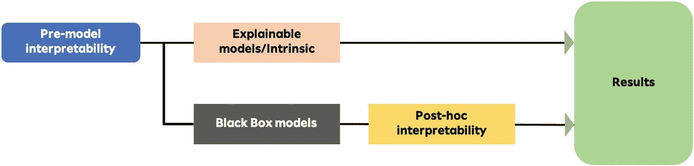
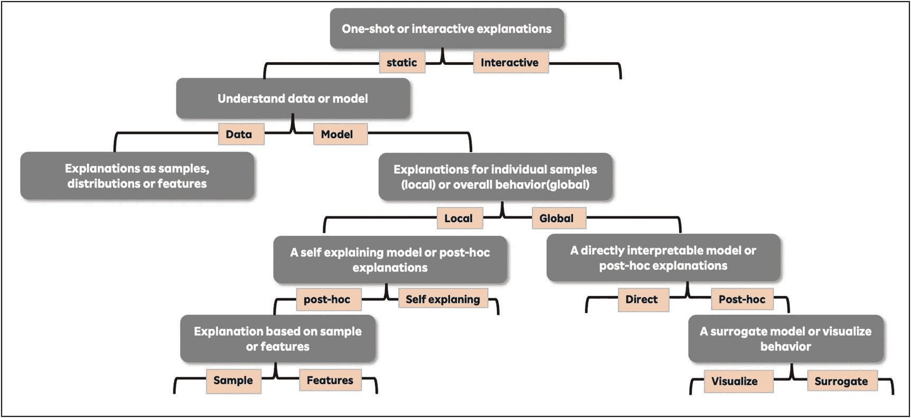

# 3.机器学习可解释性分类法

前一章解释了为什么可解释性很重要，以及构建可解释性模型背后的动机。这一章讨论了不同的主题，在这些主题下不同的可解释模型可以适用，以及我们应该在哪里使用特定的方法。图 [3-1](#Fig1) 说明了不同的类型。



图 3-1

基于算法在模型管道中应用的不同类型的可解释性分类

可解释的机器学习技术通常可以分为三类。

*   **预模型可解释性**使用建模前使用的可解释技术。

*   **内在可解释性**使用通过模型结构得到的解释。

*   **事后可解释性**使用从模型结构之外的方法中得出的解释，这些方法通常在模型建立后运行，并使用模型进行预测。

模型前可解释性是对数据集进行探索性数据分析，以了解各种特征的分布。它有助于确定不同特性值中的任何关系以及每个特性与依赖项的关系。

内在的可解释性或解释是使用自我解释的模型计算的，这些模型将可解释性直接结合到它们的结构中。这类算法包括决策树、基于规则的模型、线性模型和注意力模型。使用内在的可解释模型，您可能无法获得与黑盒模型相同的准确性；然而，由于其固有的结构，理解模型的工作变得很容易。内在可解释模型可以进一步分为全局方法和局部方法。

全局可解释性意味着用户可以通过检查复杂模型的结构和参数来理解模型如何全局工作。相比之下，局部可解释性在局部检查模型的单个预测，找出模型做出决策的原因。

在对数据拟合模型后，数据科学家接着分析数据以理解模型结果。使用可解释性方法提取各种类型的信息来分析模型的过程称为*事后可解释性*。有几种事后可解释性方法可以在各种模型之上以不同的形式使用，以理解模型的内部工作。在根据模型做出预测后，实施事后可解释性方法。进入这类模型的常见输入类型包括训练数据、黑盒模型本身或预测函数。

图 [3-2](#Fig2) 中的图表显示了如何将所有的可解释性模型分成不同的部分。一些部分集中于不同技术的分离，而一些部分集中于与模型相关的部分。



图 3-2

可解释性技术的分类

## 与范围相关的事后模型可解释性类型

基于它们的使用范围，模型可解释性技术可以分为全局或局部方法。

### 整体层面上的全球模型可解释性

如果你能立刻理解整个模型，那么一个模型可以被称为全局可解释模型。为了解释整个模型的输出，这个保护伞下的可解释性方法需要算法和数据的知识。全局可解释性意味着模型如何做出决策，它的每个组成部分的概述，包括特征、权重和参数。举个例子，假设我们想出了一个度量来解释模型在所有观测值上的平均总误差率。这个指标被称为模型错误率的*全局*解释。在本章开头给出的例子中，Ajay 的老板想从总体上了解战略团队的影响或驱动流失的特征。

全局可解释性在实践中很难实现。任何具有几个参数或权重的模型都很难理解或适合人类的记忆。此外，我们人类只能可视化三维，因此提出复杂模型的全局解释解决方案成为一项具有挑战性的任务。对于线性和逻辑模型，可解释的部分是系数；而对于决策树模型，它是分裂和叶节点预测。然而，有时模型使用高度修改的、匿名的或屏蔽的特征。因此，很难从模型输出中解释它们。请记住，在线性模型中解释单个权重与所有其他权重相互关联，这意味着可解释性不考虑要素交互。

### 局部模型可解释性

本地可解释性背后的主要概念是放大单个实例，并了解在这个实例中模型是如何决定的。

在这个例子中，Ajay 的老板希望利用本地可解释性的力量来理解每个客户的模型行为。然后，他会从中得出见解，并告诉运营团队。我们最近为一家保险公司做了一个模型可解释性练习，并根据他们的数据建立了一个客户流失预测模型。客户流失模型预测了哪些客户将在下个月支付保费，哪些客户将会违约。我们想告诉我们的读者我们是如何在现实生活场景中利用模型及其本地解释的。

运营团队使用了流失模型。这个想法是为顾客预测他们是否会支付保险费的概率。运营团队然后将这些概率分组到不同的桶中。由于概率在 0 和 1 的范围内，因此进行了以下分类。{ 0–0.3 }为高反应者，{ 0.3–0.5 }为中高反应者，{ 0.6–0.8 }为中低反应者，{ 0.8–1 }为低反应者。由于我们预测客户流失，因此高概率意味着客户不会支付额外费用。

运营团队在每个桶中选择客户，并将列表传递给客户服务主管。团队中的明星客户服务主管被授予低响应者奖，因为这些主管在历史上更有可能转化客户购买他们的保单。在这个列表中，我们提供了为什么客户是低响应者。客户服务主管一拨号码，各种功能的本地可解释性结果就显示在屏幕上。这位高管能够明白为什么模型预测到这位客户不会支付保费，并且这位高管修改了他关于这些变量的谈话。项目上线后，我们与运营团队进行了讨论，他们对结果非常满意。模型实施后，流失率降低了 13%。

我们很高兴也很好奇高管们是如何从模型输出中获益的，因此我们与其中一位高管进行了现场互动。他告诉我们，有时候，当他们打电话给客户时，模型表明客户可能不会支付保费，因为他们对代理的经验水平不满意。然后，经理会给客户指派一个新的经理，客户会立即支付保险费。针对不同的客户采取不同的类似措施。这位高管获得了更多的佣金，并对模型的实现感到满意。因此，你可以看到局部可解释性是如何确定某个决策的原因并影响行动的。

局部解释可以通过建立代理模型来进行，该代理模型是简单的可解释模型，并且可以近似复杂的黑盒模型中的感兴趣的小区域。虽然没有提供最优的解决方案，但是这个代理模型是一个相当好的近似，同时保持了可解释性。这背后的原因是，在局部情况下，预测可能仅线性或单调地依赖于某些特征，而不是复杂地依赖于它们。这意味着局部解释可能比全局解释更准确。

## 一组预测

要解释一组预测，基本上有两种可能性:应用全局方法，将感兴趣的预测组视为整个数据集，或者对每个预测单独应用局部方法，然后汇总并合并这些解释

## 模型相关类型的事后模型可解释性

基于为模型提供的支持类型，模型可解释性方法也可以分为两个部分:特定于模型的和与模型无关的。

特定于模型的方法仅限于特定的模型方法，因为这些方法利用函数的内部模型参数来进一步了解模型的工作特性。例如，线性模型中权重的解释是特定于模型的解释，因为根据定义，固有可解释模型的解释总是特定于模型的。另一方面，模型不可知的方法可以应用于任何 ML 模型(黑盒或非黑盒),并且在模型被训练后应用(事后；后模特)。这些方法依赖于分析成对的特征输入和输出。这些方法不能访问模型的内部工作，比如权重或结构信息；否则，它们不会从黑盒模型中分离出来。这些方法的另一个特性是，在训练后应用模型时，解释模型不会牺牲它们的预测能力。

### 与结果相关的事后模型可解释性类型

允许区分解释方法的另一个标准是每种方法产生的结果，或者换句话说，每种方法提供的解释类型。

*   **特征汇总**:有些解释方法提供了每个特征的汇总统计；例如，每个特征一个数字，如特征重要性。大多数特性摘要统计数据也可以可视化。一些特性概要只有在可视化的情况下才有意义，以其他方式呈现它们是没有意义的(例如，如果以表格形式呈现，部分相关性图是不直观的)。

*   **模型内部**:这是所有内在可解释模型的解释输出。一些方法的输出既是模型内部的，也是汇总的统计数据，比如线性模型中的权重。根据定义，输出模型内部的可解释性方法是特定于模型的。

*   **数据点**:一些方法返回数据点(存在或不存在)以使模型可解释。这些是基于示例的方法。为了有用，输出数据点的解释方法要求数据点本身有意义并且可以被解释。这对于图像和文本很有效，但用处不大(例如，包含数百个特征的表格数据)。

*   代理固有可解释模型:解释黑盒模型的另一种方式是使用固有可解释模型来近似它们(全局或局部)。因此，代理模型的解释提供了对原始模型的洞察。

你可能会争辩说，还有其他方式来提供可解释性，比如规则集、问答，甚至是用自然语言的解释。尽管如此，这些结果解释了大多数现有的可解释性方法。

### 对可解释方法的常见类别进行分类

让我们回顾一下作为可解释性分类法的一部分，通过组合所有方法而创建的一些类别。

```py
[static → model → local → post hoc → features]
[static → model → global→ post hoc → visualize]
[static→ model→ global→ post hoc → visualize]
[static → model → local → post hoc →samples]
[static → model → global→ post hoc → surrogate]
[static → data → features]
[static → model → local →self]
[static → model → global →direct]

```

本书中提到的所有方法都属于这些分类之一。当我们深入每个方法的细节时，我们会提到该方法属于哪个路径。这一部分可以作为一个参考点，在以后对你所学的每一种方法进行自我分类。

在接下来的章节中，我们将深入探讨更高级的可解释性主题。既然你已经知道了可解释性的重要性，以及各种方法可以被分类的不同主题，我们相信你已经准备好学习内部工作了。接下来的几章讨论了不同的方法以及可解释性在预测模型生态系统中的位置。我们关注所有三种类型的数据——表格、文本和图像——并涵盖所有主题的方法。

在本书的这一点上，我们认为后退一步并记住第 [2](02.html) 章中讨论的要点是非常重要的。在深入更复杂的方法之前，这是一个很好的练习。为了帮助我们的读者建立对前三章的牢固理解，我们总结了我们希望你学习的内容。

## 摘要

机器学习是人工智能的一个子集，它使用算法和统计模型让计算机在没有人类交互的情况下执行特定任务。

机器学习近年来突飞猛进。

监督学习、非监督学习、半监督学习和强化学习是不同类别的机器学习算法。

要学习机器学习算法，请遵循以下简单指南。

*   有必要将算法分解成几个部分来理解它。

*   您需要从各种来源获取算法描述，并且只寻找经过验证的来源。

*   使用描述模板学习算法变得非常容易。创建适合你学习风格的模板。

*   一旦你熟悉了简单的模块，就可以扩展范围，加入需要更多编码的更复杂的模块。

实验一种算法证明对理解不同模块的内部工作非常有用。

选择一种算法，然后确定一个你想到的关于算法工作的问题。围绕这个问题设计一个实验。构建一些实验并理解不同参数如何影响算法输出的结果。

机器学习算法的准确性衡量模型在捕获训练数据中的模式，然后使用这些学习来预测未知数据方面的成功程度。

然而，对于一个模型来说，仅仅精确是不够的。在现实世界的场景中，即使底层模型非常复杂，具有高精度指标，业务团队有时也会发现很难采用这些模型，因为精度并不能解释模型为什么做出某个决策。

黑盒模型是一个术语，用于描述具有复杂工作的模型，以计算通常分布在多个步骤上的输出。然而，采用这些先进的技术会带来一些问题。

*   我们能解读一个深度神经网络吗？

*   有 500 棵树的随机森林怎么样？

*   建立一个复杂而密集的机器学习模型有可能达到预期的精度，但这有意义吗？

*   你能打开黑盒模型并解释它是如何得出结果的吗？

可解释性在防止业务用户和模型构建者受到黑盒模型的诅咒方面起着重要作用。

可解释性是指我们能够理解对一个选择的解释的程度。可解释性是指一个人能够持续预测模型结果的程度。

可解释性是由做出更好的决策、消除偏见、调整过程和创建可重复操作的愿望所驱动的。

一些行业正在见证利用 ML 进行高风险预测应用的增长趋势，这对人类生活产生了深远的影响。

最近，行业和学术界对可解释性的研究激增。

可解释的机器学习技术通常可以分为三类。

*   **预模型可解释性**:在模型建立之前使用的可解释技术

*   **内在可解释性**:使用模型结构得出的解释

*   **事后可解释性**:通常在模型已经建立并且使用模型进行预测之后，从模型结构之外的方法中得出的解释

可解释性算法可以分为全局可解释性解释和局部可解释性解释。

另一种分类是根据方法是模型特定的还是模型不可知的。模型不可知的方法不依赖于模型，并且不管模型的内部工作如何都产生解释；由于这个原因，这些方法不会妨碍产生解释的准确性或预测能力。

允许区分解释方法的另一个标准是每种方法产生的结果，或者换句话说，每种方法提供的解释类型——特性、概要、数据点、模型内部等等。

下一章关注可解释性方法的各种属性。很少有评估属性与模型的分类有密切的关系。因此，在进入下一章之前，记住本章的要点是很重要的。这些性质对于理解从零开始创建各种方法以及证明各种方法的底层算法是非常重要的。这些属性定义了每个可解释性方法的基础。