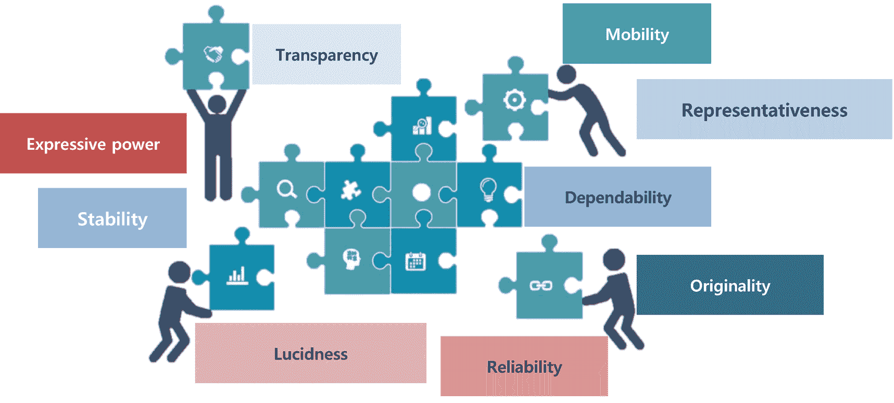

# 四、由可解释性方法产生的解释的共同特性

最后三章涵盖了可解释性和可解释性方法的一般分类，介绍了可解释性的定义，并提供了不同方法的概述。从这一章开始，我们慢慢过渡到关于可解释性的更技术性的东西。在接下来的章节中，你会看到更多的公式和数学概念。

本章讨论由可解释性方法生成的解释的属性。正如黑盒模型有一些评估指标，如准确度、精确度和召回率，有必要评估可解释性方法，因为可解释性的输出用于许多可操作的决策。本章列出了几种可解释方法的不同属性。后面的章节解释了如何使用这些属性来提出一些评估标准，以衡量和理解我们对模型的解释是否有意义。

在直接进入属性之前，你一定已经注意到我们已经多次使用了单词*解释*。此外，如果你看看这一章的标题，它也说“解释的共同属性。”我们来讨论一下什么是解释。

## 定义的解释

"解释是对“为什么”问题的回答."

解释的目的是让事情变得清晰、易懂、透明和可解释。可解释性是我们想要达到的最终目标，而解释是达到可解释性的工具。解释将特征值或变量与它们各自的预测联系起来，以便我们人类能够容易地理解。这增强了模型的可解释性。

需要研究一些解释理论。一些理论假设只有一个合适的解释，这意味着答案的正确性与观众是否能理解无关。其他类型的理论认为，解释应该考虑听众或用户。由于不同的用户有不同的知识基础，这样的理论自然与一件事情可以有多种解释的假设相一致——这种现象被称为*罗生门效应*。

有人认为第二种理论比第一种更合适。可解释 ML 的原则是基于这样的理论:我们更关心让观众理解 ML 模型预测背后的原因。这些解释与知识获取有关，并涉及通过推理过程得出解释，这意味着首先识别事件的原因，然后选择原因的子集作为解释。

解释的另一个目的是让听者从解释者那里获得足够的信息来理解某个事件或决定的原因。解释者可以是人，也可以是机器。

最后，我们想说，解释是高度主观的。因此，我们用来创建解释的任何方法都应该是灵活的，以适应将使用这些解释的人类同行的需求。换句话说，没有一个单一的解释可以解决所有的可解释性问题。我们应该考虑我们试图为之建立解释的领域、用例以及受众。

每种情况都需要考虑问题领域、用例以及解释的目标受众。现在，既然我们理解了什么是解释，当我们提到可解释的 ML 时，让我们深入这些解释的属性。

## 解释方法的属性

图 [4-1](#Fig1) 突出显示了构成解释方法构件的不同属性。每个解释方法都应该满足所示的一个或多个属性。此外，当选择一个用例的解释方法时，您应该分析该方法采用了哪些属性，然后决定使用该方法。

图 4-1

可解释性方法的共同属性

可解释 ML 方法的属性可以评估和比较各种解释方法。

### 表达式模板

可解释性方法的主要属性之一是它们的表达方法，或者说它们如何表达结果。结果可以用规则、决策集、自然语言或图表的形式表示。

### 透明度

特定于模型的解释方法是高度透明的，而与模型无关的方法是零透明的。透明性意味着解释方法在多大程度上依赖于 ML 模型的内部工作，比如模型的参数。

### 机动性

流动性与各种 ML 模型相关，特定的可解释方法可以应用于这些模型。与模型无关的方法是高度可移植或可移动的。它们可以应用于许多模型框架，因为它们利用模型的公共参数，然后自己构建解释。

### 算法可行性

算法的可行性与该方法的计算复杂性有关。尽管一些方法承诺给出有意义的结果，但是它们太复杂了，以至于需要花费大量的时间和资源来运行它们并得到解释。计算时间是一些非常著名的方法的主要缺点。除了时间之外，需要考虑一些算法特性来定义方法的可行性。一些方法包括数据采样过程，这意味着解释可能不稳定。这意味着用相同的参数重复相同的实例和模型会导致不同的解释。

现在我们已经讨论了解释方法的属性，让我们看看这些方法生成的解释。

## 个别解释的属性

某些属性适用于解释，而不是整个方法。接下来，让我们讨论对于评估由方法生成的解释来说至关重要的属性。解释通常以人类可以理解的方式将实例的特征值与其模型预测联系起来。

### 正确性

正确性与对测试数据或看不见的数据的解释的准确性有关。当我们评估一个可解释性方法时，我们得到的一个让步是，如果黑盒模型的准确性本身，那么你可以接受解释中较低的准确性。

### 忠诚

忠诚度是解释的基本属性之一，因为低忠诚度基本上是无用的。所谓忠诚，我们指的是解释与模型预测的接近程度。高准确率和高忠诚度是相辅相成的。然而，一些方法只提供本地忠诚度，这意味着它们只能很好地接近单个实例或组。

### 可靠性

可靠性是在两个不同模型的背景下测量的，这两个模型在相同的任务上训练，并且具有相似的输出预测。这个性质与它们之间的解释差异有多大有关。

如果解释非常相似，说明高度依赖。然而，这个属性很棘手，因为两个模型可能使用不同的特征，但得到相似的预测。在这种特定情况下，高可靠性是不可取的，因为解释应该是非常不同的，因为模型使用不同的关系进行预测。当模型依赖于相似的关系时，这个属性是可取的；否则，解释反映了模型所依赖的数据的不同方面。

### 坚决

坚定性表示对相似实例的解释的相似性。稳定性比较固定模型的相似实例之间的解释，而可靠性比较不同模型之间的解释。

高稳定性代表这样一个事实，即模型特征值的微小变化不会导致解释的实质性变化，除非预测本身有很大变化。像取样方法这样的解释方法的特定成分也可以归因于缺乏稳定性。然而，稳定总是可取的。

### 透明

当我们必须判断人类理解解释的程度时，我们看方法的清晰性。清晰是最难定义和衡量的。

可解释性是一个主观的概念，其属性取决于受众和使用方法的环境。这是衡量这些特性可理解程度的一个标准。一个方法中的几个模块可能会使解释变得难以理解；比如特征的转化。

### 可靠性

可靠性与 ML 模型的确定性相关联。许多 ML 模型仅提供预测值，并且不包含关于模型对预测正确性的置信度的任何陈述。可解释性解释的可靠性有助于向模型用户灌输关于模型正确性的信心。

### 意义

显著性衡量解释如何很好地反映它们自己部分的特征的重要性。例如，如果解释生成一个决策规则列表作为对模型重要性的解释，那么哪个规则的条件是最重要的？

### 独创性

原创性属性测试预测是来自作为输入提供的特征空间中的区域，还是超出输入特征的边界。万一越界了，那么解释可能就不准确或者没用了。检查这一点的一种方法是在训练数据的分布中找到要解释的数据实例。

### 代表性

代表性描述了解释的覆盖范围(即解释覆盖的实例数量)。解释可以覆盖模型的全部数据；例如，线性回归模型中权重的解释。另一方面，一些方法可能只覆盖一个实例。

我们从技术角度讨论了解释的属性。然而，我们想提醒你的是，可解释性就是让模型对人类友好。因此，下一节将讨论从人类友好的角度来看哪些解释属性是可取的。

## 人性化的解释

解释总是不能以一种容易理解的方式呈现。对解释出版物进行了研究。大多数现有的可解释性工作使用方法开发人员或研究人员的直觉，他们认为什么是人类友好的。然而，应该有一个标准化的格式来做出人性化的解释。让我们来看看一些人性化解释的可取之处。

### 对比性

人类是一个好奇的物种。我们一般会问为什么。然而，我们并不止步于为什么。我们倾向于更深入地探究为什么，然后下一个问题是为什么不呢？因此，人们通常会问为什么没有做出某种预测，而不是问为什么做出了预测。这是一种思考反事实的倾向(从陈述事实的相反方面思考)。有时利益相关者对导致特定解释的因素不感兴趣。相反，他们发现在确定输入中哪些因素需要改变以便模型也改变其预测方面更有价值。

### 选择性

解释方法要有选择性。他们应该只提供关于模型及其特性的相关信息。这些方法应该只解释围绕其建立模型的事件的主要原因。因为目标是简化复杂的黑盒模型，产生导致混乱和浪费时间和资源的复杂解释。较低数量的解释确保它们易于理解。罗生门效应描述了不同的原因可以解释一个事件的情况。由于人类更喜欢选择一些原因，所选择的原因可能因人而异。

### 社会的

解释对人类友好的另一个重要属性是，它们是解释者和听者之间社会互动的一部分。在挑选一个合适的解释时，你应该记住这个因素，只挑选与模型的生态系统和目标受众相关的解释。最佳解释应该总是因领域和用例而异。

### 关注异常情况

解释的一个重要方面或性质是包括异常情况。这对于向用户提供完整的信息至关重要。这使用户能够理解模型以及为什么完全采取某些决策。排除这些异常情况可能会导致解释的普遍化。我们应该确保异常情况应该包括在解释中，即使它们对模型产生的影响与更频繁的解释相同。

### 真实的

好的解释在现实世界中被证明是正确的。这并不意味着整个真相必须在解释中，因为它会干扰解释被选择与否，选择性是一个比真实性更重要的特征。就最大似然可解释性而言，这意味着一个解释必须有意义(似是而非)并且适合其他实例的预测。

### 与先前的信念一致

人们倾向于忽略与他们先前的信念不一致的信息。这种效应被称为*确认偏差*。信念的集合在主观上因人而异，但也有基于群体的先验信念，主要是文化的，比如政治世界观。尽管如此，这是一个与真实性的权衡，因为先验知识通常不是普遍适用的，只在特定的知识领域有效。Honegger 认为，一个解释既真实又与先前的信念一致，这将会适得其反。

### 一般和可能

能够解释许多事件的原因是非常普遍的，因此可以被认为是一个很好的解释。这似乎与非正常原因可以很好地解释这一说法相矛盾。然而，根据定义，异常原因在给定场景中是罕见的，这意味着，在没有异常原因的情况下，一般的解释可以被认为是一个好的解释。关于 ML 可解释性，通用性可以很容易地通过特性的支持度来衡量，支持度是解释所适用的实例数量与实例总数之间的比率。这些属性是机器学习中可解释性的基础，尽管根据上下文，有些属性可能比其他属性更相关。无论一个解释多么正确，如果它不合理或者对人类没有吸引力(对人类友好)，那么 ML 可解释性的价值就消失了。

## 摘要

本章简要讨论了三个重要的可解释性概念:解释、可解释方法和解释的*属性*和*人类* - *友好解释*及其属性。这些主题对于可解释性背后的理论以及如何在现实生活场景中理解它非常重要。接下来的几章将详细解释这些属性。这些属性主要用于可解释性方法的评估。它们帮助我们理解可解释性中的人为因素，以及人类如何看待可解释性技术的使用。