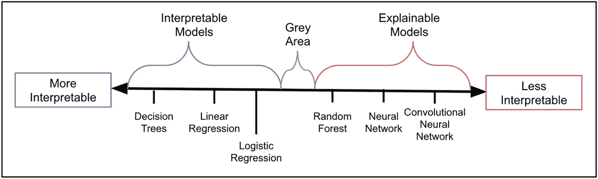

# 7.可解释的 ML 和可解释的 ML 差异

到目前为止，我们已经研究了可解释性及其特性。在我们进入模型可解释性的技术部分之前，以正确的方式理解基本的东西是有益的。许多术语在不同的文章中使用不严格。一些常见的可解释性方法是 SHAP 和莱姆。然而，有些人在可解释的 ML 下不严格地提到它们。本章强调了可解释的 ML 和可解释的 ML 之间的区别。

## 可解释的 ML 和可解释的 ML 基础

让我们从基础开始。如果人类能够自己理解，那么任何模型都是可以解释的。模型汇总统计数据和参数足以解释模型为什么做出某种预测或决策。

让我们以决策树为例(见图 [7-1](#Fig1) )。这个问题的目的是预测某人是否会支付汽车贷款。会违约的人被标记为是，其余的被标记为否。

图 7-1

一个简单的决策树模型展示了可解释模型是如何工作的

现在让我们假设一个月收入 3000 美元的 29 岁女性申请贷款。基于这种模式，她通过自动承保系统获得了一笔贷款。我们现在可以检查树的节点，以了解为什么贷款被批准。

第一次分裂发生在可变年龄。由于候选人是 29 岁，因此我们沿着右侧节点向下。下一次拆分发生在收入方面。因为她有 3000 美元的收入，所以我们再次从右边下去，到达无叶节点。

因此，根据模型，学生不会拖欠贷款。

### 分析决策树

使用具有以下等式的简单线性回归模型，让我们通过基于一个人的年龄和收入建立模型来预测最大贷款规模。y 是个人的贷款规模。

***Y = 100 *年龄+10 *收入+ 200***

从等式中可以看出，一个人的年龄每增长一年，预测的最高贷款额就会增加 100 美元。此外，贷款规模随着收入的增加而增加。

对于这个例子(29 岁，收入 3000 美元)，最大贷款规模预计为 33100 美元。

我们可以查看模型的参数，并理解为什么会做出特定的预测。这是可能的，因为这些模型相当简单。该方程有三个参数。但是当模型变得更加复杂时，就很难理解它们了。

随机森林是一个复杂的模型。它由多个单独的树组成，通过考虑每棵树的输出来进行最终预测。为了理解随机森林做出的决策，我们必须同时理解整个模型中每棵树的决策。即使只有少量的树，这也是一项复杂的工作。

现在想象一下当我们谈论神经网络模型时的复杂程度。例如，通常用于图像识别的卷积神经网络 AlexNet 具有 62，378，344 个参数。然而，一个简单的回归模型只有三个参数。人类根本不可能理解如此规模和复杂的模型。某些技术(如确定每个特征预测目标变量的能力的特征重要性分数)有助于理解模型行为。分数越高，特征对模型预测的影响就越大。

一些技术分解单个预测。所以不像主要在全局水平上起作用的特征重要性。在整个数据集上，这些技术解释了特定特征如何影响单个实例的行为。石灰和 SHAP 就是这样的方法。此外，还有像 DeepLift 这样的方法，可以为神经网络模型提供解释。

在使用这些技术时，您应该非常小心，并且应该始终专注于构建领域知识。为了消除任何混淆，您可以单独或组合使用多种技术。

本节讨论了模型是可解释的，还是可以用某些技术解释的。然而，这种方法之间的明确分离可能存在，也可能不存在。

### 深入挖掘

模型的可解释性可以在一个谱上显示出来，有些技术比其他技术更具可解释性。可解释性是一个模型可以被人类理解的程度。因此，如果一个模型比另一个模型更容易让人理解它是如何做出预测的，那么这个模型就比另一个模型更容易解释。

图 [7-2](#Fig2) 显示了可解释性谱。卷积神经网络比随机森林更难解释，而随机森林比决策树更难解释。

图 7-2

可解释性的范围显示了可解释的 ML 和可解释的 mL 之间的区别

可解释的模型位于光谱的左边，而可解释的模型位于光谱的右边。然而，也有一个灰色地带，你会发现人们会不同意这种分类。

这个线性回归模型是可解释的，因为它容易被人理解。我们只有两个简单的特征(即年龄和收入)；然而，如果我们包含更多的特征，这个模型将更倾向于复杂的一面，而不是可解释的一面。

在机器学习和模型构建领域，可解释的 ML 和可解释的 ML 通常可以互换使用。尽管这些术语彼此非常接近，但仍有一个我们应该记住的基本区别。

可解释 ML 是研究或使用系统或模型，这些系统或模型可以根据模型本身的特征来解释。当提到模型的分类时，它是一个非常接近或类似于内在可解释性的术语。可解释的 ML 由本质上可解释的模型组成。本章着眼于线性模型和决策树(见图 [7-1](#Fig1) )。这些是可解释的模型，因为我们可以用模型本身来解释为什么模型会做出某种决定。它能够看到一个算法并说，*是的，我能看到这里发生了什么。*

然而，可解释的 ML 是我们可以使用可能依赖或可能不依赖于模型本身的技术来解释机器或深度学习模型的内部机制的程度。用更简单的术语来说，人们可以认为可解释的 ML 是一个术语，可以用于所有需要一种方法来解释模型内部发生的事情的黑色模型。基本上，可解释的 ML 有助于理解为什么模型做出某个决定。

让我们以一项运动为例来解释一下其中的区别。假设你正在观看一场板球比赛，球员击球得分。你获取所有这些数据，并围绕这些数据建立一个模型，以预测一次拍摄是否会产生边界。当球接近击球手时，模型会预测击球是否是边界。在这种情况下，可解释的 ML 是当你理解为什么模型预测一个边界的时候。你可能会看到击球手站得很高，身体前倾处于攻击位置，球投在了正确的区域，因此击球手能够打出好球。可解释的 ML 试图理解镜头背后的化学反应。它解释了为什么击球手能够得分的所有因素。它揭示了球距和球棒质量之间的复杂相互作用，以及球员的情绪、历史表现或最喜欢的击球区域。

理解*某事如何*发生是可解释的 ML，而理解*某事为什么*发生是可解释的 ML。可解释的 ML 发现它在黑盒模型的场景中使用一个案例。

在了解了可解释的 ML 和可解释的 ML 之间的区别之后，我们认为理解管理这两者的挑战以及为什么在不同的场景中需要这两者是有好处的。让我们深入关键问题，从可解释的机器学习开始。

## 可解释的 ML 的关键问题

最近关于黑盒可解释性的工作可能包含一些通常被忽视的关键问题，但这些问题可能会对机器学习模型的广泛使用产生持久的负面影响。

### 准确性和可解释性之间的权衡

更复杂的模型通常更准确，这意味着有时有必要使用复杂的黑盒模型来获得更好的预测性能。这可以通过具有自然有意义特征的良好结构化数据来避免。当我们处理具有有意义特征的结构化数据问题时，在预处理操作之后，更复杂的分类器(如深度神经网络、增强决策树、随机森林)和更简单的分类器(如逻辑回归和决策列表)之间有时在性能上没有重大差异。一些人认为，将可解释的 CART 模型与更先进的神经网络模型进行比较是不公平的，并认为可解释性只能通过牺牲准确性来存在。然而，在当前的场景中，我们看到，为了实践可解释的 ML，你需要建立在复杂模型之上的方法来实现准确性。

### 当心不忠的人

有时可解释的 ML 方法提供的解释并不忠实于原始模型的计算结果。对原始模型如何预测或表现的解释并不总是真实的。一个不准确的解释模型是非常危险的，因为用户会发现很难相信这样的模型。术语“解释”有时本身就很容易误导人，因为解释模型并不总是试图模仿原始模型所做的计算。在某些情况下，基于复杂模型构建的解释模型可以使用完全不同的一组要素生成相同的预测行为。因此，解释模型并不总是能达到它的目的。

### 不够详细

解释有时不能提供黑盒模型内部发生的事情的足够细节。

即使解释模型是正确的，有时解释也可能不能提供实际复杂模型的全貌。最近，数据科学家倾向于只关心正确的标签。因此，许多可解释的 ML 方法主要集中在对正确标签或积极标签的洞察上。应该注意的是，在负面标签中也可能隐藏着许多信息，而且就解释而言，负面标签并不总是正面标签的反义词。一个变量可以分别讲述关于正面和负面标签的非常不同的故事。因此，可解释 ML 的一个缺点是，它纯粹是用来解释正标签的。

## 可解释 ML 的关键问题

在很多情况下，有解释的黑盒比可解释的模型更受青睐，即使是高风险的决策。可解释的模型有时可能存在计算问题，或者研究人员的培训和代码的可用性问题。下面的部分强调了可解释 ML 的一些主要问题。

### 利润与损失

公司可以从其黑箱模型产生的预测商标中获利，但可解释的 ML 可能导致损失。可解释的 ML 可能会给那些试图通过性能良好的内部构建的黑盒算法赚钱的公司带来损失。可解释的 ML 不需要可解释的方法。很容易理解模型背后的机制。因此，它破坏了使用复杂的高精度黑盒模型的用例。

用于风险预测的累犯工具 [1](#Fn1) 在美国司法系统中被广泛用于检查或预测哪些罪犯在释放后可以再次被捕。该模型的输出在 if-then-else 规则方面很简单，该规则基于年龄和过去犯罪的数量来预测一个人再次犯罪导致入狱的可能性。一个简单的可解释的 ML 模型可能和这个一样精确。然而，这个模型背后的公司已经把它变成了出售给政府的专有软件。该模型对于累犯预测与仅涉及年龄和过去犯罪次数的简单三规则可解释机器学习模型一样准确。然而，它被作为专有软件卖给了司法系统。

在医学领域，有一种盲目接受黑箱模型的趋势，这为公司向医院出售更多模型打开了大门。

这些例子表明，机器学习的商业模式存在问题。从高风险决策的黑箱模型中获利的公司并不完全负责个人预测或对这些预测的解释的质量，因为没有人知道模型内部发生了什么以及结果是如何产生的。我们所能做的最好的事情就是应用一种可解释的方法并推导出其机理。由于这个原因，可解释的 ML 不是很受欢迎，也不被鼓励。支持黑盒而不是可解释 ML 的理由是黑盒可以防止逆向工程。

### 努力构建

可解释的模型需要在计算和领域专业知识方面付出巨大的努力来构建。

为了构建能够给出和黑盒模型一样好的结果的可解释模型，您需要高度的领域专业知识和计算时间。一旦我们增加传统可解释 ML 模型中的特征数量，计算时间就会急剧增加。此外，模型构建者应该与模型评审者保持联系，以检查结果是否有意义，是否与业务目标一致；否则，可解释模型的输出和黑盒模型一样好。这导致一个好的模型需要大量的构建时间。可解释的模型通常有一组特定于应用程序的约束。解决约束问题在实践中变得困难。

### 隐藏模式

许多研究人员和科学家发现构建可解释的模型具有挑战性，因为他们发现黑盒可以揭示数据中的各种隐藏模式。透明模型有时可能无法揭示数据中的这种模式。一个可解释的模型只能揭示数据中的模式，如果研究人员花费大量的时间和专业知识来创建一个最先进的可解释的方法。这需要大量的领域专业知识。

既然你已经研究了可解释 ML 和可解释 ML 的挑战，深入研究可解释 ML 的另一个方面是有益的。下一节讨论*建模* *解释*与*建模* *预测的区别。*

## 解释性和预测性建模

解释性建模，正如我们现在所熟悉的，是为了揭示模型中隐藏的模式。解释性建模的目的是理解模型的一切，从倾向分数到因果关系、特征重要性、反事实推理等等。总之，解释性建模是指将统计模型应用于数据，以测试关于理论结构的因果假设。

预测建模是对输入数据使用不同的算法和预处理技术来创建模型的过程。所得到的模型可以高精度地预测新的观测值。这种类型的建模的唯一目标是创建一个预测，它可以像对训练数据一样对看不见的数据起作用。

对用于预测建模的技术没有限制；例如，您可以使用贝叶斯或频率、参数或非参数、数据挖掘算法或统计模型。

### 解释还是预测:两种选择的主要区别

在概念层面上解释现象的能力与在可测量的层面上产生预测是非常不同的。这种差异是由将理论操作化为统计模型和可测量数据造成的。

为了恰当地传达这种差异，考虑一个理论，X 导致 Y，让我们用函数 F 来描述它，使得 Y = F(X)。

f 可以被认为是一个具有二维输入和输出的模型，其中 X 是输入结构，Y 是输出。f 可以是具有优化或预测行为的任何模型。

因为 F 通常不够详细，无法得出单个 F，所以通常考虑一组 F 模型。

在解释性建模中，目标是尽可能匹配 F 和 F，以进行统计推断并证明理论假设。X 和 Y 数据是估计 f 的工具，f 检验因果假设。解释性建模的目标是理解 X 和 Y 之间的关系，以及 X 的变化如何控制 Y 的变化。另一个目标是理解 f 机制在接受 X 的输入并产生 Y 的输出时如何工作。

相比之下，在预测建模中，X、Y 和 f 实体被组合以创建新 Y 值的良好预测。即使潜在的因果关系是 Y = F(X ),不同于 F(X)的函数和不同于 X 的数据可能更适合于预测。

四个主要方面可以解释这些差异。

*   **因果关系–关联**:在解释性建模中，f 表示一个底层的因果函数，X 被假设为引起 y，在预测性建模中，f 捕捉 X 和 y 之间的关联。

*   **理论–数据**:在解释性建模中，F 是以支持解释 X 和 Y 之间的估计关系和测试因果假设的方式基于 F 精心构建的。在预测建模中，f 通常是根据数据构建的。X 和 Y 之间的关系不需要直接的可解释性，尽管有时透明度是需要的。

*   **回顾性–前瞻性**:解释性建模是回顾性的(即，模型对数据有一些一般性的见解)。然而，预测建模是前瞻性的(即，模型函数预测新的观察结果或未来的观察结果)。

*   **偏差–方差**:使用二次损失函数，对值为 x 的新观测值的预期预测误差如下所示。

偏差是错误指定统计模型 f 的结果。在解释性建模中，重点是最小化偏差，以获得基础理论的最准确表示。相比之下，预测建模试图最小化偏差和估计方差的组合，偶尔牺牲理论准确性来提高经验精度。

为了进行正确的建模，您应该预先决定用例是否需要他们建立一个模型来解释或预测。基于选择，在某些参数上有许多不应该被忽略的差异。下面介绍其中的两种。

*   **变量的选择**:在解释性建模中，变量的选择是基于理论因果结构中构造的作用和可操作性本身。与不同角色相关的特定术语存在于各个领域中；例如，在社会科学中，它们是前因变量、后果变量、中介变量和调节变量。在药理学和医学科学中，它们是治疗和控制变量，在流行病学领域，它们是暴露和混杂变量。在预测建模中，没有必要根据潜在的因果结构深入研究每个变量的确切作用。选择预测变量的标准是预测变量和响应变量之间的关联质量。此外，数据质量和数据可用性也起着重要作用。

*   **方法的选择**:解释性建模需要通俗易懂的统计模型。在不存在可解释模型的场景中，您需要从可解释的 ML 中仔细选择方法来定义模型的内部机制。在预测建模中，首要任务是生成准确的预测。一些黑箱模型非常擅长生成高质量的预测。在预测建模场景中，透明度可能并不那么重要。在预测建模中尝试一定数量的方法，然后选择给出最佳准确度的方法是有益的。

## 验证、模型评估和模型选择

在一组模型中选择最终的模型，验证它，并评估它的性能，在解释性和预测性建模方面有明显的不同。虽然这个过程是迭代的，但是为了便于说明，我们将它分成三个部分。

### 确认

在解释性建模中，通常使用的验证方法是模型规范测试。这些测试构建了验证技术，如调查问题的可靠性和有效性测量以及因素分析。在预测建模中，构建好的模型时主要关注的问题之一是数据的泛化，这会导致过度拟合。因此，验证包括一些步骤，在这些步骤中，我们比较模型在训练数据集和维持数据集之间的性能，以确定模型没有在特定数据集上进行泛化。

### 型号选择

在解释性建模中，模型根据解释能力进行比较，因此嵌套模型很受欢迎，这种模型很容易比较。使用总体 F 统计来包括和/或排除变量的逐步型方法似乎适合于获得高解释力。然而，以这种方式优化解释能力在概念上与验证步骤相矛盾，在验证步骤中，变量包含/排除和统计模型结构被仔细设计来表示理论模型。与解释力相反，统计显著性在评估预测性能中起很小的作用或不起作用。有时，移除系数较小的输入(即使它们在统计上很重要)会提高预测精度。只要选择标准依赖于预测能力而不是解释能力，逐步型算法在预测建模中就很有用。

### 模型使用和报告解释性模型

在科学研究的背景下，使用推理得出“统计结论”，这些结论又被转化为关于 F、X、Y 和因果假设的科学结论。解释性研究侧重于理论、因果关系、偏见和回顾性分析，旨在测试或比较现有的因果理论。相应地，解释性科学论文的统计部分被统计推断所支配。在预测建模中，模型函数为新数据生成预测。我们注意到，根据模型的复杂程度和生成的预测类型，从模型中生成预测的难度会有所不同。例如，使用贝叶斯方法比使用预测似然方法更容易生成完整的预测分布。

我们必须注意可解释的 ML 和可解释的 ML 之间的区别。在印刷品和论坛的许多地方，我们可能会发现这些术语可以互换使用。因为这个领域是模型可解释性的，或者模型可解释性是一个发展中的领域，所以有一个严格的区别。可解释的 ML 一般指的是透明的、容易理解的方法或算法。可解释的 ML 指的是应用于黑盒算法之上的方法或算法，以理解黑盒模型做出的预测背后的原因。解释性建模是为了理解复杂模型背后的机制。它试图发现算法内部正在发生什么，以及预测是如何进行的。当我们想要了解复杂的关系，并从模型的特征和预测器之间的这些关系中得出行动和见解时，就需要这样做。然而，预测性建模是在我们希望对看不见的数据进行预测的地方进行的。在这种情况下，我们对定义模型的特征或组件之间的关系不感兴趣。

就这样，我们来到了本书第二部分的结尾。这一章集中在解释方法的属性，以及人类如何理解这些方法和解释。我们还理解了一些常用术语之间的主要区别。下面快速总结了本章的基本概念。

## 摘要

这一章定义了解释和说明的区别。我们认为让你了解其中的区别是非常重要的。我们强调了可解释的 ML、可解释的 ML 和可解释性在它们的基本概念上的区别。我们讨论了可解释 ML 和可解释 ML 的缺点，并推荐了选择方法的考虑因素。一旦解释和诠释之间的区别清楚了，我们继续解释预测建模和解释建模之间的区别。当您处理不同需求的问题时，您将能够联系到这一点。

下一章解释了每种方法所属的各种框架。你将能够把不同的框架与不同的属性和分类联系起来，我们已经在前面的章节中学习过了。

<aside aria-label="Footnotes" class="FootnoteSection" epub:type="footnotes">Footnotes [1](#Fn1_source)

[https:// www。propublica。org/article/how-we-analyzed-the-compas-recipience-algorithm](https://www.propublica.org/article/how-we-analyzed-the-compas-recidivism-algorithm)

 </aside>