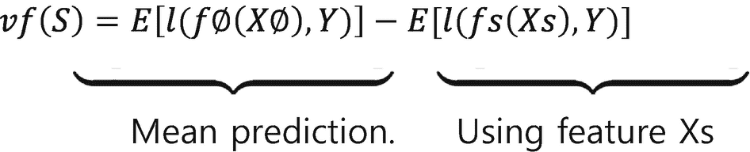
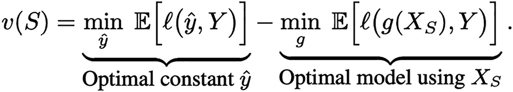
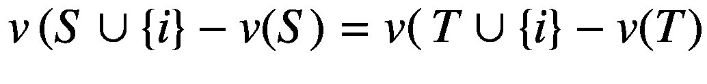
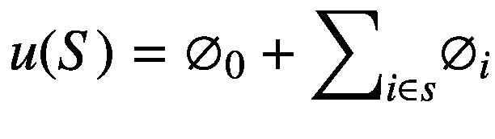
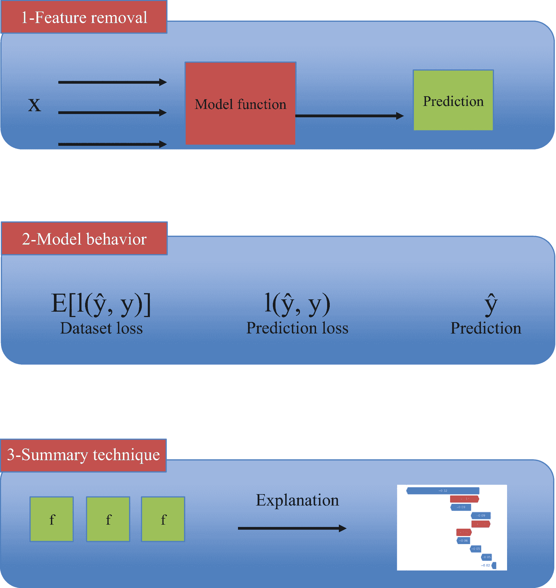
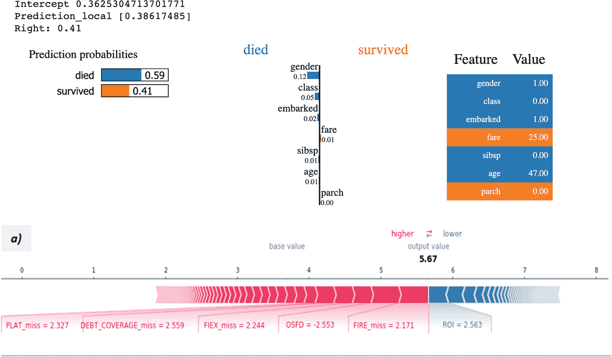
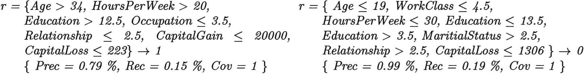
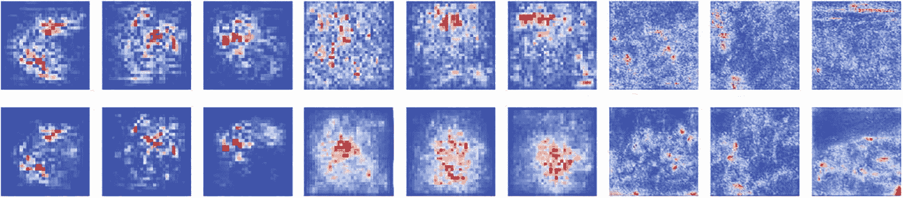
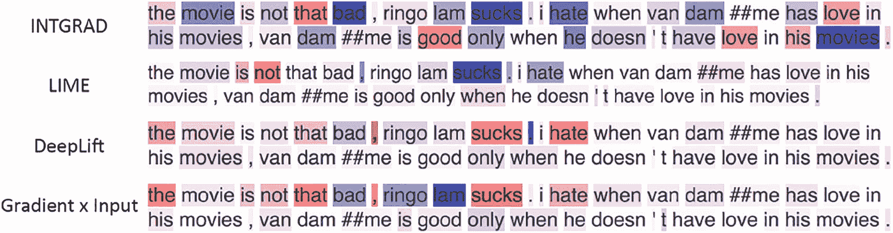
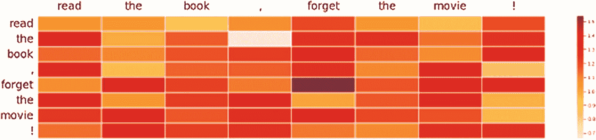

# 八、模型解释的框架

最后几章介绍了机器学习领域、可解释性的重要性以及可解释性方法的分类。前面的章节介绍了机器学习的可解释性，并侧重于一般概述和定义。本章讨论模型解释的不同框架。因为每个类别下有各种各样的方法，请参考接下来的章节，详细了解每种方法的工作原理，以及代码的一些工作版本。

从本章开始，我们将深入到关于可解释性方法的更复杂的技术细节。我们谈了很多不同方法中涉及的数学，以及可解释性理论是如何构建的。我们建议你用纸和笔写下一些讨论过的关键数学公式。如第 [1](01.html) 章所述，创建一个学习模板是有益的。

## 数据集一览

机器学习是一个非常多样化的主题，包括各种应用程序的数据集。我们有表格数据、文本数据和图像数据。所有这些数据类型都有数百种模型和几种可解释性方法。然而，所有方法的一个共同点是这些方法是如何建立在这些模型之上的。我们的焦点主要集中在事后可解释性技术的框架上，因为模型内在方法依赖于模型本身的框架。我们首先简要讨论不同数据集的不同框架，然后解释每个框架。

以下是对不同类型数据集的简要介绍。

*   **表格数据**:机器学习的表格数据是数据集最常见的形式，在所有商业领域都非常普遍。随着大数据在行业中的革命，公司已经建立了技术生态系统来存储大量的表格数据。这些数据集的范围从交易数据集到个人信息数据集。表格数据可以运行一些流行的监督机器学习算法，如黑盒分类算法和非监督算法，如聚类。公司严重依赖表格数据集进行各种操作，而不仅限于分析和数据。

*   **文本数据**:在电子商务公司激增后，文本数据也变得越来越受欢迎。电子商务企业的一个主要需求是评估客户评论，这些评论大部分是以自由文本的形式编写的。很快，出现了许多算法来研究文本数据，从情感分析到命名实体识别到分类等等。

*   **图像资料**:计算机视觉在机器学习领域经过一些前沿研究后慢慢流行起来。公司开始使用这些算法来分析视频源、图像和直播视频。零售领域中的典型图像数据可能由需要分类或分解成不同部分的物品的图片组成。

有了这么多的算法来分析这些不同类型的数据集，就需要有不同类型的可解释性算法来理解不同模型做出的决策。

本章旨在根据返回的解释类型对解释方法进行分类，并介绍最广泛采用的量化评估方法，以验证不同方面的解释，并对采用这些方法的解释者进行基准测试。目标是指导将黑盒模型映射到一组兼容的解释方法。

## 表格数据的框架类型

本节着眼于为表格数据集生成解释的各种框架。

*   **基于规则(RB)** :将表格数据转换成一组规则的框架，对数据进行建模。在分类问题中，每个类都有一组规则来定义该类的行为。

*   **特征重要性(FI)** :包含每个特征的值的向量。每个值表示该特征对于分类的重要性。

*   **原型(PR)** :为用户提供了一系列的例子来表征一类黑盒。原型是代表所有数据的数据实例。

*   **反事实(CF)** :预测的反事实解释描述了特征值的最小变化，该变化将预测变为预定义的输出。

### 特征重要性(FI)

在这个互联网唾手可得的时代，数据的创建和获取变得越来越容易。这导致了数据集的创建，数据集具有与每个数据点相关联的数千个特征。一个例子是跟踪零售网站上的用户行为或安装在汽车上的人工智能系统的详细传感器信息。

由于如此大的数据集，深度学习和梯度提升等强大的机器学习方法可以在大多数任务中实现非常强的预测性能。然而，由于这些模型是黑盒模型，人类很难理解输入特征如何一起工作来构建预测。我们已经在前几章谈到了这些挑战。这个问题在大规模数据集中被夸大了许多倍。有时，大多数或所有的预测性能都可以通过一小部分特征来实现。这导致不必要的计算复杂性、训练模型花费的更多时间以及较低的样本外性能，因为当暴露于许多噪声特征时，算法可能无法正确检测驱动信号的特征。

不幸的是，我们通常不能仅凭直觉直接确定这样的特征子集。因此，研究的重点是开发数据驱动的方法来识别相关特征，使我们能够丢弃那些不能为预测提供额外价值的特征。一种最常用的特征选择方法是基于评估机器学习模型的变量重要性，该方法试图量化每个特征对于预测目标变量的相对重要性。变量重要性是通过测量与其他特征相比该特征对模型性能的改善来计算的。一旦你确定了最重要的特性，你就可以去掉那些不重要的特性。可变重要性也是模型可解释性的一种方法，通过这种方法，您可以通过评估在模型训练期间哪些要素被声明为重要来尝试理解模型如何进行预测。

但是，请记住，任何特性重要性的方法只有在准确的情况下才有用。如果某些特征重要性方法高估了不相关特征的重要性，它可能会阻止不重要特征的移除。另一方面，如果相关特性的重要性被低估，我们可能会丢弃重要的变量，并对最终模型的性能产生负面影响。因此，理解变量重要性如何表现至关重要，特别是当应用于不同的机器学习模型时，变量重要性是否表现出不同的特征。在可解释性的可变重要性领域中有几个框架。下面几节将对每一个进行解释。

### 特征子集的预测能力

考虑一个有监督的学习任务，其中存在以下元素。

*   预测的 f 模型

*   响应变量 Y

*   一个输入 X，其中 X 由独立的特征组成(X 1 ，X 2 ，。。。，X d )。

x 表示随机变量，x 表示值。

特征重要性可以定义为提供或计算一个特征为模型提供多少预测能力。

使用所有特征来训练模型 f；然而，性能也可以用特性的子集来分析。举个例子，

xs≦{ xI| I∈s }对于不同的 S ⊆ D，其中 d≦{ 1，.。。，d}。

重要的特征是那些当被移除时导致 f 的性能下降的特征

受限模型 f S 定义为

![$$ fs(xs)=E\left[f(X)| Xs= xs\right] $$](img/511613_1_En_8_Chapter_TeX_Equa.png)

从而使用条件分布[1](#Fn1)p(XS| XS= xs)将缺失的特征 X S 边缘化。

两个特例是 S = ∅和 S = D，分别对应于均值预测 f∅(x∅) = E[f(X)]和全模型预测 f D (x) = f(x)。

使用这种约定来适应特征的子集，该方法现在可以测量当移除时 f 的性能降低了多少。给定一个损失函数，f S 的总体风险定义为 E[l(f s (X s ，Y)]，其中期望取数据分布 p(X，Y)。为了将预测能力定义为一个随模型准确性增加的量，考虑平均预测的风险降低，并定义函数 vf : P(D) → R 如下。

该域是功率集 P(D)，左边的项是利用平均预测 E[f(X)]实现的损失，右边的项是利用特征 X S 实现的损失。函数 v f (S)量化了 f 从特征 X S 得到的预测能力的数量，并且我们通常期望在 S 中包括更多的特征使得 v f (S)更大。虽然 v f 提供了基于模型的预测能力的概念，但是该方法也引入了通用预测能力的概念。为此，函数定义为 v : P(D) → R，即使用最优模型时从 X S 开始的风险降低。

左边的项是来自最优常数预测 y’的损失，右边的项是来自所有函数类(例如，贝叶斯分类器)的最优模型 g 的损失。直观地说，v 代表可以从 X S 中假设得出的最大预测能力。由于通常使用经验风险最小化来训练 f，因此基于模型的预测能力 v f 提供了的近似值，并且在 f 是最佳的某些情况下，两者是一致的。

### 附加重要性度量

在某些简单的情况下，特征以附加的方式贡献预测能力。这意味着

对于所有子集 s，t，使得 *i* ∉ *S* ， *T* 。在这些情况下，可以将 Xi 的重要性定义为其贡献的预测能力，或者∅ *i* = v({i})−v(∅).

然而，一个特征的贡献不是累加的，因为它取决于已经存在的 X S 个特征。

一类可加的重要性度量，包括任何一种其得分为∅1 的方法。。。，∅d 可以理解为与每个功能相关联的性能增益。这个框架让您可以统一许多方法，这些方法显式或隐式地定义了预测能力中的特性重要性。这类方法定义如下。

附加重要性度量是将重要性分数∅ *i* ∈ R 分配给特征 *i* = 1，.。。，d，并且对于它们存在常数∅ 0 ∈ R，使得下面的加法函数提供了特征子集的预测能力的代理；即*u*(*S*)≈*v*(*S*)。

对于该类中的方法，u(S)通过对每个包含的特性 *i* ∈ *S* 的值∅ *i* 求和，将 v(S)近似为常量值∅ 0 。每个∅ *i* 可以被视为与 X *i* 相关联的性能增益，这提供了其对于预测任务的重要性的度量。

虽然这些定义侧重于近似通用预测能力𝑣的方法，但它们也包括近似基于模型的预测能力𝑣f 的方法，因为它们隐含地近似 *v* 。对于大多数预测问题，函数 *v* 表现出非加性行为，因此代理 *u* 通常不能完美地表示每个特征对预测能力的贡献。虽然粗略的近似值可以为用户提供一些见解，但更接近的近似值可以更准确地了解每个特性的重要性。

### 基于移除的特征重要性解释

基于移除的方法属于可解释性的特征重要性领域，并且基于特征的移除来量化特征的影响。这个框架帮助模型专家更好地理解模型解释工具，并且提供了一个强大的理论基础，许多可解释性研究都可以基于这个基础。该框架整合了以前被认为是独立的方法类别，包括局部和全局方法以及特征归属和特征选择方法。图 [8-1](#Fig1) 是描述基于移除的解释的简单图示(见 [`https://arxiv.org/pdf/2011.14878.pdf`](https://arxiv.org/pdf/2011.14878.pdf) )。

图 8-1

基于移除的解释的统一框架。每种方法由三种选择决定:如何移除特征、分析什么模型行为以及如何总结特征影响

考虑可以使用输入 X 预测响应变量 Y 的 ML 模型，输入 X 可以表示为 X = (X1，X2，.。。，Xd)，其中每个 X i 代表年龄或收入等个人特征。我们用大写符号(例如 X)来表示随机变量，用小写符号(例如 X)来表示它们的值。我们还使用 X 来表示完整特征向量 X 的域，X i 来表示每个特征 X i 的域。

最后，xs≦{ Xi:I∈s }表示 s⊆d ≦{ 1，2，.。。d}，S ≡ D \ S 表示一个集合的补集。

让我们抛开固有的可解释模型。所有其他方法通过考虑输入的扰动并使用结果来解释每个特征对模型的影响来生成解释。基于移除的解释是一个统一的框架，它是通过将定义每个特征的影响的方法连接起来而开发出来的。

下面是依赖于这种框架或机制的一些最常见的方法。

*   布雷曼，2001；Ribeiro 等人，2016 年–随机森林特征重要性和排列重要性

*   Fong 和 Vedaldi，2017 年

*   伦德伯格和李，2017 年–SHAP

所有这些方法都基于特征移除的原理工作；然而，除此之外，他们还有一套多样化的方法。例如，LIME 将线性模型拟合到输入的可解释表示中。Shapley 效应检验了每个特征在多大程度上解释了模型的变化。这两种方法之间的差异很容易系统化，因为每种方法都删除了不同的功能集。然而，这种方法表明，即使是这两种方法也可以只用三个步骤来解释。基于移除的解释是对从模型中移除特征集的影响进行量化的模型解释。三个选择决定了这些方法。

*   **特征移除**:该方法如何从模型中移除特征(例如，通过将它们设置为缺省值或者通过忽略值的分布)

*   **模型行为**:该方法分析什么模型行为(例如，真实类的概率或模型损失)

*   **总结技术**:该方法如何总结每个特征对模型的影响(例如，通过单独移除一个特征或通过计算 Shapley 值)

这些方法通过描述不同方法之间的权衡，帮助您理解特性内部概念的重要性。我们将在接下来的章节中读到这些差异。

### 特征移除

在这里，我们定义了从 ML 模型中移除特征所必需的数学工具，并检查了现有的解释方法是如何移除特征的。

**特征子集上的函数**:大多数 ML 模型在给定一组特定特征 X = (X1，.。。，Xd)。在数学上，这些模型是 f : X →Y 形式的函数，我们用 F 来表示所有这些可能映射的集合。基于移除的解释背后的原理是移除某些特征以理解它们对模型的影响。由于大多数模型都需要所有要素来进行预测，因此移除要素比简单地不让模型访问它要复杂得多。要从模型中移除特征或在给定特征子集的情况下进行预测，我们需要一个不同于 f ∈ F 的数学对象，考虑域为 X × P(D)的函数，而不是域为 X 的函数，其中 P(D)表示 D ≦{ 1，.。。，d}。为了确保对保留特征的不变性，这些函数必须仅依赖于由子集 S ∈ P(D)指定的特征，因此我们将子集函数形式化如下。

*A* *子集函数* *是 F : X × P(D) → Y 形式的映射，它对不在指定子集中的维数是不变的。也就是说，对于所有(x，x′，S)我们有 F(x，S)= F(x′，* *S)使得 xS = x′S。为了方便起见，我们定义 F(x**S**)≡F(x，S)，因为 F.* 不使用保持的值 x*S*

 *子集函数的不变性对于确保只有指定的特征值决定函数的输出，同时保证其他特征值无关紧要至关重要。查看子集函数的另一种方式是它们模拟缺失数据的存在。当我们使用 F 来表示标准预测函数时，我们使用 F 来表示所有可能的子集函数的集合。

该方法中使用了子集函数，因为它们概念化了不同方法如何从 ML 模型中移除特征。基于移除的解释通常从现有的模型 f ∈ F 开始，为了量化每个特征的影响，它们必须建立一个从模型中移除它的约定。一种自然的方法是在原始模型 F 的基础上定义一个子集函数 F∈F。模型 f ∈ F 的扩张是一个子集函数 F ∈ F，它在所有特征都存在的情况下与 F 一致。即模型 f 及其扩张 f 必须满足 F(x) = f(x) ∀x ∈ X

### 解释不同的模型行为

基于移除的解释演示了模型如何工作，但是它们可以通过分析各种模型行为来实现。我们现在考虑在模型中保留不同特征时，要观察的目标量的各种选择。

特征去除原理足够灵活，几乎可以解释任何函数。例如，方法可以解释模型的预测或损失函数、神经网络中的隐藏层或计算图中的任何节点。事实上，基于移除的解释不需要局限于 ML 上下文:任何容纳丢失输入的函数都可以通过特征移除来解释，当输入组被移除时，通过检查其输出或其输出的某些函数。

每种方法的目标量可以理解为模型输出的函数，由子集函数 F(xS)表示。许多方法解释模型输出或输出的简单函数，如对数优势比。其他方法测量单个输入或整个数据集的模型损失。最终，如下所述，每种方法都基于表单的一组函数生成解释。

u:P(D)–> R

这表示与特征 S ⊏ D 的每个子集相关联的值。该集合函数表示方法旨在解释的模型行为。

### 总结特征影响

基于移除的解释的第三个选择是如何总结每个特征对模型的影响。表示模型对不同特征的依赖性的集合函数是复杂的数学对象，由于特征子集和潜在特征相互作用的指数数量，这些数学对象难以完全交流。基于移除的解释通过向用户提供每个特征影响的简明摘要来应对这一挑战。

许多方法都属于特征移除框架，并基于前面描述的三点原则工作。

以下是一些最常用的方法:IME、QII、SHAP(如图 [8-2](#Fig2) )、核 SHAP、树 SHAP、损失 SHAP、SAGE、Shapley、置换、条件、单变量、L2X、INVASE、LIME(如图 [8-2](#Fig2) )、PredDiff、CXPlain、RISE 和 FIDO-CA。其中一些方法将在接下来的章节中介绍。

图 8-2

石灰和 SHAP 输出样本

### 基于规则的解释

决策规则是表达模型重要特征的一种更简单的形式。除了给出重要的特征，决策规则集还提供这些特征的值，这有助于更好的预测。决策规则的一个优点是它们对人友好。他们用非常简单的文本格式解释模型，非技术用户和涉众很容易理解。

决策规则*，r* ，也被称为*逻辑规则*，具有 p → y 的形式，其中 p 是前提，由特征值上的布尔条件组成，而 y 是规则的结果。特别地，p 是形式为 xi∈[v (l) i，v (u) i ]的分裂条件的合取，其中 xi 是一个特征，v (l) i，v (u) i 是用∞扩展的 xi 域中的下限值和上限值。如果要解释的实例 x 满足 p，则规则 p → y 表示决策 g(x) = y 的候选解释。此外，如果可解释预测器模仿 x 邻域中黑盒的行为，则我们进一步推断该规则是 b(x) = g(x) = y 的候选局部解释。

在规则的背景下，你也可以找到反事实规则。反事实规则与决策规则具有相同的结构，唯一的区别是规则 y 的结果不同 w.r.t. b(x) = y。它们对于向最终用户解释应该改变什么以获得不同的输出非常重要。

一个规则解释的例子是*r = {年龄< 40，收入< 30k，学历≤本科}，y =拒绝。在这种情况下，记录{年龄= 18，收入= 15k，教育=高中}满足规则*。

最常见的基于规则的方法包括 ANCHOR、LORE、RuleMatrix、TREPAN、SkopeRules 和 GLocalX。

图 8-3

在线成人数据框架中的 XGB 全球解释。左边是大于 50K 级的规则，右边是小于 50K 级的规则

### 原型

从模型的角度来说，原型是一个表示一组相似记录的对象。

原型可以是

*   接近输入数据 x 的来自训练数据集的记录

*   输入所属的聚类的质心

*   使用特定过程生成的合成记录

原型的概念是基于这样一个事实，即用户通过查看与他们所选择的相似的记录来理解模型的推理。

原型不会在接下来的章节中详细介绍；因此，我们涵盖了基本的原型方法。

MMD-critic 是一种在模型之前工作的原型方法，因为它在分析下分析数据集的分布。它使用*最大平均差异* (MMD)来工作。原型解释了数据集的一般行为。它通过测量实例的分布和实例在整个数据集中的差异来选择原型。更接近数据分布的实例集被称为*原型*。这种方法只显示与原型不同但属于同一类别的少数数据点。

隐私保护解释是可解释性领域的第一种方法，它考虑了隐私保护解释。这是一种模型不可知的本地自组织方法。

通过构造微聚合，在解释的私密性和可理解性之间进行权衡。在这种方法中，创建了一组聚类。然后，对于每个聚类，创建一个浅层决策树来提供详尽的解释，同时由于树的深度有限而保持良好的可读性。当新记录 x 到达时，选择一个代表性记录及其相关的浅树。

原型选择(PS)是一个可解释的模型，它寻找能更好地代表被分析数据的原型。这种方法使用一个集合覆盖优化问题，对原型的属性有一些限制。输入数据集中的每条记录都被分配给一个代表性的原型。之后，原型被用来学习最近邻规则分类器。

### 反事实

反事实是一类模型可解释性方法，帮助用户生成模型的可操作解释。到目前为止，我们已经研究了不同的特征重要性方法和基于规则的方法，它们在全局或局部级别上告诉我们哪些特征对于模型是重要的。然而，这些信息并不能提供完全的清晰和理解。在现实生活中，用户感兴趣的是一旦他们知道哪些变量解释了一个特定的类，然后可以对这些变量或特征采取什么行动，以将实例从该类移动到另一个类或二元分类问题中的相反类。

因此，反事实聚焦于差异以获得相反的预测 w.r.t. b(x ) = y。

反事实解释的一般形式应该是:b (x) = y 被返回，因为 x 的变量有值 x1；x2；……;xn。相反，如果 x 的值为 x1/1；x1/2；……;x1/n 和所有其他变量保持不变，b(x)=–y 将被返回，其中 x 是具有建议更改的记录 x。一个好的反事实总是尽可能少地改变变量，以找到预测变化的最接近的组合。

反事实方法可以分为以下几种。

*   外源性:这些方法综合产生反事实。

*   内源性:在这些方法中，反事实是从参考人群中提取的，从而产生更真实的实例。

*   **基于实例的**:这些方法使用距离函数来检测黑盒的决策边界。反事实解释所实现的特性是效率、稳健性、多样性、可操作性和合理性。

### 图像数据的说明

本节将讨论可用于图像数据的不同解释框架。一些最常见的方法是显著图(SM)，概念属性(CA)，原型(PR)和反事实(CF)。在前面的章节中，您已经了解了反事实和原型。下一节重点介绍剩下的两种方法。

### 显著图

其中像素的亮度表示该像素的显著性的图像被称为*显著性图*。SM 是显著性图的缩写形式，它被建模为矩阵 S，其中维度作为图像的大小，值作为该像素的显著性。为了可视化显著性图，使用从红色到蓝色的发散颜色图。红色值意味着像素 ij 对分类的贡献为正，而负值意味着同一像素的贡献为负。创建短信有两种方法:第一种方法为每个像素分配一个显著值。第二种方法将图像分割成不同的像素组，然后为每个像素组分配一个显著值。图 [8-4](#Fig4) 是显著图的可视化描述。

图 8-4

显著图的视觉比较

## 概念归属

一些为图像数据构建的模型旨在处理图片中的边缘和线条等人类不易理解的特征。应用于最先进的复杂黑盒模型的基于特征的解释可能产生不合理的解释。

图像的基于概念的可解释性基于人类友好的概念设计模型的解释，而不是表示基于输入的特征或模型内部。

像图像中第五个像素的值为 28 这样的概念对人类来说没有意义。

相反，CA 方法数量，例如，条纹概念对*斑马*类预测有多大贡献。形式上，给定一组属于一个概念[x(1)]的图像；x(2)；…… ;x(i) ]用 x(i) ∈ C，CA 方法可以认为是函数 f:(b；[x(i) ]！e，它基于预测和集合[x(i) ]上黑盒 b 的值给概念 C 分配分数 e。

### 文本数据

文本数据没有结构。在自然语言处理的名义下，文本数据被作为机器学习的不同领域来研究。文本分类的应用示例有情感分析、主题标注和垃圾邮件检测。文本分类是根据文本的内容给文本分配标签或类别的过程。使用标记的例子作为训练数据，ML 模型可以学习文本片段和称为*标签*的特定输出之间的不同关联。标签可以被认为是区分不同类型文本的标签。对于情感分析，标签可以是积极的、消极的或中性的。可解释性技术通常用于理解什么单词与特定的标签分配最相关。对于文本数据，句子突出显示(SH)和基于注意力(AB)的方法是理解模型工作的两种广泛使用的方法。

### 句子突出显示

像具有图像数据的显著性图一样，显著性突出是应用于文本的显著性图，并且包括基于单词在最终预测中的重要性给每个单词分配分数。句子高亮建模为向量 s，解释 x 上一个黑盒 b 的分类 y = b (x)，s 的维数是句子中出现的单词 *x* ，我们要解释，si 值是单词 *I* 的显著值。si 值越大，该单词的重要性就越大。正值表示对 *y* 的正面贡献，而负值表示该词有负面贡献。同样如图 [8-5](#Fig5) 所示。

图 8-5

句子突出显示示例

### 基于注意力的方法

基于注意力的句子突出显示是一种产生热图解释的机制，类似于用于显著性图的解释。通过使用黑盒的注意层来计算句子中每个单词的分数。关注层的权重 *α* ij 作为得分。分数越高，高亮越红，因此重要性越高。

注意力矩阵着眼于单词之间的依赖性来产生解释。

注意矩阵将单个序列的不同位置联系起来，以计算其内部表示。这是一种自我关注的方法，有时被称为*内关注*。由 N 个单词组成的句子 *x* 的注意力可以理解为一个 N×N 矩阵，其中每一行和每一列代表输入句子中的一个单词。矩阵的值是记号的每个可能组合的关注值。这个矩阵是从一个单词指向另一个单词的值的表示。图 [8-6](#Fig6) 中也描述了同样的情况。

图 8-6

生成显著性热图矩阵

在这里，我们来到本章的结尾。我们讨论了产生跨多种数据类型的各种方法的不同类型的框架。在接下来的几章中，我们将进一步讨论本章中讨论的表格、图像和文本数据的一些方法或框架。

## 摘要

特征重要性是表格数据最常见的框架，特别是对于模型不可知的黑盒解释。基于规则的解释越来越受到关注，因为它们的逻辑形式化使人们能够更深入地理解人工智能模型的内部决策，而且它们更容易阅读。最近，解释反事实的方法产生了有趣的结果，因为它们对最终用户更具可操作性。

对于图像数据，最广泛采用的技术是基于显著图的创建，这将表格数据的特征相关性方法转化到图像域，突出显示 AI 模型结果的相关图像部分。然而，其他方法，如概念归属，原型和反事实，近年来已经获得了重视。

解释技术仍然局限于文本数据，但仍然有可能突出一些趋势。一种这样的方法是句子突出显示。与表格数据的要素重要性相似，它为对结果有积极或消极影响的输入部分赋予权重。对于不同的数据类型，不同的方法倾向于使用相似的策略。如果我们看看这些算法的内部，这也是显而易见的。

例如，LIME 等几种方法利用实例周围合成邻域的生成来重构待调查点周围数据的局部分布。另一个常用的策略是从部分训练数据(有时从邻域生成中创建)中学习代理模型。这种方法试图在黑盒解释的上下文中带来内在方法的好处。

<aside aria-label="Footnotes" class="FootnoteSection" epub:type="footnotes">Footnotes [1](#Fn1_source)

[https:// www。统计显示。com/conditional-distribution/](https://www.statisticshowto.com/conditional-distribution/)

 </aside>*