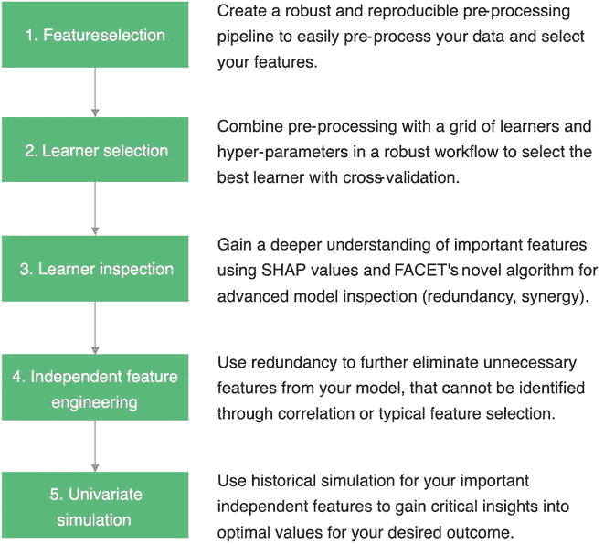
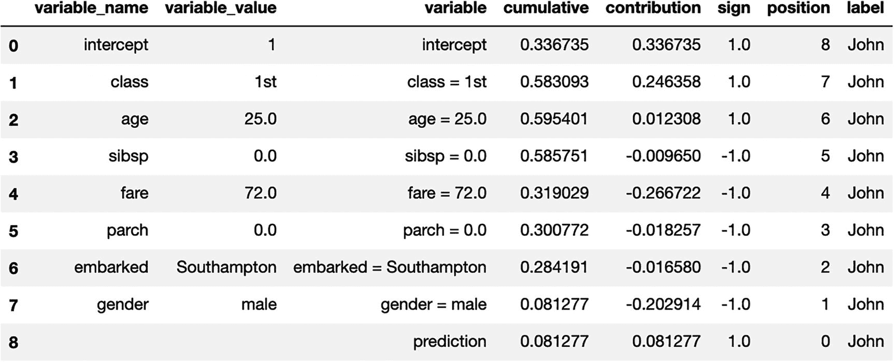

# 9.特征重要性方法:细节和使用示例

在深入研究各种方法及其细节之前，让我们看一个在所有代码中使用的样本数据集。下一节将讨论这个数据集的细节。

## 数据集名称

网上购物者意向

<colgroup><col class="tcol1 align-left"> <col class="tcol2 align-left"> <col class="tcol3 align-left"> <col class="tcol4 align-left"> <col class="tcol5 align-left"> <col class="tcol6 align-left"></colgroup> 
| 

数据集特征

 | 

多变量的

 | 

实例数量:

 | 

Twelve thousand three hundred and thirty

 | 

区域:

 | 

商业

 |
| --- | --- | --- | --- | --- | --- |
| 属性特征 | 整数，实数 | 属性数量: | Eighteen | 捐赠日期 | 2018-08-31 |
| 关联任务 | 分类、聚类 | 缺少值？ | 不适用的 | 网页点击数: | One hundred and forty-four thousand eight hundred and twenty-nine |

## 摘要

数据集由 12，330 个会话组成，其中 84.5%(即 10，422 个)是负类。这意味着这些观察/顾客并没有以购物结束。然而，1，908 个是积极类，这意味着这些观察/客户以购物结束。

## 来源

*   C.奥莰萨卡尔计算机工程系，工程和自然科学学院，巴赫切希尔大学，34349 土耳其伊斯坦布尔贝希克塔斯

*   土耳其伊斯坦堡 34335 号金尤美·卡斯特洛·因维恩信息技术咨询与贸易公司

## 数据集信息

数据集由属于 12，330 个会话的观察和特征组成。数据集的形成使得一年后每个会话将属于不同的用户，以避免任何倾向于特定的活动、特殊的日子、用户简档或时期。

## 属性信息

数据集由十个数字属性和八个分类属性组成。

响应变量是收入。以下是特点。

*   管理的

*   管理期限

*   报告的

*   信息持续时间

*   产品相关

*   产品相关持续时间

这些特征表示用户在该会话中访问的页面数量以及在每个页面类别上花费的总时间。这些特征的值从用户访问的页面的 URL 信息中导出，并在用户采取行动(例如，从一个页面移动到另一个页面)时实时更新。

*   跳出率

*   退出率

*   页面值

这些特征代表了 Google Analytics 为电子商务网站中的每个页面测量的指标。

网页的跳出率特性的值是指从该页面进入网站然后离开(跳出率)而没有在该会话期间触发对分析服务器的任何其他请求的访问者的百分比。

特定网页的退出率特性的值是针对一个页面的所有页面浏览量计算的，是会话中最后一次的百分比。

页面值特征表示用户在完成电子商务交易之前访问的网页的平均值。

特殊日特征指示站点访问时间与特定特殊日(例如，母亲节、情人节)的接近程度，在该特殊日，会话更可能以交易结束。该属性的值由电子商务动态决定，如订单日期和交货日期之间的持续时间。例如，对于情人节，该值取 2 月 2 日和 2 月 12 日之间的非零值。它的值在这个日期前后是零，除非它接近另一个特殊的日子。它的最大值 1 是在 2 月 8 日。

数据集还包括操作系统、浏览器、地区、流量类型、访问者类型(是回头客还是新访问者)、指示访问日期是否是周末的布尔值以及一年中的月份。

既然您现在已经了解了数据的属性，那么让我们对数据进行一些 EDA，以便更好地理解它的属性。

让我们首先导入所需的库。

```py
import pandas as pd
import numpy as np
import matplotlib.pyplot as plt
from sklearn.ensemble import RandomForestClassifier
from sklearn.model_selection import train_test_split
from sklearn.metrics import precision_score,recall_score,f1_score,accuracy_score
import seaborn as sns

```

现在让我们加载数据。我们使用 Jupyter 笔记本来编写 EDA 和方法部分。

```py
df=pd.read_csv(r'~/online_shoppers_intention.csv')
df.head()

```

接下来，检查数据中缺少的值。

```py
df.isnull().sum()

```

以下是输出。

```py
Administrative             0
Administrative_Duration    0
Informational              0
Informational_Duration     0
ProductRelated             0
ProductRelated_Duration    0
BounceRates                0
ExitRates                  0
PageValues                 0
SpecialDay                 0
Month                      0
OperatingSystems           0
Browser                    0
Region                     0
TrafficType                0
VisitorType                0
Weekend                    0
Revenue                    0

```

看起来数据集中没有丢失的值。

让我们检查响应变量的分布。

```py
df.Revenue.value_counts()

```

以下是输出。

```py
False    10422
True      1908
Name: Revenue, dtype: int64

```

EDA 报告使用 pandas profiling 模块。Pandas profiling 使得将所有细节整合到一个地方变得非常容易，而无需运行多行代码。

图 [9-1](#Fig1) 是熊猫概况数据的概述。没有丢失的值。数据中有些行是重复的。它们应该被移除。


图 9-1

熊猫概况概述

图 [9-2](#Fig2) 显示管理变量的平均值为 2.3，这意味着数据集中的客户平均访问管理类型的页面两次。(请参考本章开头的每个变量的定义，以便更好地理解输出。)


图 9-2

管理变量的详细信息

图 [9-3](#Fig3) 显示客户管理持续时间的平均值为 80 秒。


图 9-3

管理持续时间变量的详细信息

图 [9-4](#Fig4) 显示该变量的值中有大量的零。


图 9-4

信息变量的详细信息

图 [9-5](#Fig5) 显示了信息持续时间曲线。大部分值为零。


图 9-5

Informational _ Duration 变量的详细信息

图 [9-6](#Fig6) 显示了数据中给出的客户访问的产品相关页面的概况。它显示，客户平均访问了 38 个产品相关页面。


图 9-6

产品相关变量的详细信息

产品相关持续时间与产品相关页面变量相关。平均持续时间为 1195 秒，如图 [9-7](#Fig7) 所示。


图 9-7

ProductRelated_Duration 详细信息

图 [9-8](#Fig8) 显示了跳出率变量的汇总。在数据中给定的所有客户中，许多值为零。


图 9-8

反弹率的详细信息

图 [9-9](#Fig9) 概述了出口变量。不像其他变量，没有很多零，变量包含了很多信息。这应该是在模型中使用的一个好变量。


图 9-9

示例详细信息

图 [9-10](#Fig10) 显示了 PageValues 变量的概述。该变量的平均值为 5，这意味着给定客户平均访问了 5 个页面。它有很多零值。


图 9-10

页面值的详细信息

图 [9-11](#Fig11) 显示了特殊日变量的分布和概况。这个变量的大部分值也是零。


图 9-11

特殊日的详细信息

图 [9-12](#Fig12) 显示了月变量的分布和概况。这是一个分类变量，因此是该变量中每个类别的客户分布。


图 9-12

月份的详细信息

图 [9-13](#Fig13) 至 [9-18](#Fig18) 显示了剩余自变量的分布和概况。


图 9-18

周末详情


图 9-17

VisitorType 的详细信息


图 9-16

交通宣传的详细信息


图 9-15

区域的详细信息


图 9-14

浏览器的详细信息


图 9-13

操作系统的细节

图 [9-19](#Fig19) 显示了可变收入的概况和分布，可变收入是目标变量。


图 9-19

收入详细信息

图 [9-20](#Fig20) 显示了输入变量的相关矩阵。


图 9-20

数据集输入变量的相关矩阵

您可以在图表中看到以下内容。

*   管理与管理持续时间高度相关

*   信息与信息持续时间高度相关

*   ProductRelated 与 ProductRelated_Duration 高度相关

*   反弹率与出口高度相关

为了理解相关变量如何影响不同的可解释方法，这些变量被保存在模型中。

现在，让我们看看所有特性与响应变量之间的关系。


图 9-21

地区与收入分配

收入变量中基于地区的分布差异不大，如图 [9-22](#Fig22) 所示。


图 9-26

信息持续时间、管理持续时间、产品相关持续时间以及退出率与收入的关系


图 9-25

页面价值和跳出率与收入


图 9-24

周末与收入


图 9-23

流量类型与收入


图 9-22

游客类型与收入分配

从图 [9-26](#Fig26) 中的曲线，你可以看到 ExitRate 可能是一个在模型中使用的好变量。

接下来，我们将数据集分为训练数据集和测试数据集。

```py
x_train,x_test,y_train,y_test=train_test_split(x,y,test_size=0.1)

```

接下来，构建模型。

```py
model=RandomForestClassifier(n_estimators=150)
model.fit(x_train,y_train)

```

做一些参数调整。

```py
from sklearn.model_selection import GridSearchCV
grid_values = {'n_estimators': [200,300],'min_samples_leaf':[2,3],'criterion':['gini', 'entropy']}
grid_clf_acc = GridSearchCV(model, param_grid = grid_values,scoring = 'accuracy')
grid_clf_acc.fit(x_train, y_train)
y_pred_acc = grid_clf_acc.predict(x_test)

```

让我们生成性能指标。

```py
print(accuracy_score(y_test,y_pred_acc))
print(precision_score(y_test,y_pred_acc))
print(recall_score(y_test,y_pred_acc))
print(f1_score(y_test,y_pred_acc))

Accuracy is: 0.8972668288726683
Precision is: 0.7585380116959064
Recall is: 0.5894285714285714
F1 score is: 0.6631012658227848

```

数据集有一个体面的表现。准确性稍高，因为这是一个不平衡的分类。

一旦模型构建练习完成，我们就可以开始在这个模型上构建可解释性方法来生成特性重要性分数。

## 随机森林特征重要性

以下是随机森林方法的特征。

*   因此

*   全球的

*   特定型号

*   基于可视化

有两种方法可以计算随机森林要素的重要性:一种是基于排除变量后精度降低的程度。另一个是基于当一个变量分割一个节点时基尼系数的减少。

### 基于准确性的重要性

基于精度的重要性方法使用观察值来获得变量的重要性度量。在随机森林模型中构建的每棵树都有其数据样本。预测精度被测量。然后，样本中变量的值被随机打乱，同时保持所有其他变量不变。然后测量混洗数据的预测精度的降低。测量所有树木的减少量，并取平均值。重要性被分解到模型的每个类别中。这种测量变量重要性的方法决定了移除一个变量和相反的变量会降低多少精度。当变量对预测能力的贡献很小时，由于洗牌而导致的准确度变化较小。

### 基于基尼系数的重要性

树在每个节点分割一个变量的决定有时是基于基尼不纯度做出的。对于随机森林模型中每棵树上的每个变量，每当树选择基于该变量分割节点时，计算基尼减少的总和。然后我们取所有树的平均值。比例与得出的变量无关；只有顺序才重要。这种方法的优点是基尼系数的计算已经在模型训练阶段完成，因此计算相关分数只需要很少的计算。

该代码遵循模型构建练习。我们使用相同的模型函数。

```py
importance = model.feature_importances_
for i,v in enumerate(importance):
       print('Feature: %0d, Score: %.5f' % (i,v))

Feature: 0, Score: 0.04181
Feature: 1, Score: 0.05627
Feature: 2, Score: 0.01603
Feature: 3, Score: 0.02709
Feature: 4, Score: 0.07756
Feature: 5, Score: 0.08788
Feature: 6, Score: 0.05604
Feature: 7, Score: 0.09298
Feature: 8, Score: 0.37748
Feature: 9, Score: 0.00359
Feature: 10, Score: 0.04402
Feature: 11, Score: 0.01768
Feature: 12, Score: 0.01873
Feature: 13, Score: 0.02982
Feature: 14, Score: 0.03250
Feature: 15, Score: 0.01127
Feature: 16, Score: 0.00926

```

让我们绘制结果，因为默认结果不显示特征名称。


图 9-27

随机森林要素重要性可视化展示了最重要的要素

```py
# plot feature importance
plt.figure(figsize=(16,8))
plt.bar(df.iloc[:,:-1].columns, [i*100 for i in importance],color='green')
plt.title('Column wise Feature Importance score in %')
plt.xlabel('Feature Name')
plt.ylabel('Importance score in %')
plt.xticks(rotation=90)
plt.grid()
plt.show()

```

内置的基本随机森林要素重要性方法显示 PageValues 是模型全局级别上最重要的变量。这意味着 PageValues 本身包含了描述模型在总体级别上所做决策的最大信息量。

技术模型构建者的工作到此结束，模型评审者的工作开始。模型评审者将这些结果传达给涉众，并说他们可能应该查看 PageValues 变量，以了解模型的两个类之间的差异。

## 置换特征重要性

以下是排列特征重要性模型的特征。

*   因此

*   全球的

*   模型不可知

*   基于重要性

置换特征重要性方法测量当特定特征的值被置换从而打破特征和响应变量之间的关系时模型误差的增加。

置换特征重要性背后的概念可以简单地描述如下。

如果更改该特征的值会增加模型误差，则输入对模型很重要。如果由于模型在预测中忽略了某个要素，而对其值进行调整后模型误差保持不变，则该要素“不重要”。

Breiman 在 2001 年为随机森林引入了排列特征重要性度量。

置换特征重要性的输入是训练模型 t、特征矩阵 X 和目标向量 y，以及误差度量 e

原模型误差可以写成 E(y，t(x))。

估计原始模型误差= E(y，t(X))(例如，均方误差)

那么对于每个特征 s = 1…p，我们运行一个循环来做下面的事情。

*   通过置换数据 X 中的特征 s，生成特征矩阵 X <sup>改变了</sup>。这消除了 s 和结果 y 之间的任何关系。

*   基于置换数据的预测，置换数据的估计误差= E(Y，t(X <sup>改变</sup>))。

*   计算排列特征重要性。

FI <sup>s</sup> = *置换数据错误* ***/*** *原始数据错误*。

或者，可以使用差值:FI <sup>s</sup> = *置换数据上的误差* - *原始数据上的误差。*

按 FI 降序排列特征。

我们也可以将数据分成两半，并交换这两半的特征值。这将阻止您置换特征。

如果您想要一个不同于前两个的方法，您可以通过将每个实例与每个其他实例的特征 *s* 的值配对，而不是与自身配对，来估计置换特征 *s* 的误差。这将产生一个大小为 n(n–1)的数据集来估计排列误差。然而，这需要大量的计算时间。

现在，排列特征重要性应该在测试数据上运行，而不是在训练数据上运行。如果我们用训练模型的相同数据来衡量模型的误差，那么模型似乎比实际情况更好。由于排列依赖于模型的误差，所以应该总是在看不见的数据上进行。由于过度拟合而从训练数据中得出的重要性给出了误导性的特征重要性。

### 优势

*   易于理解的解释:排列重要性的结果易于理解和呈现

*   不同问题的特征重要性度量是可比较的

*   考虑与其他功能的所有交互

*   置换特征重要性不需要重新训练模型

### 不足之处

*   需要获得真实的结果。如果某人仅向您提供模型和未标记的数据，而不是真实的结果，则您无法计算置换特征的重要性。

*   当重复排列时，结果可能会有很大的不同。

*   如果特征是相关的，置换特征的重要性可能会被不切实际的数据实例所偏离。

*   添加相关特征可以通过分割两个特征之间的重要性来降低关联特征的重要性。

### 密码

您阅读了上一节中的数据。使用相同的数据集来开发该方法的代码。

让我们首先将分类变量转换成虚拟值。

```py
data1 = pd.get_dummies(df, drop_first=True)
data1.columns

```

现在我们将字符串响应变量改为数字。

```py
from sklearn.preprocessing import LabelEncoder
le = LabelEncoder()
df['Revenue'] = le.fit_transform(df['Revenue'])
df['Revenue'].value_counts()

```

从 x 中删除目标收入。

```py
x = data1
x = x.drop(['Revenue'], axis = 1)
y = df['Revenue']

```

现在让我们将数据分为训练和测试，并建立一个模型。

```py
train_X, val_X, train_y, val_y = train_test_split(x, y, random_state=1)
my_model = RandomForestClassifier(n_estimators=100,
                                  random_state=0).fit(train_X, train_y)

```

是时候计算排列特征的重要性了。

```py
import eli5
from eli5.sklearn import PermutationImportance

perm = PermutationImportance(my_model, random_state=1).fit(val_X, val_y)
eli5.show_weights(perm, feature_names = val_X.columns.tolist())

```

输出显示在图 [9-28](#Fig28) 中。此表给出了与每个特性相关的权重(与逻辑回归给出的现成权重相同)。该值表示某个要素对预测的平均影响程度，符号表示哪个方向。


图 9-28

最重要变量的排列特征重要性输出

和前面的例子一样，PageValues 确实是这个模型中最重要的变量。

让我们深入一些技术，看看这些结果。

## 世鹏科技电子

以下是 SHAP 的特点。

*   因此

*   全球和本地

*   模型不可知

*   基于可视化

SHAP 是基于匀称的价值观，这是在博弈论中计算出来的。但是博弈论与机器学习领域没有直接关系。博弈论的组件可以与模型组件相关联，如下所示。

*   “游戏”再现了模型的结果。

*   “玩家”是模型中包含的特征。

SHAP 量化每个特征对模型或预测的重要性，就像 Shapely 量化每个玩家对游戏的贡献一样。建模场景游戏可以是模型的单个观察。因此，SHAP 是默认的本地解释方法，但它也可以用于全球可解释性。

我们举一个机器学习模型的例子，它是一个线性回归模型。它使用年龄、性别和工作等特征来预测一个人的收入。

在 Shapely 值中，应该考虑特征的每个可能结果，以确定单个特征的重要性。因此，它意味着 *f* 特征的每种可能组合( *f* 从 0 到 *F* ，*F*-所有可用特征的数量)。


图 9-29

每个节点代表一组特征。每条边都表示包含了先前联盟中不存在的特征

在这种情况下，可能结果的总数因此是 2 ^ *F* = 2 ^ 3 = 8，因为有三个特征。


图 9-30

不同模型对 x <sub>0</sub> 的预测。在每个节点中，第一行报告模型中包含的特性联盟，第二行报告该模型对 x <sub>0</sub> 的预测收入

SHAP 现在用所有这些组合来训练模型。模型是相似的。唯一的区别在于模型的特性集。

现在让我们以一个新的观测值 *x* <sub>*0*</sub> 来看看八个不同的模型对同一观测值 *x* <sub>*0*</sub> 的预测。

图 [9-30](#Fig30) 显示每一级都比前一级多一个特征。特征之间的差异可以归因于附加特征的边际贡献。在节点 1 中，它是一个没有特征的模型，该模型简单地预测所有训练观察的平均收入(50K 美元)。在具有一个特征(年龄)的模型节点 2 中，x <sub>0</sub> 的预测是$40K。这可以解释为，当你知道年龄时，它将预测值降低了$10K。

因此，年龄对仅包含年龄作为特征的模型的边际贡献是$10K。

为了计算年龄对最终模型的整体影响，我们需要考虑年龄在所有模型中的边际贡献。图 [9-31](#Fig31) 用红色突出显示这些边缘。


图 9-31

用于年龄边际贡献计算的模型的红色突出显示边缘

下面是计算加权边际贡献的公式。


这个公式的下一个问题是确定权重。

想法是对 1-特征模型的所有边际贡献的权重的总和应该等于对 2-特征模型的所有边际贡献的总和，等等。

换句话说，同一行上所有权重的总和应该等于任何其他行上所有权重的总和。

在示例中，这意味着*w*<sub>*1*</sub>*= w*<sub>*2*</sub>*+w*<sub>*3*</sub>*= w*<sub>*4*</sub>*。*

*对于每个 f，* *f 特征模型* *的所有边际贡献的权重应该彼此相等*

换句话说，同一“行”上的所有边应该彼此相等。在示例中，这意味着*w*<sub>*2*</sub>*= w*<sub>*3*</sub>。

因此，如果它们的总和都是 1，则权重的值应该如下所示。

*w*<sub>T3】1T5】= 1/3</sub>

*w*<sub>T3】2T5】= 1/6</sub>

*w*<sub>T3】3T5】= 1/6</sub>

*w*<sub>T3】4T5】= 1/3</sub>

计算这些值的公式解释如下。每个 *f* 特征模型都有 *f* 边际贡献(每个特征一个)，因此计算可能的 *f* 特征模型的数量并乘以 *f* 就足够了。因此，这个问题可以通过计算可能的 *f* 特征模型的数量来简化，给定 *f* 并且知道特征的总数是 *F* 。这就是二项式系数的定义。

你可以说一行中的边数可以按如下方式计算。


取其倒数并对一个 *f* 特征模型的边际贡献进行加权就足够了。

图 [9-32](#Fig32) 对此进行了说明。


图 9-32

计算 SHAP 边际价值所需权重的计算

现在代入公式中的权重值。


当一般化以适应任何模型和 n 个特征时，相同的公式如下。


应用于该示例，该公式得出以下结果。

SHAP _ 时代(*x*<sub>*0*</sub>)=-11.33k 美元

SHAP _ 性别(*x*<sub>T3】0</sub>)=-2.33k 美元

SHAP _ 约伯(*x*<sub>*0*</sub>)=+46.66k 美元

将它们相加得到+$33K，这正好是完整模型的输出($83K)和没有特征的虚拟模型的输出($50K)之间的差。

这是 SHAP 值的一个基本特征:**对给定观测值的每个特征的 SHAP 值求和产生了模型预测和零模型预测之间的差异**。因此，它们被称为“匀称的加法解释”。

让我们用数学术语来谈论 SHAP 计算的整个过程，正如 SHAP、伦德伯格和李的作者在题为“解释模型预测的统一方法”的论文中所描述的那样

本文讨论了附加特征的归属方法。

附加特征归因方法具有解释模型，该模型是二元变量的线性函数。


z′∈{ 0，1}M，m 是简化输入特征的数量和 *ϕ* i ∈ R

接下来，让我们讨论添加解释的属性，作者在论文中提到了这些属性。

### 属性 1(局部精度)


解说车型*g*(*x*′)匹配原车型 *f* ( *x* )当*x*=*hx*(*x′*)时。

### 属性 2(缺失)


缺失约束特征，其中*x′*<sub>*I*</sub>= 0 没有属性化影响。如果简化输入表示要素存在，则缺失要求原始输入中缺失的要素没有影响。

### 属性 3(一致性)

设*FX*(*z′*)=*f*(*hx*(*z′*)*z′*\*I*表示设置*z′*<sub>I</sub>= 0。对于任意两个型号 *f* 和*f′*，如果


接下来，作者提到了一个模式，它遵循加法解释的定义并满足所有性质。


|*z′*|是*z′*中非零条目的数量，*z′*⊆*x′*表示所有*z′*向量，其中非零条目是*x′*中非零条目的子集。

SHAP 或 Shapely 附加解释值是前面方程的解。SHAP 值提供了唯一的附加要素重要性测量值，它符合所有三个属性，并使用条件期望来定义简化的输入。

五步过程中的核 SHAP 估计每个特征值对预测的贡献。

1.  将样本联盟定义为 z′K∈{ 0，1}M，k∈{1，…，K} (1 =联盟中存在特征，0 =不存在特征)。

2.  通过首先将 z’k 转换到原始特征空间，然后应用模型 f:f(hx(z’k))，获得每个 z’k 的预测。

3.  SHAP 核计算每个 z’k 的权重

4.  拟合加权线性模型。

5.  返回沙普利值， *ϕ* k，它们是线性模型的系数。

当我们从 SHAP 核中的边缘分布进行采样时，我们忽略了存在和不存在特征之间的依赖结构。

与所有基于排列的解释方法一样，KernelSHAP 方法也存在同样的问题，即估计对不太可能的实例给予了太多的权重。这可能导致不可靠的结果。但有必要从边际分布中抽样。解决方案是从条件分布中取样，这改变了价值函数，因此沙普利值就是这个博弈的解。因此，沙普利值有不同的解释；例如，当使用条件采样时，模型可能根本没有使用的要素可能具有非零 Shapley 值。对于边际游戏，这个特征值将总是得到 Shapley 值 0，因为否则，它将违反概念。

与 LIME 的最大区别是回归模型中实例的权重。LIME 根据实例与原始实例的接近程度对实例进行加权。联合向量中的 0 越多，LIME 中的权重就越小。SHAP 根据联合将在 Shapley 值估计中获得的权重对采样实例进行加权。小联盟(几个 1)和大联盟(即许多 1)得到最大的权重。其背后的直觉是，如果你孤立地研究它们的影响，你会对单个特征了解最多。如果联盟由单个要素组成，您可以了解这些要素对预测的独立主要影响。如果一个联盟由除了一个特征之外的所有特征组成，您可以了解这个特征的总效果(主效果加上特征交互)。如果一个联盟由一半的特征组成，你对单个特征的贡献了解很少，因为有一半的特征有许多可能的联盟。为了实现符合 Shapley 标准的称重，Lundberg 等人。al 提出了如下的 SHAP 核。


这里， *M* 是最大联合规模，而|*z*′|,是实例*z*′中当前特征的数量。Lundberg 和 Lee 表明，用这种核权重进行线性回归会产生 Shapley 值。如果您将 SHAP 核与 LIME 一起用于联盟数据，LIME 还会估计 Shapley 值！

TreeSHAP 是 SHAP 的一种变体，用于基于树的机器学习模型，如决策树、随机森林和梯度增强树。TreeSHAP 是作为 KernelSHAP 的一种快速的、特定于模型的替代方法而引入的，但事实证明它会产生不直观的特征属性。

TreeSHAP 使用条件期望 EXS|XC(f(x)|xS)而不是边际期望来定义值函数。条件期望的问题在于，不影响预测函数 f 的特征可以得到不同于零的树形估计。当要素与影响预测的另一个要素相关时，可能会出现非零估计值。

TreeSHAP 使用条件期望 EXS|XC(f(x)|xS)来估计影响。它直观地给出了如何计算单个树、实例 x 和特征子集 S 的预期预测。如果我们对所有特征进行条件化，并且 S 是所有特征的集合，则来自实例 x 所在节点的预测将是预期预测。如果我们对任何特征不加任何条件，并且 S 是空的，我们将使用所有终端节点预测的加权平均值。如果 S 包含一些但不是全部特征，我们忽略不可达节点的预测。不可达意味着通向该节点的决策路径与 xS 中的值相矛盾。从剩余的终端节点，我们通过节点大小(即，该节点中训练样本的数量)对加权的预测进行平均。剩余终端节点的平均值(由每个节点的实例数加权)是给定 S 的 x 的预期预测值。问题是我们必须对特征值的每个可能子集 S 应用此过程。TreeSHAP 以多项式时间而不是指数时间进行计算。基本思想是同时将所有可能的子集 S 推下树。对于每个决策节点，我们必须跟踪子集的数量。这取决于父节点和分割特征中的子集。

让我们使用在前面的例子中从 CSV 中读取的相同 df。

将分类变量转换成虚拟变量。


图 9-33。

```py
data1 = pd.get_dummies(data, drop_first=True)

data1.columns

```

让我们给收入列贴上标签。


图 9-34

类别标签输出

```py
from sklearn.preprocessing import LabelEncoder

le = LabelEncoder()
data['Revenue'] = le.fit_transform(data['Revenue'])
data['Revenue'].value_counts()

```

让我们把因变量和自变量分开。

```py
x = data1
# removing the target column revenue from x
x = x.drop(['Revenue'], axis = 1)

y = data['Revenue']

# checking the shapes
print("Shape of x:", x.shape)
print("Shape of y:", y.shape)

```

接下来，我们拆分数据。


图 9-35

数据帧形状的代码输出

```py
# splitting the data

from sklearn.model_selection import train_test_split

x_train, x_test, y_train, y_test = train_test_split(x, y, test_size = 0.3, random_state = 0)

# checking the shapes

print("Shape of x_train :", x_train.shape)
print("Shape of y_train :", y_train.shape)
print("Shape of x_test :", x_test.shape)
print("Shape of y_test :", y_test.shape)

```

我们现在建立模型。


图 9-36

准确度代码输出

```py
from sklearn.ensemble import RandomForestClassifier
from sklearn.metrics import confusion_matrix
from sklearn.metrics import classification_report

model = RandomForestClassifier()
model.fit(x_train, y_train)

y_pred = model.predict(x_test)

# evaluating the model
print("Training Accuracy :", model.score(x_train, y_train))
print("Testing Accuracy :", model.score(x_test, y_test))

# confusion matrix
cm = confusion_matrix(y_test, y_pred)
plt.rcParams['figure.figsize'] = (6, 6)
sns.heatmap(cm ,annot = True)

# classification report
cr = classification_report(y_test, y_pred)
print(cr)

```

现在让我们看看这个数据集的 SHAP 值。


图 9-37

SHAP 特征重要性图背后的想法。具有大的绝对 Shapley 值的特征是重要的

```py
#importing shap
import shap

explainer = shap.TreeExplainer(model)
shap_values = explainer.shap_values(x_test)

shap.summary_plot(shap_values[1], x_test, plot_type = 'bar')

```

和前面的例子一样，PageValues 变量是最重要的。现在让我们来看一下蝴蝶图，以便更深入地理解它的行为。


图 9-38

SHAP 汇总图

```py
shap.summary_plot(shap_values[1], x_test)

```

摘要图结合了特征重要性和特征效果。摘要图上的每个点都是一个特征和一个实例的 Shapley 值。y 轴上的位置由特征决定，x 轴上的位置由 Shapley 值决定。颜色代表从低到高的特性值。重叠点在 y 轴方向抖动，因此您可以了解每个要素的 Shapley 值的分布情况。

这些功能根据其重要性进行排序。图 [9-38](#Fig38) 显示较高的 PageValues 值具有较高的 SHAP 值，这意味着较高的 PageValues 值对应于模型中正类的预测。

现在让我们看看不同的力图。力图允许您查看特征如何对特定观察的模型预测做出贡献。这非常适合向某人解释你的模型是如何得出它对特定观察的预测的。


图 9-39

SHAP 力图

```py
customers = x_test.iloc[1,:].astype(float)
customer_analysis(model, customers)

```

这一观察的平均预测值为 0.17。PageValue = 0 的贡献降低了预测。


图 9-40

SHAP 力图

```py
customers = x_test.iloc[15,:].astype(float)
customer_analysis(model, customers)

```

这里的平均预测值是 0.07，这也主要是由 PageValue = 0 的影响决定的。


图 9-41

SHAP 力图

```py
shap_values = explainer.shap_values(x_train.iloc[:50])
shap.initjs()
shap.force_plot(explainer.expected_value[1], shap_values[1], x_test.iloc[:50])

```

该图显示了按解释相似性聚类的堆叠 SHAP 解释。x 轴上的每个位置都是数据的一个实例。红色 SHAP 值增加了预测。蓝色值会减少它。一个聚类脱颖而出:右边是一个预测在线购物概率很高的组。

## 明智的

以下是 SAGE 模型的特征。

*   因此

*   全球的

*   模型不可知

*   基于重要性

SAGE (Shapley 加法全局重要性)是一种全局方法，对于了解哪些特征对模型性能和行为很重要非常有用。SAGE 类似于我们在本章前面研究的全局特征重要性方法；但是，由于它使用 Shapely 值，因此在统计上更稳定。在学习 SHAP 的过程中，你已经认识到了身材匀称的重要性。

本节展示 SAGE 如何应用 Shapley 值来提供一种不同的模型。你知道模型函数 f 对每个特征 *X* 1、 *X* 2、…、*X*T6】d 的依赖程度。


图 9-42

SAGE 流程图

为了了解技术专家从哪些特性中获得了最多的信息，您可以进行一个实验，让我们剥夺他们的信息，看看他们的预测准确性受到了多大的影响。例如，你可以抽取大量的客户样本，让技术专家预测他们的还款概率，除了客户的年龄。他们的准确性可能会下降一点点。或者，你可以请专家预测除年龄、账户余额和工作之外的所有情况下的还款概率。现在他们的准确性应该会下降很多，因为他们被剥夺了关键信息。

为了将相同的逻辑应用于 ML 模型 f，我们必须再次面对 f 需要一组固定特征的问题。我们可以使用相同的技巧，使用它们的条件分布*s*∣*x*T4】s=*x*t8】s 来处理缺失的特征。我们现在可以定义一个合作博弈，代表给定特征子集的模型性能。给定损失函数ℓ(例如，MSE 或交叉熵损失)，游戏*v*f 定义如下。

v f (S) = −E[ℓ(E[f(X)∣ X S ]，Y)]

对于任何子集 *S* ⊆ *D* ，数量*v*T6】f(*s*)表示给定特征*x*s 的 *f* 的性能。损失前面有一个减号，因此较低的损失(提高的精度)会增加值*v*f(*S*)。

现在，我们可以使用 Shapley 值*ϕ*T2】I(*v*T6】f)来量化每个特性对模型性能的贡献。对于模型做出好的预测来说最关键的特征具有大的值*ϕ**I*(*v**f*)>0，而不重要的特征具有小的值*ϕ**I*(*v**f*)≈0，并且只有使模型的性能变差的特征具有负值*ϕ*这些是圣人的价值观，简而言之就是圣人。**

SAGE 提供了对数据分布的内在属性的洞察(这可能被称为解释数据，而不是解释模型)。SAGE 统一了几种现有的特征重要性方法。

SAGE 主要是用于模型解释的工具，但它也可以提供对数据中内在关系的洞察。例如，当 SAGE 应用贝叶斯分类器*f*(*x*)=*p*(*y*∣*x*)和交叉熵损失时，SAGE 值等于互信息函数*v**f*(*s*)=*I*(*y*；*X*T22】S)。对于使用 ML 来了解世界(例如，哪些基因与乳腺癌相关)以及对模型本身不感兴趣的用户来说，这是一个好消息。*相加重要性测量的框架*将许多以前被认为不相关的方法联系起来。例如，SAGE 不同于置换测试，置换测试是框架中的一种方法。Breiman 提出的置换测试计算当数据集的每一列被置换时模型性能下降多少。SAGE 可以被视为排列测试的修改版本。

SAGE 不是一次提供一个特性，而是提供更大的特性子集。(通过仅移除个别特征，置换测试可能错误地将低重要性分配给具有良好代理的特征。)

SAGE 从它们的条件分布 p(X X X S ∣X S =而不是它们的边际分布 p(X S)中提取特征。(使用条件分布模拟了一个特性的缺失，而使用边际分布则破坏了特性的依赖性，产生了不太可能的特性组合。).简而言之，这就是 SAGE，希望这能帮助你理解它在博弈论中的基础，以及它对理解模型行为的重要性。

SAGE 的代码实现比较复杂。我们一步一步来看。

定义模型的特征列表。

```py
# Feature names and categorical columns (for CatBoost model)
feature_names = df.columns.tolist()[:-1]
categorical_columns = [
    'Month','OperatingSystems','Browser','Region','TrafficType','VisitorType','Weekend'
]
categorical_inds = [feature_names.index(col) for col in categorical_columns]

```

将数据分成训练和测试。

```py
train, test = train_test_split(
    df.values, test_size=int(0.1 * len(df.values)), random_state=0)
train, val = train_test_split(
    train, test_size=int(0.1 * len(df.values)), random_state=0)
Y_train = train[:, -1].copy().astype(int)
Y_val = val[:, -1].copy().astype(int)
Y_test = test[:, -1].copy().astype(int)
train = train[:, :-1].copy()
val = val[:, :-1].copy()
test = test[:, :-1].copy()

```

构建模型函数，并根据输入数据训练模型。

```py
import numpy as np
from sklearn.metrics import log_loss
from catboost import CatBoostClassifier

model = CatBoostClassifier(iterations=50,
                           learning_rate=0.3,
                           depth=3)

model = model.fit(train, Y_train, categorical_inds, eval_set=(val, Y_val),
                  verbose=False)

```

计算模型的性能。

```py
p = np.array([np.sum(Y_train == i) for i in np.unique(Y_train)]) / len(Y_train)
base_ce = log_loss(Y_test.astype(int), p[np.newaxis].repeat(len(test), 0))
ce = log_loss(Y_test.astype(int), model.predict_proba(test))

print('Base rate cross entropy = {:.3f}'.format(base_ce))
print('Model cross entropy = {:.3f}'.format(ce))

import sage

```

设置并计算 SAGE 值。

```py
imputer = sage.MarginalImputer(model, train[:512])
estimator = sage.PermutationEstimator(imputer, 'cross entropy')
sage_values = estimator(test, Y_test)

```

打印贤者情节。


图 9-43

SHAP 绘图输出

```py
sage_values.plot(feature_names, title='Feature Importance (Marginal Sampling)')

```

在这个数据集中，PageValues 是最重要的特征。这些结果与早期方法的输出一致。但是，SAGE 值要可靠得多，比正常的随机森林要素重要性更可信。

### SHAP 和塞奇是什么关系

SHAP 和塞奇使用沙普利值，但由于他们回答了关于模型的根本不同的问题(局部与全局可解释性)，目前还不清楚他们的联系是否会更深。

原来圣人值*ϕ*T2】I(*v*T6】f)和 SHAP 值*ϕ**I*(*v**f*， *x* )之间并没有简单的关系。然而，圣人价值观与一种被称为 LossSHAP 的 SHAP 变体有关。我们可以使用博弈 *v* *f* 、*x*、 *y* 来代替使用合作博弈 *v* 、T20】 f 、 *x* 来解释个体预测，该博弈表示给定特征子集*x*的个体输入输出对( *x* 、 *y* )的损失

```py
v​f, x, y​​(S)=−ℓ(E[f(X)∣X​S​​=x​S​​], y)

```

这个游戏的 Shapley 值*ϕ*T2】I(*v*T6】f， *x* ， *y* )称为 *LossSHAP 值*，它们代表每个特征对预测准确度的贡献大小。使预测更准确的特征有大值*ϕ*t16】I(*v*t20】f、 *x* 、 *y* ) > 0，使预测不太准确的特征有负值*ϕ**I*(*v**f*、*x*

 *SAGE 值等于 LossSHAP 值的期望值。数学上是这样的。

*【I】*(*v*【F6】【f】= e*【xy】*

 *这种联系很重要，因为它表明可以通过许多局部解释获得全局解释:SAGE 值可以通过计算整个数据集的 LossSHAP 值然后取平均值来计算。


图 9-44

SAGE 值等于平均损失值

然而，等待数据集中数百或数千个示例的 LossSHAP 值收敛需要很长时间。SAGE 方法提出了一种更快的近似算法，直接针对全局解释——这种方法被称为 *SAGE 采样*。使用 SAGE 采样，SAGE 值可以在与少数单个 LossSHAP 值相同的时间内计算出来。

## 石灰

LIME 是模型不可知的，这意味着它可以应用于任何机器学习模型。该技术试图通过干扰数据样本的输入和理解预测如何变化来理解模型。

特定于模型的方法旨在通过分析内部组件和交互来理解黑盒机器学习模型。在深度学习模型中，有可能调查激活单元并将内部激活链接回输入。这需要对网络有透彻的了解，并且不能扩展到其他模型。

LIME 提供了本地模型的可解释性。LIME 通过调整特征值并观察输出结果的影响来修改单个数据样本。通常，这也与人类在观察模型输出时感兴趣的内容有关。最常见的问题可能是:为什么会做出这种预测，或者是哪些变量导致了这种预测？

其他模型可解释性技术只是从整个数据集的角度来回答这个问题。特征重要性在数据集层面上解释了哪些特征是重要的。它允许您验证假设以及模型是否过度适应噪声，但是很难诊断特定的模型预测。


图 9-45

样本模型解释

LIME 的一个关键要求是使用人类可以理解的可解释的输入表示。可解释表示的例子是 NLP 的弓形向量或计算机视觉的图像。另一方面，密集嵌入是不可解释的，应用石灰可能不会提高可解释性。

图 [9-46](#Fig46) 中 LIME 的输出是一个解释列表，反映了每个特征对一个数据样本预测的贡献。这提供了局部可解释性，还允许确定哪些要素变化对预测影响最大。


图 9-46

样品石灰产量

一个解释是通过用一个可解释的模型局部地逼近底层模型而产生的。可解释的模型是具有强正则化的线性模型、决策树等等。可解释的模型在原始实例的小扰动上被训练，并且应该仅提供良好的局部近似。数据集是通过向连续特征添加噪声、移除单词或隐藏图像的部分来创建的。通过仅局部地近似黑盒*(在数据样本的邻域中)，任务被显著简化。*

 *LIME 的总体目标是在本地忠实于分类器的可解释表示上识别可解释模型。

在我们介绍解释系统之前，区分特征和可解释的数据表示是很重要的。如前所述，可解释的解释需要使用人类可以理解的表示，而不考虑模型使用的实际特征。例如，文本分类的可能的可解释表示是指示单词存在或不存在的二进制向量，即使分类器可能使用更复杂(和不可理解)的特征，例如单词嵌入。同样地，对于图像分类，可解释的表示可以是指示相似像素(超像素)的邻接片的“存在”或“不存在”的二进制向量。同时，分类器可以将图像表示为每个像素具有三个颜色通道的张量。x ∈ Rd 表示被解释的实例的原始表示，x 0 ∈ {0，1 } d’表示其可解释表示的二进制向量。图 [9-47](#Fig47) 是该过程的示意图。

原始模型的决策函数由蓝色/粉色背景表示，并且是非线性的。亮红色的十字就是正在解释的实例(姑且称之为 X)。我们对 X 周围的扰动实例进行采样，并根据它们与 X 的接近程度对它们进行加权(这里的权重由大小表示)。我们得到原始模型对这些扰动情况的预测。然后，我们学习一个线性模型(虚线),该模型在 x 附近很好地近似了该模型。注意，该解释在全局上是不可靠的，但是在 x 周围的局部上是可靠的。


图 9-47

黑盒模型的复杂决策函数 LIME 未知)由蓝色/粉红色背景表示，这不能由线性模型很好地近似。加粗的红叉是正在解释的例子。LIME sample 实例使用 f 获得预测，并通过与正在解释的实例的接近程度(这里用大小表示)对它们进行加权。虚线是局部(而非全局)可信的学习解释

文本的时间不同于表格数据的时间。数据的变体以不同的方式生成:从原始文本开始，通过从原始文本中随机删除单词来创建新文本。数据集用每个单词的二进制特征来表示。如果包含相应的单词，则特征为 1，如果已经移除，则特征为 0。图像的 LIME 与表格数据和文本的 LIME 工作方式不同。直觉上，干扰单个像素没有多大意义，因为一个以上的像素对一个类有贡献。随机改变单个像素可能不会改变预测太多。因此，通过将图像分割成可以关闭或打开的超像素来创建图像的变体。超像素是具有相似颜色的互连像素，可以通过用用户定义的颜色(如灰色)替换每个像素来关闭。用户还可以指定在每个排列中关闭超像素的概率。

即使你替换了底层的机器学习模型，你仍然可以使用相同的本地的、可解释的模型进行解释。假设看解释的人最了解决策树。因为您使用本地代理模型，所以您使用决策树作为解释，而不使用决策树来进行预测。例如，你可以使用 SVM。如果事实证明 XGBoost 模型更好，你可以替换 SVM，仍然使用决策树来解释预测。

本地代理模型受益于训练和解释可解释模型的文献和经验。当使用套索或矮树时，得到的解释是简短的(=选择性的)并且可能是对比性的。因此，他们做出人性化的解释。因此，LIME 更多地出现在解释的接受者是外行人或时间很少的人的应用中。这对于完全归因来说是不够的，因此我们在法规遵从性场景中看不到时间，在这些场景中，您可能会被法律要求完全解释一个预测。此外，拥有调试机器学习模型的所有原因而不是几个原因是有用的。

LIME 是少数几种适用于表格数据、文本和图像的方法之一。

保真度给出了可解释模型在解释关于感兴趣的数据实例的黑盒预测时的可靠程度的好主意。

用本地代理模型创建的解释可以使用除原始模型被训练之外的其他(可解释的)特征。当然，这些可解释的特性必须来自数据实例。文本分类器可以依赖抽象单词嵌入作为特征，但是解释可以基于单词在句子中的存在或不存在。回归模型可以依赖于一些属性的不可解释的转换，但是可以用原始属性创建解释。例如，回归模型可以根据调查答案的主成分分析(PCA)的成分来训练。LIME 可能会在最初的调查问题上接受培训。与其他方法相比，对 LIME 使用可解释的要素是一大优势，尤其是在使用不可解释的要素训练模型时。

对表格数据使用 LIME 时，邻域的正确定义是一个非常大的未解决的问题。在我看来，这是石灰的最大问题，也是我建议小心使用石灰的原因。对于每个应用程序，您必须尝试不同的内核设置，并自己看看这些解释是否有意义。不幸的是，这是我能给出的找到好的内核宽度的最好建议。

在石灰的当前实施中，取样可以改进。数据点是从高斯分布中采样的，忽略了特征之间的相关性。这可能导致不太可能的数据点，这些数据点然后可以用于学习局部解释模型。

解释模型的复杂性必须预先定义。这是一个小小的抱怨，因为最终，用户总是必须定义保真度和稀疏度之间的折衷。

另一个大问题是解释的不稳定性。在一篇文章中，作者表明，在模拟环境中，对两个非常接近的点的解释差异很大。还有，以我的经验，如果重复采样过程，那么得出的解释可能会不一样。不稳定意味着很难相信那些解释，你应该非常挑剔。数据科学家可以操纵石灰解释来隐藏偏见。操纵的可能性使得人们更难相信用石灰做出的解释。

让我们从导入所需的库开始。

```py
import pandas as pd
import numpy as np
import pandas as pd
import os
from sklearn.model_selection import train_test_split
from sklearn.ensemble import RandomForestClassifier
from sklearn import metrics

```

读取数据并对分类变量进行预处理。

```py
data = pd.read_csv('online_shoppers_intention.csv')
train,test=train_test_split(data,test_size=0.3,random_state=0,stratify=data['Revenue'])
# Convert categorical variables into dummy/indicator variables
train_processed = pd.get_dummies(train)
test_processed = pd.get_dummies(test)

```

填写任何空值。

```py
train_processed = train_processed.fillna(train_processed.mean())
test_processed = test_processed.fillna(test_processed.mean())

```

创建培训和测试数据。

```py
X_train = train_processed.drop(['Revenue'], axis=1)
Y_train = train_processed['Revenue']

X_test  = test_processed.drop(['Revenue'], axis=1)
Y_test  = test_processed['Revenue']

print("Processed DataFrame for Training : Survived is the Target, other columns are features.")
display(train_processed.head())
X_test = X_test.reset_index(drop=True)
X_test.head(5)

```

在处理过的数据中建立一个简单的随机森林模型。

```py
random_forest = RandomForestClassifier(n_estimators=100)
random_forest.fit(X_train, Y_train)
random_forest_preds = random_forest.predict(X_test)
print('The accuracy of the Random Forests model is :\t',metrics.accuracy_score(random_forest_preds,Y_test))

```

使用石灰评估模型的时间到了。

```py
import lime
import lime.lime_tabular
predict_fn_rf = lambda x: random_forest.predict_proba(x).astype(float)
X = X_train.values
explainer = lime.lime_tabular.LimeTabularExplainer(X,feature_names = X_train.columns,class_names=['FALSE','TRUE'],kernel_width=5)

```

现在让我们选择一个实例，并检查对该实例所做预测的解释。


图 9-48

单个实例的石灰输出

```py
choosen_instance = X_test.loc[[21]].values[0]
exp = explainer.explain_instance(choosen_instance, predict_fn_rf,num_features=10)
exp.show_in_notebook(show_all=False)

```


图 9-49

单个实例的石灰输出

```py
choosen_instance = X_test.loc[[31]].values[0]
exp = explainer.explain_instance(choosen_instance, predict_fn_rf,num_features=10)
exp.show_in_notebook(show_all=False)

```


图 9-50

单个实例的石灰输出

```py
choosen_instance = X_test.loc[[1]].values[0]
exp = explainer.explain_instance(choosen_instance, predict_fn_rf,num_features=10)
exp.show_in_notebook(show_all=False)

```

图 [9-50](#Fig50) 显示 PageValues 是几乎所有用于分析的实例中最重要的变量。PageValues > 0 指向预测是肯定的事实。例如，PageValues 值高的客户更有可能是网购者，这从一般的试探法是可以理解的。对于预测值为假的情况，页面值为零。

## 方面

FACET 是人类可解释的人工智能的开源库。它结合了复杂的模型检查和基于模型的模拟，能够更好地解释您的监督机器学习模型。

方面由以下关键组件组成。

### 模型检验

FACET 引入了一种新的算法来量化 ML 模型中特征之间的依赖和交互。这个人类可以解释的人工智能的新工具为流行的 SHAP 方法提供的观察级解释增加了一个新的全球视角。

### 模型模拟

FACET 的模型模拟算法使用 ML 模型进行*虚拟实验*以确定优化预测结果的场景。FACET 利用一系列自举算法来量化模拟中的不确定性，包括静态和分层自举。

### 增强的机器学习工作流

FACET 提供了一个高效透明的机器学习工作流，用新的模型选择、检查和模拟功能增强了 scikit-learn 经过测试的流水线范式。FACET 还引入了增强版的 scikit-learn，增强了对 pandas 数据帧的支持，确保了要素的端到端可追溯性。

下图是方面工作流的高级概述。工作流程中的每个步骤都包括一个简短的描述。



### 密码

```py
from

sklearn.model_selection import RepeatedKFold

# some helpful imports from sklearndf
from sklearndf.pipeline import ClassifierPipelineDF
from sklearndf.classification import RandomForestClassifierDF

```

先说相关的刻面导入。


图 9-51

使用 FACET 的 SHAP 汇总输出

```py
from facet.data import Sample
from facet.selection import LearnerRanker, LearnerGrid

df=pd.read_csv('online_shoppers_intention.csv')

df1=df.copy()
df1=df1.values
df1=df1[:512,:]
df1=oe.fit_transform(df1)
df1=pd.DataFrame(df1)
df1.columns=df.columns
revenue_sample = Sample(observations=df1, target_name="Revenue")

# create a (trivial) pipeline for a random forest classifier
rnd_forest_clf = ClassifierPipelineDF(
    classifier=RandomForestClassifierDF(n_estimators=200, random_state=42)
)

# define grid of models which are "competing" against each other
rnd_forest_grid = [
    LearnerGrid(
        pipeline=rnd_forest_clf,
        learner_parameters={
            "min_samples_leaf": [8, 11, 15],
            "max_depth": [4, 5, 6],
        }
    ),
]

# create repeated k-fold CV iterator
rkf_cv = RepeatedKFold(n_splits=5, n_repeats=10, random_state=42)

# rank your candidate models by performance (default is mean CV score - 2*SD)
ranker = LearnerRanker(
    grids=rnd_forest_grid, cv=rkf_cv, n_jobs=-3).fit(sample=revenue_sample)

# Fit the model inspector
from facet.inspection import LearnerInspector

inspector = LearnerInspector(n_jobs=-3, verbose=2)
inspector.fit(crossfit=ranker.best_model_crossfit_)

f_importance = inspector.feature_importance()
plt.subplot(1, 2, 1)
f_importance.sort_values().plot.barh()

# get some info for standard SHAP model inspection
shap_data = inspector.shap_plot_data()

# standard SHAP summary plot using the shap package
plt.subplot(1, 2, 2)
shap.summary_plot(shap_values=shap_data.shap_values, features=shap_data.features, show=False, plot_size=(16.0, 8.0))
plt.tight_layout()

```

```py
from pytools.viz.matrix import MatrixDrawer

plt.figure(figsize=(10,8))
synergy_matrix = inspector.feature_synergy_matrix()
MatrixDrawer(style="matplot%").draw(synergy_matrix, title="Synergy Matrix")

```

### 协同作用

模型将一个特征的信息与另一个特征的信息结合起来预测目标的程度。例如，假设我们使用年龄和性别预测心血管健康，拟合的模型包括它们之间的复杂相互作用。这意味着这两个特征对于预测心血管健康具有协同作用。此外，这两个特性对模型都很重要，删除其中任何一个都会严重影响性能。让我们假设年龄比性别给联合贡献带来更多的信息。这种不对称贡献意味着(年龄，性别)的协同作用小于(性别，年龄)的协同作用。换一种方式思考，想象预测是你试图达到的一个坐标。从你的起点出发，年龄让你比性别更接近这个点；然而，你需要两者都达到目的。协同反映了性别从年龄(从性别角度看协同较高)获得的帮助大于年龄从性别(从年龄角度看协同较低)获得的帮助，从而达到预测。这引出了重要的一点:协同作用是全球信息的一种自然不对称属性，两个相互作用的特征有助于模型预测。协同以百分比表示，范围从 0%(完全自主)到 100%(完全协同)。


图 9-52

小平面的协同输出

为了解释协同矩阵，一对特征中的第一个特征是行(视角)，第二个特征是列。例如，对于(BounceRates_to_PageValues)，我们发现 16%的信息被组合来预测糖尿病前期风险。从 BouceRates_to_PageValues 的角度来看，这代表了特征对之间很少协同的例子。

从月和流量类型等其他特征的角度来看，ExitRates 显示的值高达 15%，表明有少量的协同作用。这与 ExitRate 是一个强独立特征(高特征重要性)以及 ExitRate 在预测购物者时部分启用流量类型和月份的想法是一致的。

```py
plt.figure(figsize=(10,8))
redundancy_matrix = inspector.feature_redundancy_matrix()
MatrixDrawer(style="matplot%").draw(redundancy_matrix, title="Redundancy Matrix")

```

### 裁员

冗余是模型特征复制第二特征的信息以预测目标的程度。例如，让我们假设我们有房子的大小和卧室的数量来预测房价。这些特征捕捉类似的信息，因为卧室越多，房子越大，平均价格可能越高。(卧室数量，房屋大小)的冗余大于(房屋大小，卧室数量)的冗余。这是因为房子的大小“知道”更多卧室数量对预测房价的作用，而不是相反。因此，从卧室数量的角度来看，有更大的冗余。另一种思考方式是，删除房屋大小比删除卧室数量对模型性能更有害，因为房屋大小可以更好地补偿卧室数量的缺失。这也意味着在模型中，房子的大小比卧室的数量更重要。这里重要的一点是，像协同作用一样，冗余是预测结果的全局信息特征对的一种自然不对称属性。冗余以百分比表示，范围从 0%(完全唯一)到 100%(完全冗余)。


图 9-53

刻面的冗余输出

图 9-53 显示 ExitRates 和 PageValues 有相当多的冗余。这意味着在采取行动时，我们只能在这些变量中的一个上投入精力。因为我们在模型构建练习之后采取的每一个行动都伴随着相关的成本。例如，如果一个模型表明息票价格是一个 imp 变量，那么相关的行为可以增加价值，从而降低成本。因此，冗余缩小了捕获所有模型信息的特征，并减少了我们需要根据模型结果采取的行动的数量。


图 9-54

特征聚类将相似的重要特征分组在一起

```py

from pytools.viz.dendrogram import DendrogramDrawer

plt.figure(figsize=(10,8))
redundancy = inspector.feature_redundancy_linkage()
DendrogramDrawer().draw(data=redundancy, title="Redundancy Dendrogram")

```

图 [9-54](#Fig54) 显示了特征对的冗余和协同是从特征对中的一个特征的角度来看的，因此产生了两个不同的值。然而，也可以计算对称版本，其提供了简化的透视，并允许使用(1 个度量)作为特征距离。利用这种距离分层，应用单链聚类来创建树状图可视化。这识别了一组低距离的特征，这些特征一前一后地激活以预测结果。这样的信息然后可以用于将高度冗余特征的聚类减少到一个子集，或者突出应该总是一起考虑的高度协同特征的聚类。

对于本例，让我们将聚类应用于冗余，看看热图中观察到的明显分组如何出现在树状图中。理想情况下，我们希望看到要素开始尽可能靠近树状图的右侧进行聚类。这意味着模型中的所有特征都对我们的预测有独特的贡献。

## 部分相关图

部分依赖图(短 PDP 或 PD 图)显示了一个或两个特征对机器学习模型的预测结果的边际效应(J. H. Friedman 2001)。部分相关性图可以显示目标和特征之间的关系是线性的、单调的还是更复杂的。例如，当应用于线性回归模型时，部分相关图总是显示线性关系。

回归的部分相关函数定义如下。


*x* <sub>*S*</sub> 是应该绘制部分相关函数的特征，而 *x* <sub>*C*</sub> 是在机器学习模型 *f* 中使用的其他特征。通常，集合 S 中只有一个或两个特征。在 *S* 中的特征是我们想要知道的对预测的影响。特征向量 *x* <sub>*S*</sub> 和 *x* <sub>*C*</sub> 组合起来构成总特征空间 *x* 。部分依赖通过在集合 *C* 中的特征分布上边缘化机器学习模型输出来工作。该函数显示我们感兴趣的集合 *S* 中的特征与预测结果之间的关系。忽略其他功能会得到一个仅依赖于 *S* 中功能的功能，包括与其他功能的交互。

部分函数 *fxS* 通过计算训练数据中的平均值来估计，也称为*蒙特卡罗方法*。


部分函数说明了给定值的特征对预测的平均边际影响。在这个公式中，xC(i)是我们不感兴趣的特征的数据集中的实际特征值，n 是数据集中的实例数。PDP 假设 C 中的特性与 s 中的特性不相关。如果违反了这一假设，则为部分相关性图计算的平均值包括非常不可能甚至不可能的数据点。

对于机器学习模型输出概率的分类，部分相关图显示给定 s 中不同特征值的某个类的概率。处理多个类的简单方法是为每个类绘制一条线或一个图。

部分相关图是一种全局方法:该方法考虑所有实例，并给出一个关于特征与预测结果的全局关系的陈述。


图 9-55

特征相关性的示例图

图 [9-55](#Fig55) 中的左图显示了目标——销售价格——和距离变量之间的部分相关性。这个数据集中的距离测量的是到墨尔本中央商务区的距离。

*仅在模型拟合后计算部分相关性图*。该模型符合实际数据。在真实的数据中，城镇不同地区的房屋可能在很多方面都不同(不同的年龄、大小等等。)但在模型拟合好之后，我们可以开始考虑一栋房子的所有特征——假设这是一栋有 10 年历史的房子，有两个卧室，两个浴室，在一大片空地上。

然后，我们使用该模型来预测房子的价格，但是在进行预测之前，我们改变了距离变量。我们首先预测坐距为 4 时那栋房子的价格。然后我们预测它的定价距离为 5。然后再预测 6。诸如此类。当我们从小的距离值移动到大的距离值(在水平轴上)时，我们跟踪预测的价格如何变化(在垂直轴上)。

这个描述只用了一栋房子。但是由于相互作用，单个房屋的部分依赖图可能是非典型的。取而代之的是，我们对多栋房屋重复这个心理实验，并在纵轴上绘制平均预测价格。你会看到一些负数。这并不意味着价格会以负数出售。相反，这意味着价格会低于该距离的实际平均价格。

这些图有助于提取洞察力，并检查您的模型是否正在学习您认为合理的东西。

到目前为止，我们只考虑了数字特征。对于分类特征，部分相关性很容易计算。每个类别通过强制所有数据实例具有相同的类别来获得 PDP 估计。例如，如果您查看自行车租赁数据集，并对季节的部分相关性图感兴趣，则有四个数字，每个季节一个。为了计算 summer 的值，我们将所有数据实例的季节替换为 *summer* ，并对预测进行平均。

部分相关图的计算*直观*。如果我们强迫所有的数据点都采用该特征值，那么在特定特征值处的部分相关函数代表平均预测。根据我的经验，外行人通常能很快理解 PDP 的想法。

如果您为其计算 PDP 的特征与其他特征不相关，则 PDP 完美地代表了该特征如何影响平均预测。在不相关的情况下，*解释是清楚的*。“部分相关性”图显示了当第 j 个特征发生变化时，数据集中的平均预测如何变化。当特征相关时，情况就更复杂了。

部分依赖图*容易实现*。

部分相关图的计算有一个*因果解释*。我们干预一个特征并测量预测的变化。在这样做的时候，我们分析特征和预测之间的因果关系。 <sup>28</sup> 这种关系对于模型来说是因果关系，因为我们明确地将结果建模为特征的函数——但在现实世界中不一定如此！

部分相关函数中特征的实际最大数量是两个。这不是 PDP 的错，而是二维表示(纸张或屏幕)和我们无法想象超过三维的问题。

一些局部放电图没有显示*特征分布*。省略分布可能会产生误导，因为您可能会过度解释几乎没有数据的区域。这个问题很容易通过显示一个地毯(x 轴上数据点的指示器)或直方图来解决。

*独立性假设*是 PD 图的最大问题。假设为其计算部分相关性的特征与其他特征不相关。例如，假设你想预测一个人走路的速度，给定这个人的体重和身高。对于其中一个特征(如身高)的部分相关性，我们假设其他特征(体重)与身高不相关，这是错误的。对于特定高度(例如，200 cm)的 PDP 的计算，我们对重量的边缘分布进行平均，这可能包括低于 50 kg 的重量，这对于两米高的人来说是不现实的。换句话说:当特征相关时，我们在特征分布的实际概率非常低的区域创建新的数据点(例如，某人身高两米但体重不到 50 公斤是不太可能的)。一个解决方案是*累积局部效应* (ALE)图，它与条件分布而不是边际分布一起工作。

*异质效应* *可能被隐藏*，因为 PD 图只显示平均边际效应。假设对于一个特性。一半的数据点会对预测产生积极影响:特征值越大，预测就越大。另一半有负关联:特征值越小，预测越大。PD 曲线可以是一条水平线，因为数据集的两半的影响可以相互抵消。然后，您得出结论，该特征不会影响预测。通过绘制单独的条件期望曲线而不是聚合线，你可以发现异质效应。

### 密码


图 9-56

顶层变量的 PDP 图

```py
import

pandas as pd
from sklearn.ensemble import GradientBoostingRegressor, GradientBoostingClassifier
from sklearn.ensemble.partial_dependence import partial_dependence, plot_partial_dependence
from sklearn.impute import SimpleImputer

df = pd.read_csv('online_shoppers_intention.csv')

data1 = pd.get_dummies(df)
data1.columns
from sklearn.preprocessing import LabelEncoder

le = LabelEncoder()
df['Revenue'] = le.fit_transform(df['Revenue'])
df['Revenue'].value_counts()
x = data1
# removing the target column revenue from x
x = x.drop(['Revenue'], axis = 1)

y = df['Revenue']

# checking the shapes
print("Shape of x:", x.shape)
print("Shape of y:", y.shape)

clf = GradientBoostingClassifier()
my_imputer = SimpleImputer()
imputed_x = my_imputer.fit_transform(x)

clf.fit(imputed_x,y)
plots = plot_partial_dependence(clf, features=['ExitRates', 'PageValues'], X=imputed_x, feature_names=['ExitRates', 'PageValues'], grid_resolution=4)

```

## 个体条件期望

单个条件期望(ICE)图为每个实例显示一条线，显示当特征改变时实例的预测如何改变。

特性平均效果的部分相关图是一种全局方法，因为它不关注特定实例，而是关注整体平均值。单个数据实例的 PDP 等同于 ICE 图。ICE 图分别显示了每个实例的*对某个特征的预测依赖性，与部分依赖性图中的一条线相比，每个实例显示一条线。PDP 是冰图线的平均值。*

线(和一个实例)的值可以通过保持所有其他要素不变来计算，通过用格网中的值替换要素的值来创建此实例的变体，并使用黑盒模型对这些新创建的实例进行预测。

结果是一组点，这些点具有来自格网的特征值和相应的预测值。看个体期望而不看部分依赖有什么意义？部分依赖图可能会掩盖由交互创建的异构关系。PDP 可以向您展示特征和预测之间的平均关系。只有在计算 PDP 的特征和其他特征之间的相互作用很弱的情况下，这种方法才有效。在交互中，ICE 图提供了更多的洞察力。

## 达莱克

预测模型的可解释性通常与诸如莱姆、SHAP 或 PDP 等方法相关联，这些方法有助于您更好地理解局部或全局模型行为。这些技术响应了从整体上理解模型或理解特定实例的预测的特定需求。为了避免迷失在各种不同的可解释性技术中，提出了几种编目方法(局部/全局、模型不可知/特定、基于案例/基于规则/基于概要，等等)。过去两年我们尝试过一些。DALEX 将最流行的技术整合到图 [9-57](#Fig57) 所示的 XAI 金字塔中(周期表的三角形版本)。

对单个实例的模型探索从一个数字开始，即预测。这是金字塔的顶层。我们希望为这一预测分配特定的变量，以了解哪些变量是重要的，以及它们对这一特定预测的影响有多大。人们可以使用 SHAP、莱姆、分解、交互分解等方法。这是金字塔顶层的第二个。向下移动，下一个级别与模型对改变一个或多个变量的值的敏感度相关。*其他条件不变* (CP)配置文件允许探索模型的条件行为。

更进一步，你可以调查模型的局部拟合有多好。平均而言，该模型可能非常好，但是对于所选的观察值，局部拟合度非常低，误差/残差大于平均值。通过增加变量对的相互作用，可以进一步扩展金字塔。

对整个模型的探索始于对模型质量的评估，要么用 F1、MSE、AUC，要么用 LIFT/ROC 曲线。这样的信息告诉我们这个模型总体上有多好。下一个层次帮助你理解哪些变量是重要的，哪些变量使模型起作用或不起作用。一种常见的技术是变量的排列重要性。向下移动，下一层的方法帮助你理解模型的响应剖面，作为某些变量的函数。在这里，您可以使用诸如部分依赖概要文件或累积本地依赖这样的技术。

此外，还有与误差/残差诊断相关的更详细的分析。


图 9-57

在金字塔中，与探索预测模型相关的需求被收集到一个可扩展的下钻图中。左侧是与单个实例相关的需求，右侧是与整个模型相关的需求。连续层挖掘关于模型行为(局部或全局)的越来越多的细节问题

DALEX 包的第一个版本于 2018 年发布。在此期间，架构得到了不断的改进。最后一种方法在 1.0 版本中实现。每个功能负责金字塔的一个部分。如果给定的部分可以用几种方法计算，参数类型可以指定所需的方法。


图 9-58

DALEX 包中可解释性金字塔的实现。深紫色的名字是实现特定需求的方法的函数的名字。浅紫色的名称代表解决选定需求的实现方法

DALEX 包中可用的函数是许多探索机器学习模型的工具的基础。以下是一些最新的例子。

*   DALEXtra 带有到流行的 ML 框架的连接器，如 scikit-learn、H2O、MLR、Caret、TensorFlow 和 Keras

*   modelDown 构建了一个静态 HTML 网站，其中包含数据集级模型探索的摘要

*   modelStudio 构建了一个基于交互式无服务器 D3js 的网站，带有一个补充模型视图的仪表板

*   ingredients，iBreakDown，一个拥有模型探索特定技术的审计员。

### 实例级探索简介

实例级探索方法有助于您理解模型如何为特定的单个观察结果生成预测。考虑以下情况作为例子。

*   我们可能希望评估解释变量对模型预测的影响。例如，我们可能对根据一个人的年龄、性别和吸烟习惯来预测心脏病发作的风险感兴趣。模型可以构建一个分数(例如，代表年龄、性别和吸烟习惯的解释变量的线性组合)用于预测。对于一个特定的病人，我们可能想知道不同的变量对分数的贡献有多大？

*   我们可能想了解如果一些解释变量发生变化，模型的预测会如何变化？例如，如果患者将每天吸烟的数量减少一半，心脏病发作的预测风险会是多少？

*   我们可能会发现模型提供了不正确的预测，我们可能想要找到原因。例如，一位风险评分非常低的患者经历了一次心脏病发作。是什么导致了错误的预测？

### 加法属性的分解图

分解图显示了归因于单个解释变量的贡献如何改变均值模型的预测，以产生特定单个实例(观察)的实际预测。

*   面板 A:第一行显示了所有数据的模型预测的分布和平均值(红点)。接下来的几行显示了固定后续解释变量的值时预测的分布和平均值。最后一行显示了感兴趣的实例的预测。

*   图 B:红点表示图 a 的平均预测值。

*   Panel C: The green and red bars indicate, respectively, positive and negative changes in the mean predictions (contributions attributed to explanatory variables), as shown in Figure [9-59](#Fig59).

    

    图 9-59

    DALEX 分解图

为了评估单个解释变量对单实例预测的贡献，我们研究了在固定连续变量的值时模型预测的变化。例如，图 [9-59](#Fig59) 的面板 A 中标有“年龄=8”的行中的小提琴图总结了当*年龄*变量取值“8 岁”时获得的预测分布，对于约翰尼 d，红点再次表示预测的平均值。它可以被解释为估计除了*年龄*之外的所有解释变量分布的预测期望值。

“第一类”行中的小提琴图描述了预测的分布和平均值，其中变量*年龄*和*类*的值分别设置为“8 岁”和“第一类”。后续行包含随机森林模型中包含的其他解释变量的类似信息。在最后一行中，所有解释变量都固定为描述 Johnny D 的值。因此，最后一行只包含一个点，即红点，它对应于模型的预测，如 Johnny D 的生存概率。

图 [9-59](#Fig59) 面板 A 中的灰色细线显示了当特定解释变量的值被行名中显示的值替换时，不同个体预测的变化。例如，第一行和第二行之间的行表示将年龄变量的值固定为“8 岁”对不同的个人有不同的影响。对于一些人(很可能是八岁的乘客)，模型的预测根本不会改变。对于其他人，预测值增加(可能针对八岁以上的乘客)或减少(最有可能针对八岁以下的乘客)。

### 相互作用的分解图

交互作用(偏离可加性)意味着解释变量的影响取决于其他变量的值(见图 [9-60](#Fig60) )。


图 9-60

有交互作用的分解图

*票价*和*等级*变量之间的相互作用作为单个条形包含在图中。由于这两个变量的影响无法分开，该图使用单个条形来表示这两个变量的贡献。

*相互作用分解图* (iBD)分享了没有相互作用的模型的 BD 图的许多优点和缺点。然而，在有交互作用的模型中，iBD 图提供了更正确的解释。虽然 iBD 程序的数值复杂性是二次的，但在具有大量解释变量的模型中可能是耗时的。对于具有少量观测值的数据集，净贡献的计算受到较大可变性的影响，因此，贡献排序的随机性较大。还值得注意的是，所提出的相互作用的鉴定程序并不是基于任何正式的统计显著性检验。因此，该程序可能导致假阳性结果，特别是对于小样本量，假阴性错误。

### 其他条件不变的情况

DALEX 的这一特性评估了所选解释变量对由变量值变化引起的模型预测变化的影响。该方法基于*其他条件不变*的原则。 *Ceteris paribus* 是一个拉丁短语，意思是“其他事情保持不变”或“其他一切不变”该方法通过假设所有其他变量的值不变来检查解释变量的影响。主要目标是了解变量值的变化如何影响模型的预测。

CP 曲线显示了如果单个探索性变量的值发生变化，模型的预测会如何变化。实质上，CP 图显示了因变量(响应)的条件期望对特定解释变量的值的依赖性。


图 9-61

图 A 显示了变量年龄和类别的模型响应(预测)表面。CP 曲线是有条件的一维图，用黑色曲线标记。它们帮助您理解仅由单个解释变量的变化引起的曲面曲率的变化。图 B 显示了个体变量、年龄(连续)和类别(分类)的 CP 图

### 局部诊断图

局部保真度图背后的基本思想是将邻域的残差分布(即因变量的观测值和预测值之间的差异)与整个训练数据集的残差分布进行比较。局部稳定性图背后的想法是检查解释变量的微小变化(由相邻集内的变化表示)是否对预测有很大影响。

除此之外，在生成实例级解释时，DALEX 实现了 SHAP 和莱姆。

### DALEX 在 *Titanic* 数据集上的实现示例

以下是*泰坦尼克号*数据集的汇总。

*   pclass:乘客级(1 =第一；2 =第二；3 =第三)

*   survival:一个布尔值，表示乘客是否幸存(0 =否；1 =是)；这是目标

*   姓名:包含头衔和姓氏的信息丰富的字段

*   性别:男/女

*   年龄:年龄；很大一部分价值缺失

*   sibsp:船上兄弟姐妹/配偶的数量

*   parch:船上父母/孩子的数量

*   机票:机票号码

*   票价:乘客票价(英镑)

*   小屋:小屋的位置会影响生存机会吗？

*   装船:装船港(C =瑟堡；Q =皇后镇；S =南安普敦

*   船:救生艇，许多缺失值

*   车身:车身识别号

*   home.dest:家/目的地

有 1，309 条记录和 14 个属性。


图 9-62

DALEX 测试的样本数据集

```py
import dalex as dx

import pandas as pd
import numpy as np

from sklearn.neural_network import MLPClassifier
from sklearn.preprocessing import StandardScaler, OneHotEncoder
from sklearn.impute import SimpleImputer
from sklearn.pipeline import Pipeline
from sklearn.compose import ColumnTransformer

import warnings
warnings.filterwarnings('ignore')

data = dx.datasets.load_titanic()

X = data.drop(columns=‘survived')
y = data.survived

data.head(10)

```

### 创建管道模型

1.  从 numerical _ transformer 管道开始。以下说明了数字特征。
    1.  选择要变换的数字要素。

    2.  用中位数策略估算缺失数据。

    3.  用标准缩放器缩放数字特征。

2.  接下来，categorical _ transformer 管道。以下说明了 categorical _ features。
    1.  选择要变换的分类要素。

    2.  用' missing '字符串估算缺失数据。

    3.  用 one-hot 编码分类特征。

3.  使用 ColumnTransformer 将这两个管道聚合到一个预处理器中。

4.  用 MLPClassifier 做一个基本的分类器模型。它有三个隐藏层，大小分别为 150、100 和 50。

5.  构建一个`CLF`流水线模型，将预处理器和基本分类器模型结合起来。


图 9-63

DALEX 函数的输出示例

```py
numerical_features = ['age', 'fare', 'sibsp', 'parch']
numerical_transformer = Pipeline(
    steps=[
        ('imputer', SimpleImputer(strategy='median')),
        (‘scaler', StandardScaler())
    ]
)

categorical_features = ['gender', 'class', 'embarked']
categorical_transformer = Pipeline(
    steps=[
        ('imputer', SimpleImputer(strategy='constant', fill_value='missing')),
        ('onehot', OneHotEncoder(handle_unknown='ignore'))
    ]
)

preprocessor = ColumnTransformer(
    transformers=[
        ('num', numerical_transformer, numerical_features),
        ('cat', categorical_transformer, categorical_features)
    ]
)

classifier = MLPClassifier(hidden_layer_sizes=(150,100,50), max_iter=500, random_state=0)

clf = Pipeline(steps=[('preprocessor', preprocessor),
                      ('classifier', classifier)])

clf.fit(X, y)

exp = dx.Explainer(clf, X, y)

```

DALEX 提供以下功能。

*   解释器——预测模型的统一抽象

*   模型分析的一致语法

*   预测级别的解释

*   模型级解释

*   公平性检查

*   竞技场:互动比较模型分析

这些功能可以通过 Explainer 对象的方法访问。

模型级和预测级方法返回一个包含结果属性(熊猫)的新的唯一对象。DataFrame)和 plot 方法。

### 预测级别的解释

#### 预测

该函数是正常的模型预测；但是，它使用了 Explainer 接口。

让我们为本教程创建两个示例人物。

```py
john = pd.DataFrame({'gender': ['male'],
                       'age': [25],
                       'class': ['1st'],
                       'embarked': ['southampton'],
                       'fare': [72],
                       'sibsp': [0],
                       'parch': 0},
                      index = ['John'])

mary = pd.DataFrame({'gender': ['female'],
                     'age': [35],
                     'class': ['3rd'],
                     'embarked': ['Cherbourg'],
                     'fare': [25],
                     'sibsp': [0],
                     'parch': [0]},
                     index = ['Mary'])

```

你可以同时预测很多样本。

```py
exp.predict(X)[0:10]

array([0.07907226, 0.20628711, 0.13463174, 0.60372994, 0.76485216,
       0.16150944, 0.03705073, 0.99324938, 0.19563509, 0.12184964])

```

以及仅在一种情况下。然而，唯一可接受的格式是 pandas.DataFrame。

以下是对约翰的生存预测。

```py
exp.predict(john)

```

以下是对玛丽的生存预测。

```py
exp.predict(mary)

```

#### 预测 _ 零件

*   `'break_down'`

*   `'break_down_interactions'`

*   `'shap'`

此函数计算变量属性，如分解、分解交互或 Shapley 值解释。

模型预测被分解成属于特定变量的部分。

分解图显示了归因于单个解释变量的贡献如何改变均值模型的预测，以产生特定实例(观察)的实际预测。

*   面板 A:第一行显示了所有数据的模型预测的分布和平均值(红点)。接下来的几行显示了固定后续解释变量的值时预测的分布和平均值。最后一行显示了对感兴趣的特定实例的预测。

*   图 B:红点表示图 a 的平均预测值。

*   面板 C:绿色和红色条分别表示平均预测值的正变化和负变化(归因于解释变量的贡献)。图 [9-63](#Fig63) 可以用理论解释。

```py
bd_john = exp.predict_parts(john, type='break_down', label=john.index[0])
bd_interactions_john = exp.predict_parts(john, type='break_down_interactions', label="John+")

sh_mary = exp.predict_parts(mary, type=‘shap', B = 10, label=mary.index[0])

bd_john.result

```

图 [9-64](#Fig64) 显示了模型概要。它包括模型的截距和每个特征的贡献或系数。



图 9-64

模型的结果

```py
bd_john.plot(bd_interactions_john)

```

图 [9-65](#Fig65) 显示了不同变量对乘客约翰实例的贡献。对于这位乘客来说，等级似乎是最重要的变量。这名乘客生还的可能性很低。


图 9-65

约翰的预测失败

图 [9-66](#Fig66) 显示了每个变量对乘客 Mary 的贡献。性别=女性虚拟变量的贡献最大。


图 9-66

玛丽乘客的结果

```py
sh_mary.result.loc[sh_mary.result.B == 0, ]

```

```py
sh_mary.plot(bar_width = 16)

```

图 [9-67](#Fig67) 显示了名为 Mary 的乘客的 SHAP 贡献。该图是图 [9-68](#Fig68) 中表格的代表。


图 9-67

使用 SHAP 对玛丽进行预测分解

图 [9-68](#Fig68) 显示了名为 John 的乘客的相同类型的图。


图 9-68

使用 SHAP 对约翰进行预测细分

```py
exp.predict_parts(john, type='shap', B = 10, label=john.index[0]).plot(max_vars=5)

```

#### 预测 _ 个人资料

*   S7-1200 可编程控制器

该功能计算单个轮廓，也称为 CP 轮廓(参见 [`https://ema.drwhy.ai/ceterisParibus.html`](https://ema.drwhy.ai/ceterisParibus.html) )。CP 曲线显示了如果单个探索性变量的值发生变化，模型的预测会如何变化。图 [9-69](#Fig69) 显示了乘客玛丽的相同情况。将变量性别更改为男性会将其从 0.89 减少到 0.12。

```py
cp_mary = exp.predict_profile(mary, label=mary.index[0])
cp_john = exp.predict_profile(john, label=john.index[0])

cp_mary.result.head()

```


图 9-69。

```py
cp_mary.plot(cp_john)

```

图 [9-70](#Fig70) 显示了不同变量的 CP 曲线。预测值在接近 20 岁时显著下降。这些图是理解输出如何改变特征值的非常方便的工具。一个与反事实解释非常相似的现象将在接下来的章节中讨论。


图 9-71

可变 sidsp 和 parch 的 CP 配置文件


图 9-70

可变年龄和票价的 CP 配置文件

### 模型级解释

#### 型号 _ 性能

*   '分类'

*   “回归”

此函数计算各种模型性能指标。

*   分类:F1、准确度、召回率、精确度和 AUC

*   回归:均方误差，R 平方，中位数绝对偏差

图 [9-72](#Fig72) 显示了带有召回率、精确度、f1、准确度和 AUC 指标的样本模型输出。


图 9-72

模型精度输出

```py
mp = exp.model_performance(model_type = 'classification')
mp.result

```

```py
mp.result.auc[0]

0.877305256586716

mp.plot(geom="roc")

```

我们也可以生成 ROC 曲线，如图 [9-73](#Fig73) 所示。


图 9-73

模型的 ROC 曲线

#### 型号 _ 零件

*   '变量 _ 重要性'

*   '比率'

*   差异

这个函数计算变量的重要性。

```py
vi = exp.model_parts()
vi.result

```

图 [9-74](#Fig74) 显示了基于模型损失的变量重要性。图 [9-75](#Fig75) 是可变重要性的图示说明。


图 9-74

模型的可变重要性度量


图 9-75

模型的可变重要性图

```py
vi.plot(max_vars=5)

```

也可以计算变量组的变量重要性，如图 [9-76](#Fig76) 所示。


图 9-76

一组变量的变量重要性

```py
vi_grouped = exp.model_parts(variable_groups={'personal': ['gender', 'age', 'sibsp', 'parch'], 'wealth': ['class', 'fare']})
vi_grouped.result

```

#### 模型 _ 配置文件

*   '部分'

*   '累计'

此函数计算探索模型响应的解释，作为所选变量的函数。

解释可以计算为*部分相关性曲线*或*累积局部相关性曲线* *曲线*(见图 [9-77](#Fig77) )。


图 9-78

变量 sibsp 和 parch 的部分相关图


图 9-77

年龄和费用变量的部分相关图

```py
pdp_num = exp.model_profile(type = 'partial', label="pdp")

ale_num = exp.model_profile(type = 'accumulated', label="ale")

pdp_num.plot(ale_num)

```

```py
pdp_cat = exp.model_profile(type = 'partial', variable_type='categorical',
                            variables = ["gender","class"], label="pdp")

ale_cat = exp.model_profile(type = 'accumulated', variable_type='categorical',
variables = ["gender","class"], label="ale")

ale_cat.plot(pdp_cat)

```

## 摘要

本章讨论了相当多的方法。它尽可能地包含了代码。特征重要性方法是机器学习可解释性的最著名的领域，因为它们帮助您理解特征在模型中的作用。在这个领域已经做了很多研究，不同公司的利益相关者也对特征重要性方法很熟悉。SHAP 和莱姆等方法现在被广泛使用，越来越多的人理解这些算法如何解释模型及其决策过程。下一章讲的是基于规则的方法，它比特征重要性方法更容易理解，并且对人友好。***