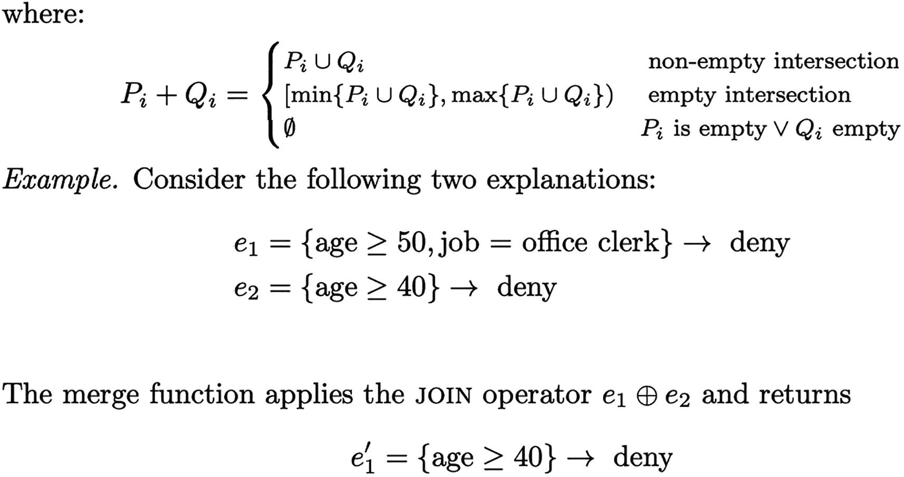

# 十、基于规则的方法的解释

上一章介绍了不同的特征重要性方法。现在让我们将焦点转向不同的基于规则的方法。基于规则的方法的一个优点是，除了给出重要的特征之外，这些方法还提供这些特征的值，以便于理解模型为什么做出特定的决策。基于规则的方法很容易被技术从业者和利益相关者理解。让我们研究一些基于规则的方法。

在过去的几年里，我们使用了部分依赖图、特征重要性方法和内在模型来理解模型行为。SHAP 最近因其事后模型的可解释性而获得了很多关注。

这些技术或方法学习单调响应函数。当我们使用复杂的黑盒模型，如神经网络或 boosting 方法时，响应函数通常是非单调的。在非单调函数中，输入变量在相同方向上的变化会导致响应变量在不同方向上变化。让我们来看看前面几章中的数据在模型中的例子。在网上购物者意向模型中，年龄变量从 20 岁增加到 25 岁，这可能会降低购物意向。然而，40 至 45 岁的人可能会产生相反的效果，增加购物的意愿。许多模型都表现出这样的行为，在全局层次上解释这样的模型并不是一个容易解决的问题。在提取决策树来表示模型行为的某些方法中，可以使用代理模型。在这种情况下，到结束节点的每条路径都经过树被分割的第一个变量。因此所有的规则都包括这个变量。此外，每个树可以有多个深度级别，这可能会使导出规则变得更加复杂。

另一种方法可以是使用 Apriori 算法；但是，它会在数据集中生成出现频率很高的条件，并且不一定能够区分不同的类别。

现在让我们来看看一些没有前面提到的缺点的方法。

## 模型不可知的全局可解释解释

MAGIE 算法是用于模型解释的全局模型不可知方法。它使用 LIME 算法来学习解释某些实例分类的重要条件。规则是由一个*遗传算法*学习的，该算法尝试不同的条件组合来优化适应度函数。因此，这种算法可以被认为是对 LIME 的扩展，它在独立的 if-then 规则中全局地解释模型行为。

接下来，我们来看看算法是如何构造的。让我们从算法中使用的数学术语开始。

让我们假设 MAGIE 算法将数据集 D 和使用该数据集训练的模型 M 作为输入。数据集 D = {(xi，易)} N i=1，其中每一行包含一个实例 xi = {x 1 i，x2 i，..，x p i}具有固定的 p 列和分类标签 yi ∈ Y = {Y1，..，Yk}，k 个类的集合。分类模型 M 具有预测-proba(xi)函数，该函数将概率的 1 × k 向量分配给每个 xi ∈ D。向量中的每个元素表示该实例属于相应类别的概率。该算法输出每个类 Yj 的规则集。每个规则都是条件的合取，而条件是对一个特性列的值的一组约束。

表 [10-1](#Tab1) 突出显示了该算法中的指标。

表 10-1

算法中使用的度量和术语的符号和定义

<colgroup><col class="tcol1 align-left"> <col class="tcol2 align-left"></colgroup> 
| 

标志

 | 

定义

 |
| --- | --- |
| X | 由实例组成的训练数据。 |
| Y | 一组预测类。 |
| X | 定型集中的实例。 |
| Y | 预测的类。 |
| c <sub>i</sub> | 一个条件，它是一个属性和该属性可以取的一系列值的组合。 |
| R <sub>i</sub> | 一种分类规则，如果由条件的合取(AND)组成的谓词成立，则将实例分类为属于其关联的类。 |
| C <sub>i</sub> | 规则 R 的一组条件 <sub>i.</sub> |
| y <sub>i</sub> | 规则 R 的关联目标类 <sub>i.</sub> |
| 盖(R <sub>i</sub> | 规则 R <sub>i</sub> 在训练数据中覆盖的一组实例。这些是 R <sub>i</sub> 的条件为真的例子。 |
| 正确-覆盖(R <sub>i</sub> | 规则的类预测 yi 与模型的预测一致的实例集(形式上，它是集合{x&#124;x ∈ cover(Ri) and yi = M(xi)}，其中 M(xi)是分类器为实例 xi 预测的类。) |
| 不正确-盖(R <sub>i</sub> ) | 被 R <sub>i.</sub> 错误覆盖的实例集 |
| 稀有 | 规则集。由一组 R <sub>i.</sub> 形式的规则组成 |
| 正确-封面(右) | 规则集 r 的正确覆盖。它被定义为 r 中每个规则的 Ri 的正确覆盖的并集。 |
| 封面(R) | 规则集 r 的覆盖。它被定义为 r 中每个规则的 Ri 的覆盖的并集。 |

*   **精度规则**:R<sub>I</sub>的精度是 correct-cover(Ri)中的实例数与 cover(R <sub>i</sub> 中的实例数之比。


*   **长度规则**:R<sub>I</sub>的长度是规则 C <sub>i</sub> 的前提条件集的基数。

*   **类覆盖规则**:Ri 的类覆盖是指正确覆盖(Ri)中的实例数与训练集中分类器已经预测具有标签 yi 的实例数之比。

*   **互信息规则**:互信息规则(RMI)捕捉其与预测类的相互依赖关系。它是使用 MI 导出的，如下所示。

*   **设置精度规则**:R 的精度是 correct-cover(R)中的实例数与 cover(R)中的实例数之比。

*   **设置类别覆盖规则**:R 的类别覆盖是正确覆盖(R)中的实例数量与训练集中分类器已经预测具有标签 y <sub>i</sub> 的实例数量的比率，其中 y <sub>i</sub> 是 R 中的规则预测的类别。

```py
x11 Number correctly classified = TP
x12 Number incorrectly classified = FP
x21 Number incorrectly not classified = FN
x22 Number correctly not classified = TN

row1 = TP + FP;
row2 = FN + TN;
col1 = TP + FN;
col2 = FP + TN;
total = TP + FP + FN + TN;

mi11=TP*log((TP * total) / (row1 * col1));
mi12=FP*log((FP * total) / (row1 * col2));
mi21=FN*log((FN * total) / (row2 * col1));
mi22=TN*log((TN * total) / (row2 * col2));
mutualInformation = mi11 + mi12 + mi21 + mi22;

comparison = TP >= (row1/total)*col1);

if comparison = True then achievedRMI = mutualInformation
else achievedRMI = -mutualInformation;

NormalizedRMI = achievedRMI / bestPossibleRMI

```

既然您已经查看了作为该算法一部分的所有指标，让我们深入到生成 if-then-else 规则的方法 MAGIE 中。下一节将解释各个步骤，包括在创建规则之前处理数据，以及为最终输出处理规则。

## MAGIE 算法方法

该算法的方法在图 [10-1](#Fig1) 中有最佳描述。过程很简单。首先，生成实例级规则，然后组合它们来表示类级规则。然后处理类级规则以移除重复和冗余的规则。最终集合被导出并作为输出呈现。接下来，我们来看看每一步。


图 10-1

MAGIE 算法的实现

### 预处理输入数据

该步骤对输入数据进行预处理，以使每个要素分类。分类特征保持不变。对于数字特征，进行基于熵的宁滨以将特征值分割成离散的箱。例如，如果属性年龄取 10 到 85(包括 10 和 85)之间的值，那么宁滨步骤可以产生范围“10 ≤年龄< 25”、“25 ≤年龄< 60”和“60 ≤年龄≤ 85”。在这个步骤之后，输入数据只包括分类特征。然后将原始数据集分为训练数据集和测试数据集。

### 生成实例级条件

该算法对训练数据中的每个实例进行迭代。对于每个实例，都有一个该实例所属的特定类。计算模型在达到该分类时使用的每个特征值的边际贡献。该方法扰动所讨论的训练实例，并在所考虑的实例的局部中训练局部忠实的线性模型。然后，不同特征的权重近似于边际贡献值。这一步的输出是条件列表。每个条件由一个要素和值组成。

### 从条件中学习规则

生成实例级条件的上一步的输出是实例级重要条件的列表。在为每个类分类该类的实例时，有一组重要的条件。我们想学习那堂课的规则。每个规则都有相关的覆盖率和精确度。

因此，问题如下。如何从这些基础条件中构建具有高精度和高覆盖范围的规则？这可以通过组合禁止的方式来实现。例如，首先评估所有长度为 1 的规则，然后评估长度为 2 的规则，依此类推。然而，如果前一步骤的输出给出 N 个条件，则该算法的复杂度将是 2 N。这对于较大的数据集在计算上是不可行的。

应该有一种可以学习最佳条件组合的方法。该算法应该将最优性的概念作为输入，并随后组合条件以生成最优规则。需要考虑的另一点是，如果数据中有任何分类变量，我们希望规则允许这些分类变量采用多个值。例如，如果我们有一个名为*国家*的分类变量，并且如果“10 ≤年龄< 25”、“国家=美国”和“国家=印度”是类别 2 的条件，那么一个候选规则可以是“如果 10 ≤年龄< 25 并且国家∈{美国，印度}则预测类别 2”。因此，在涉及分类变量的条件中，组合不仅应该是条件的 and，也应该是 or，以允许这样的变量具有多个可能的值。遗传算法在给定的条件下学习这些规则。该算法为每个类独立运行。因此，类级规则是从类级条件中学习的。遗传算法的每一部分都代表一种可能的规则。例如，如果上一步中生成的条件数(学习实例级条件)是 100，那么群体中的每个人都将是长度为 100 的位串。一个示例字符串可以是 100100000....000.所描述的示例表示“如果条件 1 和条件 4 则预测类 1”形式的规则。每个包含分类变量的条件都允许有多个值。适应度函数应该满足几个要求。

*   **精确度和覆盖率**:互信息规则(RMI)抓住了同时优化精确度和覆盖率的概念。高 RMI 规则在低覆盖率的情况下既不高度精确，在高覆盖率的情况下也不过度通用和不精确。

*   **长度**:健身功能增加一个长度因子。这里的直觉是，较短的规则更容易解释。虽然规则长度确实经常与覆盖率成反比，但是明确这个参数会导致更短、更易解释的规则。

*   **Overlap** :一个实例可能被一条规则覆盖，这条规则说它应该属于类 1，而另一条规则说它应该属于类 2。其中只有一个是正确的，并且最小化了最终规则集中的模糊性。因为规则应该具有高精度，这意味着它们正确地复制了模型行为，所以当我们优化精度时，最终规则集中的重叠量被最小化。

采用具有高概率“适合”的个体的群体。这些是位串中仅设置了一位的个体(例如 1000、0100、0010 和 0001)，后面是仅设置了两位的个体(1100、0110、0101...)等等，直到达到整个群体规模(即 1200 个个体)。算法运行 600 代。最后一代的所有个体最终被选为一个类的规则集。因此，这一步的输出是每个类的详尽规则集。一些规则没有给集合增加价值，需要被过滤掉。

### 后处理规则

上一步中生成的规则包括几个冗余规则。为了消除它们，按照精度降序对生成的规则进行排序。然后，对于每个规则 Ri，检查是否正确覆盖(Ri) ⊆正确覆盖(r)和精度(Ri) ≤精度(r)，其中 r 是尚未移除的更精确的规则。则不考虑下一步的 Ri。否则，保留该规则以供考虑。原始数据集被分成训练和测试子集。通过观察训练数据集上的模型行为来学习规则。然后，对于每个规则，计算测试数据集的精度。如果精度小于测试数据的基线精度，则在这一步规则被丢弃。这消除了在训练数据集中具有正 RMI 但在测试数据集中具有低精度的有噪声的规则。基线精度是模型预测 yi 的测试集中实例的分数，yi 是与规则 Ri 相关联的类。

### 互信息排序规则

上一节给出了遗传算法生成的 and(将子句组合成规则)中 or(规则子集)的组合。一旦导出了一个类的最佳规则集，就对它们进行排序，在列表的顶部为用户提供最相关的规则，在列表的底部提供不太相关的规则。这是按如下方式完成的。首先，规则按照 RMI 的降序排列。然后，选择具有最高 RMI 的规则，并将其添加到列表的顶部。然后，选择具有下一个最高 RMI 值的规则。将该规则与已经添加的规则列表进行比较。如果它与已经添加的任何规则相似，我们就放弃这个规则。否则，它将被添加到规则列表中。使用两个规则所覆盖的实例列表之间的 Jaccard 相似性度量来计算相似性。如果 Jaccard 相似性大于 50%，则认为规则是相似的。重复这个过程，直到我们有了想要的规则数。

现在，既然您已经理解了算法中的主要步骤，让我们来看看前面步骤的执行框架。图 [10-2](#Fig2) 显示了更详细的 MAGIE 执行框架(见 [`https://github.com/viadee/magie`](https://github.com/viadee/magie) )。


图 10-2

MAGIE 算法执行的详细框架

*   图 [10-2](#Fig2) 中的**解释映射步骤**对应于本地解释的初始创建。这些局部解释可以用作构建块来创建全局解释。术语“解释映射”因此表示局部解释到全局解释的映射。该框架可以利用这些解释来初始化优化过程，并作为进一步研究规则的搜索空间。

*   图 [10-2](#Fig2) 中的**优化步骤**是指两种类型的规则解释优化，使用框架可以执行:首先是单个规则的优化，然后是规则集的优化。优化器粗略地分为初始化器、表示翻译器、目标函数和优化过程。初始化器的任务是接受一组转发的规则解释；例如从解释映射步骤，并初始化要优化的规则解释群体。您可以简单地使用转发的规则作为规则前身的初始填充或单个条件。表示转换器将算法使用的表示转换成规则解释(集合)。通过这样做，相同的优化过程简单地通过提供新的表示翻译器来优化规则集和单个规则。

*   图 [10-2](#Fig2) 中的**规则优化步骤**接受一个规则解释集作为输入。如果某个条件(即分类预测值要素的值)存在于某个规则中，则该条件将被添加到优化过程的整个搜索空间中。然后可以探索这个搜索空间，以找到性能良好的规则。应该应用目标函数来评估规则的质量。目前，基于互信息的测量被用于 MAGIE 算法，如表 [10-1](#Tab1) 所述。

*   **规则集优化器步骤**也接受规则解释集。在这种情况下，转发的规则解释集中的规则集形成了搜索空间。规则集优化器的目标是减少给定规则解释集中的规则数量，同时保持良好的解释覆盖率和质量。

*   **后处理** **步骤**表示过滤步骤以及对不利用搜索机制的规则和规则集的改变。例如，如果两个规则覆盖了数据集的太多相同数据实例，则只保留“较好的”一个。另一个例子可能是将一个规则的度量与一些定义的基线进行比较，比如基线精度。最后，可以评估规则对先前创建的规则集的贡献。

*   **解释结构化**步骤表示准备向用户显示规则集。为分离中的每个标签值创建规则集。因此，在解释结构化阶段，不同标签的解释可能会聚集在一起。规则解释也可能以类似树状图的方式加入，这是 MAGIE 算法的输出。

最后，结构化的解释对用户是可视化的。

## 全球在地化

GLocalX(全局到局部解释器)是一个模型无关的局部优先解释算法。GLocalX 基于这样一种思想，即通过对代表局部解释的一组逻辑规则进行推理来导出全局解释。GLocalX 通过在增长的层级结构中迭代地“合并”规则，同时考虑规则的保真度(即，模拟黑盒预测的准确性)和复杂性，将以逻辑规则形式表达的局部解释聚集成全局解释。合并过程估计解释之间的距离，并产生一组要合并的排序候选对。然后，处理具有满足保真度和复杂度约束的最小距离的对，以保证泛化，并且更新的解释替换所选择的对。每次合并都确保满足约束。这保证了 GLocalX 产生的最终解释的高保真度和低复杂性。

不同黑盒模型和数据集上的实验结果表明，GLocalX 实现了表示模型解释的规则集的高保真和低复杂度。与优化模型复杂性或保真度但不能同时优化两者的透明模型相比，GLocalX 同时达到了高保真和低复杂性。预测任务的高准确性也表明 GLocalX 可以直接用作透明模型，以取代人工智能系统中采用的全局分类器。

### 局部到全局的解释问题

设 e1，.。。，en ∈ E 是在人类可解释域 E 中定义的黑盒分类器 b 的一组局部解释。局部到全局解释问题在于找到产生解释理论 E = g(e1，.。。，en) ⊂ E，这样 e 描述了 b 做出决策所依据的整体逻辑。为了解决局部到全局的解释问题，我们需要推广局部的解释，因为它们在局部是准确和忠实的，而不是全局的。给定 AI 系统中采用的黑盒分类器 b，以及一组实例 Xle = {x1，.。。，xn}当地解释。他们当地的解释{e1，.。。，en}，通过推导一个解释理论 E = {e 0 1，.。。，e0 k }通过用聚集函数 g 将局部解释精炼成模拟黑盒分类器 b 的全局决策逻辑的解释理论。因此，人类可解释域 E 由一组逻辑决策规则组成。

### 从局部到整体的解释理论层次

GLocalX 方法分层地将局部解释合并成一个整体解释理论。特别地，GLocalX 以解释理论 E = { E1 }的形式将一组局部解释作为输入。。。，En}其中每个理论 Ei = {ei}都是由一个单一的解释形成的(即|Ei | = 1 ∀Ei ∈ E)。GLocalX 迭代合并解释理论并返回一个解释理论，E = {e 0 1，.。。，e0 k }。它模拟黑盒分类器 b 的全局行为，同时保持整体简单和可解释的模型。在每次迭代中，GLocalX 通过使用逻辑理论之间相似性的概念来合并最接近的一对解释理论 Ei、Ej。根据合并质量标准过滤掉这些对:如果没有找到满足标准的对，GLocalX 会提前停止，而不会构建完整的层次结构。解释理论的结果层级可以用一个叫做*树状图*的树状图表来表示。GLocalX 方法中有两个关键要素:(I)相似性搜索，它允许选择合并和提炼哪些理论，以及(ii)合并功能，它允许提炼解释。

给定一组解释理论 E、成对相似性函数和质量标准，逻辑理论在队列 Q1 中通过相似性排序。然后，对一批数据进行采样，合并候选理论。使用批处理而不是整个训练数据集有利于不同的合并，因为合并过程根据手头的数据具有不同的行为。在合并循环中，弹出队列以找到最相似的理论对，其合并满足质量标准，然后运行合并操作。如果合并是有利的，则保留合并后的理论。

作为一个质量标准，*贝叶斯信息标准* (BIC)被使用，因为它奖励模型的简单性和准确性。BIC 已被成功地采用在各种技术中，如聚类或采用二分法的层次细化模型。在两种解释成功融合之后。Ei，Ej 替换为合并的理论 Ei+j。如果没有找到有利的合并，GLocalX 停止。重复这个过程，直到不可能再进行合并为止。最后，过滤掉保真度低的解释，以减少输出大小。α参数表示每个类的微调阈值。

### 寻找相似的理论

选择要合并的理论对需要在逻辑解释理论上定义成对的相似性函数。为此，两个理论的相似性，E1，E2 被定义为它们在给定实例集 *X* 上的覆盖的 Jaccard 相似性。


*E*<sub>T3】IT5】和 *E* <sub>*j*</sub> 对 *X* 的共享覆盖率越大，两种逻辑解释理论就越相似。覆盖相似性是一个双方面的度量，它捕获前提相似性和覆盖相似性。前者很简单:具有相似前提的规则具有相似的覆盖范围。后者平衡前提相似性以避免具有相似前提的规则，但低覆盖率会影响相似性得分。</sub>

merge 函数允许 GLocalX 概括一组解释理论，同时通过近似的逻辑蕴涵来平衡保真度和复杂性。合并涉及两个操作符——连接和剪切——以同时概括和保持高水平的保真度。在逻辑领域，概括很少涉及前提放松或彻底删除。因此，GLocalX 推进了利用这种一般化的最新技术。推动一般化可能会降低保真度。这些截然不同的行为是从局部到全局的焦点，必须相应地加以处理。这个问题是通过一个合并函数来解决的，这个函数既处理规则泛化又处理保真度。假设有两种解释理论，E1 = { *e* <sub>1</sub> ， *e* <sub>2</sub> }和 E2 = {*e*′<sub>1</sub>，*e*′<sub>2</sub>}，用 *e* <sub>1</sub> ，*e*′<sub>1</sub>解释一条记录 x1 和


在 E <sub>1+2</sub> 中，来自不同解释理论的具有相同预测的规则通过放宽其前提而被一般化(规则*E*′<sub>3</sub>)，而具有不同预测的规则通过进一步约束而被专门化(规则*E*′<sub>2</sub>)。具体来说，*e*′<sub>1</sub>，*e*′<sub>2</sub>是在 *e* <sub>1</sub> ，*e*′<sub>1</sub>上切割而成，即*e*<sub>1</sub>-*e*′<sub>1</sub>。更正式地，给定两个解释理论 Ei、Ej，合并函数对解释理论应用两个操作符，以导出由这两个操作符近似包含的新理论:连接和切割操作符。前者允许合并不冲突的规则，而后者允许合并冲突的规则。

一套解释 E = { *e* <sub>1</sub> ，。。。一个逻辑解释理论的一部分被认为在一个实例 x 上是冲突的，如果它们中的两个或更多覆盖一个实例 *x* 但是导致两个不同的结果。两个逻辑解释理论 *E* <sub>*i*</sub> 和 *E* <sub>*j*</sub> 的合并在批中的每个实例上迭代地对非冲突解释应用连接运算符，对冲突解释应用切割运算符。由此产生的一套解释构成了新的解释理论*E*<sub>*I*+*j*</sub>。然后用 BIC 计算测试候选合并，以考虑保真度和复杂度之间的平衡。

在大多数情况下，模型对数似然被计算为规则的保真度，模型复杂度被计算为平均规则长度。在下文中，我们提供连接和切割操作符的细节。这两个操作符向相反的方向移动:join 概括解释，可能以保真为代价，而 cut 专门化解释，可能以概括为代价。换句话说，前者允许一般化，而后者将其规则化。受此启发，我们通过决策规则的另一种表示来定义连接和切割操作符。设 Xbi 是特征 I 上的子空间的集合.给定一个判定规则 r = P → y 我们有任何 Pi ∈ Xbi 是特征 I 上的子空间.规则的前提 P 标识一个定义为 Xb(m)的子空间的拟多面体.

P = {Pi，。。。，Pj} ∈ P(Xb1 × × Xbm)

如果∀Pi ∈ P，xi ∈ Pi，则实例 x 满足 p。因此，如果 x 位于拟多面体定义的子空间中，则 x 满足 P。基于这种准多面体解释，我们定义了合并函数所使用的运算符 join (⊕)和 cut(–)。

连接操作符旨在概括一组不冲突的解释，放松它们的前提，从而概括相关的规则。给定两个拟多面体 p 和 q，连接(⊕)定义如下:P ⊕ Q = {P1 + Q1，.。。，Pm + Qm}。



切割操作符通过切割准多面体以互补的方式起作用。这里，目标是保留较好的规则，并将较小的规则高保真地限制在子空间中。换句话说，目标是通过减去规则来消除规则之间的重叠。这直接转化为减去准多面体。形式上，给定两个拟多面体 P 和 Q，割( )定义如下。

p(–)Q = { P1 Q1，。。。，Pm Qm }


请注意，与 join 运算符不同，cut 运算符是不对称的，因此 P(–)Q = Q(–)P。为了保留高保真规则并限制较低保真度的规则，直接选择 subtracted 和 subtracting 多面体，这两个规则分别是保真度较高和较低的规则。

考虑以下两种解释:e1 = {年龄≥ 25，工作=无业，金额≥ 10K} →否认 e2 = {年龄≥ 20，工作=经理，金额> 8K} →接受其中第一种是占优势的，也就是保真度最高的。merge 函数应用 cut 运算符 e1 e2，返回 e1 = {年龄≥ 25，职务=失业，金额≥ 10K} →拒绝 e 0 1 = {年龄∈ [20，25]，职务=经理，金额∈ [8K，10K]} →接受。注意，e1 保持原样，而 e2 的前提被进一步约束以减少重叠。也就是说，年龄被限制为删除年龄≥ 25 的重叠，金额被限制为删除金额≥ 10K 的重叠。

连接和切割产生不同基数的集合。虽然 cut 保留了规则的数量，但 join 通过将其包含在一个更小、更通用的解释集中而减少了规则的数量。下一节将使用一个样本数据集和 Python 代码展示 GLocalX 的实际应用。

### 密码

让我们考虑下面的数据集，它是一家电信公司的客户流失数据。数据中存在的变量是客户地址的状态、账户天数、区号、电话号码、是否是国际计划、语音邮件计划、vmail 消息的数量、总日分钟数、总日通话、总日费、总夜通话、总夜费、总夜分钟数、总夜费、总国际分钟数、总国际通话、总国际通话、客户服务通话。目标变量是包含真值和假值的 churn。真正的价值在于那些改变或离开电信公司服务的客户。假值适用于拥有活动计划的客户。

让我们看看目标变量的分布。

```py
class_name = 'churn' #Target Variable Name
data[class_name] = data[class_name].replace({True: 1, False: 0})
data.shape

(3333, 21)

data.drop('phone number', axis=1, inplace=True)
data[class_name].value_counts()

0    2850
1     483
Name: churn, dtype: int64

```

为了简单起见，让我们使类均匀平衡。

```py
import imblearn
from imblearn.under_sampling import RandomUnderSampler
from imblearn.over_sampling import RandomOverSampler

X = data.drop(class_name,axis=1)
y = data[class_name]

# define oversampling strategy
over = RandomOverSampler(sampling_strategy=0.2)
# fit and apply the transform
X, y = over.fit_resample(X, y)
# define undersampling strategy
under = RandomUnderSampler(sampling_strategy=0.9)
# fit and apply the transform
X, y = under.fit_resample(X, y)

data = pd.concat([X,y],axis=1)
#data.shape

data[class_name].value_counts()

0    633
1    570
Name: churn, dtype: int64

```

我们来看看不同变量的数据类型。

```py
#   Column                  Non-Null Count  Dtype
---  ------                  --------------  -----
 0   state                   1203 non-null   object
 1   account length          1203 non-null   int64
 2   area code               1203 non-null   int64
 3   international plan      1203 non-null   object
 4   voice mail plan         1203 non-null   object
 5   number vmail messages   1203 non-null   int64
 6   total day minutes       1203 non-null   float64
 7   total day calls         1203 non-null   int64
 8   total day charge        1203 non-null   float64
 9   total eve minutes       1203 non-null   float64
 10  total eve calls         1203 non-null   int64
 11  total eve charge        1203 non-null   float64
 12  total night minutes     1203 non-null   float64
 13  total night calls       1203 non-null   int64
 14  total night charge      1203 non-null   float64
 15  total intl minutes      1203 non-null   float64
 16  total intl calls        1203 non-null   int64
 17  total intl charge       1203 non-null   float64
 18  customer service calls  1203 non-null   int64
 19  churn                   1203 non-null   int64
dtypes: float64(8), int64(9), object(3)
memory usage: 188.1+ KB

```

Important Note!

在传递给 LORE 和 GLocalX 之前，我们需要处理分类特征；否则，分类变量将被视为连续变量，并使用某个阈值对其制定决策规则。

如果您的数据集有一个非常高的维度(太多的列)，您可以使用 SHAP 选择前 20-30 个变量，然后传递这个数据集进行进一步的处理！

*   **数据集**:拆分生成解释。

*   **Train set** :训练黑盒模型。

*   **测试集**:测试黑盒模型的准确性，然后通过知识生成它们的局部规则。

*   **验证集**:验证 GLocalX 在全局规则上的结果。

```py
from scoped_rules.utils import data_processing

features = data_processing(data, class_name)
df, feature_names, class_values, numeric_columns, rdf, real_feature_names, features_map = features.prepare_variables()
X_train, y_train, X_test, y_test, r_X_test, val, test = features.data_splitting(test_size = 0.16, val_size = 0.05)

Length of train set is 959
Length of test set is 183
Length of val set is 61

```

本节将所有分类变量转换为一键编码。

模拟我们的随机森林分类模型。该模型被用作规则生成的黑盒。

```py
from sklearn.metrics import accuracy_score, f1_score, classification_report
from sklearn.ensemble import RandomForestClassifier, GradientBoostingClassifier

bb = RandomForestClassifier()
bb.fit(X_train, y_train)

def bb_predict(X):
    return bb.predict(X)

def bb_predict_proba(X):
    return bb.predict_proba(X)

y_pred = bb_predict(X_test)

print('Accuracy %.3f' % accuracy_score(y_test, y_pred))
print('F1-measure %.3f' % f1_score(y_test, y_pred))

Accuracy 0.880
F1-measure 0.872

```

LORE 是一种模型不可知的方法，能够提供可解释的和忠实的解释。LORE 首先在由遗传算法生成的合成邻域上学习局部可解释预测器。然后，它从局部可解释预测器的逻辑中导出由决策规则组成的有意义的解释，该解释解释了决策的原因。

我们使用了 LORE，因为它比其他本地规则技术(如锚点)更准确、更稳定。

```py
from scoped_rules.lore.lorem import LOREM
from scoped_rules.lore.explanation import *
from scoped_rules.lore.rule import *
from scoped_rules.lore.util import *
import concurrent.futures
import os
import time

lore_explainer = LOREM(r_X_test, bb_predict, feature_names, class_name, class_values, numeric_columns, features_map,
                       neigh_type='geneticp', categorical_use_prob=True, continuous_fun_estimation=False,
                       size=1000, ocr=0.1, random_state=0, ngen=10, bb_predict_proba=bb_predict_proba,
                       verbose=True)
print()

#If you want to check local explanation of any test-set instance

x = X_test[115] #115th instance from our 183 X_test instances
exp = lore_explainer.explain_instance(x, samples=300, use_weights=True, metric=neuclidean)
print()
print()
print(exp)

```

### 输出

```py
calculating feature values

generating neighborhood - geneticp

gen     nevals        avg           min           max
0       150        0.496654     0.496654     0.496654
1       130        0.767585     0.496654     0.993262
2       129        0.972472     0.496654     0.993301
3       122        0.992499     0.98517      0.993301
4       135        0.98904      0.496654     0.993301
5       118        0.99216      0.972332     0.993301
6       122        0.992392     0.97464      0.99328
7       128        0.992371     0.983344     0.99328
8       127        0.99234      0.984633     0.993287
9       132        0.992416     0.984333     0.993287
10      121        0.992546     0.987313     0.993287
gen     nevals      avg         min          max
0       150        0.5          0.5          0.5
1       135        0.500185     0.498573     0.509783
2       119        0.500508     0.498552     0.509982
3       131        0.501412     0.498649     0.51975
4       132        0.501696     0.497202     0.51975
5       123        0.502945     0.497272     0.51975
6       131        0.504018     0.498004     0.537397
7       132        0.505359     0.498784     0.537397
8       125        0.506727     0.498335     0.527432
9       123        0.508359     0.497412     0.55501
10      125        0.509345     0.497186     0.55501
synthetic neighborhood class counts {0: 188, 1: 160}
learning local decision tree
retrieving explanation

r = { customer service calls <= 3.02, voice mail plan = yes, total day minutes <= 241.59, total day charge <= 42.59, total eve charge > 22.50 } --> { churn: 0 }
c =  }

```

对于全局解释，您需要为所有测试实例生成局部解释规则。多重处理技术利用所有的资源并将进程并行化。Python 并行处理库的 concurrent.futures 模块利用大量可用的 CPU 内核并行生成本地解释。

```py
def lore_rules(instance):
    exp = lore_explainer.explain_instance(X_test[instance], samples=300, use_weights=True)
    rule = ExplanationEncoder.default(instance,exp)
    return rule

def local_rules(lore_explainer, X_test):
    start_time = time.time()
    rules = []
    with concurrent.futures.ProcessPoolExecutor(max_workers=94) as executor:
        results = executor.map(lore_rules,[x for x in range(len(X_test))])
        for result in results:
            rules.append(result)
    print()
    print()
    print(f'Total {len(rules)} local rules generated')
    end_time = time.time()
    print('time taken to generate local rules in sec: ', (end_time - start_time))
    return rules

rules = local_rules(lore_explainer, X_test)

```

GLocalX 是一种“局部优先”的模型不可知的解释方法。从以局部决策规则形式表达的局部解释开始，GLocalX 通过分层聚合(合并重要规则)迭代地将它们归纳为全局解释。

生成的局部规则被合并，GLocalX 返回每一类目标变量的最终全局决策规则。

```py
from scoped_rules.global_interpret import glocalx_explanations

model = glocalx_explanations(rules, bb, feature_names, class_values, class_name, val, test, data_path)

results = model.global_rules(batch_size = 32)

Local Rules json file stored at path: /mnt/data/scoped_rules_package/data/local_rules.json
Val_set stored at path:  /mnt/data/scoped_rules_package/data/val.csv
Test_set stored at path:  /mnt/data/scoped_rules_package/data/test.csv

Merging Rules....
Merge Complete!
Time taken for global rules in sec:  13.0773446559906

{
     customer service calls < 3.478666663169861
     total day charge < 42.9187068939209
     state=NE: True
     total day minutes < 264.5166015625

     Class: 0
}

{
     total day charge >= 38.63331413269043

     Class: 1
}

```

因此，您将看到如何使用 GLocalX 生成一个简单的 if-then 规则。GLocalX 的一个主要优势是它在执行方面的灵活性。您可以修改模型以满足数据集的需要。因为它是模型不可知的，所以您可以使用任何类型的模型。它还提供了在最后一步修改和合并规则的灵活性。有时，我们可能希望以不同于默认输出的方式编写规则。例如，默认输出可以是编码的类，而您可以将几个类组合起来作为一个组来表示规则。

## 斯科普-规则

复杂的机器学习模型有时会实现高性能，但会导致不透明的决策。由于法规或错误的严重后果，更多的可解释性往往是必要的。在这里，我们提出 skope-rules，一个基于规则的可解释模型。

Skope-rules 是提出的可解释模型，旨在学习用于“界定”目标类的决策规则；也就是说，以高精度检测该类的实例。生成这种规则的问题已被广泛考虑(见 RuleFit，Slipper，LRI，MLRules)。

然而，这种方法的主要区别在于如何选择决策规则:基于组成每个规则的变量的语义重复数据删除，而不是基于 L1 的特征选择(RuleFit)。

### 方法学

目的规则的方法如图 [10-3](#Fig3) 所示。从这个方法生成规则是一个简单的三步过程。


图 10-3

skope-规则流水线

*   **Bagging 估计器训练**:训练多个决策树分类器和潜在回归器(如果应用了样本权重)。注意，这个 bagging 估计量中的每个节点都可以看作一个规则。

*   **性能过滤**:应用开箱精度和召回阈值来选择最佳规则。

*   **语义去重**:应用相似性过滤来保持规则之间足够的多样性。这两个规则的相似性度量是基于它们的公共术语的数量。术语是由比较运算符(<或>)组合而成的变量名称。

现在让我们来看一下不同步骤的更详细的概述。图 [10-4](#Fig4) 显示了语义复制的最后一步是如何工作的。


图 10-4

目的-规则方法论

### 履行

skope-rules 的实现非常简单，只需一段非常简单的代码即可完成，如图 [10-5](#Fig5) 所示。


图 10-5

skope-规则实现示例

图 [10-6](#Fig6) 显示了 skope-rules 算法的输出示例。


图 10-6

skope-规则输出示例

Skope-rules 适用于不同的应用，可按如下方式使用。

*   **作为全局可解释模型**:这是二进制分类任务的 skope 规则的自然使用。规则将 1 从 0 中分离出来。

*   **作为一个聚类描述符**:在一个聚类任务中，目的规则描述每个细分。可以对每个聚类进行后处理，并用一组可解释的规则进行近似。

*   作为分布队列描述符 : Skope-rules 也与描述任何子样本与总体的不同有关。更准确地说，它描述了由给定变量的最高(或最低)值定义的子样本。Skope-rules 可以有效地理解另一个复杂分类器的最高(或最低)预测分数。

接下来，让我们使用从第 [9](09.html) 章开始使用的数据集，看看如何实现 skope-rules 的工作示例。

响应变量类被编码为将获得和不会获得。

```py
c=np.array(list3)
print(c)
print(list3)
list4=[]
list4.append('Will Earn')
list4.append('Wont Earn')

import sys
import six
sys.modules['sklearn.externals.six'] = six
import skrules
from skrules import SkopeRules

clf = SkopeRules(max_depth_duplication=2,
           n_estimators=30,
           precision_min=0.3,
           recall_min=0.1,
           feature_names=list)

for idx1, revenue in enumerate(list4):
    clf.fit(x_train, y_train == idx1)
    rules = clf.rules_[0:17]
    print("Rules for Revenue ",revenue)#Ask
    for rule in rules:
        print(rule)
    print()
    print(20*'=')
    print()

Rules for Revenue  Will Earn
('Month <= 6.5 and PageValues <= 1.2655065059661865', (0.9865938430983118, 0.6362471982068524, 1))
('Month > 6.5 and PageValues <= 0.0335247740149498', (0.9024152875257552, 0.2542760117477433, 4))

====================

Rules for Revenue  Wont Earn
('BounceRates <= 0.0004056630132254213 and PageValues > 9.61924123764038', (0.8133333333333334, 0.4299559471365639, 1))
('Administrative_Duration > 9.25 and PageValues <= 19.113906860351562 and PageValues > 0.7777977585792542', (0.3952254641909814, 0.2634836427939876, 1))
('BounceRates > 0.0010931899887509644 and PageValues > 8.887159824371338', (0.4906716417910448, 0.2269197584124245, 1))
('BounceRates > 8.075000005192123e-05 and PageValues <= 15.39547348022461 and PageValues > 0.9448194801807404', (0.3780260707635009, 0.18076580587711488, 1))
('BounceRates <= 0.0004102485108887777 and PageValues <= 20.44874382019043 and PageValues > 2.515446901321411', (0.6148409893992933, 0.15038893690579083, 1))

```

您可以看到 skope-rules 的输出是为每个类显示的简单规则。为其定义规则的重要变量是 PageValues 和 BounceRates。在正类中，将在 Month 和 PageValues 变量上制定收入规则。

## 锚

锚通过找到充分“锚定”预测的规则来解释任何黑盒分类模型的预测。如果其他特征值的变化不影响预测，则规则锚定预测。锚利用强化学习技术结合图搜索算法来将模型调用的数量(以及因此所需的运行时间)减少到最小，同时仍然从局部最优中恢复。Ribeiro，Singh 和 Guestrin 在 2018 年提出了该算法。引入石灰算法的同一批研究人员。

像它的前身一样，anchors 方法部署了一个基于*扰动* *的*策略来为黑盒机器学习模型的预测生成*局部*解释。然而，与 LIME 使用的代理模型不同，最终的解释被表达为易于理解的 if-then 规则，称为*锚*。这些规则是可重用的，因为它们是*作用域*的:锚包含覆盖的概念，精确地声明它们应用于哪些其他的、可能看不见的实例。找锚涉及到一个探索或者多臂土匪问题，这个问题起源于强化学习这个学科。为此，为每个被解释的实例创建和评估邻居或扰动。这样做允许该方法忽略黑盒的结构和它的内部参数，以便这些可以保持不被观察到和不被改变。因此，该算法是*模型不可知的*，这意味着它可以应用于*任何*模型类。

图 [10-7](#Fig7) 使用两个示例性实例描述了局部解释复杂二元分类器(预测+或–)的石灰和锚。LIME 的结果并不表明它们有多可靠，因为 LIME 只学习最接近模型的线性决策边界。给定相同的扰动空间，锚点方法构建解释，其覆盖范围适应模型的行为，并清楚地表达它们的边界。因此，它们在设计上是忠实的，并准确地说明它们对哪些实例有效。这个属性使得锚点特别直观，容易理解。


图 10-7

锚与石灰的对比图

如上所述，算法的结果或解释以称为锚的规则的形式出现。图 [10-8](#Fig8) 展示了这种锚。例如，假设我们有一个二元黑盒模型，预测一名乘客是否能在*泰坦尼克号*灾难中幸存。现在我们想知道*为什么*模型预测一个特定的个体能够存活下来。


图 10-8

锚点示例

anchors 算法提供了以下结果解释。

```py
IF SEX = female
AND Class = first
THEN PREDICT Survived = true
WITH PRECISION 97%
AND COVERAGE 15%

```

这个例子展示了锚是如何为模型的预测及其潜在的推理提供重要的见解的。结果显示模型考虑了哪些属性，即女性和第一类。对于正确性至关重要的人类，可以使用这个规则来验证模型的行为。锚点也适用于 15%的扰动空间实例。在这些情况下，解释是 97%准确的，这意味着显示的谓词几乎是预测结果的唯一原因。

锚 A 的正式定义如下。

EDx(z|A)[1f(x)=f(z)] ≥ τ，A(x)=1

*   x 代表被解释的实例(例如，表格数据集中的一行)。

*   A 是一组谓词(即，结果规则或锚)，使得当由 A 定义的所有特征谓词对应于 x 的特征值时，A(x)=1。

*   f 表示要解释的分类模型(例如，人工神经网络模型)。可以查询它来预测 x 及其扰动的标签。

*   Dx( |A)表示 x 的邻居分布，匹配 A。

*   0≤τ≤1 指定精度阈值。只有达到至少τ的局部保真度的规则才被认为是有效结果。

### 寻找锚点

虽然锚的数学描述看起来清晰明了，但是构建特定的规则是不可行的。这需要评估以下内容。

1f(x)=f(z)1f(x)=f(z)对于所有 z∈Dx( |A)

这在连续或大输入空间中是不可能的。因此，作者建议引入 0≤δ≤10≤δ≤1 参数来创建一个概率定义。通过这种方式，抽取样本，直到有关于其精度的统计置信度。概率定义如下。

p(prec(A)≥τ)≥1δ，prec(A)=EDx(z|A)[1f(x)=f(z)]

通过覆盖的概念，前面的两个定义被合并和扩展。其基本原理包括寻找适用于大部分模型输入空间的规则。覆盖正式定义为锚应用于其邻居的概率(即，其扰动空间)。

cov(a)= ed[a]的缩写

包含这个元素导致主播最终的定义是考虑覆盖面最大化。

最大 cov

as . t . p(prec(A)≥τ)≥1δ

因此，该过程在所有合格的规则(满足给定概率定义的精度阈值的所有规则)中努力寻找具有最高覆盖率的规则。这些规则被认为更重要，因为它们描述了模型的更大部分。注意，谓词较多的规则往往比谓词较少的规则具有更高的精度。修正 xx 的每个特征的规则将评估的邻域减少到相同的实例。因此，该模型对所有邻居进行同等分类，并且该规则的精度为 1。同时，修复许多特性的规则过于具体，只适用于少数情况。因此，在精确度和覆盖率之间有一个权衡。

锚点方法使用四个主要部分来寻找解释，如图 [10-9](#Fig9) 所示。


图 10-9

锚流程图

*   **候选生成**:生成新的解释候选。在第一轮中，x 的每个特征产生一个候选，并确定可能扰动的相应值。在每隔一轮中，前一轮的最佳候选被一个尚未包含在其中的特征谓词扩展。

*   **最佳候选人标识**:候选人规则将被比较，看哪个规则对 xx 的解释最好。为此，通过调用模型来创建和当前观察到的规则相匹配的扰动。然而，这些调用需要被最小化以限制计算开销。这就是为什么有一个纯粹的探索多臂土匪(MAB；准确地说是 KL-LUCB)这个组件的核心。单克隆抗体使用顺序选择有效地探索和利用不同的策略(类似于老虎机，称为*臂*)。在给定的设置中，每个候选规则都被视为可以拉动的手臂。每次它被拉出，各自的邻居被评估，并且我们因此获得关于候选规则的回报的更多信息(锚的情况下的精度)。因此，精度说明了规则对要解释的实例的描述有多好。

*   **候选精度验证**:如果没有候选精度超过τ阈值的统计置信度，则采集更多样本。

*   **改进的波束搜索**:所有的组件被组合在一个波束搜索、一个图形搜索算法和一个宽度优先算法的变体中。它将每一轮的最佳候选人带到下一轮(其中 B 被称为*波束宽度*)。然后，这些最佳规则被创建为新规则。波束搜索最多进行 featureCount(x)轮，因为每个特征最多只能包含在一个规则中一次。因此，在每一轮 I 中，它生成正好带有 ii 谓词的候选项，并从中选择最佳的 B。因此，通过将 B 设置为高，该算法更有可能避免局部最优。反过来，这需要大量的模型调用，从而增加了计算量。

### 优势

anchors 方法与 LIME 相比具有多种优势。首先，算法的输出更容易理解，因为规则**很容易解释**(即使对于外行人也是如此)。

此外，**锚是可子集化的**，甚至通过包含覆盖的概念来陈述重要性的度量。第二，当模型预测在实例的邻域中是非线性或复杂的时，锚方法**起作用。由于该方法采用强化学习技术，而不是拟合代理模型，因此不太可能出现不足。**

除此之外，该算法是**模型不可知的**，因此适用于任何模型。

此外，它**非常高效，因为它可以通过使用支持批量采样的 mab(例如 BatchSAR)进行并行化**。

### 不足之处

像大多数基于扰动的解释器一样，该算法受到**高度可配置**和有效设置的影响。需要调整波束宽度或精度阈值等超参数，以产生有意义的结果。扰动函数也需要为一个领域/用例明确设计。想想表格数据是如何受到干扰的(干扰意味着给数据添加噪声),并将相同的概念应用于图像数据。(提示:这些不能应用。幸运的是，在一些领域中可以使用默认方法(例如，表格)，这有助于初始的解释设置。

此外，**许多场景需要离散化**,否则，结果会过于具体，覆盖率低，无助于理解模型。虽然离散化有所帮助，但如果不小心使用，它也可能会模糊决策边界，从而产生完全相反的效果。由于没有最佳的离散化技术，用户需要在决定如何离散化数据而不获得差的结果之前了解数据。

像所有基于扰动的解释器一样，构造锚点需要对 ML 模型进行多次调用。虽然该算法部署 mab 以最小化调用的数量，但其运行时间仍然取决于模型的性能，并且高度可变。

最后，**覆盖的概念在某些领域**中没有定义。例如，对于一幅图像中的超像素与其他图像中的超像素相比如何，没有明显或通用的定义。

接下来，我们取一个 anchor 算法中默认提供的数据集，用它来生成简单的规则。可以按照代码一步一步来理解 anchor 的实现。

导入与锚点相关的库。

```py
from __future__ import print_function
import numpy as np
np.random.seed(1)
import sys
import sklearn
import sklearn.ensemble
%load_ext autoreload
%autoreload 2
from anchor import utils
from anchor import anchor_tabular

```

这个数据集是关于预测一个人的收入是高于还是低于 50，000 美元。

```py
dataset = utils.load_dataset('adult', balance=True, dataset_folder=dataset_folder, discretize=True)

```

下面我们来训练一个分类器。

```py
c = sklearn.ensemble.RandomForestClassifier(n_estimators=50, n_jobs=5)
c.fit(dataset.train, dataset.labels_train)
print('Train', sklearn.metrics.accuracy_score(dataset.labels_train, c.predict(dataset.train)))
print('Test', sklearn.metrics.accuracy_score(dataset.labels_test, c.predict(dataset.test)))

```

### 得到一个锚

现在让我们开始解释。我们需要训练数据来扰乱实例。categorical _ names 是从整数到字符串列表的映射，包含分类特性的每个值的名称。不在此地图中的每个要素都被视为有序或连续的，因此被离散化。

```py
explainer = anchor_tabular.AnchorTabularExplainer(
    dataset.class_names,
    dataset.feature_names,
    dataset.train,
    dataset.categorical_names)

```

接下来，我们得到预测数字 0 的锚。锚是一个充分条件；也就是说，当锚保持时，预测应该与该实例的预测相同。

```py
idx = 0
np.random.seed(1)
print('Prediction: ', explainer.class_names[c.predict(dataset.test[idx].reshape(1, -1))[0]])
exp = explainer.explain_instance(dataset.test[idx], c.predict, threshold=0.95)

Prediction:  b'>50K'

print('Anchor: %s' % (' AND '.join(exp.names())))
print('Precision: %.2f' % exp.precision())
print('Coverage: %.2f' % exp.coverage())

Anchor: Education = Bachelors AND Relationship = Husband AND Occupation = Sales
Precision: 0.97
Coverage: 0.02

```

注意，我们将 threshold 设置为 0.95，所以我们保证(大概率)精度在 0.95 以上；也就是说，锚保持的实例上的预测至少在 95%的时间里与原始预测相同。让我们在测试机上试一试。

```py
# Get test examples where the anchora pplies
fit_anchor = np.where(np.all(dataset.test[:, exp.features()] == dataset.test[idx][exp.features()], axis=1))[0]
print('Anchor test precision: %.2f' % (np.mean(c.predict(dataset.test[fit_anchor]) == c.predict(dataset.test[idx].reshape(1, -1)))))
print('Anchor test coverage: %.2f' % (fit_anchor.shape[0] / float(dataset.test.shape[0])))

Anchor test precision: 0.97
Anchor test coverage: 0.02

```

## 摘要

这一章非常重要，因为基于规则的方法在分析行业中不是非常常见的可解释性方法。大多数用例仍然依赖于 SHAP 和其他与特性重要性相关的方法；然而，当理解建模数据集中每个类的行为时，像 MAGIE 和 GLocalX 这样的方法可以带来很多好处。