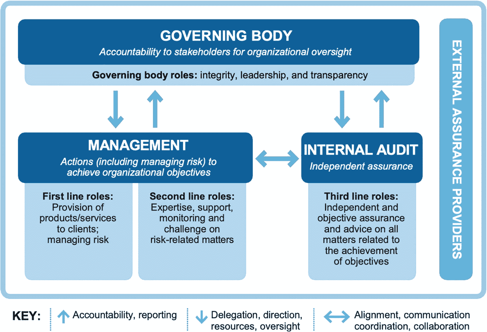

# 一、三道防线

人工智能 (AI)和*机器学习* (ML)已经远远不仅仅是时髦词汇，而是带来了切实的商业价值。许多组织已经在多个实际用例中成功地利用了 AI 和 ML。风险管理为人工智能应用提供了一个独特的机会。除了帮助组织主动管理风险，内部审计师还可以使用人工智能来调整和实现业务目标。由于审计人员需要保持独立性，治理和角色定义已成为风险管理应用中关注的中心话题。特别是，审计员不应该审计他们自己的工作。银行一直处于这些风险管理应用的最前沿(以检测和阻止欺诈)。

“*三道防线*”模型已被广泛采用，以帮助指导风险管理领域的人工智能实现，包括审计。该模型是一个框架，阐明了有效风险管理和控制的角色和职责。2020 年，在全球范围内不断增长的企业风险中，“三道防线”模式被演化和完善为“*三线*模式。本章将探讨为什么治理和明确定义的角色对于在风险管理中利用人工智能和 ML 是至关重要的。它还提供了一个坚实的案例，说明为什么当前的“三线”模型允许在审计中使用 ML。

## 人工智能、人工智能和审计

人工智能和机器学习可以互换使用。有必要澄清它们的含义。想象一个孩子在玩巨型积木。孩子决定哪个积木放在另一个积木的上面。决策是由过去的经验(或学习)驱动的。例如，在尝试了几次之后，孩子知道正方形积木不能放在三角形积木的上面。在这里，孩子决定下一个块的决策机制可以通过机器学习来建模。如果孩子被机器人取代，那么机器人作为一个整体就变成了所谓的人工智能代理。人工智能包括给机器编程，让它完成人类通常会完成的任务。

机器学习分为两大类——*监督学习*和*非监督学习*。在监督学习中，被建模的过程的标记输入和期望输出用于训练模型。相比之下，无监督学习涉及使用自学习技术来建模未标记的数据集。在我们的孩子和巨型积木的例子中，监督学习是当孩子从他们的父母那里学习，向他们展示如何使用积木建造一座塔。无监督学习是当孩子通过试验不同的构造，基于他们自己的理解学习建造一个以前从未建造过的房子。监督学习和非监督学习之间的差异是一个重要的区别，它将用于解释监督学习的一些挑战。

术语“审计师”在不同的情况下有不同的含义，但在本书中我们将使用它来代表“内部审计师”。一家公司雇佣一名内部审计员来检查公司的流程并了解组织的风险。然后，审计师通过与高级管理层和董事会进行风险评估(通常每年进行一次)来收集风险。作为验证的一部分，审计员评估高风险公司流程，并检查支持文档(包括组织数据)。

由于内部审计师需要保持独立性，AI 和 ML 提出了独特的挑战。根据内部审计师协会(IIA)的指导意见，“独立性是指不受威胁内部审计活动以不偏不倚的方式履行内部审计职责的能力的条件的影响。”如果内部审计自己开发解决方案，与 AI 或 ML 应用程序相关的开发工作可能会被视为内部审计的障碍。需要定义其他角色来支持开发过程，以保持内部审计的监督和独立性。还必须建立适当的治理结构，以支持 AI/ML 开发人员和内部审计职能部门之间的协作和信息共享。

内部审计部门面临的另一个挑战是 AI/ML 模型中使用的数据质量。机器学习的一些应用，如监督机器学习，基于历史数据做出决策。存在内部审计可能基于“脏”和有偏见的数据做出决定的风险。虽然这些问题并不新鲜，但对于 AI/ML 建模来说，这可能是一个更重要的问题。通过与数据分析师合作，审计员可以在应用程序处理数据之前检查数据的完整性。数据偏差是一个需要克服的更复杂的问题。在人工智能过程的数据探索步骤中，数据专家可以“清理”数据，并通过与群体中的其他人进行比较和验证来监控异常值。此外，可以明确定义内部审计员和独立 AI 治理实体的角色和职责，以确保内部审计的独立性得以保持。

在下一节中，我们将了解“三道防线”模型。将详细探讨该模型，包括它在风险管理应用中的不足之处。

## 三道防线模型

IIA 在 2013 年引入了“三道防线”模型，以明确有效管理和控制风险的角色和责任。这些角色本身在 2013 年之前就已经存在，但是它们还没有被正式定义，也没有像这里所描述的那样被详细讨论。

图 [1-1](#Fig1) 显示了内部审计师协会在 2013 年 1 月题为“有效风险管理和控制的三道防线”的立场文件中提出的三道防线模型。它改编自欧洲内部审计协会联合会(EC IIA)/欧洲风险管理协会联合会(FERMA) *关于第 8 号《欧盟公司法指令》第 41 条*的“三道防线”模型。

图 1-1

三道防线模型

图 [1-1](#Fig1) 所示的三道防线定义如下:

*   第一道防线。这代表了运营管理层在以管理和内部控制的形式评估、控制和减轻风险方面的作用。运营管理团队向高级管理层报告。

*   第二道防线。它包括财务控制、安全(物理和信息)、风险管理、质量、检查和合规职能，以及他们在确保有效管理和降低其职能领域内的风险方面的作用。这些职能也向高级管理层报告。

*   第三道防线。内部审计师作为第三道防线，独立评估组织的内部和外部风险，并确保风险得到有效管理。内部审计团队与高级管理层合作降低风险，并向审计委员会/管理机构/董事会报告。

还有一个外部审计职能，通过这一模式得到认可，可以作为第四道防线。外部审计师提供了另一种独立保证。但是，它们的范围和目标仅限于财务报告风险。

该模型说明了各种参与者的报告关系，但有一些要点需要注意:

*   在这一模式中，高级管理层和理事机构之间的关系不明确。

*   该模型侧重于解决风险(防御)，而不涉及满足组织目标。

*   尽管内部审计部门与理事机构和高级管理层之间存在着向上的互动，但内部审计部门与其他两条线之间的互动并不存在。

*   这种相互作用似乎是单向的。为了有效合作，信息共享/互动需要双向进行。例如，在风险评估过程中，理事机构向内部审计提供企业范围风险的信息。内部审计评估风险，并向管理层和审计委员会提供结果报告。这显示了两个方向的相互作用。

在下一节中，我们将探讨一般风险管理的复杂性和机遇。

## 风险管理的复杂性

组织使用一系列复杂的人员、流程和技术来管理和降低内部和外部流程带来的风险。流程所有者或服务提供者对他们的流程和资产负责。流程负责人管理与其运营相关的风险。组织内的流程负责人和产品/服务提供商是第一道控制线("*第一道防线*")，他们知道哪些风险会影响他们的产品和服务。安全(物理和网络)、合规、质量、财务控制和风险管理等职能部门的人员根据其领域知识提供监控、专业知识和支持。这些领域专家帮助监督流程所有者，并确保风险作为他们角色的一部分得到控制。因此，他们被称为“*第二道防线*最后，内部审计师是一个独立的保证提供者。当涉及到识别和管理风险时，他们确保对领域专家的监督。这就是称它们为“*第三道防线*的原因流程所有者和领域人员向高级管理层报告，而高级管理层又向管理机构报告。另一方面，内部审计员直接向理事机构或董事会报告，并行使其独立性。需要注意的重要一点是，独立并不意味着与其他两道防线隔绝。这些实体之间需要大量的协调，才能有效实现总体组织目标。

与这些“防线”相关的另一个复杂性是它们各自的访问级别。流程所有者将拥有特定流程的完全管理权限，并且可以读取和写入数据。财务控制人员只能读取同一流程的财务数据。内部审计员通常对整个系统有全面的了解，但可能缺乏更好地理解系统所需的过程或领域知识。例如，对于物料管理流程，流程所有者将拥有对物料管理流程数据的完全访问权限(读/写)。网络安全小组将有权(只读)访问该流程所在的企业资源规划系统的安全组件。公司内部的内部审计职能部门可以自由访问(只读)ERP 和物料管理数据。拥有流程和 ERP 系统的领域知识和对数据的访问，可以成为向公司的利益相关者提供保证以及帮助实现业务目标的宝贵工具。这将在本章后面的进攻和防守机会中详细讨论，供内部审计师选择。

一个组织可能有数百甚至数千个 IT 应用程序。每个应用程序都有自己的应用程序生成的数据(应用程序日志)和系统生成的数据(在 Active Directory 中捕获的系统日志)。应用程序也相互交互，交互可以以应用程序编程接口(API)日志的形式捕获。许多领先的云提供商在更细粒度的 API 级别捕获日志，而不是在任务级别。通常，这些日志被用作审计跟踪，也就是说，捕获日志主要是为了支持调试问题和帮助调查。这些日志还可以用来帮助管理层实现他们的业务目标。这是一个很大程度上尚未开发的机会，等待着公司利用，以获得对公司行为的洞察力，包括组织风险。理解并意识到公司的行为是获得可操作的公司特定知识的第一步，这些知识可用于预测公司的行为趋势。然后，可以利用规范的见解来调整公司的系统，从而提供一个支持业务战略的更有效的平台。为了利用这个机会，三国防线之间需要更高层次的合作。

组织孤岛是有效管理和控制风险的另一个障碍。在看“防线”模型时，三条“线”很容易相互孤立。例如，某个组织的安全检查员希望使用 IT 应用程序在远程站点的手机上记录他们的检查。第一道防线是安全操作团队，安全检查员是该团队的一部分。第二条线可能由网络安全运营、合规团队或供应链团队组成，这取决于解决方案是在内部创建的还是现成的商业产品。内部审计员将是独立评估与解决方案相关的风险的第三道防线。

在一个理想的组织中，运营团队需要在项目的整个生命周期中，从预规划阶段开始，就让内部审计和风险管理专业人员参与进来。通常情况并非如此。在应对风险的过程中，各个小组之间缺乏问责、沟通和协作。虽然可能有一个集中的风险登记册，但应对措施是个性化的，通常不会考虑整体业务目标。在我们的示例中，如果网络安全运营团队在供应商选择阶段就参与进来，项目就可以避免代价高昂的错误，如不支持的数据格式、额外的用户访问审查和冗余流程等。同样，如果内部审计没有在流程的早期介入，可能会导致以被动的方式处理新解决方案带来的风险。在下一个年度风险评估流程中，新解决方案出现在内部审计的雷达上之前，不会对风险进行评估。

既然我们已经了解了组织中管理和控制风险的一些挑战，那么让我们看看“三道防线”模型是如何解决这些挑战的。我们还将查看该模型最近的更新，使其成为“三线”模型。为了使 AI 和 ML 被内部审计成功采用，需要将其纳入“三线”模式。

## 三线模式

“*三线*”模式更好地阐明了内部审计师的角色和职责，并解决了内部审计师除了现有的防御角色之外，还需要提供建议以实现业务目标的问题。这在以前的模型中是不清楚的，在以前的模型中，管理层可能被认为是唯一负责帮助企业实现其战略目标的人。

图 [1-2](#Fig2) 显示了更新后的“三线”模型。它解决了风险管理功能与组织的业务目标保持一致的需要。与早期的“三道防线”模式相比，这是一个相当大的转变。

图 1-2

IIA 的“三线”模式

图 [1-2](#Fig2) 中所示的角色详述如下:

*   **一线角色。**这类角色涉及组织内外产品或/和服务供应商的风险管理。

*   **二线角色。**这些角色由主题专家/领域专家组成，为其相应的职能领域提供支持、监控和控制评估。

*   三线角色。这种类型的角色提供独立客观的保证以及实现目标的指导。

除了角色和责任的定义之外,“三线”模式强调采用基于原则的方法来实现组织的具体目标。

六项原则陈述如下:

*   原则 1:治理

*   原则 2:理事机构的作用

*   原则 3:管理以及一线和二线角色

*   原则 4:三线角色

*   原则 5:三线独立

*   原则 6:创造和保护价值

原则 1 谈到理事机构、管理层和内部审计的责任，以及它们与治理的关系。原则 2-4 中详细定义了每条线的作用。原则 5 强调内部审计职能独立于管理层责任的重要性。原则 6 通过三条线之间的协作和透明性来实现商业价值的创造和保护。

## 结论

AI/ML 需要在“三线”模型内工作，以便利用风险管理。AI/ML 应用程序需要由一线或二线开发，这取决于应用程序的类型。例如，由于申请属于应付账款(AP)流程，所以第一条线将执行重复的供应商付款申请。访问管理审查人工智能应用程序将由二线部门制作，因为它最好由网络安全团队管理。这些应用程序的监督和验证将由内部审计(第三线)提供。

人工智能和人工智能在风险管理应用中的使用提出了独特的挑战。最近为澄清角色和责任而对“三道防线”进行的更改是朝着正确方向迈出的一步。“三线”模型通过确保维持适当的治理结构和流程，支持风险管理领域的人工智能和人工智能应用。通过进一步明确 AI/ML 团队的角色，可以对此模型进行额外的调整。新模型的原则驱动方法与以前的模型相比是一个重要的变化，因为它确保了风险管理决策的一致性。它还确保了模型随着时间的推移不断得到改进。

新的“三线”模式还强调了内部审计员作为实现组织业务目标的推动者的作用。该模型认识到，内部审计和其他部门必须协同工作，以创造和保护业务价值。工作需要与组织的优先利益保持一致。这是对内部审计师帮助独立评估和验证组织风险的现有传统角色的补充。AI 和 ML 为内部审计提供了极好的机会，为组织提供了切实的价值。