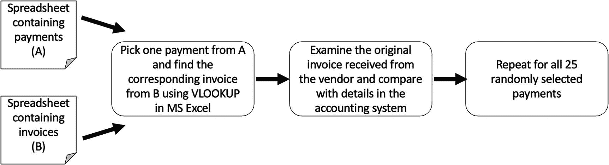
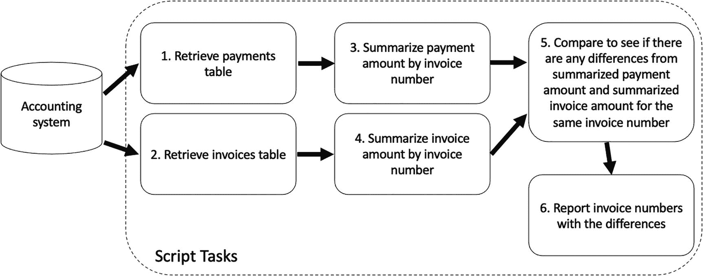
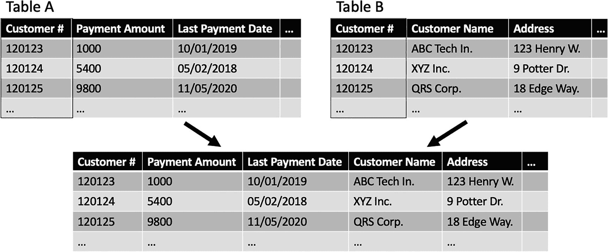
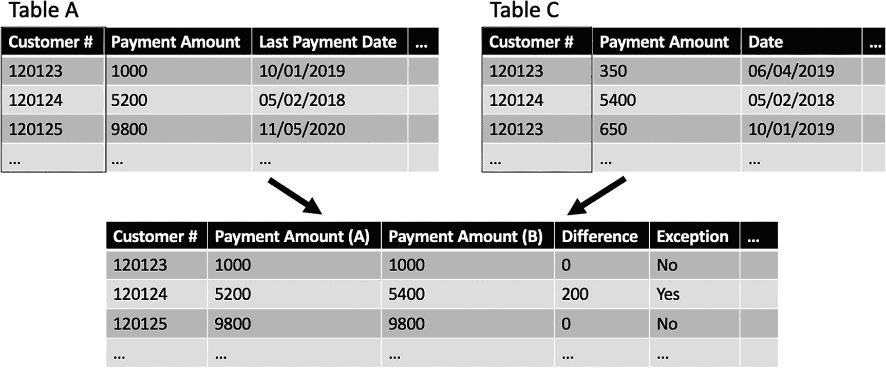
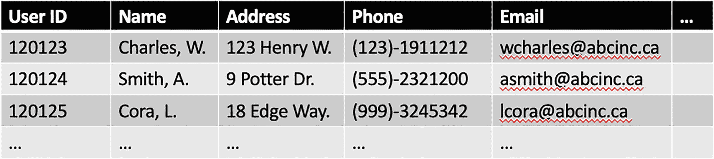
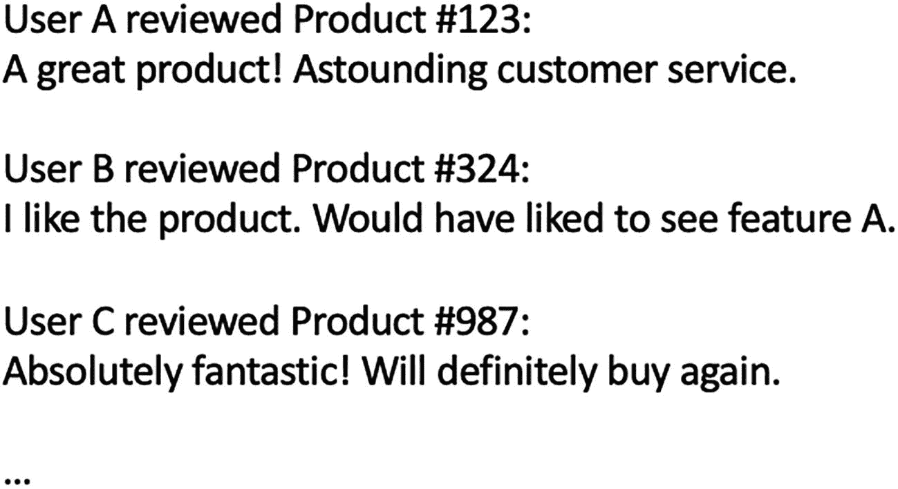
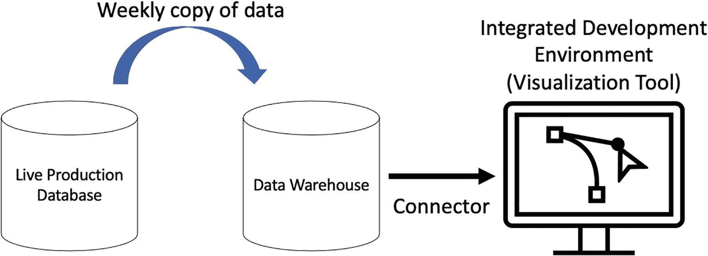
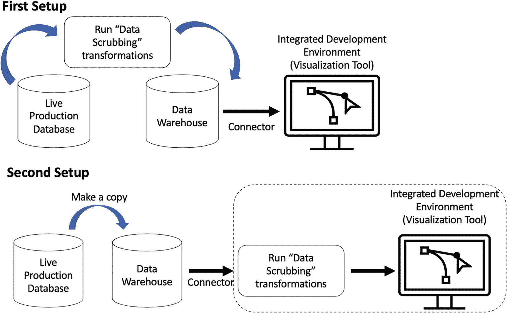
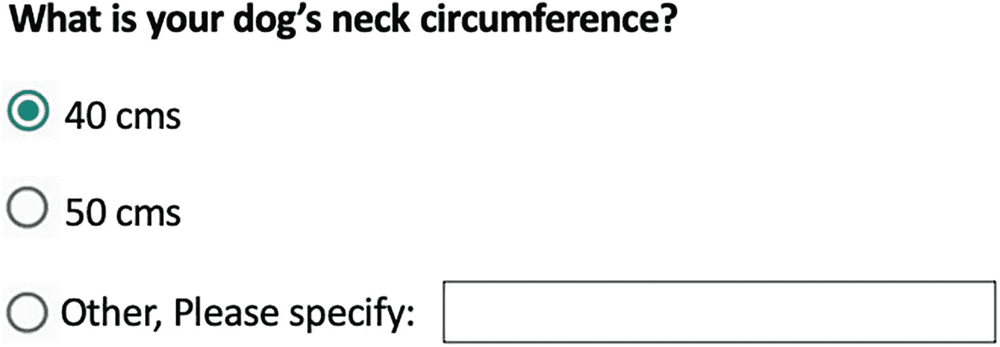

# 二、常见的审计挑战

内部审计小组对已识别的风险进行评估。作为评估的一部分，过程数据以支持证据的形式使用。例如，如果在企业资源规划访问管理流程中发现了风险，一份证明文件可以作为访问审查的证据。访问检查通常以屏幕截图的形式从系统中捕获，显示在将访问权授予个人之前，管理层已批准了该访问权。该评估可作为独立的佐证工具，用于支持受访者的说法。它也可以是来自相关机构的审查日志记录或电子邮件的形式，表明他们在授予访问权限之前批准了访问。在这种情况下，支持文档可以称为*非结构化数据*。我们将在本章中探讨更多的非结构化数据。

数据的另一种用途可以是详细测试。在这种情况下，数据以带有字段的表的形式获得。例如，在访问管理审计过程中，这可能包括显示谁可以访问什么角色的表格、系统中所有管理员的列表或已离职员工的列表。这种类型的数据称为*结构化数据*。我们将在下一节中看到更多这方面的内容。

近年来，数据处理技术和工具一直在不断发展。随着将数据货币化并为企业创造价值的需求不断增长，转换和理解数据的更高效方法也在不断涌现。如果内部审计人员要能够使用组织数据，他们必须能够跟上这个步伐。例如，在访问管理审计示例中，显示哪个员工可以访问什么角色的表可能非常重要，可能需要一些数据连接(比如将员工 ID 与员工姓名绑定)，以及对 ERP 系统中数据分布的理解。内部审计执行此类数据操作的能力取决于整个团队的数据素养。

尽管团队中的一些人可能负责该组的数据密集型需求，但内部审计团队的所有成员(从首席审计官(CAE)到初级审计员)都需要了解这些任务的重要性。CAE 和内部审计主管可以通过为数据密集型任务雇用适当的数据专家或具有数据知识的内部审计员来更好地满足资源配置要求。经理和审计员将在内部审计职能部门采用数据方面发挥作用。我们将在本章的第一节对此进行更多的探讨。

*公民发展*是一个由创新驱动的概念，随着组织内越来越多的人意识到数据的力量，这个概念在组织内越来越受欢迎。如果组织中的每个人都有能力利用组织产生的任何数据，会怎么样？这是公民发展试图解决的问题。我们将在本章中讨论这个概念以及与治理和安全性相关的挑战。数据的完整性和准确性对于确保数据质量至关重要。需要开发一个系统化的流程，以确保审计员执行必要的数据质量和完整性检查。审计员和数据专家的角色和职责需要详细设计，以确保审计员知道何时让数据专家参与更复杂的任务。还将讨论建立在前一章基础上的框架。

*大数据*带来了审计员必须应对的挑战。本章将探讨数据的*量*和*准确性*的大数据概念及其挑战。此外,*数据偏差*的概念将被详细讨论。由于其复杂性，这可能是更复杂的检测和克服问题之一。这里将提出一些常见类型的数据偏差以及克服它们的相应解决方案。

## 数据素养

审计部门内数据启用(采用数据)的主要障碍之一是，并非每个人都完全了解数据的重要性。内部审计团队的某些或所有级别缺乏认识和协调方法。数据工具和技术应该是团队中更懂技术的角色或背景的责任。

Clive Humby 在 2006 年创造了短语“数据是新的石油”。最初，原油本身的价值较低，但当它被转化为其他产品，如塑料、化学品、天然气和矿物时，其价值就会增加。同样，原始数据本身对组织没有价值。价值来自对从数据中获得的洞察力的处理和可用性。这是这个短语的原始解释。根据这一解释，在石油加工步骤中没有一个角色表示“石油专家”或“石油专家”。从高级管理人员到现场工作人员的一组人聚在一起提炼石油。我们为什么要认为数据有什么不同呢？数据处理必须涉及首席审计官、审计主管、审计经理以及审计员，以便作为一个团队提取数据的价值。

高级审计领导需要了解数据在增强审计结果中的作用。高级领导需要为审计人员和管理人员提供专业工具和培训，以便他们能够处理为组织增加价值的数据。经理在从数据中提取价值的角色是评估团队中的数据分析知识差距，并制定计划来弥补这些差距。管理人员需要识别将为组织带来价值的数据分析机会。请注意这里的重点是如何放在组织上，而不仅仅是满足内部审计团队的目标。这建立在我们在前一章中讨论的三条线模型的基础上，该模型指出了一个事实，即参与风险管理过程的每个人都必须为组织目标做出贡献。

并非所有审计人员都需要接受数据专家培训，但他们至少应该了解数据处理中涉及的所有步骤的高级知识。审计员的部分职责是成为项目经理。为了成为一名优秀的项目经理，应该了解确保审计遵循正确流程所需的高级数据处理任务。作为项目经理，审计员可以与其他数据专家合作，了解他们对审计数据的需求。

除了关于数据处理的知识之外，领域知识必须与收集的数据相结合，以便得出最佳值。一般来说，领域知识是关于特定领域或学科的系统和过程的知识。在内部审计领域，有两种类型的领域知识——*审计领域知识*和*审计领域知识*。审计领域的知识是了解内部审计的流程，例如如何审计和审计什么。审核领域知识涉及审核本身职能领域的知识。例如，为了审计应付账款(AP)流程，理解 AP 流程是必要的。执行审计时，最好将职能领域知识(AP 流程)与对数据本身的理解(如供应商付款数据)结合起来，以便从审计中获得最大价值。

有许多方法可以提高组织内部的数据素养。数据素养计划可以通过利用组织内的数据专家来开发。与学习一门新语言类似，数据流利性可以在其他更熟悉数据语言的人的帮助下进行训练。向熟悉学习者领域的数据专家学习可能对学习者更有益。知识共享研讨会、测验和员工演示是可用于促进数据素养的一些手段。像任何其他语言一样，数据术语需要定期练习，这样才能更快地掌握。为公民开发者建立一个框架，创建一个卓越的数据中心，可以帮助实践数据行话。

一个拥有大量懂数据的员工的组织的主要好处之一是不同团队之间技术交流的显著改善。此外，实现了对组织数据的更深层次的理解，这可以带来其他好处，例如释放数据中隐藏的洞察力。

## 人工测试

在传统的审计测试过程中，有多种抽样方法可供选择。*随机抽样*因其在其他抽样方法中的有效性而常用。它包括根据审计流程中涉及的风险级别(低、中或高)和审计系统生成的交易数量选择随机样本。这是非统计抽样方式，但本质上，统计和非统计抽样方法都涉及挑选一个交易子集来研究。例如，假设我们有一个基于风险评估的高风险访问请求审查审计。访问管理工具/系统每天产生大约 50 个访问请求。基于这两个变量，即风险水平和所涉及的交易数量，我们通常会参考一个抽样表，该表指示要使用的样本数量。假设样本量为 40。在审计测试过程中，将从全部访问请求池中随机选择 40 个样本。由审计员决定使用适当的随机化过程。

有许多问题与前面的过程有关。只有管理层提供的数据的子集被测试用于审计过程。通常这只是可用于测试的总数据的一小部分。传统上，只有在极少数情况下才会对 100%的人群进行检测。一种罕见的情况包括高风险过程或控制在以前失败。例如，如果您正在检查组织对供应商的付款，如果前几年有多起欺诈事件，您将测试所有供应商的付款。这种类型的测试，100%的人都被测试，被称为细节测试。对于这应该如何发生，没有固定的指导方针。如果总人口规模只有 50 人，是否应该测试所有人口？选择合适的方法取决于审计师的判断。在审计师能够选择一个合适的测试方法之前，可能需要多年的实践。

随机抽样并不一定意味着审计人员将手动测试样本，但通常情况是这样的。在随机抽取样本后，审计员通常检索原始文档，并手动将它们与来自被测系统的数字进行比较。这可能是一个耗时的过程。尽管只测试了总体中的一个样本，但根据测试范围，这可能需要一些时间。假设作为供应商付款审计的一部分，付款正在与发票进行对账。审计员将从管理层或直接从系统中检索 25 组数据。每套包含一张发票和作为发票一部分的付款。

图 [2-1](#Fig1) 显示了 audit 如何执行测试，以核对发票和付款。图 [2-1](#Fig1) 代表了一系列测试中的一个测试，这些测试需要进行供应商付款审计。

图 2-1

人工供应商付款审计

花费在手工测试上的时间有可能被用于其他审计任务。由于人为错误，手动测试也存在不确定性。如果审核员在测试时由于疲劳而更改了发票或付款，这可能会导致额外的时间损失。

*自动化审计测试*包括使用脚本来自动化任务(比如审计测试)。例如，前面讨论的供应商支付测试可以被编程为一个脚本，以将支付与其对应的发票进行对账。任何涉及差异的发票都可以作为例外情况记录下来，审计员可以与管理层一起跟进。此外，这种测试可以扩展到 100%的人口。如果测试适用于随机样本，那么它们应该适用于 100%的人群。自动化审计测试的另一个优势是能够重现结果。由于测试步骤是在脚本中捕获的，因此很容易复制并用于其他类似的审计测试。只要稍加修改，供应商付款脚本就可以用于应付账款测试。这是组织的一个重大胜利，它可以帮助组织优化其审计资源，并更快地满足其业务目标。

图 [2-2](#Fig2) 显示了供应商付款审计的自动化审计测试流程的一种可能设置。

图 2-2

自动供应商付款审计

## 数据源

许多公司在其技术生态系统中支持多种数据源。这可能是由于与他们的业务伙伴(如供应商或客户)的大量集成。为了有效地识别和降低风险，审计人员需要了解各种数据源和数据的一般组织。例如，在查看应收账款流程的风险评估步骤中，需要收集所有系统及其相应的数据，以便确定与其相关的风险。如果我们不能理解与维护欠组织钱的客户名单的关键数据存储库相关的风险，这可能是一个问题。因此，在风险评估步骤中，需要包括所有与被审核流程相关的数据。流程负责人在确保审计员了解流程的不同数据源方面发挥着关键作用。但是，在某些情况下，由于系统的复杂性，可能不清楚涉及哪些数据源。为了克服这个障碍，可以利用具有领域知识的专家来检查是否已经识别了所有的数据源。

在识别数据源之后，下一步是理解数据的组织。虽然可能不需要对所有数据源有深入的理解，但是对它们有一个大致的了解是很重要的。为了继续我们的应收账款流程，可能需要通过连接多个表来检索欠组织钱的客户列表。数据可以以这样的方式组织，即表 A 可以包含客户欠公司的金额以及客户号和最后付款日期。另一个表，即表 B，可能包括客户号和客户详细信息，如客户姓名、地址和其他联系信息。

图 [2-3](#Fig3) 显示了在一个组织内如何组织应收账款流程数据的示例案例。

图 2-3

应收账款流程数据

为了了解拖欠公司款项的客户，需要将表 A 和表 B 连接起来，生成一个包含欠款金额、最后付款日期、客户姓名、地址和其他联系信息的合并表。请记住，这只是组织数据的一种方式。此外，在应收账款流程审计过程中，我们可能需要获得额外的信息来检查这些数据。

为了检查表 A 中的最后付款日期，审计员可能会选择另一个表，即表 C，其中包含从客户处收到的所有付款。需要查询表 C 以获得最新的付款日期，这可以用来检查表 A 的最后付款日期以支持审计。

图 [2-4](#Fig4) 展示了如何使用表 C 来检查最新付款日期，以便与表 a 中的最新付款日期进行比较。

图 2-4

应收账款对账

## 结构化与非结构化数据

数据有多种形式和类型。审计人员可能需要区分不同类型的数据，以便从风险管理的角度支持组织内的 AI/ML 应用程序或计划。一般来说，它们分为两种不同的类型——结构化数据和非结构化数据。了解正在处理的数据类型是确定用于提取、转换和加载(ETL)的技术以及将数据应用于业务成果所需工作的关键。

结构化数据定义明确，存储为易于搜索或分析的列和行。例如，它可以包含能够访问系统的用户列表等信息。数据的存储方式是，在大多数情况下，每行包含一个用户的信息。这些列包含有关用户的属性。该表看起来类似于带有行和列的 MS Excel 电子表格。特定用户的信息可以通过在用户名或用户 id 字段中搜索该用户来检索，然后阅读以获得所述用户的相应信息。属性可以是姓名、地址、联系号码等。

结构化数据是目前 AI/ML 应用中使用的最主要的格式，但这可能会改变。这方面的更多内容将在后面介绍。它在 ML 应用程序中非常普遍，因为大多数算法在处理表格数据时表现最佳。由于每个用户(或观察值)都存储在一行中，并且每一行都包含该用户的属性(或特征)，因此大多数 ML 算法更容易从这个简单的约定中“学习”。为了向 ML 算法询问关于用户的问题，用于学习的数据必须是前面指定的格式。可能还有更高级的 ML 算法，先汇总用户信息，然后用汇总的数据训练模型。这将在专门讨论机器学习的章节中详细解释。

参见图 [2-5](#Fig5) 中包含结构化数据的用户列表。表格中的每一行代表一个用户及其相应的用户信息。

图 2-5

结构化数据–用户列表

非结构化数据表示没有以组织良好的方式存储的数据，如文本。搜索或分析数据会更加困难。与 AI/ML 算法相比，人类通常更擅长理解非结构化数据。虽然对人类来说更容易分析，但是不具有可扩展性。想象一个人阅读一本书并理解其内容。书中的文本表示非结构化数据。为了获得书中的信息，人类必须通读文本并解释文本的含义。所以，这需要一些认知能力。一个人的阅读能力有限。如果人工智能系统被编程为阅读文本并从书中收集信息，它可能是可扩展的，并且最有可能的是，人工智能系统将能够比人类阅读更多的书。

问题是设计一个健壮的 AI/ML 系统，可以解释非结构化数据。尽管这是一个更具挑战性的问题，但现在主流编程语言中都有支持自然语言处理(NLP)的包。你可以使用 NLP 库来制作一个人工智能代理，它可以阅读相同类型的书籍，并根据所阅读的书籍编写一本全新的书籍。非结构化数据的另一个常见应用是用户评论。想象一下，如果你可以阅读亚马逊对产品的评论，并根据分析数据找出购买者的总体情绪是积极还是消极。

图 [2-6](#Fig6) 显示了一个非结构化数据的例子。它以纯文本格式捕获用户评论。每两行包含用户的详细信息和他们对产品的评价。

图 2-6

非结构化数据—用户评论

从审计人员的角度来看，需要理解结构化和非结构化数据的挑战。这是至关重要的，因为需要涵盖与它们在人工智能和人工智能应用中的使用相关的所有风险。结构化数据和非结构化数据之间的大多数风险(如幸存者偏差、专家偏差和数据完整性)是相似的。第 [1](01.html) 章讨论了与数据完整性相关的挑战以及如何克服这些挑战。数据偏差将在后面详细讨论。由于 NLP 机制的复杂性，非结构化数据带来了一些额外的挑战。例如，当阅读来自亚马逊的评论时，可以观察到在某些情况下，可能会记录错误的情绪。

想想这个亚马逊用户评论:“我不是反对这个产品。”一些不太复杂的 NLP 算法可能会将该评论标记为负面的，而实际上，用户可能已经有了中性的情绪。审阅可能包含格式不一致，如额外的分隔符和空格。如果 NLP 算法本身不支持此功能，则在对其运行 NLP 算法之前，可能需要额外的数据转换或清理步骤。

## 公民开发者

数据民主化正变得越来越流行，尤其是在推动流程中获得数据驱动的洞察力的情况下。从历史上看，与任何其他项目一样，从事数据分析项目的一个主要障碍是信息技术(IT)团队是否有合适的技术人才和资源来从事项目。通常，由于资源和专业人员的限制，组织对项目进行优先排序。公民开发人员的概念通过使组织内的非技术人员能够直观地访问数据、易于使用的工具以及自动化手动任务的能力，缓解了这一问题。简单来说，公民开发人员是组织内的非技术人员，他们使用公司支持的易于使用的工具。

例如，考虑一个应收账款(AR)团队开发一个分析仪表板来分析欠公司的付款的需求。规划工作完成后，有两种方法可以获得工具和人员来完成这个项目。第一种方法是利用知识渊博的 AR 团队成员来开发仪表板。第二种方法是让组织的 IT 团队参与进来，这通常是更便宜的方法。如果 AR 团队要利用具有数据分析知识的人，那么确保在开发过程中利用领域知识(关于 AR 流程)是理想的。使用这两种方法，创建仪表板所需的时间可能会有所不同，但通常取决于技术人员的学习曲线和他们的可用性。

想象一下，如果用于开发仪表板的工具易于使用，并且具有拖放式集成开发环境(IDE)界面。在这种情况下，AR 团队可以与组织中的其他团队一起使用这种易于使用的工具进行培训。在这个场景中，AR 团队能够利用他们的领域专业知识来开发一个适合这个目的的仪表板，减少与项目需求不一致的机会。

组织可以通过从治理的角度确保适当的培训和指导(如果有的话)，来利用公民开发者设置中的技术资源。在我们的案例中，这意味着共享公司领导的培训，并确保数据仅限于授权的开发人员(并非所有员工都需要访问应收账款数据)。组织还应该提供易于使用的工具，如 Qlik、Tableau、Smartfire 和 Power BI 以及对这些工具的支持。组织可能还希望开发模板和通用指南，以确保所有公司仪表板都是标准化的，并且如果另一个团队使用同一个仪表板，也易于理解。审计团队可以访问仪表板，对 AR 流程进行审计。另一个用例是高级领导通过直接访问和研究数据来了解 AR 流程。

citizen develop 设置的主要挑战之一是确保只有组织的授权成员才能访问数据。确保信息安全的一种方法是确保只有经过授权的团队才能访问由数据仓库上的权限管理提供的数据。大多数数据仓库都支持安全特性，这些特性允许在不同的级别上控制权限——个人、团队、组织等等。

数据仓库是实时数据库的定期快照。根据数据的使用者，可以计划每月、每周、每天或每小时拍摄快照。数据仓库概念有助于解决与实时生产数据相关的另一个问题。一家公司制作了实时生产数据和应用程序代码的副本，以确保在将更改应用于生产数据之前，任何更改都经过相关人员的适当审查和批准。这对于避免干扰有价值的实时生产数据至关重要。

图 [2-7](#Fig7) 中的图表说明了 AR 流程的一个示例用例的数据仓库和 IDE 设置。

图 2-7

示例数据仓库和可视化工具设置

从风险管理的角度来看，当允许公民开发者访问原始数据时，数据质量是一个重要的考虑点。为了保证数据质量，通常有两种可能的设置。在第一种设置中，在数据到达数据仓库之前对数据进行“清理”。在第二种设置中，原始数据存放在数据仓库中，没有任何清理过程。在第一种设置的情况下，数据质量受到关注，因为它来自干净的数据源，或者数据管理团队为公民开发人员集中“清洗”数据。在第二种设置中(这是更常见的设置)，在将数据加载到 IDE 之前，可能需要使用拖放式 IDE 或其他一些数据清理工具来清理数据。无论使用哪种类型的设置，数据在提供给最终用户之前都必须是尽可能高质量的，无论最终用户是业务分析师、经理、主管还是高级领导成员。

图 [2-8](#Fig8) 显示了两种通常实现的不同设置。第二种设置是最常见的设置。

图 2-8

“数据清理”设置

随着机器人流程自动化(RPA)的出现，使用简单易用的拖放 IDE 实现手动任务的自动化也变得越来越流行。RPA 最初是为技术开发人员设计的，但目前的趋势是让它在整个组织中可用，甚至非技术公民开发人员也可以使用。

在 RPA 中，自动化脚本或记录的步骤模拟终端用户的行为。如果用户行为是需要定期发生的重复动作，这可能特别有用。例如，最终用户可能通过将发票详细信息复制到 ERP 系统来手动处理从供应商处收到的纸质发票。为简单起见，假设有两个网络目录来帮助这个过程——“收到的发票”和“处理的发票”。收到的发票存入“收到的发票”目录，处理后，每张已处理的发票被移至“已处理的发票”目录。这些步骤可以细分如下:

1.  如果发票存在于“已收发票”目录中，请阅读其内容。

2.  验证 ERP 系统中是否存在采购订单，以及开具发票的金额是否在 ERP 系统中相应 PO 的可用金额范围内。

3.  在 ERP 系统中打开发票输入屏幕。

4.  用读取的发票填充发票输入屏幕中的字段。

5.  使用 ERP 的验证功能执行验证检查。

6.  提交发票，以便向供应商付款。

7.  将已处理的发票移至“已处理发票”文件夹。

可以利用 RPA 工具以编程方式或通过用户友好的拖放式 IDE 来捕获前面的步骤。这些步骤代表了处理发票所涉及的高级任务的分解。

对于步骤 1，如果接收到的发票是图像，则可以应用光学字符识别(OCR)工具。一些 RPA 工具具有支持它们的预建功能。如果该功能不可用，可能需要利用另一个工具首先将图像文档转换为可读文本。

第 2 步和第 5 步是确保在整个自动化过程中保持数据质量的重要步骤。通常，ERP 系统可能会在处理输入的数据之前提供某种验证。将该验证检查作为附加检查可能是有用的。SAP ERP 系统为其大多数标准输入屏幕提供了该功能。有必要确保已处理的发票被移动到“已处理的发票”文件夹，作为跟踪发票是否被成功处理的一种方式。RPA 工具可以提供日志来记录任务及其相应的时间戳。这些 RPA 生成的日志可用作审核跟踪，并可在执行审核时加以利用。

对于驻留在用户计算机上的分散式 RPA 工具来说，访问管理不是问题，它只使用已经可用的访问权限。如果 RPA 工具是供技术专家使用的集中式应用程序，那么访问管理会给审计人员带来许多挑战。从公民开发人员的角度来看，仅使用为用户调配的访问权限的去中心化 RPA 工具是理想的解决方案。

## 数据争论

为了回答业务问题，需要收集、过滤、转换原始数据，并将其加载到分析工具中。这个提取、转换和加载数据的过程被称为数据争论、数据清理或数据管理。正如前面在数据读写一节中提到的，数据本身在以某种方式处理之前没有什么价值。处理数据时，会提取为组织增加价值的特定信息。

数据争论是一个耗时的过程，可能会占用多达 80%的数据分析项目。即使审计人员不需要自己进行数据辩论，他们也不需要理解原始数据是如何转化为最终结果的。从风险管理的角度来看，对于审计人员来说，理解由于原始数据的处理而产生的风险(引入的或消除的)是很重要的。

考虑一个案例，在审计 CXO 套件使用的仪表板时，根据组织数据做出投资决策。让我们假设由于业务在多个国家运营，原始数据包含多种货币的投资回报(ROI)。如果仪表板中显示的最终数字没有考虑到这一点，并且没有人检查这一点，CXO 套件所做的决策可能会受到影响，从而做出错误的决策。尽管这个场景看起来有些夸张，但它展示了了解数据如何被处理的价值。因此，审计人员需要审查数据在加载到仪表板之前是如何转换的，以确保不会出现类似这样的问题。

在机器学习应用的情况下，数据管理几乎总是在问题解决过程的开始执行，以使数据可被机器学习模型使用。做出预测后，在显示预测的最终结果之前，可能需要对结论进行解释。这方面的更多细节将在后面的章节中探讨。如果审计人员要查看机器学习应用程序，他们需要查看数据在机器学习开发周期的这些阶段是如何转换的。

数据管理的主要挑战之一是数据转换可能很难遵循，尤其是非技术审计人员。在这种情况下，可以使用流程的其他技术审核员或主题专家(SME)。绘制出转换和数据源可能是有用的。数据沿袭图是分析数据转换以及数据如何流向最终结果的有用工具。

## 数据偏差

数据偏差是所有类型的数据分析中常见的问题。偏见是对实际数据的一种干扰，它导致偏见、先入为主或预先确定的概念嵌入数据中。

例如，想象一家公司要设计一个蓝牙狗项圈。设计者需要决定项圈能支撑的最大周长。假设公司希望使用数据来支持他们的决策。他们进行了一项在线调查，询问潜在客户他们的狗脖子的周长。当该公司分析数据时，他们发现大多数客户报告了 40cm 和 50cm，这代表了大约 80%的参与者。另外 20%的客户报告的数值在 35 至 55 厘米之间(例如，35.5 厘米、36.3 厘米、40.2 厘米等)。).由于 40 厘米和 50 厘米似乎涵盖了大多数顾客，他们决定制作 40 厘米和 50 厘米的衣领尺寸。

不幸的是，该公司最终没有卖出他们认为的需求量。在调查和再次回顾调查结果后，他们得出了一个深刻的结论，即参与者可能会选择 40cm 和 50cm，因为还有其他因素在起作用。该调查有三个可能的选项–40 CMS、50 cms 和“其他，请具体说明”，客户可以自己输入数字。选择一个带值的选项比选择“其他”并为其指定值更容易。这解释了偏向 40 厘米和 50 厘米的原因。

图 [2-9](#Fig9) 展示了从调查参与者那里获得狗的颈围的调查设置。

图 2-9

网上调查，以获得颈部周长

现在考虑前面相同的例子，但是使用不同类型的调查。如果这个新调查中的回答是一个自由文本字段会怎么样？这会提高调查结果的质量吗？结果可能会更好，因为调查参与者被迫输入一个值。在这种类型的调查中，仍然有可能出现数据偏差。众所周知，人们通常喜欢整数，所以如果周长被测量为 49.3 厘米，它可能会被四舍五入为 49 厘米，如果周长被测量为 49.7 厘米，它可能会被四舍五入为 50 厘米。

基于数据的解释，也就是说，由于解释者的先入为主的观念，偏见也可能发生。这句谚语很好地解释了这一点:“杯子是半空的还是半满的？”根据解释者是乐观还是悲观，答案会不同。尽管事实是两种情况下杯子都是半杯水，但它可以被解释为不同的意思。

机器学习使用某种形式的历史信息来做出决策或预测下一步行动。对于机器学习应用来说，考虑数据偏差是很重要的，因为数据偏差会侵蚀数据的准确性。随着数据受到侵蚀，数据可能会出现自我歪曲，不再反映总体数据。这可能导致决策不准确。当涉及到机器学习应用时，有不同类型的数据偏差。作为一名审计人员，为了利用机器学习应用程序进行风险管理，了解这些类型的数据偏差是非常重要的。此外，在审核机器学习应用程序时，需要评估这些类型的偏差，以确保数据得到准确表示。

以下是一些不同类型的数据偏差:

*   **活动偏差。**很多数据点都是从少数用户身上产生的。例如，许多评论通常是由少数用户频繁完成的。巴埃萨-耶茨在 2018 年发表的一篇题为“网络偏见”的文章中指出，超过 50%的亚马逊评论是由 4%的用户产生的。

*   **选择偏差。**当数据被“精心挑选”以包括某些病例，并且没有反映真实的人口数据时，就会出现这种情况。前面的调查示例很好地体现了这一点。

*   **模型偏差。**如果机器学习模型过度拟合(当模型由于许多不同类型的数据点而过于复杂时)或欠拟合(当模型由于数据点数量较少而过于简单时)，就会发生这种情况。

*   社会偏见。这种偏差是由于用人类生成的数据训练机器学习模型造成的。例如，使用由政治组织资助的新闻机构的新闻文章来训练机器学习模型。从长远来看，模型做出的决策可能会有利于政治组织，因为内容偏向于政治组织。

## 结论

在这一章中，我们从人员、流程和技术的角度看了审计人员面临的一些常见挑战。从人员的角度来看，考虑内部审计团队所有级别的数据知识水平非常重要。人员的另一个方面是组织内的公民开发人员，他们可能需要额外的支持来帮助他们实现目标。就流程而言，手动测试、数据争论和数据偏差带来了处理一般数据和数据采样所特有的挑战。最后，讨论的技术挑战包括与大数据相关的问题，包括数据的数量、准确性和类型。AI 解决方案必须能够克服这些挑战，才能成功实现审计应用。