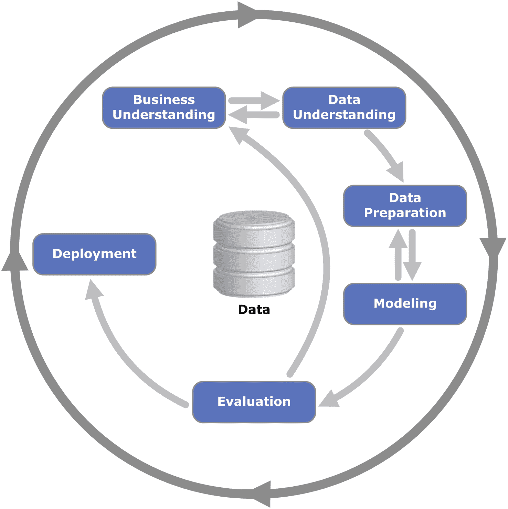

# 4.数据分析

分析原始数据以获得洞察力已经被广泛使用，尤其是在网络泡沫时期。**数据分析**是分析数据以获得决策所需洞察力的过程。通过数据挖掘，可以对原始数据进行提炼，得到有用的信息。虽然这个概念在前面的章节中有所涉及，但是没有讨论具体的数据分析方法。

本章将探讨数据挖掘在数据分析和数据科学中的应用。**数据挖掘**是在大型数据集中提取和发现模式的过程，涉及机器学习、统计学和数据库系统的交叉方法。一个被称为 CRISP-DM 的标准框架已经存在了几十年，并且在处理数据挖掘的重要方面非常有效。我们将详细研究这个框架。

对于审计人员来说，在请求审计数据和进行测试时，理解数据挖掘的过程是很重要的。在审计中应用数据科学和机器学习技术时，使用跨行业数据挖掘标准流程(CRISP-DM)尤为重要。在将数据部署到分析中之前，需要对其进行检索、处理和评估。最后，数据故事传达了关于数据的结论。

然后，我们将从审计的角度看一些常用的数据分析应用程序。详细探讨的四种主要类型的数据分析应用程序是描述性、诊断性、预测性和规范性分析。最后，我们将介绍数据科学的概念以及它与数据分析的不同之处。

数据科学和数据分析的主要区别是讲故事。在数据科学中，故事用于关注洞察力，并且可以向用户建议适当的行动来优化决策。

## CRISP-DM

CRISP-DM 代表数据挖掘的跨行业标准过程，它是一个开放的标准过程模型。它于 1996 年引入，为数据挖掘项目提供了一套标准的指导原则。在高层次上，CRISP-DM 由六个主要组件组成，它们是业务理解、数据理解、数据准备、建模、评估和部署。

图 [4-1](#Fig1) 中的图表显示了 CRISP-DM 框架。Kenneth Jensen 的 CRISP-DM 流程图(自己的作品)。

图 4-1

CRISP-DM 框架(CC BY-SA 3.0[[http://creative Commons . org/licenses/BY-SA/3 . 0](http://creativecommons.org/licenses/by-sa/3.0))，通过维基共享

*   **商业理解。**业务理解组件是数据挖掘项目的第一步，它包括发展对业务模型的理解。理解数据挖掘项目的目标很重要。该组件还阐明了上下文以及需要通过数据解决的业务问题。例如，业务问题可以是“上个季度我们销售了多少单位的产品？”数据挖掘项目的目标可能是“找到帮助增加销售的方法”或“确保生产产品的原材料库存充足”理解业务目标是至关重要的，因为它对随后的组件有整体影响。

*   **数据理解。**数据理解组件通过检查数据的完整性和准确性来帮助理解数据本身。它还用于探索现有数据的潜在应用。产品的单位数量可以通过各种方式获得，包括从发票数据、从库存数据或从一个单位的总销售额和销售价格获得。根据项目的目标，与其他方式相比，以特定的方式获得它可能更好。通过理解数据，关于业务的附加信息可能会浮出水面，并用于支持项目。

*   **数据准备。**数据准备步骤是数据提取、转换和加载(ETL)的地方。作为数据转换的一部分，它可能会被清理以用于下一个建模步骤。对于数据挖掘项目来说，这一步可能会占用大部分时间，通常会占用总工作量的 50%以上。数据清理将原始数据转换为算法可以使用的格式。

*   **建模/分析。**一旦数据采用了算法可以使用的格式，就可以进行建模或分析了。在这一步中，数据被建模以获得关于数据的见解。洞察用于预测或优化在业务理解部分构思的业务目标。

*   **评价。**作为该组件的一部分，对分析或建模数据的结果进行评估，以确保正确性。这可以通过将模拟结果与预期结果进行比较，并根据所使用的算法类型计算误差来实现。例如，如果模型用于预测销售趋势，可以将历史已知结果与预测结果进行比较，以检查解决方案的准确性。在此步骤之后，可能有必要更新业务理解目标，并重复之前的周期(如图 [4-1](#Fig1) 所示)，直到准确度得到提高。

*   **部署。**最后，部署优化的模型或分析以供最终用户使用。就仪表板而言，它与授权用户共享，因此他们可以在决策过程中利用洞察力。

这六个组成部分在本质上是迭代的，其中一些步骤可以根据项目的要求和数据的质量而重复。此外，迭代的本质提供了过程中的反馈机制，这改进了整个模型。

## 数据分析审计应用程序

所使用的分析技术的类型可以根据用户试图回答的问题而变化。大多数数据分析项目可以分为四个主要类别:

*   描述性分析。描述性分析描述过去发生的事情。它有助于解释当前状态。可以访问特定系统的用户列表就是一个例子。

*   **诊断分析。**诊断分析有助于我们理解我们所看到的数据背后的含义。它的重点更多的是回答“为什么”的问题。例如，某些用户拥有管理权限的原因可以用诊断分析来解释。这可能意味着支持在分析中显示用户的工作职能。与系统的普通用户相比，如果经理或技术负责人拥有管理特权，那就更有意义了。

*   **预测分析。**预测分析有助于解释给定当前信息的短期或长期预期。例如，它可以用于预测在一天的给定时间最有可能被观察到的用户数量。预测可以基于过去一年的历史系统使用情况。

*   **规定性分析。**在规定分析中，可以使用基于预测值的数据分析提出建议。例如，当系统预期被最少数量的用户使用时，可以推荐对系统的高风险修改。

审计师通常最常用描述性和诊断性分析来执行他们的分析和完成他们的数据验证。预测性和规范性分析是机器学习和人工智能通常被采用的地方，因为这涉及到基于历史数据的数据建模。

## 数据分析与数据科学

数据科学通常被视为数据分析的发展。然而，它们之间有一个主要的区别。除了涉及更多统计分析的数据科学之外，讲故事是关键的区别点。在数据科学中，数据经过分析后，以更好地与分析的最终用户联系起来的故事的形式进行共享。例如，假设您执行一项分析来查看高风险应用程序的系统使用情况。在数据分析中，输出通常是一个图表，也许是一个线图，显示一段时间内用户活动的趋势。

在数据科学中，我们会查看活动并从中获取故事，如以下示例所示:

*   夏季月份显示用户活动减少，因为许多员工在这几个月休假。

*   由于去年 7 月的一周维护问题，我们看到 7 月的用户活动急剧减少，因为用户无法登录系统。

*   大多数用户在正常工作时间登录。

数据科学侧重于获得可操作的见解，从而为企业创造价值。它们还可以用来帮助制定关键决策以实现业务目标。

## 结论

数据分析有助于我们通过可视化和分析来深入了解数据。最初用于以结构化方式挖掘数据的 CRISP-DM 框架可以用于数据分析。审计师广泛使用描述性和诊断性分析来帮助他们验证数据。分析的下一步是通过实施 AI/ML 审计应用程序来挖掘预测性和规范性分析机会。数据科学建立在数据分析的基础上，并使用数据分析的结果来讲述有影响力的故事。