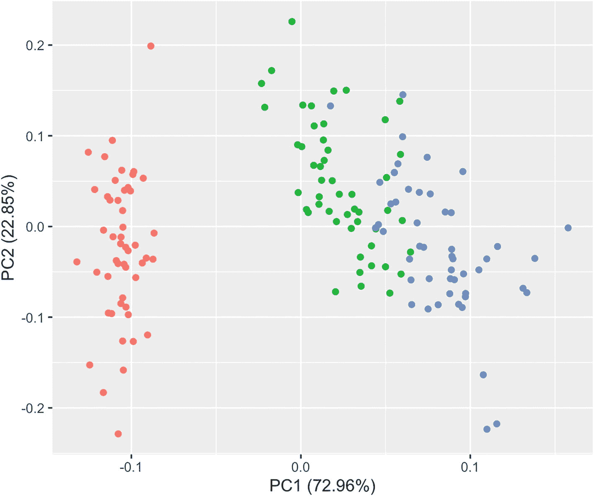
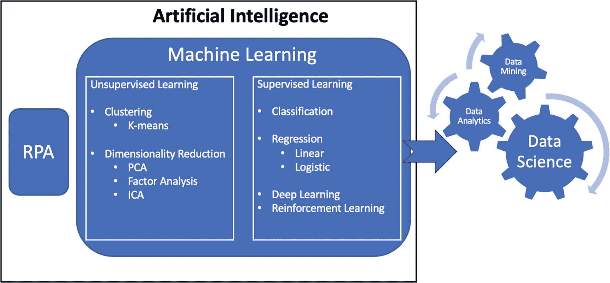
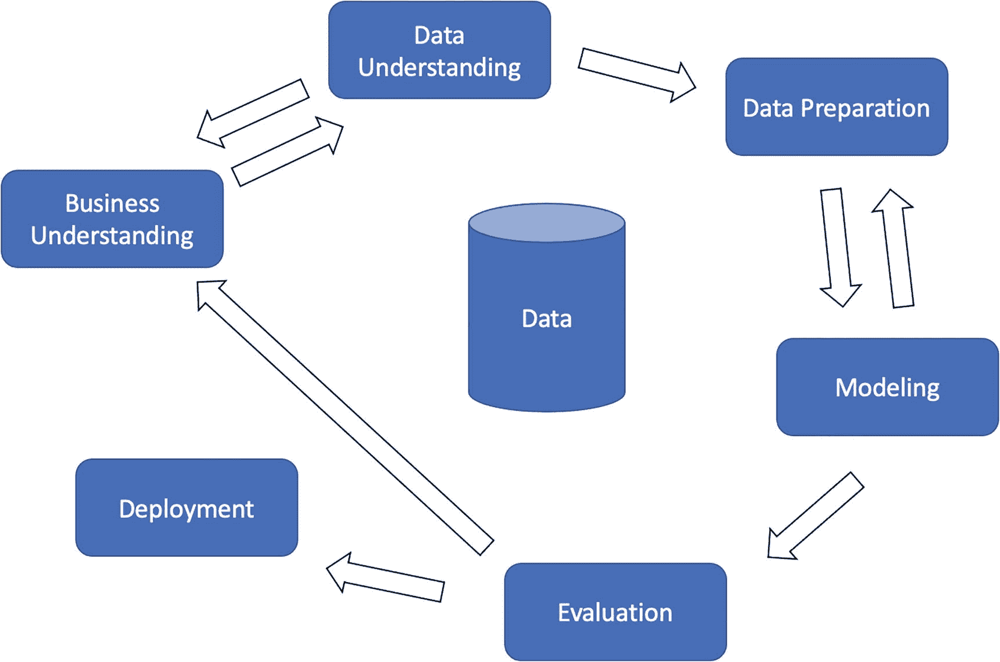
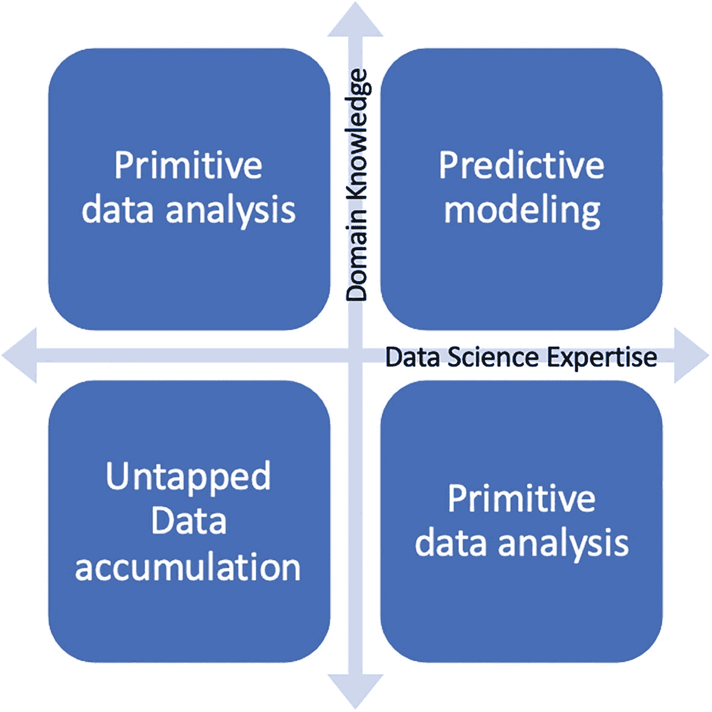
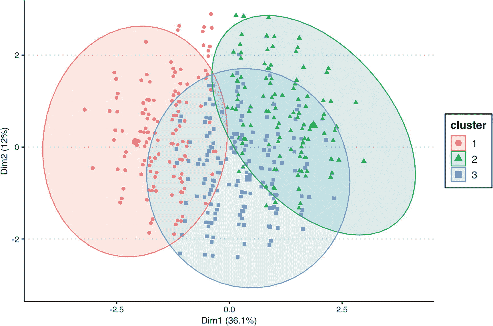

# 六、人工智能、数据科学和机器学习简介

本章将深入人工智能、机器学习和数据科学的世界。它将讨论这些组件之间的关系。当我们谈论 AI 时，它通常被定义为模仿人类智能的智能系统。系统有一定程度的自主行为，因为一旦系统被实现，它们往往不需要任何人工干预。人工智能系统可以*学习*基于历史行为执行特定动作的方法。机器学习算法帮助人工智能系统从过去的数据中学习，这些数据是使用数据采集系统或连接到人工智能系统的传感器收集的。

## 无人驾驶汽车

以自动驾驶车辆为例。自动驾驶系统架构可以由基础设施、车辆传感器/摄像头、车辆电机、中央控制单元、卫星通信和云后端组成。

智能系统所需的路标、标记和其他专用道路由基础设施覆盖。这些可能需要进行一定程度的修改，以便传感器或摄像机在特定环境或路况下有效地捕捉路况。在阳光不足的环境下，相机可能无法捕捉到重要的图像。图像捕捉可用于读取交通信号灯、行人标志、道路标记，以在道路上对准汽车等。可能需要将交通灯与自动驾驶汽车集成，以便改善汽车做出的决策。驾驶辅助功能，如保持距离和车道助理，以防止汽车意外偏离车道，使用激光指导其行动。在下雨、下雪或有雾的情况下，这些激光器可能无法按预期工作。廉价的射频识别(RFID)标签可以嵌入道路中，以帮助支持激光，并可以提供更准确的道路状态。

汽车中可能需要配备专门的传感器、摄像头和电机，以从环境中收集数据，并根据收集的实时数据做出决策。读取路标的激光传感器、读取交通灯的摄像机以及控制方向盘的汽车电机都是这种设备的一些应用实例。需要注意的重要一点是，即使数据是为特定目的收集的，也可能需要与其他传感器集成，以构建稳定安全的系统。例如，如果道路标志由于道路上的积雪而被阻挡，车辆的智能系统可能需要依靠摄像头来确保它没有偏离车道。此外，实时数据面临许多挑战。实时传感器的一个主要挑战是，由于传感器问题或其他意外的数据捕获问题，它经常会丢失值。智能系统在做出决策时必须考虑到这一点。方向盘电机可能需要定期校准，以确保最佳使用。如果摄像机、传感器或电机没有按预期运行，车辆用户需要以安全可靠的方式通知它们。

中央控制单元是自动驾驶汽车的主要决策系统。该单元处理通过传感器和摄像机捕获的数据，以做出数据驱动的决策。它们还根据控制导航系统、刹车、加速等的决定来帮助控制马达。该单元可以使用机器学习算法来从环境中学习并代表驾驶员做出有效的决策。中央控制单元可以使用计算机视觉机器学习应用来识别障碍物、包括人在内的物体和其他车辆。它还可以使用机器学习来基于环境调整速度，例如基于道路上的物体或道路的倾斜度。

中央控制单元的另一项重要工作是尽可能高效地采集和存储数据，以便根据收集到的数据做出适当的决策。这可能包括收集数据并将数据发送到云基础架构以分析数据。在某些情况下，需要额外处理能力的机器学习任务可能会被发送到云，以使用更快的处理器来处理较低优先级的功能。

云后端服务器主要用作使用车辆智能系统收集的数据的存储机制。收集的数据可能对以后的分析有用。云服务器也可以用作需要额外处理能力的任务的处理系统。

车辆可以依靠卫星来利用使用全球定位系统(GPS)的地图。地图路线、速度限制和导航系统可以与车辆智能系统集成，以便在决策过程中辅助它。当摄像机在恶劣天气条件下无法读取路标时，地区交通管理局(RTA)张贴的速度限制可以作为额外的交叉检查工具。

在应用机器学习算法之前，数据科学可以用于车辆智能系统。例如，可以进行主成分分析和数据清理(或数据整理),以便将数据放入每行捕捉一个观察值的表中，并简化正在捕捉的数据。这对于机器学习算法能够在数据集上工作非常重要。数据管理涉及原始数据的清理和数据转换的应用，因此只提取所需的数据进行处理。

图 [6-1](#Fig1) 显示了可用于车辆智能系统的主成分分析(PCA)示例。PCA 是一种降维算法，它将一大组特征转换成仍然包含大部分信息的较小特征。



图 6-1

示例主成分分析

## 人工智能系统的组成部分

人工智能系统由两部分组成，即机器学习(ML)和机器人过程自动化。ML 包含两种不同的技术，即无监督学习和监督学习。无指导的学习发生在没有指导的情况下。监督学习使用标记数据从数据中学习。无监督学习主要由聚类 ML 技术组成。监督学习涉及分类、回归、深度学习等 ML 算法。机器人过程自动化通常由专门的工具或脚本语言来实现。

数据科学通过科学方法、系统和算法来获得洞察力。数据科学可以单独使用，也可以与 ML 技术结合使用。数据科学可以进一步分为数据分析和最低级别的数据挖掘。下面将进一步检查这些组件，以了解它们的功能。

图 [6-2](#Fig2) 中描绘的图表显示了人工智能、ML 和数据科学之间的关系。它还显示了 ML 和数据科学的其他较小组件，如深度学习、数据分析和数据挖掘。人工智能的另一个组成部分，机器人过程自动化，也在图中显示。



图 6-2

人工智能的组件

*   **人工智能。**模仿人类智能的自主机器被广义定义为人工智能。自动驾驶汽车系统是人工智能的一个应用实例。自动发票处理器是人工智能的另一个用例。

*   **机器学习。**机器学习通过使用历史数据来做出决策或优化流程，从而支持 AI 智能系统。这些学习分为监督学习和非监督学习，这将在下面更深入地探讨。

*   机器人过程自动化。这是人工智能中广泛定义的另一种方法。它是利用专门的工具和脚本来自动化手动任务。例如，可以监控应付账款邮箱中的发票。每当收到带有发票的电子邮件时，它可以读取发票并填充系统表。这些信息将由应付账款工作人员在付款前进行审查。发货人可能需要以预定的格式发送发票，以便正确地进行翻译。

*   **无监督学习。**一类处理无标签数据的机器学习技术。无监督学习用于从数据中获得隐藏的洞察力。聚类和降维是两种最常见的无监督学习。在聚类中，数据点根据其要素之间的距离进行聚类。目标营销的客户细分就是聚类的一个例子。降维可能涉及主成分分析(PCA)、单个成分分析或因子分析技术。这些技术主要用于减少维度的数量，并专注于最重要的维度。异常检测是审计领域中无监督学习的一个重要用例。这个后面会详细讨论。

*   **监督学习。**在监督学习技术中，机器学习算法使用需要预测的因变量来进行预测。如果因变量或目标变量是分类变量(是/否，男性/女性等)。)，可以使用分类算法。根据身高和体重预测性别是分类算法的一个示例用例。如果要预测的变量是根据输入变化的量化值，将使用回归算法。基于历史股票价格预测股票价格是回归技术的一个应用实例。深度学习是基于具有表示学习的人工神经网络的更广泛的机器学习算法家族的子集。深度学习可以是有监督的，半监督的，或者无监督的。

*   **数据科学。**数据科学是从数据中获取洞察力的方法、系统和算法的应用。这是数据分析的发展。它包括统计方法和分享有数据支持的有影响力的故事。例如，假设网络上的某个工作站经常成为黑客的攻击目标，因为它已经有一段时间没有打补丁了。我们可以推导出它未来再次被攻击的概率。比方说，如果网络上 80%的攻击都是针对该工作站的，那么可以实现更严格的限制来减轻未来的风险，或者可以简单地用最新的更新来修补工作站。我们还可以回答诸如“投资升级我的工作站是否值得？”以及“根据目前的趋势，攻击会继续增加吗？”

*   **数据分析。**数据分析由用于清理、转换和分析数据的技术组成。它可以用于支持在开始数据分析之前已经预先确定的特定业务目标。它可以帮助回答诸如“有多少个工作站被打了补丁？”以及“我如何投资今年的预算？”

*   **数据挖掘。**在数据分析/数据分析的核心，需要从数据源中提取数据。它们需要被检索和处理，以便能够执行数据分析技术。数据挖掘是根据正在执行的分析帮助提取数据的过程。例如，对于费用管理分析，我们需要连接到费用管理系统(可能嵌入在 ERP 中)来检索正在分析的时间段内的所有费用。一旦检索到数据，就可以将其加载到数据仓库中，并连接到数据分析工具。然后可以使用数据分析工具分析费用。

## 面向数据科学的 CRISP-DM

CRISP-DM 代表数据挖掘的跨行业标准过程。我们在前面的章节中介绍了它作为一个通用框架，可以作为数据挖掘项目的指南。在本节中，我们将了解 CRISP-DM 如何应用于数据科学。CRISP-DM 强调相关步骤的迭代流程，这确保了它是数据科学相关项目的合适候选。与数据分析相比，数据科学本质上是高度迭代的。例如，探索性数据分析和模型评估等数据科学阶段通常会导致前一个阶段，而不是线性地导致下一个阶段。许多数据科学团队已经成功地将 CRISP-DM 框架与敏捷方法结合起来开发有效的数据科学项目。

图 [6-3](#Fig3) 中的图表显示了用于数据科学项目的 CRISP-DM 框架。



图 6-3

CRISP-DM 数据科学框架

*   **商业理解。**这一步有助于明确业务目标和理解数据科学项目试图解决的业务问题。这个概念非常类似于常规 CRISP-DM 框架应用程序中使用的概念。

*   **数据理解。**必须检索和分析数据，看它是否能帮助解决手头的业务问题。在这一步中，数据科学团队收集数据并对其进行探测，以更清楚地了解问题。执行探索性数据分析(EDA)是为了更深入地了解问题中的流程。随着支持数据的形成，可能需要在前面的步骤中重新考虑业务问题。假设最初的业务问题是在供应商支付流程中寻找欺诈的高风险领域。我们需要首先根据收集的数据定义*高风险区域*的含义。现在假设我们已经检索了包含付款金额和付款日期的数据。基于这些特征的一个高风险区域是，如果支付金额高，并且支付日期不在正常支付期结束时。在我们研究了所有提供的付款的付款金额和付款期后，我们可能会发现许多付款都符合这一标准。在这种情况下，我们可以回到 CRISP-DM 的业务理解步骤，重新定义业务目标。我们不用说*高风险区域*，我们可以根据可用的特征来定义什么是高风险区域。数据质量也在这一步进行检查。将检查收集的数据中是否存在空要素以及需要进行数据转换的要素，以便对项目有用。

*   **数据准备。**在这一步中，数据科学项目团队根据上一步获得的数据质量和见解进行*数据辩论*。可能需要对数据进行筛选，仅筛选出所需的功能，并且可能涉及识别和删除冗余列或降低功能的复杂性。例如，带有时间戳的日期可能是不必要的。相反，只显示日期的短日期格式对于手头的工作可能就足够了。新字段可能需要从现有字段派生。假设我们需要将 0–10 的分数转换为红色、琥珀色和绿色(RAG)分数，以便于解释。我们可以定义 0-3 为*红色*，4-6 为*琥珀色*，7-10 为*绿色*。为了便于分析，我们可能需要合并多个表中的列。例如，如果在表 A 中只定义了雇员 ID，而表 B 包含雇员的名字和姓氏，那么我们需要将表 A 与表 B 连接起来，以创建一个包含雇员 ID 以及相应的名字和姓氏的合并表 C。

*   **造型。**这一步包括基于适用的建模技术建立和评估模型。要使用的算法类型，如 k 均值、线性或逻辑回归、人工神经网络等。将根据所执行的分析类型进行选择。例如，以使用 k-means 算法的聚类为例。在这一步中，算法的参数可能需要优化。K-means 需要一个 k 值，通常在 1 到 10 之间。有多种方法可以得出要使用的最佳 k 值。对于受监督的机器学习算法，需要对输入数据集进行分割。在这种情况下，数据集将分为定型集、测试集和验证集。训练集将用于训练模型。测试集用于概化，因为模型(算法)以前从未见过数据集。验证集用于通过调整训练模型来挤出额外的性能。

*   **评价。**在这一步中，将对上一步中数据科学项目的到达模型进行评估，以确保它满足开始时设定的业务目标。对支持结果进行分析，以确保它们支持选择最终模型的适当理由，并在汇总报告中捕获这些结果。在这一步，我们可以选择通过迭代其他参数来进一步优化模型。当没有更多的优化要做时，我们可以继续部署模型。测试数据集可用于评估模型在*真实世界*环境中的性能。

*   **部署。**在此步骤中，部署优化的模型，以便在数据科学项目中使用。部署后，我们可能会发现所提供的数据集中可能不存在的功能的其他详细信息。在这种情况下，我们将从步骤 2(数据理解)开始迭代框架，以确保捕获新的细节，并重新执行其他步骤，以确保它们考虑新的数据。对于正在进行的项目的部署后，需要持续检查模型的性能，以确保其随时间的可变性被捕获和考虑。在某些情况下，如果数据结构随着时间的推移而改变，则需要重新训练新的模型，以确保其准确性。

## 领域知识

在前面的部分中，CRISP-DM 框架的建模步骤需要领域专家的输入，以使模型有效。该模型必须涵盖领域专家可能知道但可能没有准确反映在数据中的边缘情况。边缘情况是仅在极端操作参数下发生的问题或情况，例如，最大值或最小值。领域专家是在某个领域接受过培训的人。收集的知识可以来自正式的教育培训、多年的工作经验和/或特定于公司的信息。

对于一个有效的人工智能系统，该系统需要考虑正在讨论的过程的功能知识。例如，假设我们设计了一个人工智能系统来对化肥厂的设备进行预测性维护。可以收集来自设备的数据，包括机器运行时间、离线时间和涡轮机速度。还可以捕获关于设备的数据，例如机器的购买时间、保修信息和维护信息。但是常见的陷阱、可能的原因和影响以及特定于某个位置的黑天鹅事件可能很难在数据中看到。

例如，机器可以季节性地使用，这可以从机器收集的数据中得到证实。但是为什么它被季节性地利用，只有领域专家才知道。这些机器可以季节性地使用，因为它可能取决于公司客户农民的需求。在收获前的某个特定时间(比如说六个月)，对肥料的需求可能会上升。如果农民期待几十年未见的理想天气，他们可能会种植更多的作物，从而推高需求。在这种情况下，化肥厂的设备可能需要比过去更频繁地使用，这可能意味着更频繁的维护工作。如果化肥公司能够预测到这一点，他们可能能够最大限度地减少设备停机时间，并最大限度地提高收入。数据科学家必须学会与非技术受众(领域专家)有效沟通，以帮助他们实现最重要的业务目标。另一方面，领域专家需要能够利用数据科学家的技术专长来帮助他们回答将为组织带来最大价值的业务问题。

图 [6-4](#Fig4) 中的图表显示了不同的象限及其属性，这些象限基于可用于项目工作的技术专业知识和领域专业知识的水平。数据科学和领域知识越少，数据分析就越原始(由图中的原始数据分析象限表示)。如果利用了数据科学专业知识和领域知识，就会产生更多的预测分析(预测建模象限)。最后，如果没有使用领域知识和数据科学专业知识，数据就没有价值(未开发的数据积累象限)。



图 6-4

领域知识与数据科学专业知识

## 支付欺诈/异常检测

在本节中，我们将讨论一个将无监督机器学习(特别是 k-means 聚类)应用于异常检测领域的示例用例。当应用于支付分析领域时，异常检测系统可以是有效的支付欺诈预防系统。欺诈被定义为旨在获取金钱或个人利益的不法或犯罪欺骗行为。使用基本的过滤技术和搜索标准很难发现支付欺诈。由于欺诈者知道这些过滤技术，他们试图找到更复杂的方法来实现欺诈。

根据 *2018 年全球职业欺诈和滥用研究-注册欺诈审查员协会(ACFE)向各国提交的报告*:

*   欺诈导致全球总损失超过 70 亿美元。

*   财务报表欺诈计划最不常见，成本也最高，占分析案例总数的 10%。

*   数据监控/分析与欺诈损失和持续时间的最大减少相关，损失降低了 52%，检测速度提高了 58%。然而，只有 37%的受害者组织实现了这些控制措施。

这些令人惊讶的统计数据是应用机器学习来检测欺诈性支付的良好理由。

诸如发票日期、发票号、供应商号、支付日期和支付金额等容易获得的供应商支付数据可以用作设计异常检测系统的数据。从该公司的数据库中提取这些细节后，需要对它们进行转换，以便在每行捕获一笔付款及其相应的功能。这对机器学习算法至关重要，这样它们就可以处理信息。

该功能(发票日期，发票号等。)以确保捕捉到代表每个细节的数字。例如，要将发票日期和付款日期转换成一个特征，我们可以找到付款日期和发票日期之间的差异。由于付款总是发生在公司收到发票之后，我们将得到一个正值来表示公司向供应商付款的天数。供应商编号可以按原样使用，也可以用于根据其他供应商信息(如位置、公司规模或采购订单金额)分配分数。例如，如果项目依赖于这些类型的供应商开展业务，规模较小的供应商可能面临更高的停业风险，并延迟组织的项目。

重要的是，进入 ML 算法的输入文件每行捕获一个供应商以及相应的特性。如果同一供应商的多行包含其他特征值，算法将无法概化数据集。在提取特征并且输入文件中的每一行都包含关于一个供应商的信息之后，我们可以继续下一步，创建机器学习模型。对于我们检测异常支付的目标，我们希望对看起来相似的支付进行聚类，以便算法可以轻松识别与现有支付行为不相似的支付，然后进行调查。

集群将使我们能够做到这一点。我们可以使用流行的数据科学编程语言(如 R 和 Python)提供的库来使用 k-means 集群。例如，在 Python 中，下面的两行代码片段是我们使用 scikit-learn 库创建和训练 k-means 聚类对象所需的全部内容。第一行创建模型，第二行通过在“X”上训练来拟合模型:

```py
kmeans = KMeans(n_clusters=2)
kmeans.fit(X)

```

前面的代码创建了两个集群。我们可以定义尽可能多的分类，但是有一些方法可以确定最佳的分类数量。例如，我们可以使用*肘方法*来计算多达十个聚类的聚类分数，以找到提供最佳聚类分数的最优数量的聚类。在应用 k-means 聚类后，我们希望通过颜色编码和/或不同的标记清楚地看到每个聚类下的支付。区分聚类可能并不总是很清楚。如果聚类如预期的那样工作，我们将能够将每笔付款准确地归属于一个聚类。在此之后，我们可以寻找异常值或远离聚类的点，并进一步分析这些支付。

图 [6-5](#Fig5) 中的图表显示了应用 k 均值聚类并将每个观察值分配给一个聚类后的示例图。每个聚类都用圆圈突出显示，并且可以通过数据点的形状来区分。图中总共有三个集群:



图 6-5

k 均值聚类示例

对于任何机器学习应用程序，重要的是要注意，尽管一些模型可以提供高水平的准确度和精确度，但仍有可能发现假阳性。假阳性是那些预测是正确的，但实际上是错误的。因此，确保使用适当的渠道调查结果或例外情况，以确认结果是否确实是结果，这一点始终至关重要。这可能是与最熟悉流程的业务负责人的一个简单接触点。例如，对于我们的支付异常检测系统，我们可以与会计团队确认调查结果，以确保正确识别潜在的欺诈性支付。如果会计团队审查支付并发现这些不是欺诈性支付，则可以调整机器学习模型，以确保未来不会识别出这种特定的误报情况。值得注意的是，机器学习模型开发过程的优化是一个高度迭代的过程。

## 结论

人工智能和数据科学是相互关联的，但在人工智能系统中有不同的功能。人工智能是自主行为的智能系统的首要领域。数据科学提供了分析数据的系统、流程和方法，通常与 ML 算法结合使用，以获得洞察力。就整个数据科学开发过程而言，领域知识与技术知识一样重要。