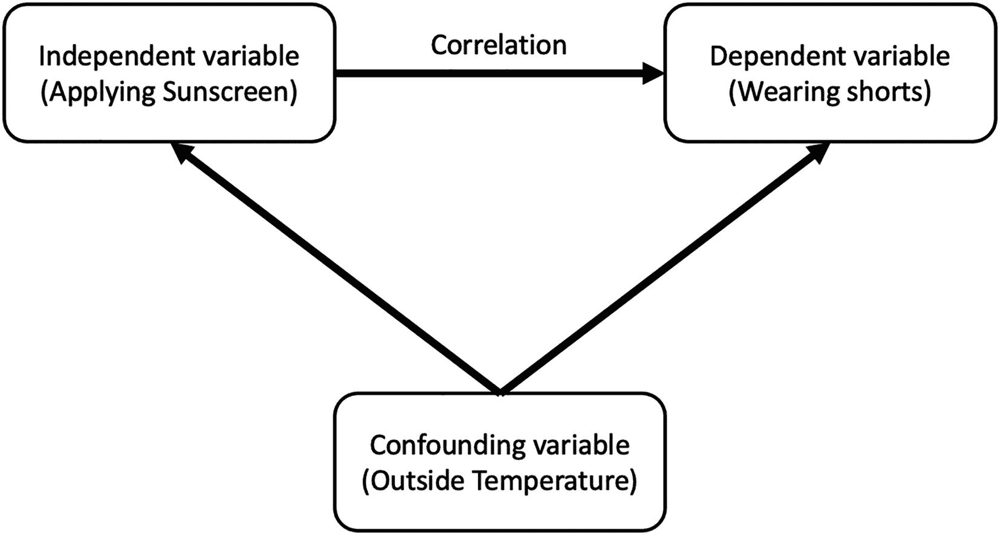

# 7.神话和误解

本章将讨论一些最重要的神话和误解。本章旨在打破在我们日常工作环境中实际应用数据科学技术的障碍。不幸的是，在某些情况下，人工智能、机器学习和数据科学等术语已经成为家喻户晓的名字和流行语，更多地被用作对话的开场白。

一方面，有些人对这个问题缺乏认识。另一方面，一些人很快就放弃了人工智能领域是一个新的时尚，它将像它来时一样迅速消失。正如许多成功的公司所证明的那样，人工智能已经存在，并且是一个快速发展的行业。数十亿美元正被投入到积极创造这一领域。随着未来十年无数实际的人工智能应用被发现，这一趋势肯定会继续下去。如果利用得当，人工智能在风险管理和审计领域的潜在应用是巨大的。正如几乎所有领域的情况一样，风险管理和审计带来了独特的挑战。我们在前面的章节中讨论了这些挑战。

除了领域挑战之外，还有与引起对主题的认识相关的挑战。当建立一个商业案例来实现人工智能或机器学习解决方案时，解决一些常见的问题是必不可少的。如果处理不当，项目可能会很快停止。

在实现一个新的 AI/ML 学习系统时，讨论的神话和本章讨论的事实可以用来回答一些常见的问题，以建立一个更好的商业案例。

## 误解 1:成为数据科学家需要更高的学位

在实施数据科学项目时，经常被问到的一个问题是:我是否需要一名数据科学家，或者我是否可以培训团队中的某个人来执行数据科学任务？问题的答案取决于数据科学工作的范围和性质。

在审计领域，某些形式的数据分析工作可能已经得到了一些团队成员的支持。数据科学可以被视为数据分析工作的一种更高级的形式，由统计分析和讲故事来支持。如果团队中已经有数据分析专家，最好对现有的数据分析人员进行数据科学概念培训。数据分析人员从团队中获得的领域知识可以无缝地应用于数据科学项目。实用数据科学课程以各种形式提供，包括在线、混合、课堂和一对一。对这些课程的掌握对于“速赢”项目的实际应用可能是足够的。

在大多数情况下，不需要量子领域的博士学位。然而，一些项目可能需要很好地掌握特性工程、参数调整和其他涉及对数据科学更深入理解的高级概念。在这些情况下，先进的统计学或数学知识可能是有益的。

许多分析提供商一直在大力推动让所有人都更容易获得数据分析。作为数据民主化计划的一部分，许多分析工具将自己推销为无代码或低代码解决方案。它们还使得将数据科学嵌入现有工具和可视化变得更加容易。这种全面的推动违背了你需要一个更高的学位才能从数据中获得洞察力的事实。

## 神话 2:相关性意味着因果关系

如果两个变量之间存在相关性，并不一定意味着它们之间存在因果关系。例如，假设两个变量是不同教室的学生的身高和体重测量值。当我们看一个教室的尺寸时，我们可能会发现，一般来说，只要高度增加，重量就会增加。仅从这一发现，我们不能断定体重是由身高引起的。然而，我们可以说身高和体重之间有很高的相关性。在另一个班级，你可能会发现有很多高瘦的学生。因此，在这种情况下，趋势可能是随着身高的增加，体重可能会减少或保持不变。身高不会导致体重增加。吃食物导致体重增加。消耗更多的食物意味着体重会增加。

有必要注意相关性和因果性之间的区别。相关性是一种统计技术，有助于我们理解两个变量的相关程度和一起变化的程度。相关性只是意味着变量之间存在某种关系；不多也不少。另一方面，因果关系告诉我们，如果我们改变一个变量，它会导致另一个变量改变。一些变量可能看起来像一个自变量引起另一个因变量。然而，可能还有第三个变量影响着这两个变量，这可能是自变量和因变量背后的真正解释。第三个变量被称为混杂变量。例如，可以观察到，每当有人涂抹防晒霜时，他们可能会穿着短裤。涂抹防晒霜不会导致你穿短裤。是高温让你涂防晒霜穿短裤。在这种情况下，防晒霜是自变量，穿短裤是因变量。室外温度代表了混淆变量。

图 [7-1](#Fig1) 显示了自变量、因变量和混杂变量之间的关系。

图 7-1

变量之间的关系

## 误区 3:模型构建是最关键的一步

虽然建立模型是数据科学或机器学习项目的一部分，但这一步是**而不是**最重要的一步。人们非常重视构建模型并对其进行调整，以预测或从数据中获得隐藏的见解。这在一定程度上是正确的，但在数据科学项目涉及的所有步骤中，最重要的一步是清理数据并确保数据没有偏差。不准确的数据被输入到建模步骤意味着输出将是无用的——*垃圾输入，垃圾输出*。因此，最重要的事情是确保输入的数据没有任何形式的已知偏差，并且干净到易于被机器学习算法使用的程度。

在清理步骤(或数据准备)中花费机器学习或数据科学项目总时间的 50%到 80%以上并不罕见。模型构建是一个迭代过程，当查看最终模型所需的迭代总数时，可能会有点耗时。但是，与将数据从原始的未经处理的数据转换成可由模型构建步骤轻松使用的数据相比，模型构建仍然花费较少的时间。

## 结论

我们讨论了数据科学的三个常见误区。第一个误区是，每个从事数据科学的人都需要博士学位，或者应该是数学或统计方面的专家。第二个神话与因果有关。它提出了一个问题:两个变量之间的相关性是否意味着它们之间的因果关系？第三个误区是过分强调模型构建阶段。这些神话绝非详尽无遗，但在开始数据科学之旅时，理解它们是必不可少的。这些误解主要是由于对这个问题缺乏了解而产生的。