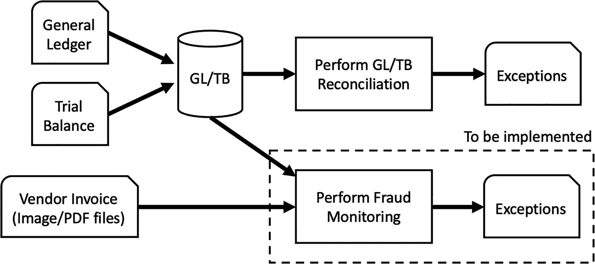

# 10.数据湖

本章重点介绍数据湖在塑造当前 IT 格局中的作用。数据湖在过去几年变得越来越流行，并被广泛用于实现有形的商业价值。本章教导读者如何利用数据湖的力量来推动他们的分析需求。它还研究了两种常见的数据湖体系结构，以及何时适合使用它们。

## 数据湖简介

数据仓库的一个主要问题是，驻留在数据仓库中的数据是为了特定目的而进行预处理和过滤的，并且可以比非结构化和半结构化数据更好地处理结构化数据。例如，假设金融交易将作为法规的一部分在系统中进行分析。作为要求的一部分，包含交易级别细节的总分类账数据可能需要与试算表进行对账，试算表包括当月的期初和期末余额。为了支持这一过程，总分类账和试算表数据将被加载到一个数据仓库中，以便分析师可以很容易地将总分类账和试算表数据结合起来，以获得报告所需的信息。仓库中的数据可能有助于其他用途，例如，内部审计员使用相同的数据来监控欺诈非常有帮助。

为了监控欺诈，内部审计员可能希望扫描他们的原始供应商发票(非结构化数据的图像),以便与已经在数据仓库中的总账数据相匹配。这将是本组织执行的一项重大任务。一旦设置了舞弊监控，可能会也可能不会给公司带来价值，因此投资回报率(ROI)并不明确。

图 [10-1](#Fig1) 显示了提议的欺诈监控系统的设置。

图 10-1

欺诈监控系统

上述设置可用于另一个目的，即使用原始供应商发票监控欺诈。如果公司希望找到一种方法来监控重复付款，作为其财务控制的一部分，该系统也可以利用总账数据。但这将是一项耗费金钱、人力和宝贵时间的事业。如果我们有一种方法可以无缝地将总账用于上述所有应用程序，同时能够结合从文本、图像文件或视频文件等非结构化数据中获得的见解，会怎么样？这就是数据湖帮助实现的目标。

一个**数据湖**是一个存储库，用于以其原始格式存储大量原始数据，直到需要为止。它可用于存储结构化、半结构化或非结构化数据。传统的数据仓库将数据存储在文件或文件夹中，而数据湖使用平面架构来存储数据。一组扩展元数据标签被标记到分配给数据湖中的数据元素的唯一标识符。像传统的数据仓库一样，可以通过查询数据湖来回答手边的业务问题。

数据湖旨在作为一个中央存储库，供不同类型的用户(如业务分析师、数据科学家、数据工程师、产品经理和决策者)共享组织数据。为了使数据湖有效，需要检查数据完整性，包括输入数据源的数据准确性和完整性。使用数据湖的一些好处包括持久性、可伸缩性、模式抽象和成本效益。

## 有形资产价值

一个概念的好坏取决于它的假设。虽然数据湖的整个前提是集中信息，能够利用信息，并与从组织的其他职能部门获得的见解相结合，但在大多数组织中可能并非如此。大多数组织的每个职能部门都有一个数据湖，如财务、交易、合规、安全等。这违背了这样一种假设，即功能之间的共同见解可以相互利用，而这正是数据湖的真正价值所在。如果每个功能都有多个数据湖，那么它们本质上就有数据仓库所具有的相同问题。数据湖的多个实例创建了它们自己的生态系统，在这些生态系统中，数据以孤岛的形式进行分析。数据孤岛充当数据仓库的口袋，为特定目的提供信息。这种设置剥夺了单一数据湖所提供的分析灵活性。

图 [10-2](#Fig2) 说明了拥有多个数据湖的问题——每个函数一个数据湖。

图 10-2

按业务功能划分的数据湖

## 分析推动者的角色

数据湖还支持另外一个微妙的功能，在简介部分已经提到。组织中的不同角色—数据分析师、数据工程师、数据科学家、职能分析师和管理团队—都可以从同一个数据湖中进行查询，以利用相同的底层数据得出不同的见解。这是可能的，因为数据湖中的原始数据可以通过一个为目的设置上下文的模式被“改造”到目的上。模式为数据及其相互关系提供了一种结构。

使用来自传统数据仓库的数据的一个主要挑战是，可能过度依赖其他专业分析团队根据他们在组织中的角色来获得洞察力。每个角色都有自己的访问权限，这可能会限制信息和见解的流动。这将重点放在特定的分析功能上，因此，基于可用资源的瓶颈开始出现。由于资源短缺，分析团队成为获取见解的瓶颈。

另一个主要挑战是平衡信息的治理和可访问性。我们可能会限制可能提供见解的有价值信息，因为它可能包含个人身份信息。需要促进实验文化，以便数据科学家可以连接到数据“玩”它，而不用考虑如何访问它或依赖其他人代表他们跟踪和提取数据。如果选择合适的体系结构来支持这一点，数据湖可以对此有所帮助。

## 体系结构

在实现数据湖时，有两种不同的体系结构。在第一种架构中，数据湖从数据仓库中获取数据，而在第二种架构中，数据湖从所有数据源中收集原始数据，并将其转发给数据仓库。

如果为组织提供集中的数据来支持他们的决策是主要的业务目标之一，那么第二种架构可能是合适的架构。如果数据治理是组织的关键优先事项之一，那么第一种架构可能是更好的选择。

图 [10-3](#Fig3) 展示了第一个数据湖架构。

图 10-3

数据湖架构#1(面向治理)

如图 [10-3](#Fig3) 所示，通过使用来自业务仓库的数据，可以在数据湖吸收受限信息之前控制限制访问敏感信息的附加控制。虽然这限制了对某些信息的访问，但它仍然可以作为一个有效的分析测试环境。

图 [10-4](#Fig4) 显示了第二个数据湖架构。

图 10-4

数据湖架构#2(面向分析)

在第二种架构中，如图 [10-3](#Fig3) 所示，通过将数据湖作为中央数据存储库，可以不受限制地访问数据。尽管在控制敏感信息的访问时，这可能是一场噩梦，但这种设置可以为分析师运行他们的实验提供可能的最佳设置，并有助于加快决策的速度。由于所有数据在数据湖中不受限制地组合在一起，因此当分析工具使用这些信息时，很难将它们分离出来。例如，我们是否想让每个人都可以接触到那些卷入公司事故的人的私人健康信息？

## 结论

数据湖可以存储结构化、非结构化和半结构化数据。数据湖的强大之处在于它能够集成来自各种数据源的多种类型的信息。在一个组织中，最好使用统一的数据湖，以便从中获得最佳价值。当涉及到在组织中实现分析时，数据湖起着关键作用。它作为一个沙盒环境或游戏场来尝试新的分析用例。有两种主要类型的数据湖架构:面向治理的和面向分析的。