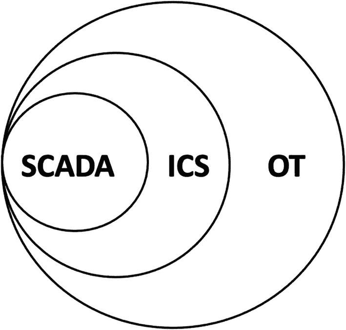
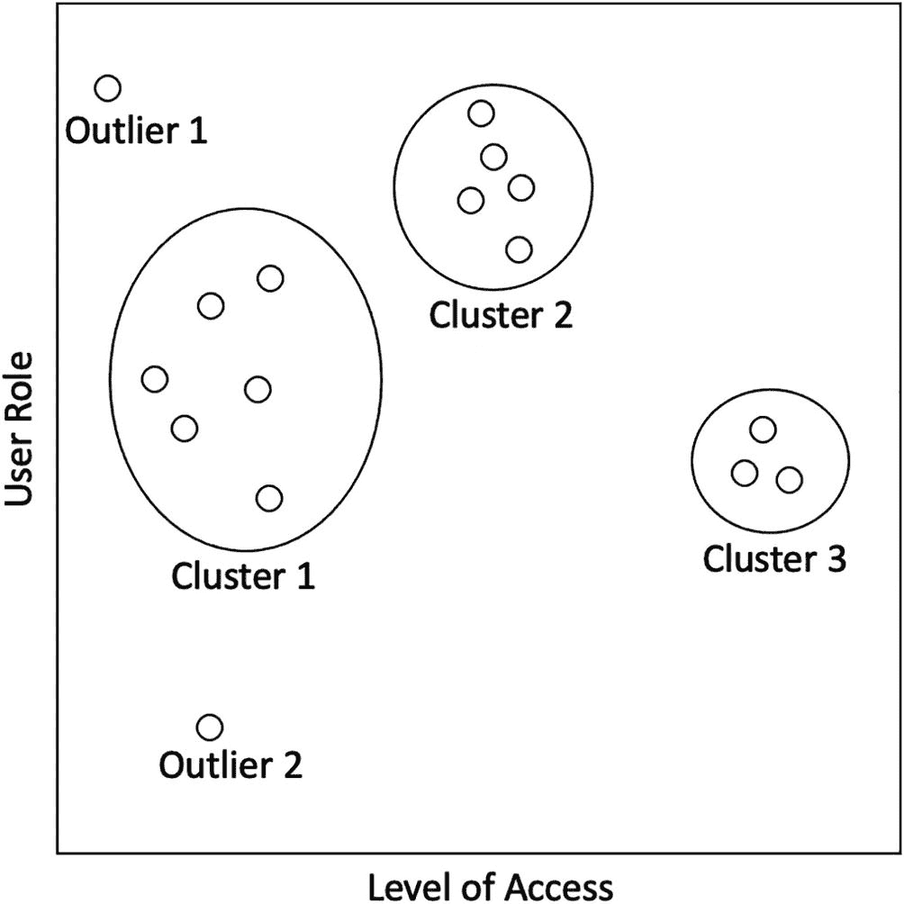

# 12.SCADA 和操作技术

运营技术是一个广义的术语，用来表示任何用于管理工业规模运营的设备。本章涵盖了第四次工业革命，以及它如何提供一种结合人工智能(AI)和物联网的方法来解决 SCADA 审计领域的问题。本章还涵盖了 SCADA 安全框架的六个主要领域。最后，人工智能如何应用于三个领域:数据和应用安全、系统保障和监控。

## 第四次工业革命

根据世界经济论坛创始人兼执行主席克劳斯·施瓦布的说法，第四次工业革命建立在第三次工业革命的基础上，利用信息技术和电子技术实现生产自动化。物联网(IoT)是一项正在改变生产、管理和治理格局的技术。第四次工业革命的其他技术包括人工智能、机器人和量子计算。

图 [12-1](#Fig1) 显示了 OT、ICS 和 SCADA 之间的关系。

图 12-1

OT、ICS 和 SCADA 之间的关系

OT/ICS/SCADA 系统已经使用了一段时间，可能会成为第三次工业革命的一部分。OT 代表操作技术，代表使用计算系统来管理一般的工业操作。ICS 代表工业控制系统。它是 OT 的一个子集，用于监测和控制工业过程，如石油和天然气工业的管道监测和控制。SCADA 代表监控和数据采集，通常提供图形用户界面(GUI)来观察和控制系统。SCADA 是 ICS 的一个子集。

物联网主要关注计算设备的使用，以支持系统到系统的通信和数据分析，从而提高特定任务的生产率。物联网设备作为自治系统运行，支持一些处理数据的智能流程。

SCADA 系统的审计提出了独特的挑战，如系统的可访问性和维护。大多数 SCADA 系统支持远程设备的数据控制和采集。IT 审计员通常会到这些地方去审计系统。由于预算和可用性的限制，某一年只能对一小部分站点进行审计。审计 SCADA 系统的另一个主要挑战是，由于网络安全原因，系统通常不连接到公司网络。SCADA 网络可能需要与公司网络隔离，以便对 SCADA 网络的攻击不会影响公司网络，反之亦然。由于系统与公司网络断开，SCADA 系统的操作系统和反病毒补丁可能很难克服。这些障碍会导致易受网络攻击的 SCADA 系统受损。本章建议使用人工智能和物联网来审计 SCADA 系统。

## SCADA 审计

根据 Samir Malaviya 为信息系统审计和控制协会(ISACA)杂志发表的题为“SCADA 网络安全框架”的文章，SCADA 安全框架包括六个方面。

这六个领域是

*   **治理、风险和合规性管理控制**—这些控制与政策、标准、规则和异常管理有关。这些控制措施源自治理、风险和法规遵从性(GRC)框架，本质上是非技术性的。

*   **SCADA 控制**–SCADA 提出了自己独特的挑战，如之前讨论的可访问性和补丁管理问题。他们还需要保持网络隔离。这些要求作为 SCADA 控制的一部分被捕获。

*   **数据和应用安全**–第三方供应商经常开发 SCADA 软件。SCADA 软件开发生命周期必须标准化，以符合软件开发指南。来自 SCADA 系统的数据应随时可用、准确且保密。数据安全有助于降低与 SCADA 数据相关的风险。

*   **系统保证**–SCADA 系统作为一个整体可能需要可用。需要制定业务连续性计划(BCP)和灾难恢复计划(DRP ),以确保在出现意外中断时业务能够继续运营。

*   **监控控制**–SCADA 事件需要以高效和标准化的方式处理。此外，需要持续监控 SCADA 系统的威胁，以确保跟踪可疑活动。

*   **第三方控制**–这些控制属于用于管理有权访问 SCADA 系统的供应商的控制。可能需要实施额外的控制，以确保供应商不会有意或无意地滥用他们对系统的管理权限。不良的第三方控制可能导致未经授权的数据访问或数据不可用。

下一节将详细介绍如何将人工智能应用于数据和应用程序安全、系统保障和监控控制。

## 人工智能在 SCADA 审计中的应用

预测性维护是一个开始在运营管理领域受到关注的概念。预测性维护使我们能够借助从机器收集的数据监控系统状态，提前预测系统故障，从而避免计划外停机。ML 可用于预测性维护，以防止这些系统故障。预测性维护中的 ML 可以优化和提高系统故障的预测能力，使得被标记的系统可以在需要被完全关闭以进行维护之前被修复。例如，可以收集来自远程现场位置的气体压缩机的数据，并且可以在数据中捕获随时间失效的压缩机以及从压缩机的测量系统检索的运行数据。使用机器学习，系统可以预测哪一系列事件或特征导致压缩机故障。识别出的系统可以在预期的故障时间表之前得到维修，以避免以后昂贵的维修或停机。

前面的概念可以类似地用于识别 SCADA 工作站，该进行操作系统和防病毒升级了。通过持续监控需要维修的工作站(在机器学习的帮助下)，当工作站在该区域时，可以通知现场操作员工作站何时可以维修。然后，现场操作员可以执行必要的修补和更新。

可以开发机器学习模型来利用从工作站收集的数据检测异常。例如，通常与 SCADA 网络连接的其他机器可以通过机器学习模型来学习。当一个身份不明的设备连接到网络时，网络安全或 IT 团队会收到通知，以便采取进一步的行动。机器学习模型可以驻留在 SCADA 网络上，并监控连接到网络的 SCADA 工作站。重要的是，ML 模型驻留在相同的 SCADA 网络上，以防止公司网络上的安全漏洞。与 SCADA 网络相比，由于其互联网连接性，企业网络更容易受到网络攻击。SCADA 网络通常不连接到互联网。

SCADA 审计领域中异常检测的另一个用例是识别异常值，以审查用户访问管理。可以创建一个矩阵来绘制用户角色集群以及他们拥有的访问权限。然后可以识别异常用户，并对其进行跟踪，以确保这些用户是授权用户。当验证 SCADA 网络上的用户访问时，这可以节省 IT 审计员的大量时间和精力。它可以自动化，以便 It 或网络安全团队不断审查标记的用户。

图 [12-2](#Fig2) 显示了一个使用集群的用户访问管理审查的例子。

图 12-2

用于用户访问管理的异常检测

具有相似访问级别的用户角色形成了可识别的集群组。异常值 1 和异常值 2 是数据中出现异常的角色，需要仔细查看它们的设置。

## 结论

第四次工业革命为 SCADA 等操作技术带来了新的机遇。人工智能在 SCADA 中的应用可以为 SCADA 审计提供许多用例。ML 应用程序用例的两个主要类型是针对用户访问管理的预测性维护和异常检测。