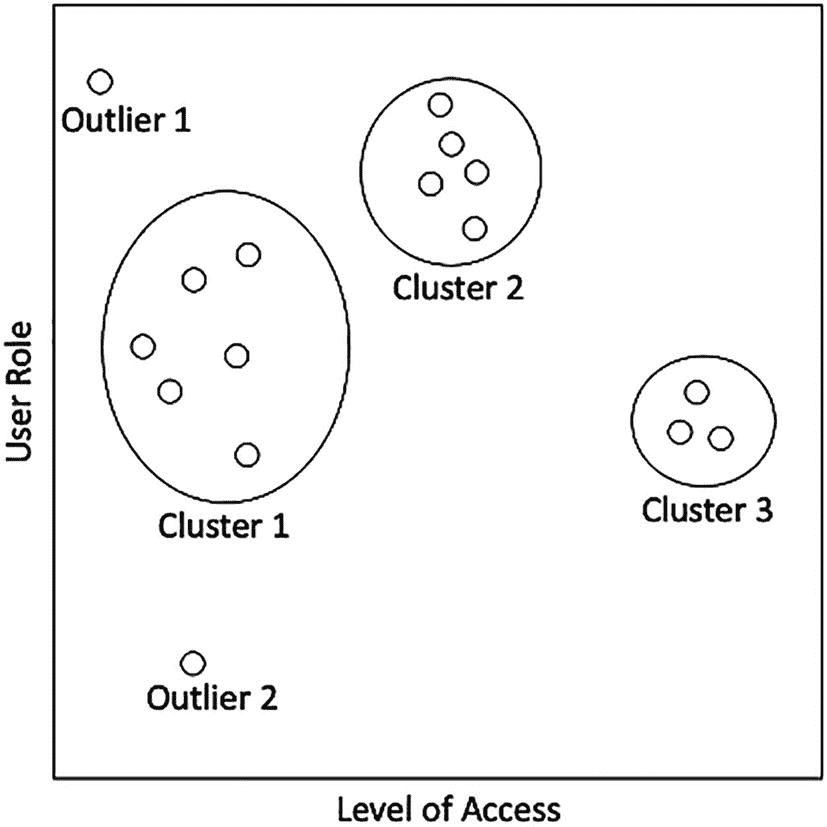
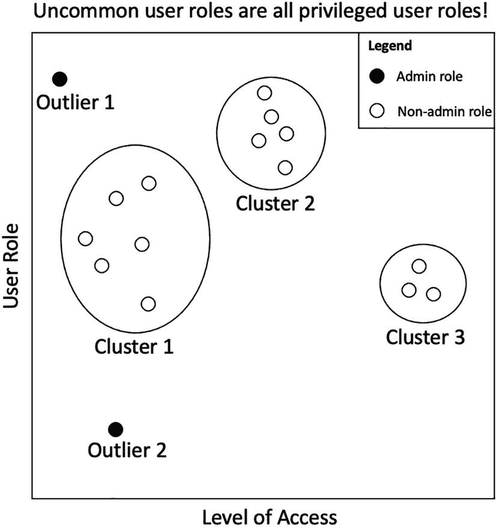
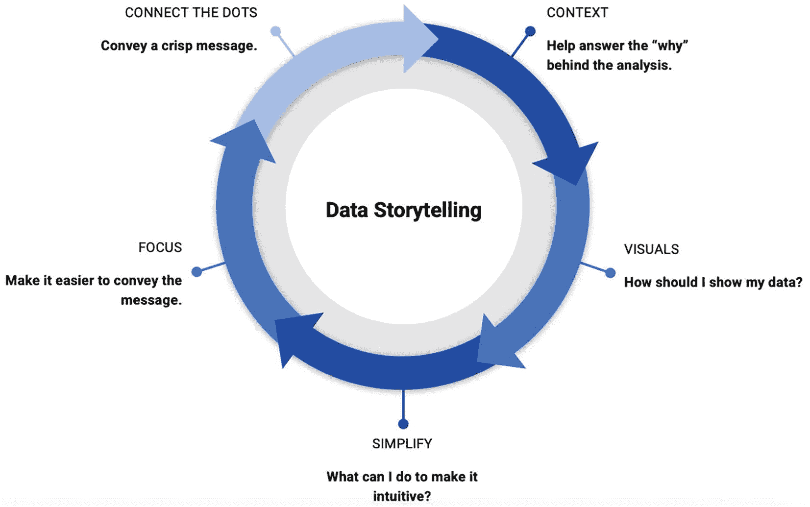
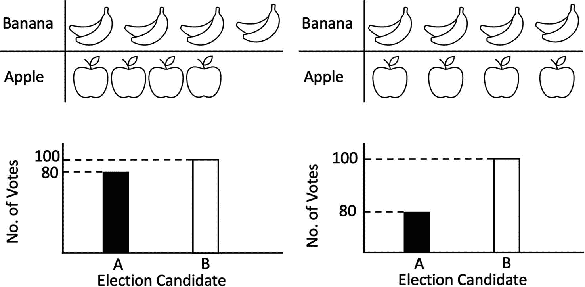
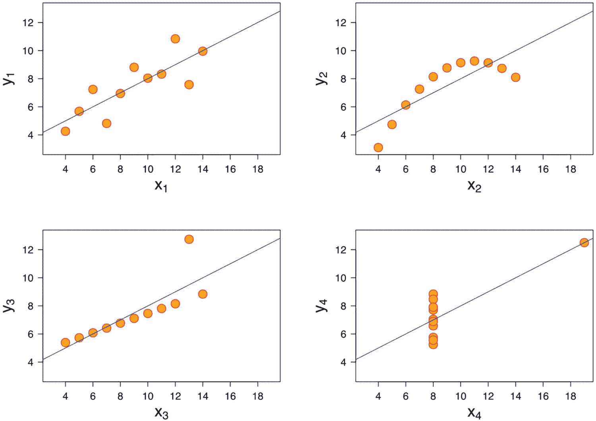
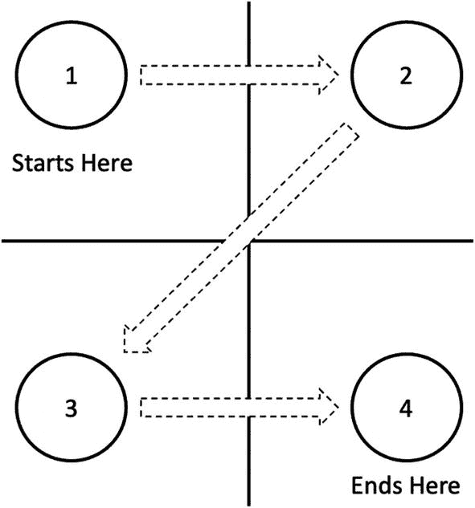

# 十三、什么是故事讲述？

数据故事讲述通过讲述关于可用数据的有效故事来创造最佳业务成果。它建立在数据分析的基本元素上，并将其与创造性的故事讲述相结合，以制作一个有影响力的数据故事。本章介绍了数据叙事的主要元素。这里还讨论了制作数据故事时常见的陷阱。最后，让观众参与进来并集中注意力是讲故事的一个重要方面。这一点在本章末尾有所论述。

## 数据叙事

数据故事是有效数据分析的重要组成部分。让我们用一个例子来说明这一点。就数据分析而言，可视化是一个基本块。假设您正在公司中执行特权访问审计。审计的目标之一是查看被审计系统中是否有特权用户。您可以对用户访问执行异常检测算法，如前一章所述。

图 [13-1](#Fig1) 显示了运行用户访问管理异常检测的结果。

图 13-1

用于用户访问管理的异常检测

图 [13-1](#Fig1) 清楚地展示了异常值。但是如果我们显示下面的可视化效果会怎么样呢(如图 [13-2](#Fig2) )。图 [13-2](#Fig2) 包括颜色(黑色和白色)以突出系统中的特权用户。它有一个动作标题——一个清晰传达可视化信息的标题。

图 13-2

用于用户访问管理的异常检测

显然，第二张图传达了一个更好的故事，并且包含了讲述一个好的数据故事的一些最佳实践。

让我们更深入地了解数据故事的主要元素，如图 [13-3](#Fig3) 所示。许多元素与创造性的讲故事一致，主要强调设置故事的背景。

图 13-3

数据叙事的要素

创造有效故事的五个要素是

*   **设置环境**–定义设置或环境。数据来自什么环境？它与当前的业务问题有什么关系？它是否有助于回答为什么需要讲述一个特定的数据故事？

*   **可视化数据**–我需要用什么样的视觉效果来显示数据？条形图是否足够，或者我是否需要散点图(或其他可视化工具)？数据可视化有助于以可理解的方式查看数据。

*   **简化内容**–通常人们普遍认为，我们添加的视觉效果越多，或者维度(数据字段)越多，分析带来的价值就越大。通常情况下，最好使用一些简单的可视化方式向受众传达数据的含义。如果条形图可以传达您试图用多维散点图显示的相同信息，我们建议使用简单的条形图。

*   **关注关键信息**–你的故事的关键信息是什么？关键信息需要在视觉上突出显示。参见图 [13-3](#Fig3) 中使用颜色突出信息的示例。

*   最后，你需要为你的听众把这些点连接起来。定义动作标题是一种方法。例如，诸如“付款频率与一周中的某一天”这样的标题可能无法传达您想要传达的信息。一个更好的行动标题应该是这样的:“平均而言，在周一和周二多支付了 20%。”这个标题清楚地解释了你想要传达的信息，人事经理可以在一周的早些时候通过查看标题来计划更多的资源。

## 常见陷阱

有许多与数据叙事相关的常见陷阱。我们将在本节中讨论最常见的问题。

### 误导性图表

这是许多可视化中常见的问题。这可以被有意利用，也可以被无意地引入到可视化中。

在图 [13-4](#Fig4) 所示的第一组视觉效果中，所有的类别都只有四个项目。这表明，如果设置不当，视觉效果可能会有不同的含义。

图 13-4

误导性图表的例子

在第二组图像中，两个图形代表相同的信息，但是左图显示它们比右图更接近。有时候这是故意的。例如，在一次选举中，为了使它看起来像是一次势均力敌的选举，左图将被显示。右侧图形可以被示出以指示候选人 B 以较大的差异获胜。

### 安斯康贝的四重奏

安斯科姆的四重奏是由一位名叫安斯科姆的统计学家创造的，目的是为了说明使用汇总统计来理解数据的危险性。为了充分理解数据的性质，必须看到它的分布，以获得更准确的图像。平均值是简化数据的一种常用方法，如果你使用它们，你需要记住你会因为汇总而丢失一些信息。

图 [13-5](#Fig5) 以四个散点图的形式展示了安斯康贝四重奏。

图 13-5

安斯康贝的四重奏图

观察图 [13-5](#Fig5) 中所示的四个图表。这四种都有三个相似的特性。它们具有相同的均值、方差和相关性。

## 吸引观众

吸引观众的最简单的方法之一就是意识到 Z 型模式。Z 型模式是通过研究人们通常如何阅读图表而发现的。如图 [13-6](#Fig6) 所示，一般发现是人们通常从图表的左上角开始，然后移动到屏幕的右上角，接着是左下角，最后是屏幕的右下角。焦点从屏幕的左上角向屏幕的右下角移动。这意味着你要把最重要的视觉效果放在左上角，然后是右上角，接着是左下角，最后是右下角。

图 13-6

Z 型布局

格式塔设计原则也可以用来构建清晰传达信息的视觉效果，并保持观众的注意力。格式塔原则是主要用于用户界面(UX)设计的设计原则。它们还可以用于开发数据分析仪表盘和可视化工具。

## 结论

可以利用数据故事来分享审计中有影响力的发现。数据故事的主要元素是:上下文、视觉、简化、聚焦和连接点。讲故事的两个常见陷阱包括误导性的图表和安斯科姆的四重奏。使用可用的工具和技术，如 Z 模式和格式塔设计原则，吸引观众是很重要的。注意这些技巧有助于进行有效的演示。