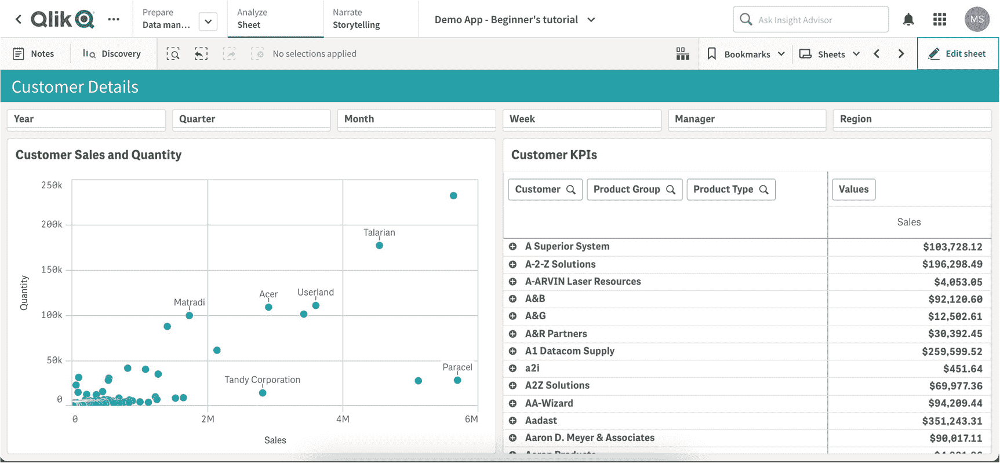
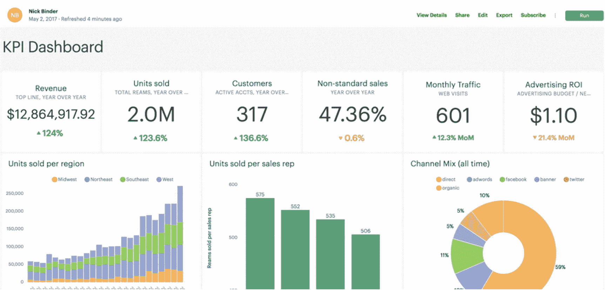

# 18.讲故事工具

在这一章中，我们将看看使用可视化软件制作故事所需的技术工作。一些流行的可视化工具将在高层次上进行讨论，以给出可视化过程的概述。还将简要讨论可视化过程的一般步骤。

## 技术专长

关于制作讲故事可视化的一个误解是，你需要一套专门的技能来制作可视化。尽管需要一定程度的培训，但您不需要专门的培训就可以开始制作引人注目的数据故事。大多数工具都提供深入的免费培训，作为帮助初学者开始讲故事之旅的工具的一部分。只要预先知道关键信息和需求，就可以构建支持它们的可视化。

需要专业技术知识的一个领域是数据准备阶段。在大多数情况下，开发故事所需的数据可能不是可以由可视化平台提供的可视化容易消费的格式。例如，假设我们想要制作一个条形图，显示过去一年每天系统的用户登录数量。理想情况下，我们需要两个字段，一个用于 x 轴或列，另一个用于 y 轴或行。在这种情况下，列字段是去年的日期值，行字段是已登录用户的数量。首先，可用数据可能不是这种格式，可能需要进行处理以获得每天的登录计数。

大多数审计员都熟悉 MS Excel，他们在 MS Excel 中进行分析，作为他们测试过程的一部分。在下一节中，我们将看看其他一些可用于可视化数据的工具。

## 可用工具

可视化工具具有非常相似的特性。它们都支持通常用作标准元素的视觉类型。它们提供了一个集成开发环境(ide ),其中包含可以操作其属性的拖放元素。属性包括颜色、大小、位置、标题、格式和图表特定的属性，如图例位置、轴和数据点属性。可视化工具还提供了组合多个数据源的能力，在工具内执行数据准备操作，并通过共享可视化实现协作。其中一些通过在视觉效果上提供注释功能来支持讲述故事。让我们看看一些可视化工具中的一些示例仪表板。

### Qlik(消歧义)

图 [18-1](#Fig1) 显示了 Qlik 云中的可视化。左边是散点图，右边是显示客户销售详情的表格。顶部显示“年”、“季度”、“月”、“周”、“经理”和“地区”的框是视觉效果的过滤器。例如，您可以使用“区域”过滤器来过滤显示数据的区域。

图 18-1

Qlik 可视化

### 商业智能

图 [18-2](#Fig2) 显示了 Power BI Desktop 中的可视化示例。它有 KPI 图、条形图、带状图、热图和瀑布图。过滤器位于名为“过滤器”的右侧选项卡上

图 18-2

电力 BI 可视化

### （舞台上由人扮的）静态画面

Tableau 提供了与图 [18-3](#Fig3) 中所示的其他界面相似的界面。Tableau、Qlik 和 Power BI 还能够添加定制的视觉效果。定制的视觉效果有助于扩展标准视觉效果的现有功能，并创建全新的视觉效果。例如，您可能希望制作一个显示组织结构图的自定义视觉效果。可视化软件自带的经典视觉效果可能无法支持你。在这种情况下，您可以制作自定义的视觉效果来显示组织结构图并传达信息。

图 18-3

画面可视化

### 模式分析

模式以及本节中讨论的其他可视化工具都是支持云的。这意味着我们不需要下载桌面版的 Mode 或 Power BI 来创建视觉效果并与同事分享。拥有云帐户的用户可以使用公司门户帐户登录可视化工具。图 [18-4](#Fig4) 描绘了用模式构建的可视化。

图 18-4

模式可视化

这里讨论的工具只是一些流行的工具。

一些可视化工具提供了在工具本身中准备和操作加载数据的能力。例如，Power BI 使用一个名为 Power Query Editor 的内置工具，它提供了开箱即用的数据转换/操作功能。

例如，图 [18-5](#Fig5) 显示了如何使用 Power 查询编辑器工具在 Power BI 中更改列类型。

图 18-5

使用超级查询编辑器进行数据转换

图 [18-6](#Fig6) 显示了上述步骤的可视化环境设置示例。

图 18-6

可视化环境设置

尽管有许多可视化工具可用，但创建由数据驱动的可视化的一般步骤在它们之间是相似的:

1.  **准备用于可视化的数据**–在这一步中，数据被清理和格式化，以便可以可视化。

2.  **将准备好的数据提取/加载到可视化工具中**-该步骤包括将数据加载到可视化工具中。每个工具都提供了将数据加载到工具中的能力。

3.  **创建视觉效果**–根据上下文和故事试图传达的信息，通过拖放到选择的区域来创建视觉效果。

4.  **将图像与数据联系起来**–将图像放在工作表上后，需要修改图像的属性。属性包括数据点的颜色、标题、格式等。

5.  **以报告或仪表板的形式分享可视化效果**–最后一步，与最终用户分享包含故事的可视化效果。一些可视化软件提供了在视觉效果上进行注释的能力，以帮助更好地解释故事。

## 结论

大多数分析工具都提供了一个易于使用的拖放界面，可以很容易地用来构建视觉效果。Qlik、Power BI、Tableau 和 Mode 是提供集成开发环境(ide)的一些示例工具。许多分析工具提供了在工具内执行转换的能力，而不是在加载到工具之前应用转换。在所有类型的分析工具中，开发数据可视化的一般步骤通常是相同的。