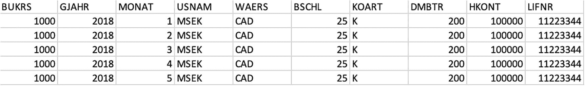
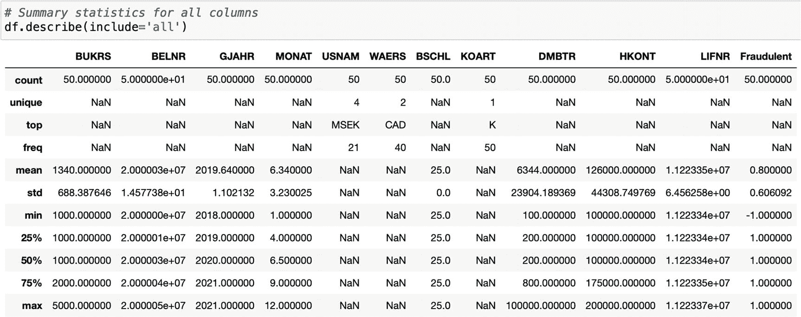
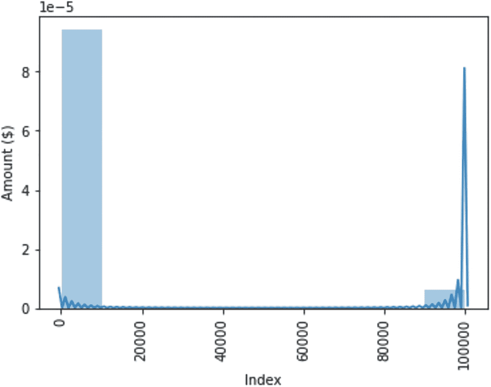
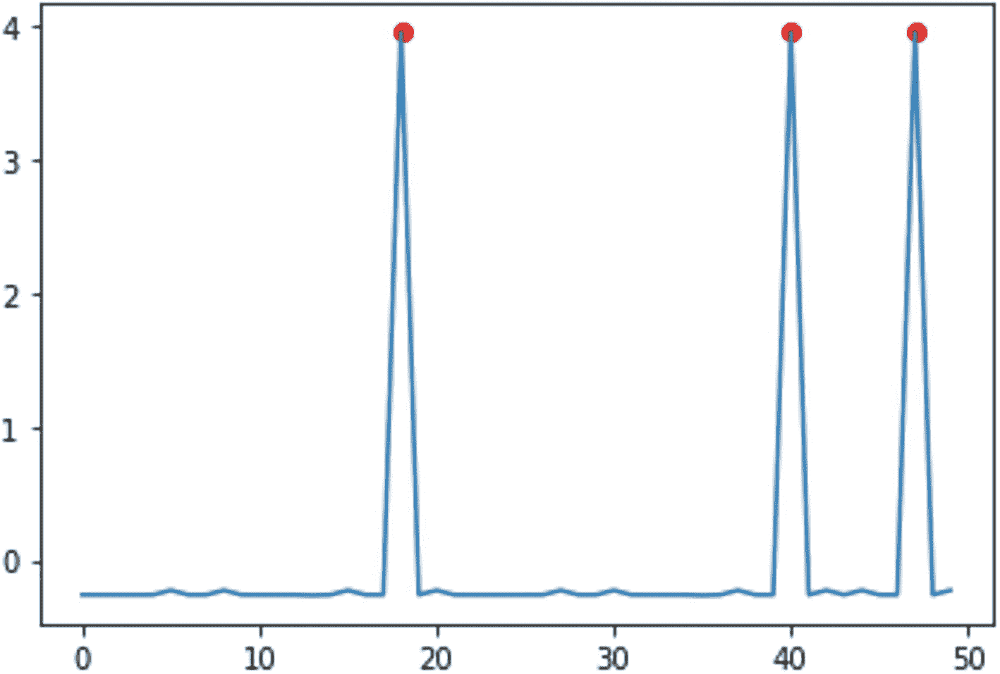

# 二十一、欺诈和异常检测

在这一章中，介绍了一个使用统计、监督和非监督机器学习技术的智能欺诈和异常检测系统。以下部分将展示内部审计师如何利用非传统方法来获得对数据的额外洞察。这一章的结构就像一个秘籍——秘籍的目标、配料、说明、变化和服务。随附的代码可以在第 [20](20.html) 章指定的 GitHub 存储库中获得。

## 碟形天线:欺诈和异常检测系统

字典对欺诈的定义是“为了用有价值的东西诱导另一部分而故意歪曲事实。”组织中的欺诈变得越来越复杂，也越来越难以发现。如前几章所述，由于新的利用途径，包括远程工作，COVID 增加了欺诈的可能性。世界上许多地区都有许多关于欺诈调查的新闻报道。

在组织中，有许多领域都有可能发生欺诈，包括人力资源、财务和供应链管理。在本菜谱中，我们将重点关注与向供应商付款相关的付款欺诈。当一个组织为收到的工作向它的供应商付款时，有适当的检查来防止欺诈。这些检查大多是人工控制，例如在付款时验证供应商的身份，并确保不会向供应商转送超过正常金额的款项。SAP 和 Oracle 等软件中包含的企业资源规划(ERP)系统提供了自动化控制。自动控制的范围从限制数据输入点的字段值到更复杂的检查，如采购订单、货物收据和发票之间的三向匹配调节。不幸的是，尽管存在所有这些控制措施，欺诈仍时有发生。内部审计师进行审计以发现欺诈，但通常仅限于基于抽样或简单过滤技术的测试。例如，可以在支付交易中搜索和过滤某些关键字，以确定支付是否是欺诈性的。

异常检测系统通过查看数据中的异常行为，提供了一种进一步降低欺诈风险的方法。在机器学习中，异常检测系统可以采用监督和非监督学习技术来检测数据中的危险信号。如前一章所述，仅仅检测到危险信号并不构成欺诈。每个危险信号都需要进行个案调查，并与业务部门(可能是财务部门)确认。

异常检测系统的目标是使用算法发现数据集中观察到的异常值。一个有趣的方面是大多数异常检测系统处理不平衡的数据集。与多数类相比，离群值的数量要少得多。例如，在真实的欺诈检测场景中，只有少数交易被认为是欺诈性的。这带来了一些额外的挑战，可以通过选择模型来克服。

在本菜谱中，我们将准备三种方法来检测 SAP 供应商支付交易中的异常行为:

1.  四分位法(统计学)

2.  支持向量机——监督机器学习

3.  k-means–无监督机器学习

通过点击顶部工具栏中的“运行”按钮，可以在 Jupiter 笔记本中逐个运行单元。可以从上到下同时运行所有单元格，方法是转到顶部的“单元格”菜单，然后单击“全部运行”

## 佐料

除了第 [20](20.html) 章中定义的先决条件外，您还需要该配方的以下数据:

*   BKPF SAP 表–所有财务交易的标题数据

*   BSEG SAP 表-所有财务交易的细分数据

我们将需要一个联合表，连接 BKPF 和 BSEG。下表显示了表中的前五个事务。



表 [21-1](#Tab1) 显示了列的列表及其描述。

表 21-1

FI_Transactions.csv 的列列表

<colgroup><col class="tcol1 align-left"> <col class="tcol2 align-left"> <col class="tcol3 align-left"></colgroup> 
| 

圆柱

 | 

描述

 | 

桌子

 |
| --- | --- | --- |
| 布屈 | 公司代码–交易所属的组织内的实体 | bpf(消歧义) |
| 贝尔纳尔 | 文件编号——文件的唯一标识符 | bpf 与 BSEG |
| 杰汉 | 财政年度–交易的年份 | bpf(消歧义) |
| 月 | 财政月–交易的月份 | bpf(消歧义) |
| 用户名 | 用户名–输入交易的用户 | bpf(消歧义) |
| 名字 | 货币代码–交易的货币 | bpf(消歧义) |
| BSCHL | 过账键–该字段用于区分 SAP 中的各种过账–发票、付款、信用等。 | 断续器 |
| 哄堂 | 帐户类型–根据是否使用总帐或子分类帐，有许多帐户类型 | 断续器 |
| DMBTR | 本币金额–这是以本币表示的交易金额 | 断续器 |
| 香港(香港) | 账号 | 断续器 |
| LIFNR | 供应商编号 | 断续器 |
| 不诚实的 | 由我们创建，用于标记我们从过去的历史中了解到的欺诈交易。1 表示非欺诈性交易，而-1 表示该交易被确认为欺诈性交易。 | 不适用的 |

注意，当从 SAP 中提取 BSEG 和 BKPF 时，我们不需要这个配方的所有列。我们只需要前面相应表中的列。“欺诈”一栏是我们添加到合并表中的。

## 说明

### 步骤 1:数据准备

在此分析中，唯一的数据准备是将连接的 BSEG/BKPF 导入笔记本。这些表可以在笔记本之外连接，也可以在 Python 中完成。

如果 BSEG 和 BKPF 已经通过`read_csv()`函数加载到笔记本中，那么在 Python 中使用下面的命令:

```py
BKPF.join(BSEG.set_index('BELNR'), on='BELNR')

```

BELNR 油田为 BSEG 和 BKPF 所共有。

在训练模型之前，需要进行一些小的数据转换。这将在笔记本中突出显示。

### 步骤 2:探索性数据分析

本节帮助使用 Python 中一些现成的工具来探索数据。对结构和实际数据分布进行分析，以使读者对所提供的数据有更深的理解。两个最有用的函数是`describe()`和`unique()`。

describe 函数提供一些汇总统计数据，如平均值、众数、四分位数，包括最小值、最大值和标准差，如图 [21-1](#Fig1) 所示。对于给定的数据集，示出了该量分别具有最小值、25%、50%、75%和最大值 100、200、200、800 和 100000。这表明分布是右偏的，因为 75%的四分位数大约是前两个四分位数的四倍。此外，基于 100000 的最大值，似乎有一个异常值，它比平均值和中值大得多。



图 21-1

describe()函数显示的汇总统计信息

unique 函数给出了数据集中观察到的分类字段的所有可能唯一值的有用列表。在给定的数据集中，总共有四个用户(MSEK、KMES、PKIM、卢克)和两种货币(美元、加元)。

最后，如图 [21-2](#Fig2) 所示，将数量绘制成直方图，以查看数量在数据集中的分布情况。直方图显示大部分金额在 0 到 10，000 美元之间，只有很少的数据点在 100，000 美元左右。



图 21-2

显示金额分布的直方图

### 步骤 3:应用四分位距(IQR)方法

IQR 方法使用统计方法来检测异常值。四分位数被定义为第一个四分位数(25%)和第三个四分位数(75%)之间的范围。对于正态分布，大多数数据被设置为在此窗口中分布。给定的样本数据集不是正态分布，这可以从直方图中观察到。该方法最适用于正态数据分布；此处显示它是为了演示，以便读者可以将其用于自己的数据集。

将可疑的欺诈交易与已知的实际欺诈交易进行比较。在分析结束时，分类报告显示，当谈到该算法在检测非欺诈交易方面的有效性时，有 96%的准确性(F1 分数)。对于欺诈交易，准确率要低得多，只有 50%。这意味着检测异常比说所有交易都不是欺诈交易要困难得多。由于数据集的不平衡性质，这是有意义的。如果数据集不平衡，可以使用 SMOTE 来平衡数据集。SMOTE 代表合成少数过采样技术，是一种创建合成少数类样本以弥补不平衡的过采样技术。

### 步骤 4:执行监督学习

下一个欺诈检测算法使用监督机器学习，特别是一类支持向量机(SVM)模型来检测异常。

首先定义目标和特征。随后将数据集分成训练集和测试集，这是所有监督机器学习算法的特征。由于交易数量少，规定了 50/50 的训练/测试分割。给定的数据集中只有 50 个交易。对于超过 10，000 个事务的数据集，建议采用 90/10 的训练/测试拆分，即数据集的 90%用于训练集，剩余的 10%用于测试集。这对于模型在数据集上进行良好的概化非常重要。

在检测非欺诈交易时，SVM 模型的准确率略低，为 95%，而在正确识别欺诈时，准确率则高得多，为 67%。因此，与前一种方法相比，SVM 方法似乎做得更好。

### 步骤 5:执行无监督学习分析

对于接下来的分析，我们使用无监督学习算法 K-Means 聚类。通常，K-Means 聚类用于识别数据中隐藏的见解，而无需专门向算法提出问题。识别和分析数据中的聚类或主题，以查看特征中是否有模式。

在该实现中，k-means 用于识别位于所提供的数据集中心的单个聚类。欧几里德距离然后用于确定聚类中心和所有剩余数据点之间的距离。然后，最远的三个点被识别为数据集中的异常。异常以红色突出显示，如图 [21-3](#Fig3) 所示。



图 21-3

执行 K 均值聚类后的异常

首先对数据进行缩放，因为 K-Means 在处理标准化数据时表现更好。异常被识别为最终图上的红点。此后，预测异常的标签被设置为-1，并显示评估指标。该算法检测非欺诈性交易的能力再次提高(96%)。检测欺诈交易的算法的 f1 分数为 50%。这些结果类似于 IQR 方法，但与第二种 SVM 方法相比，精确度较低。

### 步骤 6:使用附加数据复查例外

在这种分析中，实际的欺诈交易是在执行分析之前识别出来的。欺诈交易被提供来使用数据评估 ML 模型的性能。在模型被评估之后，最终的模型可以被用于未知的交易来检测欺诈。然后将例外情况转发给适当的业务部门(在这种情况下可能是财务团队),以确认欺诈活动。

### 步骤 7:重新评估模型

最终模型将需要定期进行重新评估，以根据提供的数据检查其性能。这可以通过获取评估指标来完成，特别是模型的 f1 分数。如果性能下降，模型的参数将需要微调，或者数据将需要进一步处理。

## 变化和服务

通过重新链接字段，相同的代码可以用于其他 ERP。例如，在 SAP 中，金额值存储在 BSEG 表的 DMBTR 字段中。可以确定并重新映射另一个 ERP 中以当地货币表示的金额。可能需要一些额外的数据准备步骤，以确保使用正确的货币。有些 ERP 只提供外币金额。在这种情况下，在将金额输入模型之前，需要将其转换为基础货币(公司的本地货币)。

ERP 中有各种各样的可用功能。在 SAP 中，BSEG 和 BKPF 表各有 100 多个字段。并非所有字段都与正在使用的分析相关。有许多方法可以评估特性以进行特性选择。主成分分析(PCA)就是这样一种方法，它在前面的章节中已经讨论过了。PCA 减少了功能的数量，并帮助我们避免不增加附加值的冗余功能。

在当前分析中利用日期的一种方法是通过计算日期的差异来获得可以在分析中使用的另一个特征。例如，K-Means 算法要求所有特征都是数字的。为了利用日期中包含的信息，可以计算显示付款日期和发票日期之间的差异的新字段，并将其用作 K-Means 算法的一个特征。

对于 SVM 和 k-means 模型，Jupyter 笔记本代码仅使用金额(DMBTR)和供应商编号(LIFNR)字段。其他字段可用于这些特征。在这两种情况下，根据提供的样本数据，发现额外的特征对模型的性能有负面影响。真实数据可能不是这样。根据所使用的数据更改要素并重新评估模型以检查其对模型准确性的影响非常重要。在不深入细节的情况下，SVM 据说在处理高维数据时表现更好，而 K-Means 聚类受到维数灾难的困扰。这意味着，与 SVM 模型相比，k-means 对于大量特征的性能较差。

对于 SVM，该算法对训练/测试数据使用 50/50 分割。如前所述，对于大于 10，000 行的数据集，建议对训练/测试数据集进行 90/10 拆分。

理想情况下，具有最佳性能的最终模型将被部署到生产中，并由业务的其他领域使用。许多云提供商，如 AWS(AWS)和谷歌云平台(GCP ),提供了部署最终模型的方法，并将它们作为端点公开，供业务中的其他应用程序使用。这种方法有助于降低与支持部署模型所需的基础设施相关的成本。

根据欺诈检查的频率，可以基于行业每季度、每月或每周对模型进行评估。对于银行应用，可能需要更实时或连续的流数据应用。对于审计应用，每季度运行一次模型可能就足够了。如前所述，必须持续评估模型的性能，因为所使用的数据会随着时间的推移而变化，这可能会进一步导致模型漂移。这导致低性能，不利于模型的 ROI。