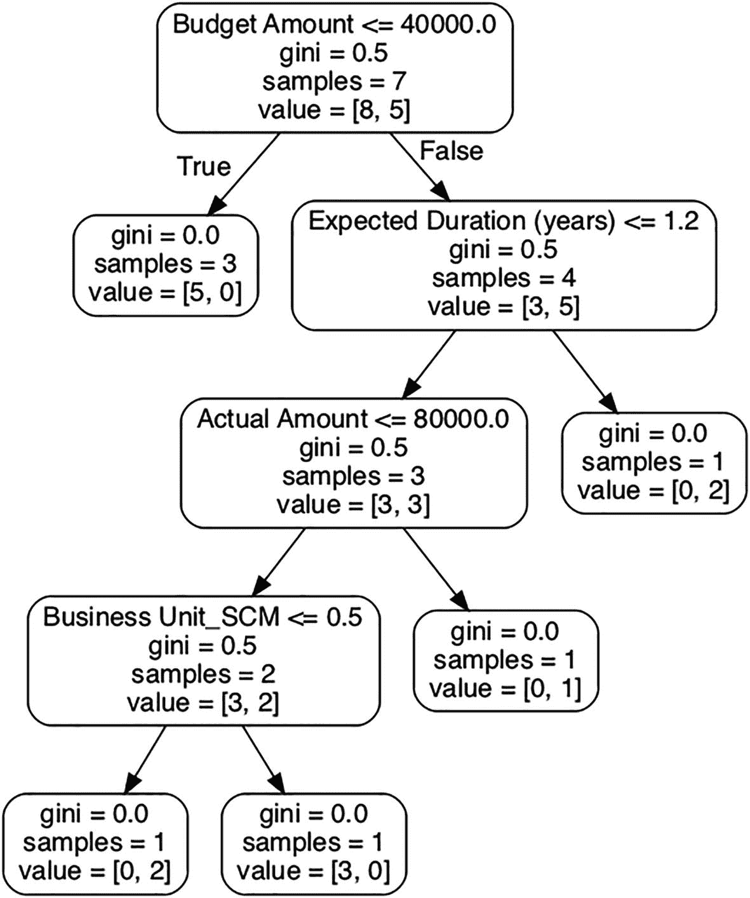

# 23.项目管理

在这一章中，我们将会看到两种利用 ML 来分析项目成功的方法。分类器用于预测项目是否会成功。我们还将研究一种确定特征重要性的技术。本章讨论的技术将帮助审计员确定可能失败的项目，这些项目可能是与企业讨论的重点。特征重要性分析的结果可用于确定高风险项目失败时最重要的变量。

这一章的结构就像一个食谱——食谱的目标、配料、说明、变化和服务。随附的代码可以在第 [20](20.html) 章指定的 GitHub 存储库中获得。

## 菜肴:项目组合分析

每个组织都有一个项目组合。项目和计划帮助组织从事一些有结束日期的新工作，以服务于组织的愿景。根据项目管理协会的“2020 年行业脉搏”报告，在项目管理成熟度低的组织中，超过 20%的项目失败。一个具有低成熟度项目管理框架的组织在管理其项目时有特定的过程。就价值交付而言，只有大约一半的项目满足项目的目标/意图，在预算、时间内，并处理范围蔓延。当项目的原始需求在整个项目过程中被修改时，范围蔓延就会发生。理解诸如预算、时间、达成的目标和范围蔓延等项目度量如何影响项目失败将是有益的。

虽然内部审计不直接负责组织的项目管理，但是他们经常参与执行审计，以查看项目组合管理的有效性。审计员审查对组织构成高风险的项目的预算、时间、范围和其他项目管理指标。下面讨论的特征重要性分析将帮助审核员确定预测项目成功的最有用的指标。在与业务部门进行风险评估的过程中，可以将此分析的见解作为讨论要点。

在这个分析中，我们将着眼于在项目管理中应用 ML 的两种方式。使用随机森林分类器 ML 算法，我们将根据预算、时间、团队规模和业务功能信息来预测项目是否会成功。我们还将了解在使用 Random Forest 内置的可变重要性功能预测项目是否会成功时，哪些功能最为重要。

## 佐料

Project_Portfolio.csv 文件中提供了一个样本数据集。以下是各列及其说明:

## 说明

你需要遵循四个步骤。首先是准备数据。然后，您需要做一些探索性的数据分析，以澄清您对必须处理的内容的理解。然后应用分类并检查结果。

### 步骤 1:数据准备

在最初检查这些列时，发现它们包含分类值(例如，业务单位、结果、项目等。).为了让随机森林算法从数据集中提取信号，我们需要使用一键编码(OHE)将分类值转换为数值。回想一下，OHE 将分类字段中的每个类别转换为列，并赋予二进制值 1 或 0。在这个分析中，内置的 pandas 函数`get_dummies()`用于执行这个任务。

没有重复的项目或同名的项目。项目的唯一性对分类器算法没有帮助，因为除了每一行都是唯一的之外，它不提供任何进一步的信息。因此，首先从数据集中删除项目列。

据观察,“Result_Not Successful”和“Result_Successful”列代表我们试图预测的目标值。因此，这些列将从数据集中删除。

### 步骤 2:探索性数据分析

作为探索性数据分析(EDA)的一部分，观察所有列的汇总统计信息。以下是对该总结的一些解读:

*   当我们查看该字段的最小值和最大值时，“预期持续时间”的范围从三个月到两年。

*   当我们查看该字段的最小值和最大值时，“实际持续时间”的范围从六个月到四年。

*   平均来说，一个项目中有十个团队成员。这从“团队规模”字段的均值就可以看出来。

### 步骤 3:执行随机森林分类

随机森林分类器构建指定数量的决策树，每个决策树具有随机的特征集。计算每个决策树的性能，并使用训练数据集记录每个特征添加的信息。在此分析中，为训练/测试分割指定了 50%/50%分割。所有构建的树(在这种情况下是 1000 棵)的组合用于预测测试数据集。使用 f1 分数来测量性能，f1 分数占整个分类器的 46%。分类器预测成功项目的能力为 59%(参见分类报告中“成功”的 f1 分数)。

模型中使用的决策树之一如图 [23-1](#Fig1) 所示。

图 23-1

决策树在随机森林分类中的应用

表 23-1

Project_Portfolio.csv 的列列表

<colgroup><col class="tcol1 align-left"> <col class="tcol2 align-left"></colgroup> 
| 

圆柱

 | 

描述

 |
| --- | --- |
| 项目 | 项目名称 |
| 营业单位 | 项目所属的业务职能。 |
| 预期持续时间 | 项目的预算时间 |
| 实际持续时间 | 完成项目所花费的实际时间。 |
| 预算总金额 | 项目开始前项目的预算金额。 |
| 实际金额 | 项目给组织带来的实际成本 |
| 团队规模 | 项目团队的总规模 |
| 结果 | 指示项目是否成功。 |

图 [23-1](#Fig1) 显示了模型使用的 1000 棵决策树中的一棵。每个方框代表一个决策点或节点，箭头表示为真(左)和为假(右)的情况。例如，顶层的第一个节点检查预算金额< = 40000。如果预算金额低于 40，000 美元，基尼系数为零。基尼系数是数据集中差异程度的统计度量。基尼系数为零意味着给定数据集中没有差异。

### 步骤 4:检查功能的重要性

经过训练的随机森林模型的特征重要性通过模型的`feature_importances_`参数来检索。使用条形图绘制特征重要性，如图 [23-2](#Fig2) 所示。

图 23-2

随机森林模型中的变量重要性

可以看出，预算金额的重要性最高，为 25%。这意味着当预测一个项目是否成功时,“预算金额”变量捕获了 25%的信息方差。“预算金额”(25%)、“预期金额”(18)、“实际持续时间”(18)、“实际金额”(12)、以及“团队规模”(12)等特征包含 85%的信息。

## 变化和服务

持续时间和数量可以合并到一个单一特征中，该特征捕获相同级别的信息。这有助于减少分析使用的特征数量。与组合日期类似，预期值和实际值之间的差异可以作为另一个功能来计算，该功能分别保存与这两个值相同级别的信息。

本章中描述的分析可以临时使用，也可以以不同的频率使用(例如，每季度一次)。在项目的计划阶段，可用的参数(预算金额、预期金额、预期持续时间等。)可以通过训练的随机森林模型来运行，以预测它们是否会成功。

实际持续时间和金额在项目开始时不可用。可以根据最坏情况和最好情况来设置实际值，以了解这将如何影响项目的成功。例如，如果由于项目实现时的恶劣天气，项目(设施建设)的成功存在不确定性，我们预计项目会超出预算和预期持续时间。因此，实际值可以超过预算值。

## 结论

本章中的例子展示了使用 ML 分析项目成功的两种方法。应用这些技术可以帮助你作为一个审计员与企业进行富有成效的、有时是困难的讨论，讨论的主题是识别高风险的、值得特别注意以防止失败的项目。