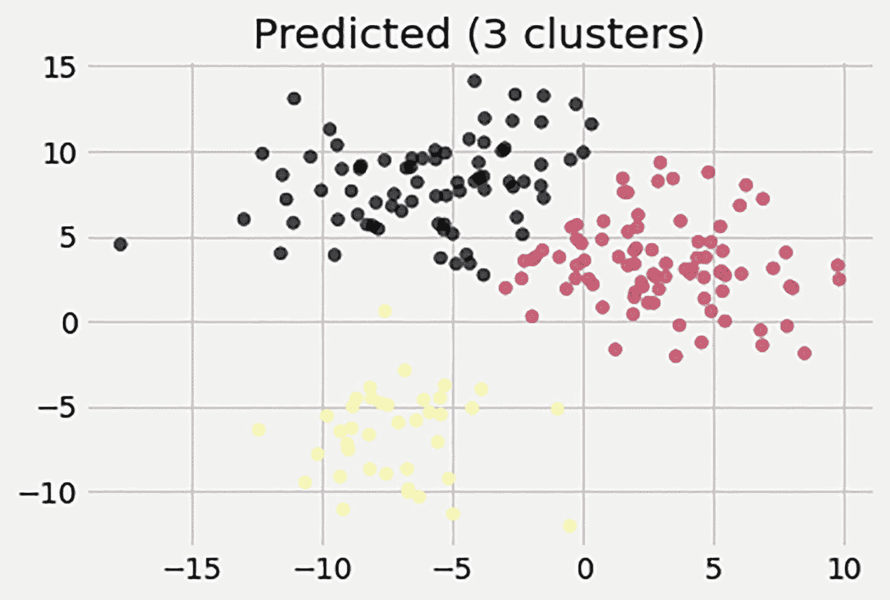
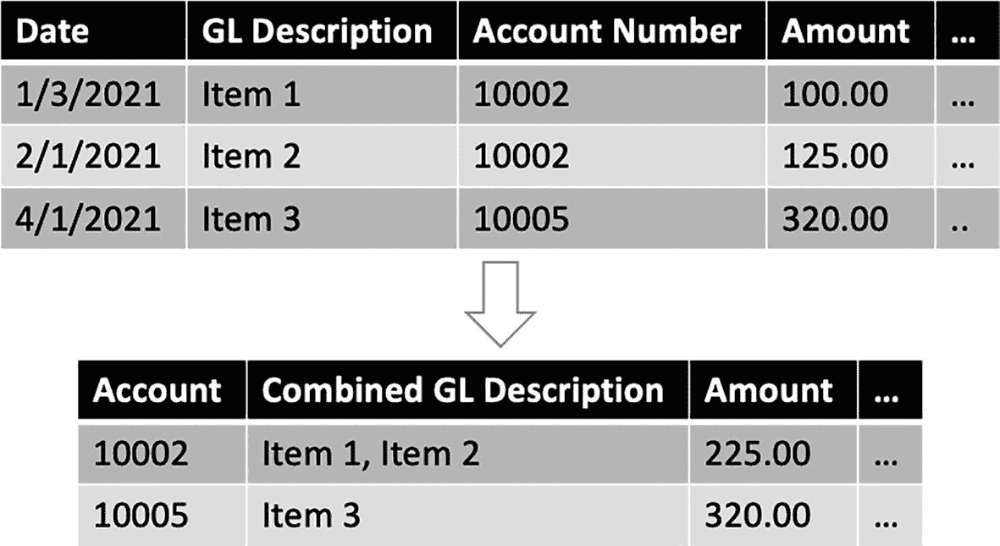

# 二十六、CAATs 2.0

本章举例说明了 ML 在计算机辅助审计技术中的应用。该方法将有助于分析交易，以获得对数据和业务的更多隐藏的见解。

这一章的结构就像一个秘籍——秘籍的目标、配料、说明、变化和服务。随附的代码可以在第 [20](20.html) 章指定的 GitHub 存储库中获得。

## 菜肴:使用 ML 进行 CAATs 分析

在过去的十年中，计算机辅助审计技术越来越流行。我们介绍了 CAATs 的两个主要用例:会计数据的验证和检查控制有效性。在此分析中，我们将探索一种方法来改进当前的会计数据验证过程。由于交易量和欺诈的可能性，总分类账(GL)和试算表(TB)等会计数据需要定期进行平衡。总账是用于记账的分类账，包含从应付账款、应收账款、固定资产、采购等的日记账过账的交易。总账中记录的分录是单个交易级别的。TB 是所有账户的列表，包括账户的开、关以及特定时期的贷方和借方余额。TB 条目位于帐户级别。

GLs 和 TBs 通常由审计员作为验证工具进行对账，以确保公司交易在一年中保持平衡。由于分录是在交易级别(GL)和账户级别(TB)记录的，因此对它们进行对账是一种很好的欺诈检查。如果交易被添加到 GL 中，但在帐户级别的 TB 中没有反映出变化，则 GL 和 TB 将不会进行调节。

以下是用于调节 GL 和 TB 的通用公式:

*   差额=(总账 _ 贷方–总账 _ 借方)–( TB _ 期初余额–TB _ 期末余额+TB _ 贷方–TB _ 借方)

在应用前面的公式之前，总帐需要转换为帐户级别的汇总数据。这可以通过在账户级别汇总总账交易并合计贷方和借方余额来完成。

在当前流程中，只有在存在差异时，即总账和 TB 不一致时，才会检查交易明细。总帐说明，即附在每个交易上描述交易的文本，通常不用于任何目的。

在我们的分析中，我们假设我们有通过主题建模分配的差异(见前面)和 GL 描述主题。主题建模是一种自然语言处理(NLP)技术，它对文本描述等非结构化数据进行训练，以通过聚集关键字来分配主题。在下一章第 27 章中提供了主题建模的例子。

鉴于这两个特征，我们的分析能够使用 K-Means 聚类，根据主题及其 GL 与 TB 的差异对客户进行细分。分析的另一个目标是识别数据集中存在的异常。

## 佐料

对于这个分析，我们使用`make_blobs()`函数创建了一个包含 200 个观察值和两个特征的随机数据集。`make_blobs()`函数在指定数量的斑点(本例中为五个)周围创建数据点，并提供数据点的相应聚类数。生成了五个 blobs，因为它们代表了五种类型的总账账户:资产、负债、收入、费用和资本。了解聚类(本例中的账户类型)非常重要，因为稍后可以对其进行比较，以检查我们通过聚类算法发现的结果是否准确。

这两个特征代表了话题的数量和差异。主题编号是基于对总账描述执行主题建模而分配的，本分析中不涉及。下一章(第 [27](27.html) 章)中关于主题建模的细节可以用来在总账描述上运行主题建模。

## 说明

CAATS 分析有三个步骤。和往常一样，首先要准备数据。

### 步骤 1:数据准备

第一个数据准备任务是缩放要素。标准化(或缩放)对于聚类算法尤其重要，因为它有助于在定义聚类时减少具有较大缩放比例的变量的支配效应。这是该分析中唯一的重大转变。

### 步骤 2:探索性数据分析

作为 EDA 过程的一部分，随机数据集被可视化，以查看五个聚类如何跨数据点分布。聚类的分布说明了帐户是如何划分的。每个分类代表一种总帐科目。

### 第三步:K 均值聚类

k-means 聚类算法应用于数据集，以确定在分析差异和描述时是否存在任何隐藏的关系。首先使用大小为三(K=3)的聚类进行分析。k-means 聚类根据聚类与聚类中心的距离，将聚类分配给最近的数据点。聚类的中心反复移动，以便它总是移动到分配给该聚类的数据点的中心。

使用肘方法可以确定最佳的聚类数，即三个。肘方法计算从 1 到 10 的聚类大小的误差平方和(SSE)。最佳聚类大小是在图最陡地过渡到下一个大小的点处找到的。在这种情况下，发现三个簇是最佳数目，因为大于这个数目(K=4)的大小将仅提供 SSE 的少量减少。

当我们创建数据时，我们实际上有五个分类——一个分类代表一种总帐科目类型。但是我们的分析显示只有三个不同的集群，如图 [26-1](#Fig1) 所示。

图 26-1

K 均值聚类的结果(使用 K=3)

一个原因可能是“预测(3 个聚类)”图中的红色和黑色聚类可以进一步分成两个其他聚类，这两个聚类由于彼此接近而不一定清楚。

异常可以通过它们离集群中心的距离来识别。在我们的分析中，一个可能的异常是(-15，5)处的数据点。尽管该数据点被分配给一个聚类，但它远离同一聚类中的其余点。通过查看诸如采购订单、发票和/或付款之类的附加数据，可以进一步研究与该数据点相关联的 GL 交易，以确定它们是否是合法的交易。

## 变化和服务

使用主题建模时，可以汇总总帐事务数据，并且可以连接相关事务的总帐描述，以便在帐户级别进行关联。参见图 [26-2](#Fig2) 查看总结的直观图示。

图 26-2

总帐事务处理汇总

其他特征，如过账日期、交易日期、清算日期、货币等。可用于分段。为了防止选择具有冗余信息的特征，可以使用主成分分析(PCA)。PCA 减少了功能的数量，并帮助我们避免不增加附加值的冗余功能。

在当前分析中利用日期的一种方法是通过计算日期的差异来获得可以在分析中使用的另一个特征。例如，k-means 算法要求所有特征都是数字的。为了

利用日期字段中包含的信息，可以计算显示清算日期和过帐日期之间的差异的新字段，并将其用作 K-Means 算法的一个特征。

可以定期(每季度、每半年或每年)运行此分析的最终模型，以识别异常情况并更好地了解业务。这种应用可能不需要实时执行分析，因为 CAATs 是每季度、每半年或每年执行一次。但是，它可以很容易地转换成一个不断发展的模型，根据交易量每天或每周进行重新训练。

## 结论

本章展示了如何应用 CAATs 来帮助分析交易，并获得可以向业务部门报告的见解。此类技术可用于验证会计数据和组织实现的各种会计控制的有效性。