第一章


256 种灰度

Building a Program to Automatically Recognize Images of Numbers

如果你要列出当前科技领域的热门话题，机器学习肯定会名列前茅。然而，虽然这个词到处都有，但它的确切含义却常常令人困惑。它与“大数据”或者“数据科学”是一回事吗？和统计学有什么不同？从表面上看，机器学习可能看起来是一个奇特而令人生畏的专业，它使用奇特的数学和算法，与软件工程师的日常活动几乎没有共同点。

在这一章，以及本书的其余部分，我的目标将是通过一起完成真实世界的项目来揭开机器学习的神秘面纱。我们将一步一步地解决问题，主要是从头开始编写代码。通过采用这种方法，我们将能够理解事物如何工作的具体细节，同时说明广泛适用的核心思想和方法，并为您以后构建专门的库提供坚实的基础。在我们的第一章中，我们将直接进入一个经典问题——识别手写数字——并在此过程中做一些事情:

*   建立适用于大多数机器学习问题的方法。开发一个机器学习模型与编写标准的业务线应用程序有细微的不同，并且它会带来特定的挑战。在本章的结尾，你将理解交叉验证的概念，为什么它很重要，以及如何使用它。
*   让你明白如何“思考机器学习”，如何看待 ML 问题。我们将讨论相似性和距离这样的概念，这是大多数算法的核心。我们还将表明，虽然数学是机器学习的重要组成部分，但这一方面往往被过分强调，一些核心思想实际上相当简单。我们将从一个相当简单的算法开始，并看到它实际上工作得相当好！
*   知道如何在 C#和 F#中处理问题。我们将从用 C#实现解决方案开始，然后用 F#给出等价的解决方案，F #是一种. NET 语言，特别适合机器学习和数据科学。

在第一章中正面解决这样一个问题起初听起来可能是一项艰巨的任务——但是不要被吓倒！从表面上看，这是一个困难的问题，但是正如你将看到的，我们将能够只用相当简单的方法创建一个相当有效的解决方案。再说了，解决鸡毛蒜皮的玩具问题哪里来的乐趣？

什么是机器学习？

但是首先，什么是机器学习？在其核心，机器学习是编写程序，学习如何根据经验执行任务，而不是显式编程这样做。这仍然是一个模糊的定义，并回避了这样一个问题:你到底是如何定义学习的？一个有点干巴巴的定义如下:一个程序正在学习，如果给它更多的数据点，它会自动更好地执行给定的任务。另一种看待它的方式是通过翻转定义:如果你一遍又一遍地做同样的事情，不管你观察到的结果如何，你肯定没有在学习。

这个定义很好地概括了“做机器学习”是什么。你的目标是写一个能自动执行某些任务的程序。程序应该能够从经验中学习，或者以预先存在的过去观察的数据集的形式，或者以程序本身在执行其工作时积累的数据的形式(这就是所谓的“在线学习”)。随着越来越多的数据变得可用，程序应该在任务上变得更好，而不必修改程序本身的代码。

编写这样一个程序的工作涉及到几个因素。首先，你的程序需要可以学习的数据。机器学习的一个重要部分围绕着收集和准备数据，使其成为你的程序能够使用的形式。这个将原始数据重新组织成一种更好地代表问题领域并且你的程序可以理解的格式的过程被称为特征提取 T2。

然后，你的程序需要能够理解它是如何执行它的任务的，这样它就可以调整并从经验中学习。因此，至关重要的是要定义一个衡量标准，恰当地捕捉“完成任务”的好坏意味着什么。

最后，机器学习需要一些耐心、好奇的头脑和大量的创造力！您需要选择一种算法，为其提供数据以训练预测模型，验证模型的性能，并可能通过定义新功能或选择新算法来进行优化和迭代。这个循环——从训练数据中学习，从验证数据中评估，然后提炼——是机器学习过程的核心。这是科学方法在起作用:你试图通过制定假设和进行一系列验证实验来确定一个足以预测世界的模型，以决定如何前进。

在我们进入第一个问题之前，先简单说两句。首先，这听起来像是一个宽泛的描述，的确如此。机器学习适用于很多问题，从检测垃圾邮件和无人驾驶汽车到推荐你可能喜欢的电影、自动翻译或使用医疗数据帮助诊断。虽然每个领域都有其特殊性，需要很好地理解才能成功应用机器学习技术，但原则和方法在很大程度上是相同的。

然后，注意我们的机器学习定义是如何明确提到“编写程序。”与主要关注验证模型是否正确的统计学不同，机器学习的最终目标是创建一个在生产中运行的程序。因此，它是一个非常有趣的工作领域，首先因为它本质上是跨学科的(很难同时成为统计方法和软件工程的专家)，然后因为它为软件工程师开辟了一个非常令人兴奋的新领域。

现在我们已经有了一个基本的定义，让我们进入我们的第一个问题。

一个经典的机器学习问题:分类图像

识别图像，尤其是手写笔迹，是机器学习中的一个经典问题。首先，这是一个非常有用的应用程序的问题。自动识别信件上的地址或邮政编码使邮局能够有效地发送信件，免去人工分拣信件的繁琐工作；能够将支票存入自动柜员机，自动柜员机能够识别金额，加快资金进入您帐户的过程，并减少在银行排队等候的需要。想象一下，如果人类书写的所有文件都被数字化，搜索和探索信息将会变得多么容易！这也是一个难题:人类的笔迹，甚至印刷品，都有各种各样的变化(大小，形状，倾斜，你能想到的)；虽然人类可以识别不同人写的字母和数字，但计算机却很难处理这项任务。这就是为什么验证码是一种简单有效的方式来判断一个人是真人还是机器人。人类的大脑有这种惊人的能力来识别字母和数字，即使它们被严重扭曲。

有趣的事实:验证码和再验证码

CAPTCHA(“区分计算机和人类的全自动公共图灵测试”)是一种旨在从人类中过滤出计算机机器人的机制。为了确保用户是一个真实的人，验证码会显示一段故意混淆的文本，以使计算机自动识别变得困难。有趣的是，这个想法被 reCAPTCHA 扩展了。reCAPTCHA 显示两幅图像，而不是一幅:其中一幅用于过滤掉机器人，而另一幅则是一段真正的数字化文本(见[图 1-1](#Fig1) )。每当一个人以这种方式登录时，他也帮助数字化存档文件，例如《纽约时报》的过刊，一次一个单词。

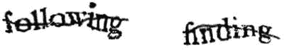

[图 1-1](#_Fig1) 。一个重述的例子

我们的挑战是:建立一个数字识别器

我们将解决的问题被称为“数字识别器”，它直接借鉴了 Kaggle.com 机器学习竞赛。你可以在这里找到关于它的所有信息:[http://www.kaggle.com/c/digit-recognizer](http://www.kaggle.com/c/digit-recognizer)

这是一个挑战:我们有一个包含 50，000 张图片的数据集。每张图像都是一个数字，由人写下来，以 28 × 28 像素的分辨率扫描，以灰度编码，每个像素取 256 种可能的灰色阴影中的一种，从全白到全黑。对于每次扫描，我们也知道正确的答案，即人类写下的数字。这个数据集被称为**训练集**。我们现在的目标是编写一个程序，它将从训练集中学习，并使用这些信息来预测它从未见过的图像:它是零，还是一，等等。

从技术上讲，这被称为**分类**问题:我们的目标是在已知的“类别”之间分离图像，也称为类(因此有“分类”一词)。在这种情况下，我们有十个类，从 0 到 9 的每个单个数字一个类。根据你试图解决的问题的类型，机器学习有不同的风格，分类只是其中之一。然而，这也可能是最具象征意义的一个。我们将在本书中涵盖更多内容！

那么，我们该如何解决这个问题呢？我们先从一个不同的问题开始。假设我们只有两个图像，一个 0 和一个 1(见[图 1-2](#Fig2) ):

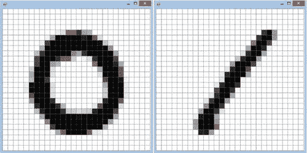

[图 1-2](#_Fig2) 。样本数字化 0 和 1

假设现在我给你图 1-3 中[的图像，并问你以下问题:](#Fig3)[图 1-2](#Fig2) 中显示的两幅图像中，哪一幅最相似？

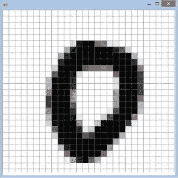

[图 1-3](#_Fig3) 。要分类的未知图像

作为一个人类，我怀疑你觉得这个问题很琐碎，回答“显然，第一个。”就此而言，我怀疑一个两岁的孩子也会觉得这是一个相当简单的游戏。真正的问题是，你如何将你大脑的魔力转化成代码？

解决这个问题的一个方法是通过翻转来重新表述这个问题:最相似的图像是最不相似的图像。在那一帧中，你可以开始玩“找出差异”，逐像素地比较图像。[图 1-4](#Fig4) 中的图像显示了差异的“热图”:两个像素差异越大，颜色越深。

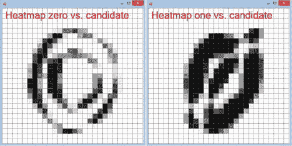

[图 1-4](#_Fig4) 。“热图”突出显示了[图 1-2](#Fig2) 和[图 1-3](#Fig3) 之间的差异

在我们的例子中，这种方法似乎工作得很好；第二张图“非常不同”，中间有一大片黑色区域，而第一张图描绘了两个零之间的差异，大部分是白色的，有一些薄的黑色区域。

机器学习中的距离函数

我们现在可以用一个数字来总结两幅图像的不同之处，通过对像素之间的差异求和。这样做给了我们少量相似的图像，和大量不同的图像。我们在这里定义的是图像之间的距离，描述它们有多近。两幅完全相同的图像的距离为零，像素差异越大，距离就越大。一方面，我们知道距离为零意味着完全匹配，这是我们所能期望的最好结果。另一方面，我们的相似性度量有局限性。举个例子，如果你只是简单地克隆了一张图片，但是把它向左移动了一个像素，那么即使这两张图片本质上是一样的，它们之间的距离可能会非常大。

距离的概念在机器学习中非常重要，并且以这样或那样的形式出现在大多数模型中。距离函数是你如何把你要达到的目标转化成一种机器可以处理的形式。通过将一些复杂的东西，比如两幅图像，简化为一个数字，你可以让算法采取行动——在这种情况下，判断两幅图像是否相似。与此同时，通过将复杂性减少到一个数字，您会招致一些微妙之处将“在翻译中丢失”的风险，就像我们的移位图像场景一样。

距离函数也经常以另一个名字出现在机器学习中:**代价函数。**本质上是一回事，只是换个角度看问题。例如，如果我们试图预测一个数字，我们的预测误差——也就是我们的预测与实际数字有多远——就是一个距离。然而，描述这一点的一个等价方式是成本:更大的误差是“昂贵的”，改进模型意味着降低其成本。

从简单的事情开始

但是现在，让我们继续下去，愉快地忽略这个问题，并遵循一个对我来说创造了奇迹的方法，无论是在编写软件还是开发预测模型方面——什么是可能有效的最简单的事情？先从简单的开始，看看会发生什么。如果它工作得很好，你就不必构建任何复杂的东西，而且你会完成得更快。如果它不起作用，那么你已经花了很少的时间来构建一个简单的概念证明，并且通常在这个过程中学到了很多关于问题空间的知识。不管怎样，这都是一场胜利。

所以现在，让我们避免过度思考和过度设计；我们的目标是实现我们认为可能有效的最不复杂的方法，并在以后进行改进。我们可以做的一件事如下:当我们必须识别图像代表什么数字时，我们可以在我们已知的 50，000 个训练样本库中搜索最相似(或最不不同)的图像，并预测该图像所表达的内容。如果它看起来像一个五，当然，它一定是一个五！

我们算法的概要如下。给定我们将尝试识别的 28 × 28 像素图像(“未知”)，以及我们的 50，000 个训练示例(28 × 28 像素图像和一个标签)，我们将:

*   计算未知样本和每个训练样本之间的总差异；
*   找到差异最小的训练样本(“最接近的”)；和
*   预测“未知”和“最近”是一样的。

让我们开始吧！

我们的第一个模型，C#版本

为了热身，让我们从 C#实现开始，这应该是熟悉的领域，并在 Visual Studio 中创建一个 C#控制台应用程序。我将我的解决方案命名为 DigitsRecognizer，将 C#控制台应用程序命名为 cs harp——请尽情发挥自己的创造力吧！

数据集组织

我们首先需要的显然是数据。让我们从[http://1drv.ms/1sDThtz](http://1drv.ms/1sDThtz)下载数据集 trainingsample.csv，并将其保存在您的机器上。在我们使用它的同时，在同一位置还有第二个文件 validationsample.csv，我们稍后将使用它，但现在让我们获取它并完成它。该文件为 CSV 格式(逗号分隔值)，其结构如[图 1-5](#Fig5) 所示。第一行是标题，后面的每一行代表一个单独的图像。第一列(“标签”)表示图像代表的数字，随后是 784 列(“像素 0”、“像素 1”，...)代表原始图像的每个像素，以灰度编码，从 0 到 255(0 代表纯黑，255 代表纯白，以及两者之间的任何灰度级)。

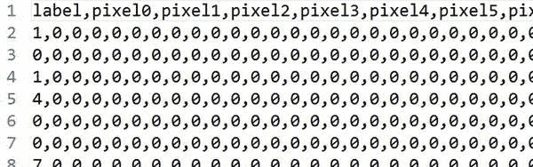

[图 1-5](#_Fig5) 。训练数据集的结构

例如，这里的第一行数据代表数字 1，如果我们想从行数据中重建实际的图像，我们将把行分成 28 个“片段”，每个片段代表图像的一行:pixel0，pixel1，...像素 27 编码图像的第一行，像素 128，像素 129，...，第二个是 pixel55，以此类推。这就是为什么我们最终总共有 785 列:一列用于标签，28 行× 28 列= 784 像素。[图 1-6](#Fig6) 描述了一个简化的 4 × 4 像素图像的编码机制:实际图像是 1(第一列)，后面是 16 列，代表每个像素的灰度。

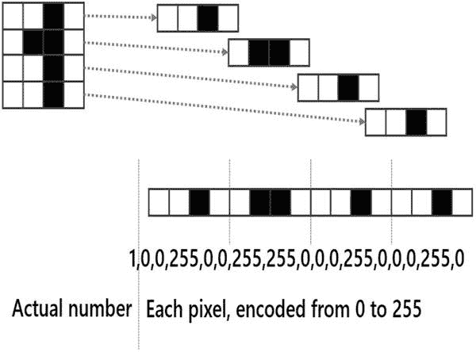

[图 1-6](#_Fig6) 。将图像简化编码为 CSV 行

 **注意**如果你仔细看，你会注意到文件 trainingsample.csv 只包含 5000 行，而不是我前面提到的 50000 行。为了方便起见，我创建了这个较小的文件，只保留了原始文件的顶部。50，000 行并不是一个巨大的数字，但它足以令人不快地减慢我们的进度，并且在这一点上处理更大的数据集并没有增加多少价值。

读取数据

在典型的 C#风格中，我们将围绕几个代表我们领域的类和接口来构建我们的代码。我们将把每个图像的数据存储在一个观察类中，并用一个接口 IClassifier 来表示算法，这样我们以后就可以创建模型变体。

第一步，我们需要将 CSV 文件中的数据读入一个观察值集合。让我们转到我们的解决方案，在 CSharp 控制台项目中添加一个类来存储我们的观察结果:

***清单 1-1*** 。将数据存储在观测类中

```py
public class Observation
{
    public Observation(string label, int[] pixels)
    {
        this.Label = label;
        this.Pixels = pixels;
    }

    public string Label { get; private set; }
    public int[] Pixels { get; private set; }
}
```

接下来，让我们添加一个 DataReader 类，用它从我们的数据文件中读取观察值。这里我们实际上有两个不同的任务要执行:从文本文件中提取每一个相关的行，并将每一行转换成我们的观察类型。让我们把它分成两种方法:

[***清单 1-2***](#_list2) 。使用 DataReader 类从文件中读取

```py
public class DataReader
{
    private static Observation ObservationFactory(string data)
    {
        var commaSeparated = data.Split(',');
        var label = commaSeparated[0];
        var pixels =
            commaSeparated
            .Skip(1)
            .Select(x => Convert.ToInt32(x))
            .ToArray();

        return new Observation(label, pixels);
    }

    public static Observation[] ReadObservations(string dataPath)
    {
        var data =
            File.ReadAllLines(dataPath)
            .Skip(1)
            .Select(ObservationFactory)
            .ToArray();

        return data;
    }
}
```

请注意，我们这里的代码主要是 LINQ 表达式！面向表达式的代码，比如 LINQ(或者，你稍后会看到，F#)，可以帮助你编写非常清晰的代码，以一种简单明了的方式传达意图，通常比过程化代码做得更多。它读起来很像英语:“阅读所有行，跳过标题，用逗号分隔每一行，解析为整数，给我新的观察结果。”如果我与同事交谈，我会这样描述我试图做的事情，这种意图在准则中得到了清晰的体现。它也非常适合数据操作任务，因为它提供了一种自然的方式来描述数据转换工作流，这是机器学习的面包和黄油。毕竟，这就是 LINQ 的设计目的——“语言集成查询！”

我们有数据、读取器和存储它们的结构—让我们将它们放在控制台应用程序中并尝试一下，将 trainingPath 中的 PATH-ON-YOUR-MACHINE 替换为您本地机器上实际数据文件的路径:

***清单 1-3*** 。控制台应用程序

```py
class Program
{
    static void Main(string[] args)
    {
        var trainingPath = @"PATH-ON-YOUR-MACHINE\trainingsample.csv";
        var training = DataReader.ReadObservations(trainingPath);

        Console.ReadLine();
    }
}
```

如果您在这个代码块的末尾放置一个断点，然后在调试模式下运行它，您应该会看到 training 是一个包含 5，000 个观察值的数组。很好——一切似乎都在工作。

我们的下一个任务是编写一个分类器，当传递一个图像时，它会将该图像与数据集中的每个观察值进行比较，找到最相似的一个，并返回其标签。为此，我们需要两个元素:距离和分类器。

计算图像之间的距离

先说距离。我们想要的是一种方法，它采用两个像素数组，并返回一个描述它们之间差异的数字。在我们的算法中，距离是一个易变的区域；我们很可能会尝试不同的方法来比较图像，以找出最有效的方法，因此非常需要一种设计，允许我们轻松地替换各种距离定义，而不需要太多的代码更改。接口为我们提供了一个方便的机制，通过它我们可以避免紧密耦合，并确保当我们以后决定更改距离代码时，我们不会遇到令人讨厌的重构问题。因此，让我们从一开始就提取一个接口:

***清单 1-4*** 。IDistance 接口

```py
public interface IDistance
{
    double Between(int[] pixels1, int[] pixels2);
}
```

现在我们有了一个接口，我们需要一个实现。同样，我们将选择目前可行的最简单的方法。如果我们想要的是测量两幅图像有多大的不同，为什么不，例如，逐个像素地比较它们，计算每一个差异，并把它们的绝对值加起来？相同图像的距离为零，两个像素之间的距离越远，两个图像之间的距离就越大。碰巧的是，这个距离有一个名字，叫做“**曼哈顿距离，**”，实现起来相当简单，如[清单 1-5](#list5) : 所示

[***清单 1-5***](#_list5) 。计算图像间的曼哈顿距离

```py
public class ManhattanDistance : IDistance
{
    public double Between(int[] pixels1, int[] pixels2)
    {
        if (pixels1.Length != pixels2.Length)
        {
            throw new ArgumentException("Inconsistent image sizes.");
        }

        var length = pixels1.Length;

        var distance = 0;

        for (int i = 0; i < length; i++)
        {
            distance += Math.Abs(pixels1[i] - pixels2[i]);
        }

        return distance;
    }
}
```

有趣的事实:曼哈顿距离

我之前提到过可以用多种方法计算距离。我们在这里使用的具体公式被称为“曼哈顿距离”取这个名字的原因是，如果你是纽约市的一名出租车司机，这就是你如何计算两点之间你必须行驶多远。因为所有街道都组织在一个完美的矩形网格中，所以您将计算东/西位置和北/南位置之间的绝对距离，这正是我们在代码中所做的。这也被称为，更少诗意的，L1 距离。

我们获取两幅图像，并逐个像素地进行比较，计算差异并返回总和，这表示两幅图像相距多远。注意，这里的代码使用了非常程序化的风格，根本没有使用 LINQ。实际上，我最初是用 LINQ 写的代码，但坦率地说，我不喜欢结果的样子。在我看来，在某一点之后(或者对于某些操作)，用 C#编写的 LINQ 代码看起来有点过于复杂，很大程度上是因为 C#是多么冗长，特别是对于函数构造(Func 

数学。ABS()

你可能想知道为什么我们在这里使用绝对值。为什么不简单地计算差异呢？要了解这为什么会成为一个问题，请考虑下面的示例:

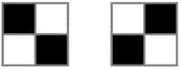

如果我们只使用像素颜色之间的“简单”差异，我们会遇到一个微妙的问题。计算第一个和第二个图像之间的差异将得到-255+255–255+255 = 0，与第一个图像和它自身之间的距离完全相同。这显然是不对的:第一幅图像显然与它自己完全相同，而第一幅和第二幅图像尽可能地不同，然而，根据这种度量，它们看起来同样相似！我们需要在这里使用绝对值的原因正是:没有绝对值，相反方向的差异最终会相互补偿，因此，完全不同的图像可能会出现非常高的相似性。绝对值保证我们不会有这个问题:任何差异都将根据其幅度受到惩罚，而不管其符号。

编写分类器

现在我们有了比较图像的方法，让我们从一个通用接口开始编写分类器。在每种情况下，我们都希望有一个两步过程:我们将通过输入一组已知的观察值来训练分类器，一旦完成，我们将希望能够预测图像的标签:

***清单 1-6*** 。分类器接口

```py
public interface IClassifier
{
    void Train(IEnumerable<Observation> trainingSet);
    string Predict(int[] pixels);
}
```

下面是我们实现前面描述的算法的多种方法之一:

***清单 1-7*** 。基本分类器实现

```py
public class BasicClassifier : IClassifier
{
    private IEnumerable<Observation> data;

    private readonly IDistance distance;

    public BasicClassifier(IDistance distance)
    {
        this.distance = distance;
    }

    public void Train(IEnumerable<Observation> trainingSet)
    {
        this.data = trainingSet;
    }

    public string Predict(int[] pixels)
    {
        Observation currentBest = null;
        var shortest = Double.MaxValue;

        foreach (Observation obs in this.data)
        {
            var dist = this.distance.Between(obs.Pixels, pixels);
            if (dist < shortest)
            {
                shortest = dist;
                currentBest = obs;
            }
        }

        return currentBest.Label;
    }
}
```

实现也是非常程序化的，但是应该不会太难理解。训练阶段只是将训练观察值存储在分类器中。为了预测一幅图像代表什么数字，该算法从训练集中查找每一个已知的观察值，计算它与它试图识别的图像有多相似，并返回最匹配图像的标签。相当简单！

那么，我们怎么知道它有效呢？

太好了——我们有一个分类器，一段闪亮的代码，可以对图像进行分类。我们完成了——出货！

没那么快！这里我们有一点问题:我们完全不知道我们的代码是否有效。作为一名软件工程师，知道“它是否工作”很容易。你带上你的眼镜(每个人都有眼镜，对吗？)，您编写测试(您当然会这么做)，您运行它们，然后嘭！你知道如果有什么东西坏了。但是我们在这里关心的不是“它是有效的”还是“它是坏的”，而是“我们的模型在预测方面有任何优势吗？”

交叉验证

一个自然的起点是简单地测量我们的模型执行任务的能力。在我们的例子中，这实际上是相当容易做到的:我们可以将图像输入分类器，要求一个预测，将其与真实答案进行比较，并计算我们有多少是正确的。当然，为了做到这一点，我们需要知道正确的答案是什么。换句话说，我们需要一个带有已知标签的图像数据集，并使用它来测试模型的质量。该数据集被称为**验证集**(有时简称为“测试数据”)。

此时，您可能会问，为什么不使用训练集本身呢？我们可以训练我们的分类器，然后在 5000 个例子中的每一个上运行它。这不是一个非常好的想法，原因如下:如果你这样做，你将衡量的是你的模型学习训练集的程度。我们真正感兴趣的是略有不同的东西:一旦我们把它“放在野外”，并开始给它提供从未遇到过的新图像，我们能指望分类器工作得多好？给它在训练中使用的图像可能会给你一个乐观的估计。如果你想要一个真实的，输入还没有使用的模型数据。

 **注意**作为一个恰当的例子，我们当前的分类器是一个有趣的例子，说明使用训练集进行验证可能会出错。如果你试着这样做，你会发现它能正确识别每一张图像。100%准确！对于这样一个简单的模型来说，这似乎好得难以置信。事情是这样的:当我们的算法在训练集中搜索最相似的图像时，它每次都能找到完美的匹配，因为我们测试的图像属于训练集。所以，当结果看起来好得不真实时，检查两次！

解决这个问题的一般方法叫做**交叉验证**。将现有的部分数据放在一边，分成训练集和验证集。用第一个来训练你的模型，用第二个来评估你的模型质量。

之前，您下载了两个文件，trainingsample.csv 和 validationsample.csv。我为您准备了这两个文件，这样您就不必下载了。训练集是来自完整的 50，000 个原始数据集中的 5，000 个图像的样本，验证集是来自相同来源的 500 个其他图像。正如我们将在后面的章节中看到的，有更多奇特的方法来进行交叉验证，也有一些潜在的陷阱要注意，但是简单地将数据分成两个独立的样本，比如 80%/20%，是一个简单有效的开始方法。

评估我们模型的质量

让我们编写一个类，通过计算正确分类的比例来评估我们的模型(或任何其他我们想尝试的模型):

***清单 1-8*** 。评估基本分类器的质量

```py
public class Evaluator
{
    public static double Correct(
        IEnumerable<Observation> validationSet,
        IClassifier classifier)
    {
        return validationSet
            .Select(obs => Score(obs, classifier))
            .Average();
    }

    private static double Score(
        Observation obs,
        IClassifier classifier)
    {
        if (classifier.Predict(obs.Pixels) == obs.Label)
            return 1.0;
        else
            return 0.0;
    }
}
```

我们在这里使用了一个小技巧:我们向评估器传递一个 IClassifier 和一个数据集，对于每幅图像，我们通过比较分类器预测的值和真实值来为预测“打分”。如果它们匹配，我们记录 1，否则我们记录 0。通过使用像这样的数字而不是真/假值，我们可以平均得出正确的百分比。

因此，让我们将所有这些放在一起，看看我们的超级简单分类器在提供的验证数据集 validationsample.csv 上表现如何:

***清单 1-9*** 。训练和验证一个基本的 C#分类器

```py
class Program
{
    static void Main(string[] args)
    {
        var distance = new ManhattanDistance();
        var classifier = new BasicClassifier(distance);

        var trainingPath = @"PATH-ON-YOUR-MACHINE\trainingsample.csv";
        var training = DataReader.ReadObservations(trainingPath);
        classifier.Train(training);

        var validationPath = @"PATH-ON-YOUR-MACHINE\validationsample.csv";
        var validation = DataReader.ReadObservations(validationPath);

        var correct = Evaluator.Correct(validation, classifier);
        Console.WriteLine("Correctly classified: {0:P2}", correct);

        Console.ReadLine();
    }
}
```

如果你现在运行这个程序，你应该得到 93.40%的正确率，这个问题远非无关紧要。我的意思是，我们正在自动识别人类手写的数字，而且相当可靠！还不错，尤其是考虑到这是我们的第一次尝试，我们有意让事情变得简单。

改进您的模型

那么，下一步是什么？嗯，我们的模型很好，但为什么就此止步呢？毕竟，我们离 100%正确的圣杯还很远——我们能挤进一些聪明的改进并得到更好的预测吗？

这就是拥有一个验证集绝对重要的地方。就像单元测试给你一个安全措施，当你的代码偏离轨道时警告你，验证集为你的模型建立了一个基线，它允许你不盲目地飞行。你现在可以自由地试验建模想法，你可以得到一个明确的信号，这个方向是有前途的还是可怕的。

在这个阶段，您通常会选择两条路径中的一条。如果你的模型足够好，你就可以收工了——你完成了。如果还不够好，您可以开始考虑改进预测的方法，创建新模型，并根据验证集运行它们，比较正确分类的百分比，以评估新模型是否更好，逐步完善您的模型，直到您满意为止。

但是在开始尝试改进我们的模型之前，现在似乎是引入 F#的最佳时机。F#是一个奇妙的。NET 语言，特别适合机器学习和数据科学；这将使我们的模型实验工作变得更加容易。现在我们有了一个可用的 C#版本，让我们开始用 F#重写它，这样我们就可以比较和对比这两个版本，更好地理解 F#的方式。

机器学习的 F#介绍

你注意到运行我们的模型花了多少时间了吗？为了查看模型的质量，在任何代码更改之后，我们需要重新构建控制台应用程序并运行它，重新加载数据，然后进行计算。这需要很多步骤，如果您的数据集变得相当大，您将花费一天中的大部分时间来等待数据加载。不太好。

使用 F# Interactive 进行实时脚本编写和数据探索

相比之下，F#附带了一个非常方便的特性，在 Visual Studio 中称为 F# Interactive。F# Interactive 是一个 REPL (Read-Evaluate-Print Loop)，基本上是一个实时脚本环境，您可以在其中玩代码，而不必经历我之前描述的整个循环。

因此，我们将在脚本中工作，而不是控制台应用程序。让我们进入 Visual Studio，在我们的解决方案中添加一个新的库项目(见[图 1-7](#Fig7) )，我们将其命名为 FSharp。

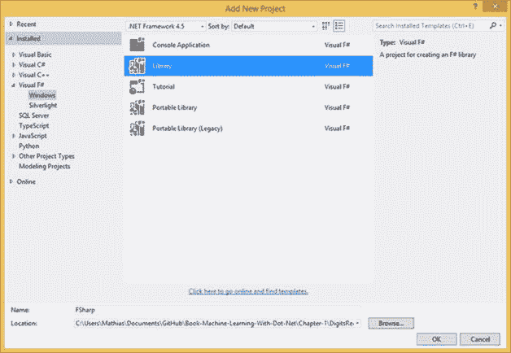

[图 1-7](#_Fig7) 。添加 F#库项目

 **提示**如果使用 Visual Studio Professional 或更高版本开发，默认情况下应该安装 F#。其他情况，请查看 F#软件基金会的[www.fsharp.org](http://www.fsharp.org)，那里有全面的设置指导。

值得指出的是，您刚刚将一个 F#项目添加到一个带有现有 C#项目的. NET 解决方案中。F#和 C#是完全可互操作的，可以毫无问题地相互交流——您不必限制自己在所有事情上都使用一种语言。不幸的是，人们经常认为 C#和 F#是相互竞争的语言，但事实并非如此。它们很好地相互补充，所以要两全其美:用 C#做 C#擅长的事，用 F#的长处做 F#的亮点！

在您的新项目中，您现在应该看到一个名为 Library1.fs 的文件。这是相当于. cs 文件的 F#代码。但是你有没有注意到一个叫做 script.fsx 的文件？。fsx 文件是脚本文件；不像。fs 文件，它们不是构建的一部分。它们可以在 Visual Studio 之外作为纯粹的独立脚本使用，这本身就非常有用。在我们目前的背景下，机器学习和数据科学，我特别感兴趣的用法是在 Visual Studio:。fsx 文件构成了一个奇妙的“便笺本”,您可以在其中试验代码，并享受智能感知的所有好处。

让我们转到 Script.fsx，删除那里的所有内容，并在任何地方简单地键入以下内容:

```py
let x = 42
```

现在选择您刚刚输入的行并右键单击。在您的上下文菜单中，您会看到一个“交互执行”选项，如图[图 1-8](#Fig8) 所示。

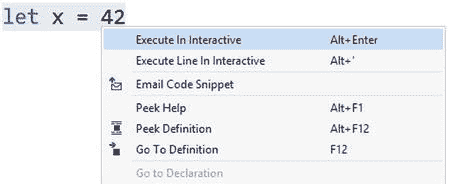

[图 1-8](#_Fig8) 。选择要交互运行的代码

继续——你应该看到结果出现在一个标有“F# Interactive”的窗口中([图 1-9](#Fig9) )。

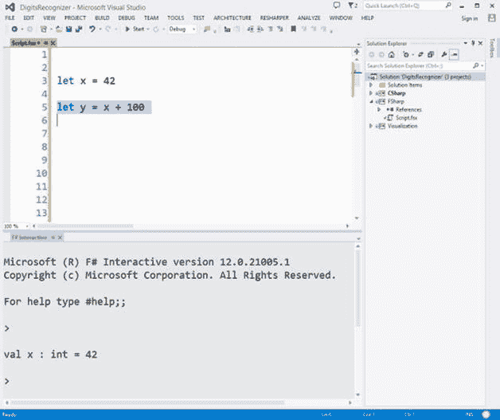

[图 1-9](#_Fig9) 。在 F# Interactive 中实时执行代码

 **提示**您也可以使用快捷键 Alt + Enter 来执行脚本文件中选择的任何代码。这比使用鼠标和上下文菜单要快得多。给 ReSharper 用户一个小小的警告:直到最近，ReSharper 都有重设快捷键的坏习惯，所以如果你使用的是 8.1 以前的版本，你可能需要重新创建快捷键。

F#交互窗口(为了简洁起见，我们大部分时间称之为 FSI)作为一个会话运行。也就是说，无论您在交互窗口中执行什么，都将保留在内存中，直到您通过右键单击 F#交互窗口的内容并选择“重置交互会话”来重置会话为止

在这个例子中，我们简单地创建了一个值为 42 的变量 x。作为第一个近似值，这很大程度上类似于 C#语句 var x = 42 有一些细微的区别，但我们稍后会讨论它们。既然 x 在 FSI“存在”，我们可以继续使用它。例如，您可以在 FSI 中直接键入以下内容:

```py
> x + 100;;
val it : int = 142
>
```

FSI“记得”x 的存在:你不需要重新运行你在。fsx 文件。一旦运行了一次，它就保留在内存中。当您想要操作较大的数据集时，这是非常方便的。有了 FSI，你可以在早上加载一次数据，然后继续编码，而不必像 C#那样，每次修改都要重新加载。

你可能注意到了神秘；；x + 100 之后。这向 FSI 表明，无论在那之前输入了什么，现在都需要执行。例如，如果您想要执行的代码跨越多行，这将非常有用。

 **提示**如果你试图在 FSI 中直接输入 F#代码，你可能会发现没有智能感知。与完整的 Visual Studio 体验相比，FSI 是一个有些原始的开发环境。就过程而言，我的建议是尽量少在 FSI 输入代码。相反，主要在。fsx 文件。您将获得现代 IDE 的所有好处，例如自动完成和语法验证。这自然会让你写出完整的脚本，然后可以在将来重播。虽然脚本不是解决方案构建的一部分，但是它们是解决方案本身的一部分，并且也可以(应该)被版本化，以便您总是能够复制您在脚本中进行的任何实验。

创建我们的第一个 F#脚本

既然我们已经了解了 FSI 的基本情况，让我们开始吧。我们将转换我们的 C#示例，从读取数据开始。首先，我们将执行一个完整的 F#代码块，看看它做了什么，然后我们将详细检查它，看看它是如何工作的。让我们删除 Script.fsx 中的所有内容，并编写清单 1-10 : 中的 F#代码

[***清单 1-10***](#_list10) 。从文件中读取数据

```py
open System.IO
type Observation = { Label:string; Pixels: int[] }

let toObservation (csvData:string) =
    let columns = csvData.Split(',')
    let label = columns.[0]
    let pixels = columns.[1..] |> Array.map int
    { Label = label; Pixels = pixels }

let reader path =
    let data = File.ReadAllLines path
    data.[1..]
    |> Array.map toObservation

let trainingPath = @"PATH-ON-YOUR-MACHINE\trainingsample.csv"
let trainingData = reader trainingPath
```

在 F#的这几行中有相当多的动作在进行。在讨论这一切是如何工作的之前，让我们运行它来看看我们手工的结果。选择代码，右键单击，然后选择“以交互方式运行”几秒钟后，您应该会在 F#交互式窗口中看到类似这样的内容:

```py
>
type Observation =
  {Label: string;
   Pixels: int [];}
val observationFactory : csvData:string -> Observation
val reader : path:string -> Observation []
val trainingPath : string =
  "-"+[58 chars]
val trainingData : Observation [] =
  [|{Label = "1";
     Pixels =
      [|0; 0; 0; 0; 0; 0; 0; 0; 0; 0; 0; 0; 0; 0; 0; 0; 0; 0; 0; 0; 0; 0; 0; 0;
        0; 0; 0; 0; 0; 0; 0; 0; 0; 0; 0; 0; 0; 0; 0; 0; 0; 0; 0; 0; 0; 0; 0; 0;
        0; 0; 0; 0; 0; 0; 0; 0; 0; 0; 0; 0; 0; 0; 0; 0; 0; 0; 0; 0; 0; 0; 0; 0;
        0; 0; 0; 0; 0; 0; 0; 0; 0; 0; 0; 0; 0; 0; 0; 0; 0; 0; 0; 0; 0; 0; 0; 0;
        0; 0; 0; 0; ...|];};
    /// Output has been cut out for brevity here ///
    {Label = "3";
     Pixels =
      [|0; 0; 0; 0; 0; 0; 0; 0; 0; 0; 0; 0; 0; 0; 0; 0; 0; 0; 0; 0; 0; 0; 0; 0;
        0; 0; 0; 0; 0; 0; 0; 0; 0; 0; 0; 0; 0; 0; 0; 0; 0; 0; 0; 0; 0; 0; 0; 0;
        0; 0; 0; 0; 0; 0; 0; 0; 0; 0; 0; 0; 0; 0; 0; 0; 0; 0; 0; 0; 0; 0; ...|];};
    ...|]

>
```

基本上，在十几行 F#代码中，我们获得了 DataReader 和 Observation 类的所有功能。通过在 F# Interactive 中运行它，我们可以立即加载数据并查看它的外观。在这一点上，我们在 F#交互会话中加载了一个观察数组(数据),它将在那里停留您想要的时间。例如，假设您想知道训练集中观察值 100 的标签。无需重新加载或重新编译任何东西:只需在 F#交互式窗口中键入以下内容，然后执行:

```py
let test = trainingData.[100].Label;;
```

仅此而已。因为数据已经存在于内存中，所以它只能工作。

这是非常方便的，尤其是在数据集很大并且加载它很耗时的情况下。这是在以数据为中心的工作中使用 F#而不是 C#的一个显著优势:虽然 C#控制台应用程序中的任何代码更改都需要重新构建和重新加载数据，但是一旦数据被加载到 F# Interactive 中，您就可以随心所欲地修改内容了。你可以修改你的代码并进行实验，而不需要重新加载。

剖析我们的第一个 F#脚本

既然我们已经看到了这十行代码的作用，让我们深入了解它们是如何工作的:

```py
open System.IO 
```

这一行很简单，相当于使用 System.IO. Every 的 C#语句。NET 库可以用 F#访问，这样你多年学习积累的所有知识。NET 名称空间丛林并没有消失——您将能够重用所有这些，并使用一些 F#特有的好东西来扩充它！

在 C#中，我们创建了一个观察类来保存数据。让我们在 F#中做同样的事情，使用稍微不同的类型:

```py
type Observation = { Label:string; Pixels: int[] }
```

嘣——搞定。在一行中，我们创建了一个*记录*(一种特定于 F#的类型)，它本质上是一个不可变的类(如果从 C#中调用 F#代码，它也会如此)，具有两个属性:Label 和 Pixels。使用记录就像这样简单:

```py
let myObs = { Label = "3"; Pixels = [| 1; 2; 3; 4; 5 |] }
```

我们通过简单地打开花括号并填充它的所有属性来实例化一个观察。F#自动推断出我们需要的是一个观察值，因为它是唯一具有正确属性的记录类型。我们通过简单地用符号[| |]打开和关闭一个数组并填充内容来为像素创建一个整数数组。

现在我们有了数据容器，让我们从 CSV 文件中读取数据。在 C#示例中，我们创建了一个方法、ReadObservations 和一个 DataReader 类来保存它，但是老实说，这个类并没有为我们做多少事情。因此，与其创建一个类，我们不如简单地编写一个函数读取器，它接受一个参数 path，并使用一个辅助函数从 csv 行中提取一个观察值:

```py
let toObservation (csvData:string) =
    let columns = csvData.Split(',')
    let label = columns.[0]
    let pixels = columns.[1..] |> Array.map int
    { Label = label; Pixels = pixels }

let reader path =
    let data = File.ReadAllLines path
    data.[1..]
    |> Array.map toFactory
```

我们在这里使用了相当多的 F#特性——让我们解开它们。这有点难懂，但是一旦你读完了，你就会知道 80%你需要了解的关于 F#的东西，以便用它有效地进行数据科学！

让我们从高层次的概述开始。下面是我们等价的 C#代码的样子([清单 1-2](#list2) ):

```py
private static Observation ObservationFactory(string data)
{
    var commaSeparated = data.Split(',');
    var label = commaSeparated[0];
    var pixels =
        commaSeparated
        .Skip(1)
        .Select(x => Convert.ToInt32(x))
        .ToArray();

    return new Observation(label, pixels);
}

public static Observation[] ReadObservations(string dataPath)
{
    var data =
        File.ReadAllLines(dataPath)
        .Skip(1)
        .Select(ObservationFactory)
        .ToArray();

    return data;
}
```

C#和 F#之间有一些明显的区别。第一，F#没有任何花括号；与 Python 等其他语言一样，F#使用空格来标记代码块。换句话说，空白在 F#代码中是有意义的:当你看到代码被空白缩进，深度相同，那么它属于同一个块，就好像看不见的花括号在它周围。对于清单 1-10 中的 reader 函数，我们可以看到函数体从 let 数据开始...并以|>array . map observation factory 结尾。

另一个明显的高级差异是函数参数缺少返回类型或类型声明。这是否意味着 F#是一种动态语言？如果您将鼠标悬停在。fsx 文件中，您将看到下面的提示:val reader:path:string-> Observation[]，它表示一个接受路径的函数，类型应为 string，并返回一个观察值数组。F#完全像 C#一样是静态类型的，但是使用了一个强大的类型推理引擎，它将使用每一个可用的提示来自己计算出正确的类型。在这种情况下，文件。ReadAllLines 只有两个重载，唯一可能的匹配意味着 path 必须是一个字符串。

在某种程度上，这给了你一个两全其美的世界——你得到了更少代码的所有好处，就像使用动态语言一样，但是你也有了一个可靠的类型系统，编译器帮助你避免愚蠢的错误。

提示 F #类型推理系统绝对能够通过最轻微的暗示来理解你的意思。然而，有时你需要帮助它，因为它自己不能解决问题。在这种情况下，您可以简单地用预期的类型进行注释，就像这样:let reader (path:string) =。一般来说，我建议在代码的高级组件或关键组件中使用类型注释，即使这是不必要的。它有助于使代码的意图对其他人来说更加明显，而不必打开 IDE 来查看推断的类型。通过确保当您将多个函数组合在一起时，每个步骤实际上都被传递了它所期望的类型，它还可以用于跟踪一些问题的根源。

C#和 F#之间另一个有趣的区别是缺少 return 语句。与 C#不同，C #主要是过程化的，F#是面向表达式的。像 let x = 2 + 3 * 5 这样的表达式，把名字 x 绑定到一个表达式上；当该表达式被计算为(2 + 3 * 5 是 17)时，该值被绑定到 x。这同样适用于函数:函数将计算最后一个表达式的值。这里有一个人为的例子来说明正在发生的事情:

```py
let demo x y =
    let a = 2 * x
    let b = 3 * y
    let z = a + b
    z // this is the last expression:
      // therefore demo will evaluate to whatever z evaluates to.
```

另一个你可能已经注意到的区别是参数周围没有括号。让我们暂时忽略这一点，但我们将在本章的稍后部分再回到这一点。

创建函数管道

让我们深入到 read 函数的主体。让数据=文件。ReadAllLines path 简单地将位于 path 的文件的所有内容读入一个字符串数组，一次一行。这里没有魔法，但它证明了一点，我们确实可以使用。NET framework 从 F#开始，不管用什么语言编写它。

数据。[1..]说明了 F#中索引器的语法；缅甸。[0]将返回数组的第一个元素。请注意 myArray 和括号中的索引之间有一个点！这里另一个有趣的语法演示了数组切片；数据。[1..]表示“给我一个新数组，从索引 1 开始提取数据元素，直到最后一个。”类似地，你可以做像数据这样的事情。[5..10](给我从索引 5 到 10 的所有元素)，或数据。[..3](给我所有元素，直到索引 3)。这对于数据操作来说非常方便，这也是 F#成为数据科学如此好的语言的原因之一。

在我们的例子中，我们保留了从索引 1 开始的每个元素，换句话说，我们删除了数组的第一个元素——也就是头。

C#代码中的下一步涉及到使用 ObservationFactory 方法从每一行中提取一个观察值，我们通过使用以下方法来完成:

```py
myData.Select(line => ObservationFactory(line));
```

F#中的等效行如下:

```py
myData |> Array.map (fun line -> toObservation line)
```

在一个非常高的层次上，您可以将该语句理解为“获取数组 myData 并将其传递给一个函数，该函数将对每个数组元素应用映射，将每一行转换为一个观察值。”C#代码有两个重要的区别。首先，虽然 Select 语句在我们操作的数组上显示为一个方法，但在 F#中，函数的逻辑所有者不是数组本身，而是数组模块。Array 模块的行为方式类似于 Enumerable 类，后者提供了 IEnumerable 上的 C#扩展方法的集合。

 **注**如果你喜欢在 C#中使用 LINQ，我怀疑你会真的喜欢 F#。在许多方面，LINQ 是关于将函数式编程的概念引入面向对象语言 C#的。F#提供了一套更深入的类似 LINQ 的函数供你使用。要理解这一点，只需键入“Array”英寸 fsx，看看你有多少函数供你使用！

第二个主要区别是神秘的符号“| >”。这被称为*管道转发*操作符。简而言之，它接受前一个表达式的结果，并将其传递给管道中的下一个函数，后者将使用它作为最后一个参数。例如，考虑下面的代码:

```py
let double x = 2 * x
let a = 5
let b = double a
let c = double b
```

这可以改写如下:

```py
let double x = 2 * x
let c = 5 |> double |> double
```

double 是一个需要单个整数参数的函数，所以我们可以通过管道转发操作符直接给它“输入”一个 5。因为 double 也会产生一个整数，所以我们可以继续向前转发运算的结果。我们可以稍微重写这段代码，使其看起来像这样:

```py
let double x = 2 * x
let c =
    5
    |> double
    |> double
```

我们的 Array.map 示例遵循相同的模式。如果我们使用原始的 Array.map 版本，代码将如下所示:

```py
let transformed = Array.map (fun line -> toObservation line) data
```

Array.map 需要两个参数:应用于每个数组元素的转换，以及应用于哪个数组。因为目标数组是函数的最后一个参数，所以我们可以使用 pipe-forward 将数组“输入”到映射中，如下所示:

```py
data |> Array.map (fun line -> toObservation line)
```

如果你对 F#完全陌生，这可能有点让人不知所措。放心吧！随着我们的深入，我们将会看到更多 F#的实际例子，虽然理解事情为什么会这样可能需要一点时间，但是让它工作起来实际上是相当容易的。管道转发操作符是我在 F#中最喜欢的特性之一，因为它使得工作流非常简单易懂:获取某样东西，并通过一系列步骤或操作传递它，直到完成。

用元组和模式匹配操作数据

现在我们有了数据，我们需要从训练集中找到最接近的图像。就像在 C#的例子中，我们需要一个距离。与 C#不同，我们不会创建类或接口，而只会使用一个函数:

```py
let manhattanDistance (pixels1,pixels2) =
    Array.zip pixels1 pixels2
    |> Array.map (fun (x,y) -> abs (x-y))
    |> Array.sum 
```

这里我们使用了 F#的另一个核心特性:元组和模式匹配的组合。一个*元组*是一组未命名但有序的值，可能有不同的类型。元组在 C#中也存在，但是语言中缺乏模式匹配确实削弱了它们的有用性，这是非常不幸的，因为它是数据操作的致命组合。

模式匹配不仅仅是元组。一般来说，模式匹配是一种机制，允许您的代码简单地识别数据中的各种形状，并基于此采取行动。下面是一个小例子，说明模式匹配如何作用于元组:

```py
let x = "Hello", 42 // create a tuple with 2 elements
let (a, b) = x // unpack the two elements of x by pattern matching
printfn "%s, %i" a b
printfn "%s, %i" (fst x) (snd x)
```

这里我们在 x 中“打包”了两个元素:一个字符串“Hello”和一个整数 42，用逗号分隔。逗号通常表示一个元组，所以在 F#代码中要注意这一点，因为这一开始可能会有点混乱。第二行“解包”元组，将它的两个元素检索为 a 和 b。对于两个元素的元组，存在一个特殊的语法来使用 fst 和 snd 函数访问它的第一个和第二个元素。

 **提示**你可能已经注意到，与 C#不同，F#不使用括号来定义函数期望的参数列表。举个例子，add x y = x + y 就是你通常写加法函数的方式。下面的函数 tupleAdd (x，y) = x + y 是完全有效的 F#代码，但有不同的含义:它需要一个参数，这是一个完全格式的元组。因此，虽然 1 | > add 2 是有效的代码，但是 1 | > tupleAdd 2 将无法编译，但是(1，2) | > tupleAdd 可以工作。

这种方法扩展到两个元素之外的元组；主要区别在于它们不支持 fst 和 snd。请注意通配符 _ below 的使用，它表示“忽略第二个位置的元素”:

```py
let y = 1,2,3,4
let (c,_,d,e) = y
printfn "%i, %i, %i" c d e
```

让我们看看这在 manhattanDistance 函数中是如何工作的。我们获取两个像素数组(图像)并应用 Array.zip，创建一个元组数组，其中相同索引的元素被配对在一起。一个简单的例子可能有助于澄清:

```py
let array1 = [| "A";"B";"C" |]
let array2 = [| 1 .. 3 |]
let zipped = Array.zip array1 array2
```

在 FSI 运行该程序应该会产生以下输出，这是不言自明的:

```py
val zipped : (string * int) [] = [|("A", 1); ("B", 2); ("C", 3)|]
```

因此，曼哈顿距离函数所做的是采用两个数组，将相应的像素配对，并对每一对计算其差值的绝对值，然后将它们相加。

训练和评估分类器函数

现在我们有了曼哈顿距离函数，让我们在训练集中搜索与我们要分类的图像最接近的元素:

```py
let train (trainingset:Observation[]) =
    let classify (pixels:int[]) =
        trainingset
        |> Array.minBy (fun x -> manhattanDistance x.Pixels pixels)
        |> fun x -> x.Label
    classify

let classifier = train training
```

训练是一种期望一系列观察函数。在这个函数中，我们创建了另一个函数 classifier，它获取一个图像，找到与目标距离最小的图像，并返回最接近的候选图像的标签；训练返回该函数。还要注意，虽然 manhattanDistance 不是 train 函数的参数列表的一部分，但我们仍然可以在函数中使用它；这被称为“将变量捕获到闭包中”，在函数中使用其作用域没有在函数中定义的变量。还要注意 minBy 的用法(这在 C#或 LINQ 中不存在)，它方便地允许我们找到数组中的最小元素，使用我们想要的任意函数来相互比较项目。

创建模型现在就像调用 train training 一样简单。

如果将鼠标悬停在分类器上，您会看到它具有以下类型:

```py
val classifier : (int [] -> string)
```

这告诉你 classifier 是一个函数，它接受一个整数数组(你试图分类的图像的像素)，并返回一个字符串(预测的标签)。总的来说，我强烈建议花些时间仔细检查你的代码，确保类型是你认为的类型。F#类型的推理系统很棒，但有时它几乎太聪明了，它会设法找出一种方法让你的代码工作，只是不总是以你预期的方式。

我们差不多完成了。现在让我们验证我们的分类器:

```py
let validationPath = @" PATH-ON-YOUR-MACHINE\validationsample.csv"
let validationData = reader validationPath

validationData
|> Array.averageBy (fun x -> if model x.Pixels = x.Label then 1\. else 0.)
|> printfn "Correct: %.3f"
```

这是我们的 C#代码的一个非常简单的转换:我们读取验证数据，用 1 标记每个正确的预测，然后计算平均值。完成了。

仅此而已。在一个文件中，大约 30 行代码，我们拥有所有需要的代码。

显然，F#比我们刚刚在这个简短的速成课程中看到的要多得多。然而，在这一点上，你应该对 F#有更好的理解，为什么它如此适合机器学习和数据科学。代码很短，但可读性很好，非常适合编写数据转换管道，这是机器学习中的一项基本活动。F#交互式窗口允许您将数据一次性加载到内存中，然后探索数据和建模思想，而无需浪费时间重新加载和重新编译。这本身就是一个巨大的好处——但是随着本书的深入，我们将看到更多关于 F#的内容，以及如何将其功能与 C#结合起来！

改进我们的模型

我们实现了最愚蠢的模型，它实际上运行得相当好——93.4%正确。我们能做得更好吗？

不幸的是，对此没有普遍的答案。除非你的模型预测已经 100%正确，否则总有改进的可能，而知道的方法只有一个:试一试，看看是否可行。建立一个好的预测模型需要大量的试验和错误，正确设置以快速迭代、实验和验证想法是至关重要的。

我们可以探索哪些方向？我能马上想到几个。我们可以

*   调整距离函数。我们在这里使用的曼哈顿距离只是许多可能性中的一种，选择“正确的”距离函数通常是拥有一个好模型的关键要素。距离函数(或成本函数)本质上是你如何向机器传达在它的世界中它应该认为是相似或不同的项目，因此仔细考虑这一点非常重要。
*   寻找一些最近的点，而不是只考虑一个最近的点，并采取“多数投票”这可以使模型更加稳健；多看几个候选人可以减少我们不小心选错的机会。这种方法有一个名字——这种算法被称为“K 近邻”，是机器学习的经典。
*   在图像上做一些巧妙的欺骗；例如，想象拍摄一张照片，但是将它向右移动一个像素。如果你将这张图片与原始版本进行比较，尽管它们是同一张图片，但差距可能会很大。我们可以补偿这个问题的一个方法是，例如，使用一些模糊。用相邻像素的平均颜色替换每个像素可以缓解“图像错位”问题。

我相信你也能想到其他的主意。让我们一起来探索第一个。

尝试距离的另一种定义

让我们从距离开始。试试你可能在高中见过的距离，学究式地称为**欧几里德距离**怎么样？以下是这段距离的数学公式:

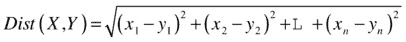

简单地说，两点 X 和 Y 之间的距离是它们各自坐标之差的平方和的平方根。你可能见过这个公式的简化版本，它指出如果你取平面上的两点，X = (x1，x2)和 Y = (y1，y2)，它们的欧几里德距离是:

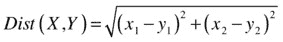

如果你对代码比对数学更熟悉，下面是它在 F#中的样子:

```py
let euclideanDistance (X,Y) =
    Array.zip X Y
    |> Array.map (fun (x,y) -> pown (x-y) 2)
    |> Array.sum
    |> sqrt
```

我们将两个浮点数组作为输入(每个数组代表一个点的坐标)，计算每个元素的差，求平方，求和，然后求平方根。不是很难，而且很清楚！

这里应该提到几个技术细节。首先，F#内置了很多很好的数学函数，你通常会在系统中找到这些函数。数学课。sqrt 就是这样一个函数——能够写出 let x = sqrt 16.0 而不是 var x = Math 不是很好吗？Sqrt(16)？pown 是另一个这样的函数；对于指数为整数的情况，它是“自乘 n 次方”的特殊版本。一般版本是**运算符，如在 let x = 2.0 * * 4.0 当你知道指数是一个整数时，pown 会给你显著的性能提升。

另一个细节:我们这里的距离函数是正确的，但是从技术上来说，对于我们的目的，我们实际上可以从那里删除 sqrt。我们需要的是最近的点，如果 0 <= A < B，那么 sqrt A < sqrt B。因此，与其产生该操作的成本，不如放弃它。这也允许我们对整数进行操作，这比 doubles 或 floats 要快得多。

分解出距离函数

如果我们的目标是试验不同的模型，这可能是做一些重构的好时机。我们希望交换代码中的不同部分，看看对预测质量有什么影响。具体来说，我们希望转换距离。典型的面向对象方法是提取一个接口，比如说 IDistance，并将其注入到训练中(这正是我们在 C#示例中所做的)。然而，如果你仔细想想，这个接口完全是多余的——我们唯一需要的是一个函数，它将两个点作为输入，并返回一个整数，即它们彼此之间的距离。我们可以这样做:

***清单 1-11*** 。重构距离

```py
type Distance = int[] * int[] -> int
let manhattanDistance (pixels1,pixels2) =
    Array.zip pixels1 pixels2
    |> Array.map (fun (x,y) -> abs (x-y))
    |> Array.sum

let euclideanDistance (pixels1,pixels2) =
    Array.zip pixels1 pixels2
    |> Array.map (fun (x,y) -> pown (x-y) 2)
    |> Array.sum

let train (trainingset:Observation[]) (dist:Distance) =
    let classify (pixels:int[]) =
        trainingset
        |> Array.minBy (fun x -> dist (x.Pixels, pixels))
        |> fun x -> x.Label
    classify
```

我们没有创建接口，而是创建了一个类型距离，它是一个函数签名，期望一对像素并返回一个整数。现在，我们可以将任何想要的距离作为参数传递给 train 函数，该函数将使用该特定距离返回一个分类器。例如，我们可以用 manhattanDistance 函数或 euclideanDistance 函数(或任何其他任意距离函数，如果我们想进一步实验的话)训练一个分类器，并比较它们的性能。注意，这在 C#中也是完全可能的:我们可以简单地使用 Func <int>，而不是创建一个接口 IDistance。我们的代码看起来是这样的:</int>

***清单 1-12*** 。函数式 C#示例

```py
public class FunctionalExample
{
    private IEnumerable<Observation> data;

    private readonly Func<int[], int[], int> distance;

    public FunctionalExample(Func<int[], int[], int> distance)
    {
        this.distance = distance;
    }

    public Func<int[], int[], int> Distance
    {
        get { return this.distance; }
    }

    public void Train(IEnumerable<Observation> trainingSet)
    {
        this.data = trainingSet;
    }

    public string Predict(int[] pixels)
    {
        Observation currentBest = null;
        var shortest = Double.MaxValue;

        foreach (Observation obs in this.data)
        {
            var dist = this.Distance(obs.Pixels, pixels);
            if (dist < shortest)
            {
                shortest = dist;
                currentBest = obs;
            }
        }

        return currentBest.Label;
    }
}
```

这种侧重于组合函数而不是对象的方法是典型的函数式编程风格。C#虽然来自面向对象的根源，但它支持大量的函数式习惯用法。可以说，自 3.5 版本以来，几乎所有的特性和创新都融入了 C#中(LINQ、异步、...)一直借用自函数式编程。在这一点上，人们可以将 C#描述为首先面向对象，但支持函数式习惯用法的语言，而 F#首先是函数式编程语言，但也可以适应面向对象的风格。在本书中，我们一般会强调函数式风格而非面向对象风格，因为在我们看来，函数式风格比面向对象风格更适合机器学习算法，也因为，更一般地说，用函数式风格编写的代码提供了很多好处。

无论如何，我们准备看看我们的想法是不是一个好主意。我们现在可以创建两个模型并比较它们的性能:

```py
let manhattanClassifier = train trainingData manhattanDistance
let euclideanClassifier = train trainingData euclideanDistance

printfn "Manhattan"
evaluate validationData manhattanClassifier
printfn "Euclidean"
evaluate validationData euclideanClassifier
```

这里的好处是我们不必在内存中重新加载数据集；我们只需修改脚本文件，选择包含要运行的新代码的部分，然后运行它。如果我们这样做了，我们应该看到新的模型 euclideanModel 正确地分类了 94.4%的图像，而不是曼哈顿模型的 93.4%。不错！我们刚刚取得了 1%的进步。1%听起来可能不算多，但是如果你已经达到了 93.4%，你就把你的误差从 6.6%减少到了 5.6%，增加了大约 15%。

从距离函数的微小变化中，我们获得了非常显著的改进。这似乎是一个很有前途的方向，值得尝试更复杂的距离函数，或者尝试前面提到的其他方向。如果你不注意的话，有一件事可能会发生在你身上，那就是你将会有一大碗杂乱的代码，还有大量的实验。正如版本控制和自动化对于经典软件开发是必不可少的一样，当您开发预测模型时，它们也是您的朋友。过程的细节和节奏可能会有所不同，但总体思想是相同的:您希望能够在不担心会破坏任何东西的情况下更改代码，并且“它在我的机器上工作”是不够的。在任何时候，任何人都应该能够抓取您的代码并复制您的结果，而无需手动干预。这种方法被称为“可重复研究”我强烈建议你朝这个方向努力，尽可能地使用脚本和源代码控制；我自己也经历过这种可怕的场景，你知道你昨天有一个工作得更好的模型，但因为你没有费心干净地保存东西，你只是不记得你到底是怎么做的，那个模型就不见了。不要成为那个人！特别是在这个时代，用 DVCS 创建像 Git 或 Mercurial 这样的分支是如此容易，没有理由出现这种问题。当您对模型有了新的想法时，创建一个分支，并将您执行的步骤保存在脚本中。

那么，我们学到了什么？

我们在这一章中涉及了相当多的内容。在机器学习方面，您现在已经熟悉了一些关键概念和方法。如果您是 F#的新手，那么您现在已经编写了您的第一段 F#代码！

让我们回顾一些要点，从机器学习方面开始。

首先，我们讨论了交叉验证，即使用单独的数据集进行训练和验证的过程，将一些数据分离出来以评估预测模型的质量。这在许多层面上都是一个至关重要的过程。首先，它为你提供了一个基线，一个指导你实验的“基本事实”。如果没有验证集，您就无法判断某个特定模型是否优于另一个模型。交叉验证允许你科学地测量质量。它扮演的角色有点类似于自动化测试套件，当您的开发工作偏离轨道时，它会向您发出警告。

一旦您的交叉验证设置就绪，您就可以尝试进行实验，选择模型或方向，根据可量化的理由进行研究。试错法是“进行机器学习”的重要组成部分。没有办法事先知道一种特定的方法是否会很好地工作，所以你必须亲自在数据上进行尝试，这使得为成功做好准备并接受“可重复研究”的想法变得非常重要。使用脚本尽可能地自动化您的过程，并且自由地使用源代码控制，以便在任何给定的点上，您都可以复制您的模型的每一步，而无需人工干预。一般来说，设置好自己，这样你就可以轻松地修改和运行代码。

在一个好的距离函数中寻找什么

在我们的数字识别探索中，我们看到我们使用的距离的一个小变化显著地改进了我们的模型。在大多数(每？)机器学习模型，有距离功能。所有的学习过程都可以归结为计算机试图找到可能的最佳方式来拟合已知数据以解决特定问题——“最佳拟合”的定义完全包含在距离函数中。在某种程度上，它是将你的目标从人类的形式翻译成机器可以理解的语句，用数学来表述。距离函数也经常被称为成本函数；在成本方面的思考更多地强调是什么使得坏的解决方案变坏，以及使用什么惩罚来避免选择坏的解决方案。

以我的经验来看，花时间思考你的成本函数总是值得的。不管你用了多聪明的算法，如果代价函数有缺陷，结果会很可怕。想象一个包含两个测量值的个体数据集:身高(英尺)和体重(磅)。如果我们要在我们的数据集中搜索“最相似”的个体，沿着我们对图像所做的线，下面将会发生什么:虽然身高通常在 5 到 6 英尺的范围内，但体重在更宽更高的范围内，比如说，100 到 200 磅。因此，基于这两个测量值直接计算距离将基本上忽略身高的差异，因为 1 英尺的差异将相当于 1 磅的差异。解决这一问题的一种方法是变换所有要素以确保它们的比例一致，这一过程称为“归一化”，我们将在后面更详细地讨论这一主题。幸运的是，所有像素都以相同的比例编码，我们可以忽略这个问题，但我希望这个“距离出错”的例子能让你明白为什么值得考虑一下距离函数！

这也是正确的数学定义实际上有用的情况之一。如果你追溯你在学校的数学笔记，你会发现距离函数(有时也被数学家称为度量)是由几个属性定义的:

*   距离(A，B) > 0(没有负距离)
*   Distance(A，B) = 0 当且仅当 A = B(到 A 的距离为 0 的唯一元素是 A 本身)
*   距离(A，B) =距离(B，A)(对称性:从 A 到 B 应该与从 B 到 A 的长度相同)
*   距离(A，B) <=距离(A，C) +距离(C，B)(“三角形不等式”:两点之间没有比直行更短的距离)

在这一章中，我们只看了两个距离，但是有各种各样的函数满足这些属性，每个函数以不同的方式定义相似性。就此而言，模型中的成本函数不需要满足所有这些属性，但一般来说，如果不满足，您可能会问自己会因此产生哪些意想不到的副作用。例如，在最初的曼哈顿距离的例子中，如果我们忽略了绝对值，我们将公然违反规则 1(非负距离)和规则 3(对称性)。在某些情况下，有很好的理由采取自由和使用一个函数不是一个指标，但当这种情况发生时，花额外的一分钟来思考什么可能会出错！

模型不一定要复杂

最后，我希望通过的是，有效的模型不必复杂！无论是在 C#还是 F#中，这两种分类器都很小，并且使用相当简单的数学。当然，一些复杂的模型也可能给你惊人的结果，但是如果你可以用一个简单的模型得到同样的结果，你可以很容易地理解和修改，那么为什么不试着简单一点呢？

这就是著名的奥卡姆剃刀，以中世纪哲学家奥卡姆的威廉命名。奥卡姆剃刀遵循经济原则。当试图解释某事时，当在多个合适的模型中选择时，选择最简单的一个。只有当简单的解释不起作用时，你才应该去寻找复杂的模型。

同样，我们在这里首先实现了“可能有效的最简单的东西”，我强烈鼓励您遵循这种方法。如果你没有，下面是可能发生的事情:你将开始实现一些可行的想法；他们会迸发出新的想法，所以你很快就会有一堆半生不熟的原型，会在丛林中越走越深，没有一个清晰的过程或方法。突然，你会意识到你已经花了几个星期编写代码，而且你不太确定任何东西是否有用，或者从那里去哪里。这不是一种好的感觉。给自己设定一个时间框，花一天时间(或者一周时间，或者一个小时，根据你的问题实际情况而定)，用你能想到的最笨、最简单的预测模型建立一个端到端的模型。它可能实际上已经足够好了，在这种情况下你不会浪费任何时间。如果这还不够好，到那时，您将有一个适当的工具，有数据集成和交叉验证，您还可能发现您的数据集中可能存在的任何意想不到的问题。你会在一个进入丛林的好地方。

为什么是 F#？

如果这是您第一次接触 F#，您可能会奇怪为什么我会介绍这种语言，而不是坚持使用 C#。我希望这个例子能说明我为什么这么做！在我看来，虽然 C#是一种伟大的语言，但 F#非常适合机器学习和数据探索。我们将在后面的章节中看到更多 F#的内容，但我希望其中一些原因在本章中变得清晰。

首先，F#交互和脚本环境绝对节省时间。当开发一个机器学习模型时，能够试验、更改代码并快速看到影响是至关重要的，为此你需要一个脚本环境。我典型的 F#工作流是当我开始一天的工作时，在交互环境中加载我需要的任何数据。一旦这样做了，我就不需要再重新加载了——数据就在那里，在内存中，我可以自由地使用模型。相比之下，用 C#测试一个新想法会迫使我重新编写代码并重新加载数据，这最终会耗费大量时间。

此外，F#的一些语言特性使它非常适合数据操作。它关注的是函数，而不是对象，这对于将函数应用于数据并按照您需要的方式塑造它们非常有用。pipe-forward 操作符| >非常方便地组合这样的转换，并创建一个管道，以一种非常易读的方式表示数据转换工作流。将这一点与将数据打包到元组中并使用模式匹配对其进行解包的能力以及数组、列表和序列模块中内置函数的大量选择结合起来，您就拥有了类似 LINQ 类固醇的东西，使用它可以按照您想要的任何方式来转换和重塑您的数据。

更进一步

我经常从第一次看到算法的人那里得到的一个反应是“但是。。。这太愚蠢了。”他们真正的意思是，“但是...哪里学来的？”形式上，机器学习被定义为“编写一个程序，当它获得更多数据时，它可以更好地执行任务。”我们的模型，1 最近邻，完全符合这个定义:你会期望更大的样本“工作得更好”(或者相反，如果你减少样本，你会期望性能下降)。另一方面也不太符合我们对学习的直观理解。我们的模型真正记住了它所看到的一切，而人类倾向于认为学习是识别更高层次的抽象，这提供了我们经验的更紧凑的表示。当你看到一个数字的图片时，你不会仔细检查你一生中见过的每张图片来决定这是否匹配——你知道更高层次的概念，允许你过滤和识别(“零看起来像一个圆”)。

更高级的算法，如支持向量机或神经网络，可以用于我们的问题(我们将在第 8 章中做这些)，它们的行为更符合“学习”的概念:它们在训练阶段处理数据，并提取简化的表示。明显的缺点是，培训阶段实际上会涉及更多的内容；好处是最终的模型将会更小更快。

那么，应该用支持向量机，神经网络，还是别的？通常情况下，答案是“视情况而定”第一，要看你的最终目标是什么。你的目标可能是更准确；如果您的代码被部署在真实的生产环境中，它可能会更快，使用更少的内存，或者其他什么。

正如我们之前所讨论的，确实没有办法知道一个模型是否会比另一个更好——你必须尝试一下，而这可能很昂贵。因此，在开始寻求让你的模型变得更好之前，请三思:你当前的模型够好吗？你把精力集中在正确的问题上了吗？正如法国谚语所说，“更好是好的敌人。”我们的简单算法实现了大约 95%的正确分类，这是相当不错的。如果这样就够了，就不要浪费时间；继续你下一个有趣的问题。机器学习问题有自己的生活方式:除非你有一个快速和 100%准确的完美模型，否则你永远不会完全完成，并且很容易回头尝试改进它，挤出一点点准确性。所以提前想好什么是“足够好”，否则你可能会陷入对完美的漫长追求中！

有用的链接

*   位于 www.fsharp.org 的 F#软件基金会提供了大量关于如何使用 F#的信息。
*   Kaggle 数字识别器比赛的完整数据集可以在[www.kaggle.com/c/digit-recognizer](http://www.kaggle.com/c/digit-recognizer)找到。你甚至可以参加比赛，看看自己表现如何——这很有趣，也是很好的学习经历！