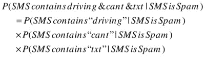

# 二、垃圾邮件还是非垃圾邮件？

Automatically Detect spam in Text Using Bayes’ Theorem

如果你使用电子邮件(我怀疑你有！)，有可能你在日常工作中看到机器学习。你的电子邮件客户端可能包含一些垃圾邮件过滤机制，它会自动识别你收到的邮件中明显不想要的宣传材料，并悄悄地将它们发送到一个“垃圾邮件文件夹”中它免去了你手动一个接一个删除这些消息的烦恼；它还可以避免你无意中点击可能有害的链接。这是典型的机器学习，如果做得好，可以让人类生活变得更好。计算机擅长执行重复性的任务，而且做得很彻底；通过自动处理乏味的活动并避免我们犯错，它们使我们人类能够专注于更有趣、更引人入胜的活动。

垃圾邮件检测 是机器学习的一个很好的例子，也是分类的典型例子。给定一组电子邮件，我们需要将它们分为两类:垃圾邮件(不需要的邮件，应该直接扔进垃圾箱)或垃圾邮件(我们确实想阅读的有效邮件)。有趣的还有另一个原因:不像我们在《T2》第一章中解决的数字识别问题，那里的数据是数字形式的，垃圾邮件检测完全是关于文本的。数字世界中可用材料的主要部分是文本，而不是组织良好的数字表格，因此了解如何使用它非常重要。

在这一章中，我们将从头开始构建一个垃圾邮件检测引擎，然后用这个例子来说明一些有用的技术和思想。我们将

*   建立一种处理文本的方法。从计算机的角度来看，原始文本文档只是字符的随机集合。我们将看到如何从文本块中提取特征(即，将原始数据转换为新的、更丰富或可用的属性，即“特征”)，方法是将其转换为计算机可以处理的标记。
*   看看贝叶斯定理，这是一个简单而强大的数学公式，它量化了如何整合新信息，以更新我们对不确定事件的评估。作为一个直接应用，我们将实现一个朴素贝叶斯分类器，这是一个使用词汇频率来确定文档类型的算法。
*   讨论理解数据对于正确解释结果及其质量的重要性，并说明从数据集中提取新要素如何能够显著增强模型的预测能力，而无需修改算法本身。

我们将首先关注实现一个通用算法来分析文本文档并决定它们属于哪一类。一旦我们有了这个工具，我们将把注意力转回到我们的数据集，看看如何仔细检查我们现有的数据将允许我们制作新的功能，并大大提高我们的预测质量。

我们的挑战:建立一个垃圾邮件检测引擎

我们将在这里处理的文档不会是电子邮件。相反，我们将处理短信。我们的目标是使用来自英国的真实 SMS(短消息服务)消息的数据集来识别垃圾邮件，该数据集是我们在加州大学欧文分校的机器学习库中找到的。

 **旁注**UCI 机器学习知识库由加州大学欧文分校机器学习和智能系统中心于 1987 年创建。你可以在 http://archive.ics.uci.edu/ml/的[找到机器学习库。这是一个包含近 300 个清晰且记录完善的数据集的库，可按大小、要素类型等标准进行搜索和组织。这是一个学习机器学习的极好资源，它包含许多“经典”数据集，这些数据集经常被用作评估算法性能的基准。](http://archive.ics.uci.edu/ml/)

了解我们的数据集

在讨论我们可以使用什么模型之前，让我们先来看看数据。数据集可以从[http://1drv.ms/1uzMplL](http://1drv.ms/1uzMplL)下载(它只是来自 UCI 存储库的原始文件的副本，可以在[http://archive.ics.uci.edu/ml/datasets/SMS](http://archive.ics.uci.edu/ml/datasets/SMS)+垃圾邮件+收藏中找到)。它存储为单个文本文件，名为 SMSSpamCollection，没有文件扩展名，包含 5，574 条真实文本消息。每一行都是一条短信，被识别为“垃圾邮件”或“非垃圾邮件肉”下面是第一行的样子:

```cs
ham    Go until jurong point, crazy.. Available only in bugis n great world la e buffet... 
       Cine there got amore wat...
ham    Ok lar... Joking wif u oni...
spam   Free entry in 2 a wkly comp to win FA Cup final tkts 21st May 2005\. Text FA to 87121 
       to receive entry question(std txt rate)T&C's apply 08452810075over18's
ham    U dun say so early hor... U c already then say...
ham    Nah I don't think he goes to usf, he lives around here though
spam   FreeMsg Hey there darling it's been 3 week's now and no word back! I'd like some fun 
       you up for it still? Tb ok! XxX std chgs to send, £1.50 to rcv
```

首先映入我眼帘的是，人们在短信中使用的语言明显不同于“标准的正规英语！”这是我们要记住的事情，因为它可能对我们的分析有影响。例如，像“U c”这样的片段，是“You see”的缩写，在普通词典中可能找不到。

考虑到这一点，我的第一步将是尝试获得这两个群体如何不同的非正式“直觉”。有没有在垃圾邮件中，或者在非垃圾邮件中出现频率更高的词？这可以帮助指导我们建立一个智能引擎来自动区分非垃圾邮件和垃圾邮件。让我们首先将数据集按类别进行分类(“垃圾邮件”和“垃圾邮件”)，并统计每个类别中的词频。鉴于此活动的探索性质，这似乎是一个使用 F#脚本的好地方。

 **提示**花时间探索你的数据！盲目地将算法应用于数据集可以很好地工作，但也只能做到这一步。正如开发应用程序时学习领域模型是值得的一样，对数据的深入理解将帮助您构建更智能的预测模型。

使用有区别的联合来模拟标签

我们首先需要的是数据。我们将沿着与前一章相同的路线进行，只是有一点不同。虽然整个 digits 数据集由数字(像素编码和标签)组成，但这里我们有一个特征(文本消息本身)和一个标签，它要么是 Ham，要么是 Spam。我们应该如何表示呢？

一种可能是将标签编码成布尔值，比如说，对非垃圾邮件编码为真，对垃圾邮件编码为假。这将工作得非常好；然而，有一点缺点:它不能使字段的意义不言自明。如果我只向您展示数据集中以这种方式编码的一条记录，例如:

```cs
True    Ok lar... Joking wif u oni... ,
```

你怎么可能猜到真实代表什么？另一个潜在的问题是，如果需要更多的类别，比如非垃圾邮件、垃圾邮件和不明确的消息，Boolean 就不能很好地扩展。

在不增加额外的、不必要的复杂性的情况下，机器学习已经够难了。出于这个原因，我们将把这个标签表示为 F# **区别并集**(我有时也将它称为 DU)。如果您以前从未见过有差别的联合，作为第一个近似，可以认为它们有点类似于 C#枚举，因为它们定义了一组排他的情况，但是这些情况要强大得多。虽然这一点也不公平，但这个类比足以让我们开始。

让我们用一个可以在 FSI 运行的例子来简要说明 DUs 是如何工作的。定义阿杜就像定义类型一样简单:

```cs
type DocType =
    | Ham
    | Spam
```

在 F#交互式窗口中运行(添加；；在触发评估)结束时，您应该看到以下内容:

```cs
type DocType =
  | Ham
  | Spam
```

这定义了一个简单的类型 DocType，它可以是以下两种类型之一:Spam 或 Ham。我喜欢有区别的联合的一个主要原因是，它们在模式匹配方面工作得非常好，并且允许您编写以非常清晰的方式描述您的业务领域的代码。例如，在我们的例子中，训练集中的每个例子要么是垃圾邮件，要么是包含实际消息内容的文本。我们可以将它表示为一个元组，其中每个示例是一个 DocType 和一个字符串，并按照以下方式处理示例，您可以在 F#交互式窗口中尝试:

```cs
let identify (example:DocType*string) =
     let docType,content = example
     match docType with
     | Ham -> printfn "'%s' is ham" content
     | Spam -> printfn "'%s' is spam" content
```

这个例子严格地说是为了说明的目的，但是展示了我们稍后要遵循的模式。在本例中，我们创建了一个小函数，它接收一个示例并打印出其内容，以及它是非垃圾邮件还是垃圾邮件。我们首先通过模式匹配元组将示例分成两部分(DocType 和 content)，然后我们对 DocType 的两种可能情况使用模式匹配，在单独的“分支”中处理每种情况。尝试在 FSI 键入以下内容:

```cs
identify (Ham,"good message");;
```

...您应该会看到以下结果:

```cs
'good message' is ham
```

在我们能够更好地确定如何处理实际的 SMS 内容之前，这就是我们将如何对数据建模。让我们开始加载数据集吧！

读取我们的数据集

就像在[第一章](1.html#7K4G0-841455c729754b8aac560d608a86cf91)，中一样，我们将花费大部分时间对我们的数据集进行实时破解，从脚本环境中逐步构建和完善一个模型。让我们启动 Visual Studio 并创建一个新的 F#库项目，我们将其命名为 HamOrSpam。为了方便起见，我们还使用 Visual Studio 外部的文件系统在解决方案中添加一个名为 Data 的文件夹，并将数据文件 SMSSpamCollection(按原样下载，没有任何文件扩展名，来自前面提到的链接)放入其中。参见[图 2-1](#Fig1) 。


[图 2-1](#_Fig1) 。文件夹组织

这将允许我们使用一个小技巧，以比我们在第 1 章中所做的更干净的方式访问数据文件。F#有几个方便的内置常量，__SOURCE_DIRECTORY__ 和 __SOURCE_FILE__，它们极大地简化了脚本文件的工作，并允许我们引用数据文件的位置，而不必硬编码依赖于本地机器的路径。正如您可能已经从它们的名称中猜到的那样，第一个函数计算包含文件本身的目录的完整路径，第二个函数返回文件本身的完整路径，包括文件名。

是时候进入剧本本身了。这与数字识别器数据集之间的主要区别在于，我们没有标题，只有两列，它们不是用逗号分隔的，而是用制表符分隔的。否则，问题基本上是一样的:我们有一个包含示例的文件，我们希望将它提取到一个数组中。毫不奇怪，我们的解决方案看起来也非常相似:读取文件并对每一行应用一个函数，以便将它解析为标签和内容，用制表符“\t”分隔它。

让我们直接进入我们项目中的 Script.fsx 文件。删除默认情况下存在的代码，并将以下代码粘贴到:

***清单 2-1*** 。从文件中读取 SMS 数据集

```cs
open System.IO

type DocType =
     | Ham
     | Spam

let parseDocType (label:string) =
    match label with
    | "ham"  -> Ham
    | "spam" -> Spam
    | _      -> failwith "Unknown label"

let parseLine (line:string) =
    let split = line.Split('\t')
    let label = split.[0] |> parseDocType
    let message = split.[1]
    (label, message)

Let fileName = "SMSSpamCollection"
let path = __SOURCE_DIRECTORY__ + @"..\..\Data\" + fileName

let dataset =
    File.ReadAllLines path
    |> Array.map parseLine
```

此时，您应该能够选择刚刚在脚本文件中编写的整个代码，并在 F# Interactive 中执行它，这将产生以下内容:

```cs
val dataset : (DocType * string) [] =
  [|(Ham,
     "Go until jurong point, crazy.. Available only in bugis n grea"+[50 chars]);
    (Ham, "Ok lar... Joking wif u oni...");
    (Spam,
     "Free entry in 2 a wkly comp to win FA Cup final tkts 21st May"+[94 chars]);
    // Snipped for brevity
    (Ham,
     "Hi. Wk been ok - on hols now! Yes on for a bit of a run. Forg"+[117 chars]);
    (Ham, "I see a cup of coffee animation"); ...|]
```

我们现在有一个示例数据集，每个示例都被识别为垃圾邮件或垃圾邮件。我们可以开始研究我们真正感兴趣的问题:我们可以使用什么特征来区分垃圾邮件和垃圾邮件？

 **提示**使用文件。读取数据集内容的 ReadAllLines 可能并不总是最好的主意。我们将内存中的所有内容一次加载到一个数组中，然后创建另一个数组来存储 Array.map 转换的结果。这个特定的数据集包含大约 5，000 行，这是相当小的，但是当处理较大的数据集时，您可以使用流版本(例如 System。IO.StreamReader.ReadLine())将数据集一次一行地加载到内存中。

决定一个单词

现在我们有了数据，可以开始分析了。我们的最终目标是识别来自 Ham 的垃圾邮件，但是，与数字识别器的情况不同，我们还没有一组清晰的特征；我们唯一可用的材料是一段原始文本，短信本身。与此同时，人们会怀疑文本中有许多信息可以利用。我们只需要找到一种方法将这些字符串转换成我们可以使用的特性。

以文字为线索

如果您浏览了我们刚刚加载的数据集，您可能会注意到垃圾邮件看起来与 Ham 有些不同。浏览邮件时，你的眼睛可以很容易地发现一些发出危险信号的线索，并暗示邮件更有可能是垃圾邮件。举个例子，“免费”这个词(全大写！)很早就出现在几个垃圾邮件项目中，似乎并不经常出现在 Ham 中。

这暗示了一种可能的方法:使用整个消息中的单个单词来识别它属于哪一类。让我们首先通过计算包含该特定字符串的垃圾邮件数量并将其与垃圾邮件进行比较，来确认我们的直觉是正确的。我们可以通过在脚本中键入几行 F#来测试这一点。首先，让我们过滤数据集，以便只保留垃圾邮件，然后再次过滤，这次只保留包含“FREE”的邮件，最后计算还剩下多少项:

```cs
let spamWithFREE =
    dataset
    |> Array.filter (fun (docType,_) -> docType = Spam)
    |> Array.filter (fun (_,sms) -> sms.Contains("FREE"))
    |> Array.length
```

选择上面的代码并在 F# Interactive 中运行它，您应该会看到以下结果:

```cs
val spamWithFREE : int = 112
```

现在让我们对非垃圾邮件做同样的事情:

```cs
let hamWithFREE =
    dataset
    |> Array.filter (fun (docType,_) -> docType = Ham)
    |> Array.filter (fun (_,sms) -> sms.Contains("FREE"))
    |> Array.length
```

这会产生以下结果:

```cs
val hamWithFREE : int = 1
```

这些数字证实了我们的直觉:“免费”确实在垃圾邮件中比在非垃圾邮件中使用得更频繁，似乎是区分这两个类别的一个很好的标志。我们可以用它来构建一个非常简单的垃圾邮件分类器，就像这样:

```cs
let primitiveClassifier (sms:string) =
     if (sms.Contains "FREE")
     then Spam
     else Ham
```

这是一个充满希望的开端。然而，如果我们想用这个想法构建更严肃的东西，我们需要解决两个问题。首先，我们选择“免费”作为垃圾邮件指标，但没有真正证明为什么。我们如何知道一个特定的单词是不是垃圾邮件或非垃圾邮件的好标记？然后，根据整个信息中的一个单词来做决定似乎相当有限。我们是否可以同时使用多个单词，并将它们(潜在的冲突)的信息整合到一个决策过程中？

给我们的确信度加上一个数字

不需要统计学的高级学位，就能直观地看出包含“免费”的消息很可能是垃圾邮件。我们能否以一种不依赖直觉的方式来形式化我们是如何得出这一结论的，并量化一个特定单词指示一条消息是垃圾邮件还是垃圾邮件的可靠程度？

就我个人而言，我经常求助于决策树来更好地理解概率问题。在我们的例子中，我们是这样做的:我们收集了 5，574 个文档，根据文档类型将其分成两组(747 个垃圾邮件和 4，827 个业余邮件)，对于每个文档组，我们计算有多少包含单词“FREE”这可以用决策树来表示，如图 2-2 中的[所示:](#Fig2)


[图 2-2](#_Fig2) 。决策图表

我喜欢把决策树想象成一系列的管子(或者流水线，如果你愿意的话)。你从一个初始节点开始，但是你 100%可能泵的不是水。每个节点代表一个可能有多种结果的事件；概率在分支之间拆分，任何概率都不应该消失。

在这种情况下，我们从 5，574 个文档开始，这些文档要么是 Ham，要么是 Spam。绝大多数文档都是非垃圾邮件——5，574 个文档中的 4，827 个，即 86.6%——所以在没有任何其他信息的情况下，如果我随机选择一条消息并问你“这是非垃圾邮件还是垃圾邮件？”你的答案应该是非垃圾邮件(86.6%的时候你都是对的)。

树的下一层考虑对于每个组，文档包含单词“FREE”的可能性。例如，如果一封邮件是垃圾邮件，我们有 747 分之 112 的机会，它包含“免费”用概率术语来说，我们有 15.0%的概率认为一个文档包含“免费”，假设这个文档是垃圾邮件。

这很有趣，但对我们的分类没有用。我们真正想要的是一个文档是垃圾邮件的概率，假设这个文档包含“免费”不过，获取这些信息并不太困难:我们只需要重新组织树，从文档是否包含“FREE”开始，而不是从 Spam 和 Ham 开始。请注意，无论我们如何构建我们的树，我们仍然应该以相同的四个叶组结束；例如，仍然应该有 112 个包含“免费”的垃圾文档在 5，574 个文档中，我们有 113 个包含“免费”，112 个来自垃圾邮件组，1 个来自 Ham 组。再进行一点重组，我们应该会得到如图 2-3 所示的决策树。虽然完全等同于前面的树，但它提供了不同信息片段如何相互关联的不同视角。


[图 2-3](#_Fig3) 。翻转决策树

具体来说，它直接给出了我们关心的信息:一个文档是垃圾邮件的概率，如果它包含“免费”这个词，就是 112/113，或者 99.1%(从而科学地证实了我们早先的直觉)。

贝叶斯定理

我们刚才用的方法有个名字:**贝叶斯定理**。在其最枯燥的教科书形式中，通常是这样表述的:


|符号应该读作“鉴于此”我们刚刚经历的例子是关于计算一封电子邮件是垃圾邮件的概率，假设它包含单词“FREE”，按照贝叶斯定理的公式，应该是这样的:


如果你机械地算出这些数字，你会得到下面的结果，这正是我们用决策树得出的结果:


一种看待贝叶斯定理的方式是在两种数据之间寻求平衡:我们对世界的初始知识(在我们的例子中，首先是有多少垃圾邮件)和附加信息(在垃圾邮件或非垃圾邮件中出现“免费”一词的频率)。贝叶斯定理量化了如何衡量新信息:垃圾邮件越少，我们的默认预测就越倾向于非垃圾邮件，在转换预测之前，证据就越有力。

另一种看待贝叶斯定理的方式是关于独立性的概念。两个事件 A 和 B 被认为是独立的当(且仅当！)以下等式成立:


...如果你稍微研究一下贝叶斯定理，就会发现


换句话说，知道关于 B 的任何事情并不能传达关于 A 的任何有用信息(反之亦然)。相反，如果 A 和 B 不是独立的，贝叶斯定理将捕捉到这两条信息有多强的相关性。最后一句话(也是一句警告)，注意这种影响是多么的不对称。如果我知道一封电子邮件是垃圾邮件，我有 15%的机会认为它包含“免费”，然而，知道一封电子邮件包含“免费”这个词，我有 99%的机会认为它是垃圾邮件！

**天魔堂问题**

如果你觉得这种方法令人困惑，不要担心。它既简单又复杂——运行计算很容易，但思考正在发生的事情却不容易。众所周知，人类大脑对不确定性的推理能力很差，非常聪明的人在这个问题上犯了令人尴尬的错误。最著名的例子是蒙蒂霍尔问题:一旦游戏节目参赛者选择了三扇门中的一扇门，其中一扇门藏着奖品，主持人会从剩下的两扇门中指出一扇门没有奖品。问题是，参赛者应该在那个时候换门吗？在 20 世纪 50 年代，玛丽莲·沃斯·莎凡特正确地回答了这个问题，但一些著名的数学家，如保罗·鄂尔多斯，错误地试图向她证明她错得有多离谱。我从这个故事中得到的个人教训是，在处理概率时要非常小心，因为人类的直觉在这方面没有良好的记录——当然，在公开批评任何人之前都要三思！

处理生僻字

贝叶斯定理为我们提供了一种便捷的方法，可以根据一个单词来判断邮件是垃圾邮件还是垃圾邮件。但是，您可能已经注意到了一个小问题。如果你选择一个只出现在其中一个类别中的单词，例如，“叔叔”、“蜜蜂”或“葡萄酒”，它们只存在于非垃圾邮件中，那么我们的公式将为一个类别分配 100%的概率，而为另一个类别分配 0%的概率。换句话说，如果我们看到一条包含单词“叔叔”的消息，我们会自动地以 100%的信心判定这条消息不是垃圾邮件，而不管消息的其他部分。

显然，这不可能是对的；基于有限的训练样本，我们不应该对任何事情有 100%的信心。解决这个问题的一种方法是使用**拉普拉斯平滑**。以法国数学家皮埃尔·西蒙·拉普拉斯的名字命名，这种非常吓人的探测技术可以说是一种“忽悠因素”我们将通过将每个单词的计数增加 1 来消除缺少单词的问题，并计算 P(垃圾邮件包含“xyz”)=(1+包含“XYZ”的垃圾邮件的计数)/ (1 +垃圾邮件的计数)。本质上，我们正在编造一个包含每个令牌的虚构消息，因此，最罕见的令牌将具有非常低的概率，但不是零。

组合多个单词

利用贝叶斯定理，我们发现了一条短信应该如何根据它是否包含一个特定的单词来分类。这是进步，但我们还没有完成。一条消息中有很多单词，每一个单词都以不同的力度推向 Ham 或 Spam。我们如何将这些可能会发出相互矛盾信号的信息整合成一个单一的值，以便我们做出决策？

将文本分解成标记

作为一个例子，考虑下面的假设消息:“驾驶，不能 txt。”它是垃圾邮件的概率有多大？

我们可以尝试直接应用贝叶斯定理，在我们的数据集中寻找整个信息。然而，我不认为这种方法会很有效。找到一个完全相同的复制品的可能性很小，更不用说很多了。另一方面，我们看到的是“免费”这个词携带了一些相关信息。我们要做的就是简单地将消息分解成一组单词，“driving”、“cant”和“txt”，并使用该表示代替原始文本。然后，我们可以分析单个令牌，并(希望)将每个令牌所暗示的内容组合成一个我们可以依赖来做出决策的单一值。

这个将一个文本块分解成有意义的元素(单词，或者潜在的其他符号)，即记号的过程被称为**记号化**。决定如何进行标记化是模型的一个重要部分，没有唯一正确的方法来做这件事，这取决于手头的问题。目前，和往常一样，我们将从我们能实现的最简单的事情开始:如果一个单词“免费”是信息性的，让我们扩展这个想法，将消息分解成所有单独的单词。实际上，我们正在将每条消息转换成一个特征集合，每个特征代表一个特定单词的存在或不存在。

例如，如果我们有两个字符串，“编程很有趣”和“函数式编程更有趣！，“我们可以把它们分解成“编程”，“是”，“乐趣”，“功能”，“编程”，“是”，“更多”，“乐趣。”这种表示将使我们更有效率。我们不必检查消息是否包含特定的子串，而是可以将每个文档预处理成一组标记，并快速验证它是否包含我们感兴趣的特定标记。

 **注**这种通用方法对于将文本转换成计算机可以处理的形式非常有用。例如，我们可以收集在我们的语料库中找到的整个记号集—[“functional”；“编程”；”是”；“更多”；“有趣”]—并通过计算每个标记被找到的次数来对每个文档进行编码。在我们的例子中，第一个文本块变成了[0；1;1;0;1]，而第二个[1；1;1;1;1].我们的数据集现在是一种人类完全无法阅读的形式，但它看起来很像我们来自第一章的数字数据集:每一行是一个观察，每一列是一个特征，一切都被编码为数字——例如，我们可以用它来确定两个文档有多相似。以一种人类无法做到的方式，将观察结果转换成一组计算机可以分析的数字特征，以找到模式，这在机器学习中是相当典型的。

在这一点上，你可能会想，“这是一种过度简化”，你可能是对的。毕竟，我们正在将完整的句子转换成原始的单词集合，而忽略了诸如句法、语法或词序之类的东西。这种转变显然是在丢失信息；例如，两个句子“我喜欢胡萝卜，讨厌西兰花”和“我喜欢西兰花，讨厌胡萝卜”将被分解成同一套令牌[and；西兰花；胡萝卜；讨厌；我；like]，因此将被视为完全相同。同时，我们在这里也不是要去理解句子的意思；我们只需要识别哪些单词与特定的行为有关。

我想在这里强调的另一点是，虽然我们的标记化看起来相当简单，但它已经包含了许多隐式决策。我们决定将“编程”和“编程”视为同一个词，忽略大小写。这是一个合理的假设吗？也许是，也许不是。如果你在论坛或 YouTube 评论等在线讨论上花了最少的时间，你可能会同意大量使用大写字母通常表明讨论质量正在下降。因此，可以认为大小写很重要，可以为消息分类提供相关信息。这里的另一个隐含的决定是去掉“！”；这合理吗？标点符号可能很重要。

好消息是，与其争论大写或标点是否重要，我们可以稍后通过交叉验证很容易地解决这个问题。用爱德华兹·戴明(W. Edwards Deming)的不朽名言来说，“我们相信上帝——所有其他人都必须带来数据。”为每个假设创建替代模型，比较它们的性能，并让数据来决定。

天真地组合分数

既然我们已经决定将我们的消息分解成三个令牌——“driving”、“cant”和“txt”——我们仍然需要找出一种方法来计算消息是 Ham 还是 Spam 的概率。“txt”表示很有可能是垃圾邮件，但“driving”指向的是 Ham。我们应该如何把所有证据放在一起？

如果我们应用贝叶斯定理来确定我们的邮件是垃圾邮件的概率，假设它包含所有三个令牌，我们会得到:


这是一个有点吓人的公式。然而，如果我们做一个简化的假设，事情会变得更好。让我们假设令牌是独立的——也就是说，看到消息中的一个令牌与可能存在的其他令牌没有关系。在这种情况下，我们可以计算:



对上面的公式应用一点贝叶斯定理柔术，您应该得到如下结果:


从根本上说，我们正在做的是:我们没有试图用英语的全部复杂性来建模，而是使用一个简单得多的模型。想象一下，你有两个巨大的单词桶，一个是垃圾邮件，一个是非垃圾邮件，每个都包含不同比例的单词。信息是通过从一个桶中随机抽取单词并把它们串在一起而生成的。当然，这是一个相当荒谬的语言模型。同时，它也有一些明显的好处。更“正确”的模型可能是特定于特定语言的(例如，考虑它的语法和句法)，并且可能不适用于其他语言。因此，让我们从一个非常糟糕的模型开始，但对于任何语言或任何类型的文档来说都应该是同样糟糕的，但很容易使用，让我们看看它会把我们引向何方！

简化文档分数

此时，我们几乎已经准备好深入代码并实现分类器了。我们可以很容易地提取出 P(SMS 是垃圾短信)，垃圾短信在训练集中的比例，以及 P(SMS 包含“X”| SMS 是垃圾短信)，包含 token“X”的垃圾短信的比例

在开始之前，让我们做一些最后的调整。首先，你可能已经注意到，对于两种情况，垃圾邮件或非垃圾邮件，我们冗长的贝叶斯公式涉及到除以相同的术语，P(短信包含“驾驶”，“斜面”，“txt”)。最终，我们感兴趣的是决定一条消息是垃圾邮件还是垃圾邮件，而不一定是确切的概率。在这种情况下，我们不妨去掉常用项，省去一些不必要的计算，只计算“分数”而不是概率:


如果 Score(Spam) > Score(Ham)，我们会将该邮件归类为垃圾邮件。

事实上，如果我们想要的只是一个分数，我们可以更进一步，解决另一个问题，一个与精度相关的问题。根据定义，我们将在消息中观察到任何特定令牌的概率将是小于 1 的数，并且通常是接近于零的数。由于我们的公式将这些概率相乘，结果将接近于零，这可能会导致舍入问题。

为了避免这个问题，习惯上使用一个老技巧，将计算转换成对数。细节不是很重要，但这里是为什么它可能是一个好主意。因为 log (a * b) = log a + log b，我们将能够把我们的公式从乘积变成和，避免舍入问题；而且因为 log 是增函数，所以通过 log 变换公式会保留分数的排名。因此，代替原来的公式，我们将使用以下公式对邮件进行评分:


在某种程度上，这澄清了算法逻辑。每个令牌都有一个 Ham 分值和一个 Spam 分值，量化了它指示每种情况的强度。当试图确定一个文档是否是垃圾邮件时，该算法从垃圾邮件分数(垃圾邮件的基线级别)开始，并且每个标记独立于其他标记增加或减少文档垃圾邮件分数。如果文档垃圾邮件分数最终高于 Ham 分数，则该文档是垃圾邮件。

实现分类器

这是大量的数学和建模讨论，没有多少编码。幸运的是，这就是我们所需要的:我们现在准备实现一个朴素贝叶斯分类器。从根本上说，分类器依赖于两个元素:一个将文档分解成标记的标记器，以及一组标记——我们用来对文档进行评分的单词。给定这两个组件，我们需要从示例样本中了解垃圾邮件和垃圾邮件中每个标记的得分，以及每个组的相对权重。

[图 2-4](#Fig4) 概述了学习阶段。从标记消息的语料库开始，我们将它们分成两组，垃圾邮件和非垃圾邮件，并测量它们的相对大小。然后，对于选定的一组标记(这里是“free”、“txt”和“car”)，我们测量它们的频率，并将每组文档降低到与其总权重相对应的分数，并得出该特定组的每个标记的分数:


[图 2-4](#_Fig4) 。朴素贝叶斯学习阶段

一旦这些信息可用，对一个新文档进行分类就要遵循图 2-5 中所概述的过程:对文档进行标记，根据出现的标记计算每个组的得分，并预测得分最高的组。


[图 2-5](#_Fig5) 。朴素贝叶斯分类器大纲

在这个特定的例子中，一旦文档被标记化，我们就查找每个单独的标记是否有可用的分数(否则忽略它)，计算每个组的总分数，并决定哪个组最有可能匹配。

将代码提取到模块中

为了避免过多的代码使脚本混乱，让我们将分类器本身提取到一个模块中。为此，只需右键单击解决方案并选择添加新项目，然后选择源文件。重命名该文件 NaiveBayes.fs，删除其中可能存在的任何默认代码，并替换为以下内容:

```cs
namespace NaiveBayes

module Classifier =

    let Hello name = printfn "Hello, %s" name
```

最后，右键单击该文件并选择“上移”(或 Alt +向上箭头)，直到 NaiveBayes.fs 出现在解决方案的文件列表中的第一个位置(您也可以通过在解决方案资源管理器中选择一个文件并使用“在上面添加”或“在下面添加”来直接在所需位置添加文件)。现在，您已经创建了一个模块，在该模块中，您可以开始编写函数并从脚本中调用它们，或者从 F#或 C#项目中使用它们。为了便于说明，下面是如何使用我们当前脚本中的 Hello 函数:

```cs
#load "NaiveBayes.fs"
open NaiveBayes.Classifier
Hello "World"
```

 **注意**你可能想知道为什么要把你刚刚创建的文件上移。与 C#不同，F#解决方案中文件的顺序很重要。其主要原因是类型推理系统。通过查看到目前为止您在代码文件中定义的内容，编译器会自动为您判断出您所指的类型。类似地，如果你想在你的代码中使用函数 f，函数 f 需要在使用它的代码之前定义。这有点额外的约束，但在我看来这是为类型推断的好处付出的非常合理的代价；而且，作为一个有趣的副作用，它在 F#解决方案中提供了一个自然的顺序，这使得它们非常容易解释:从第一行开始向前读，或者从最后一行开始向后读！

对文档进行评分和分类

现在我们已经有了模块，我们将在模块中编写算法本身，然后使用脚本文件使用该算法浏览数据。让我们遵循一个典型的 F#模式，自下而上地构建，编写小段代码，并将它们组合成更大的工作流。该模型的关键元素是分数计算，它衡量一个文档属于某个组(例如，垃圾邮件)的证据有多强。

分数依赖于两个组成部分:该组在整个语料库(训练数据)中出现的频率，以及在该组中找到某些标记的频率。让我们首先定义几个类型来表示我们的领域。与其将文档和令牌都表示为字符串，不如直话直说，定义一个令牌类型 string 的类型别名。这将使我们在类型签名方面更加清晰。例如，我们现在可以将记号赋予器定义为一个函数，它接受一个字符串(一个文档)并返回一组记号。类似地，让我们使用 TokenizedDoc 类型别名为已经进行了标记化的文档提供一个名称:

```cs
type Token = string
type Tokenizer = string -> Token Set
type TokenizedDoc = Token Set
```

为了对一个新文档(带有未知标签)进行分类，我们将需要使用我们现有的带标签文档样本来计算每个可能组的分数。这样做需要每个组的两条信息:它的比例(该组在整个数据集中出现的频率)和我们为模型选择的每个标记的分数，该分数指示该标记指向该组的强度。

我们可以用一个数据结构 DocsGroup 来建模，它包含一个比例(该组在整个数据集中出现的频率)和 TokenFrequencies，一个映射(一个 F#数据结构，其作用类似于一个字典)，它将每个标记与其在数据集中的(拉普拉斯校正的)频率相关联。例如，在我们的特定情况下，我们将创建两个文档组，一个用于垃圾邮件，另一个用于垃圾邮件，其中 Ham 文档组包含整个数据集中 Ham 消息的总体比例，以及我们感兴趣的每个令牌的实际令牌及其在 Ham 消息中出现的频率:

```cs
type DocsGroup =
    {   Proportion:float;
        TokenFrequencies:Map<Token,float> }
```

假设一个文档已经被分解成一组标记，计算给定组的得分是相当简单的。我们不必担心这些数字是如何计算出来的。如果这部分已经完成，我们需要做的就是汇总组频率的日志，以及在标记化文档和我们在模型中使用的标记列表中出现的每个标记的日志:

***清单 2-2*** 。给文件打分

```cs
let tokenScore (group:DocsGroup) (token:Token) =
    if group.TokenFrequencies.ContainsKey token
    then log group.TokenFrequencies.[token]
    else 0.0

let score (document:TokenizedDoc) (group:DocsGroup) =
    let scoreToken = tokenScore group
    log group.Proportion +
    (document |> Seq.sumBy scoreToken)
```

对文档进行分类只需使用标记化器将其转换为标记，在可能的文档组列表中识别得分最高的组，并返回其标签:

***清单 2-3*** 。预测文档的标签

```cs
let classify (groups:(_*DocsGroup)[])
             (tokenizer:Tokenizer)
             (txt:string) =
    let tokenized = tokenizer txt
    groups
    |> Array.maxBy (fun (label,group) ->
        score tokenized group)
    |> fst
```

您可能想知道 classify 函数中的 groups:(_*DocsGroup)[]位。为什么不对每组文档使用(DocType*DocsGroup)的元组，这个神秘的 _ 符号是什么？如果你仔细想想，我们到目前为止所做的一切都不依赖于具体的标签。我们想到的是垃圾邮件和非垃圾邮件，但我们同样可以将其应用于不同的文档集，例如，预测书面电影评论是否对应于 1、2、3、4 或 5 颗星的评级。出于这个原因，我决定让代码通用化；只要您有一组标签类型一致的示例文档，它就可以工作。_ 符号表示“类型通配符”(任何类型都将被支持)，如果您检查 classify 函数签名，您将会看到这样的内容:groups:(' a * docs group)[]--> Tokenizer:Tokenizer--> txt:string-> ' a。通配符已被替换为' a(表示泛型类型)，函数返回' a，这是(泛型)标签类型。

集合与序列简介

这里引入了两种新类型，序列和集合。我们简单讨论一下这些，从 set 开始。顾名思义，集合表示唯一项的集合，其主要目的是回答“项 X 是否属于集合 S？”假设我们想要寻找 SMS 中是否存在特定的单词(或者更一般地，令牌),以便确定它是否可能是垃圾邮件或非垃圾邮件，那么使用能够有效地比较多组项目的数据结构似乎是合理的。通过将文档简化为一组标记，我们将能够快速识别包含像“txt”这样的标记的文档，而不必花费使用 Contains()字符串方法的成本。

Set 模块提供了一些围绕集合操作的便利函数，如下面的代码片段所示。在 F#交互式窗口中键入以下内容:

```cs
> let set1 = set [1;2;3]
let set2 = set [1;3;3;5];;

val set1 : Set<int> = set [1; 2; 3]
val set2 : Set<int> = set [1; 3; 5]
```

这产生了两个集合。请注意重复值 3 是如何从集合 2 中删除的。集合模块提供了计算集合的并集和交集的函数:

```cs
> let intersection = Set.intersect set1 set2
let union = Set.union set1 set2;;

val intersection : Set<int> = set [1; 3]
val union : Set<int> = set [1; 2; 3; 5]
```

Set 还公开了一个有用的函数 difference，它从一个集合中减去另一个集合；也就是说，它将从第一个集合中移除在第二个集合中找到的所有元素:

```cs
> let diff1 = Set.difference set1 set2
let diff2 = Set.difference set2 set1;;

val diff1 : Set<int> = set [2]
val diff2 : Set<int> = set [5]
```

注意，与交集和并集函数不同，difference 是不可交换的；也就是说，参数的顺序很重要，如前面的示例所示。最后，注意集合是不可变的:一旦集合被创建，就不能被修改:

```cs
> let set3 = Set.add 4 set1
set1.Contains 4;;

val set3 : Set<int> = set [1; 2; 3; 4]
val it : bool = false
```

将 4 添加到集合 1 会创建一个新的集合 set3，它确实包含 4，但是原始集合 set1 并没有受到该操作的影响。

我们介绍的另一种类型 sequence，是一个延迟求值的元素序列，也就是说，它是一个只在需要时才计算的集合，这可能会减少内存或计算的使用。让我们在 F# Interactive 中尝试下面的代码:

```cs
> let arr1 = [| for x in 1 .. 10 -> x |]
let seq1 = seq { for x in 1 .. 10 -> x };;

val arr1 : int [] = [|1; 2; 3; 4; 5; 6; 7; 8; 9; 10|]
val seq1 : seq<int>
```

arr1 和 seq1 这两个表达式非常相似；它们都生成从 1 到 10 的整数。然而，数组立即显示了它的全部内容，这些内容已经被急切地评估过了；相比之下，seq1 显示为整数序列，没有进一步的细节。实际内容只有在代码需要时才会生成。让我们用下面的例子来进一步证明这一点，这个例子构造了一个新的序列，它取 seq1 并将它的每个元素加倍。请注意我们是如何在序列本身中添加副作用的:每当生成序列的一个元素时，我们都打印出被映射的元素:

```cs
> let seq2 =
    seq1
    |> Seq.map (fun x ->
        printfn "mapping %i" x
        2 * x) ;;

val seq2 : seq<int>
```

同样，结果是一个没有实际内容的序列，因为到目前为止没有任何东西需要它。让我们改变这种情况，要求前三个元素的总和:

```cs
> let firstThree =
    seq2
    |> Seq.take 3
    |> Seq.sum;;
mapping 1
mapping 2
mapping 3

val firstThree : int = 12
```

当这段代码执行时，“映射 1”、“映射 2”和“映射 3”被打印出来，表明序列正在取出它的前三个元素，这是计算总和所必需的。然而，剩余的七个可用元素仍然不需要，现在还没有评估。

那么，当我们已经有了像数组这样完美的集合时，序列还有什么意义呢？第一个好处是懒评。因为一个序列只会在“需要时”被求值，所以我们可以用它们来生成无限序列；例如，一些用数组完全做不到的事情。下面的代码片段提供了一个有点做作的例子:我们创建了一个无限序列，永远在 1 和-1 之间交替。显然，我们无法在内存中实例化这样一个无限的数列，但是既然已经定义了它，我们就可以使用它，例如，计算任意数量元素的和:

```cs
> let infinite = Seq.initInfinite (fun i -> if i % 2 = 0 then 1 else -1)
let test = infinite |> Seq.take 1000000 |> Seq.sum;;

val infinite : seq<int>
val test : int = 0
```

经常使用 F#序列的另一个原因是它们相当于 C # IEnumerable 因此，所有标准。NET 集合可以被视为序列，因此 Seq 模块提供的函数可以用来操作它们，使用实际集合本身没有的功能。作为说明，考虑这个例子:

```cs
> let arr = [| 1;2;2;3;4;4;4|]
let counts = 
    arr
    |> Seq.countBy (fun x -> x)
    |> Seq.toArray;;

val arr : int [] = [|1; 2; 2; 3; 4; 4; 4|]
val counts : (int * int) [] = [|(1, 1); (2, 2); (3, 1); (4, 3)|]
```

我们生成一个整数数组，然后想计算每个整数有多少个实例。虽然数组不直接支持这个功能(至少在 F# 4.0 正式发布之前是这样)，但是序列支持，所以我们在数组上调用 Seq.countBy，并将结果转换回数组，以便触发序列求值。

 **提示**虽然序列有很多优点(谁不想只计算需要的东西，仅此而已？)，懒求值也有它的弊端，包括给调试增加了一些复杂性。

从文档语料库中学习

为了使用分类功能，我们需要每组文档的摘要数据。我们需要什么数据来生成这些数据？组比例需要组中的文档数以及文档总数。然后，对于我们选择用于分类器的每个标记，我们需要计算标记化后包含它的文档的(拉普拉斯校正的)比例。

 **注意**不管你使用什么语言或风格，以这种方式处理应用程序设计都非常有效:创建具有单一职责的小组件，有明确定义的任务，不用担心程序的其余部分会发生什么。这有助于用最少的数据结构提取清晰的模型。然后，您可以将所有这些组件连接在一起，此时，如果您需要淡化您的设计，比如说，出于性能原因，这并不困难。

收集汇总数据的一个显而易见的方法是编写一个函数，该函数具有一个签名，该签名预期一个文档集合并返回一个 DocsGroup，该 docs group 包含传入的一组文档的分析结果。同样，我们将假设我们获得的数据完全符合手头任务的要求，稍后我们将考虑如何实现这一点。

首先，让我们创建几个辅助函数，在计算比例和拉普拉斯平滑比例时，避免一些 int-to-float 转换，并帮助我们计算存在特定标记的文档:

```cs
let proportion count total = float count / float total
let laplace count total = float (count+1) / float (total+1)
let countIn (group:TokenizedDoc seq) (token:Token) =
    group
    |> Seq.filter (Set.contains token)
    |> Seq.length
```

现在，我们已经拥有了分析一组具有相同标签的文档，然后将其归纳为一个 DocsGroup 所需的所有构件。我们需要做的就是

*   计算该组相对于文档总数的相对大小，以及
*   为了找出，对于我们决定用来分类文档的每个记号，它们在组内的拉普拉斯校正比例是多少。

***清单 2-4*** 。分析一组文档

```cs
let analyze (group:TokenizedDoc seq)
            (totalDocs:int)
            (classificationTokens:Token Set)=
    let groupSize = group |> Seq.length
    let score token =
        let count = countIn group token
        laplace count groupSize
    let scoredTokens =
        classificationTokens
        |> Set.map (fun token -> token, score token)
        |> Map.ofSeq
    let groupProportion = proportion groupSize totalDocs

    {
        Proportion = groupProportion
        TokenFrequencies = scoredTokens
    }
```

 **注**清点代币。我们通过计算单词在文档中出现的次数来确定单词出现的频率。这非常适合短消息，但对于较长的文档就不太好了。如果你试图确定一本书是否是关于计算机的，计算这个词出现的次数可能比简单地问“这个词在这本书里是否至少出现过一次”更好我们用于 SMS 的方法被称为“单词集”；另一种标准方法“单词包”依赖于总的词频，它可能更适合某些文档类型。

我们快到了。既然我们知道了如何分析单个文档组，我们只需要协调这些部分并完全实现我们在[图 2-4](#Fig4) 中概述的算法。给定一组文档及其标签，我们需要

*   把它们分成代币，
*   通过标签将它们分开，并且
*   分析每一组。

***清单 2-5*** 。从文档中学习

```cs
let learn (docs:(_ * string)[])
          (tokenizer:Tokenizer)
          (classificationTokens:Token Set) =
    let total = docs.Length
    docs
    |> Array.map (fun (label,docs) -> label,tokenizer docs)
    |> Seq.groupBy fst
    |> Seq.map (fun (label,group) -> label,group |> Seq.map snd)
    |> Seq.map (fun (label,group) -> label,analyze group total classificationTokens)
    |> Seq.toArray
```

是时候结束了。我们真正希望从整个过程中得到的是一个函数，它接受一个字符串(原始的 SMS 消息),并根据我们从 documents 训练集中学到的知识，为我们提供得分最高的标签。

***清单 2-6*** 。训练朴素贝叶斯分类器

```cs
let train (docs:(_ * string)[])
          (tokenizer:Tokenizer)
          (classificationTokens:Token Set) =
    let groups = learn docs tokenizer classificationTokens
    let classifier = classify groups tokenizer
    classifier
```

差不多就是这样。在大约 50 行代码中，我们有一个工作的朴素贝叶斯分类器。

训练我们的第一个分类器

现在我们已经实现了一个通用算法，我们终于可以回到手头的问题，即识别哪些消息是垃圾邮件，哪些是垃圾邮件。train 函数的签名为我们所追求的目标提供了一个清晰的轮廓:为了获得一个分类器，我们需要一组训练样本、一个标记器和一组要使用的标记。训练集已经给了我们，所以我们现在的目标是确定 tokenizer 和 tokens 的最佳组合，使用交叉验证来指导我们的分析。

实现我们的第一个记号化器

考虑到这一点，让我们回到可能有效的最简单的事情上来，从标记化开始。我们要做的是接受一个字符串，并将其分解成单词，忽略大小写。

这是一份非常需要正则表达式的工作。\w+模式将匹配由一个或多个“单词”字符组成的“单词”(即字母或数字，但不包括标点)。让我们使用该模式创建一个正则表达式 matchWords，并按照经典的流水线结构在 script.fsx 中编写一个令牌函数。我们将输入字符串转换成小写，并应用正则表达式。火柴词。Matches 创建一个 MatchCollection，它是应用表达式时找到的所有匹配项的集合。我们将这个集合转换为一个 Match 序列，检索匹配的值(每个匹配的字符串)，最后将它转换为一个集合，其中包含由 regex 标识的所有唯一单词。在您的脚本文件中，在我们已经编写的用于读取数据集的代码下面添加以下代码:

***清单 2-7*** 。使用正则表达式标记一行文本

```cs
open System.Text.RegularExpressions

let matchWords = Regex(@"\w+")

let tokens (text:string) =
    text.ToLowerInvariant()
    |> matchWords.Matches
    |> Seq.cast<Match>
    |> Seq.map (fun m -> m.Value)
    |> Set.ofSeq
```

这段代码看起来有点粗糙；说实话，如果没有一些奇怪的设计，它看起来会更简单。NET 正则表达式。无论如何，我们现在有了我们需要的东西:一个将字符串分解成它包含的所有单个单词的函数。

交互验证我们的设计

乍一看，代码似乎在做我们想要的事情。然而，“可能”并不是一个好地方；验证它实际工作会更好。用 C#编码的时候，我的习惯是求助于测试驱动开发，或者 TDD:先写一个测试，再写满足需求并通过测试的代码。TDD 的好处之一是，它使您能够独立于整个应用程序运行小段代码，快速确保它按预期工作，并在运行过程中充实您的设计思想。在 F#中，我倾向于有一个稍微不同的工作流程。F# Interactive 支持更流畅的设计实验风格。你可以简单地在 F# Interactive 中进行试验，一旦你的设计成形，就将代码提升到单元测试，而不是立即提交设计并为其编写测试，这可能需要以后的重构。

在我们的例子中，检查令牌函数的工作是微不足道的。所需要做的就是在 FSI 键入这样的内容并运行它:

```cs
> tokens "42 is the Answer to the question";;
```

您将立即在 F#交互式窗口中看到结果:

```cs
val it : Set<string> = set ["42"; "answer"; "is"; "question"; "the"; "to"]
```

我们的功能看起来正在工作。所有的单词都被隔离了，包括数字“42”，重复的“the”在结果中只出现一次，*答案*中的大写“A”没有了。在这一点上，如果我正在编写一个用于生产的实际库，我将简单地提取令牌函数，并将其从我的探索性脚本移动到解决方案中的一个实际的适当文件中，然后将这个小代码片段转换成一个实际的单元测试。我们目前“只是在探索”，所以我将把它留在那里，现在不去写测试。

通过交叉验证建立基线

现在我们有了一个模型，让我们看看它做得有多好。我们将使用与之前相同的脚本，因此我们已经加载了 dataset(DocType * string)数组中的所有消息。与上一章一样，我们将使用交叉验证，并使用数据集的一部分进行训练，保留其余部分来验证效果如何(或如何差！)每个模特都在做。以一种相当随意的方式，我将保留 1000 个观察值用于验证，其余的用于训练。为了确保一切正常，让我们尝试一个相当原始的模型，仅使用令牌“txt”来做出我们的决定:

```cs
#load "NaiveBayes.fs"
open NaiveBayes.Classifier

let txtClassifier = train training wordTokenizer (["txt"] |> set)

validation
|> Seq.averageBy (fun (docType,sms) ->
    if docType = txtClassifier sms then 1.0 else 0.0)
|> printfn "Based on 'txt', correctly classified: %.3f"
```

在我的机器上，我得到了 87.7%的正确率。那太好了！或者是？脱离背景，像 87.7%这样的数字看起来令人印象深刻，但你必须客观地看待它。如果我使用最愚蠢的模型，并且总是预测“非垃圾邮件”，不管短信内容如何，我在验证集上的成功率是 84.8%，87.7%的得分似乎不再令人印象深刻。

这里重要的一点是，你应该总是从建立基线开始:如果你使用最简单的策略，你的预测会有多好？对于一个分类问题，正如我们在这里所做的，一直预测最频繁的标签，会给你一个起点。对于时间序列模型，当你试图根据过去预测明天时，预测明天将和今天一模一样是一个经典。在某些情况下，正确分类 20%可能很好，而在其他情况下(比如在我们的非垃圾邮件和垃圾邮件的例子中)，85%的正确分类可能会令人失望。基线完全取决于数据。

第二个要点是，你应该非常小心你的数据集是如何构造的。当分割我的训练集和验证集时，我只取前 1000 个进行验证。想象一下，我的数据集是按标签排序的，首先是所有的垃圾邮件示例，然后是所有的非垃圾邮件示例。这将非常糟糕:我们实际上是在一个几乎只包含非垃圾邮件的样本上训练我们的分类器，并且只在垃圾邮件上测试它。至少，您会认为评估质量非常差，因为分类器已经学会识别的数据与它实际将要处理的数据非常不同。

这将是每个模型的问题；然而，由于朴素贝叶斯分类器的工作方式，这在我们的情况下尤其糟糕。如果你回想一下算法是如何工作的，本质上，朴素贝叶斯在两个元素中权衡:不同组中标记的相对频率，以及组本身的频率。第一部分不会受到不良采样的影响；然而，每组的频率可能完全偏离，这将极大地影响预测。例如，在训练集中有比垃圾邮件多得多的垃圾邮件会导致分类器完全低估邮件是垃圾邮件的概率，并在预测垃圾邮件方面出错，除非证据是绝对压倒性的。

这里的要点是，在运行可能很长的计算来训练模型之前，您需要问自己，“我正在使用的样本与我的模型稍后将处理的真实数据相似吗？”以及“我的训练集和验证集的组成是否大致相同？”在某些情况下，有失真的样本可能是非常好的——你只是想意识到这一点。特别是对于朴素贝叶斯分类器，或贝叶斯定理启发的方法，要小心这种扭曲，它将对你的模型质量产生深刻的影响。如果您检查我们的 SMS 数据集，您应该会看到它似乎大致平衡:在训练和验证样本中，Ham 与垃圾邮件的比例大致相同。

改进我们的分类器

我们现在有了一个基线——任何低于 84.4%的都是差的，要达到的数字是 87.7%。现在是时候看看使用我们所拥有的两个杠杆可以做得多好了:记号赋予器和分类器将使用的记号的选择。

使用每一个单词

通过一个单词，我们将分类器的正确分类率从 84.8%提高到 87.7%。如果我们不使用一个单词，而是使用我们能得到的每一个符号，我们的预测肯定会飙升。让我们试试这个想法。首先，我们需要从训练集中提取每个标记。让我们编写一个词汇表函数，通过对每个文档应用一个标记器并将这些标记合并到一个集合中来实现这一点。从我们的训练集中检索标记就像从每个文档元组中取出第二个元素一样简单，使用 snd，并将其传送到我们的词汇函数:

```cs
let vocabulary (tokenizer:Tokenizer) (corpus:string seq) =
    corpus
    |> Seq.map tokenizer
    |> Set.unionMany

let allTokens =
    training
    |> Seq.map snd
    |> vocabulary wordTokenizer
```

又好又脆。现在，我们可以使用这个庞大的标记列表来训练新的分类器并评估其性能:

```cs
let fullClassifier = train training wordTokenizer allTokens

validation
|> Seq.averageBy (fun (docType,sms) ->
    if docType = fullClassifier sms then 1.0 else 0.0)
|> printfn "Based on all tokens, correctly classified: %.3f"
```

我们得到的不是我们希望的重大改进，而是这个相当令人失望的结果:“基于所有令牌，正确分类:0.864。”面对现实吧，这是失败的。我们在这里实现的只是一个勉强击败天真预测者的模型，并且比我们之前的模型更差，我们之前的模型依赖于一个词“txt”来做出决定。

这里的高层次教训是，盲目地将大量数据投入标准算法只会让你走得更远。在我们的例子中，我们仔细地选择了一个单一的特征，结果得到的模型更简单、更快，并且更善于做出预测。选择正确的特征是构建一个好的预测器的关键部分，这也是我们今后要努力做的事情。在这种情况下，在不改变算法本身的情况下，我们可以做两件事来改变我们的特征的定义:我们可以使用不同的令牌化器来以不同的方式划分消息，我们可以选择(或忽略)不同的令牌集。

当我们这样做的时候，我们开始重复一些代码；让我们将整个“训练-评估”过程封装到一个函数中，该函数将接收一个标记器和一组标记，运行训练，并打印出评估结果:

***清单 2-8*** 。通用模型评估函数

```cs
let evaluate (tokenizer:Tokenizer) (tokens:Token Set) =
    let classifier = train training tokenizer tokens
    validation
    |> Seq.averageBy (fun (docType,sms) ->
        if docType = classifier sms then 1.0 else 0.0)
    |> printfn "Correctly classified: %.3f"
```

评估一个特定的模型就变成了一行程序:

```cs
> evaluate wordTokenizer allTokens;;
Correctly classified: 0.864
```

这为我们提供了一个相当简单的前进过程:选择一个记号赋予器和一组记号，并调用 evaluate 来查看这个特定的组合是否比我们之前尝试的任何组合都好。

大写很重要吗？

让我们从分词器开始。如果你还记得我们之前的讨论，我们现在使用的 wordTokenizer 忽略了大小写；从它的角度来看,“txt”和“TXT”之间没有区别——两者将被认为是同一个令牌。

这不是一件不合理的事情。例如，考虑两条消息“现在给我发短信”和“现在给我发短信”通过忽略大写，我们基本上是在说，这两个信息没有任何有意义的不同。大写在这里不引入任何相关信息，可以当作噪音。

另一方面，考虑这两条信息:“你现在有空吗？”还有“现在免费的东西 TXT！”—可以说，忽略大写就是丢失信息。

那么，是哪一个呢？让我们试一试，看看是否有一个不同的记号赋予器，一个不把所有东西都变成小写的记号赋予器，比 wordTokenizer 更好:

***清单 2-9*** 。使用正则表达式标记一行文本

```cs
let casedTokenizer (text:string) =
    text
    |> matchWords.Matches
    |> Seq.cast<Match>
    |> Seq.map (fun m -> m.Value)
    |> Set.ofSeq

let casedTokens =
    training
    |> Seq.map snd
    |> vocabulary casedTokenizer

evaluate casedTokenizer casedTokens
```

在 FSI 运行这个程序产生了 87.5%的正确结果。一方面，我们仍然低于依赖于“txt”存在的简单分类器另一方面，我们现在非常接近(87.5%对 87.7%)，这明显优于 wordTokenizer 使用每个单个标记的等效方法(86.4%)。

少即是多

我们有一个似乎更好的记号赋予器；然而，事实仍然是，通过添加大量的特征，我们最终得到了一个既差又慢的分类器。这显然不好，而且也是反直觉的:添加更多的信息怎么可能会使我们的模型变得更糟呢？

让我们反过来看这个问题，并考虑为什么我们早期的单令牌模型工作得如此之好。我们选择“txt”作为令牌的原因是，它在垃圾邮件中出现得非常频繁，而在 Ham 中很少出现。换句话说，它很好地区分了这两个组，并且非常专门针对垃圾邮件。

我们现在正在做的是使用每一个令牌，不管它可能提供多少信息。因此，我们可能会在模型中引入相当多的噪声。更有选择性一点怎么样，也许只挑选每个文档组中最常出现的标记？

让我们从一个简单的函数开始，给定一组原始文档(普通字符串)和一个标记器，它将返回 n 个最常用的标记:

```cs
let top n (tokenizer:Tokenizer) (docs:string []) =
    let tokenized = docs |> Array.map tokenizer
    let tokens = tokenized |> Set.unionMany
    tokens
    |> Seq.sortBy (fun t -> - countIn tokenized t)
    |> Seq.take n
    |> Set.ofSeq
```

现在，我们可以将训练样本分为非垃圾邮件和垃圾邮件，并在此过程中删除标签:

```cs
let ham,spam =
    let rawHam,rawSpam =
        training
        |> Array.partition (fun (lbl,_) -> lbl=Ham)
    rawHam |> Array.map snd,
    rawSpam |> Array.map snd
```

我们提取并计算每个组中有多少个令牌，选择前 10%，并使用 Set.union 将它们合并到一个令牌集中:

```cs
let hamCount = ham |> vocabulary casedTokenizer |> Set.count
let spamCount = spam |> vocabulary casedTokenizer |> Set.count

let topHam = ham |> top (hamCount / 10) casedTokenizer
let topSpam = spam |> top (spamCount / 10) casedTokenizer

let topTokens = Set.union topHam topSpam
```

我们现在可以将这些令牌集成到一个新模型中，并评估其性能如何:

```cs
> evaluate casedTokenizer topTokens;;
Correctly classified: 0.952
```

我们从 87.5%跃升到 95.2%！这是一个相当大的改进，我们不是通过添加更多的数据，而是通过删除功能来实现的。

小心选择我们的用词

在这一点上我们能做得更好吗？我们试试吧！通过选择令牌的子集，我们看到了非常显著的改进，尝试只保留携带有意义信息的令牌。沿着这条思路，我们可以从检查在 Ham 和 Spam 中最常用的令牌开始，这是相当容易完成的:

```cs
ham |> top 20 casedTokenizer |> Seq.iter (printfn "%s")
spam |> top 20 casedTokenizer |> Seq.iter (printfn "%s")
```

运行此命令会产生以下结果:

 。最常用的非垃圾邮件和垃圾邮件令牌

| 

组

 | 

代币

 |
| --- | --- |
| 非垃圾邮件 | I，a，and，for，I，in，is，it，m，me，my，not，of，on，s，that，the，to，u，you |
| 罐头猪肉 | 1，2，4，打电话，免费，a，和，打电话，给，从，有，是，移动，现在，在，或，到，你，你的 |

两件事立即引起了我们的注意。首先，这两个列表非常相似；在 20 个令牌中，它们有 8 个共同点(a，and，for，is，on，the，to，you)。话又说回来，这些词很泛；不管话题如何，任何一个句子都必然包含几个冠词和代词。这并不伟大；这些令牌可以被描述为“填充材料”，它不会告诉我们太多关于消息是垃圾邮件还是垃圾邮件的信息，甚至会给我们的分析带来一些干扰。简单地从性能的角度来看，这意味着我们要花费大量的 CPU 周期来分析令牌，而这些令牌传递的信息有限或者没有相关信息。出于所有这些原因，从分析中移除这些标记可能是有益的。

在此之前，我认为另一个有趣的方面出现在列表中。与 Ham 不同，垃圾邮件列表包含几个相当具体的词，如“呼叫”、“免费”、“手机”和“现在”——不包含“我”或“我”如果你仔细想想，这是有道理的:虽然普通短信有多种用途，但垃圾短信通常是一种“网络钓鱼”企图，试图引诱你做一些事情。在这种情况下，看到“现在”和“免费”这样散发着广告气息的词就不足为奇了；因为奉承很少是让人们做你想做的事情的错误方式，所以垃圾短信更关注“你”而不是“我”也就不足为奇了。

 **注意**什么是钓鱼？网络钓鱼是指使用电子邮件、短信或电话从他人处窃取钱财的行为。网络钓鱼通常使用一点社会工程(模仿受人尊敬的机构、威胁或诱惑)来让目标采取一些骗子自己无法执行的操作，如单击将在您的机器上安装恶意软件的链接。

我们将很快回到这一点。与此同时，让我们看看是否可以移除“填充材料”一种常见的方法是依靠预定义的此类单词列表，这些单词通常被称为“停用单词”你可以在这里找到这样一个列表的例子:[http://norm.al/2009/04/14/list-of-english-stop-words/](http://norm.al/2009/04/14/list-of-english-stop-words/)。不幸的是，没有放之四海而皆准的正确方法；显然这取决于你的文档是用什么语言写的，甚至上下文也很重要。例如，在我们的示例中，“u”是短信中缩写“you”的一种常见方式，它是一个很好的停用词。然而，大多数标准列表都不包含它，因为这种用法是 SMS 特有的，在任何其他文档类型中都不太可能找到。

我们将做一些更简单的事情，而不是依赖停用词列表。我们的 topHam 和 topSpam 集合包含了 Ham 和 Spam 中最常用的令牌。如果一个令牌同时出现在两个列表中，它可能只是一个在英文文本消息中经常出现的单词，而不是特别针对 Ham 或 Spam。让我们确定所有这些公共标记，它们对应于两个列表的交集，从我们的标记选择中删除它们，并再次运行分析:

```cs
let commonTokens = Set.intersect topHam topSpam
let specificTokens = Set.difference topTokens commonTokens
evaluate casedTokenizer specificTokens
```

通过这个简单的改变，正确分类的 SMS 消息的百分比从 95.2%上升到 97.9%！这已经开始相当不错了，随着我们越来越接近 100.0%，改进将变得更加难以实现。

创建新功能

当我试图提出新的想法时，我经常发现一个有用的方法是把一个问题颠倒过来，以便从不同的角度看待它。举个例子，当我写代码时，我通常从想象“快乐路径”开始，这是程序做一些有用的事情所需的最少步骤，然后我简单地实现它们。这是一个很好的方法，除非你想测试你的代码；你的思想变得如此专注于成功的道路，以至于很难去想失败。所以我喜欢通过反过来问这个问题来进行测试，“我能让这个程序崩溃的最快方法是什么？”我发现这非常有效，它也让测试变得有趣！

让我们试试这个方法来改进我们的分类器。查看每个类别中最常见的单词最终会有非常显著的改进，因为贝叶斯分类器依赖于某个类别中的常见单词来识别它。查看每个文档类别中最不常用的单词怎么样？对我们之前编写的代码稍加修改，我们就可以提取一个组中最不常用的令牌:

***清单 2-10*** 。提取最不常用的令牌

```cs
let rareTokens n (tokenizer:Tokenizer) (docs:string []) =
    let tokenized = docs |> Array.map tokenizer
    let tokens = tokenized |> Set.unionMany
    tokens
    |> Seq.sortBy (fun t -> countIn tokenized t)
    |> Seq.take n
    |> Set.ofSeq

let rareHam = ham |> rareTokens 50 casedTokenizer |> Seq.iter (printfn "%s")
let rareSpam = spam |> rareTokens 50 casedTokenizer |> Seq.iter (printfn "%s")
```

下表总结了结果:

 。最不常用的非垃圾邮件和垃圾邮件令牌

| 

组

 | 

代币

 |
| --- | --- |
| 非垃圾邮件 | 000pes，0quit，100，1120，116，1205，128，130，140，15pm，16，180，1Apple，1Cup，1IM，1Lemon，1Tulsi，1mega，1stone，1thing，2000，21，21，24，255，26，2B，2DOCD，2GETHA，2GEVA，2Hook，2I，2MORROw，2 morro，2MWEN |
| 罐头猪肉 | 0089 0121 01223585236 0207 02072069400 02085076972 021 0430 050703 0578 07 07008009200 07090201529 07090298926 07099833605 0711 |

你注意到这里的模式了吗？垃圾邮件列表中充满了看似电话号码或文本代码的内容。同样，这也是有道理的:如果我被网络钓鱼攻击，有人想让我做些什么——在手机上，这意味着打电话或发短信给一个号码。

这也突出了一个问题:虽然我们作为人类会立即将这个列表视为“许多电话号码”，但在我们的模型中，每个电话号码都被视为一个单独的令牌，这种情况很少出现。然而，手机短信中出现的电话号码似乎是垃圾邮件的标志。我们可以解决这个问题的一个方法是创建一个新的功能来捕获消息是否包含电话号码，而不管它是什么具体号码。这将让我们计算电话号码在垃圾邮件中出现的频率，并(潜在地)在我们的朴素贝叶斯分类器中使用它作为令牌。

如果您仔细检查稀有标记列表，您可能会看到更多特定的模式出现。首先，列出的电话号码具有相似的结构:它们以 07、08 或 09 开头，后面是其他九个数字。然后，列表中还有其他号码，主要是五位数，很可能是 txt 号码。

让我们为每个案例创建一个特性。每当我们看到类似 07 后跟 9 位数字的内容时，我们会将其转换为令牌 __PHONE__，每当我们遇到 5 位数字时，我们会将其转换为 __TXT__:

***清单 2-11*** 。识别电话号码

```cs
let phoneWords = Regex(@"0[7-9]\d{9}")
let phone (text:string) =
    match (phoneWords.IsMatch text) with
    | true -> "__PHONE__"
    | false -> text

let txtCode = Regex(@"\b\d{5}\b")
let txt (text:string) =
    match (txtCode.IsMatch text) with
    | true -> "__TXT__"
    | false -> text

let smartTokenizer = casedTokenizer >> Set.map phone >> Set.map txt
```

smartTokenizer 只是将三个函数链接在一起。casedTokenizer 函数接受一个字符串并返回一组字符串，其中标识了各个标记。因为它返回一组字符串，所以我们可以应用 Set.map，在每个令牌上运行 phone 函数，并将每个看起来像电话号码的令牌转换为“__PHONE__”令牌，然后用 txt 函数执行同样的操作。

让我们通过在 F# Interactive 中运行以下代码来确保它能够工作:

```cs
> smartTokenizer "hello World, call 08123456789 or txt 12345";;
val it : Set<string> =
  set ["World"; "__PHONE__"; "__TXT__"; "call"; "hello"; "or"; "txt"]
```

这是我们所期望的——我们似乎在做生意。让我们尝试一下我们调整过的 tokenizer，手动将我们刚刚创建的两个令牌添加到列表中(如果我们不这样做，令牌列表仍将包含单个号码，这将与“智能令牌化器”生成的 __PHONE__ 令牌不匹配):

```cs
let smartTokens =
    specificTokens
    |> Set.add "__TXT__"
    |> Set.add "__PHONE__"

evaluate smartTokenizer smartTokens
```

请击鼓。。。又一次跃升，从 96.7%到 98.3%正确！鉴于我们目前的表现水平，这是一个非常好的提升。值得花点时间来讨论一下我们在这里做了什么。我们转换了数据集，通过聚合现有要素来创建新要素。这个过程是开发一个好的机器学习模型所需要的关键部分。从原始数据集开始，可能是包含低质量数据的数据集，当您开始很好地理解该领域并找到变量之间的关系时，您将逐渐地将数据改造成更适合手头问题的新表示形式。这种进行实验和将原始数据提炼为良好特征的循环是机器学习的核心。

处理数值

让我们用一个简短的讨论来结束这个关于特征提取的部分。在这一章中，我们只考虑了离散特征；即只能取一组离散值的要素。连续特征或者简单的数字特征呢？例如，假设您有一种直觉，认为消息长度很重要。你能从我们到目前为止所看到的东西中得到什么想法吗？

一种可能是将问题简化为已知问题，将消息长度(可以取 0 到 140 个字符之间的任意值)做成二进制特征，将它们分成两类，短消息和长消息。那么问题就变成了，“长消息和短消息的分割值是多少？”

我们可以使用贝叶斯定理直接解决这个问题:对于给定的阈值，如果邮件长度大于阈值，我们可以计算出邮件是垃圾邮件的概率。识别一个“好”的阈值就是测试各种值并选择最有价值的一个。下面的代码就是这么做的，应该不难理解:

***清单 2-12*** 。基于邮件长度的垃圾邮件概率

```cs
let lengthAnalysis len =

    let long (msg:string) = msg.Length > len

    let ham,spam =
        dataset
        |> Array.partition (fun (docType,_) -> docType = Ham)
    let spamAndLongCount =
        spam
        |> Array.filter (fun (_,sms) -> long sms)
        |> Array.length
    let longCount =
        dataset
        |> Array.filter (fun (_,sms) -> long sms)
        |> Array.length

    let pSpam = (float spam.Length) / (float dataset.Length)
    let pLongIfSpam =
        float spamAndLongCount / float spam.Length
    let pLong =
        float longCount /
        float (dataset.Length)

    let pSpamIfLong = pLongIfSpam * pSpam / pLong
    pSpamIfLong

for l in 10 .. 10 .. 130 do
    printfn "P(Spam if Length > %i) = %.4f" l (lengthAnalysis l)
```

如果您运行这段代码，您会发现邮件是垃圾邮件的可能性随着邮件长度的增加而显著增加，这并不奇怪。垃圾邮件发送者发送大量消息，并希望获得最大的回报，因此他们会尽可能多地将消息打包到一条短信中。我将暂时就此打住；我们将在第 6 章中从一个稍微不同的角度重新讨论这个话题，但是我想展示贝叶斯定理如何在各种情况下派上用场，而不需要太多的努力。

理解错误

还记得 87.7%的正确分类听起来很棒，直到我们把它放在正确的角度，并与一个天真的基线进行比较？我们设法将这一数字提高到 98.3%，这显然要好得多。然而，每当你将整个数据集缩减为一个数字时，根据定义，你会遗漏一些东西。人们喜欢单号汇总，因为这样比较容易。我给你的建议是:每当你面对一个统计数据时，仔细想想这个数字可能遗漏或隐藏了什么是值得的。

在我们的例子中，我们知道的是，在 1000 条消息中，我们平均会错误分类大约 17 条。我们不知道的一件事是模型在哪里出错。大不相同的情况可能导致相同的 98.3%的数字:这 17 个可能主要是垃圾邮件，主要是非垃圾邮件，或任何介于两者之间的东西。根据上下文，这可能是一个重要的区别。例如，我怀疑大多数人会更喜欢错过几条垃圾邮件并将其留在收件箱中的分类器，而不是过于激进的分类器，因为它被错误地标记为垃圾邮件而将完全良好的邮件自动发送到垃圾邮件文件夹。

我们的分类器表现如何？让我们找出并衡量它识别垃圾邮件和非垃圾邮件的能力。我们只需要在验证集中分离出非垃圾邮件和垃圾邮件，然后计算每个组中正确分类的百分比。这很容易做到——我们只需在脚本中添加几行代码，然后在 F# Interactive 中运行它们:

***清单 2-13*** 。分类误差

```cs
let bestClassifier = train training smartTokenizer smartTokens
validation
|> Seq.filter (fun (docType,_) -> docType = Ham)
|> Seq.averageBy (fun (docType,sms) ->
    if docType = bestClassifier sms
    then 1.0
    else 0.0)
|> printfn "Properly classified Ham: %.5f"
validation
|> Seq.filter (fun (docType,_) -> docType = Spam)
|> Seq.averageBy (fun (docType,sms) ->
    if docType = bestClassifier sms
    then 1.0
    else 0.0)
|> printfn "Properly classified Spam: %.5f"
```

...它产生以下输出:

```cs
Properly classified Ham: 0.98821
Properly classified Spam: 0.95395
```

这很好。我们的分类器在两个类别上都工作得相当好，并且在 Ham 组上表现最好，有 1.2%的消息被错误分类。这个数字被称为假阳性率，即我们检测到实际上并不存在的情况的比例。同样，假阴性率是我们遗漏了一个问题的案例的比例；在我们的案例中，大约 4.6%的情况下我们无法检测到垃圾邮件。

那么，这条信息为什么有用呢？至少有两个原因。

首先，深入研究分类错误，了解它们是假阳性还是假阴性，对于评估分类器的商业价值非常重要。该值完全取决于上下文，本质上取决于哪种类型的错误代价更高。因为一封邮件被误归类为垃圾邮件而错过与老板的会面，这比不得不从收件箱中手动删除一封垃圾邮件要严重得多。在这种情况下，假阳性比假阴性的代价更大，不应该以同样的方式加权。

这也是有帮助的，因为它允许我们把精力集中在正确的方向上，避免在无意义的工作上浪费时间。如果我们的分类器已经达到 100%正确的非垃圾邮件识别，那么剩下的唯一改进方向将是在其他类别中。也许首先应该检查我们当前的模型没有识别为垃圾邮件的邮件，看看是否出现了某种模式？

在这里，理想情况下，我们想要的是尽可能可靠地识别 Ham，即使以丢失一些垃圾邮件为代价。例如，实现这一目标的一个方法是“降低”对垃圾邮件的敏感度，并更加努力地对待非垃圾邮件。作为一种快速而简单的方法，我们可以减少从垃圾邮件端保留的令牌数量，同时增加从非垃圾邮件端保留的令牌数量。换句话说，我们只保留高度特定的垃圾邮件令牌，这是强有力的指标，并扩大了非垃圾邮件令牌的网络。不像我们在当前的最佳模型中那样，为每个类别保留 10%的最频繁令牌，而是在非垃圾邮件端保留 20%，在垃圾邮件端保留 5%，这样如何？让我们尝试一下，保持代码不变，但修改 topHam 和 topSpam，如下所示:

```cs
let topHam = ham |> top (hamCount / 5) casedTokenizer
let topSpam = spam |> top (spamCount / 20) casedTokenizer
```

使用这段代码给我以下结果:总体正确率为 97.4%，低于 98.3%，但正确率为 99.0%，而不是 98.8%，正确率为 92.8%，低于 95.4%。换句话说，我们在非垃圾邮件上取得了一点点进步，而牺牲了其他类别。0.2%的改进可能看起来不多，但我们在这里真正实现的是将错误分类率从 1000 个错误分类中的 12 个减少到 10 个，或者在最重要的类别上提高了 16.7%。

那么我们学到了什么？

我确信我们可以用这个模型做更多的事情；毕竟我们离完美还差 1.7%！然而，我会把它作为一个有趣的练习留给你，而是回顾本章的一些要点。

首先，我们讨论了贝叶斯定理和独立性的概念。我觉得这个结果特别有趣，至少有几个原因。首先，它的一般公式相当简单。然后，它是非常强大的:贝叶斯定理提供了一个描述和量化不同不完美信息片段之间关系的通用框架。因此，这是统计学和机器学习中的一个关键结果，因为这两个学科都试图从不完整的样本中得出结论，并找到数据之间的模式。也就是识别数据不独立的地方并加以利用。

可以说，朴素贝叶斯分类器本身是贝叶斯定理的一个非常简单的应用:为了使数学可行，我们对文本如何工作做了一些简化的假设，并简单地展示了应用贝叶斯定理的结果。也许比分类器本身更有趣的是文本标记化的过程。机器学习算法通常需要一组特征来运行，而原始文本块并不适合这种模式。通过将文本分解成记号，从而识别和计算文档中出现的单词，我们设法将文本转换成更方便的结构。

最后，我们花了很多时间来完善一个基本模型，并通过提取新的特征来改进它。这里的关键点是，我们自始至终使用了一个相当简单的算法，但通过花时间理解数据，然后使用这些知识对其进行一点重组，我们的模型的预测能力从一般提高到相当好。决定使用什么算法当然是机器学习的一个重要部分，但建立一个好的模型通常不是为了找到一个唯一的算法来神奇地解决问题，而是为了更好地理解问题领域，并使用这些知识来提取更好的特征。

在这个特殊的案例中，出现了一些模式。首先，数据越多并不总是越好。有些特征包含大量信息，有些不包含。发现高信息量的特征并消除其余的将有助于模型，给它们携带更多信号和更少噪声的信息，并且更容易利用。然后，我们看到了两个相反的现象在起作用。我们最终使用了一个保持单词大小写的分词器。发生的事情是，我们意识到我们的原始特性太粗糙了，所以我们把它分成多个更具体的特性(例如，“免费”和“免费”)。相反，我们注意到我们有很多电话号码，为了看到它的影响，我们将它们聚合成一个以前不存在的整体特征。同样，了解你的领域和数据是绝对重要的:一个好的算法以错误的方式看待特征不会走得很远，而特征的微小变化通常是你如何从一个像样的模型变成一个优秀的模型。

**有用的链接**

*   加州大学欧文分校维护着一个非常棒的机器学习数据集仓库:[http://archive.ics.uci.edu/ml/](http://archive.ics.uci.edu/ml/)
*   下面的网页包含了一个有用的常用英语停用词的基本列表:[http://norm.al/2009/04/14/list-of-english-stop-words/](http://norm.al/2009/04/14/list-of-english-stop-words/)
*   如果你想进一步探索处理文本的方法，斯坦福大学的 NLP 页面有丰富的资源:[http://nlp.stanford.edu/](http://nlp.stanford.edu/)