第三章


类型提供者的快乐

Finding and Preparing Data, from Anywhere

让我告诉你机器学习的肮脏小秘密:如果你只看公开讨论的话题，你会认为大部分工作都围绕着精心制作花哨的算法，剩下的时间花在设计以分布式方式运行这些算法的方法上，或者其他一些类似的有趣的工程挑战。可悲的事实是，这是这份工作的一个相当边缘的部分；你的大部分时间可能会花在一项更加平淡无奇的活动上:数据监管任务。如果你想让机器学习任何东西，你需要给它输入数据，而数据有一种来自各种不同来源的方式，其形状和格式与你想用它做的事情不切实际。它通常缺少信息，并且很少被适当地记录。简而言之，寻找和准备数据对于机器学习来说非常重要，也是巨大痛苦的潜在来源。

除了数据本身处于令人遗憾的状态之外，掌握数据是一项挑战还有另一个原因。这个原因是技术性的:如果你想一想，你试图做的是将信息——它对你的编程语言一无所知——拉进你的编程语言类型系统，这样你就可以使用那种编程语言来操纵它。这里可能有两个大致的方向。如果你选择的语言是动态的，比如 Python，那么破解数据就相当容易。可以用乐观的态度写代码，不用太担心语言类型；如果成功了，太好了！不利的一面是，编译器不会给你任何帮助。知道代码是否有效的唯一方法是运行它。如果您没有观察到运行时错误，您必须假设它可能工作。相反，如果你使用的是 C#这样的语言，它有更严格的类型系统，那么将数据放入你的世界将会非常痛苦和耗时。这可能需要重型机器，比如对象关系映射系统(ORM)。不过，从好的方面来看，它会让你避免一些愚蠢的错误，比如拼写错误或明显的类型转换错误。

这是一个令人不快的权衡:要么你可以快速获得数据，但你不太确定你有什么，要么你可以获得可靠的数据，但代价是敏捷性。幸运的是，F#提供了一个非常有趣的选项，通过这个选项，使用称为类型提供者的机制，可以在不牺牲任何东西的情况下获得静态类型的所有优点。在撰写本文时，其他主流语言中不存在类型提供程序。类型提供者(或简称 TP)是一个组件，旨在提供特定类型的资源或数据格式，如 SQL、XML 或 JSON。然后，您只需将适当的类型提供程序指向您感兴趣的数据源，它将通过检查其模式并动态创建您可以安全使用的静态类型表示来为您完成繁重的工作。

虽然类型提供者的主题可能与机器学习没有太大关系，但是数据访问和操作是数据科学活动的核心部分，所以我想花一点时间讨论数据探索的一般问题。在这一章中，我们将说明如何使用类型提供者来消费来自不同来源的数据。我们将介绍 Deedle，这是一个. NET 数据框库，它极大地简化了数据集的操作和整形。最后，我们还将演示与机器学习直接相关的类型提供者的用法，即在 F#中使用开源统计语言 R。

探索堆栈溢出数据

我怀疑对于大多数写过任何代码的人来说，StackOverflow 其实并不需要介绍。然而，您可能还没有听说过，StackOverflow 是 Jeff Atwood 和 Joel Spolsky 的发明，并且已经迅速成为任何编程问题事实上的首选。随着时间的推移，一些类似的网站涌现出来，它们专注于从数学到英语用法或家庭酿造等不同的专业领域，这些网站被统一在 StackExchange 的保护伞下(顺便提一下，位于[http://stats.stackexchange.com](http://stats.stackexchange.com)的交叉验证网站是统计和机器学习的一个很好的资源)。StackOverflow 从一开始就有一个非常开放的、类似 wiki 的理念，所以毫不奇怪，他们为 StackOverflow 及其姐妹网站提供了一个开放的 API，允许您以编程方式挖掘所有数据。在本节中，我们将看到如何利用 F#类型的提供者来探索通过该 API 可用的数据。

StackExchange API

在[http://api.stackexchange.com/docs](http://api.stackexchange.com/docs)记录了 StackExchange API。它是一个 REST API，返回 JSON 响应。一些方法需要认证，并且使用受到限制。如果您想使用 API 构建一个实际的应用程序，您可以获得一个密钥，但是对于轻量级探索，使用限制不是问题。每种可用的方法都可以直接在网页上尝试，这有助于你理解论点是如何工作的。例如，去[http://api.stackexchange.com/docs/questions](http://api.stackexchange.com/docs/questions)可以让你搜索 StackOverflow 问题，通过各种标准如日期或标签进行查询。

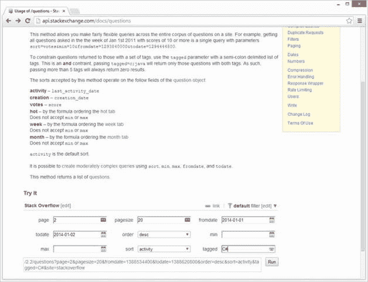

[图 3-1](#_Fig1) 。StackExchange API“试用”功能

[图 3-1](#Fig1) 展示了你将如何着手搜索 2014 年 1 月 1 日至 2 日之间被问到的 C#问题。查询被分成 20 页，我们要求第二页的结果；也就是问题编号 21 到 40。如果您点击“运行”按钮，当前的查询将被执行，其结果将显示在同一窗口的正下方。

另请注意，当您编辑查询时,“Run”按钮左侧的部分会如何变化，从而反映您的编辑。显示的是实际的查询，您可以使用它来获取数据。例如，如果您正在寻找标记为 C#的问题，页面上将出现图 3-2 中的屏幕:

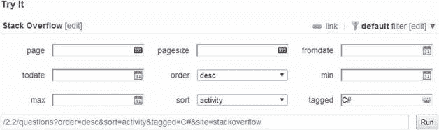

[图 3-2](#_Fig2) 。一个简单的问题

你现在可以简单地将这个查询粘贴到你的浏览器中，并在它前面添加[http://api.stackexchange.com/](http://api.stackexchange.com/)；例如，[https://api.stackexchange.com/2.2/questions?order=desc&sort = activity&site = stack overflow&tagged](https://api.stackexchange.com/2.2/questions?order=desc&sort=activity&site=stackoverflow&tagged)= C%23(注意我们如何用 C %23 替换 C#，从而用安全编码% 23 替换不安全的 ASCII 字符#)将产生类似于[图 3-3](#Fig3) 所示的结果。

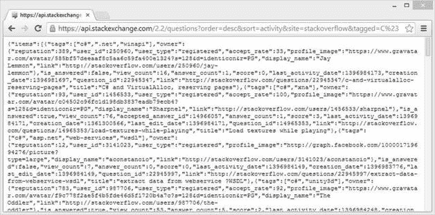

[图 3-3](#_Fig3) 。在浏览器中运行查询

我们现在可以从。例如，使用 WebRequest . NET。然而，仍然有一个问题需要解决:我们得到的是一个 JSON 文档(项目，这是一个问题列表)，我们仍然需要创建一个. NET 类来表示这些，然后将每个项目反序列化到其中。虽然这不是一个特别复杂的任务，但却很乏味。如果我们有一种机制可以“仅仅”查看该模式，为它创建一个合适的类型，并将响应加载到其中，那就太好了。好消息是这正是类型提供者所做的。

使用 JSON 类型提供者

Type 提供者是一个开放的机制；也就是说，任何人都可以实现它。因此，除了 Microsoft 在 F# 3.0 发布时发布的一些类型提供程序之外，F#社区还实现了许多针对各种资源的附加类型提供程序。其中大部分已整合到 FSharp 中。数据库；它是主线类型提供者的事实上的社区参考，并且被很好地维护和记录。

获取包和 F#脚本

要在 F#脚本中使用库，您需要通过使用#r 指令来引用它。例如，要使用库 MyLibrary，它是 dll libraryAssembly.dll 的一部分，您可以在脚本中运行下面两行:

# r " path-to-the-dll/library assembly . dll "
打开 MyLibrary

使用 NuGet 包的一个快速而简单的方法是安装该包，在解决方案资源管理器的 References 文件夹中查找它，并将其完整路径从属性窗口复制/粘贴到脚本中，如图 3-4 所示。

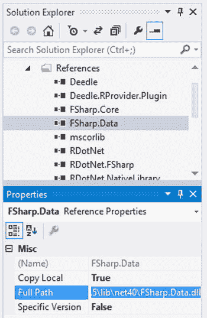

[图 3-4](#_Fig4) 。检索程序集的完整路径

不过，这种方法存在一些问题。默认情况下，NuGet 包被下载到解决方案的 packages 文件夹中，其中每个包都存储在一个包含其名称和特定版本号的文件夹中。因此，使用默认的 Visual Studio 项目结构，您的脚本将如下所示:

# r @ " \ Mathias \ Documents \ Visual Studio 2013 \ Projects \ project name \ packages \ package name . 1 . 2 . 3 \ lib \ net40-full \ assembly . dll "

这显然不太好:路径取决于本地机器和版本号，这两者都可能改变。您可以通过使用相对路径和#I 指令来解决第一个问题，该指令添加了应该在其中搜索程序集的路径:

#我"..\ packages "
# r @ " package name . 1 . 2 . 3 \ lib \ net 40-full \ assembly . dll "

版本号问题更棘手；每次更新到较新版本的库时，您的脚本都会中断，直到您手动修复路径。paket([http://fsprojects.github.io/Paket/](http://fsprojects.github.io/Paket/))，一个用于。NET 为这个问题提供了一个很好的解决方案。我们将在本书的其余部分使用特定于版本的路径，因为在这种情况下，它有利于澄清使用的是哪个版本。

在 FSharp 中可以找到的类型提供程序中。数据是 JSON 类型提供者。它的行为是典型的规范类型提供程序的工作方式。涉及以下步骤:

*   首先，通过查看样本数据来创建类型，
*   然后将实际数据源中的数据加载到已经创建的类型中。

让我们创建一个新的 F#解决方案，添加一个对 FSharp 的引用。安装相应的 NuGet 包，并引用 FSharp。数据库中默认的 Script.fsx 文件，如[清单 3-1](#list1) 所示。

[***清单 3-1***](#_list1) 。使用 JSON 类型提供程序检索最新的 StackOverflow C#问题

```py
#I @"..\packages\"
#r @"FSharp.Data.2.2.0\lib\net40\FSharp.Data.dll"

open FSharp.Data

type Questions = JsonProvider<"""https://api.stackexchange.com/2.2/questions?site=stackoverflow""">

let csQuestions = """https://api.stackexchange.com/2.2/questions?site=stackoverflow&tagged=C%23"""
Questions.Load(csQuestions).Items |> Seq.iter (fun q -> printfn "%s" q.Title)
```

运行这个示例代码应该会产生一个包含 30 个问题标题的列表(默认页面大小为 30)，这是在 StackOverflow 上被问到的标记为 C#的最活跃的问题。由于查询的时间依赖性，结果会因机器而异。

 **提示** F#支持两种机制来处理包含特殊字符的字符串。逐字字符串将忽略转义字符，如\，并允许您通过使用双引号在字符串中嵌入引号，如下所示:printfn @ " He said " " hello " "！"。三重引号也忽略转义字符，而是直接允许里面使用引号，像这样:printfn " " "他说"你好！""".

这是怎么回事？第一块，类型问题= JsonProvider <...>，根据样本数据创建一个类型，问题。从我们提供的 URL 通过网络访问示例数据，正如我们前面看到的，它调用 StackExchange API 并以 JSON 文档的形式返回 30 个最近的问题。类型提供程序扫描该示例，并根据需要创建适当的属性和类型。例如，如果你输入问题。在 Visual Studio 的脚本文件中，等待 IntelliSense 为您提供提示，您将看到两件事。首先，Questions 包含了几个类，这些类是根据示例所包含的内容自动创建的:Item、Owner 和 Root。尝试单击 IntelliSense 启动后显示的下拉菜单中的项目；您应该看到它公开了一堆属性，比如 member accepted answerid:Option<int>。基于该示例，TP 已经生成了一个具有适当类型的类(当存在时，接受的答案 ID 应该是一个整数，但是如果没有提供满意的答案，也可以不存在)。

Questions 还公开了一个加载方法。这个方法可以用来从一个特定的源中检索数据，它应该返回一些适合问题类型的内容。脚本的第二部分是这样的:我们传入一个查询，请求最近标记为 C#(编码为 C%23)的问题，类型提供者通过网络发出请求，接收一个 JSON 文档，并自动将其转换为完整的类型。

您可以以稍微不同的方式使用 JSON 类型提供者，这可能有助于阐明这里的工作机制。除了调用 StackExchange API 来生成问题类型之外，您还可以直接向它提供一个示例，或者作为文件，或者作为内联字符串。清单 3-2 说明了这个过程:我们提供一个我们期望从 API 得到的 JSON 输出的有效样本，作为一个普通的字符串(用[ <文字>属性标记，它把它编译成一个常量文字)，然后把这个样本传递给类型提供者，它将根据样本中数据的结构创建一个新的 F#类型。

[***清单 3-2***](#_list2) 。从本地 JSON 示例创建类型

```py
[<Literal>]
let sample = """{"items":[
{"tags":["java","arrays"],"owner": // SNIPPED FOR BREVITY"},
{"tags":["javascript","jquery","html"],"owner": // SNIPPED FOR BREVITY"},],
"has_more":true,"quota_max":300,"quota_remaining":299}"""

type HardCodedQuestions = JsonProvider<sample>
```

此时，编译器已经基于示例字符串创建了一个类型，您可以使用它通过传入一个查询来访问来自 StackExchange API 的数据，该查询预计将返回一个遵循相同结构的 JSON 响应；例如，提出与 Java 相关的问题:

```py
[<Literal>]
let javaQuery = "https://api.stackexchange.com/2.2/questions?site=stackoverflow&tagged=java"

let javaQuestions = HardCodedQuestions.Load(javaQuery)
```

换句话说，编译器使用该示例来生成类型；JSON 是来自本地文件还是通过网络传输并不重要。一旦创建了类型，就可以使用它来加载具有适当形状的数据。例如，如果我们使用这种类型调用不同的 API 端点，我们会得到一个运行时异常。

这两种方法之间一个有趣的区别是，如果模式随时间变化，它们会有不同的含义。例如，假设 Title 属性被重命名为其他名称。在第一种情况下，我们会得到一个编译时错误，因为每次我们通过访问 API 进行构建时都会创建该类型，编译器会发现我们正在使用一个不再存在的属性。相比之下，当使用“本地样本”时，我们会得到一个运行时错误:我们的类型基于一个陈旧的样本，它仍然具有旧的属性，并且不匹配的情况只会在我们试图访问实时数据时被发现。

构建一个最小的 DSL 来查询问题

StackExchange API 非常简单，在我们进行的过程中，简单地手工编写查询并不困难。然而，这将在我们的代码中引入大量的重复，从而产生潜在的打字错误和错误。让我们避免这一点，创建一个最小的领域特定语言，或者，正如他们通常所说的，DSL。

您可能注意到 StackExchange API 请求遵循一种模式:从一个基本 URL([https://api.stackexchange.com/2.2/](https://api.stackexchange.com/2.2/))我们附加一个字符串，编码我们感兴趣的实体(问题)，后面是一个问号和可选参数，进一步指定查询(？site = stack overflow&tagged = C % 23；F%23)。简化我们的查询构造的一种方法是利用该模式，创建一些小函数来描述我们如何修改基本查询来满足我们的需求，这样我们就可以在一个美观易读的流水线中组合这些操作。参见[清单 3-3](#list3) 。

[***清单 3-3***](#_list3) 。构建最小查询 DSL

```py
let questionQuery = """https://api.stackexchange.com/2.2/questions?site=stackoverflow"""
let tagged tags query =
    // join the tags in a ; separated string
    let joinedTags = tags |> String.concat ";"
    sprintf "%s&tagged=%s" query joinedTags

let page p query = sprintf "%s&page=%i" query p

let pageSize s query = sprintf "%s&pagesize=%i" query s

let extractQuestions (query:string) = Questions.Load(query).Items
```

本质上，questionQuery 定义了我们开始的基本查询。后面的三个函数将可选的查询细节附加到该查询中，最后一个函数 extractQuestions 尝试使用已经构造的查询字符串加载数据，然后检索相应的项。请注意，我们不必提供类型注释，因为 sprintf 包含了足够的提示，编译器可以推断出正确的类型。

让我在这里提醒您注意一个模式:每个函数都以 query 作为它的最终参数。来自 C#，这是相当不寻常的。通常，C#方法中的参数按重要性排序，从不可或缺的开始，向不太重要的移动。您将在 F#代码中经常看到这种“倒置”模式，因为它支持使用流水线转发操作符| >将函数组合到工作流中。 pipe-forward 操作符允许您将函数的最后一个参数替换为前一个函数的计算结果，例如，add 42 1 相当于 1 | > add 42。在我们的例子中，我们可以检索 100 个标记为 C#的问题和 100 个标记为 F#的问题，使用非常容易理解的代码。参见[清单 3-4](#list4) 。

[***清单 3-4***](#_list4) 。使用我们的 DSL 提取标记为 C#和 F#的问题

```py
let ``C#`` = "C%23"
let ``F#`` = "F%23"

let fsSample =
    questionQuery
    |> tagged [``F#``]
    |> pageSize 100
    |> extractQuestions

let csSample =
    questionQuery
    |> tagged [``C#``]
    |> pageSize 100
    |> extractQuestions
```

 **提示**任何被双反斜杠包围的字符串，比如“C#”，都是有效的标识符。这对于提高代码的可读性非常有帮助；在这种情况下，比如“C#”的含义就比“C%23”形式明显得多。这个特性的一个常见用法是在测试环境中:不要将测试方法命名为 _Price:Should_Be_Positive()，您可以简单地编写“价格应该是正数”()。

我们用了 7 行代码来引用 JSON 类型提供者并编写一个最小的 DSL 在这一点上，我们已经完全准备好去破解数据本身并进行探索。例如，比较哪些标签或主题最常与任一组相关联是一个行的问题，如[清单 3-5](#list5) 所示。

[***清单 3-5***](#_list5) 。按语言比较标签

```py
let analyzeTags (qs:Questions.Item seq) =
    qs
    |> Seq.collect (fun question -> question.Tags)
    |> Seq.countBy id
    |> Seq.filter (fun (_,count) -> count > 2)
    |> Seq.sortBy (fun (_,count) -> -count)
    |> Seq.iter (fun (tag,count) -> printfn "%s,%i" tag count)

analyzeTags fsSample
analyzeTags csSample
```

将一个项目序列作为输入，我们收集标签以将序列展平为单个序列，对每个标签进行计数，过滤掉出现少于两次的标签，按降序计数排序，最后打印出标签及其计数。

 **提示**下划线在“解包”元组时用作通配符。这让您免去了为未使用的变量创建名称的麻烦，也有助于指示您正在使用的元组元素。

如果运行这个查询，您可能会观察到稍微不同的结果，因为查询是时间相关的。然而，我怀疑它的要点仍然是我观察到的(见[表 3-1](#Tab1) )。

[表 3-1](#_Tab1) 。C#和 F#问题最常见的标签

| 

C#标记

 | 

F#标签

 |
| --- | --- |
| c#，100wpf，13。净，13asp.net，11实体框架，5异步，5ASP.NET-MVC-4.5sql，5linq，4xaml，4windows 应用商店应用程序，4 | f#，100f #-数据，10类型提供程序，7函数式编程，6f#-3.0，6c#，5。净额，5f #-交互式，5 |

感兴趣的 C#主题的很大一部分围绕着客户端技术和 web，而 F#看起来更侧重于数据(在这一点上，您应该不会感到太惊讶)。有趣的是，很大一部分 C#问题与 F#类型提供者大大简化的技术有关(sql 和数据访问、xaml 等等)。

我们在这一章的目标不是对 StackOverflow 进行全面的分析(我们将在后面的第 5 章中研究这个问题)，而是说明类型提供者和 F#是如何让处理不同来源的数据变得如此简单。虽然我们在这里关注的是一个 JSON 示例，但是大多数面向数据的类型提供者(CSV、XML 等等)都遵循类似的模式，首先获取数据样本来推断要创建什么类型，然后使用所创建的类型来加载数据。在本节中，我们将对 StackOverflow 的探索留到这里——您可以自己探索更多！

世界上所有的数据

既然我们已经看到了什么是类型提供者，以及它们如何使针对数据的编程变得异常简单，我想把重点放在与数据科学家特别相关的两个相关主题上。第一个是 Deedle，一个. NET 数据框架库，它大大简化了数据集的操作和分析。第二个是 R 类型提供者，它使得 R 统计语言可以从 F#内部获得，并开放其庞大的统计和可视化包生态系统。

世界银行类型的提供者

世界银行是一个联合国国际金融机构，为发展中国家的资本项目提供贷款。它还因维护并向公众提供非常丰富的社会经济信息数据集而闻名。你可以对数据集在[http://data.worldbank.org/](http://data.worldbank.org/)所包含的内容有所了解；对于世界上 200 多个国家中的每一个国家，你都可以下载 1400 多个指标的数十年年度数据，涵盖从经济&增长到性别或基础设施等主题。

所有的东西都是小马和独角兽，然后呢？不完全是。问题是，虽然数据已经存在，但获取数据有点繁琐。比方说，如果我想获得 2000 年和 2010 年的人口，以及世界上每个国家当前的地表，我将不得不做大量的导航工作来选择合适的国家、指标和年份；我得到的是一个文件(Excel、CSV 或 XML)，我可能还需要对它稍加修改，使其符合我的需要。此外，如果我不知道它叫什么，找到我关心的系列(或国家)可能并不总是显而易见的。

注意，这绝不是对世行网站的批评，世行网站其实很优秀。问题是很难创建一个用户界面来自由选择用户想要的，同时在一个大的数据语料库中进行分层导航。这里非常方便的是一种不同的机制，它使我能够动态地查询和发现数据——这正是 FSharp。世界银行类型提供商提供的数据。它遵循一种与我们迄今所见略有不同的模式。它不是使用模式信息为通用数据格式创建类型，而是专门为该数据源编写的，唯一的目的是以最少的工作量使数据可被发现和可用。

使用世界银行类型提供程序只需要安装 FSharp。Data NuGet 包，在脚本中添加对它的引用，并创建数据上下文，这将建立到世界银行的连接，如清单 3-6 中的[所示。](#list6)

[***清单 3-6***](#_list6) 。使用世界银行类型提供程序

```py
#I @"..\packages\"
#r @" FSharp.Data.2.2.0\lib\net40\FSharp.Data.dll"

open FSharp.Data

let wb = WorldBankData.GetDataContext ()
wb.Countries.Japan.CapitalCity
```

一旦创建了数据上下文，就可以使用它直接访问世界银行，并使用智能感知发现哪些数据可用(参见[图 3-5](#Fig5) )。

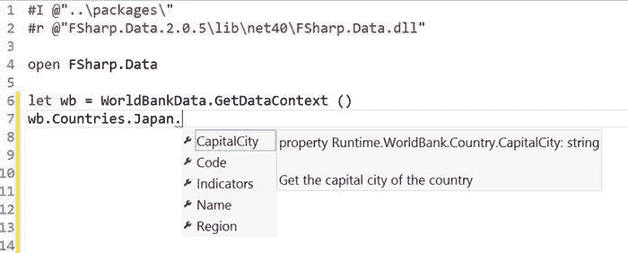

[图 3-5](#_Fig5) 。使用智能感知导航世界银行数据

我们在这里要做的只是检索世界上每个国家在 2000 年和 2010 年的人口，这相当简单:

```py
let countries = wb.Countries

let pop2000 = [ for c in countries -> c.Indicators.``Population, total``.[2000]]
let pop2010 = [ for c in countries -> c.Indicators.``Population, total``.[2010]]
```

世界银行类型的提供者让我们能够立即访问数据宝库；话虽如此，现在我们面临一个新问题，即我们如何从中提取一些有趣的信息？搜寻数百个国家的数据点，希望从中发现规律，这并不是从数据中挖掘有趣事实的最有效方法。如果有一些统计工具供我们使用就好了——幸运的是，多亏了 R 类型提供者，我们已经有了这些工具。

R 类型提供程序

r 是“统计计算和图形的自由软件环境”用它自己的话说([www.r-project.org](http://www.r-project.org))它是一种由统计学家为统计学家设计和实现的编程语言。它是开源的，完全免费，附带了一个由 R 社区创建的令人惊叹的软件包生态系统，几乎涵盖了统计学的每个领域。

R 型提供者是一种有趣的生物。到目前为止，我们已经看到了专注于使数据可被发现的例子。R provider 做了一些类似的事情，但是是针对一种完全不同类型的外部资源:编程语言。假设您的机器上安装了 R，它会发现已经安装了哪些包，然后让您在 F#环境中打开它们，就像它们是正常的一样。网络图书馆。它还可以让你发现哪些 R 函数是可用的，并从 F#中直接调用它们。

使用 R 类型提供程序安装 R 需要在你的机器上安装 R。r 是完全免费和开源的，可以在所有平台上运行。你可以在 http://www.r-project.org/找到关于 R 的说明和文档。请注意，虽然 R 在所有平台上都运行良好，但在撰写本文时，R 类型提供程序在 mono 上仅得到部分支持。

让我们看看 R 提供商能为我们做些什么。首先，让我们安装 NuGet 包 RProvider，并在我们的脚本中添加对它的所需引用:

```py
#r @"R.NET.Community.1.5.16\lib\net40\RDotNet.dll"
#r @"RProvider.1.1.8\lib\net40\RProvider.Runtime.dll"
#r @"RProvider.1.1.8\lib\net40\RProvider.dll"
open RProvider
open RProvider.``base``
open RProvider.graphics
```

此时，我们可以开始打开各种 R 包并使用它们。在这里，我们将打开基础包和图形包，它们公开了基本函数和图表。请注意如果您键入 open RProvider。，IntelliSense 将开始显示您的计算机上实际存在哪些包。作为可能的快速介绍，让我们做一个国家表面积的基本分析(见[清单 3-7](#list7) )。

[***清单 3-7***](#_list7) 。来自 R 的基本汇总统计数据

```py
// Retrieve an (F#) list of country surfaces
let surface = [ for c in countries -> c.Indicators.``Surface area (sq. km)``.[2010]]
// Produce summary statistics
R.summary(surface) |> R.print
```

我们使用世界银行类型提供程序检索每个国家的表面积，并将值存储在 F#列表中。使用 R 将再次通过 IntelliSense 显示我们的环境中当前可用的函数。首先，让我们通过调用 R.summary，然后调用 R.print 生成一个表面积变量的摘要，这将生成以下“漂亮的打印结果:”

```py
    Min.  1st Qu.   Median     Mean  3rd Qu.      Max.     NA's
       2    11300    99900   630200   450300  17100000        1
```

 **注意**如果你只运行 R.summary，你可能会注意到它会返回一个 RDotNet.SymbolicExpression .为了避免 R 和。NET 类型时，R 类型提供程序通常通过 R 符号表达式(数据和/或操作的 R 表示形式)将信息发送给 R，并尽可能以这种形式保存信息，然后转换回。NET 类型。

这里没有什么惊天动地的东西，但是很方便。摘要返回最小值和最大值、平均值、三个四分位数(大于样本的 25%、50%和 75%的值)以及缺失值的数量(NA)。一眼看去，我们发现地表面积大相径庭，从最小的 2 平方公里到最大的 1700 万平方公里不等——还有一个国家我们没有找到任何数据。这很有用，但是考虑到数值看起来是如此分散，图表将帮助我们更好地理解数据的“样子”用 R.hist(surface)函数很容易做到这一点，它产生了图 3-6 中的图表。

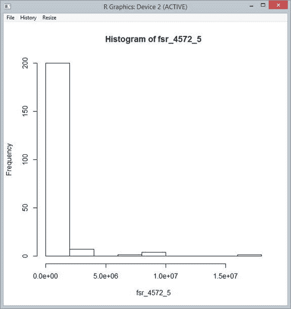

[图 3-6](#_Fig6) 。使用 R 图形的国家表面的基本直方图

我会把它给你——这不是一张漂亮的图表。X 轴显示的不是表面积，而是一个变量，它的名字很不响亮，叫 fsr_4572_5。我们将在后面看到如何创建更好的图表，但请记住，我们只需调用 R.hist 即可生成此图表，它非常适合于探索，并快速向我们显示我们需要知道的所有信息，即表面积分布非常不均匀，有绝大多数相对较小的国家，也有少数大国。

如果我们想更好地了解狼群中间的情况，我们可以画出国家表面积的对数。这里的好处是我们可以使用任何我们认为最适合这项工作的工具:F#代码或 R 函数。在这种情况下，我们可以使用 F#代码，比如 r . hist(surface | > list . map log)；然而， R.log 函数更短，所以我们将使用 R.hist(surface | > R.log ),它产生了图 3-7 中的图表。

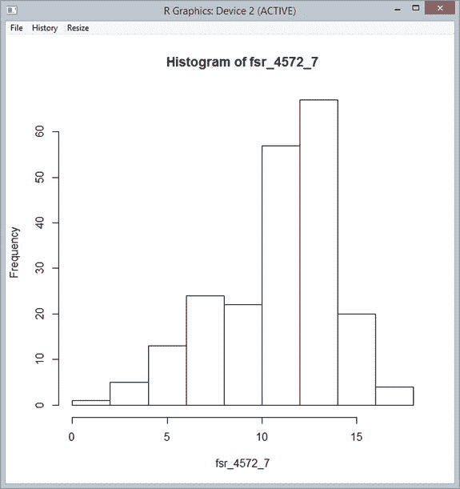

[图 3-7](#_Fig7) 。使用 R 图形对国家地表面积进行对数转换

直方图是了解特征分布的好方法。不过，数据可视化的主力是散点图，它将数据点投射到二维图表上。这是探索特征之间关系的一种非常方便的方式。例如，我们可能想知道一个国家的表面积和人口是否相关。解决这个问题的一种方法是在一个轴上绘制人口，在另一个轴上绘制表面积，使用 R.plot(surface，pop2010)并目测结果，如图 3-8 所示。

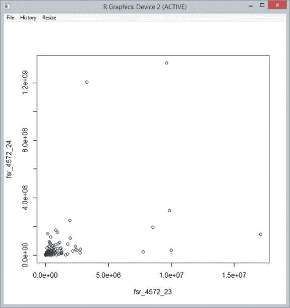

[图 3-8](#_Fig8) 。使用 r 图的基本散点图

从表面上看，表面和人口似乎最多只有有限的关系；散点图显示没有明显的模式。

这个简单的场景说明了 R 如何通过生成简单的统计数据和图表来帮助我们更好地理解各个特性。然而，如果数据集很重要，那么一次处理一个要素很快就会变成一场噩梦。挖掘数据时，通常会有许多要素，您需要能够快速探索它们之间的关系，并通过组合现有要素将它们重新排列成新的要素。这就是为什么数据框(我们接下来将探讨的主题)在数据科学家中如此受欢迎的原因。

与 R 个数据帧一起分析数据

简而言之，数据框是一种面向操作一组观测值的数据结构。每个观察值对应于数据框中的一个单独的行，但是也可以将单个要素作为列来访问。从这个意义上说，数据帧类似于数据库表，但是面向内存中的操作。就其本身而言，这已经非常方便了:这保留了单个行的类型信息，但是极大地简化了操作，例如“计算收入超过 100 万的客户的平均订单数量”，这并不难，但是需要一遍又一遍地重复类似的代码。参见[图 3-9](#Fig9) 。

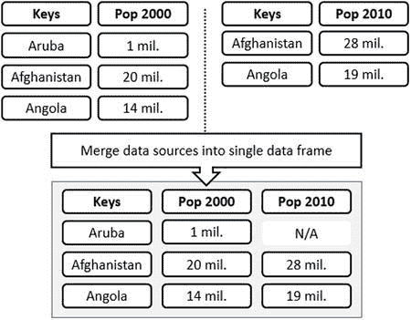

[图 3-9](#_Fig9) 。将各种数据源合并到一个数据框中

数据框架的另一个主要目的是帮助将数据源合并成一个框架。因此，数据框通常依靠关键字来唯一标识每一行数据，以便将各种要素与正确的行相关联，然后进行连接。另一个重要的相关功能是缺失值的管理:如果我试图连接两个要素(例如，国家的表面积和人口)，并且其中一些要素的数据不完整，那么我会希望生成的数据框包含所有国家的联合，但指出哪些国家有缺失数据，并在计算(例如，平均表面积)时处理缺失数据，而不会有太多麻烦。最后，数据框通常支持动态列创建。在我们之前的例子中，我可能想研究一个新的特征，比如国家密度(人口除以表面积)；数据框通常允许您添加新列，并以简单的方式表达列组合。

数据帧是 R 的核心类型之一；今天，数据科学家使用的大多数编程语言都有一个数据框架库。它们通常受到 R 数据框架的启发，但是根据语言的特性，它们有不同的风格。。NET 也不例外；有几个很好的商业产品和一个很棒的开源库 Deedle，我们将在这里简单演示一下。

但是在研究 Deedle 之前，让我们先看看如何使用原生 R 数据帧。R 类型提供者附带了几个实用函数，使得从 F#创建 R 数据帧更加容易。作为一个例子，尝试清单 3-8 中的代码。

[***清单 3-8***](#_list8) 。创建和绘制 R 数据框

```py
let pollution = [ for c in countries -> c.Indicators.``CO2 emissions (kt)``.[2000]]
let education = [ for c in countries -> c.Indicators.``School enrollment, secondary (% gross)``.[2000]]

let rdf =
    [ "Pop2000", box pop2000
      "Pop2010", box pop2010
      "Surface", box surface
      "Pollution", box pollution
      "Education", box education ]
    |> namedParams
    |> R.data_frame

// Scatterplot of all features
rdf |> R.plot

// Summary of all features
rdf |> R.summary |> R.print
```

我们检索了几个附加要素(以二氧化碳排放量衡量的污染，以中学入学率衡量的教育),并创建了一个包含五列的数据框，每一列都与一个名称相关联。一旦创建了数据框，我们就可以生成一个摘要，它会产生以下输出:

```py
>
    Pop2000             Pop2010             Surface           Pollution
 Min.   :9.419e+03   Min.   :9.827e+03   Min.   :       2   Min.   :     15
 1st Qu.:6.255e+05   1st Qu.:7.981e+05   1st Qu.:   11300   1st Qu.:   1050
 Median :5.139e+06   Median :5.931e+06   Median :   99900   Median :   6659
 Mean   :2.841e+07   Mean   :3.207e+07   Mean   :  630216   Mean   : 122608
 3rd Qu.:1.631e+07   3rd Qu.:2.097e+07   3rd Qu.:  450300   3rd Qu.:  53601
 Max.   :1.263e+09   Max.   :1.338e+09   Max.   :17098240   Max.   :5713560
                                         NA's   :1          NA's   :20
   Education
 Min.   :  6.051
 1st Qu.: 41.699
 Median : 78.588
 Mean   : 70.782
 3rd Qu.: 93.882
 Max.   :160.619
 NA's   :70
```

我们甚至可以通过将整个数据框直接传递到 R.plot 来一起可视化所有特征，如[图 3-10](#Fig10) 所示。

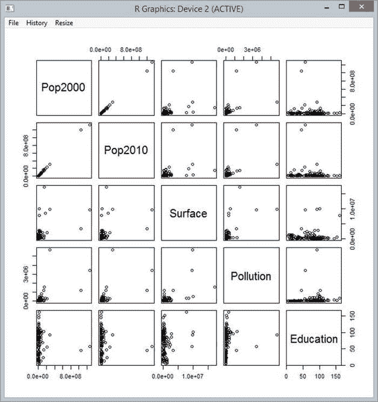

[图 3-10](#_Fig10) 。可视化特征之间的关系

这样的图表非常有用。乍看之下，Pop2000 和 Pop2010 很明显是相关的:它们的散点图形成了一条近乎完美的直线。教育似乎独立于所有其他四个特征(没有清晰的视觉模式出现)，表面积和污染似乎与人口有一定的关系(人口越多，值越大)。还要注意，虽然我们有大量的缺失值，但 R 没有眨眼，并且优雅地处理了这个问题。

这里的细节并不特别重要；我希望我在这里表达的观点是，数据框在处理多种要素时非常方便。然而，除了像这样的简单情况之外，使用 R 数据帧本身操作 F#中的数据是相当不愉快的。这就是 Deedle 的用武之地:它是。NET，其语法被设计成。NET 友好的(对 C#和 F#都适用)，但是可以使用 Deedle RProvider 插件直接提供给 R。

Deedle，一个. NET 数据框架

Deedle 的两个核心构建模块是系列和框架。一个*系列*是一个键值对集合；系列可以合并到一个数据框中，并在键上匹配，自动管理缺失值。让我们先用一个玩具例子来说明 Deedle 是如何工作的，然后在一个更有趣的场景中使用它(见[清单 3-9](#list9) )。

[***清单 3-9***](#_list9) 。用 Deedle 创建系列和数据帧

```py
#r @"Deedle.1.0.7\lib\net40\Deedle.dll"
open Deedle

let series1 = series [ "Alpha", 1.; "Bravo", 2.; "Delta", 4\. ]
let series2 = series [ "Bravo", 20.; "Charlie", 30.; "Delta", 40\. ]
let toyFrame = frame [ "First", series1; "Second", series2 ]

series1 |> Stats.sum
toyFrame |> Stats.mean
toyFrame?Second |> Stats.mean

toyFrame?New <- toyFrame?First + toyFrame?Second
toyFrame |> Stats.mean
```

我们创建两个系列，关联一个键(“Alpha”，“Bravo”，...)和一个值，并从中创建一个框架，给每个系列一个名称(“第一”、“第二”)。我们现在可以对每个系列执行操作(例如，获取其总和)，或者对整个数据框执行操作，或者使用 DataframeName？ColumnName，就是 toyFrame 里的那个？第二。请注意，尽管两个系列都有缺失值，但数据框是如何优雅地处理平均值计算的。

本例中最有趣的部分是最后两行，我们动态地创建并命名了一个新列，并根据其他列对其进行了定义。此时，我们的数据框包含三列，而不是最初看到的两列，我们可以开始使用新列，就像它从一开始就存在一样。

 **提示**？运算符用于访问动态属性。它的用法在 F#中相当少见，因为它意味着放弃静态类型的安全性。然而，对于像 Deedle 这样的库来说，这是有意义的。如果我们需要自由地将数据添加到现有的框架中，我们无法提前创建一个具有已知属性的单一类型。因此，框架的行为类似于 Expando 对象，当新的系列添加到框架中时，会创建新的属性。

除了我们在这里看到的，还有更多要讨论的；我鼓励你去文档页面([http://bluemountaincapital.github.io/Deedle/](http://bluemountaincapital.github.io/Deedle/))亲自看看你能用它做什么。此示例旨在让您了解数据框是什么，并通过展示 Deedle 背后的一些关键思想来帮助您开始。现在让我们看一个集成 R 和 Deedle 的例子。

全世界的数据，联合起来！

在上一节中，我们开始研究世界人口，从世界银行类型提供者获取数据。超过某一点后，很难在大型数据集中区分任何模式，对于超过 200 个国家的列表，我们需要其他东西。真正有用的是地图。幸运的是，许多现存的 R 包之一 rworldmap，正如它的名字所暗示的那样:创建世界地图。一种方法是简单地将数据附加到国家，然后让软件包发挥它的魔力。

让我们从绘制 2000 年和 2010 年各国的人口图开始。首先，我们将创建一个 Deedle 数据框架，并用世界银行的数据填充它。要做到这一点，我们需要构建一个序列，如果您还记得的话，这个序列被构造为键值对的集合。我们还希望 rworldmap 能够使用这些信息，以便将正确的数据点与正确的国家联系起来。事实证明，rworldmap 和世界银行都支持 ISO3 代码，这是三个字母的代码，可以唯一地识别国家——这就是我们将用于密钥的代码。

为了清楚起见，让我们创建一个新的脚本文件 WorldMap.fsx，并构建我们的数据框，如清单 3-10 所示。

[***清单 3-10***](#_list10) 。利用世界银行数据构建 Deedle 数据框架

```py
#I @"..\packages\"
#r @"FSharp.Data.2.2.0\lib\net40\FSharp.Data.dll"
#r @"Deedle.1.0.7\lib\net40\Deedle.dll"

open FSharp.Data
open Deedle

let wb = WorldBankData.GetDataContext ()
let countries = wb.Countries

let population2000 =
    series [ for c in countries -> c.Code, c.Indicators.``Population, total``.[2000]]
let population2010 =
    series [ for c in countries -> c.Code, c.Indicators.``Population, total``.[2010]]
let surface =
    series [ for c in countries -> c.Code, c.Indicators.``Surface area (sq. km)``.[2010]]

let ddf =
    frame [
        "Pop2000", population2000
        "Pop2010", population2010
        "Surface", surface ]
ddf?Code <- ddf.RowKeys

#r @"R.NET.Community.1.5.16\lib\net40\RDotNet.dll"
#r @"RProvider.1.1.8\lib\net40\RProvider.Runtime.dll"
#r @"RProvider.1.1.8\lib\net40\RProvider.dll"
#r @"Deedle.RPlugin.1.0.7\lib\net40\Deedle.RProvider.Plugin.dll"let dataframe =
    frame [ 
        "Pop2000", population2000
        "Pop2010", population2010
        "Surface", surface ]
dataframe?Code <- dataframe.RowKeys
```

我们只需检索 2000 年和 2010 年的人口，以及国家的地表面积，并创建三个系列，将每个国家输入其国家代码。然后，我们创建一个 Deedle 数据框，给每个系列一个单独的名称，最后添加另一个系列“Code”，它直接显示国家代码(为了将地图与国家数据联系起来，我们将需要它)。

既然数据框中有了数据，我们需要创建一个地图，并定义如何用数据连接每个国家。这相当简单，如清单 3-11 所示。

[***清单 3-11***](#_list11) 。使用 rworldmap 创建地图

```py
#r @"R.NET.Community.1.5.16\lib\net40\RDotNet.dll"
#r @"RProvider.1.1.8\lib\net40\RProvider.Runtime.dll"
#r @"RProvider.1.1.8\lib\net40\RProvider.dll"
#r @"Deedle.RPlugin.1.0.7\lib\net40\Deedle.RProvider.Plugin.dll"

open RProvider
open RProvider.``base``
open Deedle.RPlugin
open RProvider.rworldmap

let map = R.joinCountryData2Map(dataframe,"ISO3","Code")
R.mapCountryData(map,"Pop2000")
```

我们打开 Deedle R 插件(它使 Deedle 数据框可由 R 直接使用)和 rworldbank 包，然后我们创建一个地图，定义数据来自哪里(数据框 ddf)以及如何通过使用列“Code”(它映射到世界银行国家代码)作为 ISO3 代码(rworldbank 中的内置选项之一)将地图上的每个国家连接到数据框中的数据。我们准备好了:运行 R.mapCountryData(map，“Pop2000”)将从数据框中检索 Pop2000 列中的所有值，并通过将 Code 列与国家/地区 ISO3 代码进行匹配，将其附加到国家/地区，从而生成类似于图 3-11 中的地图。对于十几行代码来说还算不错！

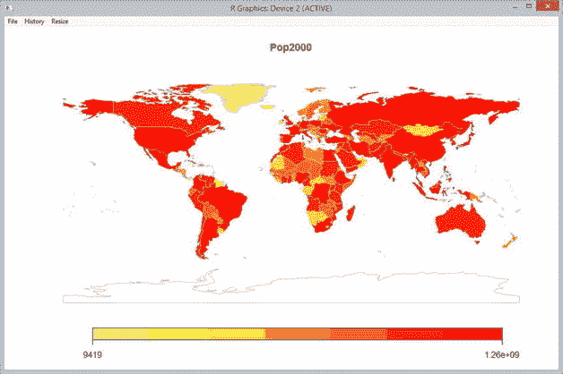

[图 3-11](#_Fig11) 。2000 年世界人口地图

 **注意**安装 R 包。当您在机器上安装 R 时，它会安装一个提供基本功能的最小软件包集。然而，R 的主要好处之一是它庞大的软件包生态系统，它为几乎任何可视化或统计场景提供解决方案。r 附带了一个内置的包管理器，它允许您轻松地在本地机器上下载和安装包。例如，我们在这里使用的 rworldmap 包不是标准的。要安装它，您可以从 R 环境本身调用 install.packages("rworldmap ")，或者通过使用 open RProvider.utils 和 R . install _ packages([" rworldmap "])从 F# Interactive 使用 R 类型提供程序。这将提示您一个下载站点，然后将软件包及其依赖项安装到您的计算机上，这样您就可以使用它们了。

这是一个很好的地图，也是快速找出数据集中模式的更好方法。然而，这并没有很大的启发性:我们在这里看到的是格陵兰岛、喜马拉雅山和撒哈拉沙漠的人口很少。让我们看看能否制作一些更有趣的地图。使用像 Deedle 这样的数据框而不是处理原始数据的好处之一是，它使得创建新要素变得相当容易。作为一个例子，让我们考虑国家人口密度；也就是说，每平方公里(或每英里)有多少人居住。使用 Deedle，这是一件轻而易举的事，如清单 3-12 中的[和图 3-12](#list12) 中的[所示。](#Fig12)

[***清单 3-12***](#_list12) 。制作人口密度图

```py
dataframe?Density <- dataframe?Pop2010 / dataframe?Surface
let map = R.joinCountryData2Map(dataframe,"ISO3","Code")
R.mapCountryData(map,"Density")
```

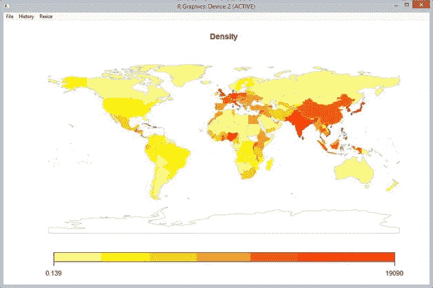

[图 3-12](#_Fig12) 。世界人口密度图

我们动态创建一个名为“密度”的新列，定义为其他两列的函数，然后简单地将地图重新绑定到更新后的数据框。这是一个有趣得多的地图，突出了世界上几个非常高密度的地区，位于西欧，东南亚和非洲。

类似地，我们可以用两条线来想象世界人口增长的地方，如清单 3-13 和图 3-13 中的[所示。](#list13)

[***清单 3-13***](#_list13) 。制作人口增长图

```py
dataframe?Growth  <- (dataframe?Pop2010 - dataframe?Pop2000) / dataframe?Pop2000
let map = R.joinCountryData2Map(dataframe,"ISO3","Code")
R.mapCountryData(map,"Growth")
```

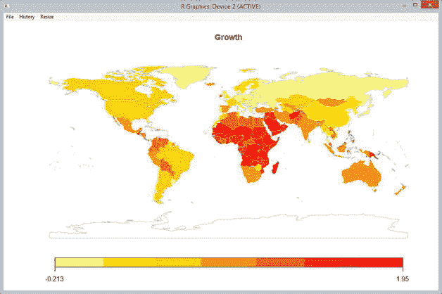

[图 3-13](#_Fig13) 。2000 年至 2010 年世界人口增长图

同样，在几行字里，我们很好地总结了突出的事实:非洲人口正在快速增长，而俄罗斯和欧洲相当一部分地区的人口正在减少。

那么，我们学到了什么？

在这一章中，我们看到了类型提供者(F#独有的特性)如何使无缝地将外部数据或资源引入。NET 类型系统。对于任何数据探索场景来说，这都是一个显而易见的生产力提升。类型提供者完成了一项非凡的壮举:获取数据本身与使用动态语言一样简单，但是使用静态类型的数据可以从编译器和工具中为用户提供额外的帮助，并防止愚蠢的错误(如属性输入错误或不正确的类型转换),否则这些错误只能在运行时发现。

也许更有趣的是，在数据可发现性方面，类型化数据也提供了巨大的好处。数据通常以主要用于解决计算机 I/O 问题而不是人类可读性的格式存储。因此，处理数据集通常是一种不必要的不愉快经历，至少对人类来说是这样。类型提供者提供了一种非常有趣的机制，使用已经使用了几十年的工具来帮助开发人员导航和理解大型代码库(可以说是复杂的数据集)的内部组织，并通过 IntelliSense 将它们应用于“普通”数据。这是一个惊人强大的机制。能够通过键入“.”来发现数据片段是如何相互关联的，或者让计算机自动查找与我输入的内容部分匹配的项目，以我的经验来看，是深入数据集并了解其组织方式的一种极其有效的方式。

本章的另一个要点说明了如何使用相同的机制使 R 的所有资源在 F#环境中可用。r 有它的支持者和反对者，但是一个很难争辩的方面是它的生态系统的深度。如果你有统计学上的问题，很有可能“有一个包可以解决”r 拥有几乎所有统计问题的软件包，并以制作精美的出版物级图表和可视化而闻名，其中的每一个都可以在 F#中找到。

R 类型提供者是 F#作为一种有效粘合语言的一个很好的例子。与通过类型提供者从 F#调用 R 相比，使用 R 特定的工具(如 RStudio)可能会提供更好的体验。然而，选择 R 作为主要的开发环境有很大的意义。r 从来没有考虑过集成，在生产中运行它，或者与其他系统对话，并不是它特别擅长的事情。最重要的是，R 没有任何类似于类型提供者的东西；从任何地方探索和加载数据的能力已经不复存在。

相比之下，F#是一种为在生产中运行关键代码而构建的语言；它碰巧也有相当不错的脚本能力。在这种情况下，使用 F#作为主要环境是非常有意义的。数据科学家可以使用它来编写脚本，使用他们喜欢的任何工具组合来构建模型原型，以及。NET 框架；然后，同样的脚本可以很容易地转换成一个类或模块，在大规模生产中运行起来不会有任何问题。

最后，我们还看到了使用 pipe-forward 操作符的函数组合如何使得创建小型的、特定于领域的语言变得非常容易。通过创建小函数并仔细考虑如何组织它们的参数，我们能够编写几行代码，然后以灵活的方式链接在一起，同时非常易读。F#中的 DSL 主题比这里的简化示例要多得多，但是这至少应该给你一个暗示，为什么这种语言非常适合它！

更进一步

在本章中，我们看到了一个类型提供者的小例子，但是几乎所有公开某种模式的数据格式都有一个类型提供者。XML、Soap、CSV、SQL、JSON 等的类型提供者是一种开放的机制:任何人都可以编写一个针对特定数据类型的类型提供者，F#社区一直忙于创建各种类型提供者。此时，fsharp.data 是最大且记录最完整的类型提供程序集合。其他几个值得一提，特别是用于静态访问 T-SQL 命令的输入参数和结果集的 SQL 命令类型提供程序([http://fsprojects.github.io/FSharp.Data.SqlClient/](http://fsprojects.github.io/FSharp.Data.SqlClient/))和 SQL 类型提供程序([https://github.com/fsprojects/SQLProvider](https://github.com/fsprojects/SQLProvider))，它支持各种 SQL 实现的探索和查询。

除了数据，以类似于 R 的方式面向不同语言的类型提供者也在开发中；从机器学习的角度来看，最有趣的是正在努力创建 Matlab 和 Python 类型的提供者。然而，在撰写本文时，这些还没有达到与 R 类型提供者相同的成熟度。

有用的链接

*   FSharp。Data 是一个维护良好并有文档记录的开源 F#类型提供者的集合:【http://fsharp.github.io/FSharp.Data/】T2
*   世界银行数据网站:[http://data.worldbank.org/](http://data.worldbank.org/)
*   R 统计环境:[http://www.r-project.org/](http://www.r-project.org/)
*   F# R 供应商:[http://bluemountaincapital.github.io/FSharpRProvider/](http://bluemountaincapital.github.io/FSharpRProvider/)
*   Deedle，一个. NET 数据框架库:[http://bluemountaincapital.github.io/Deedle/](http://bluemountaincapital.github.io/Deedle/)
*   很好的 rworldmap 包入门教程:[http://cran . r-project . org/web/packages/rworldmap/vignettes/rworldmap . pdf](http://cran.r-project.org/web/packages/rworldmap/vignettes/rworldmap.pdf)
*   Paket 是。NET:[http://fsprojects.github.io/Paket/](http://fsprojects.github.io/Paket/)
*   Fsharp。位于[http://fsprojects.github.io/FSharp.Data.SqlClient](http://fsprojects.github.io/FSharp.Data.SqlClient)的 Data.SqlClient 和位于[http://fsprojects.github.io/SQLProvider](http://fsprojects.github.io/SQLProvider)的 SQLProvider 是两个互补的类型提供者，致力于使用 SQL 数据库。