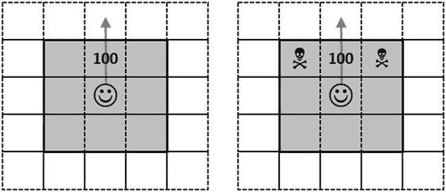

第七章


奇怪的游戏

Learning from Experience with Reinforcement Learning

想象你是一个大房间中央的生物。放眼望去，地板上到处都铺着彩色瓷砖。你感到冒险，向前迈出一步，踏上蓝色瓷砖。Zing！你感到一阵疼痛。可能青瓦不好？在你的左边是红色的瓷砖，在你的右边是蓝色的瓷砖。这次让我们试试红色。Tada！这一次，好事发生了。似乎红色的瓷砖是好的，蓝色的是坏的。默认情况下，您可能应该避免蓝色瓷砖，而更喜欢红色瓷砖。或者事情稍微复杂一些，重要的是瓷砖的特殊配置。只有一种方法可以知道——试错法。尝试一些事情，证实或否定一些假设，总的来说，多做一些看起来有效的事情，少做一些看起来失败的事情。

现实世界当然比我刚刚描述的彩色瓷砖的宇宙更复杂。然而，如果你仔细想想，我们的生活和我们虚构的生物并没有什么不同。我们在浩瀚的宇宙中进化，在那里我们会遇到新的、未知的情况。当出现这种情况时，我们会尝试各种方法。有时候，结果是立竿见影的。我非常清楚地记得我把手指插入电源插座的那一天；我很快意识到这不是一个好决定。有些课程需要更长的时间来学习；例如，通常，当你对人友好时，他们会以同样的方式回应你。当你不尊重别人的时候，通常效果很差。但它并不总是正确的，有时需要时间来观察你的行动的效果，这使得得出结论不那么明显。

在这一章中，我们将看看如何为我们的生物建造一个大脑，以便它在积累经验的同时学会以一种合理的方式行事。就其本身而言，编程让一个生物在一个颜色的迷宫中走来走去可能与大多数开发人员做的事情不太接近。然而，首先，它是一个有趣的问题——然后，它是一大类类似问题的简单、有代表性的版本，这将允许我们探索一些有趣的问题和更广泛适用的技术。我们将执行以下操作:

*   写一个非常简单的游戏，模拟一个生物发现一个它一无所知的世界的行为。使用强化学习，我们将建立一个基本策略，让生物从其行动的结果中学习，并随着经验的积累做出更好的决策。
*   分析我们最初方法的缺点，并沿着两个主要方向相应地改进学习算法。我们将看到如何通过考虑即时回报和长期后果来克服短视的决策，以及如何通过在决策过程中注入一些随机性和鼓励探索来改善学习。

构建一个简单的游戏

作为热身，让我们按照前面概述的场景，从构建一个简单的游戏开始，从一个没有大脑的生物开始，让我们看看如何模拟这个世界，并使它即使不聪明，至少也不完全愚蠢。一旦我们掌握了事情是如何工作的，我们将会更进一步，开发更复杂的版本。

这里的重点不是创造一个闪亮的方块克星电子游戏；与此同时，拥有一个真实的游戏，你可以看到事情发生，是很有趣的，所以我们会去非常古老的学校，做一个复古的基于主机的游戏。因此，让我们首先创建一个新的 F#项目，类型的控制台应用程序，我们将其命名为 SimpleGame。一旦创建了该项目，您应该会看到一个名为 Program.fs 的文件，其内容如下:

```py
// Learn more about F# at http://fsharp.net
// See the 'F# Tutorial' project for more help.

[<EntryPoint>]
let main argv =
    printfn "%A" argv
    0 // return an integer exit code
```

这是一个最小的控制台应用程序，您已经可以通过按 F5 键来运行或调试它。此时，程序将简单地运行 main 函数(应用程序的入口点)，启动一个窗口，然后立即结束执行并关闭窗口。让我们试着让这个节目更有趣吧！

这个游戏有几个不同的方面。我们需要对规则进行建模，处理控制台中的渲染，并将游戏作为程序运行。一旦我们把这些部件连接起来，我们还需要为我们的生物建造“大脑”。

建模游戏元素

所以让我们从建模开始。我们的游戏将有一个单一的生物，在正方形瓷砖的地形上进化。“生物”听起来有点贬低的意思，那就从现在开始叫英雄吧，既更讨人喜欢，也更简短。在每个回合，英雄可以做三件事:直走、左转或右转。为了能够追踪到英雄身上发生的事情，我们将需要两个额外的信息:它的位置，例如从世界的顶部和左侧，以及它的方向。

这非常符合 F#歧视工会。让我们添加一个文件 Game.fs，我们将它移动到项目文件列表的顶部，并开始一个模块游戏。

***清单 7-1*** 。为游戏元素建模

```py
namespace Game
module Game =

    type Dir =
        | North
        | West
        | South
        | East

    type Act =
        | Left
        | Right
        | Straight

    type Pos = { Top:int; Left:int }

    type Hero = { Position:Pos; Direction:Dir }
```

到目前为止很简单。接下来我们需要一个世界。为了简单起见，我们的世界将是正方形的，没有边，因此，如果你一直向北走，你将越过极限，重新出现在最南端。这使事情简化了一点，因为我们不必处理我们到达“世界末日”的情况:无论英雄在哪里，他总是可以采取三种可用行动中的任何一种。

我们的世界很简单——每个细胞要么是空的，要么包含宝藏，要么是陷阱。我们可以用几种方式来建模。现在我们将使用一个映射(大致是一个不可变的字典)来保存单元格，并且我们将只存储非空的单元格。另外，让我们立即创建一个记录来保存整个“世界的状态”，并创建一个记录来保存世界的大小。

***清单 7-2*** 。模拟游戏世界

```py
type Cell =
    | Treasure
    | Trap

type Board = Map<Pos,Cell>

type GameState = { Board:Board; Hero:Hero; Score:int }

type Size = { Width:int; Height:int }
```

游戏逻辑建模

现在我们有了构建模块，我们可以开始定义世界是如何工作的，有几个函数。我们需要的第一件事是能够移动我们的英雄:给定他的位置和方向，他(或她)在棋盘上的下一个位置是哪里？我们不能简单地增加或减少位置，因为一旦我们越过世界的边缘，我们应该在另一边重新出现，可以说。让我们创建我们自己的自定义模数运算符%%%，它以我们想要的方式处理负数，这是一个“调整”位置并返回其等效位置的函数，保持在棋盘大小的范围内，我们已经设置好了——我们现在可以编写一个函数 moveTo，当沿着四个可能的方向之一移动时，它会将位置转换为下一个位置。

***清单 7-3*** 。在游戏世界中移动

```py
let inline (%%%) (x:int) (y:int) =
    if x >= 0 then x % y
    else y + (x % y)

let onboard (size:Size) (pos:Pos) =
    { Top = pos.Top %%% size.Height;
      Left = pos.Left %%% size.Width; }

let moveTo (size:Size) (dir:Dir) (pos:Pos) =
    match dir with
    | North -> { pos with Top = (pos.Top - 1) %%% size.Height }
    | South -> { pos with Top = (pos.Top + 1) %%% size.Height }
    | West -> { pos with Left = (pos.Left - 1) %%% size.Width }
    | East -> { pos with Left = (pos.Left + 1) %%% size.Width }
```

我们几乎完成了建模。在英雄这边，我们需要的是应用决策(左、右或直)来获得下一个位置。那很简单。

***清单 7-4*** 。实现英雄的动作

```py
let takeDirection (act:Act) (dir:Dir) =
    match act with
    | Straight -> dir
    | Left ->
        match dir with
        | North -> East
        | East -> South
        | South -> West
        | West -> North
    | Right ->
        match dir with
        | North -> West
        | West -> South
        | South -> East
        | East -> North

let applyDecision (size:Size) (action:Act) (hero:Hero) =
    let newDirection = hero.Direction |> takeDirection action
    { Position = hero.Position |> moveTo size newDirection; Direction = newDirection }
```

最后，我们需要对世界发生的事情进行建模。就目前而言，每当英雄访问一个位置，如果什么都没有，就什么都没有发生；如果有宝藏，装 100 分，如果有陷阱，丢 100 分，陷阱或宝藏就没了。同样，这相当简单。函数 computeGain 在英雄位置的棋盘上寻找潜在的单元格，以及相应的增益(如果有的话)，updateBoard 获取当前的棋盘，并移除英雄位置的单元格(如果有的话)。

***清单 7-5*** 。更新世界

```py
let treasureScore = 100
let trapScore = - 100

let computeGain (board:Board) (hero:Hero) =
    let currentPosition = hero.Position
    match board.TryFind(currentPosition) with
    | Some(cell) ->
        match cell with
        | Treasure -> treasureScore
        | Trap -> trapScore
    | None -> 0

let updateBoard (board:Board) (player:Hero) =
    let currentPosition = player.Position
    board
    |> Map.filter (fun position _ -> position <> currentPosition)
```

和...我们已经完成了建模。接下来，让我们开始游戏吧！

作为控制台应用程序运行游戏

让我们把可能有用的最基本的东西连接起来。游戏需要运行一个循环:让主人公做出决定，相应地更新世界，渲染它——然后重新开始。我们还需要一些代码来初始化这个世界。

在 Program.fs 文件中，让我们修改一点默认代码，并创建一个程序模块，其命名空间与我们用于游戏建模部分的游戏命名空间相同:

```py
namespace Game

open System
open System.Threading
open Game

module Program =

    [<EntryPoint>]
    let main argv =

        0 // return an integer exit code
```

现在我们有了控制台应用程序的外壳，让我们添加初始化。这里没有什么真正棘手的。我们需要决定我们世界的大小，以及我们英雄的初始位置。我们的世界还需要一些陷阱和宝藏，来增加我们英雄冒险的趣味！让我们去随机填充地图，这样每个位置有 50%的机会包含一些东西，有相等的机会成为陷阱或宝藏。

***清单 7-6*** 。初始化游戏世界

```py
module Program =

    // world initialization
    let size = { Width = 40; Height = 20 }
    let player = { Position = { Top = 10; Left = 20 }; Direction = North }

    let rng = Random ()

    let board =
        [   for top in 0 .. size.Height - 1 do
                for left in 0 .. size.Width - 1 do
                    if rng.NextDouble () > 0.5
                    then
                        let pos = { Top = top; Left = left }
                        let cell = if rng.NextDouble () > 0.5 then Trap else Treasure
                        yield pos, cell ]
        |> Map.ofList

    let score = 0
    let initialGameState = { Board = board; Hero = player; Score = score }

    [<EntryPoint>]
    let main argv = // etc...
```

另一个缺失的部分是主人公做决定的方式。现在，我们将让它保持无脑状态:就像一只无头鸡，它会在每个转弯时随机决定是直走、左转还是右转(在本章后面我们会有足够的时间来解决这个问题)。

[***清单 7-7***](#_list7) 。最初的英雄决策

```py
let initialGameState = { Board = board; Hero = player; Score = score }
// decision function
let choices = [| Straight; Left; Right |]
let decide () = choices.[rng.Next(3)]

[<EntryPoint>]
let main argv = // etc...
```

现在到主循环。我们现在不要担心渲染(我们将在下一节中讨论)—只是为了确保发生了一些事情，我们将打印出每一步的当前分数。在这种情况下，我们的循环应该看起来像清单 7-8 中显示的那样。

[***清单 7-8***](#_list8) 。循环运行游戏

```py
[<EntryPoint>]
let main argv =

    let rec loop (state:GameState) =

        let decision = decide ()

        // world update
        let player = state.Hero |> applyDecision size decision
        let board = updateBoard state.Board player
        let gain = computeGain state.Board player
        let score = state.Score + gain

        // world rendering
        printfn "%i" score

        let updated = { Board = board; Hero = player; Score = score }

        Thread.Sleep 20
        loop (updated)

    // start the game
    let _ = loop (initialGameState)

    0 // return an integer exit code
```

此时，如果您运行代码，您应该会看到数字被打印在屏幕上。主角正在做决定并在世界各地移动，分数也在变化——但是没有任何图形显示，这完全没有意思。让我们来解决这个问题，并给我们的游戏添加一些图片。

渲染游戏

我们需要的最后一部分是渲染游戏。这非常简单——让我们创建另一个文件 Rendering.fs，将它移到 Program.fs 之上，并将所有渲染代码放在一个新模块中。我们的“图形”将依赖于系统。控制台，使用控制台。SetCursorPosition 来确定我们要绘制的位置，并控制台。设置绘图颜色的前景颜色。这里唯一微妙的是，除了表示英雄和他所处的世界，我们还想打印出当前的分数。为此，我们将所有坐标下移两行，这样我们就可以使用控制台显示屏上最上面的两行来写出分数。

***清单 7-9*** 。渲染游戏

```py
namespace Game

open System
open Game

module Rendering =

    let offset (pos:Pos) = (pos.Left, pos.Top + 2)
    let writeAt (left,top) color (txt:string) =
        Console.ForegroundColor <- color
        Console.SetCursorPosition (left,top)
        Console.Write txt

    let prepareDisplay size =
        Console.SetWindowSize(size.Width, size.Height+2)

    let renderPlayer (before:Hero) (after:Hero) =
        writeAt (offset (before.Position)) ConsoleColor.Black "·"
        writeAt (offset (after.Position)) ConsoleColor.Yellow "·"

    let renderBoard (before:Board) (after:Board) =
        after
        |> Map.iter (fun pos item ->
            if (before |> Map.containsKey pos)
            then
                match item with
                | Treasure ->
                    writeAt (offset pos) ConsoleColor.Blue "@"
                | Trap ->
                    writeAt (offset pos) ConsoleColor.Red "+"
            else writeAt (offset pos) ConsoleColor.Black " ")

    let renderScore score =
        writeAt (0,0) ConsoleColor.White (sprintf "Score: %i   " score)
```

这里我想指出的一点是，通过设计，F#如何引导我们走向良性的道路。我们都见过项目以最好的意图开始，然后很快就变成一大堆意大利面条式的代码，其中一切都依赖于其他一切。大多数人都会同意，虽然呈现代码依赖于域模型，但是改变呈现不应该波及整个域。F#类型的推理系统要求代码必须自顶向下使用(我只能调用当前行以上编写的代码)，自然地强制实现了良好的关注点分离，并使依赖关系立即可见。渲染模块放在项目中游戏模块的下面，因为它依赖于游戏模块——我不能在这两个区域之间创建不健康的代码循环。

现在唯一要做的就是将渲染代码整合到游戏循环中。在 Program.fs 文件中包含 open Rendering，在[清单 7-8](#list8) 的循环函数中，用[清单 7-10](#list10) 替换 print fn“% I”的分数。

[***清单 7-10***](#_list10) 。在主循环中渲染游戏

```py
let score = state.Score + gain
// world rendering
renderScore score
renderPlayer state.Hero player
renderBoard state.Board board

let updated = { Board = board; Hero = player; Score = score }
```

在这一点上，我们准备运行游戏。如果你这样做，你应该会看到类似于图 7-1 所示的东西。


[图 7-1](#_Fig1) 。运行游戏

 **注**实际游戏使用了不同的颜色主题，以黑色为背景。

我们的英雄，用一个黄色的小矩形来表示，总是漫无目的地走来走去，随机地碰到陷阱(+)和宝藏(@)。这个游戏肯定不会在游戏大会上赢得任何奖项，但现在我们有了一个基线，以及一种可视化正在发生什么的方法。

构建原始大脑

现在是时候给我们的英雄一点脑子了。一开始没有什么新奇的东西——只有一个从他的错误和成功中学习的最小的大脑。一旦我们有了原始的方法，我们会看到我们在这个过程中学到了什么，并试图让他变得更聪明，或者至少不那么愚蠢。

最初，我们的英雄对他所处的世界一无所知。他不认为陷阱是要避免的，宝藏是要寻找的。我们可以试着用聪明的、预编程的程序明确地构建他的大脑，给他一个预先确定的策略。然而，我们将采取不同的路线，至少有两个原因。第一，写这样一个预定策略既困难又脆弱。很难，因为这种策略首先应该如何设计并不十分明显。脆弱，因为如果我们在某个时候决定对游戏做一点改变，比如说，修改宝藏的奖励，或者在游戏中加入不同类型的元素，比如另一种类型的陷阱，我们将不得不重写我们的整个策略。

那么，就有点浪费了。每当英雄四处走动时，他都在积累宝贵的经验，应该能够自学有用的东西和没用的东西。建立一个学习程序会有趣得多，它观察采取了什么行动，结果是什么，并逐步做更多好的事情，少做坏的事情。毕竟，这或多或少是我们学习的方式。作为一个额外的好处，这也将解决前面提到的问题:如果我们依靠经验，而不是硬编码一个策略，当我们修改游戏时，我们的英雄将能够学习和适应。

对决策过程建模

那么我们该如何解决这个问题呢？如果我们坚持我们的词汇，这里是我们想要的:我们的英雄在世界各地移动，在每一步做出决定。每一次，他都处于某种状态(他从世界上所能看到的)，执行一个动作(直、左或右)，观察一个结果(那个动作的得失)，他结束的新状态。一个合理的方法是把每一步都看作是经验，并试着从每一步中学到一个行动的结果可能是什么。正如谚语所说，“疯狂就是一遍又一遍地做同样的事情，却期待不同的结果；相反，智慧可能是一遍又一遍地做有效的事情，避免重复失败。

让我们把问题分解一下，建立一点词汇。对于我们的游戏，我们将假设英雄有点近视，只能看到他的近邻，如图 7-2 所示。在这种框架下，将状态，即主人公可获得的信息，定义为他的周围环境——他周围的八个细胞——以及他当前的方向是有意义的。


[图 7-2](#_Fig2) 。定义国家

我们需要的是一种方法来学习英雄应该做什么决定，给定他此刻所拥有的信息，他的状态。在这种情况下，英雄可以选择做三件事:向左走，向右走，或者直走。让我们称这些组合中的每一种为*策略*——所以当主人公处于特定状态时，他有三种策略可供选择:

```py
{ Current State; Go Left }
{ Current State; Go Right}
{ Current State; Go Straight }
```

是什么决定了一个策略的好坏？我们的目标是让英雄获得高分，所以一个好的策略应该获得高分。那么，我们如何去预测一个策略的收益呢？如果你考虑一个游戏的展开，你可以把它看成是以下形式的一系列移动:

```py
State0 -> Action1 -> Reward1 -> State1 -> Action2 -> Reward2 ...
```

我们可以重新组织一下，把一个游戏看成是一系列的“经历”:

```py
{ State0; Action1; Reward1; State1 }
{ State1; Action2; Reward2; State3 }
...
```

 **注意**我们在每个体验中都包含了结束状态。我们在开始时不会用到这些信息，但在本章的后面会有用。

当我们运行游戏时，英雄每次做决定都会积累经验。最初，有些决定是好的，有些是坏的。我们想要的是利用这种经验来学习一种获胜策略，这样当他发现自己处于他以前遇到过的情况(一个已知的*状态*)时，他可以预测他应该从可用的三种策略中的每一种策略中期望得到的*回报*，并相应地选择最佳决策(对应于具有最高期望值的策略的决策)。

从经验中学习制胜策略

此时我们唯一需要的是一个评估策略的学习过程。一种可能性是记录所有积累的经验。当英雄进入*状态*时，我们可以简单地寻找过去遇到过的相同*状态*的每种情况，并计算(例如)做出的每个*决定*的平均奖励。这显然是不切实际的:我们最终会积累大量的数据，程序会慢慢停止。

一个更有效的方法是为我们尝试的每一个策略保留一个单一的记录，也就是说，一个*状态*和*决策*的组合，并根据我们迄今为止积累的*经验*逐步建立一个对该策略好坏的评估。当我们遇到一个已知的*状态*时，我们所要做的就是在我们的策略目录中查找三个可能匹配的*策略*，我们称之为*大脑*，并选择价值最高的策略。

我们差不多有一个现成的算法了。唯一剩下的就是处理两个小问题了。第一个比较明显:主人公遇到未知状态怎么办？如果我是他，我会做的只是采取一个随机的行动，然后看看会发生什么。

第二个有点复杂:当两次采取相同的行动时，英雄应该做什么？在我们的特殊情况下，我们知道在同样的条件下做同样的事情两次会得到同样的结果——所以我们可以只做一次，衡量收益，然后停止学习。然而，我们能这么说的唯一原因是因为我们知道游戏是如何实现的；没有什么能保证这种情况会持续下去。例如，我们可以决定宝藏和陷阱会在世界上随机出现，或者宝藏或陷阱的奖励会随着时间而改变。在这种情况下，这种方法将是非常糟糕的:我们将依赖一个单一的经验，这可能是非常不寻常的，来形成我们的战略，并在之后完全停止学习。

一个更好更可靠的方法(在这个游戏领域之外也有人建议)是一直学习。模仿我们在前面章节中所做的，有一个简单的方法来做到这一点:逐步完善我们对我们应该从一个策略中期望得到什么回报的估计，使用一个**学习率α** (在 0 和 1 之间)来决定如何积极地更新策略值。每当我们在一个状态中采取某个动作时，根据方案更新该策略的值:


在开始实现之前，先做两个简短的评论。首先，每当我看到一个涉及比率的公式时，我喜欢用这个“奇怪的老把戏”来解释公式的意思:将值设置为 0 和 1，然后看看还剩下什么。在这种情况下，将α设置为 0 意味着“从不学习”，并保持初始估计值不变。相反，将α设置为 1 意味着“忘记你所学到的一切”:无论你之前对策略值的估计是什么，忽略它，并用最新观察到的值(你刚刚获得的增益)来代替。介于两者之间的学习率α的任何值都可以平衡这两个极端:越接近 0，它调整得越慢，值越高，它对新观察的反应越快。

我们能检查一下这是否可行吗？

我们可以在一个小例子上非正式地验证这个过程收敛到正确的值。假设增益总是 100。使用初始估计值 0 和学习率 0.5，重复我们的更新过程从 0 到 100 收敛得相当快，这是正确的值:

> let vs = Seq.unfold (fun x -> Some(x，0.5 * x + 0.5 * 100。)) 0.
vs |>seq . take 20 |>seq . to list；；
val it:float list =
【0.0；50.0;75.0;87.5;93.75;96.875;98.4375;99.21875;99.609375;
99.8046875；99.90234375;99.95117188;99.97558594;99.98779297;99.99389648;
99.99694824；99.99847412;99.99923706;99.99961853;99.99980927]

实现大脑

就像我们把渲染代码分离在它自己的模块中一样，把学习算法清楚地分离在它自己的区域中是有意义的。因此，让我们添加一个新的文件 Brains.fs 到我们的项目中，使用 Brains 模块，将其移动到 Game.fs 的正下方，让我们开始建模。

***清单 7-11*** 。模拟大脑

```py
namespace Game
open System
open Game

module Brains =

    // My current direction and surrounding cells
    type State = Dir * (Cell option) list

    type Experience = {
        State: State;       // where I was
        Action: Act;        // what I did
        Reward: float;      // what reward I got
        NextState: State; } // where I ended

    // one possible course of action I can take
    // when I am  in that State
    type Strategy = { State:State; Action:Act; }

    // Strategies I tried, and what reward
    // I should expect from them
    type Brain = Map<Strategy,float>
```

这个模型很好地映射了我们对问题的描述。我们有一个状态，将当前方向和一系列细胞选项放在一起，表示一些细胞可能是空的，有经验，还有一个大脑，它将每个可能的策略(状态和可能采取的行动)映射到估计的奖励。

有必要对我们的代码进行一点重构，并将我们在程序本身中的随机决策函数([清单 7-7](#list7) )也移入大脑:

```py
let rng = Random ()
let choices = [| Straight; Left; Right |]
let randomDecide () = choices.[rng.Next(3)]
```

让我们进入学习过程。这里我们想要的是融入一种新的体验，并相应地更新大脑。这相当简单:我们需要提取出在那次经历中采取的策略，在我们的大脑中寻找相应的条目，并对其应用学习率α。注意我们如何使用大脑。TryFind，它返回一个选项，因此允许我们非常干净地处理两种情况(键存在或不存在)，用一个简单的模式匹配(见[清单 7-12](#list12) )。

[***清单 7-12***](#_list12) 。用新的体验更新大脑

```py
let alpha = 0.2 // learning rate
let learn (brain:Brain) (exp:Experience) =
    let strat = { State = exp.State; Action = exp.Action }
    match brain.TryFind strat with
    | Some(value) ->
        brain.Add (strat, (1.0-alpha) * value + alpha * exp.Reward)
    | None -> brain.Add (strat, (alpha * exp.Reward))
```

 **注**地图。添加实际上是“添加或更新”如果没有找到该键，则添加一个新项；如果键已经存在，原始值将被替换。

现在我们的英雄有了大脑，他可以做决定了。我们需要的是这样的:当进入某种状态时，如果我们的大脑从未见过，我们会随机做出决定；否则，在三个可能的策略(从当前状态直行、向左或向右)中，我们将选择具有最大值的策略，对于尚未评估的策略，假设值为 0。代码有点多，但仍然很紧凑。

***清单 7-13*** 。用大脑做决定

```py
let decide (brain:Brain) (state:State) =
    let knownStrategies =
        choices
        |> Array.map (fun alt -> { State = state; Action = alt })
        |> Array.filter (fun strat -> brain.ContainsKey strat)
    match knownStrategies.Length with
    | 0 -> randomDecide ()
    | _ ->
        choices
        |> Seq.maxBy (fun alt ->
            let strat = { State = state; Action = alt }
            match brain.TryFind strat with
            | Some(value) -> value
            | None -> 0.0)
```

我们几乎准备好插入我们的大脑。最后缺少的一点是一个函数，它根据英雄在棋盘上的位置提取可视状态。以下三个函数的目的只是提取英雄的方向，以及他周围的八个单元格，由八个偏移量的列表来标识，例如，其中(–1，0)表示从顶部开始的–1 个单元格和从左侧开始的 0 个单元格，也就是说，在当前行上向北移动一个单元格。

***清单 7-14*** 。提取当前状态

```py
let tileAt (board:Board) (pos:Pos) = board.TryFind(pos)

let offsets =
    [   (-1,-1)
        (-1, 0)
        (-1, 1)
        ( 0,-1)
        ( 0, 1)
        ( 1,-1)
        ( 1, 0)
        ( 1, 1) ]

let visibleState (size:Size) (board:Board) (hero:Hero) =
    let (dir,pos) = hero.Direction, hero.Position
    let visibleCells =
        offsets
        |> List.map (fun (x,y) ->
            onboard size { Top = pos.Top + x; Left = pos.Left + y }
            |> tileAt board)
    (dir,visibleCells)
```

测试我们的大脑

就是这样，我们有大脑！让我们把它插入现有的程序模块。第一个变化是，我们现在使用的不是随机决策，而是大脑——所以我们将它传递到递归状态，并通过提取当前状态并做出决策来开始每个循环。另一个小改动是，我们当然需要在某个时候做一些学习；这很容易做到，通过做清单 7-15 中所示的改变。

[***清单 7-15***](#_list15) 。将学习融入游戏循环

```py
let rec loop (state:GameState,brain:Brain) =
    let currentState = visibleState size state.Board state.Hero
    let decision = Brains.decide brain currentState

    // world update
    let player = state.Hero |> applyDecision size decision
    let board = updateBoard state.Board player
    let gain = computeGain state.Board player
    let score = state.Score + gain

    // learning
    let nextState = visibleState size board player
    let experience = {
        State = currentState;
        Action = decision;
        Reward = gain |> float;
        NextState = nextState; }
    let brain = learn brain experience
```

最后，当我们开始游戏时，我们需要为它提供一个大脑，这个大脑最初是空的:

```py
let _ = loop (initial,Map.empty)
```

我们已经准备好了——如果你运行这个程序，你应该会看到一个和以前类似的游戏，但是随着时间的推移，英雄的错误越来越少。因此...发货吗？

沉住气！第一，数据在哪里？我们在这里是科学家，我希望有更多的证据来评估我们的大脑是否在做正确的事情，而不是像“它显然犯了更少的错误”这样的模糊说法。进行这种评估的最简单的方法可能是进行面对面的比较(抱歉这个双关语)，看看这两种方法在相同长度的游戏中表现如何。因为这两种方法都包含一定的随机性，所以我们希望进行几次比较。如果我们仅仅依靠一场比赛，我们将会面临观察到不寻常结果的风险，这完全是出于运气。运行一系列游戏可以降低这种风险。

不过，这也带来了另一个小小的不便。显然，我们想要运行和记录的运行次数越多，花费的时间就越长。每一帧渲染之间至少有 20 毫秒，一个 500 回合的游戏至少需要 10 秒。运行几个这样的程序，我们很快就能在这里讨论几分钟。我们能把事情简化一点吗？嗯，很明显我们可以做一些事情，比如变成无头的(再次抱歉——我保证不再说双关语了)。去掉所有的渲染部分，在没有图形的情况下运行游戏，只记录最终的分数，这是我们所关心的，至少对我们的目的来说是这样。

这听起来像是剧本的完美案例。我们不会真的在产品中发布这个实验，仅仅为了这个而创建另一个控制台应用程序似乎有点傻。让我们将一个脚本文件添加到我们的项目中，复制粘贴 Program.fs 的全部内容——并稍加修改，使其作为脚本运行(参见[清单 7-16](#list16) )。

[***清单 7-16***](#_list16) 。模拟不同大脑的效率

```py
#load "Game.fs"
open Game.Game
#load "Brains.fs"
open Game.Brains
open System

let size = { Width = 40; Height = 20 }
let player = { Position = { Top = 10; Left = 20 }; Direction = North }

let rng = Random ()

let board =
    [   for top in 0 .. size.Height - 1 do
            for left in 0 .. size.Width - 1 do
                if rng.NextDouble () > 0.5
                then
                    let pos = { Top = top; Left = left }
                    let cell = if rng.NextDouble () > 0.5 then Trap else Treasure
                    yield pos, cell ]
    |> Map.ofList

let score = 0
let initialGameState = { Board = board; Hero = player; Score = score }

let simulate (decide:Brain -> State -> Act) iters runs =

    // Loop now includes the iteration count
    let rec loop (state:GameState,brain:Brain,iter:int) =

        let currentState = visibleState size state.Board state.Hero
        let decision = decide brain currentState

        // world update
        let player = state.Hero |> applyDecision size decision
        let board = updateBoard state.Board player
        let gain = computeGain state.Board player
        let score = state.Score + gain

        // learning
        let nextState = visibleState size board player
        let experience = {
            State = currentState;
            Action = decision;
            Reward = gain |> float;
            NextState = nextState; }
        let brain = learn brain experience

        let updated = { Board = board; Hero = player; Score = score }

        if iter < iters
        then loop (updated,brain,iter+1)
        else score

    [ for run in 1 .. runs -> loop (initialGameState,Map.empty,0) ]

// Simulating different brains
printfn "Random decision"
let random = simulate (fun _ _ -> Game.Brains.randomDecide ()) 500 20
printfn "Average score: %.0f" (random |> Seq.averageBy float)

printfn "Crude brain"
let crudeBrain = simulate Game.Brains.decide 500 20
printfn "Average score: %.0f" (crudeBrain |> Seq.averageBy float)
```

这个我就不多评论了，因为它和我们从 Program.fs 得到的原始代码非常接近，第一个有趣的区别是，我们在递归循环状态中加入了多次迭代，这样每个游戏只运行有限的已知长度。第二个是，我们不是在循环中硬编码决策函数，而是实际上将其作为一个参数注入，一个必须符合签名决策的函数:大脑->状态->行为。这实质上定义了一个决策接口——通过传递两种可能的决策方法，我们最终可以测试我们的两种策略。

当我在我的机器上运行时，我看到了以下内容:

```py
Random decision
average: 855
Crude brain
average: 2235
```

每次运行脚本时，结果都会有所不同；然而，你应该观察到，有大脑的事情比没有大脑的事情进展得更好，这很好。此外，如果你仔细观察每次运行的细节，你会发现结果有很大的可变性；不管有没有大脑，有些游戏会变成史诗般的失败。换句话说，首先，我们确认了我们的大脑在做正确的事情——但我们也看到做正确的事情并不能保证每次都有好的结果。你有赢有输，但总的来说，从长远来看，你最好采取这种策略。

我们能更有效地学习吗？

我们发现我们过于简单的大脑比什么都没有要好。这是一个成功。与此同时，把我们的英雄的行为描述为聪明也是有点牵强。我们从“笨得像砖头”变成了“不完全笨”，但也好不到哪里去。例如，你可能会注意到，有时，他最终永远走直线，即使不远处仍有大量的宝藏可供掠夺。一方面，这当然是避免陷阱的可靠策略；另一方面，这肯定不是最好的行为，因为它完全牺牲了潜在的收益。

假设我们想要一个更聪明的英雄——我们能做得更好吗？希望是的——但要做到这一点，我们需要思考一下我们所说的学习和知识是什么意思，更好地理解我们当前的模式有哪些不太正确的地方，以及如何改进它。

探索与开发

作为一名软件工程师，这里有一个你可能经常面临的问题:我应该使用我熟悉和了解的相同技术，还是应该尝试这个我以前从未使用过的新想法，我听说这个想法很有趣，但可能会完全失败？

简而言之，这就是勘探和开采之间的紧张关系；你可以选择利用一个已知的策略，你以前已经尝试过，并有可预测的结果，或者你可以探索新的可能性，希望学习比你目前做的更好的新策略，但有失败的风险，实际上你的表现会比保守的“一切照旧”的方法更差。作为软件工程师，所有的开发，我们仍然会在穿孔卡片上编码；所有的探索，我们将完全改变我们的堆栈和过程。

这也是为什么我们的英雄最终会时不时地追自己的尾巴。我们的英雄所做的唯一探索是当他被迫这样做的时候，因为他从来没有遇到过这样的情况，也没有默认的选择可以依靠。然而，一旦他发现了一个有积极结果的策略，他会一遍又一遍地去做，而不会尝试其他的。

这表明了我们可以改善大脑的第一个方向:给主人公一点冒险精神，让他不时尝试随机策略，即使有一个像样的策略随时可用。我们可以做到这一点的最简单的方法叫做**ε-学习**:每一轮，以小概率ε，我们将随机做出决定，不管我们已经知道什么，并探索。这将有助于确保我们不会满足于一个舒适的战略，而一个更好的战略可能是可用的。

红色的门和蓝色的门不同吗？

犯傻就是一遍又一遍地重复同样的错误。聪明就是认识到有些情况非常相似，应该被同等对待。我第一次试着打开我厨房的门，碰巧是红色的，我可能会摸索，直到我弄清楚它是如何工作的，下次我看到它，至少，我应该能够重复上次工作的内容。然而，当我看到客厅的门，碰巧是蓝色的，即使情况略有不同(这是一个蓝色的门，和一个不同的房间)，我可能会尝试在厨房工作的相同的东西。

以一种聪明的方式行动包括识别相似的状态，将它们抽象化，并将所学应用到更广泛的环境中。让我们变得聪明的是，我们不仅能认出“红色的厨房门”，还能认出“一扇门”值得庆幸的是，我们并不是每次看到一扇新门都要从头开始学习如何操作。

我们的英雄和他现在的大脑有点缺乏抽象。具体来说，你想想，我们的游戏是对称的。举例来说，图 7-3 中显示的两种情况实际上是相同的，除了一个“世界状态”向右旋转了 90 度:


[图 7-3](#_Fig3) 。旋转状态是相同的

在我们当前的实现中，所代表的两种状态是不同的，并且在大脑中构成两个不同的条目。如果我们把它们简化成一个单一的状态，再加上另外两个等价的状态，我们将获得两个层次的增益。首先，我们的大脑会使用更少的内存；正如我不需要准确地记住我打开的每一扇门是如何工作的，英雄只需要 25%的大脑就可以达到同样的效果。然后，他也会学得更快，因为适用于一种状态的东西会立即适用于其他三种情况。

我们唯一需要实现的是旋转和重新排列可见状态，使其朝向英雄的视线。但是，请注意，在某种程度上，我们也在作弊。最初方法的美妙之处在于，我们真的没有对世界如何运转做出任何假设；我们只是从我们能观察到的任何事物中创造了一个状态，把它当作一个黑盒——而且它成功了。在这里，我们使用了一些关于游戏机制的知识，这不再是一个完全的黑箱了。一个更难的问题，我们在这里不涉及，是建立一个大脑，它自己识别哪些状态是等价的，并可能进一步减少相关的状态。这会让我们走得有点远，所以我们将不再讨论。

贪婪与计划

我们的英雄的行为目前可以被描述为贪婪——环顾四周，选择能给我最大回报的决定，现在。这对他来说还不算太糟——但贪婪并不总是上策。从现实世界来看，一个经典的例子是决定去大学接受高等教育，而不是找一份不需要学历的工作。这里的困难是，贪婪的方法会导致去找一份低薪的工作，并立即开始赚钱，而不是承担教育成本，这(希望)会在几年后带来更有趣、更好的薪酬前景。

这两种选择都没有错，但我们的英雄甚至不会考虑去上学。他只是在瞬间做出决定，没有考虑未来——然而，通常情况下，提前计划并考虑长期情况下的短期收益是明智决策的一部分。一直孤注一掷是一个冒险的提议！

我们想要的是一个平衡这两方面的大脑。在当前形式下，我们评估一项战略时唯一考虑的是它能产生多大的即时收益:


我们可以通过不仅包括直接收益，还包括我们作为战略结果的最终价值，使情况更加平衡，在我们的更新中使用如下公式:


同样，γ是一个介于 0 和 1 之间的系数。当前模型只是一个特例，其中γ被设置为 0，接下来发生的任何事情都被完全忽略。相反，将γ设置为 1 实质上表明我们的即时收益与我们的最终收益一样重要。介于两者之间的任何东西都是短期收益和长期规划之间的妥协。这个等式被称为 **q-learning** :它概括了我们最初的方法，因此我们用来确定在一种状态下采取每个可能决策的价值的程序在即时回报和长期收益之间达成了妥协，并产生了一种不太像“盲目孤注一掷”策略的行为。

 **注**如果你熟悉动态编程，前面的公式大概看着眼熟；q-learning 本质上是动态编程的一个应用。类似地，如果你学过经济学，你可能会认为γ类似于贴现率——你对未来回报而不是眼前回报进行贴现的“利率”。

永无止境的瓷砖世界

我们将尝试所有这些对学习过程的改进。但是，为了让事情变得更有趣，首先我们将对游戏本身进行一些修改。目前的游戏非常简单，我们讨论的大多数想法都不会有什么影响，因为游戏太短了:一旦每个陷阱或宝藏都被消耗掉，就没有什么可学的了。我们的英雄需要一个更具挑战性的世界。

首先，我们不仅仅要有陷阱和宝藏，还要有任意数量的牌类型来增加趣味。每种类型的瓷砖将有自己的颜色和奖励，这将让我们配置更难和更简单的话进行实验。作为一个更大的转折，我们将拥有一个完全被瓷砖覆盖的世界，而不是被访问的单元格的内容消失，在那里，一旦瓷砖被访问和“消费”，它就会立即被随机的瓷砖所取代。这样，虽然我们最初游戏中的棋盘逐渐变得空空如也，什么都没有，但这个新世界将不断变化并创造新的状态，这样我们就可以玩更长时间的游戏，仍然有东西可以学习。一旦我们有了我们的游戏变化，我们将结合我们讨论的三个修改，并评估他们有多大的不同。

我们想要实现的主要修改是，不使用显式的区分联合来表示单元格内容，而是将每个图块的内容编码为一个整数，表示一个状态，并将该状态映射到一个奖励数组和一个用于呈现的颜色数组。第一个需要修改的是 Game.fs 文件，如清单 7-17 所示。

[***清单 7-17***](#_list17) 。更新游戏文件

```py
// code omitted
type Board = int[,]

// code omitted

let tileValues = [| -100; -50; 50; 100 |]

let computeGain (board:Board) (hero:Hero) =
    let pos = hero.Position
    let cellType = board.[pos.Left,pos.Top]
    tileValues.[cellType]

let rng = System.Random ()

let updateBoard (board:Board) (player:Hero) =
    let pos = player.Position
    let updatedBoard = board |> Array2D.copy
    updatedBoard.[pos.Left,pos.Top] <- rng.Next(tileValues.Length)
    updatedBoard
```

换句话说，tileValues 数组定义了我们的世界中将存在多少瓷砖，以及它们的价值；在这种特殊情况下，我们将有四个图块，范围从“非常差”(-100 分)到“非常好”(100 分)。我们现在也有相当多的可能状态，一个细胞有四个可能的值，而不是三个，这将使学习更加困难。updateBoard 函数只是创建一个新的板，用一个随机的新值替换英雄刚刚访问过的图块。

在 Brains 模块中只有两位需要改变:状态，这里我们现在有一个整数列表，而不是单元格选项列表，以及 tileAt 函数，它现在将简单地返回数组的内容，而不需要检查该位置是否有任何内容，因为每个单元格都将被填充，如清单 7-18 所示。

[***清单 7-18***](#_list18) 。更新 Brains 文件

```py
type State = int list
// code omitted
let tileAt (board:Board) (pos:Pos) = board.[pos.Left,pos.Top]
```

以类似的方式，我们现在可以通过进行以下修改来更新呈现代码，使用颜色数组来表示基于索引的每个图块。请注意，因为我们现在正在替换英雄先前所在的图块，所以渲染功能也可以简化，因为只有两个图块发生了变化:英雄的新位置和他先前的位置。

***清单 7-19*** 。更新渲染文件

```py
module Rendering =
    let colors =
        [|
            ConsoleColor.DarkRed
            ConsoleColor.Red
            ConsoleColor.DarkYellow
            ConsoleColor.Yellow
        |]

    let creatureColor = ConsoleColor.White

    let offset (pos:Pos) = (pos.Left, pos.Top + 2)

    let prepareDisplay size gameState =
        Console.SetWindowSize(size.Width, size.Height+2)
        let board = gameState.Board
        for x in 0 .. (size.Width - 1) do
            for y in 0 .. (size.Height - 1) do
                let pos = { Left = x; Top = y }
                Console.SetCursorPosition (offset (pos))
                let tileType = board.[x,y]
                Console.ForegroundColor <- colors.[tileType]
                Console.Write("")

    let render (before:GameState) (after:GameState) =
        let oldPos = before.Hero.Position
        let newPos = after.Hero.Position
        // previous player position
        Console.SetCursorPosition (offset (oldPos))
        let tileType = after.Board.[oldPos.Left,oldPos.Top]
        Console.ForegroundColor <- colors.[tileType]
        Console.Write("")
        // current player position
        Console.SetCursorPosition (offset (newPos))
        Console.ForegroundColor <- creatureColor
        Console.Write("")

    let renderScore score =
        Console.SetCursorPosition(0,0)
        Console.ForegroundColor <- ConsoleColor.White
        printfn "Score: %i   " score
```

最后，剩下要做的就是稍微修改一下 Program.fs。几乎没有什么需要改变；我们修改板的初始化，填充每一个单元格，并将 renderPlayer 和 renderBoard 两个函数合并成一个渲染函数，如清单 7-20 所示。

[***清单 7-20***](#_list20) 。更新程序文件

```py
let board = Array2D.init size.Width size.Height (fun left top ->
    rng.Next(tileValues.Length))

// omitted code
// world rendering
    let updated = { Board = board; Hero = player; Score = score }
    renderScore score
    render state updated

    Thread.Sleep 20
    loop (updated,brain)

// start the game
prepareDisplay size initialGameState
let _ = loop (initialGameState,Map.empty)
```

我们准备好出发了。如果您在此时运行游戏，您应该会看到与我们早期版本略有不同的东西，英雄在覆盖着彩色瓷砖的板上移动。我们需要做的最后一项更改是更新 Headless.fsx 仿真脚本，它只需要对电路板初始化进行微小的修改，就像我们刚才在 Program.fs 中所做的那样，用

```py
let board = Array2D.init size.Width size.Height (fun left top ->  rng.Next(tileValues.Length))
```

说到这里，我们来运行一个模拟，看看我们的修改对我们的“原始大脑”的表现有什么影响。我在我的机器上运行了几次 500 步模拟，随机决策和使用我们的大脑之间没有太大的区别。这并不完全令人惊讶，因为我们从三种可能的细胞状态扩展到四种。这看起来是一个小变化，但实际上不是。每个单元现在可以采取四个状态而不是三个，可见状态包括 8 个相邻的单元，这意味着我们从 4 个方向 x 3 x 3 扩展...x 3 个状态，到 4 个方向 x 4 x 4 x...x 4 个状态—也就是说，要学习 26，244 个状态到 262，144 个状态。鉴于我们的英雄只有 500 步来了解那个世界，他做得不太好也就不足为奇了。让我们将每次模拟运行的长度增加到，比如说，100，000 步，这将使他更好地学习东西。显然，这将需要相当长的时间来运行，但这是获得可靠结果的代价。在我的机器上，这是我得到的:

```py
>
Random decision
average: -703
Crude brain
average: 12480
```

实现大脑 2.0

现在我们有了一个很好的操场来测试我们的大脑表现如何，并测量了一个基线来进行比较，让我们尝试一下我们之前讨论的三个可能的改进:减少状态的数量，展望更远而不仅仅是短期的收益，并留下一些探索的空间。

简化世界

鉴于我们刚刚提出的关于状态的大维度的观点，合理的第一步应该是从简化状态开始，去除方向，将可见的状态转换成英雄视线中的状态。

这并不复杂。需要更改的两件事是状态的定义，它将只包含一个由八个整数组成的列表(八个周围的单元格)，以及 visibleState 函数，它提取状态本身。我们需要的是旋转状态:如果英雄面向北方，保持状态不变。如果他面向西方，顺时针旋转所有东西 90 度，就好像英雄面向北方——以此类推。

所有这一切都是为了改变我们的补偿。例如，列表中的第一个偏移量对(–1，–1)，表示位于当前位置左上角的单元格(从顶部算起–1，从左侧算起–1)。如果主角面向西方而不是北方，而不是检索位于偏移量(–1，–1)处的单元，我们将需要获取偏移量(1，–1)处的单元。类似地，位于英雄右上方位置的单元格，在朝北时位于 offset (-1，1)，朝西时需要转换为 offset(-1，-1)。

通过一点心理训练，我们可以根据当前的方向，计算出需要如何重新映射偏移量。清单 7-21 中的 rotate 函数执行重新对齐，现在剩下要做的就是将该函数注入到 visibleState 函数中，这样我们不用应用原始的偏移量，而是将它预先转换成反映当前英雄方向的偏移量:

[***清单 7-21***](#_list21) 。通过旋转减少状态数

```py
let rotate dir (x,y) =
    match dir with
    | North -> (x,y)
    | South -> (-x,-y)
    | West -> (-y,x)
    | East -> (y,-x)

let visibleState (size:Size) (board:Board) (hero:Hero) =
    let (dir,pos) = hero.Direction, hero.Position
    offsets
    |> List.map (rotate dir)
    |> List.map (fun (x,y) ->
        onboard size { Top = pos.Top + x; Left = pos.Left + y }
        |> tileAt board)
```

...我们结束了。让我们运行我们的无头模拟，看看是否有所改善。在我的机器上，这是我得到的结果，显示了非常明显的改善。当然，每次运行的结果会有所不同:

```py
>
Better brain
average: 30220
```

与我们最初的随机决策(平均得分为-703)和我们粗糙的大脑(得分为 12，480)相比，这种方法似乎有所回报。

提前计划

让我们看看是否可以通过让我们的英雄不那么短视来改善我们的结果。首先，在进入实际实现之前，考虑多走一步如何能改善我们的结果？在其原始的原始形式中，我们的大脑实际上只考虑直着、向左或向右移动是否会产生即时的收益。在那个画面中，作为一个例子，考虑我们的英雄面向北方的情况，图 7-4 中描述的两种状态将以相同的方式评估，因为在这两种情况下，直线移动将产生 100 点的即时增益。



[图 7-4](#_Fig4) 。短期收益相同但最终状态截然不同的两种状态

不过，有一个问题。只允许三种移动，直，左，右，这使得两种情况非常不同。在第一种情况下(显示在左边)，一旦英雄直线移动，无论发生什么，他都有两条开放的路径:一条向左，一条向右。即使在第三个目前未知的牢房里可能有陷阱，他仍然有很多选择。

右边描述的情况大不相同。一旦收集到 100 个点，无论如何，左边或右边都没有打开的路径。唯一的好情况是当他目前看不见的第三个单元格打开时，这可能是也可能不是这种情况——在非零概率的情况下，英雄将完全没有好的移动。

这说明了只贪婪地看眼前的收益是不够的，因为它会导致我们在两种非常不同的情况下做出相同的决定，因此应该对这两种情况进行完全不同的评估。这个问题可以通过包含我们之前描述的γ项来直接解决，它不仅会考虑我们通过采取一个行动立即获得的收益，还会考虑接下来会发生什么。

让我们实现这一改变，看看理论和实践是否一致。同样，我们唯一需要改变的是大脑模块。我们需要两样东西:一个能告诉我们在给定状态下最佳移动的值是多少的函数，以及将这个项包含到我们的学习函数中。这是几行附加行的问题(见清单 7-22 )。

[***清单 7-22***](#_list22) 。在学习过程中增加前瞻性

```py
let alpha = 0.2 // learning rate
let gamma = 0.5 // discount rate

let nextValue (brain:Brain) (state:State) =
    choices
    |> Seq.map (fun act ->
        match brain.TryFind { State = state; Action = act } with
        | Some (value) -> value
        | None -> 0.)
    |> Seq.max

let learn (brain:Brain) (exp:Experience) =
       let strat = { State = exp.State; Action = exp.Action }
    let vNext = nextValue brain exp.NextState
    match brain.TryFind strat with
    | Some(value) ->
        let value' = (1\. - alpha) * value + alpha * (exp.Reward + gamma * vNext)
        brain.Add (strat, value')
    | None -> brain.Add (strat, alpha * (exp.Reward + gamma * vNext))
```

那么这是如何实现的呢？只有一种方法可以找到答案——模拟。同样，每次运行的结果会有所不同，但是在我的机器上，无头模拟产生的结果是:

```py
>
Forward-looking brain
average: 38300
```

这是一个很好的改进。我们从大约 30，000 点跃升至 38，000 点，比我们的贪婪策略提高了 25%。

ε学习

我们还有一条路要走，那就是学习。这种方法背后的想法是鼓励探索，通过不时地做出随机的决定，即使我们已经有了一个已知的战略，并取得了不错的结果。这一条有点反直觉——本质上，它说，为了发现潜在的更好的策略，谨慎地承担一定的风险是值得的，尽管这有时也会导致在有完全有效的策略可用时做出糟糕的决策。

实现这一点的最直接的方法是每次我们做决定时简单地掷骰子。在一定比例的情况下，我们会完全忽略我们到目前为止所学的一切，并做出随机的决定——这很快就会在 Brains 模块中实现(见[清单 7-23](#list23) )。

[***清单 7-23***](#_list23) 。在学习过程中加入探索

    let alpha = 0.2    // learning rate

```py
    let gamma = 0.5    // discount rate
    let epsilon = 0.05 // random learning

    // code omitted

    let decide (brain:Brain) (state:State) =
        if (rng.NextDouble () < epsilon)
        then randomDecide ()
        else
            let eval =
                choices
                |> Array.map (fun alt -> { State = state; Action = alt })
                |> Array.filter (fun strat -> brain.ContainsKey strat)
            match eval.Length with
            | 0 -> randomDecide ()
            | _ ->
                choices
                |> Seq.maxBy (fun alt ->
                    let strat = { State = state; Action = alt }
                    match brain.TryFind strat with
                    | Some(value) -> value
                    | None -> 0.)
```

让我们再次运行我们的模拟，看看是否有回报。同样的警告，在我的机器上，这是我观察到的:

>

全功能大脑
平均:46500

另一个好的改进是:使用 q-learning，增加一些探索使我们的分数比以前提高了 20%。似乎敢于冒险和尝试学习新事物会有很好的回报！

作为最后的总结，表 7-1 概括了我们每一个连续的大脑所获得的平均分数，显示了我们在每一步增加的每一个学习特征给我们带来了多少。

[表 7-1](#_Tab1) 。每个新增学习功能的改进摘要

| 

大脑版本

 | 

平均分数

 |
| --- | --- |
| 随机决策 | –703 |
| 基础学习 | Twelve thousand four hundred and eighty |
| 缩小空间 | Thirty thousand two hundred and twenty |
| 通过 q-learning(前瞻性) | Thirty-eight thousand three hundred |
| 用ε-学习(探索) | Forty-six thousand five hundred |

那么，我们学到了什么？

在这一章中，我们采取了一个与之前不同的方向。我们没有试图从数据集建立模型，提取代表“重要事实”的特征，并将它们组合成代表特定现象如何工作的方程，而是简单地建立了一种机制，在新体验到来时提供新体验，观察所做的决定及其结果，并强化导致积极结果的行为，同时避免导致消极结果的策略——甚至没有试图理解潜在的原因。

我们推导的算法称为 *q-learning* ，它使用一个中心方程:


对于我们的系统可能处于的每一种状态，对于我们在每一种状态下可以做出的每一个决定，我们通过平衡每一个可能的举动带来的短期收益，以及如果做出那个决定，我们最终会在下一个状态中有多少价值，来逐步建立和完善对每一个可能的举动的价值的评估。我们还通过ε学习加入了探索元素——即使我们可能已经有了一个针对特定情况的可靠策略，我们仍然会不时地做出一些随机决定，以确保我们探索了所有可能策略的空间。

符合直觉的简单模型

我发现 q-learning 最有趣的一个方面是，用术语解释我们对知识和学习的理解是多么简单。支撑 q-learning 的基本思想是强化；用胡萝卜奖励表现好的驴子，用棍子惩罚表现不好的驴子，你的驴子会逐渐明白你想让它做什么，并做正确的事情。类似地，q-learning 让代理做出决定并调整自己的行为，以最大化奖励并避免惩罚，而不必试图理解任务的真正目的。

除了这个基本想法，我们讨论了更微妙的方面。我们最初的算法本质上是盲目地走向直接回报的方向。它工作得很好，但我们也看到了如何采取一种不那么贪婪的方法，不仅考虑到眼前的回报，而且考虑到长期的后果，产生了相当显著的改善，并且本质上模仿了一种计划行为。

我们也看到了如何，有点违反直觉，包括一个随机元素到我们的算法确实产生了另一个很好的改进。我觉得这个想法特别有吸引力。我们的模型是关于做出理性的、机械的决定，所以引入一些混乱会让事情变得更好有点出乎意料。然而，当你从人类行为的角度来看时，它会产生很好的共鸣。首先，学习新事物确实需要走出你的舒适区，尝试那些可能成功也可能失败的事情。然后，每一个后天养成的行为既是好处也是障碍:虽然好习惯是积极的，但我们养成的一些习惯实际上是消极的，如果我们想进步，就需要我们放弃，这正是ε learning 所做的。这里的另一个评论是，尽管冒险尝试可能导致好的或坏的结果，但长期的后果使它值得，至少对于可控的风险来说。如果你尝试了一些事情，但没有成功，你就不会再做了。如果效果很好，你现在已经学到了可以反复应用的一课，产生一生的积极回报。

最后，可能值得指出的是，潜在的想法在某种程度上与过度拟合的问题有关。描述过度拟合的一种方式是，它是应用一种方法非常有效的结果，但在该过程中形成了一个盲点——这个问题可以通过引入一些随机性来克服，例如随机装袋。

适应性机制

我发现这种方法的另一个有趣的方面是它的适应性。我们之前说明了如何应用学习系数α来衡量以前的知识和新的经验，并逐步更新我们的估计，最终收敛到正确的值。一个有趣的方面是，这种机制在不断变化的世界中也能很好地应对。想象一下，在中途，我们改变了游戏规则，完全转换了每张牌的效果，也许会给他们新的随机奖励。这里的美妙之处在于，我们的英雄会逐渐适应这个新世界:随着新的经历的到来，他对每个状态的估计会逐渐改变，他的行为也会改变。

本质上，如果你考虑学习率是如何起作用的，那么事实是，与最近的经历相比，旧的记忆变得越来越不重要。这是一个非常好的特性，因为它允许我们创建一个代理，使其行为适应环境的变化，而不需要确切地知道它是如何工作的。相比之下，基于一个数据集构建模型会脆弱得多:只要世界保持不变，这个方法就会起作用——如果不变，你的模型就会系统性地表现不正确，没有任何修正。

最后，您可能想知道这是否真的有用。毕竟，我们在这一章中的例子是一个非常愚蠢的游戏，可能与你专业编写的代码类型不太接近。在我看来，这是一种非常适用于各种情况的方法，并且底层模型的简单性使得它很容易调整手头的问题。举个例子，我最近在一个完全不同的环境中使用了一个与我们在这里使用的极其相似的模型(更多信息见[https://vimeo.com/113597999](https://vimeo.com/113597999))。我需要计算出一台机器可以处理多少个并发任务，这是一个有点棘手的问题。这取决于机器本身、它有多少内核和多少内存等等——而且它还会随着时间而变化，例如，如果在该机器上启动了某个其他进程。我没有试图根据机器中实际发生的事情来找出一个复杂的模型，而是简单地改变了正在处理的任务的数量，并测量了每个活动级别(我的状态)的吞吐量，使用学习率α更新了估计值，并随机尝试以概率ε增加和减少并发任务的数量——这与我们在游戏中所做的几乎完全相同，只是我最终得到了一个自动扩展以实现最大吞吐量的服务器，而不是一个愚蠢的游戏。