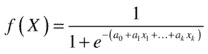
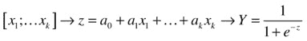
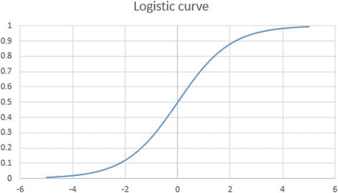
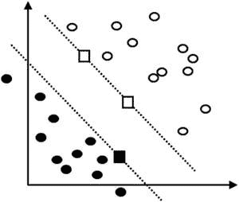
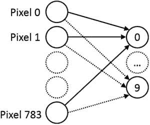
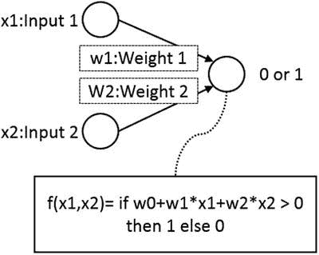
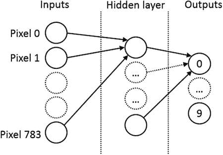
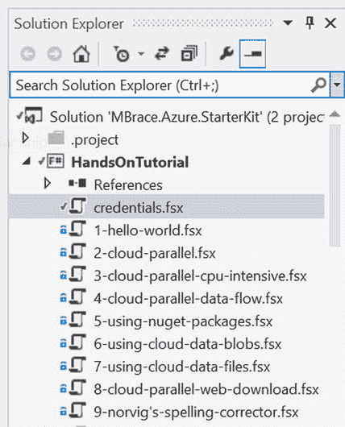
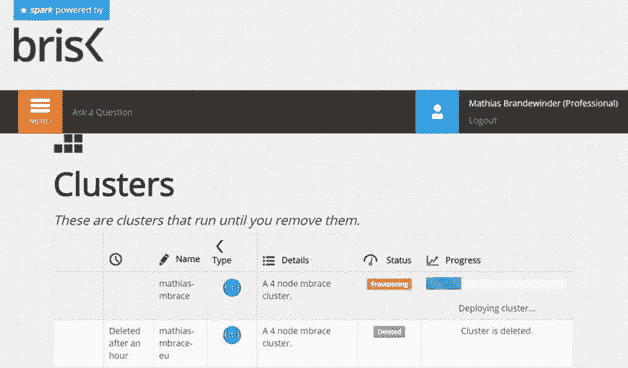

第八章


数字，重新访问

优化和扩展您的算法代码

在第 1 章中，我们一起探索了数字识别器问题，并从头开始编写了一个分类器。在这最后一章，我们将从两个不同的角度重新审视这个问题:性能和有用的工具。[第 1 章](1.html#7K4G0-841455c729754b8aac560d608a86cf91)到[第 7 章](7.html#DB7S0-841455c729754b8aac560d608a86cf91)主要关注实现算法来解决各种问题，并在这个过程中发现机器学习的概念。相比之下，本章更像是一系列实用技巧，在各种情况下都很有用。我们将使用我们在第 1 章中创建的数字识别器模型作为熟悉的参考点，并使用它来说明广泛适用于其他情况的技术。

在本章中，我们将执行以下操作:

*   分析我们在[第 1 章](1.html#7K4G0-841455c729754b8aac560d608a86cf91)中编写的代码，通过提高代码效率和利用并行处理的机会，寻找调整代码和提高性能的方法。
*   介绍 Accord.NET，这是一个. NET 库，提供了众多经典机器学习算法的现成实现。我们将举例说明如何使用其中的三种方法(逻辑回归、支持向量机和人工神经网络)，并讨论它们的一些基本思想。
*   介绍一下 m-brace.NET，这是一个来自 F#脚本环境的库，面向在云中的机器集群上以分布式方式运行计算。我们将展示如何使用该库来处理更大的数据集，同时仍然保持利用 FSI 提供的快速反馈来探索和设计模型的能力。

调整您的代码

性能考虑在机器学习中很重要，可能比日常的业务线应用程序开发更重要。就像任何其他代码一样，性能通常不是首要关注的问题；首要任务应该是设计一个正确的模型，并产生准确的结果。一旦完成，如果模型太慢，就该考虑调整它了。

用 Donald Knuth 的话来说，“程序员浪费了大量的时间来考虑或担心他们程序的非关键部分的速度，当考虑到调试和维护时，这些提高效率的尝试实际上会产生强烈的负面影响。我们应该忘记小的效率，比如说 97%的时候:过早的优化是万恶之源。然而，我们不应该错过这关键的 3%的机会。”

也就是说，在机器学习中，3%是相当重要的。它的主要原因可以追溯到我们最初对机器学习的描述:当输入更多数据时，程序会表现得更好。有经验证据表明，随着用于训练的数据语料库变得越来越大，简单和复杂的算法往往具有类似的预测能力(例如，参见彼得·诺维格的演讲“数据的不合理有效性”:[https://www.youtube.com/watch?v=yvDCzhbjYWs](https://www.youtube.com/watch?v=yvDCzhbjYWs))。在这种情况下，不管你使用什么特定的算法，如果可以的话，你可能想要从大量的数据中学习，这将机械地减慢事情的速度。在这种情况下，一个无效的实现可能非常重要，并对您的生产率产生直接影响，甚至可能使一个算法在实践中不可用。

要搜索什么

我们到底在找什么？提高现有代码的性能可能意味着几件事情。显而易见的一点是速度:我们想要得到相同的答案，但是要用更少的时间。内存占用是需要记住的另一个方面:当需要在内存中保存的数据增加时，在小数据集上运行良好的算法可能表现不佳。

如果我们检查我们在[第 1 章](1.html#7K4G0-841455c729754b8aac560d608a86cf91)中写的最近邻实现，这里大致是它做了什么:

```py
train a classifier =
       load 5,000 examples in memory
classify an image =
       for each of 5,000 examples in the classifier
              compute the distance between image and target, based on 784 pixels
       find the smallest distance
```

结构本身有助于思考我们应该期待什么样的行为，以及我们应该把精力集中在哪里:

*   随着我们使用更多的训练数据，我们的预测将线性放缓
*   有效计算距离对速度有直接影响
*   该算法需要大量内存(我们需要将所有训练样本预加载到内存中)

最重要的是，每当我们使用交叉验证时，我们需要迭代 500 个验证例子中的每一个。这不会影响分类器的性能，但会影响我们有效评估变化的能力。如果我们将训练集和验证集都扩展 10 倍，我们预计验证模型的速度大约会慢 100 倍，因为我们现在有两个嵌套循环要处理。

另一种说法是，如果我们希望通过提供更大的数据集来提高算法性能，我们应该预计速度会显著下降，并且可能会出现内存问题。我们在这里选择的算法有严重的含义:如果我们想要准确，我们将不得不为我们试图做出的任何预测付出速度上的代价。这是否是一个问题完全取决于业务环境。如果快速预测很重要，我们应该考虑选择不同的算法，初始训练很昂贵，但只是一次性成本，随后的预测非常快。

我们将在下一节看一些具有这些特征的分类器；目前，让我们假设我们可以接受潜在的缓慢预测，并从探索我们可以做些什么来改进我们的算法开始。

第一个也是最明显的方向是确保我们的代码相当高效。通常，作为第一步，您应该使用分析器来识别代码中的潜在热点。在这种情况下，我们将关注距离计算，这是大部分工作发生的地方，以避免任何昂贵或不必要的事情。通常，这包括确保您使用正确的数据类型和数据结构，并且可能使用命令式风格，改变变量而不是产生创建和分配新数据结构的成本。

第二个方向是诉诸并行。无论我们如何改进距离计算，我们仍然需要计算 5000 个距离。好消息是，我们不需要依次处理这些。两幅图像之间的距离完全独立于所有其他图像，因此在理论上，我们可以通过同时处理所有图像来获得高达 5000 倍的加速，而不必等待其他图像完成。以类似的方式，对于我们正在使用的距离函数，如果我们可以并行处理每一对像素，理论上我们可以将计算加速 784 倍。

当然，希望如此大规模的加速是不现实的。然而，一般的想法仍然是有效的:本质上，在你的代码中的任何地方，你看到一个地图，有并行的潜力。

调整距离

让我们从分析距离函数开始，看看我们如何能从它那里挤出一些性能。我们将从[清单 8-1](#list1) 开始，同样的脚本我们在[第一章](1.html#7K4G0-841455c729754b8aac560d608a86cf91)中结束，使用同样的数据集，并试验改进。

[***清单 8-1***](#_list1) 。原始最近邻模型

```py
open System
open System.IO

type Observation = { Label:string; Pixels: int[] }
type Distance = int[] * int[] -> int
type Classifier = int[] -> string

let toObservation (csvData:string) =
    let columns = csvData.Split(',')
    let label = columns.[0]
    let pixels = columns.[1..] |> Array.map int
    { Label = label; Pixels = pixels }

let reader path =
    let data = File.ReadAllLines path
    data.[1..]
    |> Array.map toObservation

let trainingPath = __SOURCE_DIRECTORY__ + @"..\..\..\Data\trainingsample.csv"
let training = reader trainingPath

let euclideanDistance (pixels1,pixels2) =
    Array.zip pixels1 pixels2
    |> Array.map (fun (x,y) -> pown (x-y) 2)
    |> Array.sum

let train (trainingset:Observation[]) (dist:Distance) =
    let classify (pixels:int[]) =
        trainingset
        |> Array.minBy (fun x -> dist (x.Pixels, pixels))
        |> fun x -> x.Label
    classify

let validationPath = __SOURCE_DIRECTORY__ + @"..\..\..\Data\validationsample.csv"
let validation = reader validationPath

let evaluate validationSet classifier =
    validationSet
    |> Array.averageBy (fun x -> if classifier x.Pixels = x.Label then 1\. else 0.)
    |> printfn "Correct: %.3f"

let euclideanModel = train training euclideanDistance
```

作为第一步，我们需要创建一个基准。让我们启动计时器，进行 5000 次距离计算。我们并不真正关心输出，也不想产生任何与距离计算本身不直接相关的成本，所以我们将选择两幅任意图像，并添加 ignore()语句以避免 FSI 窗口中出现混乱:

```py
#time "on"

let img1 = training.[0].Pixels
let img2 = training.[1].Pixels

for i in 1 .. 5000 do
    let dist = euclideanDistance (img1, img2)
    ignore ()
```

在我的工作站上(一个内存充足的四核 i7)，我得到的是:

```py
>
Real: 00:00:00.066, CPU: 00:00:00.062, GC gen0: 22, gen1: 0, gen2: 0
val it : unit = ()
```

首先，请注意，每次运行的测量结果会略有不同。我们在这里测量的时间相当短，很可能有一些噪音污染了我们的观察。为了减轻这种情况，我们至少应该运行几次测试，可能要进行 5000 次以上的计算。它也不完全准确；如果您使用编译到 dll 中的相同代码，而不是在脚本中，您可能会获得更好的结果，因为可能会发生额外的优化。然而，这是一个很好的起点。它提供的两条信息是时间(完成时间为 66 毫秒，CPU 时间为 62 毫秒)和垃圾收集(第 0 代发生了 22 次垃圾收集，更高级别没有垃圾收集)。垃圾收集作为我们正在创建多少对象的指示是有趣的；而更高代的 GC 一般都不好。

我们可以做的第一件事是检查使用 pown 是否会产生成本。让我们简化一下:

```py
let d1 (pixels1,pixels2) =
    Array.zip pixels1 pixels2
    |> Array.map (fun (x,y) -> (x-y) * (x-y))
    |> Array.sum

for i in 1 .. 5000 do
    let dist = d1 (img1, img2)
    ignore ()

Real: 00:00:00.044, CPU: 00:00:00.046, GC gen0: 22, gen1: 0, gen2: 0
val it : unit = ()
```

也许令人惊讶的是，这实际上是不可忽略的:我们从 CPU: 00:00:00.062 下降到 CPU: 00:00:00.046。当预测单个图像时，这可能符合微优化的条件，但这一变化将在 500 个验证图像上运行该算法所需的 33 秒中减少约 11 秒。

我们仍在观察一些 GC 的发生。罪魁祸首很可能是我们正在执行一个 zip 和一个 map，它们都创建了一个新数组。让我们将其简化为一个操作，map2，它实际上是在一次传递中完成这两个操作，使用一个数组而不是两个数组:

```py
let d2 (pixels1,pixels2) =
    (pixels1, pixels2)
    ||> Array.map2 (fun x y -> (x-y) * (x-y))
    |> Array.sum

for i in 1 .. 5000 do
    let dist = d2 (img1, img2)
    ignore ()

Real: 00:00:00.016, CPU: 00:00:00.015, GC gen0: 3, gen1: 0, gen2: 0
```

这是相当大的进步！我们仍然有一些垃圾收集在进行，但是它已经大大减少了，从之前的 GC gen0: 22 减少到 GC gen 0:3；我们还将计算时间从初始版本减少了大约 75%。让我们看看是否可以通过完全跳过中间数组，使用递归来完全摆脱 GC。我们将维护一个累加器 acc，并逐个索引地检查像素，将差异添加到累加器中，直到到达最后一个:

```py
let d3 (pixels1:int[],pixels2:int[]) =
    let dim = pixels1.Length
    let rec f acc i =
        if i = dim
        then acc
        else
            let x = pixels1.[i] - pixels2.[i]
            let acc' = acc + (x * x)
            f acc' (i + 1)
    f 0 0

for i in 1 .. 5000 do
    let dist = d3 (img1, img2)
    ignore ()

Real: 00:00:00.005, CPU: 00:00:00.000, GC gen0: 0, gen1: 0, gen2: 0
```

我们现在减少了 92%的计算时间，并且没有任何垃圾收集。我们为这种改进付出的代价是我们的代码明显变长了，并且可能更难阅读。最后一次尝试:让我们全力以赴，直接改变变量，而不是传递一个累加器:

```py
let d4 (pixels1:int[],pixels2:int[]) =
    let dim = pixels1.Length
    let mutable dist = 0
    for i in 0 .. (dim - 1) do
        let x = pixels1.[i] - pixels2.[i]
        dist <- dist + (x * x)
    dist

for i in 1 .. 5000 do
    let dist = d4 (img1, img2)
    ignore ()

Real: 00:00:00.004, CPU: 00:00:00.000, GC gen0: 0, gen1: 0, gen2: 0
```

实际上与之前的尝试没有什么不同。我们在这里谈论的是毫秒，所以我建议在得出结论之前进行更多的计算。如果您这样做，并且运行，比如说，1，000，000 次迭代而不是 5，000 次，您将不会看到明显的性能差异。在这一点上，两个版本之间的主要区别是风格，选择一个版本是代码可读性的问题，而不是性能的问题。

我对使用可变变量的总体立场是双重的。我倾向于默认避免它，除非它有明显的好处。突变引入复杂性；代码通常变得更难理解，更难并行化。另一方面，如果你的算法涉及大数组(机器学习中的常见情况)，那么使用映射并左右复制数组会招致严重的惩罚。在这种情况下，我会求助于突变，但几乎总是以对外界隐藏的方式进行。在我们的例子中，虽然 dist 是可变的，但是所有的改变都发生在函数的范围内，程序的任何其他部分都不能改变它。在这种情况下，突变是一个实现细节:对于任何调用我的函数的人来说，一切都是不可变的，因为没有共享状态可以篡改。

 **注意**还有另一个方向可以帮助加速算法。使用不同的数据结构，比如 KD-tree，而不是数组来存储示例，应该可以更快地搜索近邻。这里我们将忽略这种可能性，因为它的实现需要太多的代码。然而，请记住，为手头的任务使用正确的数据结构是另一种加快算法速度或提高内存效率的方法。

使用数组。平行的

现在让我们来看看第二个角度，平行度。在这里，我们将看一下评估函数，它对 500 多幅验证图像进行分类，并将其与真正的预期标签进行比较。最初的实现使用 Array.averageBy，它将两个步骤合二为一:首先，根据预测是否正确，将每个图像映射到 1.0 或 0.0，然后，对整个数组进行平均。地图功能不是立即可见的，但它是隐式存在的。

显然，每幅图像都可以相互独立地进行预测，因此我们应该能够并行执行该操作。我们希望对训练样本进行分而治之，例如，根据我们机器上可用的内核将其平均分割，分别运行每个数据块，并将结果重新分组到一个数组中。

事实证明，F#在数组中提供了一些开箱即用的有趣选项。并行模块，公开数组函数的子集，以并行方式实现。首先，让我们衡量一下我们的初始评估用了多长时间，以及距离调整后我们处于什么位置:

```py
let original = evaluate validation euclideanModel
>
Correct: 0.944
Real: 00:00:31.811, CPU: 00:00:31.812, GC gen0: 11248, gen1: 6, gen2: 1

let updatedModel = train training d4
let improved = evaluate validation updatedModel
>
Correct: 0.944
Real: 00:00:02.889, CPU: 00:00:02.890, GC gen0: 13, gen1: 1, gen2: 0
```

现在让我们重写 evaluate 函数，在 Array 中中断 Array.averageBy。Parallel.map 优先，Array.average:

```py
let parallelEvaluate validationSet classifier =
    validationSet
    |> Array.Parallel.map (fun x -> if classifier x.Pixels = x.Label then 1\. else 0.)
    |> Array.average
    |> printfn "Correct: %.3f"

>
Correct: 0.944
Real: 00:00:00.796, CPU: 00:00:03.062, GC gen0: 13, gen1: 1, gen2: 0
```

计算时间从 2.9 秒下降到 0.8 秒；还要注意 CPU 时间，从 2.9 秒到 3 秒:CPU 必须执行的工作量大致保持不变。我们将持续时间除以 3.6。假设我的机器有四个内核，我最多可以期待四倍的性能提升，所以这已经很不错了，尤其是考虑到它几乎不需要任何代码更改。

那么为什么不用数组呢。到处都是地图？如果回到我们对并行化的描述，会涉及到一些开销:现在我们需要划分数组，将它传递给不同的线程，并重新组合结果，而不是简单地对数组进行一次遍历。因此，您应该期待内核数量的次线性增长:例如，在 10 个内核之间分配工作所获得的加速将小于(可能远低于)10 倍。只有当每个块中完成的工作量足够大，足以抵消拆分和合并的开销时，这才会有回报。举个简单的例子，考虑这种情况，我们取一个 1000 个元素的数组，每个元素 10 个，每个元素加 1:

```py
let test = Array.init 1000 (fun _ -> 10)

for i in 1 .. 100000 do
    test |> Array.map (fun x -> x + 1) |> ignore
>
Real: 00:00:00.098, CPU: 00:00:00.093, GC gen0: 64, gen1: 0, gen2: 0
for i in 1 .. 100000 do
    test |> Array.Parallel.map (fun x -> x + 1) |> ignore
>
Real: 00:00:00.701, CPU: 00:00:01.234, GC gen0: 88, gen1: 1, gen2: 1
```

在这种情况下，仅仅为了加 1 而将数组分割成块是不值得的，并行版本最终会比原始版本慢。一般来说，对于不可忽略 CPU 密集型任务，这种策略是值得的。在这种情况下，我们可以在分类函数中以两种方式使用并行性:我们可以在距离上使用它，并行计算像素差异，或者我们可以在示例上使用它，并行计算分类。第二个方向可能更有用，因为一个分类确实需要大量的工作，而计算两个像素之间的差异可以忽略不计。

在这些流中

数组。并行以并行方式实现阵列模块功能的子集。如果你发现自己需要更多，看看 Streams 库([http://nessos.github.io/Streams/](http://nessos.github.io/Streams/))。它在 ParStream 模块中包含额外的函数(用于并行流)，并提供了其他有趣的可能性。简而言之，该库区分了管道中的懒惰操作和急切操作，并将懒惰操作融合在一起，这可以产生性能优势。

与 Accord.NET 不同的量词

在上一节中，我们讨论了几种提高现有算法性能的方法。然而，每种算法都有定义程序行为的基本特征。在这一节，我们将采取完全不同的方向，看看 Accord.NET，一个受欢迎的(和良好的！)包含大量机器学习和数值分析工具的库。

我们的目标是双重的。首先，编写自己的实现通常并不困难，而且有一些好处。特别是，您完全控制着代码，这提供了与使用它的应用程序进行更紧密集成的机会，也许还提供了一些全局优化的空间。然而，开发一个机器学习算法需要大量的实验和反复试验，有时，你只需要快速检查某一类模型是否比另一类模型更好。在这种情况下，从头实现算法可能太费力了，而使用现成的实现可以加快消除过程。在这种情况下，知道如何利用像 Accord 这样丰富的库是非常有用的。

然后，我们在前几章中讨论了各种技术，但是也忽略了许多其他经典的和潜在有用的技术。实际上，我们不可能详细介绍每一种算法，但是我们将利用这一部分来提供对其中一些算法的高级介绍，并演示如何使用该库。

逻辑回归

在第 4 章的[中，我们实现了一个经典回归模型，试图从多个输入特征中预测一个数值。这种方法与最近邻模型的不同之处在于，在这个过程中有一个明显不同的训练阶段](4.html#AFM60-841455c729754b8aac560d608a86cf91)。训练集用于估计分类器函数的参数，它比原始数据集更紧凑。如果我想给某人发送我的最近邻分类器函数，我必须发送整个训练集。相比之下，回归模型只是 Y = a0 + a1 * X1 +形式的函数...ak * Xk，我唯一需要传输的是 a0，a1，...ak。同样，预测的速度会快得多:我们不需要计算 5000 个距离，只需要一个非常简单的计算。为此我们必须付出的代价是为 a0，a1，...ak，这是一个昂贵的训练操作。

逻辑回归本质上是相同的模型，适合于分类。它不是产生一个可以取任何实数值的数字，而是输出一个介于 0 和 1 之间的值，该值表示一个观察值属于两个可能类别之一的概率。

对于具有特征值 X =[X1；...Xk]，Y 的预测值由所谓的逻辑函数生成:



与回归模型有一个可见的关系:从 X 开始，我们首先计算一个线性组合的结果，它给我们一个值 z，并使用逻辑函数 f 对 z 应用一个额外的变换:



最后一个转换的原因是为了解决下面的问题:如果我们的目标是产生一个数字来描述一个观察值属于或不属于某一类的概率，那么输出最好在[0..1]区间。线性回归则不是这样，它可以取–到+无穷大之间的任何值。但是，如果你画 1.0 / (1.0 + exp (-z))，你会看到[图 8-1](#Fig1) 中的形状；该函数将任何值转换为区间[0...1]，z = 0 时值为 0.5。当线性模型预测 z = 0 时，逻辑会说两种可能的结果之间有 50/50 的可能性。远离 0 的值表示观察值属于某一类的置信度较高。



[图 8-1](#_Fig1) 。逻辑曲线

换句话说，逻辑功能充当**激活功能**。它接收一个可以是任何值的输入值，并将其转换为二进制信号:如果输入值大于 0，则我们处于状态 1，否则为 0。

符合的简单逻辑回归

从技术上来说，估计逻辑函数的参数可以用与我们在第 4 章中所做的非常相似的方式来完成，使用梯度下降和稍微修改的成本函数。实现它实际上是一个有趣的练习(并不过分复杂)，但我们将使用 Accord。请改用. NET 的版本。

作为起点，我们将暂时搁置一个明显的问题，即我们有十个类要识别，而逻辑模型只能区分两种情况。我们将首先完成一个演示示例，创建一个仅区分两种情况的分类器，比如 4s 和 9s。

让我们向我们的解决方案 logistic.fsx 添加一个新的脚本文件，并添加我们将在本示例和后续示例中使用的两个 NuGet 包， Accord。机器学习和 Accord.Neuro

首先，我们需要一些数据。我们将沿着与第 1 章相同的路线进行，有两个小的不同。首先，我们将把值解析为浮点数而不是整数，因为这是 Accord 所期望的；然后，我们将简单地使用元组来存储示例，标签是第一个元素，特征是第二个元素。

***清单 8-2*** 。读取逻辑回归的数据集

```py
#I @"../packages"
#r @"Accord.2.15.0\lib\net45\Accord.dll"
#r @"Accord.MachineLearning.2.15.0\lib\net45\Accord.MachineLearning.dll"
#r @"Accord.Math.2.15.0\lib\net45\Accord.Math.dll"
#r @"Accord.Statistics.2.15.0\lib\net45\Accord.Statistics.dll"

open Accord.Statistics.Models.Regression
open Accord.Statistics.Models.Regression.Fitting

let readLogistic fileName =
    let path = __SOURCE_DIRECTORY__ + @"/" + fileName
    path
    |> System.IO.File.ReadAllLines
    |> fun lines -> lines.[1..]
    |> Array.map (fun line ->
        let parsed = line.Split ',' |> Array.map float
        parsed.[0], parsed.[1..])

let training = readLogistic "trainingsample.csv"
let validation = readLogistic "validationsample.csv"
```

 **注意**雅阁库定期更新，因此，版本号会随着时间而变化。根据最新版本，相应地更新脚本中的引用！

现在我们在内存中有了一个数据集，我们需要两件东西。因为我们将学习如何识别 4 和 9，所以我们将过滤数据集，只保留相关的示例。因为逻辑回归期望输出编码为 0.0 或 1.0，我们将创建一个小的效用函数来适当地转换标签。最后，我们将使用它来创建新的学习样本(见清单 8-3 )。

[***清单 8-3***](#_list3) 。为逻辑回归准备 4s 与 9s 数据集

```py
let labeler x =
    match x with
    | 4\. -> 0.
    | 9\. -> 1.
    | _ -> failwith "unexpected label"

let fours = training |> Array.filter (fun (label,_) -> label = 4.)
let nines = training |> Array.filter (fun (label,_) -> label = 9.)

let labels,images =
    Array.append fours nines
    |> Array.map (fun (label,image) -> labeler label,image)
    |> Array.unzip
```

我们现在可以开始使用 Accord 逻辑回归模型。Accord 主要使用的是面向对象的风格，因此，它遵循的模式如下:

1.  首先创建一个模型，一个定义如何进行预测的类。
2.  你把它传递给一个学习者，一个定义如何使用训练数据来适应模型的类。
3.  然后，您向学习者提供数据，并“学习”直到拟合度足够好，
4.  现在，您可以使用原始模型实例进行预测。

在我们的例子中，我们将使用 LogisticRegression 模型，使用 28 * 28 个特征，对应于我们扫描图像的每个像素，并使用 LogisticGradientDescent 进行学习，直到我们模型中的变化变得可以忽略不计。这非常适合递归循环(见[清单 8-4](#list4) )。

[***清单 8-4***](#_list4) 。训练逻辑模型

```py
let features = 28 * 28
let model = LogisticRegression(features)

let trainLogistic (model) =
    let learner = LogisticGradientDescent(model)
    let minDelta = 0.001
    let rec improve () =
        let delta = learner.Run(images,labels)
        printfn "%.4f" delta
        if delta > minDelta
        then improve ()
        else ignore ()
    improve ()

trainLogistic model |> ignore
```

如果您运行下面的代码，您应该看到在 FSI 中打印出的一系列数字，表明在学习过程的每一步中模型参数改变了多少；当变化落在 minDelta 之下时，它停止，minDelta 定义了您希望结果有多接近最优值。此时，模型就可以使用了；例如，我们可以针对验证集运行它，过滤掉不是 4 或 9 的任何东西，并检查哪些预测是正确的(参见[清单 8-5](#list5) )。

[***清单 8-5***](#_list5) 。验证逻辑模型

```py
let accuracy () =
    validation
    |> Array.filter (fun (label,_) -> label = 4\. || label = 9.)
    |> Array.map (fun (label,image) -> labeler label,image)
    |> Array.map (fun (label,image) ->
        let predicted = if model.Compute(image) > 0.5 then 1\. else 0.
        let real = label
        if predicted = real then 1\. else 0.)
    |> Array.average

accuracy ()
```

在我的机器上，这产生了 95.4%的正确答案。这里要注意一点:模型。Compute 不一定会返回 1.0 或 0.0，它会返回一个介于 0.0 和 1.0 之间的数字，表示输出属于类 1 的概率。这就是我们检查该值是高于还是低于 50%以确定分类器决策的原因。虽然这似乎会带来一些额外的工作，但这实际上是非常有价值的:分类器并不简单地返回一个标签，它还提供了一个对其预测的置信度的估计。

一对一，一对一分类

如何用一个二元分类器来区分十类？有两种经典的方法来解决这个问题。在第一个例子“一个对所有”中，您为每个标签创建一个二元分类器，试图识别每个标签。在这种情况下，我们将创建 10 个模型:“这是 0，还是别的什么，”“这是 1，还是别的什么，”...然后运行这十个模型，选出置信度最高的答案。在第二种方法“一对一”中，您为每个可能的标签对创建一个二元分类器(“这是 0 还是 1”、“这是 0 还是 2？”...)，运行每个模型，并使用循环投票进行预测，选择获得最多选择的标签。

让我们实现一个一对一的模型，主要是为了说明这个过程。在我们的情况下，我们需要 10 个不同的模型，“0 或不是”，“1 或不是”，等等...如果我们以这样的方式排列数据，在每种情况下，我们试图识别的数字被标记为 1.0，其余的数字被标记为 0.0，那么每个训练好的模型将返回一个数字，指示它认为该图像是该特定标签的强烈程度。在这种情况下，为了对图像进行分类，我们需要做的就是运行 10 个模型，并选择输出最大的一个。

这并不太复杂:在[清单 8-6](#list6) 中，我们为每一个类创建了一个新的训练样本，其中如果样本与我们训练的类匹配，则标记为 1.0，否则标记为 0.0。对于每个标签，我们训练一个逻辑，就像我们在上一节中所做的一样(有一个小的修改:我们将学习过程限制在最多 1000 次迭代)，并创建一个包含所有标签及其模型的列表。总体分类器函数返回对应于最“有信心”的模型的标签。

[***清单 8-6***](#_list6) 。一对一逻辑分类器

```py
let one_vs_all () =

    let features = 28 * 28
    let labels = [ 0.0 .. 9.0 ]
    let models =
        labels
        |> List.map (fun target ->
            printfn "Learning label %.0f" target
            // create training set for target label
            let trainingLabels,trainingFeatures =
                training
                |> Array.map (fun (label,features) ->
                    if label = target
                    then (1.,features)
                    else (0.,features))
                |> Array.unzip
            // train the model
            let model = LogisticRegression(features)
            let learner = LogisticGradientDescent(model)
            let minDelta = 0.001
            let max_iters = 1000
            let rec improve iter =
                if iter = max_iters
                then ignore ()
                else
                    let delta = learner.Run(trainingFeatures,trainingLabels)
                    if delta < minDelta then ignore ()
                    else improve (iter + 1)
            improve 0
            // return the label and corresponding model
            target,model)

    let classifier (image:float[]) =
        models
        |> List.maxBy (fun (label,model) -> model.Compute image)
        |> fun (label,confidence) -> label

    classifier
```

结果出来的模型不是特别好；在我的机器上，我得到了接近 83%的准确率。我们不会在这里实现另一种方法，因为代码没有足够的不同来保证它。一方面，这两种方法很有趣，因为它们提供了一种简单的技术来扩展二元分类器(这是您可以创建的最简单的分类器)来处理任意数量的标签。另一方面，请记住，这两种方法都只是启发性的:这种方法是合理的，但不能保证工作良好。一对一的好处是需要更少的模型(在我们的例子中是 10 个，而一对一的例子是 90 个)，但是两者都有潜在的问题。在“一个对所有”的情况下，我们将许多不同的情况归为负面情况，这使得训练变得困难(例如，你可能会认为从 0 或 6 中识别 5 是基于不同的特征)。例如，训练一个模型从 6 中识别 1 比从 9 个不同的数字中识别 1 要容易得多。相反，在一对一的情况下，虽然训练单个模型可能更容易，但最终的决定涉及到让训练来区分两个特定数字的模型识别两者都不是的东西，这可以说是棘手的(如果你将 0 传递给训练来从 2 识别 1 的模型，你会期望什么答案？).

支持向量机

我们要看的下一个模型，支持向量机(SVM 之后)，是另一个经典的二进制分类器。它有一个令人生畏的名字，这个算法在概念上比前一个更复杂一些。我们将手挥它如何工作的细节，并把我们的解释限制到最低限度。

本质上，SVM 试图用一个尽可能宽的带将两个类分开，这样一个类的所有例子都在一边，所有其他的在另一边。支持向量是位于或“支持”边界每一侧的例子。[图 8-2](#Fig2) 用一个简单的例子说明了这个想法:两条虚线代表分离带的边界。属于同一类(黑色或白色)的每个观察值都在同一侧，三个观察值(表示为正方形)是定义边界位置的支持向量。



[图 8-2](#_Fig2) 。支持向量

就像逻辑回归一样，SVM是二元分类器。逻辑回归的一个不同之处是，标签被编码为–1 和 1，而不是 0 和 1，输出只是一个类，而不是“置信水平”。让我们看看如何使用雅阁 SVM 来分类我们的数字。方便的是，Accord 有一个内置的 SVM 的多类版本，这意味着我们可以直接将它用于 10 个类，而不必构建额外的层:它将为我们处理一对一的过程。

为了清楚起见，我们将把我们的 SVM 示例放在一个单独的脚本 svm.fsx 中，包括我们在逻辑示例中使用的相同引用。首先，像往常一样，我们将读取数据集，但在这种情况下，我们不会将标签转换为浮点数(参见[清单 8-7](#list7) )。

[***清单 8-7***](#_list7) 。读取 SVM 的数据

```py
let svmRead fileName =
    let path = __SOURCE_DIRECTORY__ + @"/" + fileName
    path
    |> System.IO.File.ReadAllLines
    |> fun lines -> lines.[1..]
    |> Array.map (fun line ->
        let parsed = line.Split ','
        parsed.[0] |> int, parsed.[1..] |> Array.map float)

let labels,images = svmRead "trainingsample.csv" |> Array.unzip
```

训练部分比后勤部分需要稍微复杂一点的设置。大多数复杂性发生在算法函数中。如果您仔细检查代码，您会看到它接受一个 SVM、一个数据集(输入和输出)和两个值， *i* 和 *j* ，并返回一个学习策略。这是一次处理多个类必须付出的代价:算法块将在训练期间使用，为每个一对一分类器创建适当的数据集和学习策略，这些分类器是在后台生成的；不过，它的一个好处是，可以为不同的标签对配置和使用不同的策略。其余的代码遵循类似于我们之前看到的逻辑:我们创建一个模型，一个学习者，并开始训练，这甚至比逻辑情况下更简单，因为它自己终止，并直接返回在训练样本中观察到的错误率(参见[清单 8-8](#list8) )。

[***清单 8-8***](#_list8) 。训练多类 SVM 模型

```py
open Accord.MachineLearning.VectorMachines
open Accord.MachineLearning.VectorMachines.Learning
open Accord.Statistics.Kernels

let features = 28 * 28
let classes = 10

let algorithm =
    fun (svm: KernelSupportVectorMachine)
        (classInputs: float[][])
        (classOutputs: int[]) (i: int) (j: int) ->
        let strategy = SequentialMinimalOptimization(svm, classInputs, classOutputs)
        strategy :> ISupportVectorMachineLearning

let kernel = Linear()
let svm = new MulticlassSupportVectorMachine(features, kernel, classes)
let learner = MulticlassSupportVectorLearning(svm, images, labels)
let config = SupportVectorMachineLearningConfigurationFunction(algorithm)
learner.Algorithm <- config

let error = learner.Run()

let validation = svmRead "validationsample.csv"

validation
|> Array.averageBy (fun (l,i) -> if svm.Compute i = l then 1\. else 0.)
```

那个特定的模型正确地分类了 92%的验证集合，这还不算太糟糕。如果你想提高成绩，你能做什么？您可以使用的第一个杠杆是在策略中定义的复杂性参数。它的值被自动设置为通常接近 1 的水平，并且应该工作得相当好。增加它将强制更好地适应训练样本，这有两个风险:它可能会过度适应，或者它可能只是太高，在这种情况下，算法无法找到解决方案，并将引发异常。

你可以使用的第二个杠杆是所谓的内核技巧。您可能已经注意到，在 SVM 设置中，我们传入了一个线性内核。这意味着，我们正在寻找一个干净的，直接的阶层之间的分离。如果可以在数据集中找到这样的分离，就没有问题。然而，很有可能每个类的例子都被很好地分开了，这种分开可能不是一条直线(或超平面)。在非常高的层次上，核心技巧包括将函数应用于观察值，将初始特征转换成更高维空间中的一组新特征，其中实例实际上可以被超平面分离。如果情况确实如此，那么我们可以训练一个“标准”线性 SVM 来找到这种分离，并对新的观察结果进行分类，首先通过应用相同的核函数来转换它们。

如果这还不完全清楚，不要害怕！主要的实际含义是，如果默认的线性内核不起作用，您可以尝试其他内核，看看这是否会更好。Accord 内置了相当多的内核，您可以通过探索名称空间 Accord.Statistics.Kernels 找到这些内核。

神经网络

我们要看的 Accord 的最后一个分类器是人工神经网络(ANN after)。这个名字的灵感来源于对大脑工作方式的粗略类比。大脑是一大堆相互连接的神经元。当我们接收到来自外界的信号时，受体发出电脉冲，激活我们大脑中的神经元。接收到足够强信号的神经元会反过来向连接的神经元发送信号，最终，我们的大脑(可能)会理解信号并识别出一些东西。

人工神经网络的构造遵循类似的一般结构。它们可以有不同的形状，但规范的人工神经网络是神经元的集合，按层组织，每个神经元都连接到下一层的每个神经元。神经元本身是一种激活功能；它接收连接到它的每个神经元的输出作为输入，每个神经元都有单独的权重，如果它接收的输入的加权和足够高，它将依次向前发送信号。

神经网络是一个巨大的主题，我们不可能在这里的一个章节里对其进行公正的评价。以类似于我们为SVM所做的方式，我们将简单地说明如何使用 Accord 中的内置工具构建一个分类器，并强调这个过程中的几个有趣的点。

在我们的特定情况下，我们有 784 个像素，我们的输入信号，我们期望的是 10 个数字 0，1，..9.就神经元而言，我们可以将其表示为一层 784 个输入神经元(每个神经元可以发送 0 到 255 之间的信号)，最后一层 10 个神经元，每个神经元对应一个数字。我们可能建立的最简单的网络是在每个输入神经元和每个输出神经元之间建立一个直接连接，如图 8-3 所示。



[图 8-3](#_Fig3) 。浅层人工神经网络

我们想要的是一个模型，它获取图像，将其输入(每个像素值)发送到网络，并将其转换为每个可能输出的 0 或 1 值。无论我们有数百个输入还是只有两个输入，都不会改变问题的本质，所以让我们看看一个更简单的网络，只有两个输入和一个输出，并探索我们如何使其工作。一种可能性是建立一个模型，如果输入信号的加权和高于某个阈值，我们就激活一个节点，如图 8-4 中的[所示。](#Fig4)



[图 8-4](#_Fig4) 。感知器

事实证明，这个模型有一个名字，感知器**。它由三个元素定义:分配给每个输入信号的权重 w1 和 w2(每个输入有多重要)、阈值 w0(所谓的偏置项)和线性激活函数 f，该函数组合输入，如果输入信号高于阈值，则将其转换为 1 (a 信号)。训练这样的分类器非常简单；我们只需要找到权重和偏差的值来最小化误差——例如，使用类似于我们在第 4 章的[中讨论的方法。](4.html#AFM60-841455c729754b8aac560d608a86cf91)**

 **还要注意的是，如果我们改变激活函数，在节点中使用逻辑函数而不是线性组合，我们将复制整个一对一逻辑模型。这里的要点是，虽然孤立的感知器看起来可能有点简单，但它形成了一个积木，可以很容易地组成有趣而复杂的模型。

那么，问题是什么，人工神经网络有什么不同？人工神经网络的一个关键见解是，如果简单的线性模型不适合您的数据，而不是使用更复杂的组件(创建新的功能，使用非线性函数...)，你可以继续使用简单的类似感知器的节点，但是通过在输入和输出层之间堆叠一个或多个隐藏层，将它们组成更深的模型，如图 8-5 中的[。如果你对这个问题感兴趣，有很多资源讨论用感知器模拟逻辑门(例如参见](#Fig5)[http://www.cs.bham.ac.uk/~jxb/NN/l3.pdf](http://www.cs.bham.ac.uk/~jxb/NN/l3.pdf))；事实证明，虽然你可以模拟“与”或“或”而没有问题，但除非你添加一个隐藏层，否则无法模拟“异或门”。



[图 8-5](#_Fig5) 。单隐层人工神经网络

在我们的例子中，如果我们想要一个模型，我们的行为不同于我们早期的一对所有的逻辑方法，我们将需要插入至少一个隐藏层。每个输入节点都连接到隐藏层中的每个节点(但不连接到下一个节点)，隐藏层中的每个节点都连接到每个输出节点，如图[图 8-5](#Fig5) 。

用 Accord 创建和训练神经网络

随着大量的手挥舞，你有希望合理地相信，添加隐藏层是一种有前途的方式，将简单的感知器组合成强大的分类器。然而，这也带来了一些新的问题。首先，当输入层和输出层的大小设置清楚时(每个特征一个神经元，每个类一个神经元)，隐藏层应该包含多少个神经元？就此而言，为什么是一个隐藏层，而不是两个、三个或更多？

第二个相关的问题是，如何训练这样一个模型？这里我们有大量的参数需要估计。例如，如果你考虑将我们的 784 个输入连接到一层 10 个神经元，我们必须调整近 8000 个权重。这已经很多了。我们不能单独训练每个神经元，因为它们是相互联系的；如果我改变一个神经元的输入权重，它的输出将会改变，并可能需要调整同一层中的其他神经元。最后，还有一个微妙的问题:我们应该如何初始化权重？因为每个神经元都是相同的，所以如果你从每个连接的权重为零开始，你将面临为每个神经元学习相同参数的风险。每个神经元将产生相同的输出，而不是从输入集中捕捉不同的特征，并且您将拥有一个复制多次的单一模型。

详细解释如何训练人工神经网络本身就是一个话题；我们将局限于一个非常广泛的纲要。实现这一目的的主要方法称为反向传播。以类似梯度下降的方式，输入网络示例，将期望值与模型输出进行比较，然后在网络中逐层后退，调整每个神经元以减少误差。为了避免相同节点的问题，使用某种形式的随机过程来初始化权重。

实际上，这意味着训练一个神经网络是一件耗时的事情。虽然扩大网络深度和每层的节点数量在理论上可以产生更好的模型，但它也直接影响到训练它可能需要多少时间，更不用说过度拟合的风险了。

记住这一点，让我们在一个单独的脚本中说明如何使用 Accord 创建和训练这样一个网络(见清单 8-9 )。像往常一样，我们将从加载所需的库开始，并编写一个 read 函数来准备数据集。

[***清单 8-9***](#_list9) 。准备用 Accord 训练神经网络

```py
#I @"../packages"
#r @"Accord.Math.2.15.0\lib\net45\Accord.Math.dll"
#r @"Accord.Neuro.2.15.0\lib\net45\Accord.Neuro.dll"
#r @"Accord.Statistics.2.15.0\lib\net45\Accord.Statistics.dll"
#r @"AForge.2.2.5\lib\AForge.dll"
#r @"AForge.Neuro.2.2.5\lib\AForge.Neuro.dll"

open Accord.Statistics
open Accord.Neuro
open Accord.Neuro.Learning
open AForge.Neuro

let nnRead fileName =
    let path = __SOURCE_DIRECTORY__ + @"/" + fileName
    path
    |> System.IO.File.ReadAllLines
    |> fun lines -> lines.[1..]
    |> Array.map (fun line ->
        let parsed = line.Split ','
        parsed.[0] |> int, parsed.[1..] |> Array.map float)
```

 **注意**在我们的脚本中，我们引用的是 AForge，Accord 使用的一组库。在撰写本文时，Accord 正在将这两个库合并成一个库，这可能会造成一些冗余。

然后我们可以建立我们的神经网络，开始训练阶段，并验证结果(见[清单 8-10](#list10) )。这种方法或多或少遵循了我们以前见过的相同模式，但有一些差异值得指出。

[***清单 8-10***](#_list10) 。创建、培训和评估网络

```py
let trainNetwork (epochs:int) =

    let features = 28 * 28
    let labels,images = nnRead "trainingsample.csv" |> Array.unzip
    let learningLabels = Tools.Expand(labels,-1.0,1.0)

    let network = ActivationNetwork(BipolarSigmoidFunction(), features, [| 100; 10 |])
    NguyenWidrow(network).Randomize()

    let teacher = new ParallelResilientBackpropagationLearning(network)

    let rec learn iter =
        let error = teacher.RunEpoch(images, learningLabels)
        printfn "%.3f / %i" error iter
        if error < 0.01 then ignore ()
        elif iter > epochs then ignore ()
        else learn (iter + 1)

    learn 0

    network

let ann = trainNetwork (50)

let validate = nnRead "validationsample.csv"
validate
|> Array.averageBy (fun (label,image) ->
    let predicted =
        ann.Compute image
        |> Array.mapi (fun i x -> i,x)
        |> Array.maxBy snd 
        |> fst
    if label = predicted then 1.0 else 0.0)
```

首先，我们需要转换输出，使每个数字成为单独的特征。为了实现这一点，我们使用 Accord。Statistics.Tools.Expand 是一个内置的实用程序，它将一组标签扩展成一个新的表示形式，其中每个标签都成为一个单独的列，在本例中二进制输出编码为–1 或 1。我们使用这种特殊的编码是因为选择了激活函数 BipolarSigmoidFunction:它的值从–1 到 1，其中 1 表示正的情况(“这是 1”)，而–1 表示负的情况(“这不是 1”)。或者，一座桥。Neuro 包含几个其他内置的激活功能。

我们创建一个网络，传入激活函数、预期的输入数(在我们的例子中是 28 × 28 像素)和数组中每层的节点数，最后一个元素是预期的标签数，这里是 10。还要注意 NguyenWidrow 的使用，它为网络权重创建了随机但合理的初始值。

在我的机器上，下面的代码产生了将近 82%的正确分类(由于初始权重的随机化，结果可能会有所不同)。这并不完全可怕，但也不伟大。如果你运行它，你可能会注意到，它也非常慢。也就是说，我们在这里将训练限制为 50 次迭代，并且当我们到达第 50 次迭代时，误差(在每次通过后打印出来)仍然在有规律地减少。当我将搜索扩展到 500 个纪元时，我看到从 1775 年到 1200 年的另一次下降，正确率为 82.6%。换句话说，学习过程慢了很多，但仍然有进步。

我们将把它留在神经网络的主题上，以及一般的 Accord 上。这个库包含了比我们在这里描述的算法更多的东西，以及一些有趣的例子来说明它的一些功能。

与 m-brace.net 一起扩展

尽你所能调整你的代码，在某些时候，瓶颈将是你的机器。这一问题的原因回到了我们最初对机器学习的定义。如果向一个好的机器学习算法输入更多的数据，它应该能够更好地执行任务。

这里的一个含义是，如果数据越多越好，那么你就会想要更多，这部分解释了最近围绕“大数据”的热潮。而且，随着数据集的增长，使用简单 F#脚本的数据探索和模型训练将变得更慢，甚至不可能，例如，如果数据集太大而无法在本地打开或保存。在这一节中，我们将简要介绍 m-brace.net，这是一个旨在解决该问题的库，它通过从脚本环境发送代码来在云中的集群中执行。

使用 Brisk 在 Azure 上开始使用 MBrace

如果我们的限制因素是计算机本身，一个方向是投入更多的计算机来解决问题。就像“九个女人不可能在一个月内造出一个婴儿”(用弗雷德·布鲁克斯的话说)，许多计算机不会总是加快速度，这取决于问题。也就是说，一般来说，任何时候我们在代码中识别一个映射，我们都应该有机会应用分而治之的方法:将我们正在映射的集合分成块，在单独的计算机上独立运行每个块的映射，并将所有块缩减为一个最终结果。

这与我们之前在 Array.Parallel.map 中看到的模式相同。我们接下来要讨论的框架 m brace([www.m-brace.net](http://www.m-brace.net))进一步扩展了这一想法:它不是简单地在本地机器上的内核之间处理数据块，而是允许你在微软 Azure 云中的一个机器集群上做同样的事情。

这里的美妙之处在于，所有这些都是可能的，同时仍然可以在脚本环境中工作。本质上，MBrace 的目标是让您在 Visual Studio 中使用 F#脚本，以便您可以保持快速的设计反馈循环，同时无缝地将要远程执行的代码发送到您的集群。您可以按需创建一个集群，只要您需要大量计算能力或数据，就可以创建，而不受本地设备的限制，并在完成后关闭它。

开始使用 MBrace 最简单的方法是遵循三个步骤:

1.  首先，如果你还没有 Azure，那就申请一个。你可以在 http://azure.microsoft.com 获得免费试用版。
2.  然后，在[www.BriskEngine.com](http://www.BriskEngine.com)注册一个免费账户。Brisk 是一项服务，它允许你轻松地在 Azure 上提供一个集群，完全配置了运行 MBrace 所需的一切，并在完成后立即删除它。轻快本身是自由的；您只需为 Azure 云的使用付费。
3.  最后，从 GitHub 上的 MBrace 库下载 MBrace 初学者工具包:[https://github.com/mbraceproject/MBrace.StarterKit](https://github.com/mbraceproject/MBrace.StarterKit)。该项目包含一个预配置的解决方案，其中有许多说明如何使用 MBrace 的示例；您可以简单地下载它，并向其中添加您的脚本，以便轻松开始。

此时，你应该在本地机器上有一个 F#项目，看起来像图 8-6 。

让我们先在 Azure 上部署一个机器集群。要做到这一点，只需到 BriskEngine.com，登录，并前往仪表板菜单，在那里你可以检查你最近创建的集群，并创建新的。让我们创建一个新的集群，为 MBrace 选择{m},并选择应该在地理上部署它的位置。您可能想要一个靠近您所在位置的位置，以便尽可能快地在您的机器和集群之间来回移动数据；如果您要访问预先存在的数据，它的位置也很重要。最后，让我们挑选一个集群大小；您可以从每小时不到 0.50 美元的小型四核集群(两台中型机器)一直到每小时约 20 美元的 256 核集群。



[图 8-6](#_Fig6) 。m-brace 启动项目

让我们来看看 16 个内核，这为我们提供了坚实的马力，每小时约 1.50 美元。BriskEngine 仪表盘将显示部署进度，5 到 10 分钟后，您应该可以准备好自己的集群(参见[图 8-7](#Fig7) )。



[图 8-7](#_Fig7) 。通过 BriskEngine 在 Azure 上部署集群

我们现在已经准备好开始在集群上运行代码了；我们只需要从 Visual Studio 中的脚本会话连接到它。为此，我们将在 credentials.fsx 文件中为 MBrace 提供两个连接字符串。BriskEngine 使这变得简单:在您的仪表板中，一旦集群处于活动状态，您就可以单击集群名称，并将两个连接字符串复制到凭证文件中。

最后，让我们添加一个新的脚本 digits.fsx 到初学者工具包解决方案，用[清单 8-11](#list11) 。

[***清单 8-11***](#_list11) 。连接到集群

```py
#load "credentials.fsx"
open MBrace.Core
open MBrace.Azure.Client

let cluster = Runtime.GetHandle(config)
```

把代码发给 FSI，然后...就这样，您现在连接到了集群。您可以通过运行以下代码行来检查这一点，该代码行将显示您在集群中运行的工作线程的信息:

```py
cluster.ShowWorkers ()

>

 >

 Workers

 Id                     Status   % CPU / Cores  % Memory /
 --                     ------   -------------  --------------------
 MBraceWorkerRole_IN_2  Running     2.3 / 4        13.5 / 7167.0
 MBraceWorkerRole_IN_1  Running     1.4 / 4        14.1 / 7167.0
 MBraceWorkerRole_IN_0  Running     1.8 / 4        13.6 / 7167.0
 MBraceWorkerRole_IN_3  Running     1.5 / 4        13.6 / 7167.0
val it : unit = ()
```

那么，如何将工作分配给集群呢？通过使用云计算表达式 cloud {...}.这个名字听起来可能很吓人:不要让自己被吓倒。云计算是 F#中一个非常强大的机制，通常被设计为提供一种更简单的方式来编写和管理复杂的代码工作流。他们使用一个构建器，这个构建器定义了一个用{ }标记的“上下文”,在这个上下文中，F#被扩展，使用关键字比如 let！或者返回，隐藏一些不太有趣的操作副作用，强调整个工作流的结构。因此，虽然理解如何编写一个新的计算表达式可能有点令人费解，但使用现有的表达式通常并不复杂，因为这样做的目的是让您编写更简单的代码来实现您的目标。

在 MBrace 的情况下，在集群中执行代码包括两个阶段:在云内部定义希望在云中运行的代码...}计算表达式，然后发送执行。例如，尝试将以下代码逐行发送到 FSI:

```py
#time "on"
cluster.AttachClientLogger(MBrace.Azure.ConsoleLogger())

let localHello = "Hello"
let cloudHello = cloud { return "Hello" }
cloudHello |> cluster.Run
```

虽然 localHello 是即时计算的，但 cloudHello 本身什么也不做:它属于 Cloud <string>类型，这是一段可以在云中运行的代码，将返回一个字符串。发送到集群的那一刻。运行时，创建一个进程并排队等待执行；MBrace 检查已经发送到 FSI 的代码，通过网络发送在集群上运行您的代码所需的类型和数据，并在 FSI 返回结果，就像所有这些都是常规的本地脚本一样。</string>

你也可以启动一个进程，等待它的结果，而不是发送代码来执行并等待结果，就像这样:

```py
let work = cloudHello |> cluster.CreateProcess
cluster.ShowProcesses ()
>
Processes

 Name                        Process Id     Status  Completed  Execution Time
 ----                        ----------     ------  ---------  --------------
       c93fa4d3b1e04a0093cbb7287c73feea  Completed  True       00:00:00.8280729
       c833d511623745e2b375f729be25742b  Completed  True       00:00:00.1129141

// ask if the work is complete yet
work.Completed
>
val it : bool = true
// when complete, ask for the result
Let result = work.AwaitResult ()
> val result : string = "Hello"
```

这允许您将工作发送到集群执行，并在结果可用时检索结果，而不会阻塞 FSI。

使用 MBrace 处理大型数据集

在我们最初的例子中，与本地版本的“Hello，World”相比，我们从 MBrace 得到的只是性能上的提升。这并不奇怪:我们运行了与本地机器上相同的代码，并没有预期的收益，但是必须序列化过程中的所有内容。就像数组一样。对于并行化收益不足以弥补协调成本的小任务，并行化可能没有回报，MBrace 通常不会对小规模问题有好处，因为在机器之间移动数据和代码会带来开销。

幸运的是，数字识别器在这里构成了一个完美的例子。Kaggle 竞赛中使用的“真实”数据集包含 50，000 个示例。到目前为止，我们在所有示例中使用的训练集已经缩减到 5000 个示例，因为我们希望能够从脚本环境中探索想法，并快速获得关于它们是否值得研究的反馈。如果您想保留一个类似的工作流，但是使用整个数据集，您会怎么做？让我们首先概述一下在精简数据集上运行的纯本地代码是什么样子的。从清单 8-1 中[的初始模型开始，我将采用我们优化的距离函数，训练一个模型并评估它，如清单 8-12](#list1) 中[所示。](#list12)

[***清单 8-12***](#_list12) 。在缩减的数据集上评估模型

```py
let optimizedDistance (pixels1:int[],pixels2:int[]) =
    let dim = pixels1.Length
    let mutable dist = 0
    for i in 0 .. (dim - 1) do
        let x = pixels1.[i] - pixels2.[i]
        dist <- dist + (x * x)
    dist

let optimizedModel = train training optimizedDistance

#time "on"
evaluate validation optimizedModel
```

现在想象一下，我们想要使用全部 50，000 个例子。当我们这样做时，我们只增加了 10 倍的数据集大小，但我们的评估现在会慢 100 倍，因为所需的操作数量从 1，000 × 4，000 增加到 10，000 × 40，000。

这种类型的场景相当典型:您的数据集变得更大，这通常是一件好事，但您的本地机器无法处理它，您的开发节奏突然停止。这是 MBrace 大放异彩的一个场景；让我们看看如何调整我们的原始代码来处理云中的繁重任务，而不牺牲我们的脚本编写体验。

我们没有理由改变模型本身。我们需要更改代码的第一个地方是数据准备部分。我们现在从单个大文件中读取，我们需要将数据分成训练和验证。评估功能是大部分变更需要发生的地方。清单 8-13 描述了我们可以做的一种方法。让我们从代码开始，我们将在后面进行注释。

[***清单 8-13***](#_list13) 。在云中分发评估

```py
#load "credentials.fsx"

open MBrace.Core
open MBrace.Azure
open MBrace.Azure.Client
open MBrace.Store
open MBrace.Flow

let cluster = Runtime.GetHandle(config)
cluster.AttachClientLogger(ConsoleLogger())

let fullDataPath = __SOURCE_DIRECTORY__ + @"/large.csv"

let large =
    CloudFile.Upload(fullDataPath,"data/large.csv")
    |> cluster.RunLocally

let cloudValidation =
    cloud {
        let! data = CloudFile.ReadAllLines(large.Path)
        let training = data.[1..40000] |> Array.map toObservation
        let validation = data.[40001..] |> Array.map toObservation
        let model = train training optimizedDistance
        let! correct =
            validation
            |> CloudFlow.OfArray
            |> CloudFlow.withDegreeOfParallelism 16
            |> CloudFlow.averageBy (fun ex ->
                if model ex.Pixels = ex.Label then 1.0 else 0.0)
        return correct }
```

 **注**在写这篇文章的时候，MBrace 还在经历一些演变。因此，API 的变化可能会在不久的将来发生。

代码可以简化一点，但是它突出了一些有趣的特性。首先，我们创建一个云文件。我们将整个数据集上传到集群，这允许我们使用 CloudFile 读取其内容。ReadAllLines，与我们之前使用 File.ReadAllLines 的方式类似。目的是让我们的本地机器(原始数据文件所在的位置)来执行上传，而不是让集群上的某个工作者角色来执行上传

cloudValidation 函数也类似于最初的纯本地版本。主要的修改是，首先，我们将评估包装在云中{...}.因此，整个过程将在集群中运行。然后，我们使用 CloudFlow，而不是使用 Array.averageBy 跨验证样本评估模型。，其行为本质上类似于序列，但是在集群中智能地分配工作。

因此...这有多有效？在 16 核集群上，评估部分大约在一分钟内运行。当然，我们必须为最初的数据上传支付一笔费用，但这是一次性的费用。在这一点上，我们可以开始修改我们的算法，并测试影响；对修改后的代码的每次评估只需要一分钟，而如果我在没有 MBrace 的工作站上运行它，则需要 5 分钟以上。这是非常重要的:在一天的时间里，运行十几个评估，我将获得整整一个小时，更不用说保持专注的能力，而不是每次我想尝试一些东西时被 5 分钟的休息分散注意力。

MBrace 比我们在这个相当简单的例子中展示的要多得多；但是，我希望它能让您了解它的使用场景——本质上，就是您希望保持一个交互式和灵活的工作流，但是需要显著增加您可以处理的数据量的用例。我想特别指出的是，虽然这个例子完全是由脚本环境驱动的，但是从其他来源获取数据也是完全可能的。如果您需要处理非常大的数据集，这一点尤其重要；在这种情况下，在脚本环境中打开数据可能是不切实际的，甚至是不可能的。相反，无论数据位于何处，您都可以从您的集群中访问数据，在那里完成繁重的工作，并简单地将分析结果发送回您的本地环境。

那么我们学到了什么？

这最后一章与我们之前所做的完全不同。我们没有专注于一个特定的问题，从零开始构建一个机器学习算法来解决一个问题，而是重新审视了我们在第一章中开发的模型，并将其作为一个参考点来探索两个方向:提高代码性能，并演示一些有用的建模技术。

我们从分析算法的结构开始，以了解哪里可以改进，以及随着用于训练和验证的数据量的增加，我们应该期望什么样的性能。在这个具体案例中，我们发现负责计算图像间距离的功能是一个瓶颈，我们有可能改进它。我们隔离了这个函数，通过测量它的速度和垃圾收集特性，我们成功地调整了代码，并在这两个方面都得到了改进，速度提高了十倍。我们为这种改进付出的代价是编写更多的代码，也许是更复杂的代码，使用递归或变异变量。这并不是一个不寻常的权衡。虽然使用函数式风格编码，支持不可变的数据结构和更高级的函数，有其自身的好处(描述意图的清晰和安全的代码)，但它也有缺点，特别是从性能的角度来看。F#的优势之一是它的混合性质:默认情况下，该语言倾向于函数式风格，但它在命令式风格中处理得非常好，这允许在需要时进行简单的局部优化。

我们还探索了并行性作为挤出额外性能的一种方式。功能性风格的好处之一是它有助于发现可以改进的地方。具体来说，每当使用 map 时，我们都有一个加速增益的候选，因为 map 表示可以并行运行而不是顺序运行的操作。我们首先用数组说明了这一点。Parallel.map，以及后来的 m-brace.net，它们都利用这种模式在本地机器的核心上或集群中的许多机器上对资源进行分而治之的工作。

这在机器学习环境中非常有用。机器学习是建立预测模型，随着数据的增加，预测模型会变得更好；虽然增加模型使用的数据量是改善模型的一个重要因素，但这也带来了一个问题，因为更大的数据集需要更多的计算能力来处理。但在许多情况下，这种增长可以得到缓解，因为它在代码中的转换是通过映射或类似的可并行化操作进行的，这意味着数量的增加可以跨更多的资源进行分配。我们在这里看到了一个交叉验证的主要例子:即使我们需要评估更多的观察值，它们也可以彼此独立地进行处理，因此，我们可以轻松地处理更大的卷，只需提供一个大型集群并并行化映射操作。

这一章的第二个主要方向是简要介绍 Accord.NET，一个富人。NET 机器学习库。编写自己的算法实现是一件非常有效的事情，而且往往比看起来容易。然而，这有时是不切实际的。能够简单地尝试某个特定算法是否可行，并在不可行的情况下迅速消除它，可以帮助避免浪费宝贵的时间，这些时间可以用来更快地专注于有前途的方向。Accord.NET 提供了大量实现良好的分类和回归模型，是实现这一目的的有用工具。此外，虽然 R 类型提供者提供了另一个试验现成算法的场所，但 Accord.NET 的优势在于它是一个. NET 库，这使得它与. NET 代码库的集成更简单。

最后，我们利用对 Accord.NET 的介绍作为借口，在一个非常高的层次上介绍了几个我们在前面章节中没有涉及的经典分类器——逻辑回归、支持向量机和人工神经网络——以及如何使用它们。Accord 包含许多其他工具，我建议深入了解该库。我们对这个库的介绍(以及我们作为例子使用的三个分类器)有些肤浅；试图在这里涵盖所有细节是不实际的，但是我们希望我们对用法的关注，举例说明 Accord.NET 遵循的一般模式，将有助于进一步挖掘这个库！

**有用的链接**

*   Accord.NET 是一个奇妙的图书馆，拥有众多的机器学习算法，以及与计算机视觉和数值分析相关的工具:[http://accord-framework.net](http://accord-framework.net)
*   MBrace，一个可扩展的云数据脚本库:[www.m-brace.net](http://www.m-brace.net)
*   简化 MBrace 集群部署的网站 brisk:[www . bris kengine](http://www.briskengine)。com
*   彼得·诺维格演讲“数据的不合理有效性”:[https://www.youtube.com/watch?v=yvDCzhbjYWs](https://www.youtube.com/watch?v=yvDCzhbjYWs)
*   用单层感知器模拟逻辑门:[www.cs.bham.ac.uk/~jxb/NN/l3.pdf](http://www.cs.bham.ac.uk/~jxb/NN/l3.pdf)**