# 一、认识 ML.NET


机器学习只不过是一种让计算机在几个事物之间有一种复杂的接近感的手段。让我用几个例子来详细说明这一点。人类的视觉非常先进。以至于当我们意识到一些事情时，我们几乎意识不到我们的大脑在想什么。例如，当你读一张手写的便条并认出那是一个字母“a”时，你会想到大脑中运行的复杂过程吗？考虑图 [1-1](#Fig1) 中字母“a”的图片。


图 1-1

用多种字体写的“a”

我们把其中的每一个都识别为字母“a”，因为尽管它们看起来不同，但它们都在我们童年时被教导的“理想”(如果你愿意的话)“a”的 ***接近度*** 的*容许范围内。教计算机识别事物也没什么不同。我们必须为算法提供几个带有标签的例子，最终算法将开始发现类似的东西，并产生更好的结果。这种方法被称为*监督学习*，将在后续章节中详细解释。*


图 1-2

不同类型的木制形状

另一种我们没有意识到的学习是在没有太多外部输入的情况下分离事物的能力(也称为*集群*)。例如，如果你把图 [1-2](#Fig2) 中所示的形状呈现给一个蹒跚学步的孩子，并告诉他们确定有多少种不同类型的东西，答案将是 6。我劝你看看照片，自己确定一下数字。这个问题是你知道结果，但你是如何得出的，这很难传达。这让我想起了这句名言(图 [1-3](#Fig3) )。

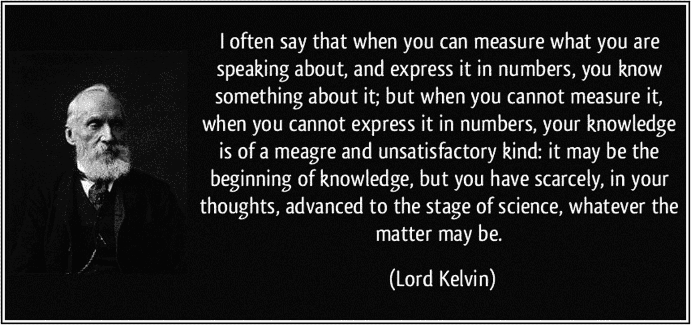

图 1-3

开尔文勋爵语录

在整本书中，我们会考虑更多这样的例子，任务是自动识别不同类型的东西，而不需要被告知有多少。它们的共同任务是，这类问题没有事先知道的正确答案(例如，有多少种不同的形状)。这就是所谓的“无监督学习”

对于第一组，你可以把它想象成一个有学生和老师的班级，老师问问题并告诉孩子们他们是否正确。这就是为什么它被称为“监督”在第二种情况下，我们不知道答案——我们没有主管。

还有另一种学习方式，这种学习方式通过对所完成任务的好坏结果的体验而得到强化。你还记得你是怎么学会走路的吗？你能教婴儿或机器人走路吗？我们学会走路是因为我们的大脑一直在不断地从我们走过的好的和坏的步伐中获取线索。教计算机做类似的事情是相似的。我们所要做的就是给计算机提供几次犯错的机会，并从结果中学习。好的结果将强化算法的信念，即所采取的步骤是好的，而坏的结果将强化这样的事实，即所采取的步骤是坏的，因此应该避免。这种类型的学习在机器学习文献中被称为“强化学习”。仅仅通过阅读文本是很难理解的。这是一种感觉。我劝你看这段机械臂投掷物体的视频: [`www.youtube.com/watch?v=JJlSgm9OByM`](https://www.youtube.com/watch?v=JJlSgm9OByM) 。

## 抽象很重要

面向对象编程中你最喜欢的概念是什么？我的是*抽象*。一个好的抽象让一切看起来很容易。例如，在机器学习这样的复杂事物/领域上实现良好的抽象是非常困难的，因为确定哪一部分是构建模块的最佳选择在最好的情况下是困难的，在最坏的情况下是不可能的；但是 ML.NET 在平衡方面做得很好。

Note

如你所知，这本书是关于 ML.NET，微软的新 ML 框架。2019 年发布的. NET 开发者。它允许开发人员使用 ML 功能来增强他们的应用程序，但最棒的是，您不需要学习数据科学和数学就可以使用它。

ML.NET*将机器学习民主化。NET 开发人员多年来一直在为企业、网页、应用程序等开发业务线应用程序，现在面临着解决机器学习问题的挑战，因为企业拥有海量数据，他们希望现有员工帮助他们快速将这些数据转化为可操作的见解。这是一项艰巨的任务。这根本不是一件容易的事情，但是像 ML.NET 这样的好框架可以帮上忙。*

ML.NET*封装了*机器学习算法，这样大部分时间使用算法*仅仅是*变成了*调用*一个函数。这似乎是一种过于简化的*，但这使得不需要真正理解算法内部如何工作的开发人员能够轻松*使用算法，从而消除/减少进入机器学习领域的障碍。使用一种算法并根据一些预设矩阵评估其性能是一回事，理解算法内部如何工作是完全不同的另一回事。然而，在很大程度上，对于开发者来说，知道如何使用一种算法以及如何测量它对于手头任务的性能就足够了，这样就可以改变参数以进行优化，并且他们(开发者)可以不需要获得真正理解底层情况的知识。**

 **考虑线性回归的例子。如果你不懂什么是线性回归，也不用担心。目前，只要知道这是一种将几个点拟合到给定直线上的方法，以便可以对新的输入点进行预测就足够了。

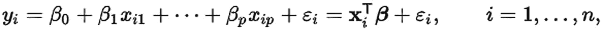

图 1-4

回归通用方程

前面的方程是线性回归的一般形式。然而，有几个变种，了解它们的所有细节超出了一个. NET 开发人员为保住他们的日常工作所花费的可承受的时间承诺。这只是机器学习模型可以有多复杂的一个例子。但是像 ML.NET 这样的好框架可以保存所有的细节，除了调整算法绝对需要的那些。此外，如果框架表现良好，开发人员可以学习如何使用它。

让我们来比较一下这两件事。

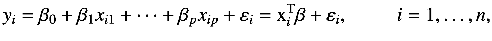T2】

```py
var model = pipeline.Fit(dataView);

```

右边的`Fit`方法的调用看起来会立即被。NET 开发人员，他们似乎不需要数学背景(夸张但真实)来理解幕后发生的事情。此外，根据输入的不同，`Fit`方法可以选择使用不同的回归算法，因此比硬编码模型更有效。这些模型也需要发展，这对普通人来说是很困难的。NET 开发者(恕我直言)必须跟上所有的进步，因此，如果硬编码，这个模型迟早会错过科学家对机器学习理论的改进。然而，如果使用了像 ML.NET 这样的框架，那么这些增强功能将会在框架中发挥作用，而开发人员将会在不知情的情况下从中获益。因此，*抽象很重要*，一个好的抽象让几乎任何事情看起来都非常简单。

因此，虽然左边的实际方程会吸引数学家，但对右边框架的调用会让开发人员高兴，这就是框架的动机。简而言之，ML.NET 的目标是“让机器学习成为利基市场的陈词滥调”

该框架为机器学习流水线的所有部分提供了功能，从数据获取到模型评估和交叉验证(检查算法的表现)。该框架还以通用方法的形式封装了几种特征工程技术，以一种真正有效和干净的方式简化了数据准备过程。

### ML.NET 能解决什么类型的问题？

ML.NET 目前(2020 年 9 月)支持“监督学习”和“无监督学习”。这在未来肯定会改变，但这是一个好的开始，因为许多有用的项目都依赖于监督/非监督学习。

以下是一些非常常见的机器学习问题类型及其问题领域类别的列表:

*   监督学习
    *   回归(预测真实值)
        *   预测房价

        *   预测特定一天的温度

    *   分类
        *   二元分类(区分粉笔和奶酪)
            *   区分癌细胞和非癌细胞

            *   区分粉笔和奶酪

        *   多类分类(自动分类，不止一个)
            *   以花瓣和萼片的大小为特征鉴别花朵

            *   用相应的标签标记 GitHub 问题

    *   产品推荐

*   无监督学习
    *   聚类(细分超市中的买家)

### 流水线


大多数(或者我应该说所有)机器学习活动的目标是提出一个模型，尽可能整齐地将一组输入映射到一组预定义的输出。此外，大多数时候，数据以混乱的方式出现，对于机器学习算法来说是不可消耗的。

#### ML.NET 的部分地区

ML.NET 是围绕一个名为“T0”的中心类型而建立的。几乎所有使用 ML.NET 执行的操作都使用`MLContext`类型的一个或另一个部分。它在语义上几乎像一个`DataContext`。这个类有几个通过不同成员提供的功能:

*   数据加载

*   数据转换

*   预报

*   计量精度

***数据加载***

ML.NET 提供了通过几种静态方法从几种不同格式加载数据的功能。这里展示了其中的一些。

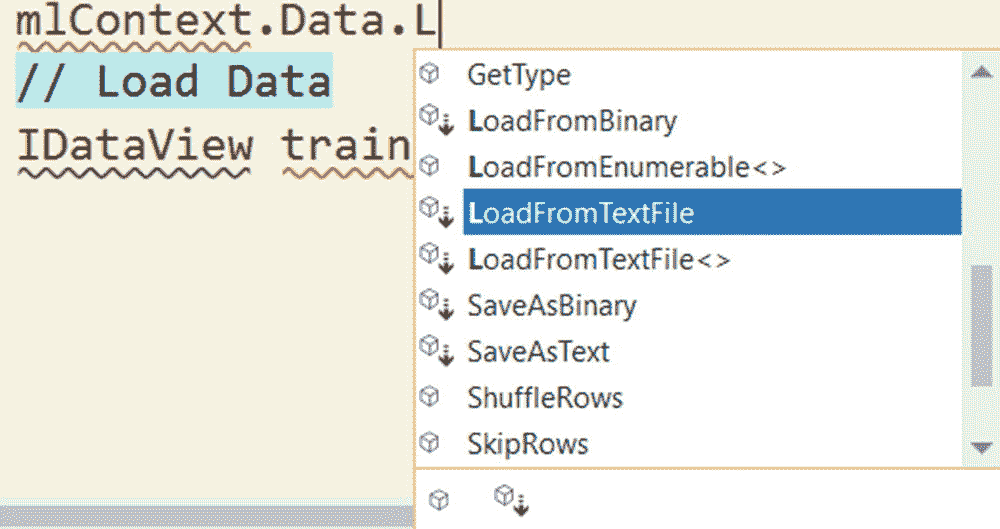

图 1-5

为机器学习问题加载/创建数据的几种方法

如您所见，有多种方法可以从几种不同的格式中加载数据。这是一个增量列表。很快可能会支持许多其他数据加载器。

***数据转换***

`MLContext`通过`MLContext`类的 Transforms 属性提供数据转换功能。转换的类型是`TransformCatalog`。所有这些转换都作为扩展方法提供。因此，如果需要，我们也可以构建自己的转换。

***预测***

使用 MLContext 和 MLContext 中的相关类，我们需要建立一个流水线来表示机器学习流水线，该流水线具有进行数据加载、转换和预测的组件。流水线用于创建所谓的估计器。估计器用于生成模型。

***测量精度***

机器学习模型的性能可以通过很多方式来衡量。ML.NET 提供了几个度量标准(取决于执行的任务)来衡量这种性能，如混淆矩阵和交叉验证准确性。

### 模型构建器简介(自动 ML)

ML.NET 是为机器学习的绝对初学者而设计的。因此，除了几个 API 来创建一个定制的 ML 模型，ML.Net 还提供了一个奇妙的 UI 驱动的实用程序，帮助初学者找到解决机器学习问题的最佳算法。它运行几个模型，并跟踪精度和完成训练所需的时间。这个工具对于定位算法非常有帮助。

在接下来的几节中，我们将通过一个简单的例子来展示如何使用这个工具来解决现实世界中的机器学习问题。

### 用模型构建器解决一个简单的问题

在本例中，将使用 Iris flower 数据集。你可以从 [`https://archive.ics.uci.edu/ml/datasets/iris`](https://archive.ics.uci.edu/ml/datasets/iris) 得到数据。

进入如图 [1-6](#Fig6) 所示的“数据文件夹”。

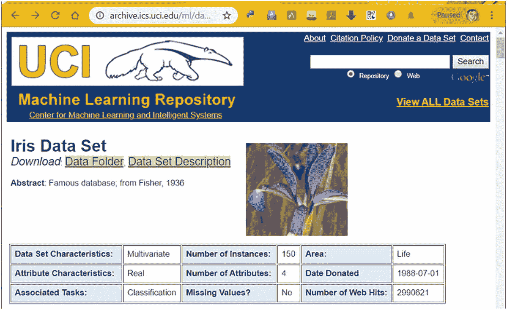

图 1-6

多类分类问题的定位数据(鸢尾花)

一旦你点击了数据文件夹的链接，你会看到这个(图 [1-7](#Fig7) )。

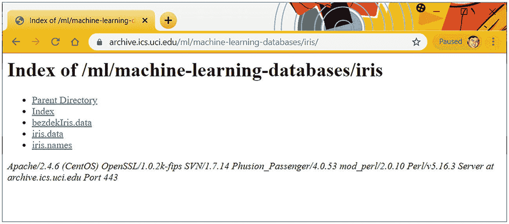

图 1-7

为机器学习定位 UCI 数据库中的数据

从这里，点击“iris.data”下载该文件。该文件将如下所示(前几行和前几列如图 [1-8](#Fig8) 所示)。

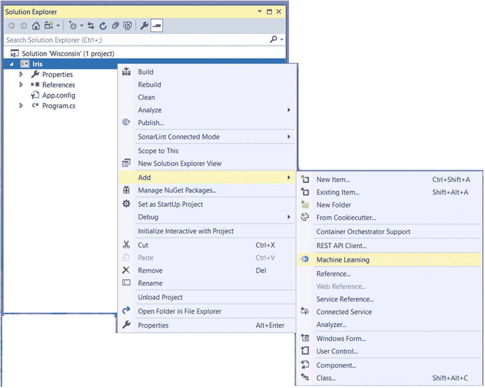

图 1-8

使用 Visual Studio 中的模型生成器添加“机器学习”的菜单

第一列是患者的 ID，第二列表示诊断(M 表示恶性肿瘤，B 表示良性肿瘤)。其余的列表示几个测试结果的几个值。这些列的实际名称并不重要。

如果您还没有模型构建器，那么您可以从以下链接下载它:

[T2`https://marketplace.visualstudio.com/items?itemName=MLNET.07`](https://marketplace.visualstudio.com/items?itemName=MLNET.07)

安装完成后，创建一个名为“Iris”的控制台 app，项目看起来会如图 [1-9](#Fig9) 所示。

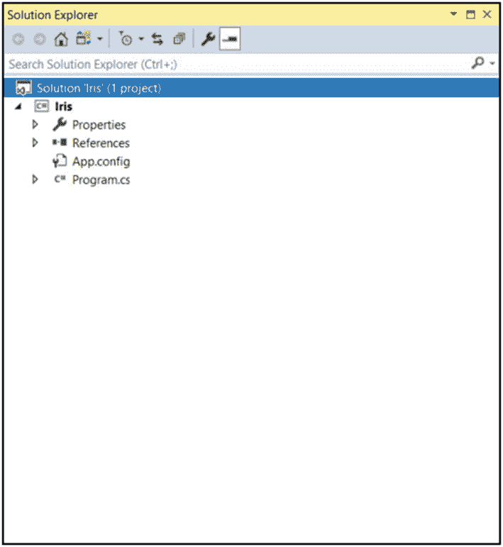

图 1-9

创建应用程序“Iris”

点击机器学习菜单将弹出模型生成器的 UI，如图 [1-10](#Fig10) 所示。

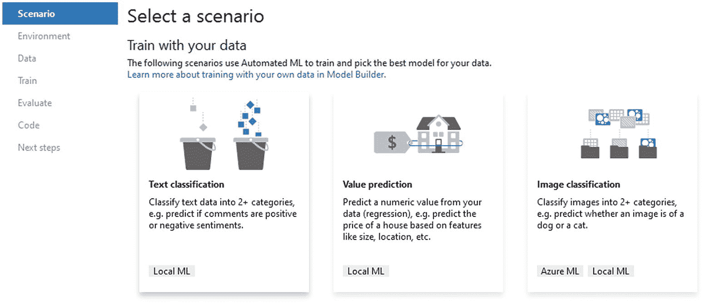

图 1-10

模型构建器向导界面(选择“文本分类”)

第一步是理解识别一种花是一个多类分类问题，因为我们有三种不同类别的鸢尾:杂色鸢尾、圣淘沙鸢尾和海滨鸢尾。换句话说，更像是 GitHub 问题分类问题。所以为了从数据中识别花，我们需要选择那个场景。点击“问题分类”按钮后，向导将显示下一个屏幕，用于加载数据和设置参数。

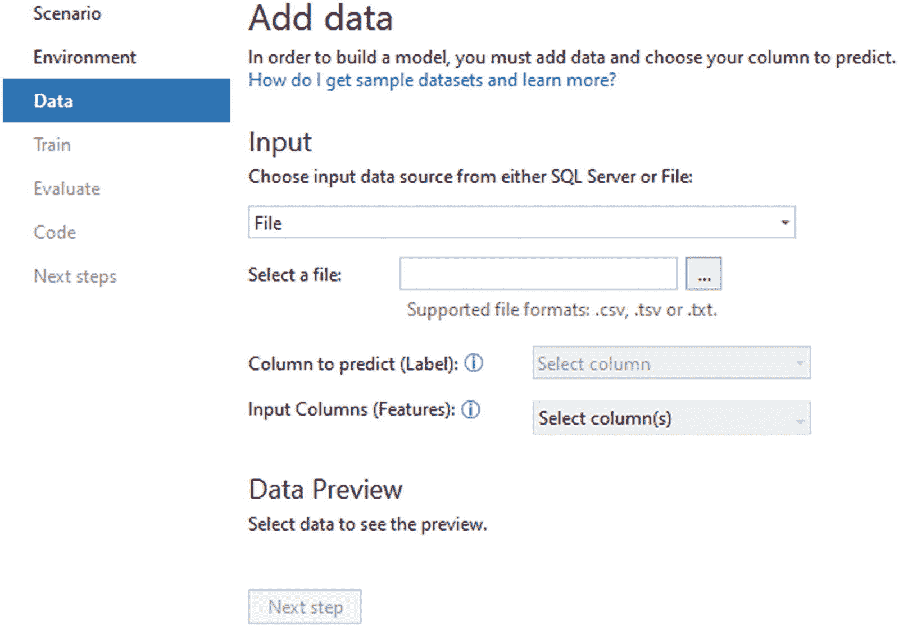

图 1-11

用于加载培训数据的模型生成器向导界面

一旦输入数据被加载，向导将在预览中显示数据，如图 [1-12](#Fig12) 所示。注意需要将 iris.data 重命名为 iris.csv 否则，您将无法在模型构建器中打开它。

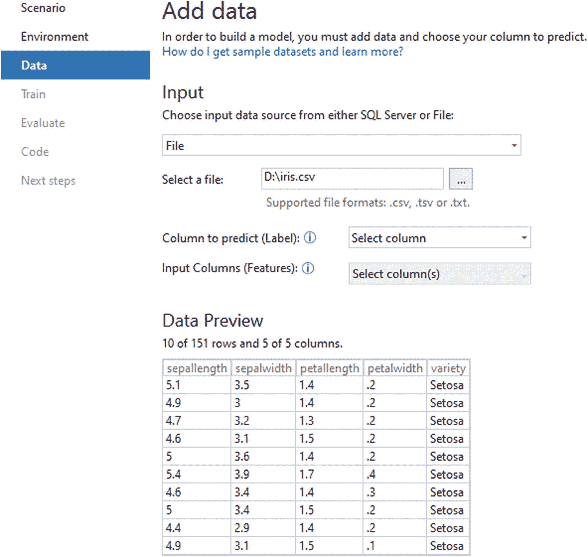

图 1-12

用于加载数据、预览和设置的模型构建器向导界面

下一步是告诉向导我们要使用哪一列进行标记，即我们要预测的列。在这种情况下，我们需要使用“品种”栏。完成后，向导会将 variety 列标记为“标签”,如数据预览中所示。剩余的列用于预测标签。但是，我们可以通过选择/取消选择每个列名前面的复选框来选择要使用的列。

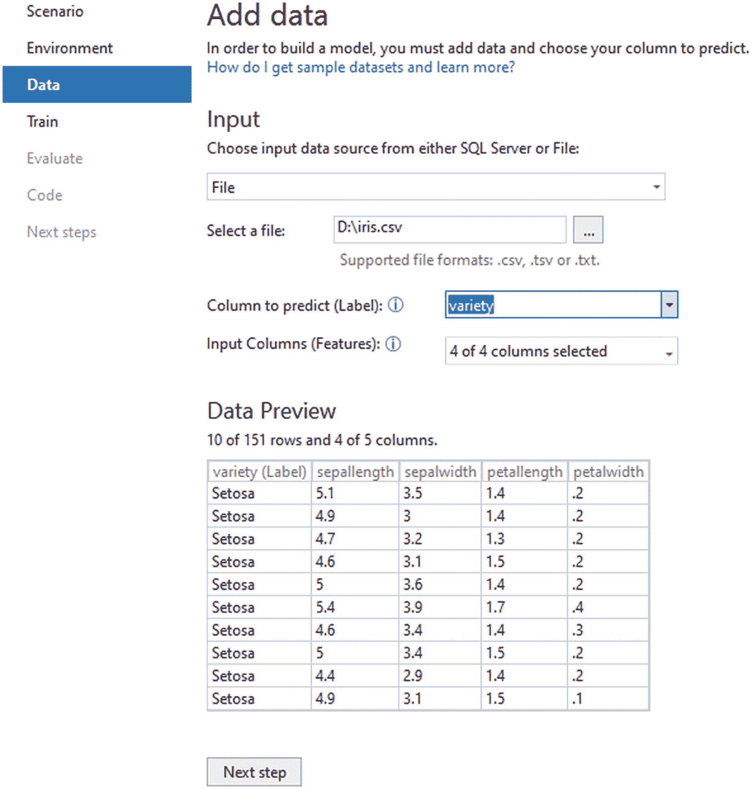

图 1-13

设置要预测的字段(标签)

下一步是训练以获得模型。给巫师训练的时间越多越好。这是因为引擎盖下的向导使用自动机器学习来计算出哪个模型是最好的。

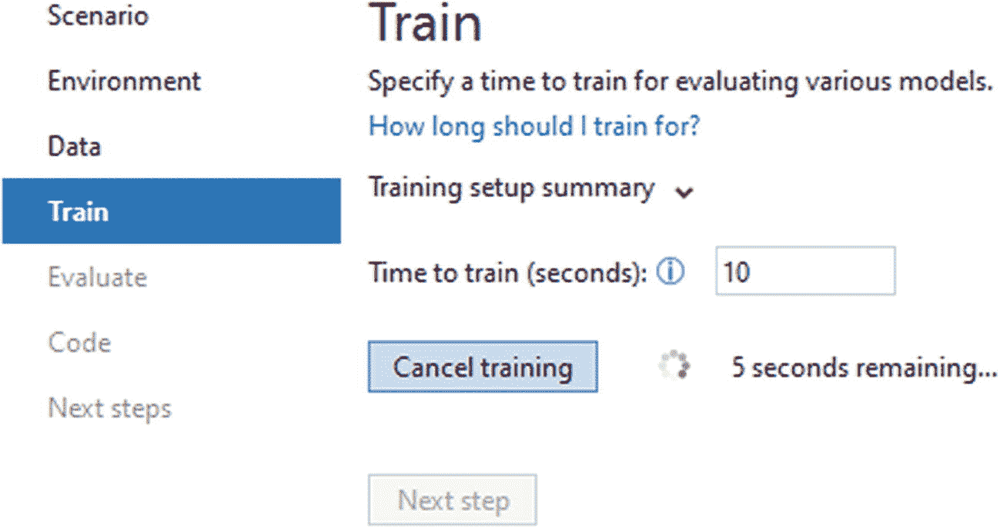

图 1-14

模型生成器向导:训练模型界面

向导给出的默认训练时间是 10 秒。对于小于 10Mb 的数据集，十秒钟就足够了。但是强烈建议我们对非常小的数据集使用至少 90 秒的训练时间。


图 1-15

显示模型生成器培训向导的进度

一旦设置了训练模型的时间，单击“开始训练”将开始训练，并且将列出迄今为止尝试的算法的性能，如图所示。

训练完成后，可以从“评估”选项卡中查看算法的测试结果。

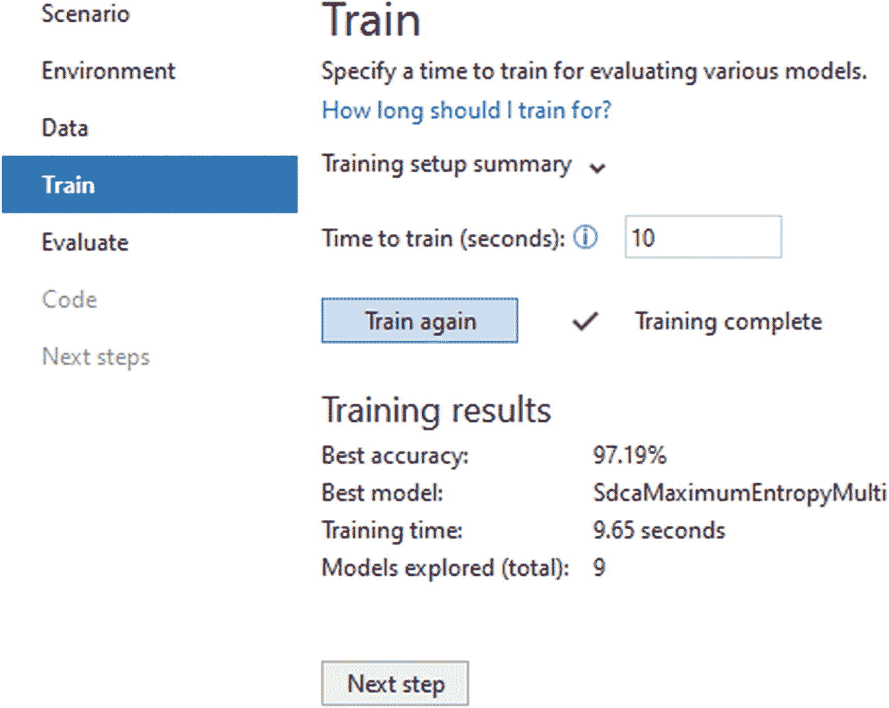

图 1-16

模型构建器培训模型已完成

“评估”选项卡显示算法性能的详细信息。

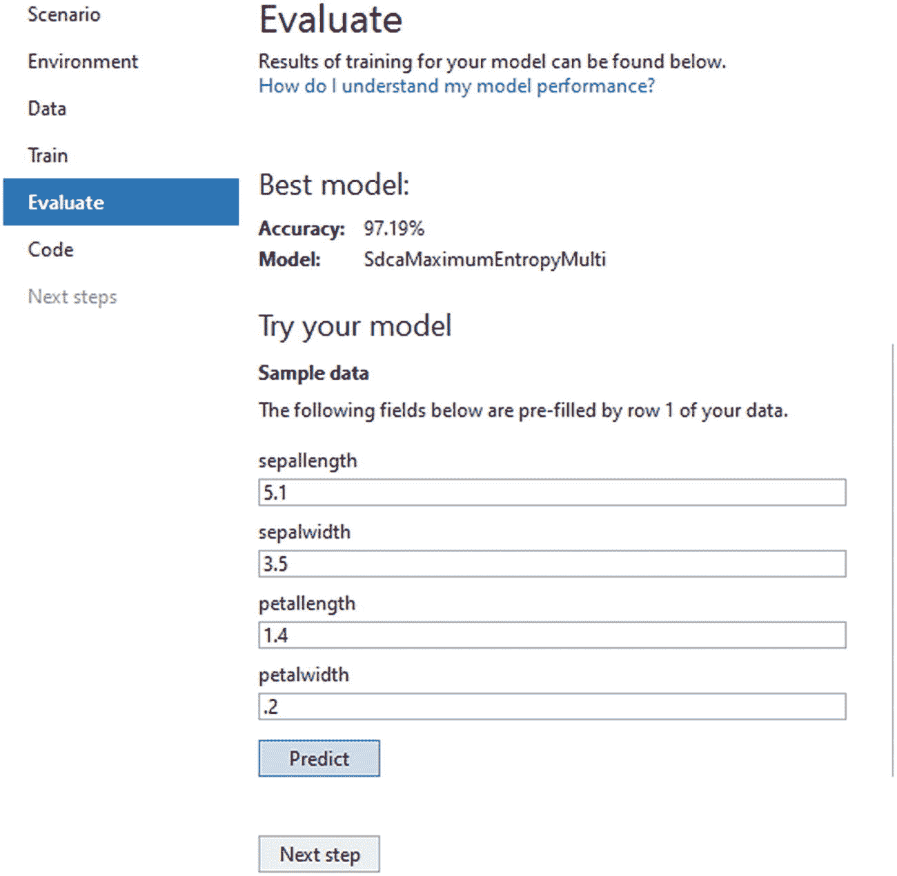

图 1-17

模型生成器向导模型评估界面

有趣的是，Evaluate 选项卡提供了一个很好的界面来测试这个模型。该界面是从用于生成模型的字段自动生成的。

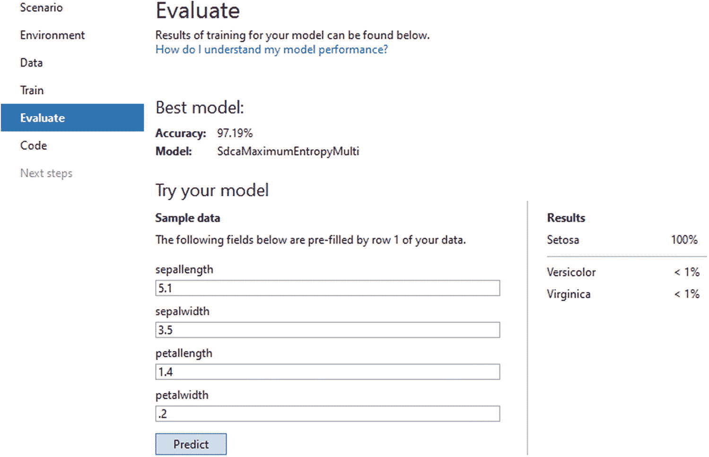

图 1-18

显示动态生成的用户界面，用于通过模型构建器测试指定的模型

最后一步是为解决方案中生成的模型添加代码。

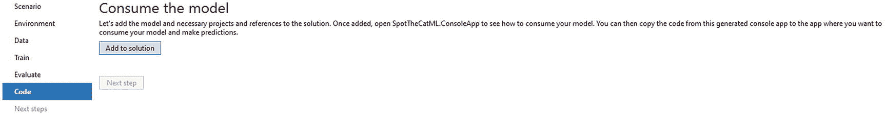

图 1-19

将生成的项目添加到解决方案的模型生成器向导界面

通过点击“添加到解决方案”，可以将生成的项目添加到解决方案中。添加项目后，解决方案资源管理器将显示这些新项目，如图 [1-20](#Fig20) 所示。

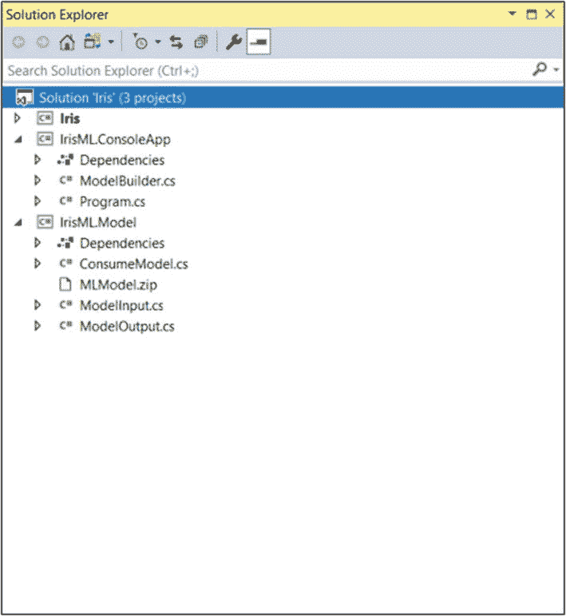

图 1-20

显示添加到解决方案中的生成项目

### 生成的代码的演练

模型构建器向导生成了`ModelInput`和`ModelOutput`类。

```py
// This file was autogenerated by ML.NET Model Builder.
using Microsoft.ML.Data;
namespace IrisML.Model
{
    public class ModelInput
    {
        [ColumnName("sepallength"), LoadColumn(0)]
        public float Sepallength { get; set; }
        [ColumnName("sepalwidth"), LoadColumn(1)]
        public float Sepalwidth { get; set; }
        [ColumnName("petallength"), LoadColumn(2)]
        public float Petallength { get; set; }
        [ColumnName("petalwidth"), LoadColumn(3)]
        public float Petalwidth { get; set; }
        [ColumnName("variety"), LoadColumn(4)]
        public string Variety { get; set; }
    }
}

```

`ModelInput`类表示输入数据集的每一行。列名的索引作为`LoadColumn`属性的值，列名作为`ColumnName`属性的值。这是从输入 irisi.csv 文件中提取的一行。如您所见，列索引从 0 开始。

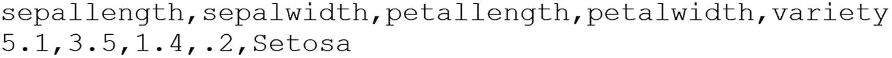

```py
public class ModelOutput
{
     // ColumnName attribute is used to change the column name from
     // its default value, which is the name of the field.
     [ColumnName("PredictedLabel")]
     public String Prediction { get; set; }
     public float[] Score { get; set; }
}

```

`ModelOutput`类代表预测结果。分数代表所有可能类别的分数。如图 [1-21](#Fig21) 所示，该得分数组的值以置信度百分比的形式显示在测试 UI 上。


图 1-21

显示即时生成的用户界面，以测试模型构建器指定的模型

这意味着，对于这些测试数据，模型有 86%的信心认为花是`Setosa`，14%的信心认为它是**云芝**，不到 1%(或可以忽略不计)的信心认为它是`Virginica`。在代码中，这些数据可以表示为 0.86、0.14 和 0.0034，作为分数数组的元素。

这一行使用 ConsumeModel 类的 Predict 方法(现在可以保留为黑盒)将训练模型的输出作为 ModelOutput 实例返回。

```py
// Make a single prediction on the sample data and print results
ModelOutput predictionResult = ConsumeModel.Predict(sampleData);

```

为了确保模型代码根本不能使用品种来预测(看了代码后会很明显它不能)花的品种，给它设置了“Unknown”。之后，如果您设置了 **IrisML。将 ConsoleApp** 作为启动项目运行程序，如图所示放置一个断点，你会看到类似的结果(图 [1-22](#Fig22) )。

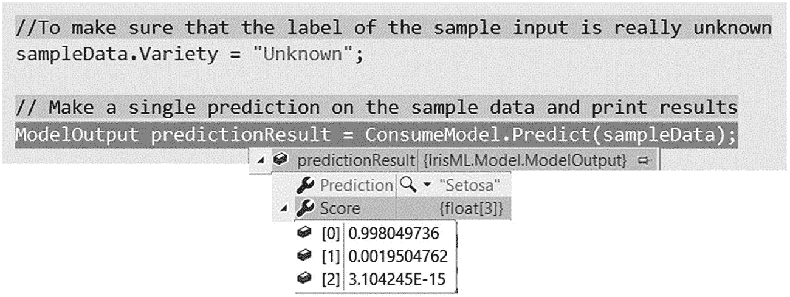

图 1-22

通过模型构建器调试生成代码的视图

## 摘要

在这一章中，我们仅仅触及了 ML.NET 的表面。框架在幕后做了很多工作。它提供了为学习加载和转换数据的功能。然后，它还在内部做一些事情来准备机器学习算法可以使用的数据。这些技术被称为特征工程，而`Model Builder`确实有助于了解不同的算法，以及如何使用这些算法和如何为此使用几个特征。

该框架是非常模块化的，并且是开放扩展的。更一般地说，框架本身有几个围绕核心类型构建的扩展。

在下一章，我们将利用 ML.NET 来分类问题。你将学习如何提出一个二进制或多类分类问题，以及如何使用 ML.NET 来解决这些问题。**