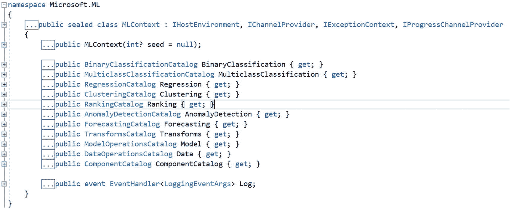
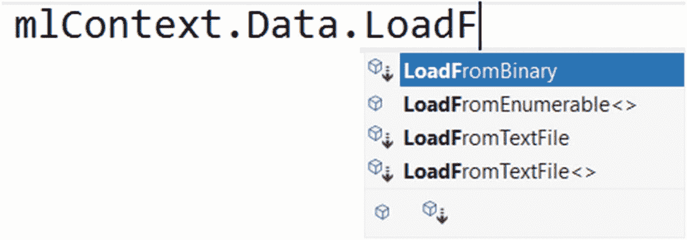
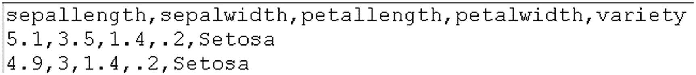
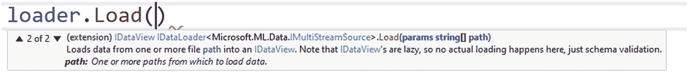
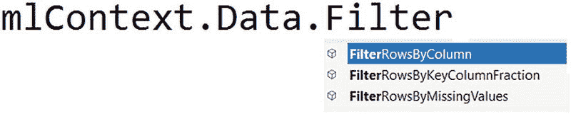
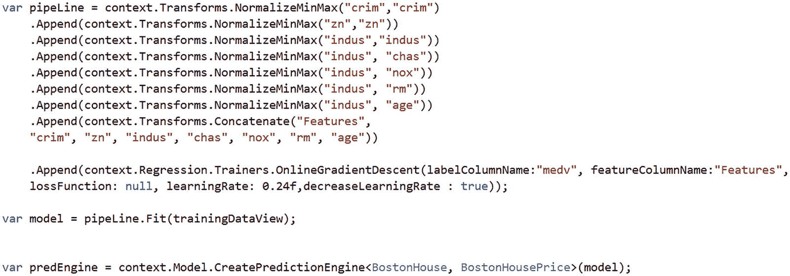

# 2.管道


## 介绍

所有机器学习(ML)活动的目标都是将原始数据转化为某种预测、分类或洞察力。原始数据出现在这条管道的左边或开头，右边或结尾是洞察/预测/分类等等。虽然每个机器学习任务将需要不同的流水线，但基本结构或构建块保持不变。ML.NET 提供了几种类型/接口来简化管道的创建。对这些概念的广泛理解将有助于你理解 ML.NET 是如何工作的。

## 本章的目标

读完这一章后，你应该能够识别机器学习流水线的不同组成部分，并看到所有 ML.NET 流水线在本质上是相似的，尽管它们的目的或实际主体彼此非常不同。你将学会识别和调整所有这些机器学习管道的所有部分。

## 管道部分(在 ML.NET)

*   背景

*   数据加载器

*   变形金刚(电影名)

*   运动鞋

ML.NET 的每个机器学习操作都是通过创建机器学习上下文开始的。上下文在概念上类似于管道的起点。它提供了创建管道每个部分的方法。上下文封装在`MLContext`类型中。

该类型有几个属性来提供启动特定机器学习任务的能力。在 ML.NET 的每个 ML 任务的开始，我们必须创建一个上下文对象，如清单 [2-1](#PC1) 所示。

```py
MLContext mlContext = new MLContext(seed: 1);

Listing 2-1Instantiating MLContext is easy

```

如果设置了 seed，MLContext 将变为确定性的，并且每次运行应用程序时都会生成相同的随机数，因此不同运行的结果是可重复的。如果您重复教程示例并希望获得相同的结果，这可能会有所帮助。如果不设置种子，MLContext 将使用随机数生成器，每次运行结果会略有不同(对于使用随机数的操作，并非所有操作都使用随机数)。在现实生活中，我建议保持随机组件的不确定性，这意味着不设定种子。

不同种类的机器学习活动基于从`MLContext`属性创建的管道。这里是`MLContext`类。



图 2-1

MLContext 类的总体定义

如前所述，`MLContext`充当了机器学习管道的根。表 [2-1](#Tab1) 显示了这个类的不同属性如何用于不同类型的机器学习问题。

表 2-1

显示 MLContext 类的不同属性的含义

<colgroup><col class="tcol1 align-left"> <col class="tcol2 align-left"></colgroup> 
| 

机器学习的类型

 | 

将管道启动为

 |
| --- | --- |
| **二元分类** | `mlContext.BinaryClassification` |
| **多类分类** | `mlContext.MultiClassClassification` |
| **回归** | `mlContext.Regression` |
| **聚类** | `mlContext.Clustering` |
| **异常检测** | `mlContext.AnomalyDetection` |
| **预测(时间序列数据)** | `mlContext.Forecasting` |

`mlContext`是上表中`MLContext`类的对象。

## 数据加载器


图 2-2

将训练数据表示为要处理的文件束

数据有几种格式，有时它驻留在内存集合中。ML.NET 提供了从多个来源轻松加载数据的功能。所有这些加载器都可以通过 mlContext 访问。数据属性如图 [2-3](#Fig3) 所示。



图 2-3

显示 MLContext 实例上的 IntelliSense 可用性

管道中的数据在`IDataView`类型内传输，引入到。NET 专门针对 ML.NET。这是查询运算符(转换)的输入和输出。这是数据管道的根本类型，堪比 LINQ 的 [`IEnumerable<T>`](https://docs.microsoft.com/en-us/dotnet/api/system.collections.generic.ienumerable-1) 。该接口需要能够无缝集成多种数据加载功能，并与其他机器学习框架集成。

表 [2-2](#Tab2) 显示了用于加载数据的函数。

表 2-2

展示了几种加载数据的方法

<colgroup><col class="tcol1 align-left"> <col class="tcol2 align-left"></colgroup> 
| 

数据类型/用途

 | 

加载数据的函数

 |
| --- | --- |
| **二进制** | `LoadFromBinary` |
| **数据在内存集合中** | `LoadFromEnumerable` |
| **从文本文件加载数据作为 IDataView** | `LoadFromTextFile` |
| **以强类型方式从文本文件加载数据。要加载的数据的类型作为通用属性**传递 | `LoadFromTextFile<T>` |
| **从数据库加载数据** | `mlContext.CreateDatabaseLoader<T>().Load(...)` |

这就是从文件加载的样子。因此，如果您有一个 CSV 文件，首先创建一个代表 CSV 的每一行的`ModelInput`类。然后，使用这个类作为`LoadFromTextFile<T>`中的通用参数，如下例所示。

```py
IDataView trainingDataView =
                mlContext.Data.LoadFromTextFile<ModelInput>
          (path: TRAIN_DATA_FILEPATH,
           hasHeader: true,
           separatorChar: ',',
           allowQuoting: true,
           allowSparse: false);

Listing 2-2Loading training data to IDataView

```

如果您不喜欢每次创建 ML 模型时都手工输入这个类，那么您可以使用脚本(清单 [2-3](#PC3) )来自动完成这项工作。

下面的 C#脚本获取一个 CSV 文件并发出`ModelInput`类。

```py
string csvFile = @"C:\MLDOTNET\iris.csv";
var columns = File.ReadLines(csvFile)
                 .Take(1)
                 .First()
                 .Split(new char[]{','});
var firstLine = File.ReadLines(csvFile)
                    .Skip(1)
                    .Take(1)
                    .First()
                    .Split(new char[] { ','});
StringBuilder propertyBuilder = new StringBuilder();

for (int i = 0; i < columns.Length; i++)
{
      string column = columns[i];
      propertyBuilder.AppendLine($"[ColumnName(\"{column},LoadColumn({i})]");

      if(firstLine.ElementAt(i).ToCharArray()
          .All(m => Char.IsDigit(m) || m == '.'))
      {
            propertyBuilder
              .AppendLine($"public float {column.Substring(0, 1).ToUpper()
                     + column.Substring(1)}");
      }
      else
      {
            propertyBuilder.AppendLine($"public string
            {column.Substring(0,1).ToUpper() + column.Substring(1)}");
      }
      propertyBuilder.AppendLine("{ get; set;}");
}

string classCode = @"public class ModelInput " + Environment.NewLine
                + "{" + Environment.NewLine + propertyBuilder.ToString()
                      + Environment.NewLine + "}";
Console.WriteLine(classCode);

Listing 2-3Script to automatically generate code to load data 

```

对于以下 CSV 文件，(前两行数据)



图 2-4

显示了 Iris 训练数据集的前几行

它生成下面的类。这个脚本将节省你无数的时间来创建`ModelInput`来加载数据并开始你的实验。

```py
public class ModelInput
{
      [ColumnName("sepallength"), LoadColumn(0)]
       public float Sepallength { get; set; }
      [ColumnName("sepalwidth"), LoadColumn(1)]
       public float Sepalwidth  { get; set; }
      [ColumnName("petallength"), LoadColumn(2)]
       public float Petallength { get; set; }
      [ColumnName("petalwidth"), LoadColumn(3)]
       public float Petalwidth  { get; set; }
      [ColumnName("variety"), LoadColumn(4)]
       public string Variety  { get; set; }
}

Listing 2-4ModelInput for the Iris dataset

```

属性指定您的属性的列索引，只有当您从文件加载数据时才是必需的。

`MLContext.Data`除了从多个来源加载数据之外，还提供过滤和混洗数据的功能。

从文本文件中加载数据是一个非常常见的活动，ML.NET 在这方面做得很好。它提供了几种从文本文件加载数据的通用方法，不管有没有头。

下面的代码从制表符分隔的没有标题的文件中读取数据，该文件中有三个数字列。Tab ('\t ')是`separatorChar`参数的默认值。

```py
var loader =
mlContext.Data.CreateTextLoader(
columns: new[]
{
  new TextLoader.Column("Feature1", DataKind.Single, 0)
  new TextLoader.Column("Feature2", DataKind.Single, 1)
  new TextLoader.Column("Feature3", DataKind.String, 2)

},
hasHeader: false
);

Listing 2-5Creating a TextLoader

```

如果你想阅读一个没有标题的 CSV 文件，那么你必须提到清单 [2-6](#PC6) 中突出显示的`separatorChar`是。

```py
var loader =
mlContext.Data.CreateTextLoader(
columns: new[]
{
  new TextLoader.Column("Feature1", DataKind.Single, 0)
  new TextLoader.Column("Feature2", DataKind.Single, 1)
  new TextLoader.Column("Feature3", DataKind.String, 2)
},
separatorChar: ',',
hasHeader: false
);

Listing 2-6Creating another custom TextLoader

```

现在要读取数据，您必须调用刚刚创建的加载器上的 Load 方法，就像`loader.Load(<path_to_file>)`一样。

由于训练数据有时可能出现在多个文件中，因此需要创建一个加载器，并将文件路径作为参数传入。



图 2-5

显示从多个文件读取负载的霸主

由于数据出现时可能相当混乱，因此过滤对于提供数据所需的一些初步清理非常有用。`MLContext.Data`提供以下过滤功能。

表 2-3

基于不同标准执行筛选的方法

<colgroup><col class="tcol1 align-left"> <col class="tcol2 align-left"></colgroup> 
| 

过滤

 | 

它的作用

 |
| --- | --- |
| **滤波器 RowsByColumn** | 基于给定列的值范围筛选数据 |
| **滤波器 row sbykeycolumn 分数** | 按`KeyDataViewType`列的值过滤行 |
| **滤波器 row sbymisingvalues** | 通过删除传递的列列表中任何一列有缺失值的行来筛选数据 |



图 2-6

显示智能感知的筛选功能

## 从数据库加载数据

要将数据从数据库加载到`IDataView`，需要以下步骤。

```py
//Name of the provider has to be given as "System.Data.SqlClient"
DbProviderFactory factory =
                    DbProviderFactories.GetFactory("System.Data.SqlClient");
DatabaseSource = new DatabaseSource(factory,
                                 "<connection string>",
                                 "select * from IRIS");

IDataView trainingView = mlContext.Data.CreateDatabaseLoader<ModelInput>()
                                                   .Load(databaseSource);

Listing 2-7Loading training data from a database

```

## 变形金刚(电影名)

随着毛虫变成蝴蝶，数据必须在用于机器学习算法/模型之前进行转换。因为如果数据在没有适当的事先清理、缩放和归一化的情况下直接馈送给机器学习算法，它将使算法混乱，并且它的输出将有偏差，如果不是完全关闭的话，这是绝对不可接受的。


图 2-7

机器学习中数据转换的符号表示

ML.NET 提供了几个转换器来将杂乱的数据转换成清晰的数据。干净的数据是指没有任何失真的数据，在清晰度方面可能看起来很像生成的数据。干净数据没有缺失值、数值列的允许范围之外的值或枚举的不可能值。例如，一个保险调查的杂乱数据集可能有负值的年龄列或不可能的年龄值，如 923 等等。类似地，对于客户的性别列，数据可以在允许的枚举之外，如{M，F}。干净的数据是非常重要的，ML.NET 提供了几种通过称为变压器的阶段来清理数据的方法。如果您愿意的话，这些转换可以相互粘合，以创建转换链或管道。下面是这种管道转换的一个例子。

```py
 var pipeLine = context.Transforms.NormalizeMinMax("crim","crim")
                .Append(context.Transforms.NormalizeMinMax("zn","zn"))
                .Append(context.Transforms.NormalizeMinMax("indus","indus"))
                .Append(context.Transforms.NormalizeMinMax("indus", "chas"))
                .Append(context.Transforms.NormalizeMinMax("indus", "nox"))
                .Append(context.Transforms.NormalizeMinMax("indus", "rm"))
                .Append(context.Transforms.NormalizeMinMax("indus", "age"))
                .Append(context.Transforms.Concatenate("Features",
                "crim", "zn", "indus", "chas", "nox", "rm", "age"))

Listing 2-8Gluing transformations with Append

```

不要太担心实际的转换。这些将在本书后面解释。现在，请注意转换是如何通过`Append()`方法粘合在一起的。

第一个转换`context.Transforms.NormalizeMinMax("crim","crim")`返回一个`NormalizingEstimator`，如清单 [2-8](#PC8) 所示。

早先管道上的第一个`Append()`调用是在`NormalizingEstimator`上创建的扩展方法。这个扩展方法返回`EstimatorChain<NormalizingTransformer>`。`Append()`也被定义为`EstimatorChain<T>()`上的扩展方法。

ML.NET 非常依赖扩展方法来很好地将事物粘合在一起。在下一章中，您将详细了解几种转换。

## 运动鞋

好的教练训练身体；伟大的人训练头脑。找到一个好的教练是很难的，甚至是不可能的。


图 2-8

教练的象征性表现

身体就像机器学习系统的基础设施，而大脑就像实际的模型。如果你有一个很好的模型和糟糕的基础设施，那就糟了，但如果你有很好的基础设施但模型不好，那就更糟了，因为在这种情况下，你将无法充分发挥基础设施的潜力，就像一个没有受过训练的头脑有着坚实的体格一样。

ML.NET 提供了几个培训师，针对不同的机器学习需求进行培训。

对于每个算法/任务组合，ML.NET 提供了一个执行训练算法和进行解释的组件。这些组件被称为训练器。例如，`SdcaRegressionTrainer`使用应用于回归任务的`StochasticDualCoordinatedAscent`算法。

所有这些训练员都是各自的类型。例如，二进制分类训练器位于`mlContext.BinaryClassification.Trainers`。

在本书的相应章节中，你会学到更多关于教练的知识。然而，现在知道训练器作为机器学习管道的最后一步被添加就足够了。考虑清单 [2-9](#Figb) 中所示的例子。



清单 2-9

将培训师添加到管道中

最后一个`Append()`调用创建了一个`EstimatorChain<RegressionPredictionTransformer>`。

因此，基本上，训练器是一种算法，它采用数据视图并提供模型，该模型可用于创建模型，进而可用于预测未来值。

在清单 [2-9](#Figb) 中，最后一个追加调用添加了培训师:

```py
.Append(context.Regression.Trainers.OnlineGradientDescent(labelColumnName:"medv",lossFunction:null, learningRate:0.24f, decreasingLearningRate:true));

```

该行为所选训练器 OnlineGradientDescent 设置超参数(帮助训练器收敛并在迭代过程开始前设置的参数)。

不要太担心这段代码的确切工作方式。这是为了说明通用接口如何允许教练作为最后一步插入到管道中。在后面的章节中，你将学习如何为你的机器学习任务选择一个训练者，以及如何评估他们的表现。

## 模型构建器(向导)


图 2-9

模型构建器的符号表示

对于刚到 ML.NET 的新手和从业者来说，找到正确的转换或培训方法可能是一个相当大的挑战。为了解决这个问题，微软创建了一个名为`Model Builder`的向导。该向导可以为您完成所有的数据科学决策部分，为您的特定案例推荐具有最佳参数的最佳培训师。作为输入，您提供您的数据集和任务(例如，预测房价)，结果，您将看到向导为您的任务尝试的所有培训师，以及对每个培训师的评估。结果将被排列显示你“赢家”。如果您对结果满意，那么如果用户愿意，向导可以将生成的代码添加到现有的解决方案中。

建立模型是找到适合工作的模型/培训师的第一步。在整本书中，你将学习如何使用模型构建器。

Note

除了帮助定位当前数据集的最佳算法/模型之外，ML.NET 还生成非常干净的代码，因此几乎感觉像是某个专家写的代码。

## 摘要

这是一个很短的章节，但我希望它能让你对 ML.NET 框架有一个非常高层次的了解，以及该框架中各种事物背后的基本原理。在接下来的章节中，当我们真正手动创建这些概念时，这些概念会更加清晰。在书中，ML 和机器学习可以互换使用。然而，当提到 ML.NET 时，它是特别与。网络扩展。