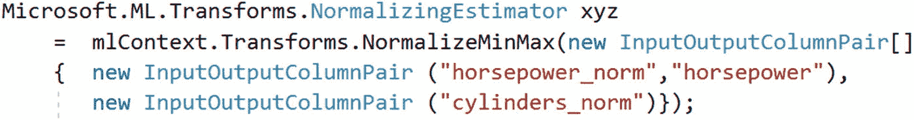
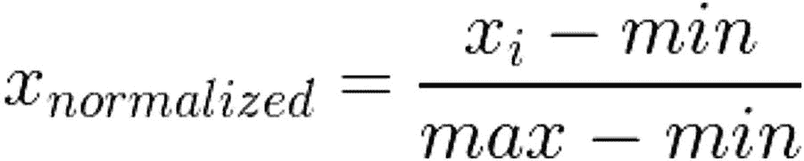
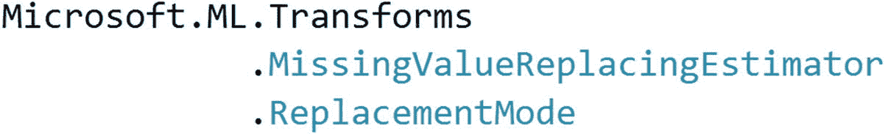

# 三、处理数据


## 介绍

现实世界中普遍可用的数据还不能用于机器学习活动。下图描绘了一个粗糙但真实的类比。


图 3-1

显示数据转换类比

不管你觉得这个类比有多好笑，这是真的。野外可用的数据需要反复修改，然后才能输入到机器学习算法中；否则，算法的性能将受到严重影响，并且可能无法使用。

本章的主题是让你熟悉处理不同种类数据的一般做法，将这些数据转换成可以作为机器学习算法输入的东西。其中一些技术被很好地打包在 ML.NET 库中，所以您可以不用自己实现就能使用它。

在我们深入研究数据转换之前，我们必须知道有多少类型(大类)的数据可用。

## 本章的目标

阅读完本章后，你应该能够理解在将数据输入到机器学习模型之前转换数据的必要性。您还将学习如何对 ML.NET 提供的不同类型的数据使用几种转换，以及何时选择哪一种。

## 数据类型

数据有各种不同的类型。概括地说，这些是

*   数据

*   文本数据

*   分类数据

*   位置数据

*   日期和时间数据(有时也表示为时间序列数据)

*   像图像和视频等等

***数值数据***

顾名思义，数值型数据是指仅仅是数字的数据。整数和浮点数是数字，因此是数值数据。一个人的年龄、每周去当地超市的次数、某人给汽车加油的次数、周末在电影院的花费以及你的收入都是数字数据的例子。

***文字资料***

姓名、地址、带有国家代码的电话号码、电子邮件地址、评论、反馈消息、社交媒体网站上的评论、电影评论网站上的评论等等都是文本数据的示例。

***分类数据***

分类数据只是对预设列表的枚举。对于像我们这样熟悉编程的人来说，分类数据只是现实世界中枚举的一个化身。城市中街区的名称、性别(男/女)和邮政编码都是分类数据的例子。

文本数据和分类数据之间的基本区别在于，文本数据是一种自由形式，而分类数据可以采用许多预定义类别中的一个作为其值。

***位置数据***

顾名思义，位置数据不过如此；它是关于某人或某地的位置的数据，或者用经度和纬度表示，或者通过地理编码表示。也可以是一组坐标。

***日期时间数据***

关于某事件发生的日期和时间的数据。

## 数字数据的转换

可以对数字数据执行几种转换。所有这些转换的目标是使给定的一列或多列数值数据的数据介于 0 和 1 之间，这对于使用某种回归的机器学习算法的输入是理想的；否则，由于不同特征的不同尺度，模型可能被混淆，并且预测的结果将是错误的，比可接受的情况更多。

表 3-1

显示了在 ML.NET 可用的不同的归一化估计量

<colgroup><col class="tcol1 align-left"> <col class="tcol2 align-left"></colgroup> 
| 

**转换**

 | 

**封装为**

 |
| --- | --- |
| **均值归一化** | `Transforms.NormalizeMeanVariance` |
| **对数均值归一化** | `Transforms.NormalizeLogMeanVariance` |
| **单位定额归一化** | `Transforms.NormalizeLpNorm` |
| **全局对比度标准化** | `Transforms.NormalizeGlobalContrast` |
| **密度归一化** | `Transforms.NormalizeBinning` |
| **密度归一化** | `Transforms.NormalizeSupervisedBinning` |
| **重新缩放(最小-最大归一化)** | `Transforms.NormalizeMinMax` |

在所有这些标准化中使用的策略是通过平均值(或任何其他度量)抑制/(减去)输入，然后通过任何其他值的方差来标准化抑制值，如`NormalizeMinMax`情况下的最大值。

所有这些标准化方案本质上都是一个估计器，它将输入数据转换为转换后的数据作为`IDataView`。

所有这些函数都有两个重载:一个接受一个数组`InputOutputColumnPair`，这样您可以传递几个列名来在一次调用中运行转换。否则，您可以对单个列运行一次规范化，然后使用`Append`方法在流水线中获得下一个可能的转换。



图 3-2

展示了如何调用一个规范化的估计量

有一点需要注意，尽管类型的名称是`InputOutputColumnPair`，但是构造函数的参数以相反的顺序取列名。传递的第一个字符串将用作输出列的名称，而第二个字符串表示要转换的输入列的名称。输入列名称是可删除的，如果删除，输出列的名称将用作输入列。

考虑规范化的一种方法是，它与阻尼相同。阻尼是一种物理过程，当外界不再施加力时，振荡的幅度随时间而减小。每一种归一化技术都可以被认为是阻尼因子与每个值相乘产生一个新值。

例如，一种非常常见的归一化技术是最小-最大归一化，其中每个值都受到以下因素的影响。从每个值中减去第一个最小值，然后将结果乘以阻尼系数`1/(max-min)`。



图 3-3

显示最小-最大归一化方程

在等式中， *x* <sub>*i*</sub> 是值，min 和 max 是列值的最小值和最大值。

## 分类数据的转换

机器学习算法更喜欢数字输入，将分类数据转换为数字输入的一种方法是对分类数据进行编码以生成向量。这是 ML.NET 所有可用的分类变换的列表。

表 3-2

展示 ML.NET 的范畴转换估计量

<colgroup><col class="tcol1 align-left"> <col class="tcol2 align-left"></colgroup> 
| 

**转换**

 | 

**封装为**

 |
| --- | --- |
| **一键编码** | mlContext。transforms . categorial . onehotencoding |
| **独热哈希编码** | mlContext。transforms . categorial . onehothasencoding |

### 一键编码

对分类变量进行编码有点棘手。将分类值转换为数值是很诱人的，因为假设机器学习模型处理数值。然而，这种技术会给模型增加偏差，因此结果预测将是错误的。假设我们有一个这样的数据集。

表 3-3

展示了一个样本数据集

<colgroup><col class="tcol1 align-left"> <col class="tcol2 align-left"></colgroup> 
| 

**类别选项 1**

 | 

**数字 1**

 |
| --- | --- |
| **答** | One point three four four |
| **B** | Three point four five |
| **M** | Zero point one three four |

如果我们使用标签编码，并为分类列中的每个类别分配一个数字标签，那么数据集将如下所示。

表 3-4

显示带有标签编码的相同数据集

<colgroup><col class="tcol1 align-left"> <col class="tcol2 align-left"></colgroup> 
| 

**类别选项 1**

 | 

**数字 1**

 |
| --- | --- |
| **1** | One point three four four |
| **2** | Three point four five |
| **3** | Zero point one three four |

但这样做的问题是，突然没有明显的原因，类别“M”会被认为是一个比类别“A”或“B”更好的类别。如果模型在内部执行 average，那么 1 和 3 的平均值(代表“A”和“M”)将是类别“B”，这没有任何意义。因此，我们需要转换这个数据集，将行更改为列，如下所示。

表 3-5

该表显示了应用于样本数据集的一次性编码的结果

<colgroup><col class="tcol1 align-left"> <col class="tcol2 align-left"> <col class="tcol3 align-left"> <col class="tcol4 align-left"></colgroup> 
| 

**Is_A**

 | 

**Is_B**

 | 

**Is_M**

 | 

**数字 1**

 |
| --- | --- | --- | --- |
| **1** | Zero | Zero | One point three four four |
| **0** | one | Zero | Three point four five |
| **0** | Zero | one | Zero point one three four |

如您所见，现在对于每个类别，我们都有一个列来表示该列在输入数据集中的存在。该列中的值 1 表示数据中存在该类别，值 0 表示不存在。因此，新创建的数据集中的第一行表示它代表类别“A”(热门类别，因为对于该类别我们有一个 1)。对于第二行，我们将 B 作为热门类别。由于在这个新创建的数据集中，每一行都将有一个类别被设置，而所有其他类别都没有设置，这就是所谓的“一键编码”

### 一次性哈希编码

这与热编码是一样的，但是在类别被热编码之前，它们被使用散列函数散列——因此，名称。有时，在分类数据中可能有相同数据的多个实例，直接使用一键编码将在结果数据中创建比所需更多的列，并将进一步混淆系统，而不是帮助它。在这种情况下，通常最好使用哈希函数为所有不同但相同的分类值生成相同的哈希代码。这种情况的一个例子是当我们的姓氏拼写略有不同。

## 文本数据的转换

文本数据不同于分类数据，尽管看起来可能相似。文本数据是作为列值捕获的自由格式文本，而分类数据是枚举的字符串表示。

下面是 ML.NET 所有可用的文本数据转换的列表。

表 3-6

显示了 ML.NET 提供的不同文本转换估计器

<colgroup><col class="tcol1 align-left"> <col class="tcol2 align-left"></colgroup> 
| 

**转换**

 | 

**封装为**

 |
| --- | --- |
| 惊吓文字 | 转变。文本。特征文本 |
| **记号标记词** | 转变。Text.TokenizeIntoWords |
| **TokenizeIntoCharacterAsKeys** | 转变。text . TokenizeIntoCharacterAsKeys |
| **规范化文本** | 转变。文本。规范化文本 |
| **生产雕刻图** | 转变。文本。生成图形 |
| **生产单词包** | 转变。Text.ProduceWordBags |
| **制作哈希图** | 转变。Text . ProduceHashedNgrams |
| 删除 DefaultStopWords | 转变。Text . RemoveDefaultStopWords |
| **删除停用词** | 转变。Text . RemoveStopWords |
| **潜伏期津贴** | 转变。Text.LatentDirichletAllocation |
| **应用程序嵌入** | 转变。文本.应用程序嵌入 |

以下是一些转换的简要细节。

***featurezetext***:这个估算器将给定的输入文本转换成一个表示文本的浮点数向量。它接受一个列名，并发出一个浮点数列表，表示该列描述的特性。

***规格化文本*** :规格化文本可能意味着改变文本的大小写，删除标点和数字等等。和解需要规范文本。对文本执行标准化的示例如下所示:

“塞缪尔 2345。”和“塞缪尔 1123；”规范化以删除数字和标点符号，小写字母为“samuel”。地址和姓名的协调是一个相当大的挑战，这个估计器将有所帮助。

这是另一个正常化的例子；这一次，我们删除了空格和所有标点符号，并将大小写改为大写。

“abc def 1234”会变成“abcdef 1234”；“abd cef 1234”也会

## 关于数据处理、清理和扩充的思维导图


图 3-4

数据清理

俗话说，一幅图胜过 1000 个单词，人们很容易迷失在这些不同功能的文献中，更不用说记住了。接下来的部分试图通过一些图片给你一些视觉上的线索，这些图片可能会引起你的共鸣，并比简单的文字解释更长久地留在你身边。好的类比真的很难得到；但事实证明，在试图理解困难/新概念时，它们非常有用。这里有一些关于处理数据的不同技术的类比。

简而言之，处理数据分为四个主要的不同类别。

表 3-7

显示了处理数据的不同大类

<colgroup><col class="tcol1 align-left"> <col class="tcol2 align-left"></colgroup> 
| 

**操作类别**

 | 

**目的**

 |
| --- | --- |
| **归一化** | 为了使回归算法的每个数据点都在相同的范围内 |
| **移除** | 删除坏数据点 |
| **特征化** | 创建数据的数字表示 |
| **缺失值处理** | 增加缺失的值 |

### 正常化


图 3-5

显示用于标准化的图示思维导图图像

正常化几乎类似于劈柴。“大小不重要”这句谚语不适用于特征量级。打个比方，你可以想象你想输入到你的机器学习算法中的问题领域的特征，就像用在栅栏中的木头一样。如果你的一些木头比其他的太大或太小，栅栏就不能很好的支撑，或者一开始就不可能建造。类似地，在机器学习设置中，如果特征的尺度/幅度与其他特征相差甚远，那么基于回归的机器学习模型可能会非常混乱，并可能导致错误/错误的决策。

正确的归一化总是将特征的比例缩小到 0 和 1 之间。并且通常归一化适用于具有量值的数值数据。以下是应用最小-最大归一化前后的示例:

```cs
Before (Input) => 1000,2000,1350,2400,1840,1230
After    (Output) => 0, 0.4166667, 0.1458333, 0.5833333, 0.35, 0.09583333

```

如您所见，输入中的所有值都被规范化为 0 到 1 之间的值。

### 消除


图 3-6

显示用于移除不良数据的图示思维导图图像

删除数据就像修剪草坪一样。你只需要从你的数据中剔除无用的杂草(如果你愿意的话)。有时，需要从文本数据中删除的可能是坏词(也称为停用词)。有时可以从文本数据中删除标点符号或特殊字符或数字。从数据中删除不需要的数据(也称为噪声)会使数据保持适合机器学习算法使用的形式。

有时，删除是在将文本数据转换为数字表示之前对其执行的准备步骤，之后这些数字表示可以被规范化。正如你在本章中看到的，ML.NET 提供了相当多的功能来从数据(主要是文本数据)中删除这些东西。

除了搜索引擎，没有其他地方可以如此有效地使用停用词删除(作为一种特殊形式的删除技术)。为了证明停用词(在人类语言的每个上下文中比其他词出现得更频繁的词，根据信息论，使它们最不相关)在搜索中不重要，我使用这两个短语“印度首都”和“印度首都”进行了搜索。“of”这个词在英语中是一个停用词，因为它几乎出现在任何地方，而不考虑上下文，因为它是一个粘合词。因此，这个想法是为了表明，如果这些停用词被删除，机器学习算法不会受到影响；如果这些词保持原样，他们可能会感到困惑。

图 [3-7](#Fig7) 显示了“*首都****印度*”和“*首都印度*”的搜索结果。**

 **

图 3-7

并排显示结果，以表明停用字词不会影响搜索结果

你可以看到停用词不会对机器学习算法的结果产生任何影响。因此，那些可以安全地被丢弃。

### 特征化


图 3-8

展示了一个象征特色化的示例词云

特征化就像给原始数据赋予一个数值。除非我们能做到这一点，否则就不可能使用任何机器学习算法，而且从原始数据中提取特征的技术本身就是一门全新的学科。*字云*是一个非常好的方式，为什么特化*真的是*创建一个*记忆图谱*。就像在词云中一样，我们给每个词一个数字(最常见的是出现的频率)；类似地，我们可以为所有类型的数据创建数字表示，这就是特征化的全部内容。

如您所见，`FeaturizeText`方法返回一个表示文本的浮点数向量。这是一个很好的例子，说明了特征化可以对除了原始内容(文本数据中的字符串)和长度之外似乎没有任何特征的数据做些什么。

特征化的好处是多方面的。第一个是，与世界上其他看似相似的东西相比，它真的很有帮助。与通过*余弦相似度*或任何其他相似性度量来理解在`N`维度上表示这两个符号化字符串的两个向量的接近度相比，逐字符比较两个字符串的接近度在计算上要复杂得多。这也有另一个好处，这样，算法变得可扩展。

### 处理缺失值


图 3-9

数据集中缺失值的代表性图像

当试图清理可用于机器学习算法的数据时，丢失的值是真正的挑战，因为丢失的值很难合理地填充，如果让它们留下，模型的性能可能会非常糟糕。

有几种策略可以处理缺失数据。它们可以大致分为两个不同的类别:

1.  增加缺失数据

2.  删除丢失数据的行/列

补充缺失的数据是一项困难的任务，主要是因为很难假设什么可能是一个好的替代品。有办法一瘸一拐地用列类型的`Maximum`、`Minimum`或者`Default`来代替。ML.NET 也在`ReplacementMode`中列举了这些。



图 3-10

显示处理缺失数据的估计量

如果缺少值的列是数字，那么我们可以使用均值、中值、众数甚至极值(最大值或最小值)。然而，用一个值替换它的决定将影响性能，并且由于一个建议并不适用于所有情况，所以需要进行试错分析，以查看哪个丢失值替换策略工作得最好。

对于分类列中缺失的值，最好用一个特殊值来标记它，然后使用`OneHotEncoder`。

## 选择正确变压器/估算器的便捷指南

俗话说，如果你只有一把锤子，那么所有的问题都会像钉子一样。

找到要使用的正确函数，对您的数据做正确的事情是一件非常具有挑战性的事情。表 [3-8](#Tab8) 试图缓解这一点。

表 3-8

找到处理数据的正确方法的小备忘单

<colgroup><col class="tcol1 align-left"> <col class="tcol2 align-left"> <col class="tcol3 align-left"></colgroup> 
| 

**类别**

 | 

**哪个例子最能描述您的情况**

 | 

**使用哪个功能**

 |
| --- | --- | --- |
| **正常化** | 我的要素具有巨大的比例差异。这里有一个例子:一列是卧室的数量:1-10，另一列是房价“100000-1000000 美元” | 使用任何标准化技术，如`NormalizeMinMax` |
| **移除** | 我有很多像“如果”、“的”、“为”等粘合词的文本数据。 | 移除停用字词 RemoveDefaultStopWords |
| **特征化** | 我有一堆电影评论，我想确定它们在情感上有多接近 | 特征文本 |
| **正常化** | 我有一堆分类数据。我如何把它们转换成数字 1？ | 不要。使用`OneHotEncoding` |
|   | 我有一堆单词，我想从这些单词中提取语法。Ngram 只不过是给定字符串上给定大小的移动窗口产生的子字符串列表。所以对于字符串“ABCD”和移动窗口大小为 2，Ngram 会产生[“AB”、“BC”、“CD”] | 向标记化 |
|   | 我有一堆语法，我想把这些语法具体化 |   |
|   | 我对同一个人有几个不同的地址。所有这些地址几乎都是一样的，我需要将它们协调成一个 |   |
| **缺失值** | 我需要标记丢失的值 | 指示缺失值 |
|   | 我需要用最小值/最大值/默认值填充缺失值 | missingvaluereplacingestomator |
|   | 我需要用自定义值填充缺失的值 | 自定义映射 |

## 摘要

在本章中，您学习了 ML.NET 提供的几种数据处理和清理技术。然而，这里的讨论仅限于在机器学习任务中遇到的最常见的数据类型，即数值和分类数据类型。ML.NET 为图像处理、深度学习和时间序列数据类型提供了其他几个数据转换任务。这些都被故意排除在本章之外，但我希望本章能让你了解 glued 在数据转换和清理方面提供的本质，以及如何使用本书前面讨论的相同的估计器、估计器链和拟合方法将这些整合在一起。

ML.NET 还提供了加入和删除列的功能以及其他相关功能，但是由于这些功能在本书中已经使用过，并将在接下来的章节中继续出现，所以为了让你不至于厌烦，这里不再展示了。**