# 四、回归

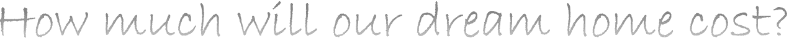

## 介绍

有没有想过如何预测未来几个月的汽油价格？货币的预计汇率是如何确定的？这些问题的关键是预测一个连续范围内的值的能力。解决这些问题的算法被称为*回归算法*。回归这个名字表明这些算法本质上大多是迭代的。这与分类不同，因为在分类中，我们需要预测两个值中的一个(在二进制分类的情况下)或许多标签中的一个(在多类分类的情况下，一组有限标签)。另一方面，在这些情况下，预测值必须是真实值，这就是回归。在本章中，你将学习 ML.NET 提供的几种回归算法，以及如何衡量这些算法的性能。在一些文献中，这些算法被称为曲线拟合算法。

## 目标

本章结束时，你应该能够识别哪些问题属于回归类型的问题，并使用 ML.NET 提供的众多回归训练器中的一个来解决它们。您还可以根据几个性能监控指标来评估算法的表现。

Note

出于本书的目的，术语“培训师”和“算法”在 ML.NET 上下文中可以互换使用。

### 回归做什么？

简单回归是在一条线上拟合几个点的过程。当我们想出的线非常接近大多数点时，这个解决方案被认为是好的。如果线“错过”许多点，我们说解决方案不好。然而，两者都有缺点。当输入中几乎所有的点都位于预测的外推(输入数据中不存在但已投影的线)线上时，我们猜测我们可能已经为模型提供了太多线索，因此模型成为了一个神谕，给出输入数据集中所有点的精确答案。这种情况被称为*过拟合*，相反当几乎没有点到达预测外推线时，我们称之为*欠拟合*。

回归算法尝试在查看其他值的同时预测数据集的参数值。与标注可以取两个值(二元分类)或多个值(多类分类)的分类不同，在回归分析中，预测值始终是一个实数值。

在回归问题的最简单的情况下，我们将有一个已知的参数(例如，房子的卧室数量)和一个我们想要预测的值(房子的价格)。要做到这一点，算法必须得出一个公式——一个等式，通过设置已知参数(卧室)，您将获得值(价格)。合乎逻辑的预期是，房子的卧室越多，价格就越高。所以这个关系的公式可以如下。

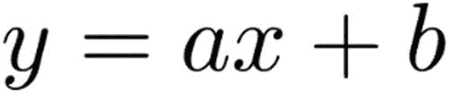

图 4-1

显示最简单回归的方程式

在现实生活中，我们通常有不止一个参数影响我们寻找的值。对于房价，其他参数可以是邻居的安全指数、总地毯面积、房产的年龄等。在这种情况下，方程将是这样的。

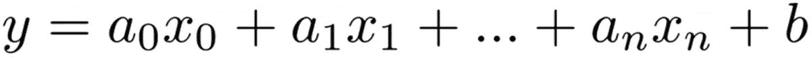

图 4-2

一般线性回归

因此，回归算法/模型的任务是发出输入变量的系数或权重。这仍然是*线性回归*，因为曲线的性质是直线。然而，有时一个线性模型是不够的，然后下面的通用方程描述了非线性回归模型，也称为*多项式回归*。

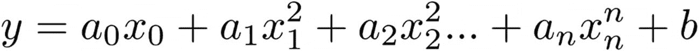

图 4-3

多项式形式

其中 b 也称为正则项。

## 预测汽车的 MPG(每加仑英里数)

买车时，人们通常会考虑的一个参数是 MPG(每加仑燃油行驶里程)值。更高的 MPG 意味着在所有其他条件相同的情况下，一辆车比其他车更值钱。在这个实验中，我们将看到如何使用`Model Builder`向导找到最佳回归算法来预测数据集的 MPG 值。


图 4-4

给汽车加油的典型图像

在这个实验中，你将看到如何用回归分析来预测一辆二手车的每加仑行驶里程。你可以从 [`www.kaggle.com/uciml/autompg-dataset`](http://www.kaggle.com/uciml/autompg-dataset) 得到数据。

数据如图 [4-5](#Fig5) 所示。

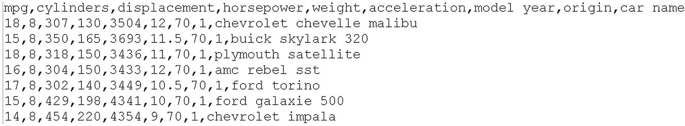

图 4-5

显示 mpg 数据集中的几行

我们将使用模型生成器向导来获得一个正常工作的模型。按照以下步骤获得它:

***第一步*** :在 Visual Studio 中，将机器学习添加到一个已有的控制台 app 项目中(图 [4-6](#Fig6) )。

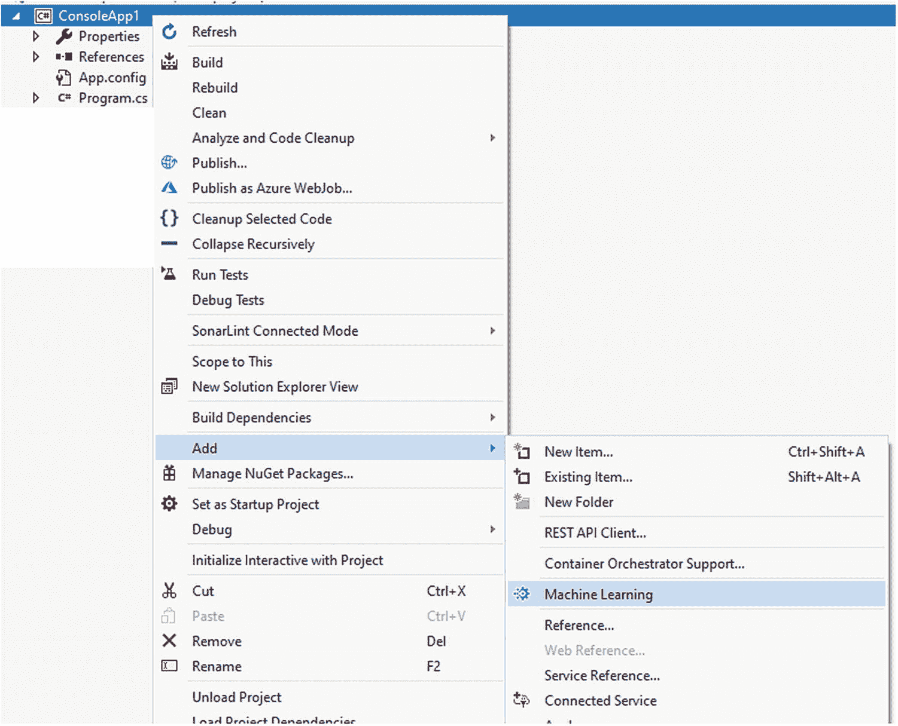

图 4-6

显示将机器学习添加到现有项目的提示

***第二步*** :选择回归的场景(数值预测)(图 [4-7](#Fig7) )。

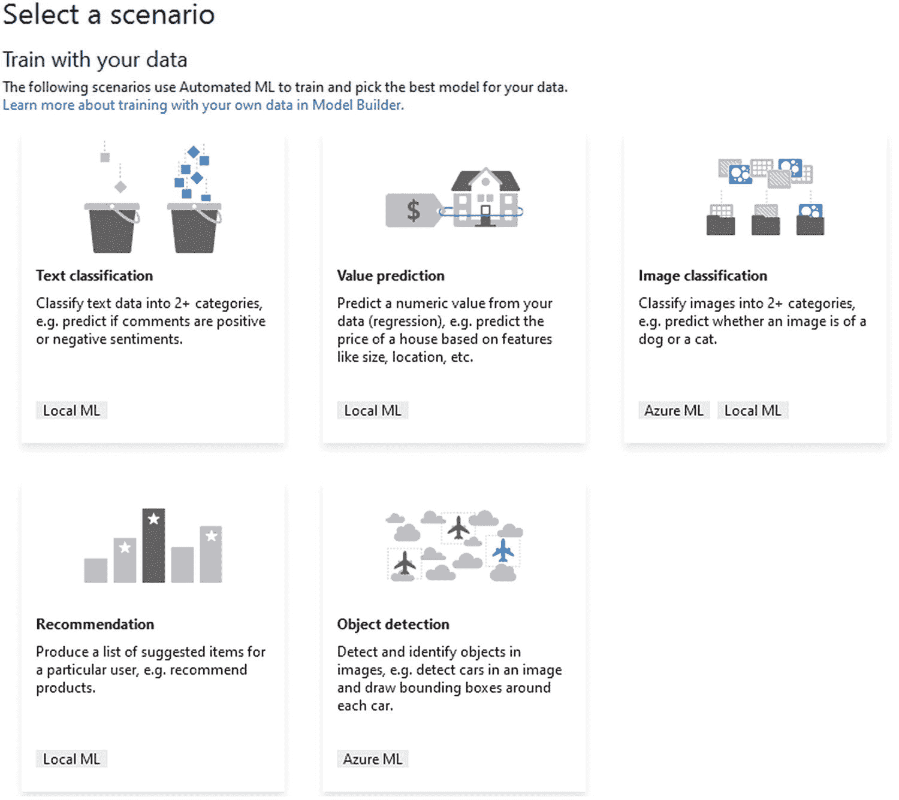

图 4-7

选择“价值预测”

***第三步*** :选择文件训练模型(图 [4-8](#Fig8) )。

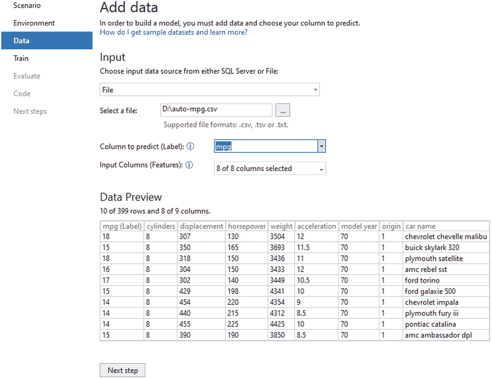

图 4-8

显示加载的训练数据

***第四步*** :开始训练。在 Model Builder 中，离开培训阶段的时间越长，效果越好(我建议至少 2 分钟)。官方文件是这样写的。

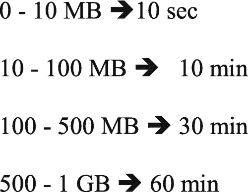

图 4-9

微软培训所需的建议时间

尽管文档中建议的时间是 10 秒，但我还是建议将训练时间延长到 2 分钟左右(这是我的个人经验，可能会因您的 PC 硬件而异)，因为这为找到最佳算法提供了时间。

***第五步*** :程序(模型构建器向导)运行时，会显示执行的状态(进度)(图 [4-10](#Fig10) )。

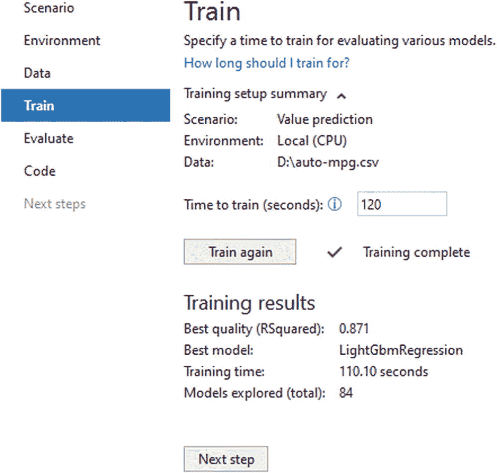

图 4-10

培训的最终结果

最后，程序会报告最终性能以及该数据集的最佳算法/模型。

***第六步*** :查看向导提供的评估报告(图 [4-11](#Fig11) )。

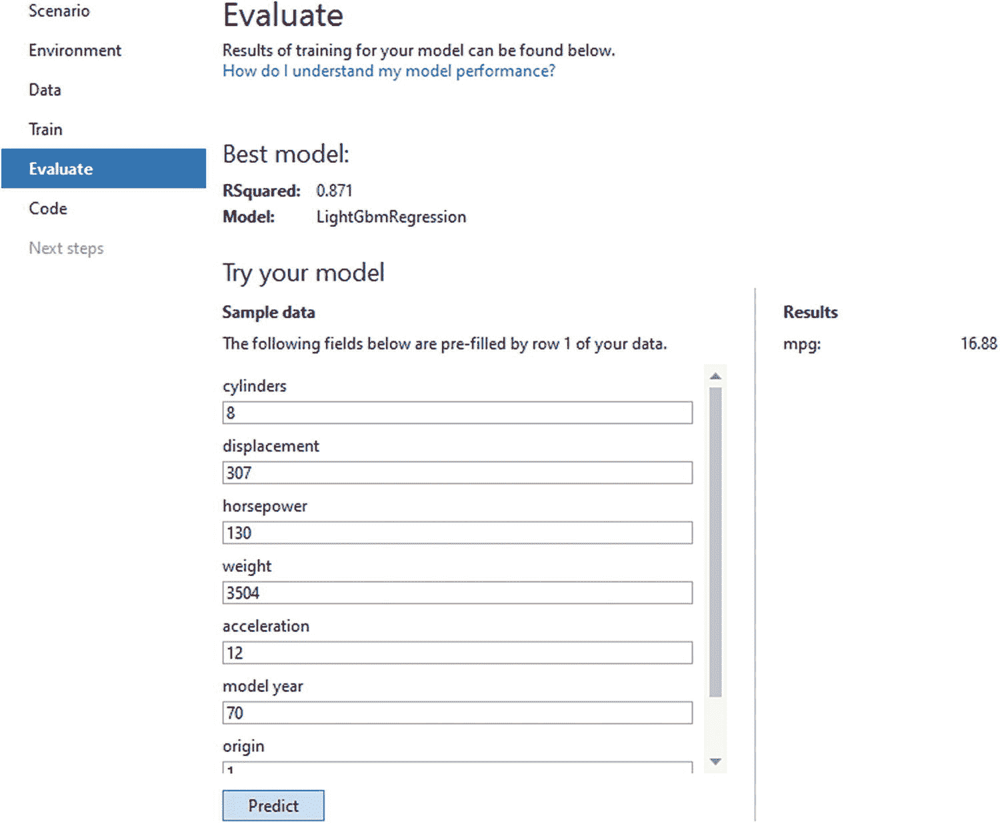

图 4-11

评估模型

这里的评估表显示了该模型的几个性能测量指标。

***第七步*** :生成的代码会自动添加到宿主解决方案中。

***第 8 步*** :当前版本的 ML.NET 提供了一种方法来阅读更多内容并将模型部署为 ASP.NET 服务。

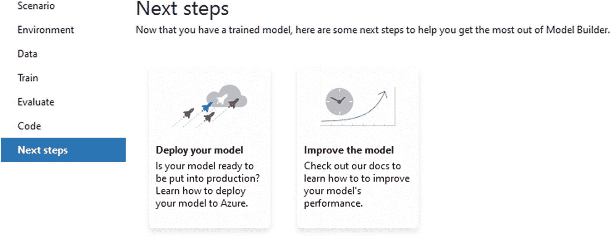

图 4-12

后续步骤向导

***第九步*** :看生成的代码。

如果您选择添加生成的项目，向导将向解决方案添加几个项目，如图 [4-13](#Fig13) 所示。

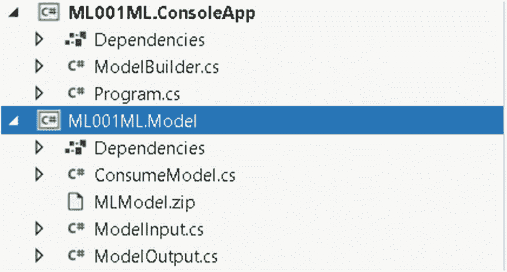

图 4-13

添加到现有解决方案中的自动生成的代码

`ML.Model`项目包含表示一行输入数据(`ModelInput.cs`)和预测`ModelOutput.cs`的类型。下面是这两个生成的类型(清单 [4-1](#PC1) 和 [4-2](#PC2) )。

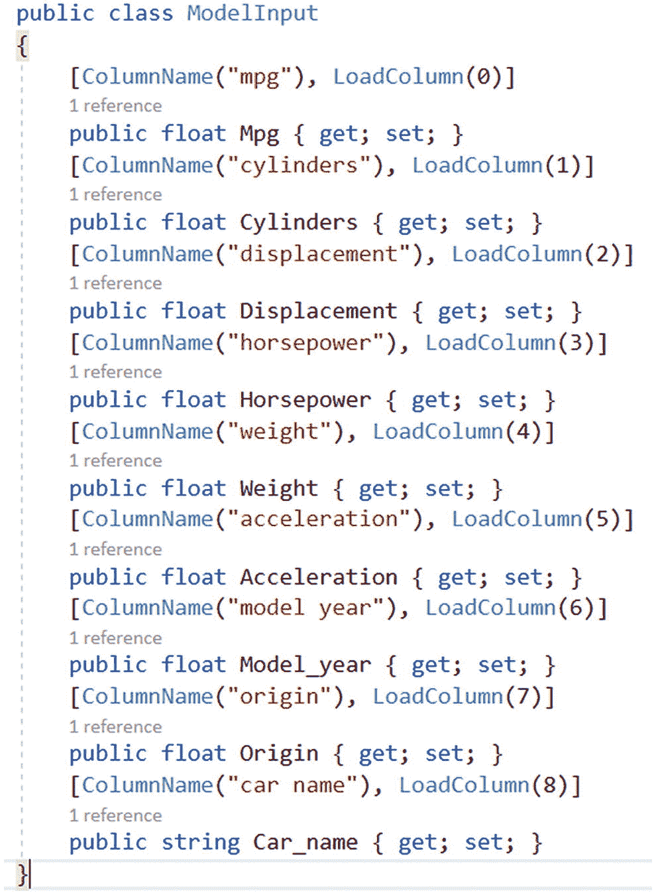

```py
data

Listing 4-1Generated ModelInput.cs

that represents one row of the input 

```

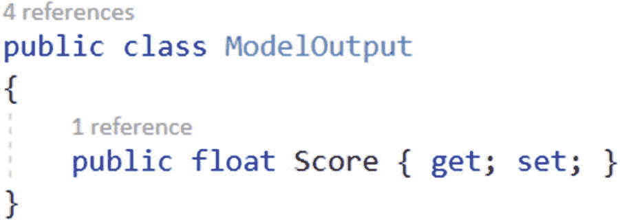

```py
model

Listing 4-2Showing the type to represent the output of the 

```

请注意，由于回归模型的输出是真实值，因此属性分数代表了真实值。

### 代码走查

神奇的事情发生在`BuildPipeline`方法中。下面是经过一点格式化后的代码，以使其更具可读性(清单 [4-3](#PC3) )。

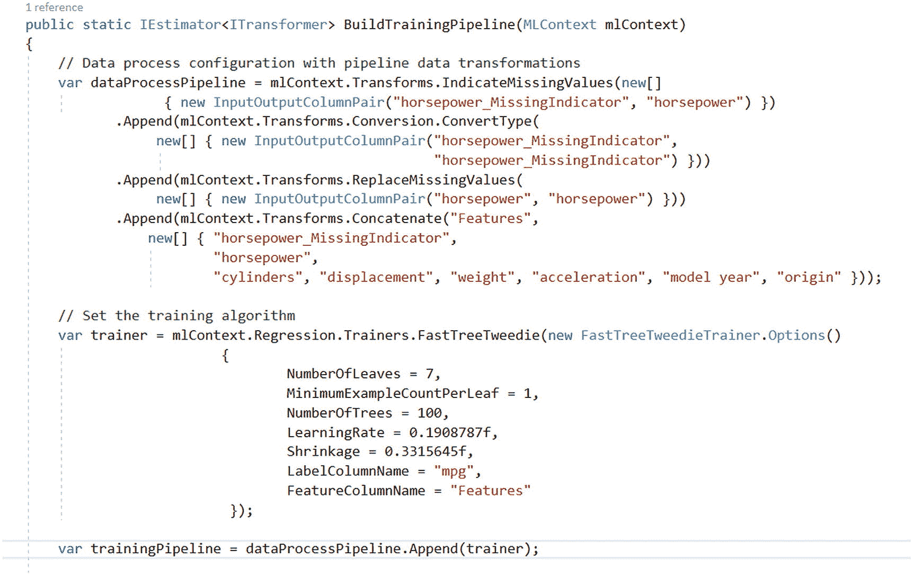

```py
built

Listing 4-3Showing how the pipeline is being 

```

model 模型生成器向导确实做了相当令人印象深刻的工作。它不仅创建了模型，还生成了对未来的程序员来说可读性和可维护性很高的代码，否则这些程序员可能会摸不着头脑。我必须承认，对于生成的代码，ML.NET 生成的代码看起来真的很好。

“马力”一栏有一些缺失值，ML.NET 发现了这一点，并应用了一些变换:

*   `IndicateMissingValues`:将“马力”栏标记为缺失值

*   `ReplaceMissingValues`:用预定义值替换缺失值

在流水线的末端，使用了`FastTreeTweedie` trainer，如果有许多零或缺失值，它会执行得很好。

## 预测波士顿郊区的房价

在下面的实验中，你将学习使用 ML.NET 预测波士顿郊区房价的步骤。这个例子可能是一个玩具，但是学习可以转移到一个更适合生产的环境中。


图 4-14

波士顿代表性鸟瞰图

波士顿住房数据集来源于美国人口普查局收集的马萨诸塞州波士顿地区的住房信息。下面描述了数据集列(该列表摘自 Kaggle 上的描述):

*   ***CRIM*** :各城镇人均犯罪率

*   ***ZN***:25，000 平方米以上地段的住宅用地比例。制成

*   ***印度河*** :每镇非零售商业亩数比例

*   ***CHAS*** :查理斯河哑变量(1 如果 tract bounds river 否则为 0)

*   ***NOX*** :氮氧化物浓度(百万分之一)

*   ***RM*** :每个住宅的平均房间数

*   **:1940 年前建成的自住单位比例**

***   ***DIS*** :到波士顿五个就业中心的加权距离

    *   **:放射状公路可达性指标**

    ***   ***税*** :每万美元的全价值财产税税率

    *   ***PTRATIO*** :各城镇的师生比

    *   ***b***:1000(Bk-0.63)^2 其中 bk 是按城镇划分的黑人比例

    *   ***LSTAT*** : %人口的下层社会

    *   ***MEDV*** 以 1000 美元为单位的自有住房的中值**** 

 ****这一次我们将不使用模型构建向导，而是手工编码我们的模型，一次更换一个教练。

***第一步*** :新建一个控制台项目。

***第二步*** :创建下面的类`BostonHouse.cs`(这是模型输入)。

```py
   public class BostonHouse
    {
        /// <summary>
        /// CRIM - per capita crime rate by town
        /// </summary>
        [LoadColumn(0), ColumnName("crim") ]
        public float CRIM { get; set; }
        /// <summary>
        /// proportion of residential land zoned for lots over 25,000 sq. ft.
        /// </summary>
        [LoadColumn(1), ColumnName("zn")]
        public float ZN { get; set; }
        /// <summary>
        /// proportion of nonretail business acres per town
        /// </summary>
        [LoadColumn(2), ColumnName("indus")]
        public float INDUS { get; set; }
        /// <summary>
        /// Charles River dummy variable (1 if tract bounds river; 0 otherwise)
        /// </summary>
        [LoadColumn(3),ColumnName("chas")]
        public float CHAS { get; set; }
        /// <summary>
        /// nitric oxides concentration (parts per 10 million)
        /// </summary>
        [LoadColumn(4), ColumnName("nox")]
        public float NOX { get; set; }
        /// <summary>
        /// average number of rooms per dwelling
        /// </summary>
        [LoadColumn(5), ColumnName("rm")]
        public float RM { get; set; }
        /// <summary>

        /// proportion of owner-occupied units built prior to 1940
        /// </summary>
        [LoadColumn(6), ColumnName("age")]
        public float Age { get; set; }
        /// <summary>
        /// weighted distances to five Boston employment centers
        /// </summary>
        [LoadColumn(7), ColumnName("dis")]
        public float DIS { get; set; }
        /// <summary>
        /// index of accessibility to radial highways
        /// </summary>
        [LoadColumn(8),ColumnName("rad")]
        public float RAD { get; set; }
        /// <summary>
        /// full-value property-tax rate per $10,000
        /// </summary>
        [LoadColumn(9), ColumnName("tax")]
        public float TAX { get; set; }
        /// <summary>
        /// pupil-teacher ratio by town
        /// </summary>
        [LoadColumn(10) , ColumnName("ptratio")]
        public float PTRATIO { get; set; }
        /// <summary>
        /// 1000(Bk - 0.63)^2 where Bk is the proportion of blacks by town
        /// </summary>
        [LoadColumn(11), ColumnName("b")]
        public float B { get; set; }
        /// <summary>
        /// % lower status of the population
        /// </summary>
        [LoadColumn(12), ColumnName("lstat")]
        public float LSTAT { get; set; }

        [LoadColumn(13), ColumnName("medv")]
        public float Medv { get; set; }
    }

Listing 4-4ModelInput for Boston housing problem

```

***第三步*** :创建下面的类 BostonHousePrice.cs(这是模型输出)。

```py
public class BostonHousePrice
{
     public float MEDV { get; set; }
}

Listing 4-5ModelOutput for Boston housing problem

```

***第四步*** :在 Program.cs 中添加以下几行

```py
//change your path accordingly
string DATA_FILEPATH = @"C:\MLDOTNET\housing.csv";
MLContext context = new MLContext(seed: 1);

IDataView trainingDataView = context.Data.LoadFromTextFile<BostonHouse>(
                                            path: DATA_FILEPATH,
                                            hasHeader: true,
                                            separatorChar: ',',
                                            allowQuoting: true,
                                            allowSparse: false);

var pipeLine = context.Transforms.NormalizeMinMax("crim", "crim")
                .Append(context.Transforms.NormalizeMinMax("zn", "zn"))
                .Append(context.Transforms.NormalizeMinMax("indus", "indus"))
                .Append(context.Transforms.NormalizeMinMax("chas", "chas"))
                .Append(context.Transforms.NormalizeMinMax("nox", "nox"))
                .Append(context.Transforms.NormalizeMinMax("rm", "rm"))
                .Append(context.Transforms.NormalizeMinMax("age", "age"))
                .Append(context.Transforms.Concatenate("Features",
                "crim", "zn", "indus", "chas", "nox", "rm", "age"));
            // Set the training algorithm
var trainer = context.Regression.Trainers.Sdca(labelColumnName: "medv");
var trainingPipeline = pipeLine.Append(trainer);

var model = trainingPipeline.Fit(trainingDataView);
var engine = context.Model

    .CreatePredictionEngine<BostonHouse, BostonHousePrice>(model);

var input = CreateSingleDataSample(DATA_FILEPATH);
var result = engine.Predict(input);

Console.WriteLine($"Actual MEDV is {sampleData.Medv}");
Console.WriteLine($"Predicted MEDV is {result.Medv}");

Listing 4-6Consuming the Boston housing price prediction regression model

```

这会产生以下输出:

```py
Actual MEDV is 24
Predicted MEDV is 26.32589

```

这个程序在数字列上使用`NormalizeMinMax`转换。

## 性能指标

所有性能指标都可以在`Microsoft.ML.Data`名称空间的`RegressionMetrics`类中获得，如图 [4-15](#Fig15) 所示。

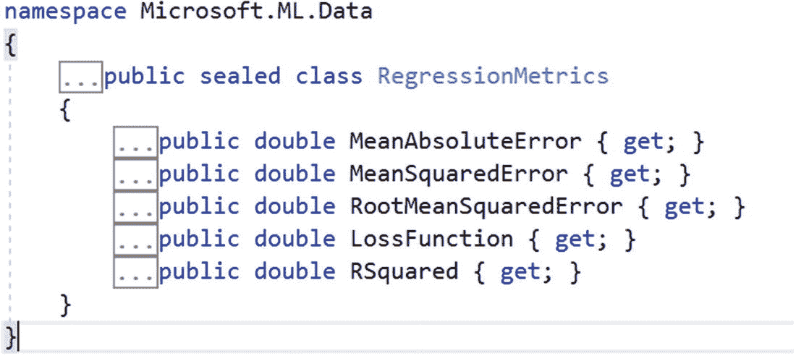

图 4-15

显示评估矩阵

**R 平方**是代表回归模型拟合优度的统计度量。r 平方的理想值是 1。R-square 的值越接近 1，模型拟合得越好。该指标在`ML.Data`中以“`RSquared”`的形式提供。

R-square 是残差平方和 *(* `SSres` *)* 与总平方和 *(* `SStotal` *)* 的比较。通过数据点和平均线之间的垂直距离的平方和计算总平方和(图 [4-16](#Fig16) )。

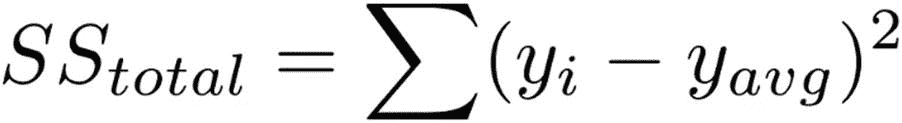

图 4-16

平方和方程

残差平方和通过数据点和最佳拟合线之间的垂直距离的平方和计算得出(图 [4-17](#Fig17) )。

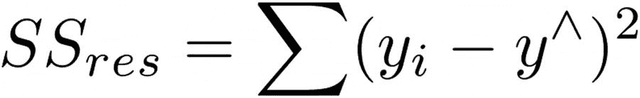

图 4-17

总方程的剩余和

将这些结合在一起，R 平方由图 [4-18](#Fig18) 所示的公式给出。

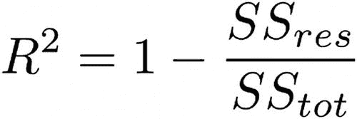

图 4-18

r 平方方程

如果 R 平方误差的值接近 1，那么回归取得了良好的结果。

## 均方误差

这是实际值和预测值之差的平均值。因为正方形，所有的底片都被打湿了。换句话说，由于平方，负值变成正值，这允许跟踪累积的差异。因此，要考虑误差的实际幅度。

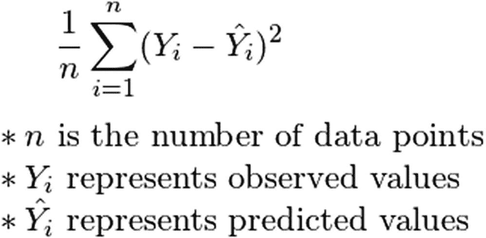

图 4-19

均方误差方程

## 均方根

顾名思义，就是预测值和实际值的均方差的根。这是进一步衰减或规则化的误差，并且通常为获得更多误差留下更少的空间。这种错误使大错误不会混淆模型。

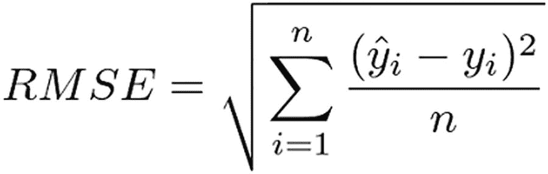

图 4-20

均方根误差方程

## 归一化均方根

这种误差度量对于在不同尺度上具有特征的几个模型的比较非常有用。这在 ML.NET 并不容易得到，但是从公式中可以看出，这可以很容易地计算出来(图 [4-21](#Fig21) )。

<colgroup><col class="tcol1 align-left"> <col class="tcol2 align-left"></colgroup> 
| 

回归训练器

 | 

封装为

 |
| --- | --- |
| **快速树** | 回归。运动鞋。快速树 |
| **快速森林** | 回归。运动鞋。法斯特福里斯特 |
| **快树花呢** | 回归。运动鞋。FastTreeTweedie |
| **广义可加模型** | 回归。运动鞋。Gam |
| **有限内存 BFGSPoissonRegression** | 回归。培训师. LbfsgPoissionRegression |
| **在线梯度下降** | 回归。运动鞋。OnlineGradientDescent |
| **Sdc** | 回归。培训师。Sdca |

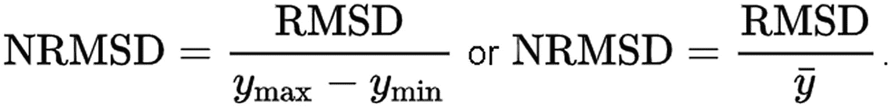

图 4-21

NRMSD 方程

### 使用回归改善日常生活的想法

根据你离家的时间来预测到达工作/学校的时间。

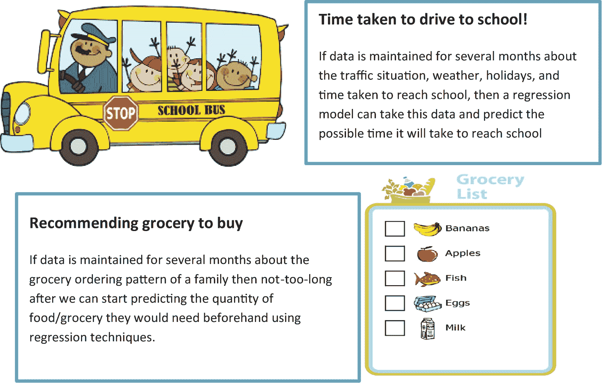

## 摘要

在本章中，您已经学习了如何使用 model 进行回归，以及如何检查到达的模型的性能。在下一章，你将学习 ML.NET 提供的分类算法。我希望这一章让你有足够的动力去尝试不同的算法来解决工作/生活中的回归问题。****