# 五、分类


## 介绍

一个主要的监督机器学习类问题是通过从先前标记的数据中学习来从一组给定的事物中对事物进行分类。这就像谚语所说的“T0”从几个标签数据的例子中区分粉笔和奶酪“T1”。在这一章中，我们将通过一个分类问题的例子，并用 ML.NET 来解决它。

## 本章的目标

目的是让你对问题的分类类型有一个很好的理解，并介绍几个在 ML.NET 可用于这类问题的培训师/分类员。我将演示如何在 Model 模型构建器中解决分类问题，以及如何配置和使用分类训练器。

本章结束时，你应该能够将一个问题视为一个分类问题，并使用任何可用的分类器来解决它。您还应该能够评估分类器的性能，并在部署到生产环境之前根据需要进行调整。

## 分类类型

有两种类型的分类问题会在野外出现。当任务是用来自先前呈现的标记数据的两个可能的类别/类型中的一个来标记未知条目时，则该任务被称为*二进制分类*。另一方面，如果任务是预测模型的置信度，即未知条目可能属于许多不同类型中的哪一个，那么出于显而易见的原因，它被称为*多类分类*。

例如，预测每个图像中的动物是狗还是猫是二元分类的一个例子，而识别手写数字是 0 到 9 之一是多类分类问题的一个例子。正如您可能正确想象的那样，二进制分类是多类分类问题的推广，其中一个未知条目可能属于两种类型或类别。

## 数据术语

在所有的监督算法中，我们需要数据来训练系统，也需要数据来测试系统的性能。

**:用于创建预测结果的模型的数据**

 *****测试数据*** :用于检查模型性能的数据

理想情况下，训练和测试数据应该来源不同，不应该故意重叠。然而，大多数时候数据并不能用来测试系统的性能，在这些场合，人们可以使用一部分训练数据作为测试数据。这种训练和测试的分离通常被称为训练-测试-分离。

## 示例案例研究

在以下各节中，将介绍分类案例研究的几个实例。ML.NET 被用来设计解决方案。

使用 ML.NET 预测收入是否会超过 5 万美元。

任务是根据其他人口统计特征来预测一个给定的个人是否能够赚到超过 50K。数据可以从 [`https://archive.ics.uci.edu/ml/machine-learning-databases/adult/`](https://archive.ics.uci.edu/ml/machine-learning-databases/adult/) 下载。

以下是数据集的前几行(图 [5-1](#Fig1) )。

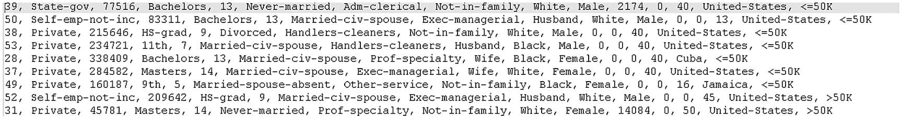

图 5-1

显示薪资隔离的原始数据

数据集没有头文件。标题在成人名称中可用，如图 [5-2](#Fig2) 中突出显示的框所示。

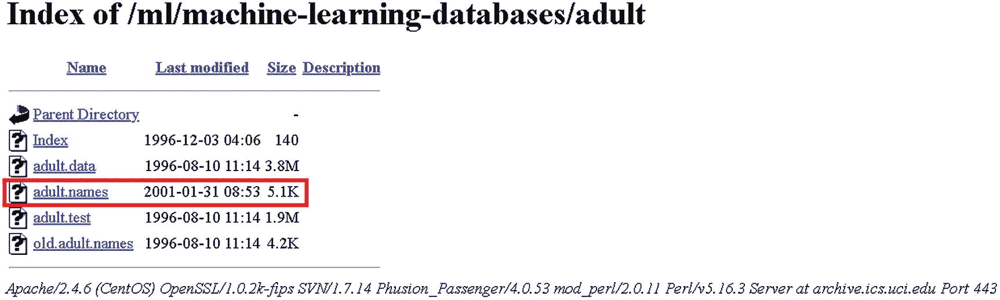

图 5-2

包含工资信息的数据集的下载页面

**成人.名字**文件的内容有头文件。这是标题。由于篇幅限制，我没有显示每一列的值或它们的类型。

*   年龄

*   工作类

*   fnlwgt

*   教育

*   教育-数量

*   婚姻状况

*   职业

*   关系

*   人种

*   性

*   资本收益

*   资本损失

*   每周小时数

*   母国

作为一个例子，数据集是非常有趣的，因为它有你想要的一切来尝试机器学习算法进行分类。它有丢失的数据(用“？”标记)符号)。在分类任务中，它很好地混合了数字和分类数据。对于需要规范化的数字变量，它有相当大的范围。它有许多分类列，需要进行几次一键编码。

在包含了标题之后，我将标题命名为“Salary ”,作为要预测的标签。

薪资的值可以是“ **< =50K** ”或“ **> 50K** ”。带有标题的前几行如图 [5-3](#Fig3) 所示。

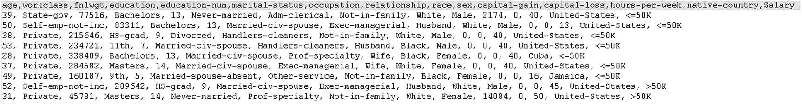

图 5-3

带有标题注释的薪金数据

该数据集以及标题现已可用于 ML.NET 模型构建器。下一节展示了如何将这些数据提供给 model builder，以获得学习系统的初始草图。

***第一步*** :在已有项目中添加一个机器学习(图 [5-4](#Fig4) )。

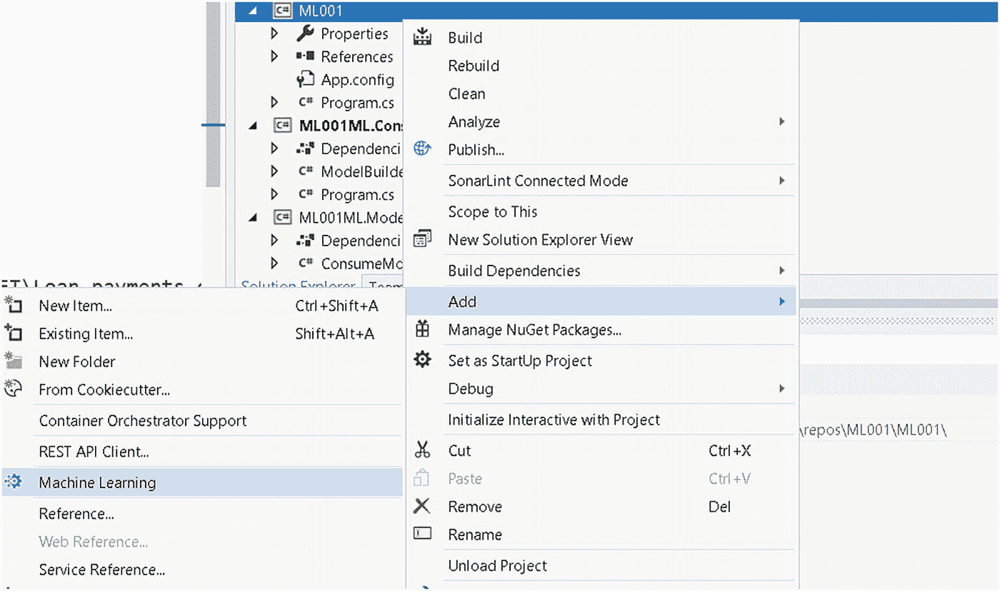

图 5-4

创建新的机器学习项目

***第二步*** :选择想要训练的场景。在这种情况下，您可以选择问题分类(图 [5-5](#Fig5) )。

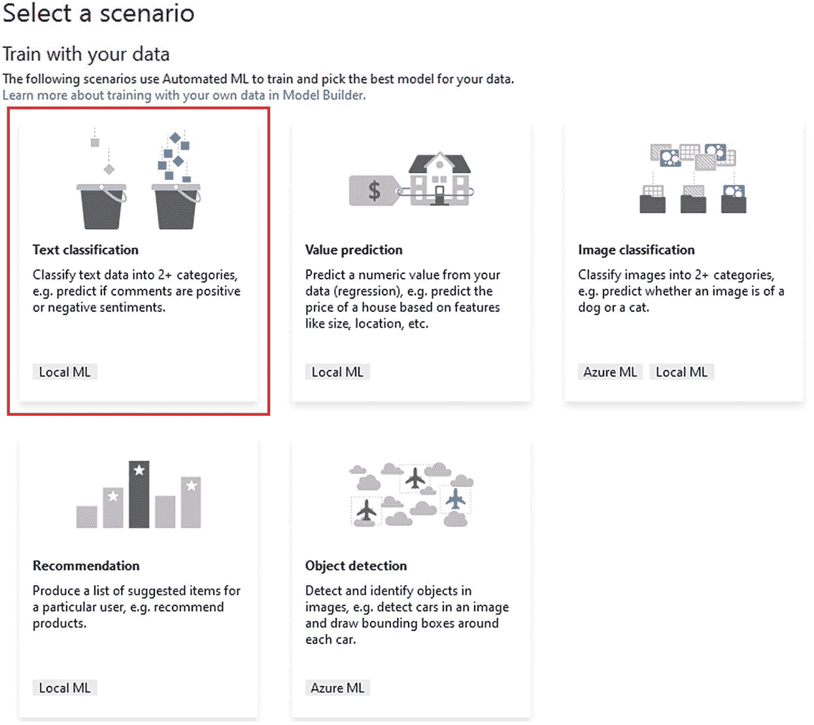

图 5-5

用于选择机器学习类型的界面

这里，我们选择问题分类，但是我们也可以选择情感分析，但是可以使用多类分类模型来训练识别只有两个可能标签的二进制数据集。所以这个选择很好用。

***第四步*** :定位要训练的文件(图 [5-6](#Fig6) )。

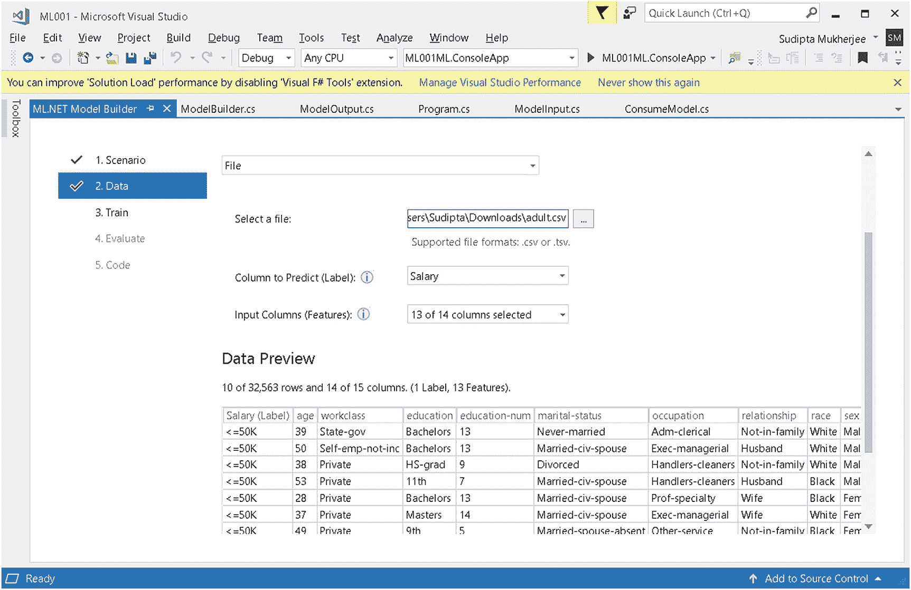

图 5-6

模型构建器向导中加载的数据(培训的配置窗格)

完成后，模型构建器将从所示文件中加载数据，然后您可以选择要使用哪些列来定型您的模型。

***第四步*** :让系统训练 2 分钟左右，点击“开始训练”按钮(图 [5-7](#Fig7) )。

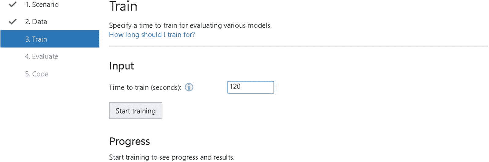

图 5-7

模型构建器向导中培训持续时间的配置

***第五步*** :等待系统训练，检查进度，如图 [5-8](#Fig8) 。

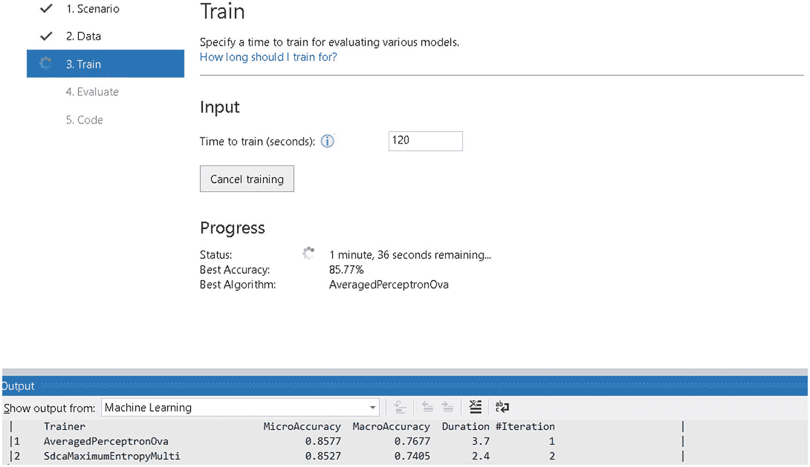

图 5-8

显示培训进度(仍在进行中)

模型生成器显示了迄今为止尝试过的分类器的性能。

一旦模型生成器成功完成运行，它将显示最终模型的结果，如图 [5-9](#Fig9) 所示。

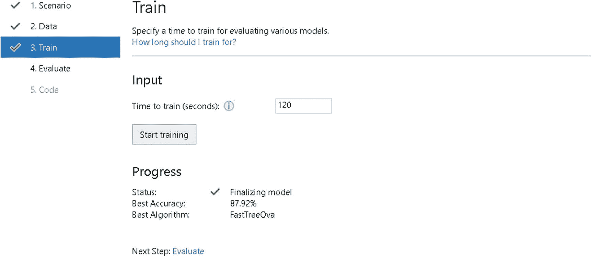

图 5-9

模型构建器向导评估的最终结果，显示了最高性能算法的性能

在当前模型中，`FastTreeOva`算法提供了最佳性能。

下一步是将生成的代码添加到解决方案中。此外，您可以使用动态生成的 UI 来评估模型(图 [5-10](#Fig10) )。

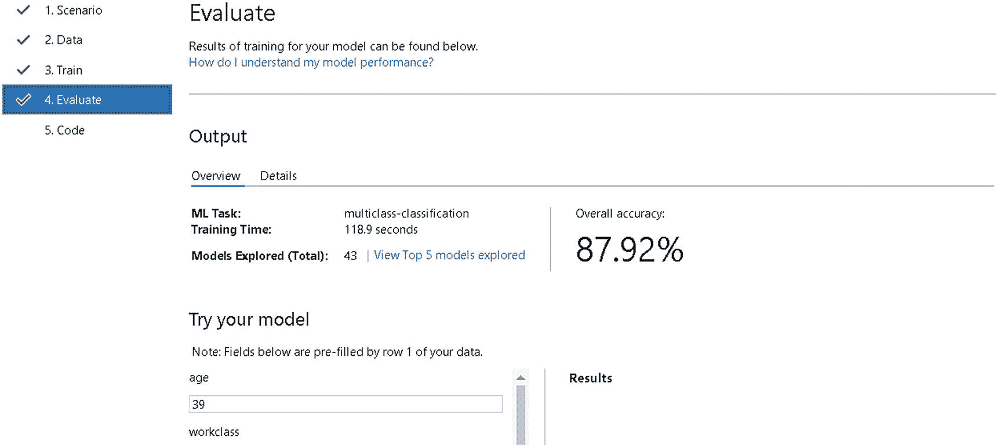

图 5-10

模型构建器上的评估选项卡，显示最佳发现模型的总体准确性

这是一个非常好的仪表盘

*   模型准确性的最终得分

*   一个即时生成的界面，用于测试模型

*   尝试的模型总数(本例中为 43；想象一下手动尝试这些需要多长时间)

按照向导中步骤 5 的指示，模型的逻辑下一步(如果您非常满意)是将生成的项目添加到解决方案中(图 [5-11](#Fig11) )。

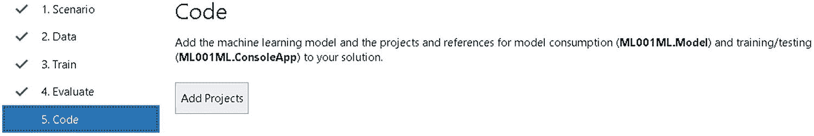

图 5-11

模型生成器生成代码添加提示界面

一旦完成，几个项目将被添加到向导解释的解决方案中(图 [5-12](#Fig12) )。

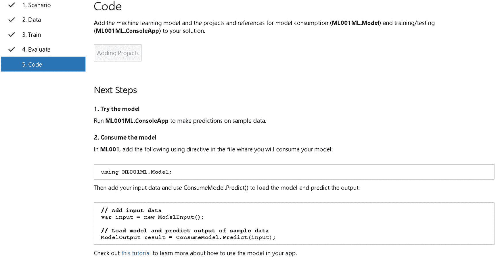

图 5-12

显示要添加的生成代码的说明

这里显示了几个添加到您现有解决方案中的项目(图 [5-13](#Fig13) )。

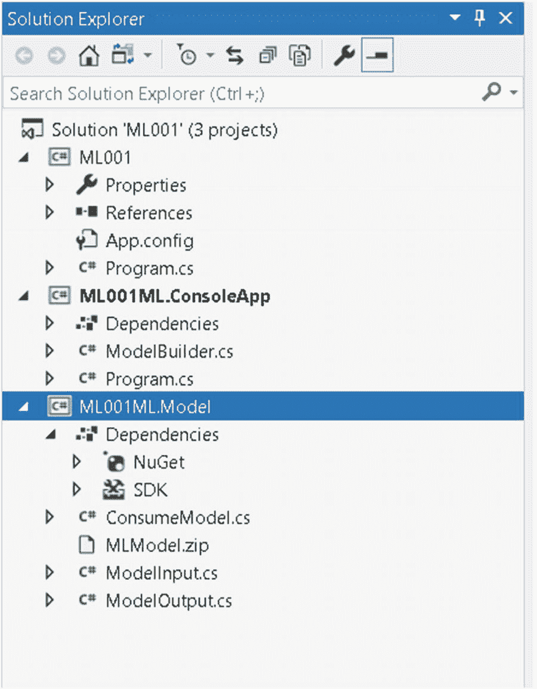

图 5-13

显示了由模型构建器向导添加的几个生成的项目

的。ConsoleApp 是显示如何使用生成的模型的客户端应用程序。

## 评估模型

还生成了一个名为`ModelBuilder.cs`的类，它有所有的逻辑来查看当前模型执行的好坏。有几个矩阵可以确定这一点。

### 混淆矩阵

顾名思义，混淆矩阵是预测输入标签时算法混淆程度的度量。混淆矩阵基本上由四个值组成:

*   TP(真正数)

*   假阳性

*   TN(真阴性)

*   假阴性

这幅图很好地抓住了混淆矩阵的本质(图 [5-14](#Fig14) )。

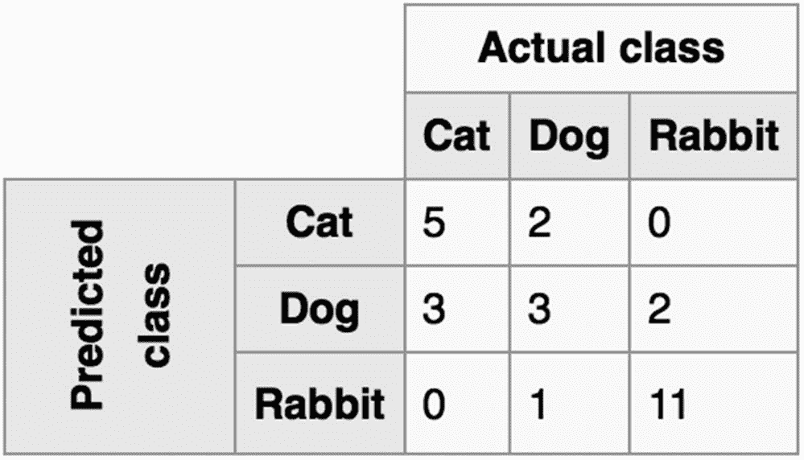

图 5-14

尝试识别猫、狗和兔子的分类任务的样本混淆矩阵

*   ***【TP】***:分类将一个实际真标签标注为真的预测集合。

*   ***【TN】***:分类将一个实际的假标签标注为假的预测集。

*   ***FP*** :分类将一个实际的假标签标注为真的预测集。这就是所谓的 I 型误差。

*   **:分类将一个实际的真标签标注为假的预测集。这就是所谓的第二类错误。**

 **从混淆矩阵中计算出两个非常重要的度量。这些叫做精确和回忆。这些是根据以下公式计算的:

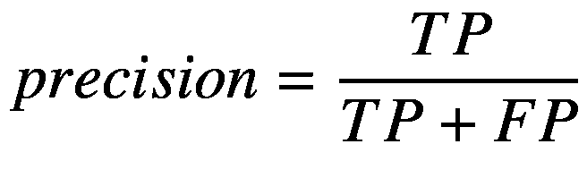

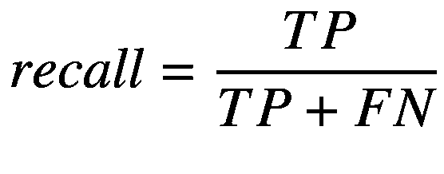

很难比较具有明显不同的精确度和召回率的多个模型。因此，计算它们的调和平均值，这是确定模型性能的非常流行的度量。这种方法被称为 F1 分数。公式给出如下:

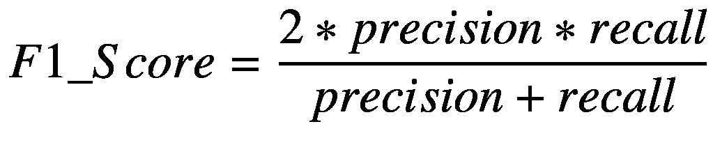

F1 分数越高越好。要查看已解决问题的混淆矩阵，请在`PrintMulticlassClassificationFoldsAverageMetrics`方法中添加以下几行:

```py
var confusionMatrices = crossValResults.Select(r => r.Metrics.ConfusionMatrix);

foreach (var confusionMat in confusionMatrices)
{
     Console.WriteLine(confusionMat.GetFormattedConfusionTable());
}

```

这将打印出如图 [5-15](#Fig15) 所示的所有混淆矩阵(由于空间限制，仅显示了两个)。

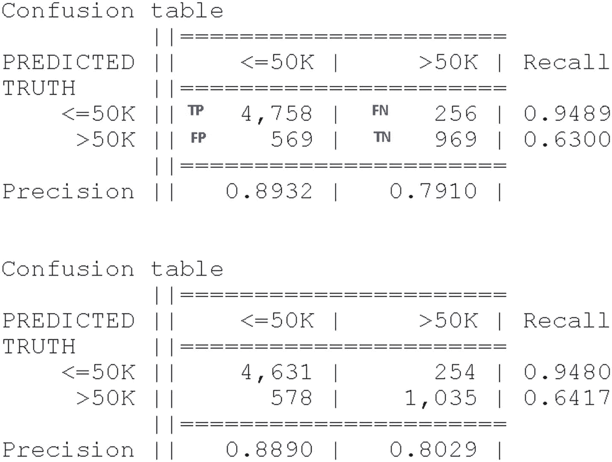

图 5-15

显示已解决的工资预测问题的格式化混乱矩阵

第二个混淆矩阵显示，它预测 4631 个条目为<= 50 and that is actually true, and 1035 entries are predicted as > 50K，这实际上也是正确的。因此，TP = 4631 且> 50K 确定为<=50K in 578 cases and FP = 578 and FN = 254\. Using the formula, recall is TP/(TP+FN) => 0.9480，精度为 TP/(FP+TP) => 0.8890。

我用黄色标注了图像中的方框 TP，以此作为记忆图。很容易记住，矩阵的各部分以逆时针方式在四个象限中给出，从左上开始依次是 TP、FP、TN 和 FN。前两个象限属于阳性结果，而后两个象限属于阴性结果，并且在这两种情况下都是真案例后面跟着假案例。

*   ***微精度*** :我们从模型中得到正确答案的频率。如果您只想计算一个度量来检查分类算法的性能，那么就使用这个度量。

*   ***宏观精度*** :这基本上是为数据集中的每个类/标签计算的微观精度的平均值。

### 原木损失

对数损失(与交叉熵相关)衡量分类模型的性能，其中预测输入是介于 0 和 1 之间的概率值。我们的机器学习模型的目标是最小化这个值。完美的模型的对数损失为 0。随着预测概率偏离实际标签，测井曲线损失增加。因此，当实际观测值标签为 1 时，预测概率为 0.012 将是错误的，并会导致较高的对数损失。

测井曲线损失公式:

对于二进制分类

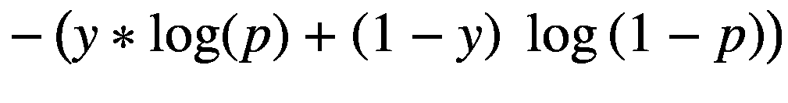

对于多类分类

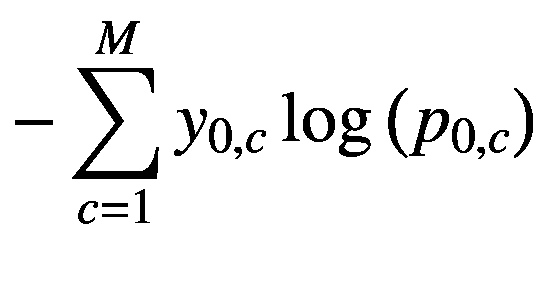

为了查看模型的执行情况，从 ML 调用 CreateModel 方法。ConsoleApp 应用程序可以这样制作

```py
ModelBuilder.CreateModel();

```

这将为您生成这样的结果(图 [5-16](#Fig16) )。

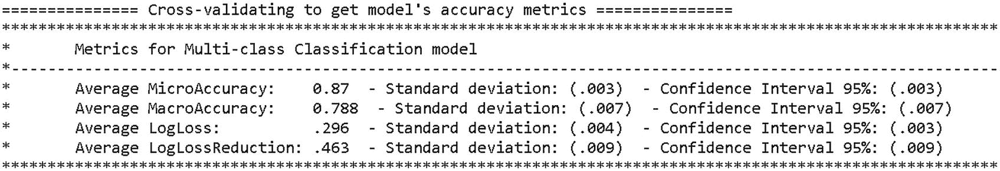

图 5-16

显示已解决的工资预测问题的格式化混乱矩阵

如你所见，这个模型做得相当好，因为微观精度接近 1，对数损失非常小。默认生成的代码没有打印混淆矩阵细节的代码。但是，您可以通过添加以下代码轻松实现这一点:

```py
var confusionMatrices = crossValResults.Select(r => r.Metrics.ConfusionMatrix);

in
public static void PrintMulticlassClassificationFoldsAverageMetrics(IEnumerable<TrainCatalogBase.CrossValidationResult<MulticlassClassificationMetrics>> crossValResults)

```

所有这些矩阵都可以作为`MulticlassClassificationMetrics`的属性，如下所示:

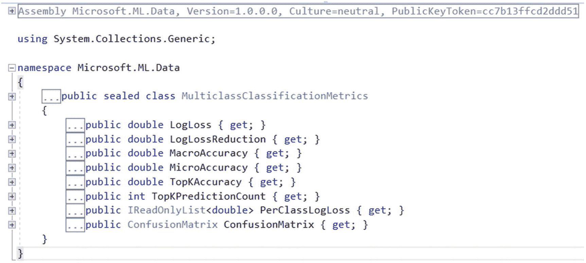

## ML.NET 分类培训师

ML.NET 为二元和多元分类提供了几个训练器。

## 二元分类器

表 [5-1](#Tab1) 显示了 ML.NET 可用的几种二元分类器以及它们在框架中的位置。

表 5-1

二元分类器及其在框架中的位置

<colgroup><col class="tcol1 align-left"> <col class="tcol2 align-left"></colgroup> 
| 

分类器名称

 | 

封装为

 |
| --- | --- |
| `AvergePerceptron` | `BinaryClassification.Trainers.AveragedPerceptron` |
| `FieldAwareFactorizationMachine` | `BinaryClassification.Trainers. FieldAwareFactorizationMachine` |
| `LbfgsLogisticRegression` | `BinaryClassification.Trainers. LbfgsLogisticRegression` |
| `LinearSvm` | `BinaryClassification.Trainers.LinearSvm` |
| `Prior` | `BinaryClassification.Trainers.Prior` |
| `SdcaLogisticRegression` | `BinaryClassification.Trainers. SdcaLogisticRegression` |
| `SdcaNonCalibrated` | `BinaryClassification.Trainers.SdcaNonCalibrated` |
| `SgdCalibrated` | `BinaryClassification.Trainers.SgdCalibrated` |
| `SgdNonCalibrated` | `BinaryClassification.Trainers.SgdNonCalibrated` |
| `FastTree` | `BinaryClassification.Trainers.FastTree` |
| `FastForest` | `BinaryClassification.Trainers.FastForest` |

## 多类分类器

表 [5-2](#Tab2) 显示了 ML.NET 可用的几种多类分类器以及它们在框架中的位置。

表 5-2

多类分类器及其在框架中的位置

<colgroup><col class="tcol1 align-left"> <col class="tcol2 align-left"></colgroup> 
| 

分类器名称

 | 

封装为

 |
| --- | --- |
| `LbfgsMaximumEntropy` | `MulticlassClassification.Trainers.``LbfgsMaximumEntropy` |
| `NaiveBayes` | `MulticlassClassification.Trainers.NaiveBayes` |
| `OneVersusAll` | `MulticlassClassification.Trainers.OneVersusAll` |
| `PairwiseCoupling` | `MulticlassClassification.Trainers.PairwiseCoupling` |
| `SdcaMaximumEntropy` | `MulticlassClassification.Trainers.``SdcaMaximumEntropy` |
| `SdcaNonCalibrated` | `MulticlassClassification.Trainers.``SdcaNonCalibrated` |

## 为分类器设置选项

如果仔细查看生成的代码，您会看到 OneVersusAll 的参数是这样设置的。这里的代码打印得很漂亮，以便于阅读。生成的代码不是漂亮打印的。

```py
var trainer = mlContext.MulticlassClassification.Trainers.OneVersusAll
(
mlContext.BinaryClassification.Trainers.FastTree
 (new FastTreeBinaryTrainer.Options()
        {
                NumberOfLeaves = 26,
                MinimumExampleCountPerLeaf = 1,
                NumberOfTrees = 20,
                LearningRate = 0.05887203f,
                Shrinkage = 3.070639f,
                LabelColumnName = "Salary",
              FeatureColumnName = "Features"
        }),

        labelColumnName: "Salary"
)

```

在这个调用中，正在配置一个多类分类器“OneVersusAll”。它需要两个参数。第一个是二进制分类器，它需要用来区分一个类和所有其他类，以及标签列的名称(在本例中为“Salary”)。

以下截图显示了您可以如何探索这些分类器可以采用的不同选项(图 [5-17](#Fig17) )。

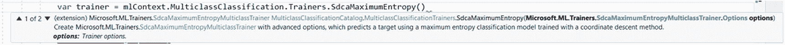

图 5-17

展示如何为 SdcaMaximumEntropy 设置教练选项

通常，大多数训练器有两种过载。第一个采用一个可以存储所有配置值的选项类型，另一个通常允许将所有配置作为文字和数值传递。

这是这个特殊训练器的两个过载:

```py
public static SdcaMaximumEntropyMulticlassTrainer SdcaMaximumEntropy(this MulticlassClassificationCatalog.MulticlassClassificationTrainers catalog, SdcaMaximumEntropyMulticlassTrainer.Options options);

public static SdcaMaximumEntropyMulticlassTrainer SdcaMaximumEntropy(this MulticlassClassificationCatalog.MulticlassClassificationTrainers catalog, string labelColumnName = "Label", string featureColumnName = "Features", string exampleWeightColumnName = null, float? l2Regularization = null, float? l1Regularization = null, int? maximumNumberOfIterations = null);

```

所以我们可以这样配置这样一个训练器(这个用的是第二个重载)

```py
var trainer = mlContext.MulticlassClassification.Trainers.SdcaMaximumEntropy("Salary", "Features", null, 0.2334f, 0.454f, 100);

```

或者像这样

```py
var trainer =
mlContext.MulticlassClassification.Trainers.SdcaMaximumEntropy
 (
new Microsoft.ML.Trainers.SdcaMaximumEntropyMulticlassTrainer.Options()
            {
                BiasLearningRate = 0.35f,
                ConvergenceCheckFrequency = null,
                ConvergenceTolerance = 0.23f,
                FeatureColumnName = "Features",
                ExampleWeightColumnName = string.Empty,
                L1Regularization = 0.12f,
                L2Regularization = 0.22f,
                LabelColumnName = "Salary"

            });

```

所有其他训练器都可以这样配置。

## 摘要

在本章中，您已经学习了如何使用 model 模型构建器为您的数据集定位/发现完美或接近完美的分类器。您还学习了如何评估模型。流程总是准备数据，将数据提供给模型构建器以定位/发现最佳模型，然后在该模型上运行几个实验以使其性能更好。****