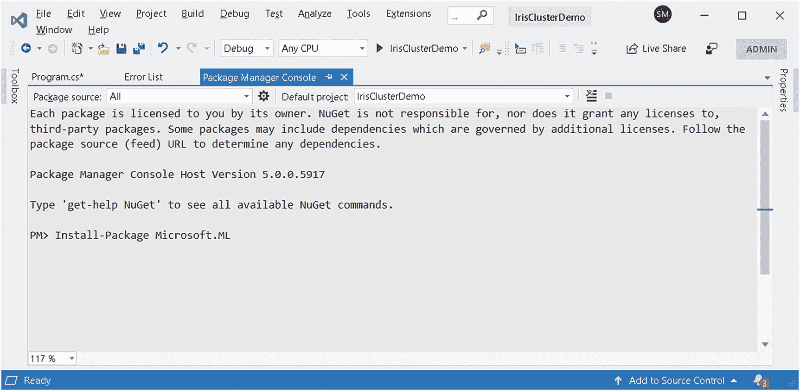

# 六、聚类


## 介绍

有时，我们会准备一份长长的购物清单，准备好去超市买我们想要的东西。然而，有时中午吃糖会让我们像拿起一块巧克力的飞镖一样去超市。准备购物清单的人通常比不准备的人在商店里花更多的时间。从商店购买者的角度来看，花更多时间在商店是一件好事。这些买家就是我们所说的“有组织的买家”。他们知道自己想要什么，以及想要多少。另一方面，我们也有一些买家，他们只是因为一个真正的身体/精神需求触发而去商店挑选一两件商品。这些人就是我们所说的“无组织买家”。聚类是一种无监督的机器学习技术，可以自动对数据集进行分类，就像这些客户/买家对于商店一样。更一般地说，聚类可以被认为是对事物、行为等的自动分组。对于数据集中存在的组的数量，显然有一个已知的正确答案，但是不可能事先知道每个数据集。

## 本章的目标

在这一章中，你将学习一些将一个数据集聚类/分离成多个聚类的算法。我们刚刚讨论的例子有两个组或集群，一个包含有组织的购买者，另一个包含无组织的购买者。阅读完本章后，你将对流行的聚类算法如何工作以及如何使用 ML.NET 测量它们的性能有一个透彻的理解。

### K 均值背后的直觉

聚类中最常用的算法之一是 *K-Means 聚类*算法。它依赖于这样一个事实:任何事物都可以用 N 维空间中的一个向量来表示。这可能一开始听起来非常复杂，但事实并非如此。这只是几何学的一种特殊用途。我将在这里解释它。

高中数学，你学过坐标几何。现在，我们将从几何角度解释聚类问题，这是基于你在坐标几何中学到的理论。相信我！

正如您在下面的文本中所看到的，每个顾客都可以用二维平面上的一个点来表示，其中 X 坐标表示在商店中花费的时间，Y 坐标表示他们购买的平均商品数量。所以你现在可以从图 [6-1](#Fig1) 的假想图中看到，左下角的点表示在商店逗留时间较短(X 值较低)和购买较少商品(Y 值较低)的买家。商店希望将这些人贴上“无组织购买者”的标签——不是贴在他们的脸上，而是在商店的数据库里！

在另一个极端，有些人在店里花了更多的时间，为所有其他顾客购买了比平均水平更多的商品。商店希望将这些人归类为“有组织的买家”。

圆形虚线所画的点周围的气泡表示集群/组。你可以把这些气泡想象成星团的边界或轮廓。如果你喜欢类比，这些更像是保护内部集群的边界墙。因此，落在这个包含圆之间的任何点都被认为是星团的一员。


图 6-1

显示了客户细分中的两个客户群

聚类算法的主要目标是在同一个聚类中移动密切相关的数据点(在本例中，是每个客户的数据)，使得它们的距离(也称为*聚类内距离*)尽可能小，而聚类之间的距离(也称为*聚类间距离*)尽可能大。在本章的后面，你将看到如何使用几个矩阵来量化一个聚类算法的性能。

#### 一点数学知识

将客户分成几个集群的行为称为“*客户细分*”，是聚类算法的一个流行应用。此外，很容易从已经有意义的数据的几个维度开始，并逐渐使表示更详细。

每个客户在二维空间中被表示为一个点。假设我们将第*个*客户表示为`Cust` `i`。

那么，我们可以写


其中 *x* <sub>*i*</sub> 表示在商店花费的时间，而 *y* <sub>*i*</sub> 表示购买的商品数量。

#### 第三轴及以后

到目前为止，我们已经将每个客户的数据表示为一个二维点，其中两个轴是在商店花费的时间和购买的平均商品数量。然而，正如您可能想象的那样，它可以扩展到包含更多的细节。例如，如果我们想要以三维形式表示客户的数据，每月的访问次数可以是第三个值。【T2

以此类推，你可以想象一个客户可以用`m`-维空间中的一个`m`点来表示，像这样:


#### 接近的概念

现在，我们已经成功地将每个客户表示为一个数据点，我们可以使用您在坐标几何中学习的欧几里得距离函数来查找他们之间的距离。这个距离会让我们感觉到两个数据点之间的接近(在本例中是两个客户)。这将是将两个客户放在同一个群或组中的相近位置所需的线索。下图(图 [6-2](#Fig2) )试图进行可视化。


图 6-2

显示了几个集群和一个未知的数据点

`d_U_Center_1`是聚类质心 Center_1(聚类 1 的聚类质心)和未知数据点之间的欧几里德/曼哈顿距离。

`d_U_Center_2`是聚类质心 Center_2(聚类 2 的聚类质心)和未知数据点之间的欧几里德/曼哈顿距离。

如果`d_U_Center_1 < d_U_Center_2`，那么未知数据点应该被附加到第一个聚类，因为该聚类的质心比另一个质心更近。否则，它应该连接到第二个集群。

该聚类分配过程是迭代的，并且在 K-均值聚类的整个部分继续进行，其中聚类的初始猜测发生变化，并最终确定为聚类的最终质心。

使用的距离度量通常是欧几里德距离或曼哈顿距离(也称为城市街区距离)。下一节将向您介绍这些距离矩阵。

#### 欧几里德距离


图 6-3

欧几里得距离

如果有两个点分别用 *p* ( *x* 、 *y* )和 *q* ( *x* 、 *y* )表示，则这两个点之间的欧氏距离由下面的公式表示:


这里， *p* <sub>*x*</sub> 表示点 p 的 x 坐标值，依此类推。

#### 多维欧氏距离

可以看到，在前面的方程上外推，我们可以得到计算`m`维中两点间欧氏距离的一般方程如下:


有时，可能需要使用其他距离度量，如曼哈顿或城市街区距离，因为计算欧几里得距离的计算成本很高。下面是曼哈顿或城市街区距离的等式:


#### 质心，群集的中心

在数学和物理学中，形心指的是这样一个点，它是任何轮廓的给定形状上所有点的平均值。图 [6-4](#Fig4) 显示了凹多边形形心的计算公式。这个形状是故意画成这样的，因为在现实生活中，数据点可以像这样分散。质心是所有坐标的平均值，如图 [6-4](#Fig4) 所示。


图 6-4

解释质心

所以在 m 维的地方，质心可以用以下公式表示，其中 C <sub>x</sub> 表示 X 坐标值以此类推，C <sub>m</sub> 表示质心在 *m* th 坐标的值:


所以你可以看到，质心坐标只不过是给定轴上该形状上所有点的投影坐标的平均值。下面的 C#函数查找质心:

```cs
List<double> CentroidLocations(List<List<double>> points)
=> Enumerable.Range(0,points[0].Count)
  .Select(z =>  points.Select(p =>p[z]).ToList())
  .Select(z => z.Average())
  .ToList();

```

以下函数计算以 N 维表示的任意两点之间的欧几里德距离:

```cs
double EuclideanDistance(List<double> p, List<double> q)
  => Math.Sqrt(p.Zip(q,(px,qx) =>
               Math.Pow(px - qx,2)).Sum());

```

下面是一个客户端代码，它使用这两个函数来让您更清楚地理解到目前为止所提到的一些要点:

```cs
void Main()
{
            var p = new List<double>(){1,2,3};
            var q = new List<double>() { 1, 3, 4 };
            var r = new List<double>() { 1, 2, 31 };
            var s = new List<double>() { 1, 3, 41 };
            var t = new List<double>() { 11, 2, 3 };
            var u = new List<double>() { 1, 31, 4 };
            var centroid = CentroidLocations(new List<List<double>>()
            {
                    p, q, r, s, t
            });
            var distance_centroid_p = EuclideanDistance(centroid,p);
            var distance_centroid_q = EuclideanDistance(centroid,q);
            Console.WriteLine($"distance p and centroid =
                       {distance_centroid_p}");
           Console.WriteLine($"distance q and centroid =
                       {distance_centroid_q}");
}

```

尽管您应该使用 ML.NET 来进行集群，但是了解内部细节总是有好处的。

#### 继续移动质心，直到它不再移动

之所以称之为 K-Means，是因为它对聚类数的初始猜测是 K。然后，这些已确定的质心被声明为聚类质心，并且此类质心的计数成为数据集中可用聚类的计数。

该算法有以下主要步骤:


图 6-5

在虚拟数据集中显示移动的质心

1.  初始化(猜测初始质心位置)。

2.  在每一步更新质心(移动每次迭代计算的质心)。

3.  核实是否需要继续；如果没有，停止并报告集群。

图 [6-5](#Fig5) 试图展示在 K-Means 聚类的迭代过程中，质心是如何在一个步骤中移动的。该图像只显示了几个假想的迭代。显然，在真实情况下，会有更多的迭代。在 ML.NET K-Means 选项中，您可以通过设置来设置最大迭代次数

`KMeansTrainer.Options.MaximumNumberOfIterations`

注意，点`P1`最初属于第一簇(质心位于`C1`)，但后来由于簇坐标的移动而属于第二簇(质心位于`C2`)。

K-Means 也需要聚类数作为参数，不出所料，你可以在 ML.NET 在`KMeansTrainer.Options.NumberOfClusters`提供的 K-Means 选项中找到它。

## 初始化

在 K-均值聚类中有几种可能的初始化。您可以选择任意随机点作为初始聚类，或者使用两种可用的优化方法中的任意一种来更智能地猜测初始聚类。

ML.NET 提供的三种初始化变体是

1.  `PlusPlus`(这是 K-Means++算法的一个实现)

2.  `Yinyang`(这是阴阳优化的一个实现)

3.  `Random`(随机选取点作为质心)

    ***PlusPlus*** :如果初始质心是随机选取的，那么就有可能得到定义不清的簇，这些簇彼此靠得太近。这是随机分配初始质心的一个缺点。

    ***【阴阳】*** :这种优化技术依赖于除一个以外的两个滤波器，从而减少了所需的距离计算次数。这个方案的名字来源于中国哲学阴阳，这是两种创造和谐的对立力量。

    ***随机*** :这是随机选择质心的天真选项。

所有这些初始化策略都可以作为 K-Means 训练器的选项`KMeansTrainer.InitializationAlgorithm`。

表 6-1

显示通过 Means 选项初始化 K 均值的选项

<colgroup><col class="tcol1 align-left"> <col class="tcol2 align-left"></colgroup> 
| 

算法

 | 

封装为

 |
| --- | --- |
| k-表示++的意思 | `KMeansTrainer.InitializationAlgorithm.KMeansPlusPlus` |
| 黑白 | `KMeansTrainer.InitializationAlgorithm.KMeansYinyang` |
| 随意 | `KMeansTrainer.InitializationAlgorithm.Random` |

## 质心更新

在迭代过程的每一步，与这些点相关的质心都会发生变化。渐渐地，到最后，当算法收敛时，质心变得更加静止；换句话说，它们的坐标不再移动太多。

### 利用 ML.NET 聚类鸢尾花

这是容易的部分。原因如下:

***第一步*** :新建一个。NET core 控制台应用程序(图 [6-6](#Fig6) )。


图 6-6

显示控制台应用程序

***第二步*** :配置项目。


图 6-7

提供一个名称

***第三步*** :获取 NuGet 包。


***第四步*** :领取包裹。



***第五步*** :安装 NuGet 后。


图 6-8

展示了 ML.NET nu get 包的成功安装

***第六步*** :软件包安装完成后，智能感知会计算出路径。


***第七步*** :添加鸢尾花数据集文件的路径。

```cs
string _dataPath = @"C:\Users\Sudipta\Downloads\iris.data";

```

***第八步*** :在`IDataView`实例中添加代码读取虹膜数据集。

```cs
IDataView dataView = mlContext.Data.LoadFromTextFile<IrisData>
(_dataPath, hasHeader: true, separatorChar: ',');

```

***第九步*** :添加特征列名称。

```cs
string featuresColumnName = "Features";

```

***第十步*** :添加代码为 K-Means 定制选项。

```cs
var options = new Microsoft.ML.Trainers.KMeansTrainer.Options
{
   InitializationAlgorithm =
             Microsoft.ML.Trainers.KMeansTrainer.
              InitializationAlgorithm.KMeansYinyang,
   MaximumNumberOfIterations = 100,
   NumberOfThreads = 4,
   NumberOfClusters = 3,
   OptimizationTolerance = 0.002F,
   FeatureColumnName = featuresColumnName
};

```

***第十一步*** :创建流水线。

```cs
var pipeline =
mlContext.Transforms
.Concatenate(featuresColumnName,
 "SepalLength", "SepalWidth", "PetalLength", "PetalWidth")
.Append(mlContext.Clustering.Trainers.KMeans(options));

```

***第十二步*** :拟合模型。

```cs
var model = pipeline.Fit(dataView);

```

此时，模型已创建，训练也已完成，现在您可以使用该模型来预测新数据点应该属于哪个分类。以下步骤显示了如何针对给定的数据点进行预测:

***第十三步*** :创建一个示例实例。

```cs
IrisData Setosa = new IrisData
            {
                SepalLength = 5.1f,
                SepalWidth = 3.5f,
                PetalLength = 1.4f,
                PetalWidth = 0.2f
            };

```

***第十四步*** :从模型中创建预测引擎，进行预测。

```cs
var predictor = mlContext.Model
.CreatePredictionEngine<IrisData, ClusterPrediction>(model);

var prediction = predictor.Predict(Setosa);

Console.WriteLine($"Cluster:{prediction.PredictedClusterId}");
Console.WriteLine($"Distances: {string.Join(" ",
prediction.Distances)}");

```

这将打印以下输出:

```cs
Cluster: 2
Distances: 16.87281 0.03447342 0.630455

```

距离表示该给定数据点与计算出的聚类质心的距离。由于与第二个聚类的距离最小，因此该算法确定给定的数据点应该属于这个聚类。

### 获取质心位置

要获得质心的位置，请添加以下代码:

```cs
VBuffer<float>[] centroids = default;

var modelParams = model.LastTransformer.Model;
modelParams.GetClusterCentroids(ref centroids, out int k);

//Printing coordinates of the centroids
for (int i = 0; i < centroids.Length; i++)
{
  Console.WriteLine($"Centroid #{i + 1} is located at " +
                    $@"({centroids[i].GetValues()
                                     .ToArray()
                          .Select(t => t.ToString("F2"))
                    .Aggregate((f, s) => f + "," + s)})");

}

```

对于这种鸢尾花，我们得到以下结果:

```cs
Cluster: 1
Distances: 0.02159119 11.69127 25.59897
Centroid #1 is located at (5.01,3.42,1.46,0.24)
Centroid #2 is located at (5.90,2.75,4.39,1.43)
Centroid #3 is located at (6.85,3.07,5.74,2.07)

```

在第二次运行时，您可以获得以下结果(这在您的终端可能会有所不同):

```cs
Cluster: 2
Distances: 11.64523 0.02159119 25.31428
Centroid #1 is located at (5.88,2.74,4.39,1.43)
Centroid #2 is located at (5.01,3.42,1.46,0.24)
Centroid #3 is located at (6.85,3.08,5.72,2.05)

```

这是因为`MLContext`是在没有种子的情况下创建的，因此获得的结果是不确定的。如果你想确保从 ML.NET 的机器学习流水线中得到相同的结果，那么就用这样的种子创建`MLContext`(如图 [6-9](#Fig9) 所示)。


图 6-9

显示带有种子的`MLContext`声明，以确保确定性行为

在初始化设置为 seed : 1 之后，几次运行会产生以下输出，并且您可以根据需要多次运行该脚本，每次运行都会完全相同。

```cs
Cluster: 1
Distances: 0.02159119 25.59896 11.69127
Centroid #1 is located at (5.01,3.42,1.46,0.24)
Centroid #2 is located at (6.85,3.07,5.74,2.07)
Centroid #3 is located at (5.90,2.75,4.39,1.43)

```

### 用基本事实验证模型

在当前的实验设置中，我们有一个不适当的优势，这在大多数情况下不会出现在真实的集群实验中。我们有每朵花应该属于的原始标签或聚类信息；我们可以使用这些信息来验证聚类模型是如何工作的。属于正确簇的花的数量越多越好。

在数据集中，标签“鸢尾-Setosa”、“鸢尾-杂色”和“鸢尾-海滨”连续出现。如果您使用确定性模型，那么集群将被相应地放置。换句话说，第一簇将表示“鸢尾”花簇，依此类推。

添加以下代码来检查模型的基础事实:

```cs
//Ground truth verification
string[] labels = new string[]
{ "Iris-setosa","Iris-versicolor", "Iris-virginica" };

var sepalLengths = dataView.GetColumn<float>("SepalLength");
var petalLengths = dataView.GetColumn<float>("PetalLength");
var sepalWidths  = dataView.GetColumn<float>("SepalWidth");
var petalWidths  = dataView.GetColumn<float>("PetalWidth");
Func<string, int> toIndex = p => Array.IndexOf(labels, p) + 1;

var groundTruths = File.ReadAllLines(@"iris.data")
                       .Skip(1)//Skip header
                       .Select(t => toIndex( t.Split(',')[4]));

int count = 0;
for (int index = 0; index < sepalLengths.Count(); index++)
{
       IrisData temp = new IrisData
       {
                    SepalLength = sepalLengths.ElementAt(index),
                    SepalWidth = sepalWidths.ElementAt(index),
                    PetalLength = petalLengths.ElementAt(index),
                    PetalWidth = petalWidths.ElementAt(index)
       };

var predicted = predictor.Predict(temp);
//Ground truth check
if (predicted.PredictedClusterId !=
           groundTruths.ElementAt(index))
                    count++;
}

var totalRows = sepalLengths.Count();
double correctlyClustered =
  Math.Round( 100*(double)(totalRows - count) / totalRows,2);

Console.WriteLine($"{correctlyClustered}% belong to the right cluster");

```

当使用`KMeansPlusPlus`策略运行时，Iris 数据集被证明是非常好的聚类。使用`KMeansPlusPlus`，89.33%的记录被正确聚类。对于随机初始化，只有 2%被正确聚类。因此，您可以看到初始化对聚类算法的性能有很大的影响。

### 在野外评估模型

在缺乏基础事实的情况下，通常根据两个因素对模型进行评估:

1.  聚类中元素/数据点的密集程度。

2.  不同的星团之间有多远？

ML.NET 在`ClusteringMetrics`类中提供了这三个指标。

## 平均距离

平均分。对于 K-Means 算法,“得分”是从质心到示例的距离。因此，平均分数是样本与聚类质心接近程度的度量。换句话说，它是“集群紧密度”的度量。但是，请注意，只有当集群数量增加时，该度量才会减少，在极端情况下(每个不同的示例都是自己的集群)，它将等于零。该距离越低，越好——描绘紧密结合的集群。

## 戴维斯-波尔丁指数(DBI)

Davies-Bouldin 指数是对簇内分散程度和簇间距的度量。数字越大越好——表示簇的质心实际上分散得很远。

## 标准化互信息

归一化互信息是变量相互依赖性的度量。仅当提供了标签列时，才会计算此指标。

对于当前的示例策略，这些是与完成聚类过程的时间一起计算的。这些细节记录在表 [6-2](#Tab2) 中。

要获得这些关于性能的数据，请使用以下代码:

表 6-2

结果

<colgroup><col class="tcol1 align-left"> <col class="tcol2 align-left"> <col class="tcol3 align-left"></colgroup> 
| 

战略

 | 

韵律学

 | 

花费的时间(100 次迭代)

 |
| --- | --- | --- |
| **随机** | 0.968531201680501(公元)0.952212697058903 (DBI)1 (NMI) | 525 毫秒 |
| **阴阳** | 0.5262699762980140.662323100264084one | 522 毫秒 |
| 加 | 0.5262711461385090.662323100264084one | 471 毫秒 |

```cs
ClusteringMetrics metrics =  mlContext.Clustering.Evaluate(model.Transform(dataView)
,"PredictedLabel", "Score", "Features");

Console.WriteLine(metrics.AverageDistance);
Console.WriteLine(metrics.DaviesBouldinIndex);
Console.WriteLine(metrics.NormalizedMutualInformation);

```

从表中可以看出，`KMeansPlusPlus`是最快的，也可能是最好的选择，因为它在基本事实验证中表现得最好。

## 摘要

你已经学习了 K-Means 是如何工作的，以及如何衡量它的表现。有时，当基本事实标签已知时，似乎聚类基本上就是分类。但是，聚类通常是在地面真实标签未知的数据集上进行的。认识到聚类问题没有精确的正确答案可能是有意义的，但是作为聚类实验的结果，足够接近的近似值足以验证任何假设。例如，商店可能会猜测有三种类型的买家，需要进行聚类实验来验证这一假设，然后商店可以找到这些客户，并给出定制优惠，这将比一揽子优惠更能吸引他们。然而，还有其他种类的聚类算法，如基于密度的聚类算法 DBSCAN，它可能优于 K-Means，因为 K-Means 在很大程度上是从一组不起眼的聚类开始的(即使使用 KmeansPlusPlus)。K-Means 的缺点是您必须提供 K 的值。但是领域知识或假设可以帮助提供初始猜测。